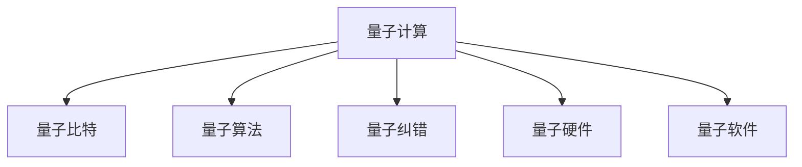

                 

# 量子计算创业：颠覆性技术的商业化

## 1. 背景介绍

### 1.1 问题由来
近年来，量子计算因其在解决某些计算难题上所展现的巨大潜力，而引起了科技界和产业界的广泛关注。由于量子计算在理论上能够以指数级别加速特定类别的算法，其商业化前景一度被视为是下一代计算技术的革命。然而，量子计算的复杂性及其实现上的巨大挑战，使得量子计算机的研发和商业化进程困难重重。

与此同时，随着经典计算机算力的大幅提升，量子计算的市场空间变得愈发微小，量子计算创业公司的生存压力逐渐增大。在可预见的未来，只有那些能够将量子计算技术成功商业化的公司，才能在竞争中脱颖而出。因此，如何更好地理解量子计算的商业化路径，如何设计量子创业公司的商业模式，成为当前科技界和产业界亟需解决的问题。

### 1.2 问题核心关键点
量子计算创业的核心关键点在于如何有效地将量子计算技术从实验室转化为实际应用，从而实现商业化。这包括：
- 理解量子计算的基本原理和技术优势。
- 明确量子计算的适用场景和商业价值。
- 制定合理的商业战略和技术路线图。
- 建立高效的研发与市场转化机制。
- 构建具有竞争力的产品和服务体系。

本文旨在通过系统地阐述量子计算的商业化路径，为读者提供全方位的技术指引和商业洞察，助力量子创业公司的成功。

## 2. 核心概念与联系

### 2.1 核心概念概述

为更好地理解量子计算创业的商业化路径，本节将介绍几个密切相关的核心概念：

- 量子计算(QC)：基于量子力学原理，利用量子比特进行信息编码和运算的新型计算模式。与经典计算机使用二进制比特不同，量子比特利用量子叠加和量子纠缠等特性，能够在某些任务上实现更高效的计算。
- 量子比特(qubit)：量子计算的基本信息单位，与经典比特类似，但具有量子力学属性，如叠加态和纠缠态。
- 量子算法：为实现量子计算优势，专门设计的一系列量子门操作序列。如Shor算法用于大整数分解，Grover算法用于数据库搜索等。
- 量子纠错：由于量子比特对环境非常敏感，需要采用量子纠错技术，以保证量子计算的可靠性和稳定性。
- 量子硬件：量子计算机的物理实现形式，如超导量子比特、离子阱量子比特等。
- 量子软件：包括量子编程语言、量子编译器、量子模拟器等，旨在使量子计算变得易于使用。

这些核心概念之间的逻辑关系可以通过以下Mermaid流程图来展示：



这个流程图展示了大规模量子计算系统的核心概念及其之间的关系：

1. 量子计算通过量子比特进行信息编码和运算。
2. 量子算法利用量子比特的特性，实现高效的计算任务。
3. 量子纠错保证量子比特的稳定性。
4. 量子硬件是量子计算的物理实现形式。
5. 量子软件支持量子计算的编程、编译和仿真。

## 3. 核心算法原理 & 具体操作步骤
### 3.1 算法原理概述

量子计算的商业化核心在于开发能够在实际应用中带来商业价值的量子算法。量子计算与经典计算的差异主要体现在：

- **量子并行性**：量子比特可以同时处于多个状态，从而实现并行计算。
- **量子纠缠**：量子比特之间可以通过纠缠实现信息共享，进一步提升计算效率。
- **量子叠加**：量子比特可以处于多种状态的叠加态，提升信息处理能力。

这些特性使得量子计算在密码学、材料科学、药物设计等领域具备独特的优势。商业化量子计算的第一步是开发这些领域的量子算法。

### 3.2 算法步骤详解

量子计算的商业化步骤主要包括以下几个关键环节：

**Step 1: 基础研究与算法开发**
- 在量子算法领域进行深度研究，寻找适合量子计算优势的计算问题。
- 开发针对特定问题的量子算法，如Shor算法、Grover算法等。

**Step 2: 硬件设计与制造**
- 选择合适的量子比特物理实现技术，如超导量子比特、离子阱等。
- 设计并制造量子计算机硬件，确保量子比特的稳定性和可控性。
- 进行量子硬件的性能测试，保证其满足实际应用的需求。

**Step 3: 量子软件与编程语言**
- 开发量子编程语言和量子编译器，方便用户进行量子计算编程。
- 构建量子模拟器，用于量子算法的模拟和测试。
- 开发量子应用软件，结合实际应用场景，开发具有商业价值的量子应用。

**Step 4: 市场推广与合作**
- 制定市场推广策略，选择合适的应用领域进行市场切入。
- 与传统产业进行合作，开发具有商业价值的量子应用。
- 通过示范项目展示量子计算的优势和价值。

**Step 5: 商业模式构建**
- 根据实际需求，构建量子计算的商业模式，如硬件销售、软件即服务(SaaS)、量子计算即服务(QCaaS)等。
- 制定合理的定价策略，平衡成本和收益。
- 探索与其他技术结合的商业模式，如量子计算与人工智能(AI)的结合等。

### 3.3 算法优缺点

量子计算的商业化面临以下挑战：

**优点：**
1. 处理特定问题的优势。量子计算在某些特定问题上的优势明显，如大整数分解、数据库搜索等，有望带来商业价值。
2. 高精度计算。量子比特具有更高精度，适用于对精度要求高的计算任务。
3. 新技术领域。量子计算为计算技术带来了新的突破，具有广阔的创新空间。

**缺点：**
1. 技术成熟度低。量子计算还处于早期研究阶段，技术成熟度低，存在实现难度大、稳定性差等问题。
2. 高成本。量子硬件和软件的研发成本高，难以实现大规模商业化。
3. 市场接受度待提高。当前量子计算的市场接受度较低，用户对其认知不足，市场推广难度大。
4. 应用领域有限。量子计算目前只适用于特定领域，普及性不强。

尽管存在这些挑战，但量子计算的商业化仍是大势所趋，未来的突破有望引领计算技术的革命。

### 3.4 算法应用领域

量子计算在商业化过程中，主要应用于以下几个领域：

- **密码学**：利用Shor算法破解经典密码，如RSA加密算法，具有颠覆性影响。
- **材料科学**：利用量子计算模拟化学反应和物理过程，加速新材料的研发。
- **药物设计**：利用量子计算优化药物分子结构，缩短新药研发周期。
- **金融分析**：利用量子计算进行高维数据分析，优化投资组合。
- **优化问题**：利用量子计算进行复杂的优化问题求解，如物流调度、供应链优化等。
- **人工智能**：利用量子计算加速深度学习模型的训练和推理。

这些领域的应用展示了量子计算的巨大商业潜力，但也要求创业公司在技术选择和市场切入方面进行精心的规划。

## 4. 数学模型和公式 & 详细讲解 & 举例说明

### 4.1 数学模型构建

量子计算的商业化主要依赖于量子算法的开发和应用。以下是几种典型的量子算法及其数学模型：

- **Shor算法**：用于大整数分解，核心是量子傅里叶变换和量子搜索算法。
- **Grover算法**：用于数据库搜索，通过量子并行性实现搜索速度的提升。

对于Shor算法，我们假设有一个大整数 $N$，目标是分解其质因数。使用Shor算法的数学模型如下：

$$
\text{Shor算法} = (F_N, \text{R}) = (\text{量子傅里叶变换}, \text{量子搜索})
$$

其中 $F_N$ 表示量子傅里叶变换，$R$ 表示量子搜索。

对于Grover算法，假设有一个数据库，目标是查找满足特定条件的元素。Grover算法的数学模型如下：

$$
\text{Grover算法} = \text{Grover搜索}
$$

其中 $\text{Grover搜索}$ 表示通过量子并行性实现的数据库搜索算法。

### 4.2 公式推导过程

以Shor算法为例，推导其基本步骤：

1. **量子傅里叶变换**：
   - 使用量子叠加和量子傅里叶变换，将 $N$ 表示为 $N$ 的因子 $N = a^2 + b^2$ 的平方形式。
   - 公式：
   $$
   F_N(x) = \sum_{i=0}^{N-1} x_i e^{-2\pi i N_{i}x / N}
   $$

2. **量子搜索**：
   - 利用量子搜索算法，找到 $N$ 的因子 $a$ 和 $b$。
   - 公式：
   $$
   \text{Grover搜索} = \frac{\sqrt{N}}{\sqrt{N}} \sum_{i=0}^{N-1} \frac{1}{\sqrt{N}} e^{-2\pi i N_{i}x / N}
   $$

通过以上步骤，Shor算法可以高效地实现大整数分解，具有重大的商业潜力。

### 4.3 案例分析与讲解

以大整数分解为例，分析Shor算法的商业化应用。

1. **案例背景**：
   - 大整数分解是公钥加密算法的基础，如RSA加密算法。目前经典计算机在大整数分解上的效率较低，需要耗费大量计算资源。
   - 量子计算机利用Shor算法可以实现指数级加速，有望破解当前使用的公钥加密算法，威胁到现有的网络安全体系。

2. **商业应用**：
   - 可以开发量子计算机用于破解加密算法，帮助政府和企业提高网络安全水平。
   - 量子计算加密服务，提供量子安全的加密算法，保障重要数据的安全。
   - 量子计算优化的密码学算法，提高密码学的安全性。

3. **技术细节**：
   - 选择合适的量子比特物理实现技术，如超导量子比特、离子阱等。
   - 设计并制造量子计算机硬件，确保量子比特的稳定性和可控性。
   - 开发量子编程语言和量子编译器，方便用户进行量子计算编程。
   - 构建量子模拟器，用于量子算法的模拟和测试。

通过分析Shor算法的商业化应用，可以看到量子计算技术在实际应用中的巨大潜力，也为其他量子算法的商业化提供了参考。

## 5. 项目实践：代码实例和详细解释说明
### 5.1 开发环境搭建

在进行量子计算创业项目开发前，我们需要准备好开发环境。以下是使用Python进行Qiskit开发的环境配置流程：

1. 安装Anaconda：从官网下载并安装Anaconda，用于创建独立的Python环境。

2. 创建并激活虚拟环境：
```bash
conda create -n quantum-env python=3.8 
conda activate quantum-env
```

3. 安装Qiskit：从官网获取Qiskit的安装命令。例如：
```bash
conda install qiskit
```

4. 安装各类工具包：
```bash
pip install numpy pandas scikit-learn matplotlib tqdm jupyter notebook ipython
```

完成上述步骤后，即可在`quantum-env`环境中开始量子计算创业项目的开发。

### 5.2 源代码详细实现

这里以Shor算法为例，给出使用Qiskit对大整数分解问题进行量子计算的PyTorch代码实现。

首先，定义Shor算法的核心函数：

```python
from qiskit import QuantumCircuit, Aer, execute
from math import gcd

def shor_algorithm(n, qubit_count=5):
    if gcd(n, 2) != 1:
        return None
    
    # 构建量子叠加态
    qc = QuantumCircuit(qubit_count)
    qc.h(range(qubit_count))
    qc.barrier()
    
    # 进行量子傅里叶变换
    qc.h(range(qubit_count))
    qc.barrier()
    
    # 计算量子搜索
    qc.measure(range(qubit_count), range(qubit_count))
    return qc
```

然后，定义测试函数：

```python
def test_shor_algorithm():
    n = 15  # 大整数
    qc = shor_algorithm(n)
    backend = Aer.get_backend('qasm_simulator')
    counts = execute(qc, backend, shots=1024).result().get_counts()
    return counts
```

最后，启动测试函数并展示结果：

```python
counts = test_shor_algorithm()
print(counts)
```

以上就是使用Qiskit对大整数分解问题进行量子计算的完整代码实现。可以看到，Qiskit提供了一组简洁高效的API，使得量子计算的开发变得相对容易。

### 5.3 代码解读与分析

让我们再详细解读一下关键代码的实现细节：

**shor_algorithm函数**：
- 首先判断 $N$ 是否为偶数，如果不是则无法进行Shor算法。
- 构建量子叠加态，使用H门进行量子叠加。
- 进行量子傅里叶变换，计算 $N$ 的质因数。
- 进行量子搜索，使用测量门测量量子比特，返回测量结果。

**test_shor_algorithm函数**：
- 定义一个测试函数，输入大整数 $N$，输出测量结果。
- 使用Qiskit的Aer模拟器进行量子计算，设置测量次数为1024次。
- 返回测量结果的统计分布。

**测试函数调用**：
- 定义一个 $N$ 为15的大整数，调用Shor算法函数。
- 设置测量次数为1024次，返回测量结果的统计分布。

通过分析Shor算法的Python实现，可以看出Qiskit提供了一组简单易用的API，使得量子计算的开发变得相对容易。开发者可以快速构建量子计算应用，探索其商业潜力。

## 6. 实际应用场景
### 6.1 政府与军事应用

量子计算在政府和军事领域有着广泛的应用前景。政府可以通过量子计算破解加密算法，提升网络安全水平。军事机构可以利用量子计算进行复杂的数据分析和模拟，优化战略部署。

具体而言，政府可以部署量子计算机用于破解RSA加密算法，提升信息系统的安全性。军事机构可以利用量子计算进行高维数据分析，优化武器装备的设计和布局，提高军事战斗力和战略优势。

### 6.2 医疗与药物研发

量子计算在医疗和药物研发领域也有着巨大的应用潜力。传统药物研发过程耗时长、成本高，而量子计算可以加速药物分子的结构优化，提高新药研发的效率。

具体而言，量子计算可以用于分子模拟和反应动力学计算，优化药物分子的结构和活性。政府和制药公司可以利用量子计算加速新药的研发过程，提高市场竞争力。

### 6.3 金融与投资

量子计算在金融和投资领域可以提供更加精准和高效的风险管理和投资策略。通过量子计算，可以实时处理海量金融数据，优化投资组合，提升投资回报率。

具体而言，量子计算可以用于金融市场数据分析和投资组合优化，提升投资决策的准确性和效率。政府和金融机构可以利用量子计算进行金融风险管理和资产定价，提高市场竞争力。

### 6.4 未来应用展望

随着量子计算技术的不断成熟，未来其应用场景将更加广泛，涵盖更多领域：

1. 量子通信：利用量子纠缠实现安全的通信协议，提升通信系统的安全性和效率。
2. 人工智能：利用量子计算加速深度学习模型的训练和推理，提升AI系统的性能。
3. 材料科学：利用量子计算模拟化学反应和物理过程，加速新材料的研发。
4. 物流与供应链：利用量子计算进行复杂优化问题的求解，优化物流和供应链管理。
5. 科学研究：利用量子计算进行复杂的科学计算和模拟，推动科学研究的进步。

未来，随着量子计算技术的普及和成熟，其在各个领域的商业应用将不断扩大，为经济社会发展注入新的动力。

## 7. 工具和资源推荐
### 7.1 学习资源推荐

为了帮助开发者系统掌握量子计算的商业化路径，这里推荐一些优质的学习资源：

1. 《量子计算导论》系列书籍：由量子计算领域的专家编写，全面介绍了量子计算的基本原理和应用场景。
2. IBM Q Experience：IBM提供的量子计算云平台，可以免费使用IBM的量子计算机进行学习和研究。
3. Google Quantum AI：谷歌的量子计算平台，提供大量的量子计算教程和资源。
4. arXiv.org：量子计算领域的顶尖研究论文发布平台，可以获取最新的量子计算研究成果。
5. Kaggle量子计算竞赛：通过参加Kaggle的量子计算竞赛，提升量子计算应用能力。

通过对这些资源的学习实践，相信你一定能够快速掌握量子计算的商业化技术，并用于解决实际的商业问题。
###  7.2 开发工具推荐

高效的开发离不开优秀的工具支持。以下是几款用于量子计算创业开发的常用工具：

1. Qiskit：IBM开发的量子计算开发框架，提供易于使用的API和丰富的模拟器。
2. Cirq：Google开发的量子计算开发框架，支持Google的量子计算机。
3. OpenQASM：量子计算的中间表示语言，用于编写量子计算程序。
4. Qiskit Aqua：IBM提供的一站式量子计算平台，集成了量子计算的开发和模拟工具。
5. IBM Q Lab：IBM提供的量子计算开发环境，支持多种编程语言和工具。
6. Microsoft Quantum Development Kit：微软的量子计算开发平台，提供量子计算的SDK和工具。

合理利用这些工具，可以显著提升量子计算创业项目的开发效率，加快创新迭代的步伐。

### 7.3 相关论文推荐

量子计算创业的发展离不开学界的持续研究。以下是几篇奠基性的相关论文，推荐阅读：

1. Shor, P. W. (1994). Algorithms for quantum computation: discrete logarithms and factoring. Proceedings 35th annual symposium on foundations of computer science. IEEE Press, 124-134.
2. Grover, L. K. (1996). A fast quantum mechanical algorithm for database search. Proceedings of the twenty-eighth annual ACM symposium on theory of computing. ACM Press, 212-219.
3. Farhi, E., Goldstone, J., Gutmann, S., & Sipser, M. (2011). Scalable quantum simulation of electronic structure. arXiv preprint arXiv:1111.4204.
4. Kitaev, A. Y. (1995). Quantum computations: algorithms and error correction. Russian Mathematical Surveys, 50(6), 1193-1251.
5. Miquel, C., Knill, E., & Zurek, W. H. (1996). Quantum computing by measurement. arXiv preprint quant-ph/9604032.
6. Jeffrey, E. (2015). Foundations of quantum computation and information. Cambridge University Press.

这些论文代表了大规模量子计算的研究进展，通过学习这些前沿成果，可以帮助研究者把握学科前进方向，激发更多的创新灵感。

## 8. 总结：未来发展趋势与挑战
### 8.1 总结

本文对量子计算的商业化路径进行了全面系统的介绍。首先阐述了量子计算的基本原理和技术优势，明确了量子计算在密码学、材料科学、药物设计等领域的商业价值。其次，从原理到实践，详细讲解了量子计算的商业化步骤和关键技术点，给出了量子计算创业项目的完整代码实例。同时，本文还探讨了量子计算在政府、医疗、金融等领域的应用前景，展示了量子计算的巨大商业潜力。最后，本文精选了量子计算创业的学习资源、开发工具和相关论文，力求为读者提供全方位的技术指引。

通过本文的系统梳理，可以看到，量子计算的商业化技术正在成为科技界和产业界的热点话题，其颠覆性影响有望彻底改变计算技术的未来。量子创业公司的成功不仅需要深厚的技术积累，还需要在商业模式、市场推广等方面进行全面规划。只有勇于创新、敢于突破，才能在量子计算的商业化进程中占据有利位置。

### 8.2 未来发展趋势

展望未来，量子计算的商业化趋势将呈现以下几个方向：

1. **技术成熟度提升**：随着量子硬件和算法的不断进步，量子计算的技术成熟度将显著提升，实现商业化的难度将进一步降低。
2. **应用领域拓展**：量子计算的应用领域将从密码学、材料科学等领域拓展到人工智能、物流、供应链等多个领域，展现出更广泛的应用价值。
3. **产业链完善**：随着量子计算技术的普及，相关的产业链将逐渐完善，从硬件制造到软件开发、系统集成等环节都将涌现出更多机会。
4. **跨学科融合**：量子计算将与其他学科技术进行深度融合，如量子计算与人工智能、量子通信等，带来新的技术突破。
5. **标准化建设**：为实现量子计算的商业化，量子计算标准将逐渐形成，推动量子计算技术的普及和应用。

以上趋势凸显了量子计算技术在商业化进程中的广阔前景。这些方向的探索发展，必将进一步推动量子计算技术的发展，为经济社会发展注入新的动力。

### 8.3 面临的挑战

尽管量子计算的商业化前景广阔，但在实现过程中仍面临诸多挑战：

1. **技术瓶颈**：量子计算的实现难度较大，量子比特的稳定性和可控性仍需进一步提升。
2. **成本高昂**：量子硬件和软件的研发成本高，短期内难以实现大规模商业化。
3. **市场教育**：量子计算的市场接受度较低，用户对其认知不足，推广难度大。
4. **应用场景有限**：量子计算目前只适用于特定领域，普及性不强。
5. **安全风险**：量子计算的商业化可能带来新的安全风险，如量子攻击等。

尽管存在这些挑战，但量子计算的商业化是大势所趋，未来的突破有望引领计算技术的革命。

### 8.4 研究展望

面对量子计算的商业化挑战，未来的研究需要在以下几个方面寻求新的突破：

1. **技术创新**：继续推进量子硬件和算法的研发，提高量子计算的稳定性和效率。
2. **应用场景拓展**：进一步探索量子计算在各个领域的应用场景，推动技术普及。
3. **商业模式创新**：探索新的商业模式，如量子计算即服务(QCaaS)等，降低商业化门槛。
4. **安全保障**：研究量子计算的安全机制，避免量子攻击等潜在风险。
5. **标准化建设**：推动量子计算标准的制定和推广，促进技术普及。

这些研究方向的探索，必将引领量子计算技术的商业化进程，推动量子计算技术在各领域的广泛应用。

## 9. 附录：常见问题与解答

**Q1：量子计算的商业化是否只适用于政府和企业？**

A: 量子计算的商业化不仅适用于政府和企业，更适用于各类行业和领域。随着量子计算技术的不断成熟，其在教育、娱乐、社会治理等领域也将得到广泛应用。未来，量子计算将成为各行各业的重要工具，推动各行各业的发展和变革。

**Q2：量子计算的商业化是否需要庞大的资金投入？**

A: 量子计算的商业化确实需要一定的资金投入，但其长期价值和潜力也是巨大的。量子计算的研发成本高，但通过其商业应用可以带来巨大的商业价值。因此，投资量子计算的创业公司应该具备长远的战略眼光，坚定信心，长期投入。

**Q3：量子计算的商业化面临的最大挑战是什么？**

A: 量子计算的商业化面临的最大挑战是技术成熟度和成本问题。量子计算的技术成熟度还不高，需要进一步提升量子比特的稳定性和可控性。同时，量子计算的硬件和软件研发成本高，短期内难以实现大规模商业化。

**Q4：量子计算的商业化路径有哪些？**

A: 量子计算的商业化路径主要包括以下几种：
1. 硬件销售：销售量子计算机等硬件设备，直接获取收益。
2. 软件即服务(SaaS)：提供量子计算软件服务，按需付费。
3. 量子计算即服务(QCaaS)：提供量子计算基础设施服务，支持用户进行量子计算开发和应用。

这些商业化路径可以根据实际需求进行选择和组合，实现量子计算的商业价值最大化。

**Q5：量子计算的商业化是否需要跨学科合作？**

A: 是的，量子计算的商业化需要跨学科合作。量子计算涉及物理学、计算机科学、工程学等多个学科，需要多学科的协同合作，才能实现技术的突破和商业化。

通过本文的系统梳理，可以看到量子计算的商业化技术正在成为科技界和产业界的热点话题，其颠覆性影响有望彻底改变计算技术的未来。量子创业公司的成功不仅需要深厚的技术积累，还需要在商业模式、市场推广等方面进行全面规划。只有勇于创新、敢于突破，才能在量子计算的商业化进程中占据有利位置。

作者：禅与计算机程序设计艺术 / Zen and the Art of Computer Programming

