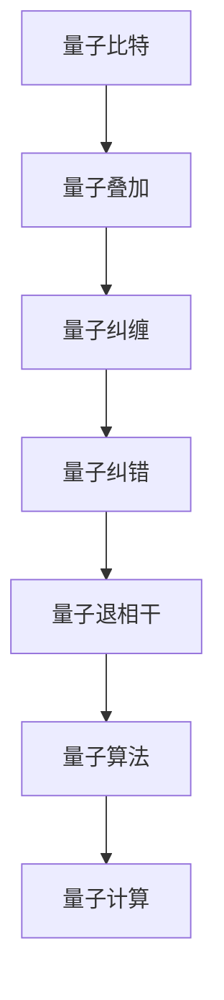

                 

# 量子计算创业：颠覆性运算能力的商业化

## 1. 背景介绍

### 1.1 问题由来

随着信息技术的发展，数据处理需求呈指数级增长，传统计算机的运算能力已逐渐接近物理极限。量子计算作为新一代计算技术，利用量子叠加、量子纠缠等原理，能够在理论上提供远超经典计算的运算能力，从而在密码学、药物设计、金融分析等领域展现出巨大的潜力。

然而，量子计算的实际应用仍处于早期阶段，面临诸如量子比特稳定性、量子纠错、系统架构等技术挑战。同时，量子计算机的高昂成本和复杂性，也使得其商业化进程面临巨大挑战。

本文旨在探讨量子计算创业的基本概念与原理，分析其潜在的商业化路径与模式，以期为相关领域的创业者和投资者提供参考。

## 2. 核心概念与联系

### 2.1 核心概念概述

- **量子计算(QC)**：利用量子力学原理进行数据处理的计算模式。
- **量子比特(qubit)**：量子计算的基本单位，能够同时表示0和1。
- **量子叠加**：qubit可以处于多个状态的叠加态，从而实现并行计算。
- **量子纠缠**：多个qubit之间存在非经典的关联关系，可以实现量子计算中的信息传递。
- **量子纠错**：由于量子比特的不稳定性，量子计算机需要通过量子纠错算法保证计算的正确性。
- **量子退相干**：qubit状态会因为环境噪声而发生演化，量子退相干问题需要高效的冷却和隔离技术解决。
- **量子算法**：专门为量子计算机设计的算法，如Shor算法、Grover算法等。

这些核心概念构成了量子计算的基础框架，其间的联系和相互作用决定了量子计算机的性能和实用性。

### 2.2 核心概念原理和架构的 Mermaid 流程图(Mermaid 流程节点中不要有括号、逗号等特殊字符)



### 2.3 核心概念之间的联系

量子比特、量子叠加、量子纠缠是量子计算的基础，决定了量子计算机的高效并行计算能力。量子纠错和量子退相干则是量子计算机实现稳定可靠计算的重要手段。量子算法则是将量子比特和量子叠加、纠缠特性转化为实际计算能力的工具。

## 3. 核心算法原理 & 具体操作步骤

### 3.1 算法原理概述

量子计算的核心算法有两大类：量子随机算法和量子优化算法。

- **量子随机算法**：如Shor算法，能够以多项式时间复杂度实现大整数的质因数分解，这对于破解现有的加密算法具有颠覆性意义。
- **量子优化算法**：如Grover算法，通过利用量子叠加和量子并行特性，能够在特定问题上显著加速搜索过程。

量子算法的设计和实现需要结合具体问题构建，并利用量子计算的特殊性质进行优化。

### 3.2 算法步骤详解

量子计算的实现分为以下几个关键步骤：

1. **量子比特制备**：初始化量子比特至$|0\rangle$或$|1\rangle$状态。
2. **量子逻辑门操作**：通过量子逻辑门（如Hadamard门、CNOT门）实现量子叠加和量子纠缠。
3. **量子信息处理**：对量子比特进行逻辑操作，实现量子算法的核心步骤。
4. **量子测量**：将量子比特的叠加态测量为0或1，得到最终计算结果。

### 3.3 算法优缺点

**优点**：
- 量子计算机能够处理某些经典计算无法解决的问题，如整数分解、搜索等问题。
- 量子计算具有指数级的加速能力，可以显著提高某些问题的求解效率。

**缺点**：
- 量子比特稳定性差，容易受到环境噪声干扰，导致计算错误。
- 量子算法复杂度高，设计难度大，实际应用中存在较多技术瓶颈。
- 量子计算机成本高昂，技术成熟度低，大规模应用仍需时日。

### 3.4 算法应用领域

量子计算的应用领域广泛，包括但不限于以下几个方面：

- **密码学**：如Shor算法的应用，破解RSA加密算法，威胁现有的公钥密码系统。
- **药物设计**：通过量子算法模拟分子结构，加速新药研发过程。
- **金融分析**：利用量子算法进行高频交易和复杂数学模型的求解，优化金融策略。
- **人工智能**：在机器学习和数据分析中引入量子算法，提高算法效率和计算能力。
- **量子通信**：利用量子纠缠进行安全通信，实现量子密钥分发。

## 4. 数学模型和公式 & 详细讲解 & 举例说明

### 4.1 数学模型构建

量子计算的数学模型建立在量子力学的基础上，核心为量子态的演化方程和量子测量理论。

- **量子态演化方程**：
  $$
  |\psi(t)\rangle = U(t)|\psi(0)\rangle
  $$
  其中，$|\psi(t)\rangle$为时间$t$时刻的量子态，$U(t)$为时间演化算符，$|\psi(0)\rangle$为初始量子态。

- **量子测量理论**：
  $$
  P_{|i\rangle} = |\langle i|\hat{O}|0\rangle|^2
  $$
  其中，$|\langle i|\hat{O}|0\rangle|^2$为量子测量结果为$i$的概率，$|\langle i|\hat{O}|0\rangle$为量子测量操作符$\hat{O}$在初始态$|0\rangle$下的期望值。

### 4.2 公式推导过程

以Grover算法为例，推导其在搜索问题中的应用。

设搜索空间为$N$个元素，已知目标元素$x$，Grover算法的目标是将搜索空间中的目标元素概率放大到$|\langle x|\psi\rangle|^2 = \left(\frac{1}{\sqrt{N}}\right)^2 = \frac{1}{N}$，而其他元素的概率被抑制到$|\langle i|\psi\rangle|^2 = \left(\frac{1}{\sqrt{N}}\right)^2 = \frac{1}{N}$。

Grover算法包含三个步骤：
1. 初始化量子比特到$|0\rangle$状态。
2. 应用Grover迭代器，不断对量子比特进行变换。
3. 测量量子比特，输出结果。

### 4.3 案例分析与讲解

考虑一个有16个元素的搜索空间，其中包含一个目标元素。使用Grover算法进行搜索，迭代次数$k=7$时，量子比特的演化结果如下：

| 初始量子比特 | 第1次迭代 | 第2次迭代 | ... | 第7次迭代 |
| ------------- | ---------- | ---------- | --- | ---------- |
| $|0\rangle$ | $|0\rangle$ | $|0\rangle$ | ... | $|0\rangle$ |
| $|1\rangle$ | $\frac{1}{2}|1\rangle + \frac{1}{2}|14\rangle$ | $\frac{1}{4}|1\rangle + \frac{1}{4}|14\rangle + \frac{1}{4}|15\rangle + \frac{1}{4}|0\rangle$ | ... | $\frac{1}{2^k}|1\rangle + \frac{1}{2^k}|14\rangle$ |
| ... | ... | ... | ... | ... |

可以看出，经过7次迭代，量子比特对目标元素的概率被放大到$\frac{1}{16}$，对其他元素的概率被抑制到$\frac{1}{16}$，从而实现了高效的搜索。

## 5. 项目实践：代码实例和详细解释说明

### 5.1 开发环境搭建

为了进行量子计算的代码实践，需要搭建Qiskit等量子计算框架的开发环境。

1. **安装Python**：Python是Qiskit等框架的运行环境，通常使用Anaconda进行管理。
   ```bash
   conda create -n qiskit-env python=3.8
   conda activate qiskit-env
   ```

2. **安装Qiskit**：Qiskit是Google开源的量子计算框架，用于编写和模拟量子程序。
   ```bash
   pip install qiskit
   ```

3. **安装相关库**：包括numpy、matplotlib、jupyter等科学计算和数据可视化工具。
   ```bash
   pip install numpy matplotlib jupyter
   ```

完成以上步骤后，即可在虚拟环境$qiskit-env$中编写和运行量子计算程序。

### 5.2 源代码详细实现

以下是一个简单的量子计算程序，使用Qiskit实现Grover算法，用于在4个元素中搜索特定元素：

```python
from qiskit import QuantumCircuit, Aer, execute
from qiskit.visualization import plot_histogram

# 初始化量子比特
qc = QuantumCircuit(4)

# Grover迭代器
for _ in range(7):
    qc.h(0)  # 对第一个量子比特进行Hadamard门操作
    for i in range(1, 4):
        qc.cx(0, i)  # 对量子比特进行CNOT门操作

# 测量量子比特
qc.measure_all()

# 执行量子程序
backend = Aer.get_backend('qasm_simulator')
result = execute(qc, backend).result()
counts = result.get_counts()

# 输出结果
print(counts)
```

### 5.3 代码解读与分析

- `QuantumCircuit`：Qiskit中用于构建量子电路的类，通过调用其方法可以添加量子逻辑门。
- `execute`：执行量子电路，生成量子态的测量结果。
- `plot_histogram`：绘制量子测量结果的直方图，展示每个结果的概率分布。

通过以上代码，可以观察到Grover算法在4个元素搜索问题上的效果。在迭代7次后，测量结果中目标元素被显著放大，而其他元素的概率被抑制。

### 5.4 运行结果展示

量子计算的结果展示通常通过绘制量子态测量结果的直方图完成。通过`plot_histogram`函数可以直观地看到不同元素被测量的概率分布。

## 6. 实际应用场景

### 6.1 金融分析

量子计算在金融分析中的应用主要集中在高频交易、优化组合和风险评估等方面。利用量子算法可以大幅提高数据处理速度，实现快速求解复杂的数学模型，从而优化金融策略和降低风险。

### 6.2 药物设计

药物分子结构的搜索和优化是药物设计中的关键环节。量子计算能够高效地模拟分子的量子行为，加速新药的研发过程，降低试验成本。

### 6.3 人工智能

量子计算在机器学习领域的应用，如支持向量机、神经网络等，能够显著提升算法效率和计算能力，从而推动人工智能技术的发展。

### 6.4 未来应用展望

未来，量子计算在各个领域的应用将逐步展开，逐渐从实验室走向产业化。随着技术成熟度的提升和成本的降低，预计在2030年前，量子计算机将在特定领域实现商业化应用，为各行各业带来颠覆性变革。

## 7. 工具和资源推荐

### 7.1 学习资源推荐

- **Qiskit官方文档**：Qiskit是Google开源的量子计算框架，提供了详细的教程和API文档，是学习和使用量子计算的重要资源。
- **Quantum Computing on the Cloud**：Google提供的量子计算平台，用户可以通过云服务体验量子计算的强大能力，同时掌握量子计算的基本原理和应用场景。
- **Quantum Computing and Quantum Computation**：一本介绍量子计算原理和应用的经典书籍，适合深入学习量子计算理论和技术。
- **Quantum Algorithms**：一本详细介绍量子算法的书籍，包含Shor、Grover、量子随机行走等经典量子算法，是量子计算研究的重要参考。

### 7.2 开发工具推荐

- **Jupyter Notebook**：Jupyter Notebook是一个交互式的科学计算工具，支持Python、R等编程语言，适合量子计算的研究和教学。
- **Qiskit**：Google开源的量子计算框架，提供丰富的量子算法和工具，方便开发者进行量子计算的实验和应用。
- **IBM Quantum Experience**：IBM提供的量子计算云服务，用户可以免费使用量子计算机，进行量子算法的验证和优化。
- **Strang**：一个开源的量子计算模拟器，提供Qiskit支持的Quantum Register，方便进行量子计算的模拟和分析。

### 7.3 相关论文推荐

- **A New Algorithm for Quantum Computation of Discrete Logarithms**：Shor算法原论文，详细介绍了Shor算法的原理和实现方法。
- **Algorithms for Quantum Computation**：Grover算法原论文，介绍了Grover算法的原理和应用场景。
- **Quantum Computation and Quantum Information**：一本介绍量子计算和量子信息学的经典书籍，包含量子计算的基本原理和应用技术。
- **Quantum Algorithms**：一本详细介绍量子算法的书籍，包含Shor、Grover、量子随机行走等经典量子算法，是量子计算研究的重要参考。

## 8. 总结：未来发展趋势与挑战

### 8.1 研究成果总结

量子计算技术在理论和实践方面都取得了重要进展。通过量子算法的设计和实现，能够在特定问题上提供指数级的加速能力，展现出巨大的应用潜力。

### 8.2 未来发展趋势

未来，量子计算将在以下几个方面继续发展：
- **硬件技术进步**：量子比特的稳定性、量子纠错技术和量子计算架构的改进。
- **量子算法优化**：提高量子算法的效率和适用范围，实现更多实际应用的落地。
- **跨领域应用拓展**：量子计算与其他技术的融合，如量子机器学习、量子神经网络等。
- **商业化进程加快**：量子计算应用的广泛推广，逐步降低成本，实现大规模商业化。

### 8.3 面临的挑战

量子计算面临的主要挑战包括：
- **技术成熟度不足**：量子比特的稳定性、量子纠错和量子计算架构等问题尚未完全解决。
- **高昂成本**：量子计算机的制造和运行成本较高，限制了其商业化进程。
- **技术门槛高**：量子计算需要深厚的物理、数学和工程背景，入门门槛较高。
- **应用场景有限**：当前量子计算的应用领域相对有限，需要更多的探索和验证。

### 8.4 研究展望

未来的研究方向包括：
- **量子硬件的稳定性提升**：提高量子比特的稳定性和可靠性，减少环境噪声的干扰。
- **量子算法的优化设计**：设计和实现更高效的量子算法，提升量子计算的实用性。
- **跨学科合作**：量子计算与其他学科的深度融合，推动技术进步和应用拓展。
- **产业化推进**：加强与产业界的合作，加速量子计算的商业化进程，实现实际应用落地。

## 9. 附录：常见问题与解答

### Q1: 量子计算的基本原理是什么？

A: 量子计算基于量子力学的原理，利用量子比特的量子叠加和量子纠缠特性进行计算。量子比特可以在0和1之间进行叠加，实现并行计算；量子比特之间的纠缠关系可以传递信息，实现量子并行计算。

### Q2: 量子计算与传统计算有何不同？

A: 传统计算基于经典比特的二值性，每个比特只能处于0或1的状态；量子计算基于量子比特的叠加性和纠缠性，每个量子比特可以同时处于0和1的叠加状态，实现指数级的并行计算。

### Q3: 目前量子计算有哪些应用场景？

A: 量子计算目前主要应用于密码学、药物设计、金融分析、机器学习等领域。Shor算法可以破解RSA加密算法，Grover算法可以加速搜索和优化问题，量子计算在药物设计和金融分析中的应用也展现出巨大潜力。

### Q4: 量子计算面临的主要技术挑战有哪些？

A: 量子计算面临的主要技术挑战包括量子比特的稳定性、量子纠错、量子计算架构、量子算法设计等。量子比特容易受到环境噪声的干扰，导致计算错误；量子纠错技术可以解决这一问题，但技术复杂度高；量子计算架构需要解决量子比特的互联和隔离问题，实现高效的计算。

### Q5: 未来量子计算的发展趋势是什么？

A: 未来量子计算将在硬件技术、量子算法、跨学科合作和产业化等方面继续发展。硬件技术的进步将提高量子比特的稳定性和可靠性，量子算法的优化将提升量子计算的实用性，跨学科合作将推动量子计算与其他技术的融合，产业化推进将加速量子计算的应用落地。

---

作者：禅与计算机程序设计艺术 / Zen and the Art of Computer Programming

