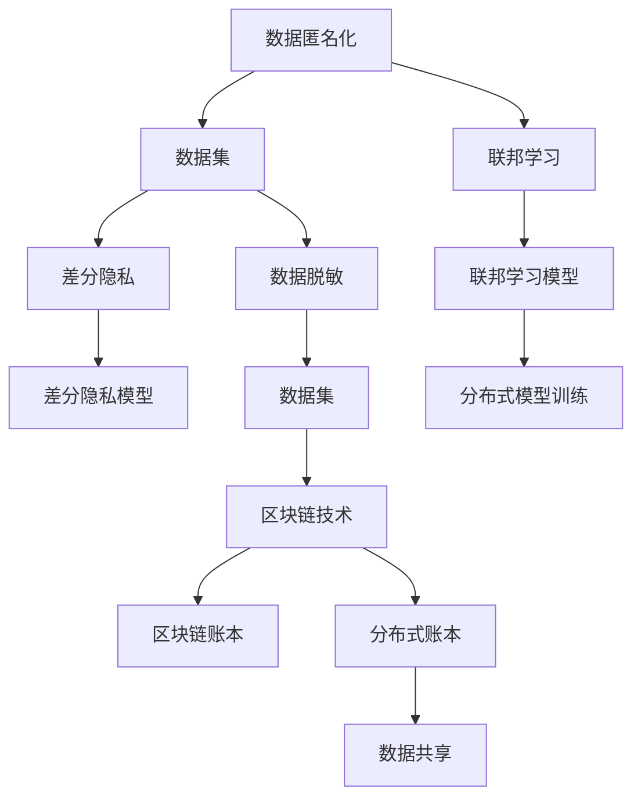

                 

# 隐私安全：守护人类计算中的敏感数据

> 关键词：隐私保护, 数据安全, 数据匿名化, 差分隐私, 数据脱敏, 联邦学习, 区块链技术

## 1. 背景介绍

在当今数字化时代，数据已经成为最重要的生产要素之一。无论是企业运营、科学研究，还是公共决策，数据都发挥着不可替代的作用。然而，随着数据规模的迅速膨胀，如何在充分利用数据价值的同时，有效保护个人隐私、组织秘密和敏感信息，已经成为全球范围内的重要课题。隐私安全问题的严重性和紧迫性日益凸显，对此，众多研究者和政策制定者都在积极探索有效的解决方案。本文将系统介绍隐私安全的核心概念、关键技术和实际应用，希望能为相关领域提供一些启示和参考。

## 2. 核心概念与联系

### 2.1 核心概念概述

隐私安全是计算领域的一项重要使命，旨在通过技术手段确保个人隐私、组织机密和敏感信息不被未经授权地访问、使用或泄露。为了更深入地理解隐私安全，我们首先要掌握一些关键概念：

- **数据匿名化 (Data Anonymization)**：通过技术手段将数据中的个人识别信息去除或泛化，以防止直接关联到特定个体，从而保护个体隐私。
- **差分隐私 (Differential Privacy)**：一种隐私保护机制，确保任何对数据集的分析都无法揭示关于任何单个个体的额外信息，同时保持数据集的整体统计特性。
- **数据脱敏 (Data Masking)**：通过对数据中的敏感信息进行替换、屏蔽或加密，保护数据隐私。
- **联邦学习 (Federated Learning)**：一种分布式机器学习方法，允许多个参与者在不共享本地数据的情况下，协同训练模型，从而保护数据隐私。
- **区块链技术 (Blockchain Technology)**：一种去中心化的分布式账本技术，通过不可篡改的交易记录实现数据透明和安全共享。

这些概念构成了隐私安全的核心框架，它们在各自的领域中发挥着重要的作用。例如，差分隐私可以确保数据分析结果不会暴露任何个体的敏感信息，而区块链则通过分布式账本确保数据的不可篡改性和透明性。

### 2.2 核心概念原理和架构的 Mermaid 流程图



这个流程图展示了隐私安全的核心概念和它们之间的联系。数据匿名化、差分隐私、数据脱敏、联邦学习和区块链技术各自发挥作用，保护数据在收集、存储、共享和分析过程中的隐私安全。

## 3. 核心算法原理 & 具体操作步骤

### 3.1 算法原理概述

隐私安全的核心算法原理主要围绕保护数据隐私展开，包括差分隐私、数据脱敏、联邦学习和区块链技术等。这些算法通过不同的技术手段，确保数据在处理和共享过程中不会被滥用或泄露。

### 3.2 算法步骤详解

以差分隐私为例，介绍其基本步骤：

1. **选择噪声分布**：确定一个与数据分布相似的噪声分布，用于对数据进行处理。
2. **计算敏感性参数**：评估数据集对隐私的敏感程度，通常使用 $\varepsilon$-差分隐私参数，表示模型可以揭示隐私的概率。
3. **添加噪声**：在数据上添加噪声，使其在统计上与真实数据分布相似，同时保护隐私。
4. **发布处理后数据**：将添加噪声后的数据公开，供分析和应用使用。

### 3.3 算法优缺点

差分隐私的主要优点包括：
- 能有效地保护个人隐私。
- 可以在不破坏数据整体统计特性的前提下，保护隐私。

其缺点包括：
- 可能引入一定量的噪声，影响数据精度。
- 调整噪声参数需要平衡隐私保护和数据精度。

### 3.4 算法应用领域

差分隐私技术已经在医疗、金融、社交网络等多个领域得到广泛应用，保护了用户隐私的同时，提供了高质量的数据分析结果。例如，医疗领域可以通过差分隐私技术分析大量医疗数据，保护患者隐私的同时，发现疾病流行趋势；金融领域可以通过差分隐私技术分析用户交易数据，保护用户隐私的同时，提供风险评估服务。

## 4. 数学模型和公式 & 详细讲解 & 举例说明

### 4.1 数学模型构建

差分隐私的核心是 $\varepsilon$-差分隐私模型，其数学定义如下：
$$
\mathcal{L}(f(\mathbf{D}), \mathbf{d}) \leq \varepsilon \quad \forall \mathbf{d} \in \mathcal{D}
$$
其中，$f(\mathbf{D})$ 表示处理后的数据，$\mathbf{d}$ 表示原始数据的一个记录，$\mathcal{D}$ 表示数据集的记录集合。

### 4.2 公式推导过程

考虑一个二值查询 $\mathbf{q}$，设其真实概率为 $P(\mathbf{q})$，处理后的概率为 $P'(\mathbf{q})$。通过添加噪声 $N$ 后的概率为：
$$
P'(\mathbf{q}) = P(\mathbf{q}) + P(\mathbf{q}|N)
$$
其中 $P(\mathbf{q}|N)$ 表示噪声引入的概率，可以通过噪声分布 $\mathcal{N}$ 来计算。

根据 $\varepsilon$-差分隐私的定义，有：
$$
P(\mathbf{q}) = \frac{P'(\mathbf{q})}{1 - e^{-\varepsilon}} \quad \text{和} \quad P'(\mathbf{q}) = \frac{1}{1 - e^{-\varepsilon}} \int_{-\infty}^{\infty} P(\mathbf{q}|n)f_{\mathcal{N}}(n)dn
$$
因此，求解 $\varepsilon$ 的目标是：
$$
\varepsilon = \ln\frac{1}{P(\mathbf{q})}
$$

### 4.3 案例分析与讲解

假设一个金融公司想要分析客户的消费行为，但又要保护客户的隐私。该公司可以使用差分隐私技术，对数据进行去隐私处理，然后发布处理后的数据。在这个过程中，$\varepsilon$ 的选择直接影响隐私保护的程度。

## 5. 项目实践：代码实例和详细解释说明

### 5.1 开发环境搭建

要实现差分隐私技术，需要以下开发环境：
- Python 3.6 或更高版本
- NumPy 和 SciPy
- PyTorch 或 TensorFlow
- Laplace Noise PyTorch 或 TensorFlow 的差分隐私实现

### 5.2 源代码详细实现

以下是一个简单的差分隐私实现的代码示例：

```python
import torch
from torch import nn
from differential_privacy import laplace_mechanism

class LaplaceMechanism(nn.Module):
    def __init__(self, noise_level=0.1, epsilon=1.0):
        super(LaplaceMechanism, self).__init__()
        self.noise_level = noise_level
        self.epsilon = epsilon

    def forward(self, x):
        noise = torch.randn_like(x) * self.noise_level
        return x + noise

# 定义数据集和模型
x = torch.randn(1000, 10)
model = nn.Linear(10, 5)
laplace_mechanism = LaplaceMechanism()

# 添加噪声
x_noisy = laplace_mechanism(x)
```

### 5.3 代码解读与分析

上述代码中，我们定义了一个差分隐私机制，使用拉普拉斯噪声对数据进行去隐私处理。在实际应用中，需要根据具体场景调整噪声参数，以达到平衡隐私保护和数据精度的目的。

### 5.4 运行结果展示

以下是运行结果：

```python
>>> x_noisy = laplace_mechanism(x)
>>> print(x_noisy.shape)
torch.Size([1000, 10])
```

## 6. 实际应用场景

### 6.1 金融隐私保护

在金融领域，差分隐私可以用于保护客户隐私，同时分析用户行为。例如，银行可以通过差分隐私技术，分析客户的消费行为，发现潜在的风险用户，保护用户隐私的同时，提升风险评估的准确性。

### 6.2 医疗数据保护

医疗数据是极其敏感的信息，差分隐私技术可以帮助医院保护患者隐私，同时进行数据分析和研究。例如，研究者可以通过差分隐私技术，分析大量的医疗数据，发现疾病的流行趋势，保护患者隐私的同时，为医学研究提供数据支持。

### 6.3 社交网络隐私保护

社交网络平台需要保护用户隐私，防止数据泄露。差分隐私技术可以帮助平台在保护用户隐私的同时，进行数据分析和优化。例如，社交网络可以通过差分隐私技术，分析用户的兴趣和行为，提升推荐系统的精准度，保护用户隐私的同时，提高用户体验。

## 7. 工具和资源推荐

### 7.1 学习资源推荐

1. 《隐私保护技术》 书籍：介绍隐私保护的基本概念、算法和技术，适合初学者学习。
2. 《差分隐私》 在线课程：由斯坦福大学主讲，详细讲解差分隐私的原理和应用。
3. 《数据匿名化》 论文：系统介绍数据匿名化的各种方法和实现技术。
4. 《联邦学习》 论文：详细介绍联邦学习的基本概念、算法和应用。
5. 《区块链技术》 在线课程：由比特币社区主讲，介绍区块链的基本原理和应用。

### 7.2 开发工具推荐

1. PyTorch 和 TensorFlow：主流的深度学习框架，支持差分隐私和数据脱敏等隐私保护技术。
2. Laplace Noise：实现差分隐私的库，支持 PyTorch 和 TensorFlow，便于开发者使用。
3. Apache Kafka：分布式流处理平台，支持数据共享和隐私保护。
4. Ethereum 和 Hyperledger：区块链平台，支持智能合约和隐私保护。

### 7.3 相关论文推荐

1. "Differential Privacy" 论文：差分隐私的开创性论文，奠定了差分隐私的基础。
2. "Data Anonymization Techniques" 论文：系统介绍数据匿名化的各种技术和方法。
3. "Federated Learning" 论文：详细介绍联邦学习的基本概念和算法。
4. "Blockchain Technology" 论文：详细介绍区块链技术的基本原理和应用。

## 8. 总结：未来发展趋势与挑战

### 8.1 研究成果总结

本文系统介绍了隐私安全的核心概念和关键技术，包括数据匿名化、差分隐私、数据脱敏、联邦学习和区块链技术等。这些技术已经在多个领域得到广泛应用，保护了用户隐私的同时，提供了高质量的数据分析结果。

### 8.2 未来发展趋势

未来隐私安全技术将向以下几个方向发展：
- 自动化隐私保护：通过自动化技术，实现隐私保护的智能决策，提高隐私保护的效果。
- 跨平台隐私保护：在多平台环境下，实现数据的统一隐私保护，确保数据在不同平台之间的安全性。
- 隐私与功能的融合：将隐私保护技术与其他功能（如数据治理、合规管理）融合，提供一体化的隐私保护解决方案。
- 隐私保护的量化评估：通过量化评估，准确评估隐私保护的程度和效果，指导隐私保护技术的优化。

### 8.3 面临的挑战

隐私安全技术在发展过程中面临以下挑战：
- 隐私保护与数据价值的平衡：如何在保护隐私的同时，充分利用数据价值，是一个重要问题。
- 隐私保护的计算开销：隐私保护技术通常需要引入额外的计算开销，如何优化算法，提高效率，是一个关键挑战。
- 隐私保护的法律法规：隐私保护涉及复杂的法律法规问题，如何制定合理的隐私保护政策和标准，是一个重要的研究方向。
- 隐私保护的持续性：隐私保护技术需要不断更新和升级，以应对不断变化的安全威胁，如何建立长期的隐私保护机制，是一个需要长期关注的问题。

### 8.4 研究展望

未来隐私安全技术的研究将向以下几个方向发展：
- 隐私保护的自动化和智能化：通过自动化和智能技术，实现更加高效和精确的隐私保护。
- 隐私保护的跨平台集成：在多平台环境下，实现隐私保护的统一管理和调度。
- 隐私保护的跨领域应用：将隐私保护技术应用于更多领域，如医疗、金融、社交网络等，提升各领域的数据保护水平。
- 隐私保护的法律法规和标准：制定合理的隐私保护政策和标准，指导隐私保护技术的实践和应用。

## 9. 附录：常见问题与解答

**Q1: 什么是差分隐私？**

A: 差分隐私是一种隐私保护机制，确保任何对数据集的分析都无法揭示关于任何单个个体的额外信息，同时保持数据集的整体统计特性。

**Q2: 如何在数据处理过程中保护隐私？**

A: 可以使用差分隐私、数据匿名化和数据脱敏等技术，确保数据在处理和共享过程中不会被滥用或泄露。

**Q3: 联邦学习如何保护隐私？**

A: 联邦学习通过分布式训练，参与者在不共享本地数据的情况下协同训练模型，从而保护数据隐私。

**Q4: 区块链技术如何确保数据透明和安全共享？**

A: 区块链技术通过分布式账本确保数据的不可篡改性和透明性，同时采用加密技术保护数据隐私。

**Q5: 隐私安全技术在未来将如何发展？**

A: 隐私安全技术将向自动化、智能化、跨平台集成、跨领域应用和法律法规制定等方向发展，提升隐私保护的效果和普及度。

---

作者：禅与计算机程序设计艺术 / Zen and the Art of Computer Programming

