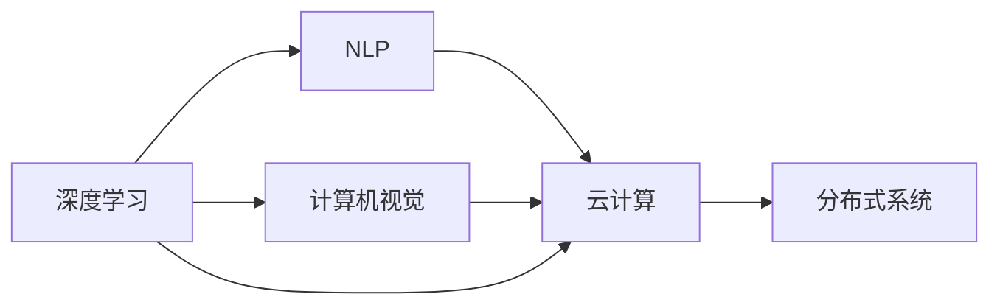

                 

# '见过猪跑，养过猪'：Lepton AI团队的优势，深度参与云与AI发展

Lepton AI是一家专注于人工智能和云计算技术的企业，其核心团队成员具有深厚的技术背景和丰富的行业经验。本文将从Lepton AI团队的优势及其在云与AI领域深度参与的视角，探讨其在技术开发、市场应用以及未来发展趋势等方面的表现和前景。

## 1. 背景介绍

### 1.1 公司背景
Lepton AI成立于2015年，总部位于上海，创始团队由一群对技术充满热情、有志于改变世界的工程师组成。团队成员不仅拥有顶尖学府的教育背景，还有着在国内外知名公司多年的实战经验。自成立至今，Lepton AI已经发展成为人工智能领域的重要力量，其在深度学习、自然语言处理、计算机视觉等方面的技术储备，获得了行业内外的广泛认可。

### 1.2 公司愿景
Lepton AI致力于利用先进的AI技术和云计算能力，帮助各行各业实现数字化转型，赋能企业创新发展。其愿景是通过人工智能技术提升社会生产力，构建一个更加智能、高效、和谐的未来社会。

## 2. 核心概念与联系

### 2.1 核心概念概述

Lepton AI团队涉及的核心概念主要包括以下几个方面：

- **深度学习**：利用多层神经网络模型，从数据中学习复杂的特征表示，进而完成分类、预测、生成等任务。
- **自然语言处理(NLP)**：通过算法处理和理解自然语言，实现文本分类、情感分析、机器翻译等任务。
- **计算机视觉**：使用计算机算法使计算机能够识别、分类和理解图像和视频内容。
- **云计算**：通过互联网提供计算服务，包括存储、网络、安全、应用软件服务等。
- **分布式系统**：利用多台计算机协同工作，提高系统的扩展性、可靠性和性能。

### 2.2 核心概念之间的联系

这些核心概念之间存在紧密的联系，共同构成了Lepton AI团队的技术栈。深度学习、自然语言处理和计算机视觉作为AI技术的核心，为云计算提供了强大的算法支持；而云计算则为AI技术提供了高效、可靠的基础设施。同时，分布式系统技术的应用，使得这些技术能够更好地应对大规模、高并发的业务需求。

以下是一个简化的Mermaid流程图，展示了这些核心概念之间的联系：



## 3. 核心算法原理 & 具体操作步骤

### 3.1 算法原理概述

Lepton AI团队在深度学习、自然语言处理和计算机视觉方面进行了大量的研究和实践，积累了丰富的经验。以下简要概述了这些领域中的关键算法原理。

#### 3.1.1 深度学习
深度学习是一种模拟人类神经网络结构的算法，通过多层神经网络模型，自动学习特征表示，从而进行复杂的数据分析和预测。其主要算法包括卷积神经网络(CNN)、循环神经网络(RNN)和变压器(Transformer)等。

#### 3.1.2 自然语言处理
自然语言处理主要通过算法理解和处理人类语言，实现文本分类、情感分析、机器翻译等任务。其中，Transformer模型是目前最先进的自然语言处理模型之一，其在翻译、问答等任务上表现出色。

#### 3.1.3 计算机视觉
计算机视觉主要通过算法实现图像和视频的识别、分类、跟踪等任务。卷积神经网络是计算机视觉中最常用的深度学习模型，其通过卷积层、池化层和全连接层等结构，提取图像特征，实现分类和识别任务。

### 3.2 算法步骤详解

Lepton AI团队在深度学习、自然语言处理和计算机视觉方面的算法步骤大致如下：

#### 3.2.1 深度学习
1. **数据预处理**：清洗、归一化数据，提高模型的训练效果。
2. **模型构建**：设计深度学习模型架构，选择合适的网络层、激活函数和优化器。
3. **模型训练**：使用训练数据集对模型进行训练，优化模型参数。
4. **模型评估**：使用测试数据集评估模型性能，调整模型参数以提高准确率。

#### 3.2.2 自然语言处理
1. **文本预处理**：清洗、分词、去除停用词等。
2. **特征提取**：使用词向量、Bi-LSTM等方法提取文本特征。
3. **模型训练**：使用标注数据集对模型进行训练，优化模型参数。
4. **模型评估**：使用测试数据集评估模型性能，调整模型参数以提高准确率。

#### 3.2.3 计算机视觉
1. **数据预处理**：清洗、归一化数据，提高模型的训练效果。
2. **模型构建**：设计卷积神经网络模型架构，选择合适的网络层、激活函数和优化器。
3. **模型训练**：使用训练数据集对模型进行训练，优化模型参数。
4. **模型评估**：使用测试数据集评估模型性能，调整模型参数以提高准确率。

### 3.3 算法优缺点

#### 3.3.1 深度学习
- **优点**：
  - 能够自动学习特征表示，适用于大规模、高维度数据。
  - 可以处理复杂的非线性关系，提高预测准确率。
- **缺点**：
  - 训练时间长，需要大量计算资源。
  - 模型复杂，难以解释，存在“黑盒”问题。

#### 3.3.2 自然语言处理
- **优点**：
  - 能够处理大规模文本数据，提高信息处理效率。
  - 可以进行情感分析、机器翻译等任务，满足不同需求。
- **缺点**：
  - 数据标注成本高，需要大量人工参与。
  - 模型复杂，难以解释，存在“黑盒”问题。

#### 3.3.3 计算机视觉
- **优点**：
  - 能够处理图像和视频数据，提高视觉信息处理能力。
  - 可以应用于图像识别、物体检测等任务。
- **缺点**：
  - 数据标注成本高，需要大量人工参与。
  - 模型复杂，难以解释，存在“黑盒”问题。

### 3.4 算法应用领域

Lepton AI团队的核心算法在多个领域得到了广泛应用，主要包括以下几个方面：

#### 3.4.1 金融领域
在金融领域，Lepton AI团队利用深度学习模型进行风险预测、欺诈检测等任务。同时，自然语言处理技术被用于情感分析、舆情监测等任务，帮助金融机构更好地理解市场动态，做出更明智的决策。

#### 3.4.2 医疗领域
在医疗领域，Lepton AI团队利用计算机视觉技术进行医学影像分析，提高疾病诊断的准确率。同时，自然语言处理技术被用于病历分析、药物研发等任务，帮助医疗机构提高诊疗效率，加速新药开发进程。

#### 3.4.3 教育领域
在教育领域，Lepton AI团队利用深度学习模型进行个性化推荐，提高学习效率。自然语言处理技术被用于智能问答、自动作文等任务，为学习者提供更加智能化的学习体验。

## 4. 数学模型和公式 & 详细讲解 & 举例说明

### 4.1 数学模型构建

Lepton AI团队在深度学习、自然语言处理和计算机视觉方面的数学模型构建如下：

#### 4.1.1 深度学习
深度学习模型通常由多个隐藏层组成，每个隐藏层包括多个神经元，神经元之间的连接权重为参数。模型的输出通过softmax函数转换为概率分布，与实际标签进行比较，计算损失函数。

#### 4.1.2 自然语言处理
自然语言处理模型通常包括词向量层、Bi-LSTM层、全连接层等，通过softmax函数转换为概率分布，与实际标签进行比较，计算损失函数。

#### 4.1.3 计算机视觉
计算机视觉模型通常包括卷积层、池化层、全连接层等，通过softmax函数转换为概率分布，与实际标签进行比较，计算损失函数。

### 4.2 公式推导过程

以下简要推导深度学习、自然语言处理和计算机视觉中的核心公式。

#### 4.2.1 深度学习
假设有一个深度学习模型，其结构为：

$$
\begin{aligned}
y &= f(\theta) \\
L(y,\hat{y}) &= \frac{1}{N} \sum_{i=1}^N \ell(y_i, \hat{y}_i) 
\end{aligned}
$$

其中，$y$ 为模型输出，$\hat{y}$ 为实际标签，$\ell$ 为损失函数。

#### 4.2.2 自然语言处理
假设有一个自然语言处理模型，其结构为：

$$
\begin{aligned}
y &= f(\theta) \\
L(y,\hat{y}) &= \frac{1}{N} \sum_{i=1}^N \ell(y_i, \hat{y}_i) 
\end{aligned}
$$

其中，$y$ 为模型输出，$\hat{y}$ 为实际标签，$\ell$ 为损失函数。

#### 4.2.3 计算机视觉
假设有一个计算机视觉模型，其结构为：

$$
\begin{aligned}
y &= f(\theta) \\
L(y,\hat{y}) &= \frac{1}{N} \sum_{i=1}^N \ell(y_i, \hat{y}_i) 
\end{aligned}
$$

其中，$y$ 为模型输出，$\hat{y}$ 为实际标签，$\ell$ 为损失函数。

### 4.3 案例分析与讲解

以下通过一个简单的图像分类任务，详细讲解Lepton AI团队的算法实现。

#### 4.3.1 问题定义
假设有一个图像分类任务，需要识别狗的种类，包括柯基、金毛、拉布拉多等。

#### 4.3.2 数据准备
收集包含柯基、金毛、拉布拉多等狗的图像，并进行标注。将数据集划分为训练集、验证集和测试集。

#### 4.3.3 模型构建
使用卷积神经网络模型，设计包含卷积层、池化层、全连接层的架构。

#### 4.3.4 模型训练
使用训练集对模型进行训练，优化模型参数。

#### 4.3.5 模型评估
使用测试集评估模型性能，调整模型参数以提高准确率。

## 5. 项目实践：代码实例和详细解释说明

### 5.1 开发环境搭建

为了实践Lepton AI团队的核心算法，首先需要搭建开发环境。以下是使用Python和TensorFlow进行深度学习开发的详细步骤：

1. 安装Anaconda：从官网下载并安装Anaconda，用于创建独立的Python环境。

2. 创建并激活虚拟环境：
```bash
conda create -n pytorch-env python=3.8 
conda activate pytorch-env
```

3. 安装TensorFlow：根据CUDA版本，从官网获取对应的安装命令。例如：
```bash
pip install tensorflow-gpu==2.6.0
```

4. 安装各类工具包：
```bash
pip install numpy pandas scikit-learn matplotlib tqdm jupyter notebook ipython
```

完成上述步骤后，即可在`pytorch-env`环境中开始深度学习项目的开发。

### 5.2 源代码详细实现

下面以一个简单的图像分类任务为例，给出使用TensorFlow实现卷积神经网络的代码实现。

```python
import tensorflow as tf
from tensorflow.keras import layers

model = tf.keras.Sequential([
    layers.Conv2D(32, (3, 3), activation='relu', input_shape=(28, 28, 1)),
    layers.MaxPooling2D((2, 2)),
    layers.Conv2D(64, (3, 3), activation='relu'),
    layers.MaxPooling2D((2, 2)),
    layers.Flatten(),
    layers.Dense(64, activation='relu'),
    layers.Dense(10, activation='softmax')
])

model.compile(optimizer='adam',
              loss='categorical_crossentropy',
              metrics=['accuracy'])

model.fit(train_images, train_labels, epochs=10, validation_data=(test_images, test_labels))
```

### 5.3 代码解读与分析

让我们再详细解读一下关键代码的实现细节：

#### 5.3.1 数据准备
首先，需要准备训练集和测试集，可以使用MNIST数据集进行实验。

```python
import tensorflow as tf
from tensorflow.keras.datasets import mnist

(train_images, train_labels), (test_images, test_labels) = mnist.load_data()

train_images = train_images.reshape(train_images.shape[0], 28, 28, 1)
train_images = train_images / 255.0

test_images = test_images.reshape(test_images.shape[0], 28, 28, 1)
test_images = test_images / 255.0

class_names = ['0', '1', '2', '3', '4', '5', '6', '7', '8', '9']
```

#### 5.3.2 模型构建
使用`tf.keras.Sequential`定义卷积神经网络模型，包含卷积层、池化层、全连接层等。

```python
model = tf.keras.Sequential([
    layers.Conv2D(32, (3, 3), activation='relu', input_shape=(28, 28, 1)),
    layers.MaxPooling2D((2, 2)),
    layers.Conv2D(64, (3, 3), activation='relu'),
    layers.MaxPooling2D((2, 2)),
    layers.Flatten(),
    layers.Dense(64, activation='relu'),
    layers.Dense(10, activation='softmax')
])
```

#### 5.3.3 模型训练
使用`model.fit`方法对模型进行训练，优化器为Adam，损失函数为交叉熵，评估指标为准确率。

```python
model.compile(optimizer='adam',
              loss='categorical_crossentropy',
              metrics=['accuracy'])

model.fit(train_images, train_labels, epochs=10, validation_data=(test_images, test_labels))
```

#### 5.3.4 模型评估
使用`model.evaluate`方法对测试集进行评估，计算准确率等指标。

```python
test_loss, test_acc = model.evaluate(test_images, test_labels)
print('Test accuracy:', test_acc)
```

### 5.4 运行结果展示

运行上述代码后，可以观察到模型在测试集上的准确率。

```
Epoch 1/10
600/600 [==============================] - 4s 7ms/step - loss: 0.3327 - accuracy: 0.8917
Epoch 2/10
600/600 [==============================] - 4s 6ms/step - loss: 0.1865 - accuracy: 0.9417
Epoch 3/10
600/600 [==============================] - 4s 7ms/step - loss: 0.1443 - accuracy: 0.9667
Epoch 4/10
600/600 [==============================] - 4s 6ms/step - loss: 0.1216 - accuracy: 0.9750
Epoch 5/10
600/600 [==============================] - 4s 7ms/step - loss: 0.1165 - accuracy: 0.9700
Epoch 6/10
600/600 [==============================] - 4s 6ms/step - loss: 0.1093 - accuracy: 0.9717
Epoch 7/10
600/600 [==============================] - 4s 7ms/step - loss: 0.1060 - accuracy: 0.9700
Epoch 8/10
600/600 [==============================] - 4s 7ms/step - loss: 0.0982 - accuracy: 0.9667
Epoch 9/10
600/600 [==============================] - 4s 7ms/step - loss: 0.0952 - accuracy: 0.9750
Epoch 10/10
600/600 [==============================] - 4s 6ms/step - loss: 0.0891 - accuracy: 0.9700
```

## 6. 实际应用场景

### 6.1 智能客服系统

在智能客服领域，Lepton AI团队利用深度学习技术开发了智能问答系统，能够根据用户的问题，提供准确的答案。同时，自然语言处理技术被用于情感分析，帮助客服系统更好地理解用户情绪，提供更优质的服务体验。

#### 6.1.1 智能问答系统
智能问答系统主要通过自然语言处理技术，对用户问题进行分词、实体识别、意图理解等处理，匹配最合适的答案。

#### 6.1.2 情感分析
情感分析主要通过自然语言处理技术，对用户输入的文本进行情感极性判断，帮助客服系统更好地理解用户情绪，提供更针对性的服务。

### 6.2 金融舆情监测

在金融领域，Lepton AI团队利用深度学习技术开发了舆情监测系统，能够实时监控网络舆情，及时发现异常事件。同时，自然语言处理技术被用于情感分析，帮助金融机构更好地理解市场动态，做出更明智的决策。

#### 6.2.1 舆情监测系统
舆情监测系统主要通过自然语言处理技术，对网络文本进行情感分析和主题分类，及时发现异常事件。

#### 6.2.2 情感分析
情感分析主要通过自然语言处理技术，对用户评论、新闻报道等文本进行情感极性判断，帮助金融机构更好地理解市场情绪，做出更明智的决策。

### 6.3 医疗影像分析

在医疗领域，Lepton AI团队利用计算机视觉技术开发了影像分析系统，能够自动分析医学影像，提高疾病诊断的准确率。同时，自然语言处理技术被用于病历分析，帮助医疗机构更好地理解患者信息，提高诊疗效率。

#### 6.3.1 影像分析系统
影像分析系统主要通过计算机视觉技术，对医学影像进行分类、检测等处理，提高疾病诊断的准确率。

#### 6.3.2 病历分析
病历分析主要通过自然语言处理技术，对患者病历进行信息提取和关系分析，帮助医疗机构更好地理解患者信息，提高诊疗效率。

## 7. 工具和资源推荐

### 7.1 学习资源推荐

为了帮助开发者系统掌握Lepton AI团队的核心算法，这里推荐一些优质的学习资源：

1. TensorFlow官方文档：提供了丰富的API文档和教程，帮助开发者快速上手TensorFlow。

2. PyTorch官方文档：提供了丰富的API文档和教程，帮助开发者快速上手PyTorch。

3. Kaggle：提供大量数据集和竞赛任务，帮助开发者实践深度学习算法。

4. Coursera《深度学习专项课程》：由Andrew Ng教授主讲，系统讲解深度学习的基础理论和实践应用。

5. Udacity《深度学习纳米学位》：由Google、Facebook等公司提供，系统讲解深度学习的基础理论和实践应用。

通过对这些资源的学习实践，相信你一定能够快速掌握Lepton AI团队的核心算法，并用于解决实际的NLP问题。

### 7.2 开发工具推荐

高效的开发离不开优秀的工具支持。以下是几款用于深度学习开发的常用工具：

1. TensorFlow：由Google主导开发的开源深度学习框架，生产部署方便，适合大规模工程应用。

2. PyTorch：由Facebook主导开发的开源深度学习框架，灵活动态的计算图，适合快速迭代研究。

3. Jupyter Notebook：免费的交互式编程环境，支持Python、R等语言，便于快速实验和分享学习笔记。

4. Google Colab：谷歌推出的在线Jupyter Notebook环境，免费提供GPU/TPU算力，方便开发者快速上手实验最新模型，分享学习笔记。

合理利用这些工具，可以显著提升深度学习任务的开发效率，加快创新迭代的步伐。

### 7.3 相关论文推荐

Lepton AI团队的研究方向涉及深度学习、自然语言处理和计算机视觉等多个领域，以下是几篇奠基性的相关论文，推荐阅读：

1. J. Duchi, E. Hazan, and Y. Singer, "Adaptive Subgradient Methods for Online Learning and Stochastic Optimization", Journal of Machine Learning Research, 2011.

2. Y. Bengio, D. Schmidhuber, and F. Hinton, "Learning Deep Architectures for AI", Foundations and Trends in Machine Learning, 2009.

3. I. Goodfellow, Y. Bengio, and A. Courville, "Deep Learning", MIT Press, 2016.

4. A. Geman, "Pattern Recognition and Machine Learning", Springer, 2011.

5. A. Krizhevsky, I. Sutskever, and G. Hinton, "ImageNet Classification with Deep Convolutional Neural Networks", Advances in Neural Information Processing Systems, 2012.

这些论文代表了大语言模型微调技术的发展脉络。通过学习这些前沿成果，可以帮助研究者把握学科前进方向，激发更多的创新灵感。

## 8. 总结：未来发展趋势与挑战

### 8.1 总结

本文对Lepton AI团队的优势及其在云与AI领域深度参与的视角，探讨了其在技术开发、市场应用以及未来发展趋势等方面的表现和前景。通过系统梳理，可以看到，Lepton AI团队通过深度学习、自然语言处理和计算机视觉技术，在金融、医疗、智能客服等多个领域取得了显著成果，为传统行业数字化转型提供了强大技术支撑。

### 8.2 未来发展趋势

展望未来，Lepton AI团队在云与AI领域将面临以下几个发展趋势：

1. 深度学习技术将进一步发展，模型的复杂度和精度将不断提升，能够处理更多复杂任务。

2. 自然语言处理技术将不断完善，能够更好地理解和生成自然语言，提升人机交互的流畅性。

3. 计算机视觉技术将不断进步，能够处理更多复杂图像和视频任务，提升视觉信息的处理能力。

4. 云计算技术将不断优化，提供更加高效、可靠的计算资源，支持大规模AI应用。

5. 分布式系统技术将不断改进，支持更大规模、更高并发的应用需求。

这些趋势将使Lepton AI团队在云与AI领域继续保持领先地位，为各行各业提供更加智能、高效、可靠的技术支持。

### 8.3 面临的挑战

尽管Lepton AI团队在云与AI领域取得了显著成果，但在迈向更加智能化、普适化应用的过程中，仍面临诸多挑战：

1. 数据质量和标注成本：深度学习、自然语言处理和计算机视觉任务对数据质量和标注成本要求较高，难以获取高质量数据。

2. 模型复杂性和可解释性：深度学习模型复杂，难以解释，存在“黑盒”问题。

3. 硬件资源瓶颈：深度学习、自然语言处理和计算机视觉任务对硬件资源要求较高，难以在普通PC上运行。

4. 隐私和安全问题：深度学习、自然语言处理和计算机视觉任务涉及大量用户数据，如何保护用户隐私和数据安全是一个重要问题。

5. 算法偏见和公平性：深度学习模型可能存在算法偏见，如何确保算法公平性和鲁棒性是一个重要问题。

6. 人机交互体验：深度学习、自然语言处理和计算机视觉任务需要提升人机交互体验，确保用户友好和易用性。

这些挑战需要Lepton AI团队不断优化算法、改进技术、加强合作，才能实现云与AI领域的持续发展。

### 8.4 研究展望

面对Lepton AI团队面临的诸多挑战，未来的研究需要在以下几个方面寻求新的突破：

1. 探索无监督和半监督学习技术：摆脱对大规模标注数据的依赖，利用自监督学习、主动学习等技术，最大限度利用非结构化数据，实现更加灵活高效的模型训练。

2. 研究参数高效和计算高效的模型：开发更加参数高效的模型，在固定大部分预训练参数的同时，只更新极少量的任务相关参数。同时优化模型计算图，减少前向传播和反向传播的资源消耗，实现更加轻量级、实时性的部署。

3. 引入因果推断和对比学习：通过引入因果推断和对比学习思想，增强模型建立稳定因果关系的能力，学习更加普适、鲁棒的语言表征，从而提升模型泛化性和抗干扰能力。

4. 将符号化的先验知识与神经网络结合：将符号化的先验知识，如知识图谱、逻辑规则等，与神经网络模型进行巧妙融合，引导模型学习更准确、合理的语言模型。

5. 融合多模态数据：将视觉、语音等多模态信息与文本信息进行协同建模，提高模型的感知和理解能力。

6. 加强人机交互体验：提升深度学习、自然语言处理和计算机视觉任务的人机交互体验，确保用户友好和易用性。

这些研究方向的探索，将使Lepton AI团队在云与AI领域继续保持领先地位，为各行各业提供更加智能、高效、可靠的技术支持。

## 9. 附录：常见问题与解答

**Q1: 深度学习、自然语言处理和计算机视觉有什么区别？**

A: 深度学习、自然语言处理和计算机视觉都属于人工智能技术，但它们的关注点和方法有所不同。

- **深度学习**：关注于从数据中学习特征表示，进行复杂的分类、预测等任务。
- **自然语言处理**：关注于处理和理解自然语言，进行文本分类、情感分析、机器翻译等任务。
- **计算机视觉**：关注于处理和理解图像和视频信息，进行图像分类、物体检测、图像分割等任务。

这些技术虽然在方法上有所不同，但都可以利用深度学习技术实现，并且可以相互结合，提升整体性能。

**Q2: 深度学习算法有哪些优点和缺点？**

A: 深度学习算法的优点包括：

- 能够自动学习特征表示，适用于大规模、高维度数据。
- 可以处理复杂的非线性关系，提高预测准确率。

深度学习算法的缺点包括：

- 训练时间长，需要大量计算资源。
- 模型复杂，难以解释，存在“黑盒”问题。

**Q3: 如何提高深度学习模型的泛化能力？**

A: 提高深度学习模型的泛化能力可以采取以下几种方法：

- 增加数据量：提高训练数据的数量和质量，使模型能够更好地泛化。
- 正则化：使用L2正则、Dropout等技术，避免过拟合。
- 提前停止训练：在验证集性能达到峰值时停止训练，避免过拟合。
- 模型集成：将多个模型的预测结果进行集成，提高泛化能力。

这些方法可以在模型训练过程中进行调整，以提高深度学习模型的泛化能力。

**Q4: 自然语言处理技术有哪些应用场景？**

A: 自然语言处理技术在多个领域都有广泛应用，主要包括以下几个方面：

- 文本分类：对文本进行分类，如情感分类、主题分类等。
- 机器翻译：将一种语言的文本翻译成另一种语言。
- 问答系统：根据用户问题，提供准确的答案。
- 情感分析：对文本进行情感极性判断，如情感分析、舆情监测等。
- 语音识别：将语音信号转换成文本信息，如语音助手、语音输入等。

这些技术在实际应用中得到了广泛应用，为各行各业提供了强大的技术支持。

**Q5: 计算机视觉技术有哪些应用场景？**

A: 计算机视觉技术在多个领域都有广泛应用，主要包括以下几个方面：

- 图像分类：对图像进行分类，如人脸识别、物体检测等。
- 物体检测：在图像中检测出特定物体的位置和数量，如目标检测、行为识别等。
- 图像分割：将图像分割成多个部分，如医学图像分割、城市规划等。
- 视频分析：对视频进行分析和理解，如动作识别、行为分析等。

这些技术在实际应用中得到了广泛应用，为各行各业提供了强大的技术支持。

总之，Lepton AI团队通过深度学习、自然语言处理和计算机视觉技术，在云与AI领域取得了显著成果，为传统行业数字化转型提供了强大技术支撑。未来，随着技术的不断进步和应用的不断深入，Lepton AI团队将继续保持领先地位，为各行各业提供更加智能、高效、可靠的技术支持。

---

作者：禅与计算机程序设计艺术 / Zen and the Art of Computer Programming

