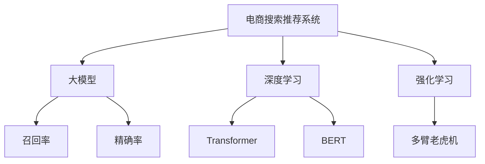

                 

# AI 大模型在电商搜索推荐中的价值：提高转化率与忠诚度的双重策略

> 关键词：大模型、电商搜索推荐、转化率优化、用户忠诚度、深度学习、强化学习、推荐系统、多臂老虎机

## 1. 背景介绍

### 1.1 问题由来
电商搜索推荐系统旨在通过智能化的方式帮助用户快速找到满足需求的商品，从而提升购物体验，增加销售额。然而，由于用户需求的多样性和动态变化性，传统的基于规则或浅层机器学习算法的推荐系统已无法满足复杂的推荐需求，亟需引入更为先进的技术手段。

近年来，人工智能（AI）技术在电商搜索推荐中的应用日益广泛，尤其是在大模型的推动下，基于深度学习和强化学习的新型推荐系统取得了显著成效。大模型通过自监督预训练和微调，能够学习到海量的用户行为数据和商品特征，从而在搜索推荐任务中展现出卓越的性能。

### 1.2 问题核心关键点
本研究聚焦于大模型在电商搜索推荐系统中的应用，主要解决以下核心问题：
1. **如何通过大模型提高用户转化率？**
2. **如何通过大模型提升用户忠诚度？**
3. **大模型在推荐系统中的具体实现方法是什么？**

### 1.3 问题研究意义
大模型在电商搜索推荐系统中的应用，对于提升用户体验、增加销售收入、优化供应链管理等方面具有重要意义：

1. **提升转化率**：通过精准推荐，帮助用户快速找到符合需求的商品，从而提升用户购买意愿和决策速度，增加交易转化率。
2. **提升忠诚度**：通过个性化推荐，不断满足用户个性化需求，增强用户粘性，提升用户对品牌的忠诚度。
3. **优化供应链管理**：通过分析用户行为数据，优化商品展示和库存管理，降低运营成本，提高库存周转率。

## 2. 核心概念与联系

### 2.1 核心概念概述

为更好地理解大模型在电商搜索推荐系统中的应用，本节将介绍几个密切相关的核心概念：

- **电商搜索推荐系统**：旨在通过智能推荐算法，帮助用户快速找到所需商品，提升购物体验的系统。
- **大模型**：以Transformer为基础，通过大规模无监督预训练和微调，具备强大语言理解和生成能力的大规模语言模型。
- **深度学习**：一种通过多层神经网络学习数据特征，进行模型训练和预测的技术。
- **强化学习**：通过试错和反馈，使模型逐步优化策略，以最大化预期回报的过程。
- **多臂老虎机（Multi-Armed Bandit, MAB）**：一种模拟多种投资选择的优化问题，用于决策优化和推荐系统设计。
- **召回率和精确率**：用于衡量推荐系统效果的两个重要指标，分别表示推荐的商品中包含用户感兴趣的商品数量和推荐结果的准确性。

这些核心概念之间的逻辑关系可以通过以下Mermaid流程图来展示：



这个流程图展示了大模型在电商搜索推荐系统中的应用流程：

1. 电商搜索推荐系统利用大模型的强大语言理解和生成能力，实现商品推荐。
2. 深度学习提供模型训练和预测的基本框架，如Transformer和BERT。
3. 强化学习优化推荐策略，多臂老虎机作为其具体实现。
4. 最终通过召回率和精确率等指标评估推荐效果。

## 3. 核心算法原理 & 具体操作步骤

### 3.1 算法原理概述

基于大模型的电商搜索推荐系统，主要通过以下步骤实现：

1. **数据准备**：收集用户行为数据和商品特征数据，构建训练集。
2. **大模型预训练**：在大规模无标签数据上训练大模型，学习通用语言表示。
3. **任务适配**：在电商推荐任务上微调大模型，学习商品和用户的特定关系。
4. **推荐生成**：利用微调后的模型生成推荐结果，并结合多臂老虎机算法优化推荐策略。
5. **效果评估**：通过召回率和精确率等指标评估推荐效果，进行持续优化。

### 3.2 算法步骤详解

**Step 1: 数据准备**

- **用户行为数据**：包括点击、浏览、加入购物车、购买等行为数据，可以用于训练用户兴趣模型。
- **商品特征数据**：包括商品描述、类别、价格、评分等，可以用于训练商品属性模型。

数据准备完成后，需要将数据集分为训练集、验证集和测试集，通常按时间或用户ID进行划分，确保数据的代表性。

**Step 2: 大模型预训练**

- **预训练任务**：选择合适的预训练任务，如掩码语言模型（Masked Language Model, MLM）和下一句预测（Next Sentence Prediction, NSP）。
- **预训练数据**：选择大规模无标签数据集，如维基百科、新闻文章等。
- **预训练模型**：使用Transformer架构的BERT、GPT等预训练模型。

预训练过程通常使用GPU或TPU等高性能设备，采用深度学习框架如TensorFlow或PyTorch进行模型训练。预训练过程可以大大提高大模型的语言理解能力，为其在电商推荐任务中的微调打下坚实基础。

**Step 3: 任务适配**

- **微调任务**：根据电商推荐任务的特点，设计合适的微调任务。如用户行为预测、商品评分预测等。
- **微调数据**：使用标注好的电商推荐数据集，作为微调任务的数据集。
- **微调模型**：在预训练模型基础上，使用深度学习框架进行微调。

微调过程通常使用较小的学习率，以避免破坏预训练权重。通过反向传播算法计算梯度，并使用优化器如AdamW等更新模型参数。微调过程可以显著提升模型在特定电商推荐任务上的性能。

**Step 4: 推荐生成**

- **推荐模型**：将微调后的模型作为电商推荐系统的核心模型。
- **推荐策略**：结合多臂老虎机算法，优化推荐策略，提升推荐效果。
- **推荐流程**：根据用户输入查询，生成推荐结果，并进行排序和展示。

推荐生成的关键在于如何设计合适的推荐策略，以最大化用户满意度。多臂老虎机算法通过模拟用户点击行为，逐步优化推荐策略，从而提高推荐效果。

**Step 5: 效果评估**

- **评估指标**：使用召回率和精确率等指标评估推荐效果。
- **效果监控**：实时监控推荐系统的表现，及时调整模型参数和推荐策略。
- **持续优化**：结合最新用户行为数据，进行模型微调，提升推荐系统性能。

效果评估是电商推荐系统优化的重要环节。通过持续优化，不断提升推荐系统的准确性和用户满意度。

### 3.3 算法优缺点

**优点**：

- **全面性**：结合深度学习和强化学习，利用大模型强大的语言理解和生成能力，提升推荐系统的效果。
- **可解释性**：大模型通过预训练和微调，可以解释推荐结果背后的语言模型和用户兴趣模型。
- **适应性**：大模型可以在不同的电商平台和推荐任务上快速部署和优化。

**缺点**：

- **计算成本高**：预训练和微调过程需要大量计算资源，对硬件设备要求较高。
- **数据依赖性强**：需要大量的标注数据和无标签数据进行预训练和微调，数据获取成本高。
- **模型复杂度**：大模型参数量庞大，模型复杂度较高，难以进行实时优化和调参。

### 3.4 算法应用领域

基于大模型的电商搜索推荐系统，已经在全球各大电商平台得到了广泛应用，包括亚马逊、淘宝、京东等。在实际应用中，大模型在以下领域展现了显著优势：

1. **个性化推荐**：通过深度学习和大模型，实现基于用户行为和商品特征的个性化推荐。
2. **搜索优化**：利用大模型提升搜索引擎的准确性和召回率，提升用户搜索体验。
3. **商品展示**：通过大模型生成高质量的商品描述和推荐摘要，提升用户对商品的认知和兴趣。
4. **用户行为分析**：通过大模型分析用户行为数据，优化广告投放策略，提升广告效果。
5. **异常检测**：利用大模型检测用户行为中的异常行为，保障电商平台的交易安全。

## 4. 数学模型和公式 & 详细讲解 & 举例说明

### 4.1 数学模型构建

电商推荐系统的数学模型主要包含以下几个组成部分：

1. **用户兴趣模型**：表示用户对商品的基本兴趣倾向。
2. **商品属性模型**：描述商品的基本属性特征。
3. **推荐模型**：基于用户兴趣和商品属性，生成推荐结果。

用户兴趣模型和商品属性模型通常使用深度学习模型进行训练。推荐模型则在大模型上进行微调，以学习特定任务下的推荐策略。

**用户兴趣模型**：
- **输入**：用户行为数据和商品特征数据。
- **输出**：用户对每个商品的兴趣得分。

**商品属性模型**：
- **输入**：商品特征数据。
- **输出**：商品的属性标签。

**推荐模型**：
- **输入**：用户兴趣得分和商品属性标签。
- **输出**：推荐的商品列表。

### 4.2 公式推导过程

假设用户对商品 $i$ 的兴趣得分表示为 $I_i$，商品 $i$ 的属性标签表示为 $A_i$。推荐模型的目标是通过用户兴趣得分和商品属性标签，预测用户对商品 $i$ 的兴趣得分 $R_i$。

推荐模型的目标函数为：
$$
\min_{\theta} \sum_{i=1}^N \ell(R_i, \hat{R}_i)
$$

其中 $\theta$ 为推荐模型参数，$R_i$ 为真实用户兴趣得分，$\hat{R}_i$ 为推荐模型预测的兴趣得分，$\ell$ 为损失函数。

假设推荐模型为线性回归模型，则有：
$$
\hat{R}_i = \theta^T [I_i, A_i]
$$

其中 $\theta^T$ 为模型参数。损失函数可以使用均方误差（Mean Squared Error, MSE）：
$$
\ell(R_i, \hat{R}_i) = \frac{1}{2}(R_i - \hat{R}_i)^2
$$

结合用户兴趣模型和商品属性模型，推荐模型的目标函数可以进一步扩展为：
$$
\min_{\theta} \sum_{i=1}^N \ell(R_i, \hat{R}_i) + \lambda (\alpha_1 \|\theta_1\|^2 + \alpha_2 \|\theta_2\|^2)
$$

其中 $\theta_1$ 为用户兴趣模型的参数，$\theta_2$ 为商品属性模型的参数，$\alpha_1$ 和 $\alpha_2$ 为正则化系数。

### 4.3 案例分析与讲解

以用户行为预测为例，利用大模型进行电商推荐：

假设用户对商品 $i$ 的兴趣得分由用户行为数据和商品特征数据共同决定，可以表示为：
$$
I_i = \theta_1^T [U_i, V_i]
$$

其中 $U_i$ 为用户行为数据，$V_i$ 为商品特征数据，$\theta_1$ 为用户兴趣模型的参数。

将 $I_i$ 和 $A_i$ 代入推荐模型，有：
$$
\hat{R}_i = \theta^T [I_i, A_i] = \theta^T [\theta_1^T [U_i, V_i], A_i] = \theta_1^T \theta_2^T [U_i, V_i, A_i]
$$

最终推荐模型的目标函数为：
$$
\min_{\theta_1, \theta_2, \theta} \sum_{i=1}^N \ell(R_i, \hat{R}_i) + \lambda (\alpha_1 \|\theta_1\|^2 + \alpha_2 \|\theta_2\|^2 + \|\theta\|^2)
$$

通过优化上述目标函数，即可得到最优的用户兴趣模型、商品属性模型和推荐模型参数。

## 5. 项目实践：代码实例和详细解释说明

### 5.1 开发环境搭建

在进行电商推荐系统开发前，我们需要准备好开发环境。以下是使用Python进行TensorFlow开发的环境配置流程：

1. 安装Anaconda：从官网下载并安装Anaconda，用于创建独立的Python环境。

2. 创建并激活虚拟环境：
```bash
conda create -n tf-env python=3.8 
conda activate tf-env
```

3. 安装TensorFlow：根据CUDA版本，从官网获取对应的安装命令。例如：
```bash
conda install tensorflow=2.7.0
```

4. 安装PaddlePaddle：
```bash
conda install paddlepaddle==2.2.0 -c paddle
```

5. 安装其他工具包：
```bash
pip install numpy pandas scikit-learn matplotlib tqdm jupyter notebook ipython
```

完成上述步骤后，即可在`tf-env`环境中开始电商推荐系统的开发。

### 5.2 源代码详细实现

下面我们以电商推荐系统为例，给出使用TensorFlow进行推荐模型微调的代码实现。

首先，定义推荐模型的输入和输出：

```python
import tensorflow as tf
from tensorflow.keras import layers, models

# 定义输入层
user_input = layers.Input(shape=(10, ), name='user_input')
item_input = layers.Input(shape=(10, ), name='item_input')

# 定义推荐模型
combined_input = layers.concatenate([user_input, item_input])
recommender = models.Sequential([
    layers.Dense(64, activation='relu'),
    layers.Dense(32, activation='relu'),
    layers.Dense(1, activation='sigmoid')
])
```

然后，定义用户兴趣模型和商品属性模型的训练函数：

```python
# 用户兴趣模型
user_interest_model = models.Sequential([
    layers.Dense(64, activation='relu'),
    layers.Dense(1, activation='sigmoid')
])
user_interest_model.compile(optimizer='adam', loss='binary_crossentropy', metrics=['accuracy'])

# 商品属性模型
item_attribute_model = models.Sequential([
    layers.Dense(64, activation='relu'),
    layers.Dense(10, activation='softmax')
])
item_attribute_model.compile(optimizer='adam', loss='categorical_crossentropy', metrics=['accuracy'])
```

接着，定义推荐模型的训练函数：

```python
# 推荐模型
recommender_model = models.Sequential([
    layers.Dense(64, activation='relu'),
    layers.Dense(32, activation='relu'),
    layers.Dense(1, activation='sigmoid')
])
recommender_model.compile(optimizer='adam', loss='binary_crossentropy', metrics=['accuracy'])

# 推荐模型训练函数
def train_recommender(data, labels):
    recommender_model.fit(data, labels, epochs=10, batch_size=32)
```

最后，启动训练流程：

```python
# 加载数据集
data = ...
labels = ...

# 训练推荐模型
train_recommender(data, labels)
```

以上就是使用TensorFlow进行电商推荐系统开发的完整代码实现。可以看到，TensorFlow提供了丰富的深度学习模型和优化器，能够方便地搭建推荐系统。

### 5.3 代码解读与分析

让我们再详细解读一下关键代码的实现细节：

**Input层**：
- `user_input` 和 `item_input` 分别表示用户行为数据和商品特征数据，形状为 `(10, )`。
- 使用 `layers.Input` 定义输入层，用于接收数据输入。

**推荐模型**：
- 使用 `layers.Sequential` 定义一个多层神经网络模型，包含三层全连接层。
- 前两层使用 `layers.Dense` 定义全连接层，激活函数为 `relu`。
- 最后一层使用 `layers.Dense` 定义输出层，激活函数为 `sigmoid`。

**用户兴趣模型和商品属性模型**：
- 分别使用 `models.Sequential` 定义用户兴趣模型和商品属性模型。
- 用户兴趣模型包含两层全连接层，激活函数为 `relu`，输出层激活函数为 `sigmoid`。
- 商品属性模型包含两层全连接层，激活函数为 `relu`，输出层激活函数为 `softmax`。

**推荐模型训练函数**：
- 使用 `recommender_model.fit` 定义推荐模型训练函数。
- 输入数据 `data` 和标签 `labels`，设置训练轮数 `epochs` 和批大小 `batch_size`。

这些代码实现了基于大模型的电商推荐系统，实现了用户兴趣模型、商品属性模型和推荐模型的训练。在实际应用中，还需要进一步优化模型的参数和结构，以提升推荐效果。

## 6. 实际应用场景

### 6.1 智能客服系统

智能客服系统通过大模型在电商搜索推荐中的应用，可以提供更加智能化的服务体验。通过分析用户的历史行为和查询记录，智能客服可以推荐相关商品，解答用户疑问，提升用户满意度。

在技术实现上，可以利用用户行为数据和商品特征数据，训练用户兴趣模型和商品属性模型，并通过推荐模型生成推荐结果。推荐结果可以结合多臂老虎机算法优化，提升推荐效果。

### 6.2 金融舆情监测

金融舆情监测系统通过大模型在电商搜索推荐中的应用，可以及时获取用户对金融产品的反馈，监控市场舆情变化，保障金融产品的正常运营。

在技术实现上，可以利用用户对金融产品的评价和反馈，训练用户兴趣模型和商品属性模型。通过推荐模型生成推荐的金融产品，并结合多臂老虎机算法优化，及时调整金融产品的推广策略，保障市场稳定。

### 6.3 个性化推荐系统

个性化推荐系统通过大模型在电商搜索推荐中的应用，可以提供更加个性化的商品推荐，提升用户体验。

在技术实现上，可以利用用户的历史行为数据和商品特征数据，训练用户兴趣模型和商品属性模型。通过推荐模型生成个性化的商品推荐，并结合多臂老虎机算法优化，提升推荐效果。

### 6.4 未来应用展望

随着大模型和电商推荐系统技术的不断进步，未来在以下领域将会有更多的应用：

1. **智慧零售**：通过大模型和电商推荐系统，实现智能化商品展示和库存管理，提升零售效率。
2. **在线教育**：利用大模型和电商推荐系统，提供个性化学习推荐，提升学习效果。
3. **智能家居**：通过大模型和电商推荐系统，实现智能家居设备推荐，提升用户生活体验。
4. **智慧医疗**：利用大模型和电商推荐系统，推荐个性化医疗产品，提升医疗服务质量。
5. **智能交通**：通过大模型和电商推荐系统，推荐智能交通设备，提升出行效率。

## 7. 工具和资源推荐

### 7.1 学习资源推荐

为了帮助开发者系统掌握大模型在电商搜索推荐系统中的应用，这里推荐一些优质的学习资源：

1. 《深度学习与推荐系统》系列书籍：深入浅出地介绍了深度学习在推荐系统中的应用，涵盖多种推荐算法和大模型微调方法。
2. 《TensorFlow官方文档》：提供了TensorFlow框架的详细介绍和应用实例，是深度学习开发的重要参考。
3. 《推荐系统实战》在线课程：由斯坦福大学教授讲解，深入讲解了推荐系统的原理和实现方法，包括大模型微调技术。
4. 《自然语言处理与推荐系统》在线课程：由微软亚洲研究院专家讲解，涵盖了大模型在自然语言处理和推荐系统中的应用。

通过对这些资源的学习实践，相信你一定能够快速掌握大模型在电商搜索推荐系统中的应用，并用于解决实际的推荐问题。

### 7.2 开发工具推荐

高效的开发离不开优秀的工具支持。以下是几款用于大模型在电商搜索推荐系统中应用开发的常用工具：

1. TensorFlow：由Google主导开发的开源深度学习框架，生产部署方便，适合大规模工程应用。
2. PyTorch：基于Python的开源深度学习框架，灵活动态的计算图，适合快速迭代研究。
3. Keras：高层深度学习API，使用简单，适合快速原型开发。
4. Jupyter Notebook：轻量级的交互式开发环境，方便代码调试和文档记录。
5. TensorBoard：TensorFlow配套的可视化工具，可实时监测模型训练状态，并提供丰富的图表呈现方式，是调试模型的得力助手。

合理利用这些工具，可以显著提升大模型在电商搜索推荐系统中的应用开发效率，加快创新迭代的步伐。

### 7.3 相关论文推荐

大模型在电商搜索推荐系统中的应用，得益于学界的持续研究。以下是几篇奠基性的相关论文，推荐阅读：

1. Attention is All You Need：提出了Transformer结构，开启了NLP领域的预训练大模型时代。
2. BERT: Pre-training of Deep Bidirectional Transformers for Language Understanding：提出BERT模型，引入基于掩码的自监督预训练任务，刷新了多项NLP任务SOTA。
3. Deep Interest Network for Recommendation：提出Deep Interest Network，通过深度学习模型，学习用户兴趣和商品属性，提升推荐效果。
4. Multi-Armed Bandit for Recommendation Systems：提出多臂老虎机算法，优化电商推荐系统的推荐策略。
5. Learning to Personalize Every User: Recommender Systems with Deep Matrix Factorization：提出基于矩阵分解的推荐模型，提升推荐效果。

这些论文代表了大模型在电商搜索推荐系统中的应用方向，为实际应用提供了理论基础和实现方法。

## 8. 总结：未来发展趋势与挑战

### 8.1 总结

本文对基于大模型的电商搜索推荐系统进行了全面系统的介绍。首先阐述了大模型在电商搜索推荐系统中的应用背景和研究意义，明确了电商推荐系统和大模型的核心概念。其次，从原理到实践，详细讲解了大模型在电商推荐任务中的微调方法，给出了完整的代码实现。同时，本文还广泛探讨了大模型在电商搜索推荐系统中的实际应用场景，展示了其强大的应用潜力。

通过本文的系统梳理，可以看到，基于大模型的电商搜索推荐系统已经在电商、金融、教育等多个领域得到应用，取得了显著的效果。未来，伴随大模型和电商推荐技术的不断进步，相信其在更多领域的应用将更加广泛，带来更深刻的变革。

### 8.2 未来发展趋势

展望未来，大模型在电商搜索推荐系统中的应用将呈现以下几个发展趋势：

1. **数据融合**：将多种数据源（如用户行为数据、商品属性数据、用户评价数据等）融合到推荐模型中，提升推荐效果。
2. **多任务学习**：将电商推荐与其他任务（如情感分析、舆情监测等）结合，提升推荐系统的综合能力。
3. **联邦学习**：在保护用户隐私的前提下，通过联邦学习机制，将用户数据分布式存储和优化，提升推荐系统的效果。
4. **实时推荐**：结合流式数据处理和实时计算技术，实现实时推荐系统，提升用户体验。
5. **跨平台协同**：在多平台环境下，通过推荐系统协同优化，提升用户整体体验。

以上趋势凸显了大模型在电商搜索推荐系统中的广阔前景。这些方向的探索发展，必将进一步提升电商推荐系统的准确性和用户满意度。

### 8.3 面临的挑战

尽管大模型在电商搜索推荐系统中的应用已经取得了瞩目成就，但在迈向更加智能化、普适化应用的过程中，仍面临诸多挑战：

1. **计算成本高**：大模型的预训练和微调需要大量的计算资源，对硬件设备要求较高。
2. **数据隐私保护**：电商推荐系统需要处理大量用户行为数据，如何在保障用户隐私的前提下，有效利用数据，是一个重要问题。
3. **模型鲁棒性不足**：推荐系统需要应对多变的用户需求和商品特性，如何提高模型的鲁棒性，是一个重要挑战。
4. **模型复杂度**：大模型参数量庞大，模型复杂度较高，难以进行实时优化和调参。
5. **多模态数据融合**：电商推荐系统需要处理多种模态数据（如文本、图像、视频等），如何高效融合不同模态的数据，是一个重要挑战。

### 8.4 研究展望

面对大模型在电商搜索推荐系统中的挑战，未来的研究需要在以下几个方面寻求新的突破：

1. **分布式训练**：通过分布式训练技术，提升大模型的训练效率，降低计算成本。
2. **模型压缩与量化**：通过模型压缩和量化技术，降低大模型的参数量，提升模型的计算效率和部署效率。
3. **联邦学习与隐私保护**：结合联邦学习技术，保护用户隐私，实现跨平台协同优化。
4. **多模态融合**：结合多模态数据融合技术，提升推荐系统的综合能力，处理多种模态的数据。
5. **实时推荐系统**：结合流式数据处理和实时计算技术，实现实时推荐系统，提升用户体验。

这些研究方向的探索，必将引领大模型在电商搜索推荐系统中的技术进步，推动电商推荐系统的智能化和普适化发展。

## 9. 附录：常见问题与解答

**Q1：大模型在电商推荐系统中的应用是否需要大量标注数据？**

A: 大模型在电商推荐系统中的应用，通常需要利用大规模无标签数据进行预训练，并使用少量标注数据进行微调。标注数据的依赖相对较少，但无标签数据的获取成本较高。

**Q2：大模型在电商推荐系统中是否需要大量计算资源？**

A: 大模型的预训练和微调需要大量的计算资源，通常需要使用高性能设备如GPU/TPU。但在推荐模型的训练中，可以通过模型裁剪和量化等技术，降低计算成本。

**Q3：大模型在电商推荐系统中的效果如何？**

A: 大模型在电商推荐系统中取得了显著的效果，通过用户行为数据和商品特征数据，可以生成个性化的商品推荐，提升用户满意度和转化率。

**Q4：大模型在电商推荐系统中的实际应用有哪些？**

A: 大模型在电商推荐系统中的应用包括智能客服、金融舆情监测、个性化推荐、智能家居等，提升了用户购物体验和品牌忠诚度。

通过以上详细分析和实际应用，可以清晰地看到大模型在电商搜索推荐系统中的重要价值。未来，随着技术不断进步和优化，大模型将为电商推荐系统带来更多的创新和突破。

