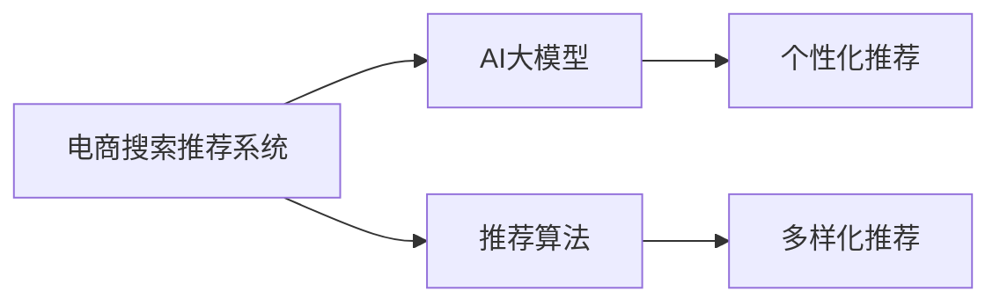

                 

# AI 大模型在电商搜索推荐中的优化策略：个性化与多样性的平衡

在电商领域，搜索推荐系统是提升用户体验和增加业务收益的关键引擎。然而，搜索推荐系统需要在个性化推荐和多样性推荐之间取得平衡，既要满足用户对特定商品的个性化需求，又要提供丰富的商品选择，避免“信息茧房”问题。近年来，AI大模型的崛起，为电商搜索推荐提供了新的技术手段，本文将深入探讨大模型在电商推荐系统中的应用，并提出一些优化策略。

## 1. 背景介绍

### 1.1 电商推荐系统现状

电商搜索推荐系统是电商应用的核心部分，其目标是通过算法推荐符合用户兴趣的商品，提升用户满意度和转化率。传统的推荐系统基于协同过滤、基于内容的推荐、基于模型的推荐等方法，但在实际应用中存在一些问题：

- **数据稀疏性**：用户的浏览和购买行为数据往往稀疏，难以有效建立用户和商品的关联关系。
- **动态变化**：用户需求和商品信息都在不断变化，需要实时更新推荐结果。
- **冷启动问题**：新用户和商品没有足够的行为数据，难以进行推荐。
- **多样性不足**：推荐系统容易陷入用户已有的兴趣圈，无法提供新的商品选择。

### 1.2 大模型应用背景

AI大模型，特别是基于深度学习的大规模预训练模型（如BERT、GPT、DALL·E等），因其在大规模语料上预训练得到的强大语言理解和生成能力，在NLP、图像、语音等领域展示了卓越的表现。这些模型通常具有如下特点：

- **泛化能力强**：在大规模数据上进行预训练，对未知数据有较强的泛化能力。
- **多模态融合**：可以处理文本、图像、音频等多种模态数据，进行跨模态的语义理解和生成。
- **自监督学习**：能够利用无标签数据进行预训练，降低标注数据的依赖。

因此，将大模型引入电商推荐系统，可以帮助解决上述传统推荐系统的痛点。

## 2. 核心概念与联系

### 2.1 核心概念概述

- **电商搜索推荐系统**：基于用户的历史行为数据，通过算法推荐符合用户兴趣的商品，提升用户满意度和转化率。
- **AI大模型**：基于深度学习的大规模预训练模型，具有强大的语言理解和生成能力，能够在多模态数据上进行跨模态的语义理解。
- **推荐算法**：包括协同过滤、基于内容的推荐、基于模型的推荐等，能够根据用户行为和商品属性进行推荐。
- **个性化推荐**：根据用户历史行为、兴趣等个性化特征，推荐符合用户需求的商品。
- **多样性推荐**：推荐系统中需要平衡用户个性化需求和多样性需求，提供丰富的商品选择。

这些核心概念之间的关系可以用以下Mermaid流程图来展示：



## 3. 核心算法原理 & 具体操作步骤

### 3.1 算法原理概述

基于大模型的电商推荐系统主要通过以下步骤实现个性化推荐和多样化推荐：

1. **预训练大模型**：在大规模无标签数据上预训练模型，学习通用的语言和视觉表征。
2. **微调**：利用有标签的电商数据对预训练模型进行微调，学习电商商品之间的语义关系。
3. **推荐生成**：将用户输入（文本、图片等）输入微调后的模型，生成推荐的商品ID或商品信息。
4. **推荐排序**：对生成的推荐结果进行排序，输出最终推荐列表。

### 3.2 算法步骤详解

#### 3.2.1 数据准备

电商推荐系统需要大量的商品信息和用户行为数据。这些数据包括商品属性、用户浏览记录、购买记录、评价记录等。数据的清洗、标注和划分是重要的预处理步骤。

#### 3.2.2 模型选择与微调

选择合适的大模型作为初始化参数，如BERT、GPT、DALL·E等。将模型与电商数据进行微调，可以采用以下方法：

- ** Fine-tuning**：在电商数据上进行有监督的微调，学习商品之间的语义关系。
- **Prompt Learning**：使用精心设计的提示模板，引导模型生成符合电商场景的推荐结果。
- **Zero-shot Learning**：在微调中无需标注数据，利用大模型的预训练能力进行推荐。

#### 3.2.3 推荐生成

推荐生成通常包含两个步骤：

- **编码**：将用户输入（文本、图片等）输入微调后的模型，生成商品ID或商品信息的向量表示。
- **解码**：将生成的向量表示解码为具体的推荐结果。

#### 3.2.4 推荐排序

推荐排序包括两个部分：

- **相关性排序**：根据商品与用户的历史行为、兴趣等信息，计算推荐结果的相关性得分。
- **多样性排序**：根据推荐结果的多样性，调整相关性排序的权重。

### 3.3 算法优缺点

#### 3.3.1 优点

1. **泛化能力强**：大模型在大规模数据上进行预训练，具有较强的泛化能力，能够处理多种模态数据。
2. **个性化推荐**：大模型可以根据用户输入生成个性化推荐结果，提升用户体验。
3. **多样性推荐**：大模型能够生成多样化的推荐结果，避免用户陷入“信息茧房”。

#### 3.3.2 缺点

1. **计算资源需求高**：大模型的计算资源需求较高，需要高性能的GPU或TPU。
2. **数据标注成本高**：大模型的微调需要大量的标注数据，增加了标注成本。
3. **过拟合风险**：大模型容易过拟合电商数据，导致推荐结果泛化性能下降。

### 3.4 算法应用领域

基于大模型的电商推荐系统可以应用于多种场景，例如：

- **商品搜索**：根据用户输入的关键词，推荐相关商品。
- **个性化推荐**：根据用户的历史行为和兴趣，推荐个性化商品。
- **新商品推荐**：推荐用户可能感兴趣的新商品。
- **购物车推荐**：根据用户已选择的商品，推荐相关商品。
- **个性化广告推荐**：根据用户的历史行为和兴趣，推荐个性化广告。

## 4. 数学模型和公式 & 详细讲解

### 4.1 数学模型构建

设电商推荐系统中有 $N$ 个商品，$M$ 个用户，$D$ 个特征。用户的历史行为数据表示为 $\{x_i\}_{i=1}^M$，商品的属性表示为 $\{y_j\}_{j=1}^N$。设 $h(x_i)$ 为用户 $i$ 的历史行为编码，$g(y_j)$ 为商品 $j$ 的属性编码。

推荐模型的目标是最小化损失函数 $L$，即：

$$
L = \sum_{i=1}^M \sum_{j=1}^N \omega_i \omega_j l(f(x_i, y_j))
$$

其中 $l$ 为损失函数，$\omega_i$ 和 $\omega_j$ 为商品和用户的重要性权重，$f(x_i, y_j)$ 为推荐函数，表示商品 $j$ 与用户 $i$ 的匹配度。

### 4.2 公式推导过程

推荐函数 $f(x_i, y_j)$ 可以表示为：

$$
f(x_i, y_j) = \sigma(W_{x_j} h(x_i) + b_{x_j})
$$

其中 $\sigma$ 为激活函数，$W_{x_j}$ 和 $b_{x_j}$ 为商品 $j$ 的参数向量。

损失函数 $l$ 可以表示为交叉熵损失：

$$
l(f(x_i, y_j)) = -y_j \log f(x_i, y_j) - (1-y_j) \log (1-f(x_i, y_j))
$$

将上述公式代入损失函数 $L$，得到：

$$
L = \sum_{i=1}^M \sum_{j=1}^N \omega_i \omega_j [-y_j \log f(x_i, y_j) - (1-y_j) \log (1-f(x_i, y_j))]
$$

### 4.3 案例分析与讲解

假设用户输入为商品属性，推荐模型为BERT，商品属性为商品名称和描述。模型首先对商品属性进行编码，生成商品向量的表示。然后将用户输入与商品向量进行匹配，计算匹配度得分。最后根据得分和用户权重进行排序，输出推荐结果。

## 5. 项目实践：代码实例和详细解释说明

### 5.1 开发环境搭建

- **环境搭建**：选择Python 3.8作为开发环境，安装PyTorch、TensorFlow等深度学习框架。
- **数据准备**：收集电商商品数据和用户行为数据，并进行清洗、标注和划分。
- **模型微调**：选择合适的大模型，如BERT，进行电商数据的微调。

### 5.2 源代码详细实现

以下是一个使用BERT进行电商推荐系统微调的示例代码：

```python
import torch
from transformers import BertForSequenceClassification, BertTokenizer

# 模型微调
model = BertForSequenceClassification.from_pretrained('bert-base-uncased', num_labels=num_classes)
tokenizer = BertTokenizer.from_pretrained('bert-base-uncased')
optimizer = AdamW(model.parameters(), lr=learning_rate)

# 训练数据准备
train_data = ...
train_labels = ...

# 训练过程
for epoch in range(num_epochs):
    model.train()
    for batch in train_data:
        inputs = tokenizer(batch['text'], return_tensors='pt', padding=True, truncation=True)
        labels = batch['label']
        outputs = model(**inputs)
        loss = outputs.loss
        optimizer.zero_grad()
        loss.backward()
        optimizer.step()

# 测试数据准备
test_data = ...
test_labels = ...

# 测试过程
model.eval()
with torch.no_grad():
    test_outputs = model(**test_data)
    predictions = torch.argmax(test_outputs.logits, dim=1)
    accuracy = (predictions == test_labels).mean()
```

### 5.3 代码解读与分析

上述代码中，`BertForSequenceClassification` 表示使用BERT进行序列分类任务，`BertTokenizer` 表示BERT的tokenizer，`AdamW` 表示优化器。在训练过程中，首先使用tokenizer对输入数据进行编码，然后计算损失函数并更新模型参数。在测试过程中，使用模型预测输出并计算准确率。

### 5.4 运行结果展示

运行上述代码，可以得到训练过程中的损失函数变化和测试过程中的准确率变化，以评估模型的性能。

## 6. 实际应用场景

### 6.1 电商搜索推荐

电商搜索推荐系统需要结合个性化推荐和多样化推荐，提升用户满意度。基于大模型的推荐系统可以通过以下方式实现：

- **个性化推荐**：根据用户的历史行为和兴趣，生成个性化推荐结果。
- **多样化推荐**：在推荐结果中包含多个商品选项，避免用户陷入“信息茧房”。
- **实时更新**：实时收集用户反馈和行为数据，更新推荐模型。

### 6.2 新商品推荐

新商品推荐需要解决冷启动问题，即新商品和用户没有足够的行为数据。基于大模型的推荐系统可以通过以下方式实现：

- **多模态融合**：结合商品图片、描述等信息，进行多模态的语义理解。
- **知识图谱**：利用知识图谱，获取商品和用户之间的关系，进行推荐。
- **协同过滤**：结合用户和商品的属性信息，进行协同过滤推荐。

### 6.3 购物车推荐

购物车推荐需要考虑用户的购买历史和当前选择的商品，生成相关推荐结果。基于大模型的推荐系统可以通过以下方式实现：

- **序列建模**：利用序列模型，捕捉用户的购买行为。
- **深度学习**：结合深度学习技术，捕捉复杂的用户行为和商品关系。
- **实时更新**：实时收集用户行为和商品信息，更新推荐模型。

## 7. 工具和资源推荐

### 7.1 学习资源推荐

- **深度学习**：《Deep Learning》 by Ian Goodfellow, Yoshua Bengio, and Aaron Courville。
- **自然语言处理**：《Natural Language Processing with PyTorch》 by Steven Bird, Ewan Klein, and Edward Loper。
- **推荐系统**：《Recommender Systems》 by Balakrishnan et al.。

### 7.2 开发工具推荐

- **PyTorch**：深度学习框架，支持动态计算图。
- **TensorFlow**：深度学习框架，支持静态计算图和分布式训练。
- **Hugging Face**：NLP工具库，提供预训练模型和微调样例。

### 7.3 相关论文推荐

- "Attention is All You Need" by Vaswani et al.，介绍Transformer模型。
- "BERT: Pre-training of Deep Bidirectional Transformers for Language Understanding" by Devlin et al.，介绍BERT模型。
- "Fine-tuning Neural Networks for Sequence Prediction in Clinical Practice" by Budzak et al.，介绍医疗领域中的序列预测。

## 8. 总结：未来发展趋势与挑战

### 8.1 研究成果总结

本文介绍了大模型在电商搜索推荐系统中的应用，探讨了个性化推荐和多样化推荐的优化策略。研究表明，基于大模型的推荐系统能够提升用户体验和转化率，具有广阔的应用前景。

### 8.2 未来发展趋势

1. **多模态融合**：结合文本、图像、音频等多种模态数据，进行跨模态的语义理解。
2. **自监督学习**：利用无标签数据进行预训练，降低标注数据的依赖。
3. **实时更新**：实时收集用户反馈和行为数据，更新推荐模型。
4. **个性化推荐**：结合用户的多维特征，生成个性化推荐结果。
5. **多样化推荐**：在推荐结果中包含多个商品选项，避免用户陷入“信息茧房”。

### 8.3 面临的挑战

1. **计算资源需求高**：大模型的计算资源需求较高，需要高性能的GPU或TPU。
2. **数据标注成本高**：大模型的微调需要大量的标注数据，增加了标注成本。
3. **过拟合风险**：大模型容易过拟合电商数据，导致推荐结果泛化性能下降。
4. **隐私问题**：电商推荐系统需要处理大量用户数据，需要考虑隐私保护问题。
5. **公平性问题**：推荐系统可能存在偏见，需要考虑公平性问题。

### 8.4 研究展望

未来的研究需要在以下几个方面寻求新的突破：

1. **多模态融合**：结合文本、图像、音频等多种模态数据，进行跨模态的语义理解。
2. **自监督学习**：利用无标签数据进行预训练，降低标注数据的依赖。
3. **实时更新**：实时收集用户反馈和行为数据，更新推荐模型。
4. **个性化推荐**：结合用户的多维特征，生成个性化推荐结果。
5. **多样化推荐**：在推荐结果中包含多个商品选项，避免用户陷入“信息茧房”。

这些研究方向的探索，必将引领大语言模型微调技术迈向更高的台阶，为构建安全、可靠、可解释、可控的智能系统铺平道路。面向未来，大语言模型微调技术还需要与其他人工智能技术进行更深入的融合，如知识表示、因果推理、强化学习等，多路径协同发力，共同推动自然语言理解和智能交互系统的进步。

## 9. 附录：常见问题与解答

**Q1：大模型在电商推荐系统中如何进行个性化推荐？**

A: 大模型可以根据用户输入生成个性化推荐结果。首先使用tokenizer对用户输入进行编码，然后将其输入到微调后的模型中，生成商品ID或商品信息的向量表示。最后根据向量表示和用户权重进行排序，输出个性化推荐结果。

**Q2：如何平衡个性化推荐和多样化推荐？**

A: 在推荐结果中包含多个商品选项，避免用户陷入“信息茧房”。同时根据用户的历史行为和兴趣，计算推荐结果的相关性得分，调整多样性排序的权重。

**Q3：如何处理电商推荐系统中的冷启动问题？**

A: 利用多模态融合、知识图谱和协同过滤等方法，结合商品图片、描述等信息，进行多模态的语义理解，获取商品和用户之间的关系，进行推荐。

**Q4：电商推荐系统中如何保证隐私保护？**

A: 采用数据脱敏、访问鉴权等措施，保障用户数据的安全性和隐私性。

**Q5：如何提高大模型的泛化性能？**

A: 结合自监督学习和对抗训练等技术，提高大模型的泛化性能。在微调过程中，可以通过数据增强和正则化等技术，避免过拟合。

