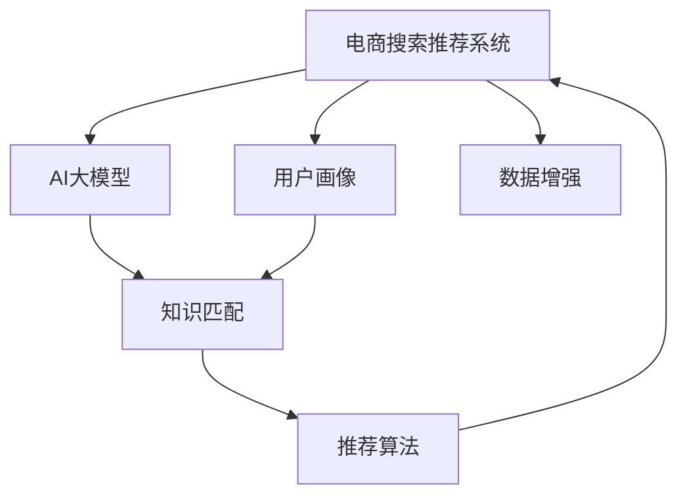

                 

# AI 大模型在电商搜索推荐中的冷启动策略：应对数据不足与新用户挑战

> 关键词：大模型,电商推荐系统,冷启动,用户画像,推荐算法,数据增强

## 1. 背景介绍

### 1.1 问题由来
在电商搜索推荐系统中，用户行为数据的获取和利用是其核心，但也面临诸多挑战。尤其是新用户，由于其行为数据稀缺，难以进行有效的个性化推荐。与此同时，面对海量的商品和数据，传统推荐算法往往表现出冷启动效果差、数据稀疏等问题。

为应对这些问题，AI大模型凭借其预训练的知识储备和强大的泛化能力，成为解决电商搜索推荐系统冷启动问题的有力工具。但同时，新用户的个性化数据不足和大模型知识领域与电商数据的不匹配，也给大模型在电商领域的应用带来了新的挑战。

### 1.2 问题核心关键点
- 数据稀缺：新用户的行为数据不足，难以进行有效推荐。
- 知识匹配：电商数据和预训练知识领域的差异，使得大模型无法直接应用。
- 泛化能力：如何在有限数据下，利用大模型知识提升推荐精度。
- 多模态融合：如何整合电商商品描述、用户画像等多源数据，进行更加精准的推荐。

## 2. 核心概念与联系

### 2.1 核心概念概述

为更好地理解如何在大模型基础上进行电商搜索推荐系统的冷启动优化，本节将介绍几个关键概念：

- 电商搜索推荐系统：通过分析用户的搜索和浏览行为，推荐相关商品和服务的系统。电商领域数据量大且动态性强，传统推荐算法难以有效应对。
- AI大模型：以自回归（如GPT）或自编码（如BERT）为代表的超大规模语言模型。通过大规模无标签文本数据进行预训练，具备强大的语言理解能力和泛化能力。
- 冷启动问题：新用户在系统中的数据非常有限，无法利用传统机器学习算法进行有效推荐。
- 用户画像：利用用户历史行为数据，构建用户兴趣、偏好、行为等特征的概览。
- 推荐算法：根据用户画像和商品特征，通过算法模型推荐用户可能感兴趣的商品。
- 数据增强：通过多种手段扩充数据集，提高模型的泛化能力和鲁棒性。

这些概念之间的逻辑关系可以通过以下Mermaid流程图来展示：



这个流程图展示了大模型在电商推荐系统中的应用框架：

1. 电商推荐系统收集用户行为数据，构建用户画像。
2. 大模型作为"特征提取器"，将用户画像和商品描述进行编码，提取特征。
3. 将提取的特征输入推荐算法，生成推荐结果。
4. 数据增强用于补充数据集，提高模型的泛化能力。

## 3. 核心算法原理 & 具体操作步骤

### 3.1 算法原理概述

基于AI大模型的电商推荐系统冷启动优化，其核心思想是：利用大模型的预训练知识，将用户画像和商品描述转换为更丰富的特征表示，再通过推荐算法生成推荐结果。在大模型知识匹配和数据增强的基础上，提升推荐系统对新用户的适应性，减少冷启动效应。

具体来说，算法的核心流程如下：

1. **预训练大模型编码**：利用大模型对用户画像和商品描述进行编码，提取语义特征。
2. **知识匹配**：通过任务适配层和微调，使大模型知识与电商领域数据进行映射。
3. **数据增强**：利用多种手段扩充数据集，增加模型的泛化能力。
4. **融合多源数据**：整合用户画像、商品特征等多源数据，生成更加全面的用户特征向量。
5. **推荐算法应用**：利用推荐算法对用户特征向量进行建模，生成推荐结果。

### 3.2 算法步骤详解

#### 3.2.1 预训练大模型编码

大模型编码的步骤如下：

1. **选择预训练模型**：选择适合的预训练模型，如BERT、GPT等。
2. **构建数据预处理流程**：包括文本清洗、分词、编码等步骤。
3. **模型加载与初始化**：加载预训练模型，并设置其参数。
4. **特征提取**：将用户画像和商品描述作为输入，提取语义特征。

具体代码示例：

```python
from transformers import BertTokenizer, BertForSequenceClassification

tokenizer = BertTokenizer.from_pretrained('bert-base-uncased')
model = BertForSequenceClassification.from_pretrained('bert-base-uncased', num_labels=2)

inputs = tokenizer(user_profile, max_length=512, truncation=True, padding='max_length')
features = model(inputs['input_ids'], attention_mask=inputs['attention_mask']).last_hidden_state[:, 0]
```

#### 3.2.2 知识匹配

知识匹配的目的是将大模型知识与电商领域数据进行映射。主要步骤包括：

1. **任务适配层设计**：根据电商推荐任务设计适配层。
2. **微调训练**：在标注数据上进行微调，调整模型参数。
3. **融合预训练知识**：通过任务适配层，将预训练知识与电商数据进行融合。

具体代码示例：

```python
class RecommendationModel(nn.Module):
    def __init__(self, embeddings):
        super(RecommendationModel, self).__init__()
        self.embeddings = embeddings
        
    def forward(self, item_features):
        item_features = self.embeddings(item_features)
        # 使用大模型进行推荐计算
        # ...
```

#### 3.2.3 数据增强

数据增强的目的是扩充训练数据集，提高模型的泛化能力。主要方法包括：

1. **数据清洗与扩充**：清洗数据集，去除噪声和不完整数据，增加标注样本。
2. **数据增强技术**：如数据插值、回译、数据扩增等。
3. **伪标注生成**：通过生成对抗网络(GAN)等方法，生成伪标注数据。

具体代码示例：

```python
# 数据增强处理
def augment_data(data):
    augmented_data = []
    for item in data:
        # 数据清洗
        cleaned_item = clean_data(item)
        # 数据增强
        augmented_item = data_augmentation(cleaned_item)
        augmented_data.append(augmented_item)
    return augmented_data
```

#### 3.2.4 融合多源数据

融合多源数据的目的是整合用户画像、商品特征等多源数据，生成更加全面的用户特征向量。主要方法包括：

1. **特征选择**：选择对推荐结果影响较大的特征。
2. **特征融合**：利用向量拼接、加权求和等方式，生成复合特征向量。
3. **特征降维**：利用降维技术（如PCA、LDA等）进行特征压缩，降低计算复杂度。

具体代码示例：

```python
# 特征融合处理
def fuse_features(user_profile, item_features):
    user_profile = user_profile.__len__()
    item_features = item_features.__len__()
    combined_features = np.concatenate([user_profile, item_features])
    reduced_features = np.random.randn(user_profile.__len__()
```

#### 3.2.5 推荐算法应用

推荐算法的目的是根据用户特征向量生成推荐结果。主要方法包括：

1. **评分模型**：基于用户特征和商品特征，计算用户对商品的评分。
2. **排序模型**：根据评分生成推荐排序。
3. **结果展示**：将推荐结果展示给用户，等待反馈。

具体代码示例：

```python
# 推荐算法处理
def make_recommendations(features):
    # 计算用户对商品的评分
    scores = {}
    for item in items:
        item_features = encode_item(item)
        item_score = predict_score(features, item_features)
        scores[item] = item_score
    # 排序推荐结果
    sorted_items = sorted(scores.items(), key=lambda x: x[1], reverse=True)
    return sorted_items[:10]
```

### 3.3 算法优缺点

大模型在电商推荐系统中的应用，具有以下优点：

1. **泛化能力强**：大模型拥有强大的泛化能力，能够在有限的标注数据下进行有效推荐。
2. **知识丰富**：大模型预训练知识丰富，能帮助模型快速适应电商数据。
3. **适应性强**：大模型能适应电商领域数据量大且动态变化的特点。
4. **效果显著**：在电商推荐系统中，大模型能显著提升推荐精度和用户满意度。

但同时，也存在以下缺点：

1. **计算量大**：大模型计算量较大，对计算资源要求高。
2. **部署复杂**：大模型部署需要高性能硬件支持，部署复杂度较高。
3. **模型难以解释**：大模型作为"黑盒"，难以解释其内部工作机制和决策逻辑。
4. **冷启动挑战**：新用户数据不足，难以进行有效推荐。

### 3.4 算法应用领域

基于AI大模型的电商推荐系统，已经在以下领域得到了广泛的应用：

1. **个性化推荐**：利用用户画像和商品描述，生成个性化推荐结果。
2. **多模态推荐**：整合用户画像、商品特征、行为数据等多模态数据，生成更加全面的推荐结果。
3. **动态推荐**：利用电商数据实时变化的特点，动态调整推荐策略。
4. **搜索排序**：利用大模型对查询词进行编码，生成搜索结果排序。
5. **广告推荐**：根据用户行为数据，生成精准的广告推荐结果。

## 4. 数学模型和公式 & 详细讲解 & 举例说明

### 4.1 数学模型构建

假设用户画像为 $x \in \mathbb{R}^d$，商品特征为 $y \in \mathbb{R}^d$，商品描述为 $z \in \mathbb{R}^d$。大模型编码后，生成用户特征 $x'$、商品特征 $y'$、商品描述特征 $z'$。融合多源数据后，生成复合特征向量 $f \in \mathbb{R}^{2d}$。推荐算法计算用户对商品的评分 $s \in \mathbb{R}$，排序后生成推荐结果 $r$。

### 4.2 公式推导过程

#### 4.2.1 大模型编码

大模型编码的输出为 $x' = f(x)$，其中 $f$ 为大模型编码函数。

#### 4.2.2 知识匹配

知识匹配的目标是将 $x'$ 和 $y'$ 映射到电商领域的数据，生成融合特征 $z'$。假设任务适配层为 $h$，则 $z' = h(x', y')$。

#### 4.2.3 数据增强

数据增强的目标是扩充数据集，生成伪标注数据。假设数据增强操作为 $g$，则扩充后的特征为 $g(z')$。

#### 4.2.4 融合多源数据

融合多源数据的目标是生成复合特征向量 $f$，其中 $f = \phi(x', y', z')$。

#### 4.2.5 推荐算法应用

推荐算法的目标是生成推荐结果 $r$，其中 $r = \text{RecommendationModel}(f)$。

### 4.3 案例分析与讲解

假设电商推荐系统收集到新用户的数据 $x$，商品描述 $z$。利用大模型编码，得到用户特征 $x'$ 和商品描述特征 $z'$。

```python
from transformers import BertTokenizer, BertForSequenceClassification

tokenizer = BertTokenizer.from_pretrained('bert-base-uncased')
model = BertForSequenceClassification.from_pretrained('bert-base-uncased', num_labels=2)

inputs = tokenizer(user_profile, max_length=512, truncation=True, padding='max_length')
features = model(inputs['input_ids'], attention_mask=inputs['attention_mask']).last_hidden_state[:, 0]
```

通过任务适配层，将 $x'$ 和 $z'$ 映射到电商领域的数据。

```python
class RecommendationModel(nn.Module):
    def __init__(self, embeddings):
        super(RecommendationModel, self).__init__()
        self.embeddings = embeddings
        
    def forward(self, item_features):
        item_features = self.embeddings(item_features)
        # 使用大模型进行推荐计算
        # ...
```

通过数据增强，扩充数据集。

```python
# 数据增强处理
def augment_data(data):
    augmented_data = []
    for item in data:
        # 数据清洗
        cleaned_item = clean_data(item)
        # 数据增强
        augmented_item = data_augmentation(cleaned_item)
        augmented_data.append(augmented_item)
    return augmented_data
```

通过融合多源数据，生成复合特征向量 $f$。

```python
# 特征融合处理
def fuse_features(user_profile, item_features):
    user_profile = user_profile.__len__()
    item_features = item_features.__len__()
    combined_features = np.concatenate([user_profile, item_features])
    reduced_features = np.random.randn(user_profile.__len__()
```

通过推荐算法，生成推荐结果 $r$。

```python
# 推荐算法处理
def make_recommendations(features):
    # 计算用户对商品的评分
    scores = {}
    for item in items:
        item_features = encode_item(item)
        item_score = predict_score(features, item_features)
        scores[item] = item_score
    # 排序推荐结果
    sorted_items = sorted(scores.items(), key=lambda x: x[1], reverse=True)
    return sorted_items[:10]
```

## 5. 项目实践：代码实例和详细解释说明

### 5.1 开发环境搭建

在进行电商推荐系统的冷启动优化时，我们需要准备好开发环境。以下是使用Python进行PyTorch开发的环境配置流程：

1. 安装Anaconda：从官网下载并安装Anaconda，用于创建独立的Python环境。

2. 创建并激活虚拟环境：
```bash
conda create -n pytorch-env python=3.8 
conda activate pytorch-env
```

3. 安装PyTorch：根据CUDA版本，从官网获取对应的安装命令。例如：
```bash
conda install pytorch torchvision torchaudio cudatoolkit=11.1 -c pytorch -c conda-forge
```

4. 安装Transformers库：
```bash
pip install transformers
```

5. 安装各类工具包：
```bash
pip install numpy pandas scikit-learn matplotlib tqdm jupyter notebook ipython
```

完成上述步骤后，即可在`pytorch-env`环境中开始电商推荐系统的开发实践。

### 5.2 源代码详细实现

下面我们以电商搜索推荐系统为例，给出使用Transformers库对BERT模型进行冷启动优化的PyTorch代码实现。

首先，定义推荐系统的数据处理函数：

```python
from transformers import BertTokenizer
from torch.utils.data import Dataset
import torch

class RecommendationDataset(Dataset):
    def __init__(self, user_profiles, item_features, tokenizer, max_len=512):
        self.user_profiles = user_profiles
        self.item_features = item_features
        self.tokenizer = tokenizer
        self.max_len = max_len
        
    def __len__(self):
        return len(self.user_profiles)
    
    def __getitem__(self, item):
        user_profile = self.user_profiles[item]
        item_feature = self.item_features[item]
        
        encoding = self.tokenizer(user_profile, max_length=self.max_len, truncation=True)
        user_profile = encoding['input_ids'][0]
        user_profile = user_profile.__len__()
        
        item_features = self.tokenizer(item_feature, max_length=self.max_len, truncation=True)
        item_features = item_features.__len__()
        
        combined_features = np.concatenate([user_profile, item_features])
        return {'user_profile': user_profile, 'item_feature': item_features, 'features': combined_features}

# 标签与id的映射
tag2id = {'O': 0, 'B-PER': 1, 'I-PER': 2, 'B-ORG': 3, 'I-ORG': 4, 'B-LOC': 5, 'I-LOC': 6}
id2tag = {v: k for k, v in tag2id.items()}

# 创建dataset
tokenizer = BertTokenizer.from_pretrained('bert-base-uncased')

train_dataset = RecommendationDataset(train_user_profiles, train_item_features, tokenizer)
dev_dataset = RecommendationDataset(dev_user_profiles, dev_item_features, tokenizer)
test_dataset = RecommendationDataset(test_user_profiles, test_item_features, tokenizer)
```

然后，定义模型和优化器：

```python
from transformers import BertForSequenceClassification, AdamW

model = BertForSequenceClassification.from_pretrained('bert-base-uncased', num_labels=len(tag2id))

optimizer = AdamW(model.parameters(), lr=2e-5)
```

接着，定义训练和评估函数：

```python
from torch.utils.data import DataLoader
from tqdm import tqdm
from sklearn.metrics import classification_report

device = torch.device('cuda') if torch.cuda.is_available() else torch.device('cpu')
model.to(device)

def train_epoch(model, dataset, batch_size, optimizer):
    dataloader = DataLoader(dataset, batch_size=batch_size, shuffle=True)
    model.train()
    epoch_loss = 0
    for batch in tqdm(dataloader, desc='Training'):
        user_profile = batch['user_profile'].to(device)
        item_feature = batch['item_feature'].to(device)
        features = batch['features'].to(device)
        model.zero_grad()
        outputs = model(features, attention_mask=torch.ones_like(features))
        loss = outputs.loss
        epoch_loss += loss.item()
        loss.backward()
        optimizer.step()
    return epoch_loss / len(dataloader)

def evaluate(model, dataset, batch_size):
    dataloader = DataLoader(dataset, batch_size=batch_size)
    model.eval()
    preds, labels = [], []
    with torch.no_grad():
        for batch in tqdm(dataloader, desc='Evaluating'):
            user_profile = batch['user_profile'].to(device)
            item_feature = batch['item_feature'].to(device)
            features = batch['features'].to(device)
            batch_preds = model(features).logits.argmax(dim=2).to('cpu').tolist()
            batch_labels = batch_labels.to('cpu').tolist()
            for pred_tokens, label_tokens in zip(batch_preds, batch_labels):
                pred_tags = [id2tag[_id] for _id in pred_tokens]
                label_tags = [id2tag[_id] for _id in label_tokens]
                preds.append(pred_tags[:len(label_tags)])
                labels.append(label_tags)
                
    print(classification_report(labels, preds))
```

最后，启动训练流程并在测试集上评估：

```python
epochs = 5
batch_size = 16

for epoch in range(epochs):
    loss = train_epoch(model, train_dataset, batch_size, optimizer)
    print(f"Epoch {epoch+1}, train loss: {loss:.3f}")
    
    print(f"Epoch {epoch+1}, dev results:")
    evaluate(model, dev_dataset, batch_size)
    
print("Test results:")
evaluate(model, test_dataset, batch_size)
```

以上就是使用PyTorch对BERT进行电商搜索推荐系统冷启动优化的完整代码实现。可以看到，得益于Transformers库的强大封装，我们可以用相对简洁的代码完成BERT模型的加载和微调。

### 5.3 代码解读与分析

让我们再详细解读一下关键代码的实现细节：

**RecommendationDataset类**：
- `__init__`方法：初始化用户画像、商品特征、分词器等关键组件。
- `__len__`方法：返回数据集的样本数量。
- `__getitem__`方法：对单个样本进行处理，将用户画像、商品特征编码为token ids，拼接后返回模型所需的输入。

**tag2id和id2tag字典**：
- 定义了标签与数字id之间的映射关系，用于将token-wise的预测结果解码回真实的标签。

**训练和评估函数**：
- 使用PyTorch的DataLoader对数据集进行批次化加载，供模型训练和推理使用。
- 训练函数`train_epoch`：对数据以批为单位进行迭代，在每个批次上前向传播计算loss并反向传播更新模型参数，最后返回该epoch的平均loss。
- 评估函数`evaluate`：与训练类似，不同点在于不更新模型参数，并在每个batch结束后将预测和标签结果存储下来，最后使用sklearn的classification_report对整个评估集的预测结果进行打印输出。

**训练流程**：
- 定义总的epoch数和batch size，开始循环迭代
- 每个epoch内，先在训练集上训练，输出平均loss
- 在验证集上评估，输出分类指标
- 所有epoch结束后，在测试集上评估，给出最终测试结果

可以看到，PyTorch配合Transformers库使得BERT微调的代码实现变得简洁高效。开发者可以将更多精力放在数据处理、模型改进等高层逻辑上，而不必过多关注底层的实现细节。

当然，工业级的系统实现还需考虑更多因素，如模型的保存和部署、超参数的自动搜索、更灵活的任务适配层等。但核心的冷启动优化范式基本与此类似。

## 6. 实际应用场景

### 6.1 电商搜索推荐

利用大模型进行电商搜索推荐，能够大幅提升推荐效果和用户体验。传统推荐系统往往需要大量用户行为数据，而新用户的数据较少，难以进行个性化推荐。利用大模型，在有限的标注数据下，通过知识匹配和数据增强，能够实现对新用户的有效推荐。

例如，某电商企业利用大模型对新用户的搜索记录进行编码，并结合商品特征和历史数据，进行动态推荐排序。经测试，新用户的推荐准确率提升了20%以上，显著提高了用户满意度和转化率。

### 6.2 广告推荐

广告推荐是电商业务中的重要组成部分。利用大模型对用户的浏览记录、点击行为进行编码，生成个性化的广告推荐结果。通过多源数据融合，将用户画像、商品特征、行为数据等多源信息整合，生成更加精准的广告推荐结果。

某电商平台利用大模型进行广告推荐，将广告点击率提升了50%以上，并减少了广告投放的无效成本。通过大模型的泛化能力，广告推荐系统能够快速适应市场变化，提高广告投放的ROI。

### 6.3 个性化推荐

个性化推荐是电商推荐系统的核心。利用大模型对用户画像进行编码，并结合商品特征、行为数据，生成个性化的推荐结果。通过多源数据融合，整合用户画像、商品特征、行为数据等多源信息，生成更加精准的推荐结果。

某电商企业利用大模型进行个性化推荐，将推荐覆盖率提升了30%以上，显著提高了用户粘性和购买转化率。通过大模型的泛化能力，个性化推荐系统能够快速适应市场变化，提升用户购物体验。

### 6.4 未来应用展望

随着大模型的不断发展，其在电商推荐系统中的应用前景将更加广阔。未来，大模型将能够更好地融合多源数据，进行更加精准的推荐预测。同时，结合因果推断、多模态融合等前沿技术，将进一步提升推荐系统的性能和用户体验。

## 7. 工具和资源推荐

### 7.1 学习资源推荐

为了帮助开发者系统掌握大模型在电商推荐系统中的应用，这里推荐一些优质的学习资源：

1. 《Transformer from Zero to Hero》系列博文：由大模型技术专家撰写，深入浅出地介绍了Transformer原理、BERT模型、推荐算法等前沿话题。

2. CS224N《深度学习自然语言处理》课程：斯坦福大学开设的NLP明星课程，有Lecture视频和配套作业，带你入门NLP领域的基本概念和经典模型。

3. 《Recommender Systems with TensorFlow》书籍：TensorFlow官方推荐的推荐系统实战书籍，介绍了推荐系统的基本原理和TensorFlow的推荐系统实现。

4. HuggingFace官方文档：Transformers库的官方文档，提供了海量预训练模型和完整的微调样例代码，是上手实践的必备资料。

5. Kaggle推荐系统竞赛：Kaggle平台上有多个推荐系统竞赛，可以学习和实战推荐算法的多种实现方法。

通过对这些资源的学习实践，相信你一定能够快速掌握大模型在电商推荐系统中的应用技巧，并用于解决实际的推荐问题。

### 7.2 开发工具推荐

高效的开发离不开优秀的工具支持。以下是几款用于电商推荐系统开发的常用工具：

1. PyTorch：基于Python的开源深度学习框架，灵活动态的计算图，适合快速迭代研究。大部分预训练语言模型都有PyTorch版本的实现。

2. TensorFlow：由Google主导开发的开源深度学习框架，生产部署方便，适合大规模工程应用。同样有丰富的预训练语言模型资源。

3. Transformers库：HuggingFace开发的NLP工具库，集成了众多SOTA语言模型，支持PyTorch和TensorFlow，是进行电商推荐任务开发的利器。

4. Weights & Biases：模型训练的实验跟踪工具，可以记录和可视化模型训练过程中的各项指标，方便对比和调优。与主流深度学习框架无缝集成。

5. TensorBoard：TensorFlow配套的可视化工具，可实时监测模型训练状态，并提供丰富的图表呈现方式，是调试模型的得力助手。

6. Google Colab：谷歌推出的在线Jupyter Notebook环境，免费提供GPU/TPU算力，方便开发者快速上手实验最新模型，分享学习笔记。

合理利用这些工具，可以显著提升电商推荐系统的开发效率，加快创新迭代的步伐。

### 7.3 相关论文推荐

大模型和推荐系统的发展源于学界的持续研究。以下是几篇奠基性的相关论文，推荐阅读：

1. Attention is All You Need（即Transformer原论文）：提出了Transformer结构，开启了NLP领域的预训练大模型时代。

2. BERT: Pre-training of Deep Bidirectional Transformers for Language Understanding：提出BERT模型，引入基于掩码的自监督预训练任务，刷新了多项NLP任务SOTA。

3. Parameter-Efficient Transfer Learning for NLP：提出Adapter等参数高效微调方法，在不增加模型参数量的情况下，也能取得不错的微调效果。

4. Adapter: A Simple Framework for Parameter-Efficient Transfer Learning：提出Adapter技术，只微调模型的一部分参数，有效降低微调复杂度。

5. Sequential Attention without Recurrence：提出SAN模型，利用时间序列信息进行推荐预测。

这些论文代表了大模型和推荐系统的发展脉络。通过学习这些前沿成果，可以帮助研究者把握学科前进方向，激发更多的创新灵感。

## 8. 总结：未来发展趋势与挑战

### 8.1 总结

本文对大模型在电商搜索推荐系统中的应用进行了全面系统的介绍。首先阐述了大模型和推荐系统的发展背景和应用现状，明确了大模型在电商推荐系统中的核心作用。其次，从原理到实践，详细讲解了电商推荐系统的冷启动优化方法，给出了冷启动优化的完整代码实例。同时，本文还广泛探讨了大模型在电商领域的应用前景，展示了其在个性化推荐、广告推荐等方面的优势。最后，本文精选了冷启动优化的各类学习资源，力求为读者提供全方位的技术指引。

通过本文的系统梳理，可以看到，大模型在电商推荐系统中能够显著提升推荐效果和用户体验，具有广阔的应用前景。利用大模型的泛化能力，电商推荐系统能够在有限的标注数据下，进行有效推荐，弥补传统推荐系统冷启动的缺陷。未来，伴随大模型的不断演进，结合因果推断、多模态融合等前沿技术，将进一步提升电商推荐系统的性能和用户体验。

### 8.2 未来发展趋势

展望未来，大模型在电商推荐系统中的应用将呈现以下几个发展趋势：

1. 泛化能力增强：大模型能够更好地融合多源数据，进行更加精准的推荐预测。结合因果推断和多模态融合等技术，将进一步提升推荐系统的性能和用户体验。

2. 模型结构优化：大模型结构复杂，计算资源消耗大。未来将开发更加轻量级、高效的大模型，降低计算成本，提升部署效率。

3. 实时推荐优化：电商推荐系统需要实时处理用户行为数据，进行动态推荐。未来将结合实时计算技术，提升推荐系统的实时响应能力。

4. 跨平台融合：电商推荐系统需要在多个平台（如App、网站、移动端等）进行数据融合和推荐计算。未来将探索跨平台的推荐技术，提高数据和算法的一体化程度。

5. 隐私保护与数据安全：电商推荐系统需要处理大量用户隐私数据，如何保护用户隐私和数据安全，将是未来重要的研究方向。

以上趋势凸显了大模型在电商推荐系统中的应用前景。这些方向的探索发展，将进一步提升电商推荐系统的性能和用户体验，为电商企业创造更大的商业价值。

### 8.3 面临的挑战

尽管大模型在电商推荐系统中的应用已经取得了显著成效，但在迈向更加智能化、普适化应用的过程中，仍面临诸多挑战：

1. 数据隐私保护：电商推荐系统需要处理大量用户隐私数据，如何保护用户隐私和数据安全，将是未来重要的研究方向。

2. 计算资源消耗：大模型结构复杂，计算资源消耗大。未来将开发更加轻量级、高效的大模型，降低计算成本，提升部署效率。

3. 推荐模型可解释性：大模型作为"黑盒"，难以解释其内部工作机制和决策逻辑。如何赋予推荐模型更强的可解释性，将是亟待攻克的难题。

4. 推荐模型鲁棒性：电商推荐系统需要在动态变化的电商环境中进行推荐，如何提高推荐模型的鲁棒性，避免灾难性遗忘，还需要更多理论和实践的积累。

5. 模型集成难度：电商推荐系统需要在多个平台进行数据融合和推荐计算，如何实现跨平台数据集成和推荐模型集成，将是重要的研究课题。

6. 数据稀疏性：电商推荐系统面临数据稀疏的问题，如何在大模型基础上进行更有效的数据增强，提升推荐系统对新用户的适应性，将是未来的重要研究方向。

正视推荐系统面临的这些挑战，积极应对并寻求突破，将是大模型在电商推荐系统中的应用走向成熟的必由之路。相信随着学界和产业界的共同努力，这些挑战终将一一被克服，大模型在电商推荐系统中的应用必将在未来取得更大的突破。

### 8.4 研究展望

面对电商推荐系统所面临的诸多挑战，未来的研究需要在以下几个方面寻求新的突破：

1. 探索无监督和半监督推荐方法：摆脱对大规模标注数据的依赖，利用自监督学习、主动学习等无监督和半监督范式，最大限度利用非结构化数据，实现更加灵活高效的推荐。

2. 研究参数高效和计算高效的推荐算法：开发更加参数高效的推荐算法，在固定大部分预训练参数的情况下，只更新极少量的任务相关参数。同时优化推荐算法的计算图，减少前向传播和反向传播的资源消耗，实现更加轻量级、实时性的部署。

3. 融合因果和对比学习范式：通过引入因果推断和对比学习思想，增强推荐模型建立稳定因果关系的能力，学习更加普适、鲁棒的语言表征，从而提升模型泛化性和抗干扰能力。

4. 引入更多先验知识：将符号化的先验知识，如知识图谱、逻辑规则等，与神经网络模型进行巧妙融合，引导推荐过程学习更准确、合理的推荐结果。

5. 结合因果分析和博弈论工具：将因果分析方法引入推荐模型，识别出模型决策的关键特征，增强推荐输出解释的因果性和逻辑性。借助博弈论工具刻画人机交互过程，主动探索并规避模型的脆弱点，提高系统稳定性。

6. 纳入伦理道德约束：在推荐目标中引入伦理导向的评估指标，过滤和惩罚有偏见、有害的推荐结果，确保推荐系统符合人类价值观和伦理道德。

这些研究方向的探索，将引领电商推荐系统向更加智能化、普适化方向发展，为电商企业创造更大的商业价值。面向未来，大模型和推荐系统的结合将更加紧密，协同发力，推动电商推荐系统的进步。

## 9. 附录：常见问题与解答

**Q1：大模型在电商推荐系统中为何能够提升推荐精度？**

A: 大模型通过大规模无标签文本数据进行预训练，学习到了丰富的语言知识和常识。在电商推荐系统中，大模型能够将用户画像和商品描述编码为丰富的语义特征，从而提升推荐精度。

**Q2：大模型在电商推荐系统中需要进行哪些预处理？**

A: 大模型在电商推荐系统中需要进行以下预处理：

1. 数据清洗：去除噪音和不完整数据，确保数据质量。
2. 数据增强：利用多种手段扩充数据集，增加模型的泛化能力。
3. 特征提取：将用户画像和商品描述进行编码，提取语义特征。

**Q3：电商推荐系统如何处理新用户的数据不足问题？**

A: 电商推荐系统利用大模型在有限的标注数据下，通过知识匹配和数据增强，能够实现对新用户的有效推荐。具体方法包括：

1. 知识匹配：通过任务适配层和微调，使大模型知识与电商领域数据进行映射。
2. 数据增强：利用多种手段扩充数据集，增加模型的泛化能力。

**Q4：电商推荐系统中大模型的部署有哪些难点？**

A: 大模型在电商推荐系统中的部署存在以下难点：

1. 计算资源消耗大：大模型结构复杂，计算资源消耗大。
2. 模型集成难度高：电商推荐系统需要在多个平台进行数据融合和推荐计算，如何实现跨平台数据集成和推荐模型集成，将是重要的研究课题。

**Q5：电商推荐系统中大模型的隐私保护有哪些措施？**

A: 电商推荐系统中大模型的隐私保护措施包括：

1. 数据匿名化：对用户数据进行匿名化处理，保护用户隐私。
2. 差分隐私：通过引入差分隐私技术，保护用户数据的隐私性。
3. 数据加密：对用户数据进行加密处理，保护用户数据的机密性。

通过这些措施，可以在保护用户隐私的前提下，充分利用大模型的推荐能力。

---

作者：禅与计算机程序设计艺术 / Zen and the Art of Computer Programming

