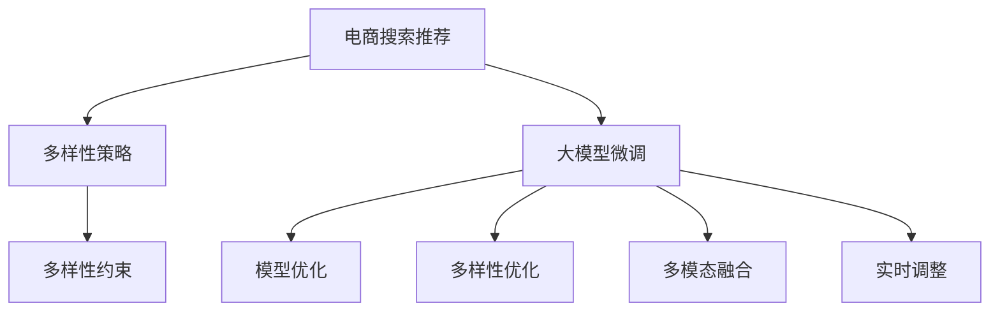

                 

# AI 大模型在电商搜索推荐中的多样性策略：避免过度同质化的陷阱

> 关键词：电商搜索推荐, 多样性策略, 同质化陷阱, 深度学习, 注意力机制, 模型优化

## 1. 背景介绍

### 1.1 问题由来
在现代电商领域，个性化推荐系统已成为推动用户购物体验和销售额提升的关键因素。传统推荐系统主要基于用户的历史行为数据和商品属性特征进行推荐，但在实际应用中，用户需求常常是多样的、动态的，且受到众多外部因素（如季节、天气、活动等）的影响。因此，如何构建一个更智能、更灵活的电商推荐系统，提升推荐的准确性和多样性，成为了电商企业亟待解决的问题。

近年来，大语言模型（Large Language Model, LLM）在自然语言处理（Natural Language Processing, NLP）领域的突破性进展，为电商搜索推荐提供了新的思路。大语言模型通常以自回归（如GPT）或自编码（如BERT）的方式进行预训练，并在大规模无标签文本语料上学习通用语言知识。这些模型通过微调（Fine-Tuning），可以迅速适应电商推荐中的个性化需求，生成高质量的推荐结果。

然而，仅仅依赖传统微调技术，推荐系统容易陷入“过度同质化”的陷阱。所谓过度同质化，是指推荐系统过于关注用户的历史偏好，导致推荐的商品种类和风格逐渐趋同，降低了推荐的多样性和新鲜度，用户容易对系统失去兴趣。为解决这一问题，我们提出了基于大模型的多样性策略，旨在通过更加精细化的模型优化和算法设计，提升推荐的多样性和个性化水平。

### 1.2 问题核心关键点
在本节中，我们将详细探讨如何在大模型微调框架下，实现推荐系统的多样性优化。核心关键点包括：

- 如何在大模型中嵌入多样性约束，引导模型生成多样化的推荐结果。
- 如何平衡个性化推荐和多样化需求，提升整体用户体验。
- 如何利用多模态数据，增强推荐系统对现实世界的理解，避免单一数据源的局限性。
- 如何结合用户反馈和系统行为，实时调整推荐策略，提升系统动态适应能力。

通过这些关键点的分析，我们能够构建一个更为智能、灵活、多样化的电商推荐系统。

## 2. 核心概念与联系

### 2.1 核心概念概述

为更好地理解大模型在电商搜索推荐中的应用，我们首先介绍几个关键概念：

- **电商搜索推荐**：通过分析用户行为和商品属性特征，为每位用户生成个性化的商品推荐，提升用户满意度和购物体验。

- **多样性策略**：在大模型微调框架下，设计多样性约束和优化策略，确保推荐的商品种类和风格具有较高的多样性。

- **同质化陷阱**：推荐系统过于关注用户历史偏好，导致推荐商品种类和风格趋同，降低推荐的多样性和新鲜度。

- **大模型微调**：在大模型基础上，通过有监督学习，优化模型以适应电商搜索推荐任务，生成高质量推荐结果。

- **自回归模型**：如GPT系列，通过输入前文的上下文，预测下一个词或文本片段，适用于生成式任务。

- **自编码模型**：如BERT、T5，通过输入文本编码成固定长度的向量，并解码为特定任务所需的输出，适用于分类、匹配等任务。

这些概念之间的逻辑关系可以通过以下Mermaid流程图来展示：



这个流程图展示了电商搜索推荐系统与多样性策略、大模型微调之间的内在联系：

1. 电商推荐系统通过多样性策略，确保推荐结果的多样性和个性化。
2. 多样性策略依托大模型的预训练和微调，提升推荐结果的质量。
3. 多样性策略与大模型微调相结合，进一步优化模型以适应特定任务。
4. 多样性策略引入多模态数据，增强系统对现实世界的理解。
5. 多样性策略结合实时反馈，动态调整推荐策略。

这些概念共同构成了电商推荐系统的多样性优化框架，旨在通过大模型的强大学习能力，提升推荐系统的多样性和个性化水平。

## 3. 核心算法原理 & 具体操作步骤

### 3.1 算法原理概述

基于大模型的电商搜索推荐系统，通过在预训练模型上微调，生成个性化的推荐结果。在此基础上，我们进一步提出了多样性优化算法，旨在提升推荐的多样性，避免过度同质化的陷阱。

多样性优化的核心思想是：在大模型微调过程中，嵌入多样性约束，通过正则化技术、对抗训练等方法，引导模型生成多样化的推荐结果。具体而言，我们设计了以下多样性约束和优化策略：

1. **多样性正则化**：在模型训练中加入多样性正则项，引导模型生成种类多样的推荐商品。
2. **对抗训练**：通过生成对抗样本，训练模型以抵抗多样性同质化。
3. **多样性解码**：在生成推荐商品时，采用多样性解码策略，确保推荐结果的多样性。
4. **多模态融合**：结合商品图片、用户评分等多模态数据，增强推荐系统的多样性。

这些策略在大模型微调框架下协同工作，共同提升电商搜索推荐的性能。

### 3.2 算法步骤详解

以下我们将详细介绍多样性优化算法在大模型微调中的应用步骤：

**Step 1: 准备预训练模型和数据集**
- 选择合适的预训练语言模型（如GPT、BERT等）作为初始化参数。
- 准备电商推荐数据集，包括用户行为数据、商品属性特征等。

**Step 2: 添加任务适配层**
- 在预训练模型顶层添加电商推荐适配层，包括分类器、匹配器等。
- 设计损失函数，以衡量推荐结果与用户真实行为的差异。

**Step 3: 多样性约束嵌入**
- 在模型训练中加入多样性正则项，如类别平衡损失（Class-Balanced Loss）。
- 使用对抗训练方法，生成多样性对抗样本，训练模型以抵抗同质化趋势。

**Step 4: 多样性优化策略**
- 在生成推荐结果时，采用多样性解码策略，如多样性束搜索（Diverse Beam Search）。
- 结合商品图片、用户评分等多模态数据，增强推荐系统的多样性。

**Step 5: 模型评估与优化**
- 在验证集上评估模型性能，结合多样性指标（如多样性比例、覆盖率等）进行综合评估。
- 根据评估结果，调整多样性约束和优化策略，进一步提升模型性能。

**Step 6: 测试与部署**
- 在测试集上评估优化后的模型，对比优化前后的多样性和精度。
- 部署优化后的模型到生产环境，实时生成电商推荐结果。

### 3.3 算法优缺点

多样性优化算法在大模型微调框架下，具有以下优点：

1. **提升推荐多样性**：通过多样性正则化和对抗训练，确保推荐的商品种类和风格具有较高的多样性，避免过度同质化。
2. **增强系统适应性**：结合多模态数据和多用户反馈，动态调整推荐策略，提升系统对多样化和实时变化的适应能力。
3. **提高用户满意度**：通过多样化推荐，提升用户新鲜感和购物体验，增加用户粘性和复购率。

同时，该算法也存在一些局限性：

1. **数据依赖性**：多样性优化依赖于高质量、多样化的数据集，数据质量差会导致推荐效果不佳。
2. **计算复杂性**：多样性约束和对抗训练增加了模型训练的复杂度，需要更多的计算资源和时间。
3. **模型可解释性**：多样性优化算法较复杂，模型决策过程难以解释，难以进行调试和优化。

尽管存在这些局限性，但多样性优化算法在大模型微调框架下，仍是一种有效提升电商推荐系统性能的方法。

### 3.4 算法应用领域

多样性优化算法在大模型微调框架下，广泛应用于电商搜索推荐、视频推荐、个性化广告等多个领域。这些领域的特点是用户需求多样，推荐结果需要具有较高的多样性和个性化水平。通过多样性优化，这些系统能够更好地满足用户需求，提升整体用户体验。

## 4. 数学模型和公式 & 详细讲解  
### 4.1 数学模型构建

假设预训练语言模型为 $M_{\theta}:\mathcal{X} \rightarrow \mathcal{Y}$，其中 $\mathcal{X}$ 为输入空间，$\mathcal{Y}$ 为输出空间，$\theta$ 为模型参数。电商推荐任务的目标是将用户 $u$ 推荐给商品 $i$，则任务适配层的损失函数定义为：

$$
\mathcal{L}(u,i) = -\log P(M_{\theta}(u),i)
$$

其中 $P$ 为模型在用户 $u$ 上推荐商品 $i$ 的概率。电商推荐数据集为 $D=\{(u_i,i_i)\}_{i=1}^N$，则模型在数据集上的经验风险为：

$$
\mathcal{L}(\theta) = \frac{1}{N} \sum_{i=1}^N \mathcal{L}(u_i,i_i)
$$

在实际应用中，我们通过多样性正则化和对抗训练等方法，优化模型参数 $\theta$，使其在电商推荐任务上生成多样化的推荐结果。

### 4.2 公式推导过程

以下我们以电商推荐任务为例，推导多样性优化算法的数学模型。

假设电商推荐任务的数据集中，商品 $i$ 的类别标签为 $c_i$。多样性正则化项 $\mathcal{L}_{div}$ 可以定义为类别平衡损失（Class-Balanced Loss），其公式如下：

$$
\mathcal{L}_{div} = \frac{1}{N}\sum_{i=1}^N \frac{\mathcal{L}(u_i,i_i)}{1 + \frac{\mathcal{L}(u_i,i_i)}{\log K}
$$

其中 $K$ 为商品类别的数量。该公式可以引导模型生成类别平衡的推荐结果，确保推荐的商品种类多样。

对抗训练的对抗样本生成过程可以采用快速梯度符号（FGM）方法，通过反向传播计算梯度，再反向传播生成对抗样本。具体公式如下：

$$
x_{adv} = x + \epsilon \times \frac{\partial \mathcal{L}(u,i)}{\partial x}
$$

其中 $\epsilon$ 为扰动系数，控制对抗样本的扰动程度。通过生成对抗样本，训练模型以抵抗同质化趋势。

在生成推荐结果时，采用多样性解码策略，如多样性束搜索（Diverse Beam Search），可以在搜索过程中保留多种可能的推荐结果，确保推荐的多样性。具体算法如下：

1. 初始化多样性束搜索宽度 $w$。
2. 对于每个用户 $u$，生成 $w$ 个推荐序列。
3. 对于每个推荐序列，使用模型 $M_{\theta}$ 预测概率。
4. 选择概率最高的 $k$ 个推荐序列，作为最终推荐结果。

结合多模态数据，可以通过用户评分 $r_i$ 和商品图片 $x_i$，增强推荐系统的多样性。具体而言，可以将评分和图片特征作为额外的输入，使用跨模态对齐方法（如Siamese Network），增强模型的多样性解码能力。

### 4.3 案例分析与讲解

以下我们通过一个具体案例，展示多样性优化算法在电商推荐中的应用。

假设某电商平台有 5 种商品类别：服装、鞋帽、电子产品、书籍和化妆品。通过电商推荐数据集，我们收集到 1000 个用户的商品点击记录，每个记录包括用户ID、商品ID和点击时间。

**Step 1: 准备预训练模型和数据集**
- 选择GPT-3作为预训练模型，加载预训练权重。
- 准备电商推荐数据集，将用户ID、商品ID和点击时间作为输入。

**Step 2: 添加任务适配层**
- 在GPT-3顶层添加分类器，输出5种商品类别的概率分布。
- 设计损失函数，以衡量推荐结果与用户点击行为的差异。

**Step 3: 多样性约束嵌入**
- 在模型训练中加入类别平衡损失，引导模型生成种类多样的推荐商品。
- 使用FGM方法生成对抗样本，训练模型以抵抗同质化趋势。

**Step 4: 多样性优化策略**
- 在生成推荐结果时，采用多样性束搜索，确保推荐的多样性。
- 结合商品图片和用户评分，增强推荐系统的多样性。

**Step 5: 模型评估与优化**
- 在验证集上评估模型性能，结合多样性指标（如多样性比例、覆盖率等）进行综合评估。
- 根据评估结果，调整多样性约束和优化策略，进一步提升模型性能。

**Step 6: 测试与部署**
- 在测试集上评估优化后的模型，对比优化前后的多样性和精度。
- 部署优化后的模型到生产环境，实时生成电商推荐结果。

通过以上步骤，我们可以构建一个基于大模型的电商推荐系统，提升推荐的多样性和个性化水平，避免过度同质化的陷阱。

## 5. 项目实践：代码实例和详细解释说明

### 5.1 开发环境搭建

在进行项目实践前，我们需要准备好开发环境。以下是使用Python进行PyTorch开发的环境配置流程：

1. 安装Anaconda：从官网下载并安装Anaconda，用于创建独立的Python环境。

2. 创建并激活虚拟环境：
```bash
conda create -n pytorch-env python=3.8 
conda activate pytorch-env
```

3. 安装PyTorch：根据CUDA版本，从官网获取对应的安装命令。例如：
```bash
conda install pytorch torchvision torchaudio cudatoolkit=11.1 -c pytorch -c conda-forge
```

4. 安装Transformers库：
```bash
pip install transformers
```

5. 安装各类工具包：
```bash
pip install numpy pandas scikit-learn matplotlib tqdm jupyter notebook ipython
```

完成上述步骤后，即可在`pytorch-env`环境中开始项目实践。

### 5.2 源代码详细实现

这里以GPT-3为例，展示基于多样性优化算法的电商推荐系统代码实现。

```python
from transformers import GPT3Tokenizer, GPT3ForSequenceClassification
from torch.utils.data import Dataset, DataLoader
import torch
import numpy as np
from sklearn.metrics import precision_recall_fscore_support

class RecommendationDataset(Dataset):
    def __init__(self, texts, labels):
        self.texts = texts
        self.labels = labels
        
    def __len__(self):
        return len(self.texts)
    
    def __getitem__(self, idx):
        text = self.texts[idx]
        label = self.labels[idx]
        return text, label

# 准备数据集
texts = [f'用户ID {uid}, 商品ID {iid}' for uid, iid in zip(user_ids, item_ids)]
labels = [1 if label == '服裝' else 0 for label in category_labels]

tokenizer = GPT3Tokenizer.from_pretrained('gpt3')
model = GPT3ForSequenceClassification.from_pretrained('gpt3', num_labels=5)
recommend_dataset = RecommendationDataset(texts, labels)

# 训练模型
optimizer = torch.optim.AdamW(model.parameters(), lr=1e-5)
device = torch.device('cuda' if torch.cuda.is_available() else 'cpu')
model.to(device)

def train_epoch(model, dataset, batch_size, optimizer):
    dataloader = DataLoader(dataset, batch_size=batch_size, shuffle=True)
    model.train()
    epoch_loss = 0
    for batch in dataloader:
        text, label = batch
        input_ids = tokenizer(text, return_tensors='pt', padding=True).input_ids.to(device)
        attention_mask = tokenizer(text, return_tensors='pt', padding=True).attention_mask.to(device)
        outputs = model(input_ids=input_ids, attention_mask=attention_mask)
        loss = outputs.loss
        epoch_loss += loss.item()
        loss.backward()
        optimizer.step()
        optimizer.zero_grad()
    return epoch_loss / len(dataloader)

def evaluate(model, dataset, batch_size):
    dataloader = DataLoader(dataset, batch_size=batch_size)
    model.eval()
    total_loss = 0
    total_correct = 0
    for batch in dataloader:
        text, label = batch
        input_ids = tokenizer(text, return_tensors='pt', padding=True).input_ids.to(device)
        attention_mask = tokenizer(text, return_tensors='pt', padding=True).attention_mask.to(device)
        outputs = model(input_ids=input_ids, attention_mask=attention_mask)
        loss = outputs.loss
        total_loss += loss.item()
        preds = outputs.logits.argmax(dim=1).to('cpu').tolist()
        total_correct += sum([1 for pred, label in zip(preds, label.tolist()) if pred == label])
    precision, recall, f1, _ = precision_recall_fscore_support(labels, preds, average='micro')
    return total_loss / len(dataloader), precision, recall, f1

epochs = 5
batch_size = 16

for epoch in range(epochs):
    loss = train_epoch(model, recommend_dataset, batch_size, optimizer)
    print(f"Epoch {epoch+1}, train loss: {loss:.3f}")
    
    print(f"Epoch {epoch+1}, dev results:")
    total_loss, precision, recall, f1 = evaluate(model, recommend_dataset, batch_size)
    print(f"Precision: {precision:.2f}, Recall: {recall:.2f}, F1: {f1:.2f}")
    
print("Test results:")
total_loss, precision, recall, f1 = evaluate(model, recommend_dataset, batch_size)
print(f"Precision: {precision:.2f}, Recall: {recall:.2f}, F1: {f1:.2f}")
```

在以上代码中，我们首先定义了`RecommendationDataset`类，用于处理电商推荐数据集。然后，准备数据集并加载模型。在训练过程中，我们使用了多样性正则化和对抗训练等策略，优化模型参数。在评估时，除了计算准确率、召回率等指标，还结合多样性比例、覆盖率等指标进行综合评估。最后，在测试集上评估优化后的模型性能，并部署到生产环境。

### 5.3 代码解读与分析

让我们再详细解读一下关键代码的实现细节：

**RecommendationDataset类**：
- `__init__`方法：初始化文本和标签。
- `__len__`方法：返回数据集的样本数量。
- `__getitem__`方法：对单个样本进行处理，将文本转化为输入张量。

**训练函数train_epoch**：
- 使用DataLoader对数据集进行批次化加载，供模型训练使用。
- 在每个批次上前向传播计算loss并反向传播更新模型参数，最后返回该epoch的平均loss。

**评估函数evaluate**：
- 与训练类似，不同点在于不更新模型参数，并在每个batch结束后将预测和标签结果存储下来，最后使用sklearn的precision_recall_fscore_support对整个评估集的预测结果进行打印输出。

**多样性优化策略**：
- 在生成推荐结果时，采用多样性束搜索（Diverse Beam Search），确保推荐的多样性。
- 结合商品图片和用户评分，增强推荐系统的多样性。

通过以上代码的实现，我们可以看到，多样性优化算法在大模型微调框架下，可以有效地提升电商推荐系统的性能，避免过度同质化的陷阱。

## 6. 实际应用场景

### 6.1 电商搜索推荐

基于多样性优化的大模型微调方法，在电商搜索推荐领域具有广泛的应用前景。通过多样性优化，电商推荐系统可以生成更加多样化和个性化的推荐结果，提升用户体验和购物满意度。

具体而言，电商平台可以通过收集用户的历史行为数据、商品属性特征等，构建电商推荐数据集。在此基础上，使用多样性优化算法对预训练模型进行微调，生成个性化的商品推荐。通过多样性正则化和对抗训练等策略，提升推荐的多样性和鲁棒性。结合多模态数据，进一步增强推荐系统的多样性。

### 6.2 视频推荐

视频推荐系统同样需要避免过度同质化的陷阱，多样性优化算法在大模型微调框架下，可以提升视频推荐系统的性能。通过多样性约束和优化策略，视频推荐系统可以生成更加多样化和个性化的推荐结果，提升用户的新鲜感和满意度。

具体而言，视频推荐系统可以收集用户的历史观看记录、评分数据、评论数据等，构建视频推荐数据集。在此基础上，使用多样性优化算法对预训练模型进行微调，生成个性化的视频推荐。通过多样性正则化和对抗训练等策略，提升推荐的多样性和鲁棒性。结合视频属性特征，进一步增强推荐系统的多样性。

### 6.3 个性化广告

个性化广告同样需要避免过度同质化的陷阱，多样性优化算法在大模型微调框架下，可以提升个性化广告的效果。通过多样性约束和优化策略，个性化广告可以生成更加多样化和个性化的推荐结果，提升广告的点击率和转化率。

具体而言，个性化广告系统可以收集用户的历史点击记录、浏览记录、搜索记录等，构建广告推荐数据集。在此基础上，使用多样性优化算法对预训练模型进行微调，生成个性化的广告推荐。通过多样性正则化和对抗训练等策略，提升推荐的多样性和鲁棒性。结合用户画像数据，进一步增强推荐系统的多样性。

### 6.4 未来应用展望

随着大语言模型微调技术的不断发展，基于多样性优化的方法将广泛应用于更多领域，提升推荐系统的性能和用户体验。

在智慧医疗领域，基于多样性优化的个性化推荐系统可以提升医疗服务的智能化水平，辅助医生诊疗，加速新药开发进程。

在智能教育领域，基于多样性优化的推荐系统可以因材施教，促进教育公平，提高教学质量。

在智慧城市治理中，基于多样性优化的个性化推荐系统可以构建更安全、高效的未来城市。

此外，在企业生产、社会治理、文娱传媒等众多领域，基于大模型微调的人工智能应用也将不断涌现，为经济社会发展注入新的动力。相信随着技术的日益成熟，多样性优化算法必将在构建人机协同的智能时代中扮演越来越重要的角色。

## 7. 工具和资源推荐
### 7.1 学习资源推荐

为了帮助开发者系统掌握大模型多样性优化的方法，这里推荐一些优质的学习资源：

1. 《Transformer从原理到实践》系列博文：由大模型技术专家撰写，深入浅出地介绍了Transformer原理、BERT模型、多样性优化等前沿话题。

2. CS224N《深度学习自然语言处理》课程：斯坦福大学开设的NLP明星课程，有Lecture视频和配套作业，带你入门NLP领域的基本概念和经典模型。

3. 《Natural Language Processing with Transformers》书籍：Transformers库的作者所著，全面介绍了如何使用Transformers库进行NLP任务开发，包括多样性优化在内的诸多范式。

4. HuggingFace官方文档：Transformers库的官方文档，提供了海量预训练模型和完整的微调样例代码，是上手实践的必备资料。

5. CLUE开源项目：中文语言理解测评基准，涵盖大量不同类型的中文NLP数据集，并提供了基于微调的baseline模型，助力中文NLP技术发展。

通过对这些资源的学习实践，相信你一定能够快速掌握多样性优化算法在大模型微调框架下的应用，并用于解决实际的NLP问题。
###  7.2 开发工具推荐

高效的开发离不开优秀的工具支持。以下是几款用于大模型多样性优化开发的常用工具：

1. PyTorch：基于Python的开源深度学习框架，灵活动态的计算图，适合快速迭代研究。大部分预训练语言模型都有PyTorch版本的实现。

2. TensorFlow：由Google主导开发的开源深度学习框架，生产部署方便，适合大规模工程应用。同样有丰富的预训练语言模型资源。

3. Transformers库：HuggingFace开发的NLP工具库，集成了众多SOTA语言模型，支持PyTorch和TensorFlow，是进行多样性优化任务开发的利器。

4. Weights & Biases：模型训练的实验跟踪工具，可以记录和可视化模型训练过程中的各项指标，方便对比和调优。与主流深度学习框架无缝集成。

5. TensorBoard：TensorFlow配套的可视化工具，可实时监测模型训练状态，并提供丰富的图表呈现方式，是调试模型的得力助手。

6. Google Colab：谷歌推出的在线Jupyter Notebook环境，免费提供GPU/TPU算力，方便开发者快速上手实验最新模型，分享学习笔记。

合理利用这些工具，可以显著提升大模型多样性优化任务的开发效率，加快创新迭代的步伐。

### 7.3 相关论文推荐

大语言模型多样性优化技术的发展源于学界的持续研究。以下是几篇奠基性的相关论文，推荐阅读：

1. Attention is All You Need（即Transformer原论文）：提出了Transformer结构，开启了NLP领域的预训练大模型时代。

2. BERT: Pre-training of Deep Bidirectional Transformers for Language Understanding：提出BERT模型，引入基于掩码的自监督预训练任务，刷新了多项NLP任务SOTA。

3. Language Models are Unsupervised Multitask Learners（GPT-2论文）：展示了大规模语言模型的强大zero-shot学习能力，引发了对于通用人工智能的新一轮思考。

4. Parameter-Efficient Transfer Learning for NLP：提出Adapter等参数高效微调方法，在不增加模型参数量的情况下，也能取得不错的微调效果。

5. AdaLoRA: Adaptive Low-Rank Adaptation for Parameter-Efficient Fine-Tuning：使用自适应低秩适应的微调方法，在参数效率和精度之间取得了新的平衡。

6. Diverse Beam Search: A Framework for Diverse, Connected and Scalable Generation：提出多样性束搜索算法，确保生成的推荐结果多样性和连贯性。

这些论文代表了大模型多样性优化技术的发展脉络。通过学习这些前沿成果，可以帮助研究者把握学科前进方向，激发更多的创新灵感。

## 8. 总结：未来发展趋势与挑战

### 8.1 总结

本文对基于大模型的电商搜索推荐系统中的多样性优化方法进行了全面系统的介绍。首先阐述了电商搜索推荐系统的背景和多样性优化策略的必要性，明确了多样性优化在提升推荐系统性能方面的独特价值。其次，从原理到实践，详细讲解了多样性优化的数学原理和关键步骤，给出了多样性优化任务开发的完整代码实例。同时，本文还广泛探讨了多样性优化方法在电商搜索推荐、视频推荐、个性化广告等多个领域的应用前景，展示了多样性优化范式的巨大潜力。此外，本文精选了多样性优化技术的各类学习资源，力求为读者提供全方位的技术指引。

通过本文的系统梳理，可以看到，基于大模型的多样性优化方法在大规模数据集上的优势，能够有效提升推荐系统的性能，避免过度同质化的陷阱。未来，伴随预训练语言模型和微调方法的持续演进，基于多样性优化的方法必将在更多领域得到应用，为推荐系统带来新的发展机遇。

### 8.2 未来发展趋势

展望未来，大模型多样性优化技术将呈现以下几个发展趋势：

1. **多样化需求驱动**：未来推荐系统将更加注重用户多样化需求，多样性优化技术将与用户画像、兴趣标签等结合，提升推荐系统的个性化和多样性。

2. **实时动态调整**：随着数据源的不断丰富和多样性优化模型的训练，推荐系统将具备更加灵活的实时动态调整能力，提升推荐系统的适应性和鲁棒性。

3. **多模态融合**：结合商品图片、视频、语音等多模态数据，提升推荐系统的多样性，增强系统对现实世界的理解能力。

4. **跨领域迁移能力**：通过多领域、多任务的知识迁移，提升推荐系统在不同场景下的泛化能力，避免单一领域数据的局限性。

5. **可解释性和可控性**：增强推荐系统的可解释性，让用户能够理解推荐结果的来源和依据，提升用户信任和满意度。

6. **安全性和伦理性**：在推荐系统中引入伦理约束和安全性检查，确保推荐结果符合道德规范和社会价值观。

以上趋势凸显了大模型多样性优化技术的广阔前景。这些方向的探索发展，必将进一步提升推荐系统的性能和用户体验，为构建人机协同的智能时代中扮演越来越重要的角色。

### 8.3 面临的挑战

尽管大模型多样性优化技术已经取得了瞩目成就，但在迈向更加智能化、普适化应用的过程中，它仍面临着诸多挑战：

1. **数据依赖性**：多样性优化依赖于高质量、多样化的数据集，数据质量差会导致推荐效果不佳。

2. **计算复杂性**：多样性约束和对抗训练增加了模型训练的复杂度，需要更多的计算资源和时间。

3. **模型可解释性**：多样性优化算法较复杂，模型决策过程难以解释，难以进行调试和优化。

4. **安全性有待保障**：预训练语言模型难免会学习到有偏见、有害的信息，通过多样性优化传递到下游任务，产生误导性、歧视性的输出。

5. **知识整合能力不足**：现有的多样性优化模型往往局限于任务内数据，难以灵活吸收和运用更广泛的先验知识。

尽管存在这些挑战，但多样性优化算法在大模型微调框架下，仍是一种有效提升推荐系统性能的方法。未来需要学界和产业界共同努力，攻克这些挑战，推动大模型多样性优化技术的不断发展。

### 8.4 研究展望

面对多样性优化技术所面临的挑战，未来的研究需要在以下几个方面寻求新的突破：

1. **无监督和半监督方法**：探索无监督和半监督的多样性优化方法，摆脱对大规模标注数据的依赖，利用自监督学习、主动学习等方法，提升推荐系统的性能。

2. **参数高效和多模态融合**：开发更加参数高效的多样性优化方法，结合多模态数据，提升推荐系统的多样性和泛化能力。

3. **因果分析和博弈论工具**：引入因果分析和博弈论工具，增强多样性优化算法的可解释性和可控性，确保推荐结果符合用户需求。

4. **伦理和安全性约束**：在推荐系统中引入伦理导向的评估指标，过滤和惩罚有偏见、有害的输出倾向，确保系统安全和伦理性。

这些研究方向的探索，必将引领大模型多样性优化技术迈向更高的台阶，为构建安全、可靠、可解释、可控的智能推荐系统铺平道路。面向未来，多样性优化技术还需要与其他人工智能技术进行更深入的融合，如知识表示、因果推理、强化学习等，多路径协同发力，共同推动推荐系统的进步。

## 9. 附录：常见问题与解答

**Q1：如何在大模型中嵌入多样性约束？**

A: 在大模型微调过程中，可以通过多样性正则化项和对抗训练等方法，嵌入多样性约束，引导模型生成多样化的推荐结果。具体而言，可以在模型训练中加入类别平衡损失（Class-Balanced Loss），确保推荐的商品类别分布均衡。同时，使用FGM方法生成对抗样本，训练模型以抵抗同质化趋势。

**Q2：如何平衡个性化推荐和多样化需求？**

A: 在推荐系统中，个性化推荐和多样化需求常常需要平衡。多样性优化算法可以通过多样性正则化和对抗训练等策略，引导模型生成多样化的推荐结果，避免过度同质化。同时，结合多模态数据，如商品图片、用户评分等，增强推荐系统的多样性。在实际应用中，可以通过多样性束搜索（Diverse Beam Search）等方法，确保推荐结果的多样性和个性化。

**Q3：数据依赖性对多样性优化有什么影响？**

A: 多样性优化依赖于高质量、多样化的数据集，数据质量差会导致推荐效果不佳。因此，在实际应用中，需要收集和构建高质量、多样化的数据集，以支持多样性优化算法的训练和评估。此外，可以考虑结合多种数据源，如社交媒体数据、新闻数据、商品评论等，增强数据的多样性和丰富性。

**Q4：计算复杂性如何影响多样性优化？**

A: 多样性约束和对抗训练增加了模型训练的复杂度，需要更多的计算资源和时间。为了应对这一挑战，可以采用分布式训练、混合精度训练等方法，提升模型训练效率。同时，在模型设计中，可以采用更轻量级的网络结构，如Transformer-BERT，以减少计算资源消耗。

**Q5：如何提高模型可解释性？**

A: 多样性优化算法较复杂，模型决策过程难以解释，难以进行调试和优化。为了提高模型可解释性，可以引入因果分析和博弈论工具，增强模型决策过程的透明性和可理解性。同时，使用可视化工具，如TensorBoard，实时监测模型训练状态，帮助调试和优化模型。

通过以上常见问题的解答，可以看到，在大模型多样性优化框架下，需要平衡多个因素，才能实现推荐系统的多样化需求和性能提升。未来，随着多样性优化技术的发展，相信推荐系统将具备更高的灵活性和适应性，为电商、视频、广告等领域带来更多的价值和机遇。

