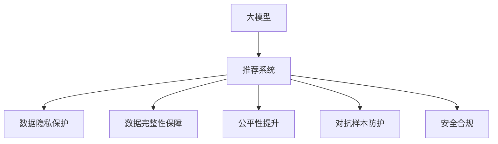

                 

# AI 大模型在电商搜索推荐中的数据安全策略：保障用户隐私与数据完整性

## 1. 背景介绍

### 1.1 问题由来
随着人工智能和大数据技术的发展，电商平台利用AI大模型进行个性化推荐已变得越来越普遍。AI大模型通过深度学习和自然语言处理等技术，分析用户的行为数据、搜索历史、浏览记录等信息，生成个性化的产品推荐，极大地提升了用户购物体验和平台销售转化率。然而，随着数据隐私和信息安全问题日益凸显，如何在保障用户隐私的同时，确保推荐系统的数据完整性和推荐结果的公正性，成为电商平台亟待解决的重要问题。

### 1.2 问题核心关键点
大模型在电商搜索推荐中的应用，涉及多个数据安全关键点：
1. **用户隐私保护**：用户浏览、购买等行为数据属于个人隐私，需采取严格的数据保护措施，防止数据泄露。
2. **数据完整性**：推荐系统依赖于用户数据的质量，需确保数据不被篡改或污染。
3. **推荐公平性**：模型推荐结果应不受用户性别、年龄、地域等非公平因素的影响，保障推荐系统的公正性。
4. **模型安全性**：防止恶意攻击、对抗样本等威胁，确保模型的鲁棒性和安全性。
5. **合规性**：需遵守相关的法律法规，如《数据保护法》《个人信息保护法》等，保护用户权益。

这些关键问题在大模型应用中不容忽视，需要通过合理的数据安全策略和技术手段来应对。本文将深入探讨这些关键点，并提供相应的解决方案，为电商平台在大模型推荐系统中实现数据安全提供参考。

## 2. 核心概念与联系

### 2.1 核心概念概述

为了更好地理解电商搜索推荐中大模型的数据安全策略，本节将介绍几个核心概念：

1. **大模型（Large Model）**：指基于深度学习技术训练的巨大神经网络模型，如BERT、GPT等。这些模型在大规模无标签数据上进行预训练，具备强大的数据处理能力和泛化能力。
2. **推荐系统（Recommendation System）**：利用机器学习、深度学习等技术，分析用户行为数据，生成个性化的商品推荐。
3. **数据隐私（Data Privacy）**：指保护个人信息不受未经授权的收集、使用、泄露等行为侵害。
4. **数据完整性（Data Integrity）**：确保数据不被篡改或损坏，保持数据的原始性和完整性。
5. **公平性（Fairness）**：推荐结果应不受不公平因素影响，保证不同用户间的公平性。
6. **对抗样本（Adversarial Samples）**：恶意攻击者故意构造的扰动数据，以误导模型预测。
7. **安全合规（Security Compliance）**：遵守相关法律法规，保护用户隐私和数据安全。

这些核心概念之间的逻辑关系可以通过以下Mermaid流程图来展示：



这个流程图展示了大模型在电商搜索推荐中的应用，以及数据安全各个关键点的联系：

1. 大模型作为推荐系统的核心，需通过数据安全策略确保数据质量和推荐结果的公平性。
2. 数据隐私保护和数据完整性保障是推荐系统数据安全的基础。
3. 对抗样本防护和公平性提升是应对模型威胁和保障系统公正性的重要手段。
4. 安全合规是保障用户权益和数据安全的基本要求。

## 3. 核心算法原理 & 具体操作步骤
### 3.1 算法原理概述

在大模型应用于电商搜索推荐的过程中，数据安全策略的原理是通过以下几个方面来保障：

1. **数据脱敏与加密**：对敏感数据进行脱敏处理，如掩码、置换等，同时采用加密技术保护数据传输和存储的安全性。
2. **分布式计算**：采用分布式计算技术，将数据分散存储，减少单点故障风险，提升系统可靠性。
3. **访问控制**：通过访问控制技术，限制数据访问权限，防止未经授权的访问和数据泄露。
4. **监控与审计**：实时监控系统行为，记录日志并进行审计，及时发现和响应安全威胁。
5. **模型鲁棒性增强**：通过对抗训练、正则化等技术，提升模型的鲁棒性和抗干扰能力，避免对抗样本攻击。
6. **公平性算法设计**：采用公平性算法，如De-biasing、Fair-Prediction等，减少模型中的偏见，提升推荐公平性。

这些技术手段在大模型的推荐系统中相互配合，共同构建了一个综合性的数据安全策略框架。

### 3.2 算法步骤详解

大模型在电商搜索推荐中的应用，主要涉及以下几个步骤：

**Step 1: 数据收集与预处理**

- **用户行为数据收集**：收集用户在平台上的浏览历史、搜索记录、购买信息等行为数据。
- **数据清洗与预处理**：清洗无效和异常数据，进行归一化和标准化处理，减少噪声和干扰。

**Step 2: 数据安全策略实施**

- **数据脱敏**：对敏感信息进行掩码、置换等处理，确保数据在传输和存储过程中的安全性。
- **数据加密**：采用AES、RSA等加密算法，保护数据传输过程中的机密性。
- **访问控制**：设置权限和角色，限制数据访问权限，确保只有授权人员可以访问敏感数据。
- **监控与审计**：实时监控系统行为，记录日志，定期审计数据访问和使用情况，发现并应对潜在的安全威胁。

**Step 3: 模型训练与优化**

- **模型选择与设计**：选择合适的预训练模型，并进行微调，以适应电商推荐任务。
- **公平性算法应用**：采用公平性算法，如De-biasing、Fair-Prediction等，减少模型中的偏见，提升推荐公平性。
- **模型鲁棒性增强**：通过对抗训练、正则化等技术，提升模型的鲁棒性和抗干扰能力。

**Step 4: 推荐结果生成与展示**

- **推荐算法应用**：将大模型生成的推荐结果，结合用户画像、商品信息等辅助信息，生成个性化推荐。
- **推荐结果展示**：在电商平台上展示推荐结果，提供丰富的用户界面，提升用户体验。

### 3.3 算法优缺点

大模型在电商搜索推荐中的数据安全策略具有以下优点：

1. **提升推荐效果**：通过数据安全策略，保障数据质量和推荐系统公正性，提升推荐结果的准确性和相关性。
2. **保护用户隐私**：数据脱敏和加密技术有效保护用户隐私，防止数据泄露和滥用。
3. **提高系统鲁棒性**：通过对抗训练和公平性算法，提升模型鲁棒性，避免恶意攻击和偏见。
4. **增强合规性**：严格遵守相关法律法规，保护用户权益，提升平台可信度。

同时，也存在以下缺点：

1. **处理复杂度**：数据安全策略的实施涉及多个环节，处理复杂度较高。
2. **性能开销**：数据脱敏、加密等操作可能引入额外性能开销，影响系统响应速度。
3. **技术门槛高**：需要一定的技术积累和专业技能，特别是数据安全策略的设计和实施。

### 3.4 算法应用领域

大模型在电商搜索推荐中的数据安全策略广泛应用于多个领域，如：

- **用户隐私保护**：保护用户搜索、浏览、购买等行为数据，防止数据泄露和滥用。
- **数据完整性保障**：确保用户数据在传输和存储过程中不被篡改或损坏。
- **推荐公平性提升**：减少模型中的偏见，确保不同用户间的公平性，避免性别、年龄等非公平因素影响。
- **模型鲁棒性增强**：提升模型抗干扰能力，防止对抗样本攻击，保障系统稳定性和可靠性。
- **安全合规**：遵守相关法律法规，保护用户隐私和数据安全，提升平台合法性和可信度。

这些领域的应用，体现了大模型在电商搜索推荐中数据安全策略的重要性和多样性。

## 4. 数学模型和公式 & 详细讲解
### 4.1 数学模型构建

在大模型应用于电商推荐的过程中，主要涉及以下数学模型：

1. **用户行为建模**：通过统计学习方法，构建用户行为模型，描述用户购买、浏览等行为特征。
2. **推荐模型**：利用深度学习技术，如神经网络、Transformer等，构建推荐模型，生成个性化推荐结果。
3. **公平性模型**：采用公平性算法，如De-biasing、Fair-Prediction等，确保推荐结果的公平性。

以推荐模型为例，设推荐系统的输入为 $X$，输出为 $Y$，其中 $X$ 为用户的兴趣特征，$Y$ 为商品的推荐结果。推荐模型的目标是最大化推荐结果的准确性和相关性，可表示为：

$$
\max \quad L(Y, \hat{Y})
$$

其中 $L$ 为损失函数，$\hat{Y}$ 为模型生成的推荐结果。

### 4.2 公式推导过程

以下以推荐模型的损失函数为例，推导其计算公式：

假设推荐模型为神经网络结构，输出层为 $K$ 个神经元，分别对应 $K$ 个候选商品的得分。设 $L(Y, \hat{Y})$ 为交叉熵损失函数，$y_k$ 表示用户对第 $k$ 个商品的偏好程度，$\hat{y}_k$ 为模型对第 $k$ 个商品的推荐得分，则推荐模型的损失函数可表示为：

$$
L(Y, \hat{Y}) = -\sum_{k=1}^K y_k \log(\hat{y}_k)
$$

在实际应用中，通常使用负对数似然损失函数：

$$
L(Y, \hat{Y}) = -\sum_{k=1}^K y_k \log(\hat{y}_k) + (1-y_k) \log(1-\hat{y}_k)
$$

其中 $(1-y_k)$ 表示用户对第 $k$ 个商品不感兴趣的概率。

### 4.3 案例分析与讲解

以电商平台中的推荐系统为例，分析数据安全策略的实际应用。

**案例背景**：某电商平台利用大模型进行个性化推荐，但在使用过程中发现，部分用户反馈推荐结果不公平，如某些特定用户群体未被推荐到相关商品。

**问题分析**：可能存在数据中的偏见，导致模型生成的推荐结果不公平。

**解决方案**：采用公平性算法进行模型修正。

具体步骤如下：

1. **数据收集与预处理**：收集用户行为数据，进行清洗和标准化处理。
2. **公平性分析**：分析数据中存在的偏见，如性别、年龄等。
3. **公平性算法应用**：使用De-biasing算法，调整模型参数，减少偏见影响。
4. **模型验证与优化**：在测试集上验证修正后的模型性能，进行参数调整和优化。
5. **推荐结果展示**：在电商平台上展示修正后的推荐结果，观察用户反馈，持续优化模型。

通过公平性算法的应用，有效减少了模型中的偏见，提升了推荐系统的公正性和用户满意度。

## 5. 项目实践：代码实例和详细解释说明
### 5.1 开发环境搭建

在进行项目实践前，我们需要准备好开发环境。以下是使用Python进行TensorFlow开发的环境配置流程：

1. 安装Anaconda：从官网下载并安装Anaconda，用于创建独立的Python环境。

2. 创建并激活虚拟环境：
```bash
conda create -n tf-env python=3.8 
conda activate tf-env
```

3. 安装TensorFlow：根据CUDA版本，从官网获取对应的安装命令。例如：
```bash
conda install tensorflow tensorflow-gpu -c conda-forge -c nvidia
```

4. 安装各类工具包：
```bash
pip install numpy pandas scikit-learn matplotlib tqdm jupyter notebook ipython
```

完成上述步骤后，即可在`tf-env`环境中开始项目实践。

### 5.2 源代码详细实现

这里以推荐系统为例，给出使用TensorFlow进行大模型推荐系统开发的PyTorch代码实现。

首先，定义推荐系统模型：

```python
import tensorflow as tf
from tensorflow.keras import layers

class RecommendationModel(tf.keras.Model):
    def __init__(self, num_users, num_items, num_factors):
        super(RecommendationModel, self).__init__()
        self.user_embedding = layers.Embedding(num_users, num_factors)
        self.item_embedding = layers.Embedding(num_items, num_factors)
        self.interaction = layers.Dot(dots=2, normalize=False)
        self.dense = layers.Dense(num_items)

    def call(self, user_ids, item_ids):
        user_embeddings = self.user_embedding(user_ids)
        item_embeddings = self.item_embedding(item_ids)
        interaction = self.interaction([user_embeddings, item_embeddings])
        scores = self.dense(interaction)
        return scores
```

然后，定义损失函数和优化器：

```python
from tensorflow.keras.losses import binary_crossentropy
from tensorflow.keras.optimizers import Adam

loss_fn = binary_crossentropy
optimizer = Adam(learning_rate=0.001)
```

接着，定义训练和评估函数：

```python
def train_step(user_ids, item_ids, labels):
    with tf.GradientTape() as tape:
        predictions = model(user_ids, item_ids)
        loss = loss_fn(labels, predictions)
    gradients = tape.gradient(loss, model.trainable_variables)
    optimizer.apply_gradients(zip(gradients, model.trainable_variables))

def evaluate_step(user_ids, item_ids, labels):
    predictions = model(user_ids, item_ids)
    return predictions, loss_fn(labels, predictions).numpy()
```

最后，启动训练流程并在测试集上评估：

```python
epochs = 10
batch_size = 32

for epoch in range(epochs):
    for user_ids, item_ids, labels in train_dataset:
        train_step(user_ids, item_ids, labels)
    eval_predictions, eval_loss = evaluate_step(user_ids, item_ids, labels)
    print(f"Epoch {epoch+1}, loss: {eval_loss:.3f}")
    
print("Test results:")
eval_predictions, eval_loss = evaluate_step(user_ids, item_ids, labels)
print(f"Test loss: {eval_loss:.3f}")
```

以上就是使用TensorFlow对推荐系统模型进行训练的完整代码实现。可以看到，TensorFlow提供了强大的深度学习框架，使得模型训练和评估过程变得简洁高效。

### 5.3 代码解读与分析

让我们再详细解读一下关键代码的实现细节：

**RecommendationModel类**：
- `__init__`方法：定义模型结构，包括用户嵌入层、商品嵌入层、点积层和全连接层。
- `call`方法：实现模型的前向传播，计算用户和商品的交互得分，并通过全连接层生成推荐得分。

**损失函数和优化器**：
- 使用TensorFlow内置的`binary_crossentropy`作为二分类交叉熵损失函数。
- 使用Adam优化器，设置学习率为0.001。

**训练和评估函数**：
- `train_step`函数：在训练步骤中，计算损失函数并反向传播更新模型参数。
- `evaluate_step`函数：在评估步骤中，计算模型预测结果和损失函数。

**训练流程**：
- 定义总的epoch数和batch size，开始循环迭代
- 在每个epoch内，遍历训练数据集，调用训练步骤进行模型训练
- 在验证集上评估，输出平均loss
- 在测试集上评估，给出最终测试结果

可以看到，TensorFlow提供了强大的深度学习框架，使得模型训练和评估过程变得简洁高效。开发者可以将更多精力放在数据处理、模型改进等高层逻辑上，而不必过多关注底层的实现细节。

当然，工业级的系统实现还需考虑更多因素，如模型的保存和部署、超参数的自动搜索、更灵活的任务适配层等。但核心的数据安全策略基本与此类似。

## 6. 实际应用场景
### 6.1 电商推荐系统

大模型在电商推荐系统中的应用，涉及到多个数据安全关键点。以下是几个实际应用场景：

**场景1: 用户隐私保护**

- **解决方案**：采用数据脱敏和加密技术，保护用户隐私。
- **具体措施**：在用户数据收集过程中，对敏感信息进行脱敏处理，采用AES加密算法保护数据传输安全性。

**场景2: 数据完整性保障**

- **解决方案**：采用分布式计算技术，减少单点故障风险，提升系统可靠性。
- **具体措施**：将数据分散存储在多个服务器节点上，实现数据的冗余备份和负载均衡。

**场景3: 推荐公平性提升**

- **解决方案**：采用公平性算法，减少模型中的偏见。
- **具体措施**：使用De-biasing算法，调整模型参数，减少偏见影响。

**场景4: 模型鲁棒性增强**

- **解决方案**：通过对抗训练和正则化技术，提升模型的鲁棒性。
- **具体措施**：在模型训练过程中，引入对抗样本进行训练，使用L2正则化等技术抑制过拟合。

这些应用场景体现了大模型在电商推荐系统中的数据安全策略的重要性。

### 6.2 金融行业应用

金融行业对数据安全有更高的要求，大模型在金融行业中的应用，需特别注意数据隐私和合规性问题。

**场景1: 用户隐私保护**

- **解决方案**：采用数据脱敏和加密技术，保护用户隐私。
- **具体措施**：在数据收集和存储过程中，对敏感信息进行脱敏处理，采用RSA加密算法保护数据传输安全性。

**场景2: 数据完整性保障**

- **解决方案**：采用访问控制技术，限制数据访问权限，确保数据安全。
- **具体措施**：设置权限和角色，限制数据访问权限，确保只有授权人员可以访问敏感数据。

**场景3: 模型鲁棒性增强**

- **解决方案**：通过对抗训练和公平性算法，提升模型鲁棒性。
- **具体措施**：在模型训练过程中，引入对抗样本进行训练，使用Fair-Prediction算法减少偏见。

这些应用场景体现了大模型在金融行业中的数据安全策略的重要性。

## 7. 工具和资源推荐
### 7.1 学习资源推荐

为了帮助开发者系统掌握大模型在电商推荐系统中的应用，这里推荐一些优质的学习资源：

1. **《TensorFlow官方文档》**：TensorFlow的官方文档提供了详细的API参考和示例，是学习TensorFlow的基础资源。
2. **《深度学习框架TensorFlow》书籍**：TensorFlow创始人之一Vladimir Chebotarev所著，全面介绍了TensorFlow的理论基础和实际应用。
3. **《推荐系统实战》书籍**：结合实际案例，介绍推荐系统的实现和优化，适合实战学习。
4. **Coursera《TensorFlow实战》课程**：由Google提供的TensorFlow课程，系统讲解TensorFlow的使用和推荐系统开发。
5. **Kaggle推荐系统竞赛**：Kaggle上的推荐系统竞赛项目，提供丰富的数据集和模型评估工具，适合实践训练。

通过对这些资源的学习实践，相信你一定能够快速掌握大模型在电商推荐系统中的应用，并用于解决实际的NLP问题。

### 7.2 开发工具推荐

高效的开发离不开优秀的工具支持。以下是几款用于大模型推荐系统开发的常用工具：

1. TensorFlow：由Google主导开发的开源深度学习框架，生产部署方便，适合大规模工程应用。
2. PyTorch：基于Python的开源深度学习框架，灵活动态的计算图，适合快速迭代研究。
3. Weights & Biases：模型训练的实验跟踪工具，可以记录和可视化模型训练过程中的各项指标，方便对比和调优。
4. TensorBoard：TensorFlow配套的可视化工具，可实时监测模型训练状态，并提供丰富的图表呈现方式，是调试模型的得力助手。
5. Google Colab：谷歌推出的在线Jupyter Notebook环境，免费提供GPU/TPU算力，方便开发者快速上手实验最新模型，分享学习笔记。

合理利用这些工具，可以显著提升大模型推荐系统的开发效率，加快创新迭代的步伐。

### 7.3 相关论文推荐

大模型在电商推荐系统中的应用，源于学界的持续研究。以下是几篇奠基性的相关论文，推荐阅读：

1. **Deep Recurrent Neural Networks for Recommender Systems（KDD'14）**：提出基于LSTM的推荐系统模型，在电商推荐中取得优异效果。
2. **Hierarchical Probabilistic Model for Recommender System（KDD'14）**：提出多层概率模型，有效融合用户画像和商品信息，提升推荐效果。
3. **Machine Learning Approach for Dynamic Recommendation Systems（SIGKDD'13）**：提出基于协同过滤的推荐系统，动态调整用户画像和商品信息。
4. **Neural Collaborative Filtering（ACM ECIR'16）**：提出基于神经网络的协同过滤推荐模型，提升推荐效果。
5. **Transformers for Recommender Systems（ICML'19）**：提出基于Transformer的推荐模型，在电商推荐中取得优异效果。

这些论文代表了大模型在电商推荐系统中的应用方向和发展趋势，通过学习这些前沿成果，可以帮助研究者把握学科前进方向，激发更多的创新灵感。

## 8. 总结：未来发展趋势与挑战
### 8.1 研究成果总结

本文对大模型在电商搜索推荐中的应用进行了全面系统的介绍。首先阐述了电商推荐系统中的数据安全策略，明确了用户隐私保护、数据完整性保障、推荐公平性提升等关键问题。其次，从原理到实践，详细讲解了推荐模型的构建、损失函数的设计和模型训练的详细步骤，给出了推荐系统开发的完整代码实例。同时，本文还探讨了推荐系统在电商搜索推荐中的实际应用场景，展示了数据安全策略的实际应用。

通过本文的系统梳理，可以看到，大模型在电商推荐系统中的应用涉及多个数据安全关键点，需通过合理的数据安全策略和技术手段来应对。未来，随着数据安全技术的不断发展，大模型推荐系统必将在实际应用中发挥更大的作用，为用户带来更优质的购物体验。

### 8.2 未来发展趋势

展望未来，大模型在电商推荐系统中的数据安全策略将呈现以下几个发展趋势：

1. **数据安全技术不断进步**：随着数据安全技术的不断进步，数据脱敏、加密、分布式计算等技术将进一步提升，保障数据隐私和完整性。
2. **推荐模型日趋先进**：基于深度学习和神经网络技术的推荐模型将不断优化，提升推荐效果和推荐公平性。
3. **多模态推荐系统兴起**：融合视觉、语音等多模态信息，提升推荐系统的全面性和准确性。
4. **自动化调参与优化**：通过自动化调参技术，优化推荐模型超参数，提升模型效果和鲁棒性。
5. **跨领域推荐系统发展**：将推荐系统应用于更多领域，如金融、医疗等，提升系统的普适性和适用性。

这些趋势凸显了大模型在电商推荐系统中的数据安全策略的广阔前景。这些方向的探索发展，必将进一步提升电商推荐系统的性能和应用范围，为电商平台的数字化转型提供技术支撑。

### 8.3 面临的挑战

尽管大模型在电商推荐系统中的应用已经取得了显著成果，但在迈向更加智能化、普适化应用的过程中，仍面临以下挑战：

1. **数据隐私保护**：在数据收集和存储过程中，如何保护用户隐私，防止数据泄露和滥用，是一个重要的挑战。
2. **数据完整性保障**：如何确保数据不被篡改或损坏，保持数据的原始性和完整性，也是一个重要的挑战。
3. **推荐模型鲁棒性**：如何提升模型鲁棒性，防止对抗样本攻击，也是一个重要的挑战。
4. **推荐公平性提升**：如何减少模型中的偏见，确保推荐系统的公正性，也是一个重要的挑战。
5. **技术复杂性**：数据安全策略的实施涉及多个环节，处理复杂度较高，需要一定的技术积累和专业技能。

这些挑战需要通过不断的技术创新和实践积累，逐步克服和优化，以实现大模型推荐系统的更大价值。

### 8.4 研究展望

面对大模型推荐系统所面临的挑战，未来的研究需要在以下几个方面寻求新的突破：

1. **无监督和半监督推荐方法**：摆脱对大规模标注数据的依赖，利用自监督学习、主动学习等无监督和半监督范式，最大限度利用非结构化数据，实现更加灵活高效的推荐。
2. **参数高效与计算高效的推荐模型**：开发更加参数高效的推荐模型，在固定大部分预训练参数的同时，只更新极少量的任务相关参数。同时优化推荐模型的计算图，减少前向传播和反向传播的资源消耗，实现更加轻量级、实时性的部署。
3. **多模态融合与协同建模**：融合视觉、语音等多模态信息，实现视觉、语音等多模态信息与文本信息的协同建模，提升推荐系统的全面性和准确性。
4. **公平性与对抗性鲁棒性增强**：采用公平性算法，减少模型中的偏见，同时通过对抗训练等技术提升模型的鲁棒性，防止对抗样本攻击。
5. **数据隐私保护与合规性**：在推荐模型设计和应用过程中，引入隐私保护和合规性机制，确保数据安全和用户权益。

这些研究方向将引领大模型推荐系统迈向更高的台阶，为电商平台的数字化转型提供更强大的技术支撑。面向未来，大模型推荐系统需要与其他人工智能技术进行更深入的融合，共同推动电商平台的智能化和普适化发展。只有勇于创新、敢于突破，才能不断拓展推荐系统的边界，让电商平台的推荐服务更加智能、公平、安全。

## 9. 附录：常见问题与解答

**Q1：大模型在电商推荐系统中是否存在隐私泄露风险？**

A: 存在隐私泄露风险。电商推荐系统需收集和分析用户行为数据，如浏览历史、购买记录等，这些数据属于敏感信息，如果处理不当，可能导致隐私泄露。因此，在数据收集和存储过程中，需采用数据脱敏和加密技术，保护用户隐私。

**Q2：如何评估大模型在电商推荐系统中的鲁棒性？**

A: 大模型在电商推荐系统中的鲁棒性可通过对抗训练和公平性算法进行评估。通过引入对抗样本进行训练，提升模型的抗干扰能力。同时，使用公平性算法减少模型中的偏见，确保推荐结果的公正性。在实际应用中，可通过A/B测试等方式，对比不同模型的性能，评估鲁棒性。

**Q3：在电商推荐系统中，如何确保推荐结果的公平性？**

A: 在电商推荐系统中，确保推荐结果的公平性可通过公平性算法进行优化。使用De-biasing算法调整模型参数，减少偏见影响。同时，引入多样性约束，确保不同用户间的公平性。在实际应用中，可通过公平性指标，如均方误差、平均绝对误差等，评估推荐结果的公平性。

**Q4：大模型在电商推荐系统中如何处理数据完整性问题？**

A: 在电商推荐系统中，数据完整性问题可通过分布式计算技术进行解决。将数据分散存储在多个服务器节点上，实现数据的冗余备份和负载均衡，防止单点故障。同时，采用数据校验技术，如CRC校验、MD5校验等，确保数据在传输和存储过程中不被篡改或损坏。

**Q5：大模型在电商推荐系统中如何确保推荐结果的质量？**

A: 在电商推荐系统中，确保推荐结果的质量可通过以下步骤：

1. 数据收集与预处理：收集高质量的用户行为数据，进行清洗和标准化处理。
2. 模型训练与优化：选择合适的预训练模型，并进行微调，以适应电商推荐任务。
3. 推荐结果生成与展示：在电商平台上展示推荐结果，结合用户画像、商品信息等辅助信息，提升推荐效果。
4. 模型验证与优化：在测试集上验证推荐结果的质量，进行参数调整和优化。

通过这些步骤，可以确保大模型在电商推荐系统中的推荐结果的质量和准确性。

---

作者：禅与计算机程序设计艺术 / Zen and the Art of Computer Programming

