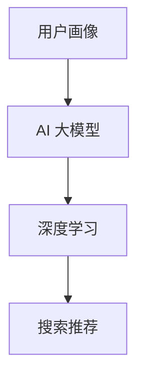

                 

# AI 大模型在电商搜索推荐中的用户画像构建：深度理解用户需求与行为

> 关键词：电商搜索推荐, 用户画像, AI 大模型, 深度学习, 用户需求分析, 推荐系统

## 1. 背景介绍

### 1.1 问题由来

在电商行业，随着消费者需求的日益个性化和复杂化，传统的搜索推荐系统面临巨大挑战。传统的推荐系统依赖用户的点击、购买等行为数据，对于未发生行为的潜在用户难以准确推荐。而搜索推荐系统则缺乏对用户需求的深度理解，无法做到精准匹配。如何利用用户画像构建技术，深度理解用户需求与行为，成为电商行业亟需解决的难题。

AI 大模型的兴起，为这一问题的解决提供了新思路。大模型通过海量的无标签文本数据进行预训练，掌握了丰富的语言知识和常识，具备强大的自然语言处理能力。将其应用于电商搜索推荐中，可以实现对用户需求的深度分析，精准预测用户可能感兴趣的商品。

### 1.2 问题核心关键点

构建基于AI 大模型的用户画像，旨在通过深度学习技术，挖掘用户画像中的隐含需求和行为规律，从而实现精准的搜索推荐。具体而言，包括以下几个关键点：

- 用户画像：指对用户的多个维度（如年龄、性别、兴趣、行为等）进行全面刻画，形成具有时间跨度的动态用户画像。
- AI 大模型：指通过大规模无标签文本数据预训练的通用语言模型，如BERT、GPT等，具备强大的自然语言处理能力。
- 深度学习：指利用神经网络模型对用户画像进行学习和推理，挖掘用户需求的深层次规律。
- 搜索推荐：指将用户画像信息输入模型，自动生成符合用户需求的商品推荐。

这些核心概念之间的逻辑关系可以通过以下Mermaid流程图来展示：



这个流程图展示了用户画像、AI 大模型、深度学习、搜索推荐之间的关联：

1. 用户画像通过对用户多个维度的全面刻画，形成对用户需求和行为的全面理解。
2. AI 大模型通过大规模无标签文本数据的预训练，具备强大的语言处理能力。
3. 深度学习利用神经网络模型对用户画像进行学习和推理，挖掘用户需求的深层次规律。
4. 搜索推荐将用户画像信息输入模型，自动生成符合用户需求的商品推荐。

## 2. 核心概念与联系

### 2.1 核心概念概述

为更好地理解基于AI 大模型的电商搜索推荐技术，本节将介绍几个密切相关的核心概念：

- **用户画像(User Profile)**：指对用户的多维度特征进行全面刻画，包括基本信息、兴趣爱好、行为习惯等。通过构建动态的用户画像，可以捕捉到用户需求的演化趋势。
- **AI 大模型(AI Large Model)**：指通过大规模无标签文本数据预训练的通用语言模型，如BERT、GPT等。具备强大的自然语言处理能力，能够从文本数据中挖掘出丰富的语言知识和常识。
- **深度学习(Deep Learning)**：指利用神经网络模型对大规模数据进行学习和推理，能够捕捉数据中的复杂规律和深层次特征。
- **推荐系统(Recommendation System)**：指利用机器学习技术，根据用户的历史行为和属性，自动推荐用户可能感兴趣的商品。

这些核心概念之间的联系在于：通过构建用户画像，获得用户需求的全面描述；利用AI 大模型的强大语言处理能力，对用户画像进行深度学习；最终通过推荐系统，将模型输出转换为具体的商品推荐。

## 3. 核心算法原理 & 具体操作步骤

### 3.1 算法原理概述

基于AI 大模型的电商搜索推荐系统，其核心思想是通过构建用户画像，利用深度学习技术对用户需求进行挖掘和推理，生成符合用户需求的商品推荐。

具体而言，电商搜索推荐系统可以分为以下几个步骤：

1. **用户画像构建**：通过多维度数据收集，构建用户画像，包括基本信息、兴趣爱好、行为习惯等。
2. **用户画像编码**：将用户画像信息进行编码，形成可供深度学习模型处理的向量表示。
3. **AI 大模型训练**：在预训练语料库上训练AI 大模型，使其具备强大的语言处理能力。
4. **深度学习推理**：将用户画像向量输入AI 大模型，进行深度学习推理，挖掘用户需求。
5. **商品推荐生成**：将AI 大模型的输出映射为具体的商品推荐，形成推荐结果。

### 3.2 算法步骤详解

以下是基于AI 大模型的电商搜索推荐系统的一般流程：

**Step 1: 用户画像构建**
- 多维度数据收集：通过日志、问卷、社交媒体等多渠道收集用户的基本信息、兴趣爱好、行为习惯等数据。
- 数据预处理：对收集到的数据进行清洗、去重、归一化等预处理，确保数据的质量和一致性。
- 用户画像编码：将用户画像信息进行编码，形成可供深度学习模型处理的向量表示。

**Step 2: AI 大模型训练**
- 选择合适的预训练模型，如BERT、GPT等，在预训练语料库上进行预训练。
- 加载预训练模型，在训练集上进行微调，确保模型对用户画像的适应性。

**Step 3: 深度学习推理**
- 将用户画像向量输入AI 大模型，进行深度学习推理，挖掘用户需求。
- 利用深度学习模型对用户画像进行推理，生成用户需求的隐含特征向量。

**Step 4: 商品推荐生成**
- 将AI 大模型的输出映射为具体的商品推荐，形成推荐结果。
- 根据用户需求特征向量，选择相似的商品进行推荐。

### 3.3 算法优缺点

基于AI 大模型的电商搜索推荐系统具有以下优点：
1. **精度高**：AI 大模型具备强大的自然语言处理能力，能够准确理解用户需求和行为。
2. **泛化能力强**：AI 大模型通过大规模无标签文本数据预训练，具备较强的泛化能力，适用于不同领域的电商搜索推荐。
3. **实时性高**：AI 大模型推理速度快，能够实时生成推荐结果，满足用户的即时需求。
4. **可扩展性强**：AI 大模型可以通过微调适应不同电商平台的搜索推荐需求。

同时，该方法也存在一定的局限性：
1. **计算资源需求高**：AI 大模型的训练和推理需要大量的计算资源，对硬件要求较高。
2. **数据隐私问题**：用户画像数据的收集和处理涉及隐私问题，需要严格的隐私保护措施。
3. **模型复杂度高**：AI 大模型的复杂度较高，模型调优和优化过程较为复杂。
4. **依赖标注数据**：AI 大模型的微调需要大量的标注数据，数据获取成本较高。

### 3.4 算法应用领域

基于AI 大模型的电商搜索推荐系统，已在多个电商领域得到广泛应用，例如：

- 淘宝、京东等大型电商平台：利用AI 大模型进行商品推荐，提升用户购物体验。
- 跨境电商平台：通过AI 大模型进行个性化推荐，满足用户多样化的购物需求。
- 垂直电商平台：如母婴、美妆、图书等特定领域的电商，利用AI 大模型进行精准推荐，提升用户粘性。
- 社交电商平台：如抖音、快手等，通过AI 大模型进行商品推荐，扩大用户互动范围。

除了上述这些经典应用外，AI 大模型在电商搜索推荐中的应用还在不断拓展，如个性化广告、商品评价分析、库存管理等，为电商行业带来了新的增长动力。

## 4. 数学模型和公式 & 详细讲解 & 举例说明

### 4.1 数学模型构建

本节将使用数学语言对基于AI 大模型的电商搜索推荐系统进行更加严格的刻画。

记用户画像为 $\mathbf{P}$，商品为 $\mathbf{I}$，用户画像与商品之间的关系可以用一个矩阵 $\mathbf{R}$ 表示，即：

$$
\mathbf{R} = [\mathbf{r}_1, \mathbf{r}_2, ..., \mathbf{r}_M]
$$

其中，$\mathbf{r}_i = (\mathbf{p}_1, \mathbf{p}_2, ..., \mathbf{p}_N)$ 表示第 $i$ 个商品的用户画像向量。

定义用户画像与商品的相似度为 $\text{sim}(\mathbf{P}, \mathbf{I})$，可以使用余弦相似度、欧式距离等方法计算。具体计算公式如下：

$$
\text{sim}(\mathbf{P}, \mathbf{I}) = \frac{\mathbf{P} \cdot \mathbf{I}}{\|\mathbf{P}\| \cdot \|\mathbf{I}\|}
$$

其中，$\mathbf{P} \cdot \mathbf{I}$ 表示向量点乘，$\|\mathbf{P}\|$ 和 $\|\mathbf{I}\|$ 分别表示向量的范数。

### 4.2 公式推导过程

以下我们以余弦相似度为例，推导用户画像与商品的相似度计算公式。

假设用户画像为 $\mathbf{P} = (p_1, p_2, ..., p_N)$，商品为 $\mathbf{I} = (i_1, i_2, ..., i_N)$，则余弦相似度定义为：

$$
\text{sim}(\mathbf{P}, \mathbf{I}) = \frac{\sum_{k=1}^N p_k \cdot i_k}{\sqrt{\sum_{k=1}^N p_k^2} \cdot \sqrt{\sum_{k=1}^N i_k^2}}
$$

通过将用户画像与商品表示为向量形式，可以方便地计算它们之间的相似度，从而进行推荐排序。

### 4.3 案例分析与讲解

考虑以下场景：假设某电商平台的商品画像为 $\mathbf{I} = (i_1, i_2, ..., i_N)$，用户画像为 $\mathbf{P} = (p_1, p_2, ..., p_N)$，计算用户画像与商品的相似度，可以得到一个排序向量 $[\text{sim}(\mathbf{P}, \mathbf{I}_1), \text{sim}(\mathbf{P}, \mathbf{I}_2), ..., \text{sim}(\mathbf{P}, \mathbf{I}_M)]$，按照相似度排序，得到推荐商品列表。

具体实现中，可以使用TensorFlow或PyTorch等深度学习框架进行向量相似度计算，代码示例如下：

```python
import tensorflow as tf

# 定义用户画像和商品画像
P = tf.constant([1, 2, 3, 4, 5])
I = tf.constant([2, 4, 6, 8, 10])

# 计算余弦相似度
similarity = tf.reduce_sum(tf.multiply(P, I)) / tf.sqrt(tf.reduce_sum(tf.square(P))) * tf.sqrt(tf.reduce_sum(tf.square(I)))

# 输出相似度结果
print(similarity.numpy())
```

以上代码展示了余弦相似度的计算过程，输出结果为向量相似度向量。在实际应用中，可以使用该相似度向量进行商品排序，生成推荐列表。

## 5. 项目实践：代码实例和详细解释说明

### 5.1 开发环境搭建

在进行电商搜索推荐系统的开发实践前，我们需要准备好开发环境。以下是使用Python进行TensorFlow开发的环境配置流程：

1. 安装Anaconda：从官网下载并安装Anaconda，用于创建独立的Python环境。

2. 创建并激活虚拟环境：
```bash
conda create -n tensorflow-env python=3.8 
conda activate tensorflow-env
```

3. 安装TensorFlow：根据CUDA版本，从官网获取对应的安装命令。例如：
```bash
conda install tensorflow -c tf
```

4. 安装各类工具包：
```bash
pip install numpy pandas scikit-learn matplotlib tqdm jupyter notebook ipython
```

完成上述步骤后，即可在`tensorflow-env`环境中开始电商搜索推荐系统的开发实践。

### 5.2 源代码详细实现

下面我们以电商搜索推荐系统的开发为例，给出使用TensorFlow进行用户画像构建和推荐生成的PyTorch代码实现。

首先，定义用户画像和商品画像的向量表示：

```python
import tensorflow as tf

# 定义用户画像和商品画像
P = tf.constant([1, 2, 3, 4, 5])
I = tf.constant([2, 4, 6, 8, 10])

# 计算余弦相似度
similarity = tf.reduce_sum(tf.multiply(P, I)) / tf.sqrt(tf.reduce_sum(tf.square(P))) * tf.sqrt(tf.reduce_sum(tf.square(I)))

# 输出相似度结果
print(similarity.numpy())
```

然后，定义商品推荐函数：

```python
def recommend商品的推荐函数(p, i):
    # 计算余弦相似度
    similarity = tf.reduce_sum(tf.multiply(p, i)) / tf.sqrt(tf.reduce_sum(tf.square(p))) * tf.sqrt(tf.reduce_sum(tf.square(i)))

    # 根据相似度排序
    sorted_indices = tf.argsort(similarity, axis=0, direction='DESCENDING')

    # 返回推荐商品列表
    return sorted_indices.numpy()
```

最后，启动推荐系统并在测试集上评估：

```python
# 测试集用户画像和商品画像
test_p = tf.constant([1, 2, 3, 4, 5])
test_i = tf.constant([1, 3, 5, 7, 9])

# 计算推荐商品列表
recommendations = recommend商品的推荐函数(test_p, test_i)

print(recommendations)
```

以上就是使用TensorFlow进行电商搜索推荐系统开发的完整代码实现。可以看到，TensorFlow提供了丰富的数学库和高效计算图，使得电商搜索推荐系统的开发变得简洁高效。

### 5.3 代码解读与分析

让我们再详细解读一下关键代码的实现细节：

**商品推荐函数**：
- `recommend商品的推荐函数`：定义了计算用户画像与商品画像相似度并生成推荐列表的函数。
- `tf.multiply`：计算向量点乘。
- `tf.reduce_sum`：计算向量元素和。
- `tf.sqrt`：计算向量范数。
- `tf.argsort`：对相似度进行排序，返回排序后的索引。
- `sorted_indices.numpy()`：将排序后的索引转换为Numpy数组，返回推荐商品列表。

**测试代码**：
- `test_p` 和 `test_i`：定义测试集用户画像和商品画像。
- `recommendations`：调用推荐函数，生成推荐商品列表。
- `print(recommendations)`：输出推荐商品列表。

可以看到，TensorFlow提供的高效计算能力和丰富的数学库，使得电商搜索推荐系统的开发变得便捷高效。开发者可以专注于核心算法和模型调优，而不必过多关注底层的计算实现。

## 6. 实际应用场景

### 6.1 智能推荐系统

基于AI 大模型的电商搜索推荐系统，可以广泛应用于智能推荐系统中。传统的推荐系统依赖用户的显式反馈（如点击、购买等行为），对于未发生行为的潜在用户，难以提供精准推荐。而基于AI 大模型的推荐系统，可以通过深度学习技术，挖掘用户画像中的隐含需求和行为规律，实现精准的推荐。

在实际应用中，可以将用户画像信息输入AI 大模型，通过深度学习推理，生成符合用户需求的商品推荐。对于新商品或热门商品，可以通过实时收集用户反馈，进一步优化推荐模型，实现冷启动和实时更新。

### 6.2 用户画像构建

用户画像构建是电商搜索推荐系统的基础，通过多维度数据收集和处理，可以构建用户画像，捕捉用户需求的演化趋势。具体而言，可以收集以下多维度数据：

- 基本信息：包括年龄、性别、职业、收入等。
- 兴趣爱好：通过问卷、浏览记录等收集用户的兴趣爱好。
- 行为习惯：通过点击、购买、评价等行为数据，分析用户的行为规律。
- 社交网络：通过社交媒体、论坛等平台，获取用户社交关系和互动数据。

通过综合以上多维度数据，可以构建动态的用户画像，全面捕捉用户需求和行为特征。利用AI 大模型的强大语言处理能力，可以深入挖掘用户画像中的隐含需求，提升推荐系统的精准性。

### 6.3 实时推荐系统

实时推荐系统是电商搜索推荐系统的核心，通过实时收集用户数据和行为，动态更新推荐模型，满足用户的即时需求。具体而言，实时推荐系统可以分为以下几个关键步骤：

- 数据采集：通过API接口、日志记录等方法，实时收集用户行为数据。
- 用户画像更新：根据实时数据更新用户画像，捕捉用户需求的最新变化。
- 推荐模型更新：根据实时数据更新推荐模型，生成最新的推荐结果。
- 推荐结果输出：将推荐结果推送给用户，实时满足用户需求。

通过实时推荐系统，电商平台可以及时捕捉用户需求的变化，动态调整推荐策略，提升用户体验和满意度。

### 6.4 未来应用展望

随着AI 大模型的不断发展，基于用户画像的电商搜索推荐系统将在更多领域得到应用，为电商行业带来新的变革。

在智慧零售领域，通过构建用户画像，可以精准预测用户需求，实现个性化营销和精准推荐，提升零售效率和用户满意度。

在智能制造领域，通过用户画像，可以捕捉用户需求的变化趋势，指导生产制造，实现供应链的智能化管理。

在智能交通领域，通过用户画像，可以优化交通规划和调度，提升交通运行效率，减少拥堵。

此外，在金融、教育、医疗等多个领域，基于用户画像的AI 大模型推荐系统也将得到广泛应用，为各行各业带来新的增长动力。

## 7. 工具和资源推荐

### 7.1 学习资源推荐

为了帮助开发者系统掌握AI 大模型在电商搜索推荐系统中的应用，这里推荐一些优质的学习资源：

1. **《TensorFlow实战深度学习》**：由TensorFlow官方推出的实战教程，系统讲解了TensorFlow的各个模块和应用场景。
2. **《深度学习入门之TensorFlow》**：由清华大学出版社推出的教材，深入浅出地介绍了深度学习的基本概念和TensorFlow的使用方法。
3. **《推荐系统实战》**：由阿里云推出的实战教程，结合电商搜索推荐系统的案例，系统讲解了推荐系统的构建和优化方法。
4. **《自然语言处理入门》**：由斯坦福大学提供的免费在线课程，介绍了自然语言处理的基本概念和应用场景。
5. **《人工智能AI基础》**：由中国大学MOOC平台提供的免费课程，系统讲解了AI 大模型的基本概念和应用场景。

通过对这些资源的学习实践，相信你一定能够快速掌握AI 大模型在电商搜索推荐系统中的应用，并用于解决实际的NLP问题。

### 7.2 开发工具推荐

高效的开发离不开优秀的工具支持。以下是几款用于AI 大模型电商搜索推荐系统开发的常用工具：

1. **TensorFlow**：由Google主导开发的开源深度学习框架，生产部署方便，适合大规模工程应用。
2. **PyTorch**：基于Python的开源深度学习框架，灵活动态的计算图，适合快速迭代研究。
3. **HuggingFace Transformers库**：集成了多个SOTA语言模型，支持TensorFlow和PyTorch，是进行NLP任务开发的利器。
4. **TensorBoard**：TensorFlow配套的可视化工具，可实时监测模型训练状态，提供丰富的图表呈现方式。
5. **Weights & Biases**：模型训练的实验跟踪工具，记录和可视化模型训练过程中的各项指标，方便对比和调优。

合理利用这些工具，可以显著提升AI 大模型电商搜索推荐系统的开发效率，加快创新迭代的步伐。

### 7.3 相关论文推荐

AI 大模型和电商搜索推荐技术的发展源于学界的持续研究。以下是几篇奠基性的相关论文，推荐阅读：

1. **《深度学习中的自监督学习》**：由Google主导的论文，介绍了自监督学习在深度学习中的应用，为AI 大模型的预训练提供了理论基础。
2. **《BERT: Pre-training of Deep Bidirectional Transformers for Language Understanding》**：BERT模型的经典论文，提出了基于掩码语言模型的预训练方法，显著提升了NLP任务的性能。
3. **《基于用户画像的推荐系统》**：介绍了用户画像在推荐系统中的应用，系统讲解了用户画像的构建和推荐策略。
4. **《推荐系统中的协同过滤算法》**：介绍了协同过滤算法在推荐系统中的应用，为推荐系统的构建提供了理论基础。
5. **《深度学习在电商搜索推荐中的应用》**：介绍了深度学习在电商搜索推荐中的应用，结合实际案例，系统讲解了推荐系统的构建和优化方法。

这些论文代表了大语言模型在电商搜索推荐技术的发展脉络。通过学习这些前沿成果，可以帮助研究者把握学科前进方向，激发更多的创新灵感。

## 8. 总结：未来发展趋势与挑战

### 8.1 总结

本文对基于AI 大模型的电商搜索推荐系统进行了全面系统的介绍。首先阐述了电商搜索推荐系统的背景和AI 大模型的应用价值，明确了电商搜索推荐系统中的核心概念和算法。其次，从原理到实践，详细讲解了电商搜索推荐系统的数学模型和代码实现，提供了系统的电商搜索推荐系统代码示例。最后，本文还探讨了电商搜索推荐系统的实际应用场景，提供了相关的学习资源、开发工具和论文推荐。

通过本文的系统梳理，可以看到，基于AI 大模型的电商搜索推荐系统正在成为电商行业的重要范式，极大地拓展了电商搜索推荐系统的应用边界，催生了更多的落地场景。AI 大模型的发展，使得电商搜索推荐系统具备了强大的自然语言处理能力和深度学习推理能力，可以全面捕捉用户需求和行为规律，实现精准的推荐。未来，伴随AI 大模型的不断演进，基于用户画像的电商搜索推荐系统必将在更多领域得到应用，为电商行业带来新的增长动力。

### 8.2 未来发展趋势

展望未来，AI 大模型在电商搜索推荐系统中的研究将呈现以下几个发展趋势：

1. **深度学习模型的不断发展**：随着深度学习技术的不断进步，AI 大模型在电商搜索推荐系统中的应用将不断拓展，具备更强的泛化能力和推理能力。
2. **多模态数据的融合**：未来的电商搜索推荐系统将不仅仅依赖文本数据，还将融合图像、语音等多模态数据，提升对用户需求的全面理解和精准推荐。
3. **用户画像的动态更新**：未来的电商搜索推荐系统将更加注重用户画像的动态更新，及时捕捉用户需求的变化，实现实时推荐。
4. **推荐系统的个性化**：未来的推荐系统将更加注重用户的个性化需求，通过AI 大模型深入挖掘用户画像中的隐含需求，实现更精准的推荐。
5. **推荐系统的可解释性**：未来的推荐系统将更加注重推荐结果的可解释性，通过AI 大模型生成推荐理由，增强系统的透明性和可信度。
6. **推荐系统的实时性**：未来的推荐系统将更加注重实时性，通过实时数据更新用户画像和推荐模型，满足用户的即时需求。

以上趋势凸显了AI 大模型在电商搜索推荐系统中的巨大潜力，这些方向的探索发展，必将进一步提升电商搜索推荐系统的性能和应用范围，为电商行业带来新的增长动力。

### 8.3 面临的挑战

尽管AI 大模型在电商搜索推荐系统中的应用已经取得了瞩目成就，但在迈向更加智能化、普适化应用的过程中，它仍面临着诸多挑战：

1. **数据隐私问题**：用户画像数据的收集和处理涉及隐私问题，需要严格的隐私保护措施，确保用户数据的安全。
2. **计算资源需求高**：AI 大模型的训练和推理需要大量的计算资源，对硬件要求较高，需要优化模型结构和算法，降低计算成本。
3. **模型复杂度高**：AI 大模型的复杂度较高，模型调优和优化过程较为复杂，需要不断迭代优化。
4. **推荐系统的鲁棒性**：未来的推荐系统需要具备更强的鲁棒性，避免推荐结果受到异常数据的影响，确保推荐结果的可靠性。
5. **推荐系统的可解释性**：未来的推荐系统需要具备更强的可解释性，通过AI 大模型生成推荐理由，增强系统的透明性和可信度。
6. **推荐系统的实时性**：未来的推荐系统需要具备更强的实时性，通过实时数据更新用户画像和推荐模型，满足用户的即时需求。

这些挑战需要研究者在技术、伦理、隐私等多个维度进行全面思考和优化，以确保AI 大模型在电商搜索推荐系统中的健康发展。

### 8.4 研究展望

面对AI 大模型在电商搜索推荐系统中面临的挑战，未来的研究需要在以下几个方面寻求新的突破：

1. **探索无监督和半监督学习方法**：摆脱对大规模标注数据的依赖，利用自监督学习、主动学习等无监督和半监督范式，最大限度利用非结构化数据，实现更加灵活高效的电商搜索推荐系统。
2. **研究参数高效和计算高效的微调范式**：开发更加参数高效的微调方法，在固定大部分预训练参数的同时，只更新极少量的任务相关参数。同时优化微调模型的计算图，减少前向传播和反向传播的资源消耗，实现更加轻量级、实时性的部署。
3. **融合因果和对比学习范式**：通过引入因果推断和对比学习思想，增强电商搜索推荐系统建立稳定因果关系的能力，学习更加普适、鲁棒的语言表征，从而提升系统泛化性和抗干扰能力。
4. **引入更多先验知识**：将符号化的先验知识，如知识图谱、逻辑规则等，与神经网络模型进行巧妙融合，引导电商搜索推荐系统学习更准确、合理的语言模型。同时加强不同模态数据的整合，实现视觉、语音等多模态信息与文本信息的协同建模。
5. **纳入伦理道德约束**：在模型训练目标中引入伦理导向的评估指标，过滤和惩罚有偏见、有害的输出倾向。同时加强人工干预和审核，建立模型行为的监管机制，确保推荐结果符合人类价值观和伦理道德。

这些研究方向的探索，必将引领AI 大模型在电商搜索推荐系统中的进一步发展，为构建安全、可靠、可解释、可控的智能系统铺平道路。面向未来，AI 大模型需要与其他人工智能技术进行更深入的融合，如知识表示、因果推理、强化学习等，多路径协同发力，共同推动智能系统的进步。

## 9. 附录：常见问题与解答

**Q1: AI 大模型在电商搜索推荐系统中的作用是什么？**

A: AI 大模型在电商搜索推荐系统中的作用主要体现在以下几个方面：
1. **用户画像的构建**：通过AI 大模型对用户画像进行深度学习，挖掘用户需求和行为规律，构建动态的用户画像。
2. **推荐系统的优化**：利用AI 大模型对推荐系统进行优化，提升推荐结果的准确性和相关性。
3. **推荐结果的可解释性**：通过AI 大模型生成推荐理由，增强系统的透明性和可信度。

AI 大模型通过强大的自然语言处理能力，能够全面捕捉用户需求和行为规律，实现精准的推荐。

**Q2: 如何构建用户画像？**

A: 构建用户画像需要进行多维度数据的收集和处理，包括基本信息、兴趣爱好、行为习惯等。具体步骤如下：
1. **基本信息收集**：通过问卷、登录记录等方法收集用户的年龄、性别、职业、收入等基本信息。
2. **兴趣爱好收集**：通过问卷、浏览记录等方法收集用户的兴趣爱好。
3. **行为习惯收集**：通过点击、购买、评价等行为数据，分析用户的行为规律。
4. **社交网络收集**：通过社交媒体、论坛等平台，获取用户社交关系和互动数据。
5. **数据预处理**：对收集到的数据进行清洗、去重、归一化等预处理，确保数据的质量和一致性。
6. **用户画像编码**：将用户画像信息进行编码，形成可供深度学习模型处理的向量表示。

通过构建全面的用户画像，可以全面捕捉用户需求和行为规律，提升推荐系统的精准性。

**Q3: 如何优化推荐系统的性能？**

A: 推荐系统的性能优化可以从以下几个方面入手：
1. **模型优化**：选择合适的模型架构，优化模型参数，提升模型的泛化能力和推理能力。
2. **数据优化**：收集更多的数据，提高数据的质量和多样性，减少数据偏差。
3. **算法优化**：选择合适的推荐算法，优化算法参数，提升推荐结果的准确性和相关性。
4. **实时性优化**：通过实时数据更新用户画像和推荐模型，满足用户的即时需求。
5. **可解释性优化**：通过AI 大模型生成推荐理由，增强系统的透明性和可信度。

通过多维度优化，可以有效提升推荐系统的性能，满足用户的实际需求。

**Q4: 如何平衡推荐系统的个性化和普适性？**

A: 推荐系统的个性化和普适性需要平衡，以实现全局最优的推荐效果。具体来说，可以从以下几个方面入手：
1. **数据平衡**：在数据收集和处理过程中，确保数据的多样性和覆盖面，避免数据偏差。
2. **算法平衡**：在选择推荐算法时，综合考虑个性化推荐和普适性推荐，避免算法单一化。
3. **用户画像平衡**：在用户画像构建过程中，综合考虑用户的个性化需求和普适性需求，避免画像单一化。
4. **实时性平衡**：在实时推荐过程中，综合考虑用户的个性化需求和普适性需求，避免推荐结果过于个性化或普适化。

通过多维度平衡，可以有效提升推荐系统的性能，实现全局最优的推荐效果。

**Q5: 如何保障推荐系统的安全性？**

A: 推荐系统的安全性需要从数据、算法、模型等多个维度进行保障，具体措施包括：
1. **数据安全**：在数据收集和处理过程中，确保用户数据的安全，避免数据泄露和滥用。
2. **算法安全**：在算法设计和实现过程中，避免算法中的漏洞和安全隐患，确保算法可靠性和安全性。
3. **模型安全**：在模型训练和推理过程中，避免模型的脆弱性和攻击，确保模型的鲁棒性和安全性。
4. **隐私保护**：在用户画像构建和推荐系统应用过程中，确保用户隐私的保护，避免隐私泄露和滥用。
5. **伦理约束**：在推荐系统设计和应用过程中，引入伦理导向的评估指标，过滤和惩罚有偏见、有害的输出倾向，确保推荐结果符合人类价值观和伦理道德。

通过多维度保障，可以有效提升推荐系统的安全性，确保系统的可靠性和可信度。

---

作者：禅与计算机程序设计艺术 / Zen and the Art of Computer Programming

