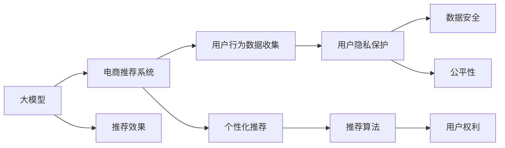

                 

# AI 大模型在电商搜索推荐中的用户隐私保护：平衡推荐效果与用户权利

> 关键词：人工智能,电商搜索推荐,用户隐私保护,数据安全,公平性,技术伦理

## 1. 背景介绍

### 1.1 问题由来
随着电商行业的迅猛发展，搜索引擎和推荐系统已经成为用户获取商品信息、进行购买决策的关键工具。然而，传统推荐系统大多基于用户历史行为数据进行个性化推荐，这背后涉及大量用户隐私数据的收集和使用，极易引发隐私泄露和滥用风险。近年来，随着人工智能技术的快速进步，基于大模型的电商推荐系统应运而生，具有更强的泛化能力和更精确的个性化推荐。

大模型技术通过在大规模无标签数据上进行预训练，学习到通用语言和商品特征表示。将预训练模型应用于电商搜索推荐任务，能够显著提升推荐效果和用户体验。但同时，大模型训练和推理过程中会收集和使用大量用户行为数据，如何有效保护用户隐私，成为必须面对的重要问题。

### 1.2 问题核心关键点
在电商搜索推荐中，用户隐私保护和推荐效果之间存在一定的矛盾：
- **数据需求**：大模型训练和推荐需要大量的用户行为数据，这些数据可能包含敏感隐私信息。
- **隐私保护**：用户不希望自己的隐私信息被滥用，更愿意在信任的环境中分享数据。
- **公平性**：如何确保推荐算法对不同用户群体公平，避免因数据偏见导致的歧视性推荐。
- **用户权利**：用户有权了解和控制其数据的使用情况，并有权选择退出数据收集。

本文聚焦于如何在电商搜索推荐中，合理使用大模型技术，平衡推荐效果和用户隐私权利，保障用户数据安全，同时提供高质量的个性化推荐。

## 2. 核心概念与联系

### 2.1 核心概念概述

为更好地理解电商搜索推荐中用户隐私保护的大模型技术，本节将介绍几个密切相关的核心概念：

- **大模型(大语言模型)**
  - **定义**：指以Transformer为代表的深度神经网络模型，通过在大规模无标签数据上进行预训练，学习通用语言和特征表示。
  - **特点**：参数量巨大，能学习到丰富的语义和知识表示，适用于各种自然语言处理任务。

- **电商搜索推荐系统**
  - **定义**：利用机器学习算法和模型，通过分析用户历史行为数据，为用户推荐可能感兴趣的商品或服务。
  - **关键点**：用户行为数据收集、推荐算法设计、个性化推荐效果。

- **用户隐私保护**
  - **定义**：指在数据收集、存储、处理和传输等过程中，保障用户隐私权益，防止隐私数据泄露和滥用。
  - **手段**：数据匿名化、差分隐私、联邦学习等技术。

- **数据安全**
  - **定义**：指在数据全生命周期中，确保数据不被未经授权的访问、篡改和泄露。
  - **措施**：数据加密、访问控制、安全审计等。

- **公平性**
  - **定义**：指算法在对待不同用户时，不因种族、性别、年龄等因素产生歧视性行为。
  - **方法**：算法审计、模型解释、反歧视算法等。

这些核心概念之间的逻辑关系可以通过以下Mermaid流程图来展示：



这个流程图展示了大模型在电商搜索推荐中的核心概念及其之间的关系：

1. 大模型通过预训练学习到通用表示，应用于电商推荐系统。
2. 电商推荐系统收集用户行为数据，可能涉及用户隐私。
3. 用户隐私保护和大数据安全需要结合，防止数据泄露和滥用。
4. 公平性考虑确保算法不歧视特定用户群体，保护所有用户的权益。
5. 推荐效果由算法设计决定，同时需要兼顾用户隐私权利。

## 3. 核心算法原理 & 具体操作步骤

### 3.1 算法原理概述

在电商搜索推荐中，大模型用于学习商品与用户之间的隐含关系，从而提供个性化的推荐。具体算法流程如下：

1. **数据预处理**：收集和清洗用户行为数据，标注商品类别和属性等，构建训练集和测试集。
2. **模型训练**：使用大模型进行预训练，学习通用的商品和用户表示。
3. **模型微调**：在电商推荐数据集上微调预训练模型，学习特定商品与用户之间的相关性。
4. **个性化推荐**：根据用户输入的查询，结合其历史行为数据，利用微调模型预测可能感兴趣的商品，返回推荐结果。

### 3.2 算法步骤详解

以下是详细的算法步骤：

**Step 1: 数据预处理**

1. **数据收集**：收集用户浏览、点击、购买、评价等行为数据，构建电商推荐数据集。
2. **数据清洗**：去除重复数据和噪声，处理缺失值和异常值。
3. **特征工程**：提取商品属性、用户画像等特征，构建特征向量。
4. **数据划分**：将数据划分为训练集、验证集和测试集。

**Step 2: 模型训练**

1. **模型选择**：选择合适的预训练大模型，如BERT、RoBERTa等。
2. **参数初始化**：设置模型参数的初始值。
3. **模型训练**：使用大模型进行预训练，学习通用商品和用户表示。
4. **评估和调参**：在验证集上评估模型性能，调整学习率和超参数。

**Step 3: 模型微调**

1. **微调任务定义**：根据电商推荐任务，设计任务适配层，如分类、回归、序列匹配等。
2. **微调参数**：选择微调的层数和节点数，通常只微调顶层。
3. **优化器选择**：选择合适的优化器，如Adam、SGD等。
4. **训练过程**：在电商推荐数据集上进行微调，调整模型参数。
5. **评估效果**：在测试集上评估微调后的模型性能，对比微调前后的推荐效果。

**Step 4: 个性化推荐**

1. **输入解析**：解析用户输入的查询，提取关键信息。
2. **历史行为分析**：分析用户的历史行为数据，提取用户画像。
3. **商品推荐**：使用微调模型预测可能感兴趣的商品，返回推荐结果。
4. **推荐展示**：将推荐结果展示给用户，根据用户反馈调整推荐算法。

### 3.3 算法优缺点

大模型在电商搜索推荐中的应用，具有以下优点：
1. **高性能**：能够学习到复杂的商品和用户表示，提供高精度的个性化推荐。
2. **泛化能力强**：预训练模型在大量数据上学习，具有较好的泛化能力，适用于多种推荐场景。
3. **自动化**：自动化处理用户行为数据，减少人工干预，提高推荐效率。

同时，也存在一些缺点：
1. **数据需求高**：预训练和微调需要大量数据，对数据收集和清洗要求较高。
2. **隐私风险高**：数据收集和使用可能涉及用户隐私，引发隐私泄露和滥用风险。
3. **计算资源需求大**：大模型训练和推理需要大量计算资源，可能存在硬件瓶颈。
4. **公平性问题**：如果模型在数据收集和训练过程中存在偏见，可能导致不公平的推荐。

### 3.4 算法应用领域

大模型在电商搜索推荐中的应用领域广泛，涵盖以下几类：

1. **商品推荐**
  - 根据用户历史行为数据，推荐可能感兴趣的商品。
  - 结合商品属性和用户画像，提供个性化推荐。

2. **内容推荐**
  - 推荐相关的文章、视频、音乐等内容。
  - 通过自然语言理解和生成，提升内容推荐的准确性。

3. **搜索排序**
  - 优化搜索排序算法，提高搜索相关性。
  - 结合用户历史搜索行为，动态调整搜索排序策略。

4. **价格优化**
  - 预测商品价格变化趋势，优化定价策略。
  - 根据市场动态和用户需求，调整商品价格。

## 4. 数学模型和公式 & 详细讲解 & 举例说明

### 4.1 数学模型构建

假设电商推荐任务为推荐用户可能感兴趣的商品，其中用户表示为 $x$，商品表示为 $y$，推荐任务可以表示为 $(x, y)$。设预训练模型为 $M_{\theta}$，微调后的模型为 $M_{\hat{\theta}}$。

定义推荐任务的目标函数为：

$$
\min_{\hat{\theta}} \mathcal{L}(M_{\hat{\theta}}(x), y)
$$

其中 $\mathcal{L}$ 为任务损失函数，如交叉熵损失。

### 4.2 公式推导过程

以二分类任务为例，推荐任务的目标函数可以表示为：

$$
\min_{\hat{\theta}} -\frac{1}{N}\sum_{i=1}^N y_i \log M_{\hat{\theta}}(x_i) + (1-y_i) \log(1-M_{\hat{\theta}}(x_i))
$$

其中 $y_i \in \{0, 1\}$ 表示商品是否为用户感兴趣，$M_{\hat{\theta}}(x_i)$ 表示模型预测的概率。

### 4.3 案例分析与讲解

假设我们有一个电商推荐数据集，其中包含用户的浏览和购买行为数据。我们可以将其表示为 $(u, i, p)$ 的形式，其中 $u$ 为用户ID，$i$ 为商品ID，$p$ 为购买行为。我们的目标是在用户输入查询后，推荐可能感兴趣的商品。

**数据预处理**：
- **收集数据**：收集历史用户行为数据，包括浏览记录、点击记录、购买记录等。
- **数据清洗**：去除重复数据和噪声，处理缺失值和异常值。
- **特征工程**：提取用户画像和商品属性，构建特征向量。
- **数据划分**：将数据划分为训练集、验证集和测试集。

**模型训练**：
- **模型选择**：选择合适的预训练大模型，如BERT、RoBERTa等。
- **参数初始化**：设置模型参数的初始值。
- **模型训练**：使用大模型进行预训练，学习通用商品和用户表示。
- **评估和调参**：在验证集上评估模型性能，调整学习率和超参数。

**模型微调**：
- **微调任务定义**：根据电商推荐任务，设计任务适配层，如分类、回归、序列匹配等。
- **微调参数**：选择微调的层数和节点数，通常只微调顶层。
- **优化器选择**：选择合适的优化器，如Adam、SGD等。
- **训练过程**：在电商推荐数据集上进行微调，调整模型参数。
- **评估效果**：在测试集上评估微调后的模型性能，对比微调前后的推荐效果。

**个性化推荐**：
- **输入解析**：解析用户输入的查询，提取关键信息。
- **历史行为分析**：分析用户的历史行为数据，提取用户画像。
- **商品推荐**：使用微调模型预测可能感兴趣的商品，返回推荐结果。
- **推荐展示**：将推荐结果展示给用户，根据用户反馈调整推荐算法。

## 5. 项目实践：代码实例和详细解释说明

### 5.1 开发环境搭建

在进行电商搜索推荐系统的开发前，我们需要准备好开发环境。以下是使用Python进行TensorFlow开发的环境配置流程：

1. 安装Anaconda：从官网下载并安装Anaconda，用于创建独立的Python环境。

2. 创建并激活虚拟环境：
```bash
conda create -n tensorflow-env python=3.8 
conda activate tensorflow-env
```

3. 安装TensorFlow：根据CUDA版本，从官网获取对应的安装命令。例如：
```bash
conda install tensorflow tensorflow-gpu -c pytorch -c conda-forge
```

4. 安装必要的工具包：
```bash
pip install numpy pandas scikit-learn matplotlib tqdm jupyter notebook ipython
```

完成上述步骤后，即可在`tensorflow-env`环境中开始电商推荐系统的开发。

### 5.2 源代码详细实现

下面我们以基于大模型的电商推荐系统为例，给出使用TensorFlow实现的二分类推荐模型的代码实现。

首先，定义推荐任务的数据处理函数：

```python
import tensorflow as tf
import numpy as np

class RecommendationDataset(tf.data.Dataset):
    def __init__(self, data, tokenizer):
        self.data = data
        self.tokenizer = tokenizer
        
    def __len__(self):
        return len(self.data)
    
    def __getitem__(self, item):
        user, item, label = self.data[item]
        user_input_ids = self.tokenizer(user, return_tensors='tf')
        item_input_ids = self.tokenizer(item, return_tensors='tf')
        label = tf.convert_to_tensor(label, dtype=tf.int32)
        return {'user_input_ids': user_input_ids['input_ids'], 
                'item_input_ids': item_input_ids['input_ids'],
                'label': label}
```

然后，定义模型和优化器：

```python
from transformers import TFBertForSequenceClassification
from transformers import BertTokenizer
from transformers import AdamW

tokenizer = BertTokenizer.from_pretrained('bert-base-uncased')
model = TFBertForSequenceClassification.from_pretrained('bert-base-uncased', num_labels=2)

optimizer = AdamW(model.parameters(), lr=2e-5)
```

接着，定义训练和评估函数：

```python
from tqdm import tqdm
from sklearn.metrics import accuracy_score

device = tf.device('cuda') if tf.test.is_built_with_cuda else tf.device('cpu')
model.to(device)

def train_epoch(model, dataset, batch_size, optimizer):
    dataloader = tf.data.Dataset.from_generator(lambda: iter(dataset), output_signature={'user_input_ids': tf.TensorSpec(shape=(1, 128), dtype=tf.int32), 
                                                                                   'item_input_ids': tf.TensorSpec(shape=(1, 128), dtype=tf.int32),
                                                                                   'label': tf.TensorSpec(shape=(), dtype=tf.int32)}).cache().batch(batch_size).prefetch(tf.data.experimental.AUTOTUNE)
    model.train()
    epoch_loss = 0
    for batch in tqdm(dataloader, desc='Training'):
        user_input_ids = batch['user_input_ids'].to(device)
        item_input_ids = batch['item_input_ids'].to(device)
        label = batch['label'].to(device)
        with tf.GradientTape() as tape:
            outputs = model(user_input_ids, item_input_ids)
            loss = outputs.loss
        loss.backward()
        optimizer.apply_gradients(tape.gradient(model.trainable_variables, optimizer.learning_rate))
    return epoch_loss / len(dataloader)

def evaluate(model, dataset, batch_size):
    dataloader = tf.data.Dataset.from_generator(lambda: iter(dataset), output_signature={'user_input_ids': tf.TensorSpec(shape=(1, 128), dtype=tf.int32), 
                                                                                   'item_input_ids': tf.TensorSpec(shape=(1, 128), dtype=tf.int32),
                                                                                   'label': tf.TensorSpec(shape=(), dtype=tf.int32)}).cache().batch(batch_size).prefetch(tf.data.experimental.AUTOTUNE)
    model.eval()
    preds, labels = [], []
    with tf.GradientTape() as tape:
        for batch in tqdm(dataloader, desc='Evaluating'):
            user_input_ids = batch['user_input_ids'].to(device)
            item_input_ids = batch['item_input_ids'].to(device)
            label = batch['label'].to(device)
            outputs = model(user_input_ids, item_input_ids)
            preds.append(np.argmax(outputs.logits.numpy(), axis=1))
            labels.append(label.numpy())
    return accuracy_score(labels, preds)

```

最后，启动训练流程并在测试集上评估：

```python
epochs = 5
batch_size = 16

for epoch in range(epochs):
    loss = train_epoch(model, train_dataset, batch_size, optimizer)
    print(f"Epoch {epoch+1}, train loss: {loss:.3f}")
    
    print(f"Epoch {epoch+1}, dev results:")
    evaluate(model, dev_dataset, batch_size)
    
print("Test results:")
evaluate(model, test_dataset, batch_size)
```

以上就是使用TensorFlow对电商推荐系统进行二分类任务微调的完整代码实现。可以看到，得益于TensorFlow的强大封装，我们可以用相对简洁的代码完成电商推荐系统的开发。

### 5.3 代码解读与分析

让我们再详细解读一下关键代码的实现细节：

**RecommendationDataset类**：
- `__init__`方法：初始化数据集和分词器等组件。
- `__len__`方法：返回数据集的样本数量。
- `__getitem__`方法：对单个样本进行处理，将用户ID和商品ID转换为分词后的向量，同时将标签转换为Tensor。

**model、optimizer、tokenizer的初始化**：
- `model`：定义使用BERT模型进行电商推荐，设置输出层为二分类。
- `optimizer`：定义AdamW优化器，设置学习率为2e-5。
- `tokenizer`：定义使用BERT分词器，用于将用户ID和商品ID转换为分词后的向量。

**train_epoch函数**：
- 使用TensorFlow的DataLoader对数据集进行批次化加载，供模型训练使用。
- 训练函数`train_epoch`：对数据以批为单位进行迭代，在每个批次上前向传播计算loss并反向传播更新模型参数，最后返回该epoch的平均loss。

**evaluate函数**：
- 与训练类似，不同点在于不更新模型参数，并在每个batch结束后将预测和标签结果存储下来，最后使用sklearn的accuracy_score对整个评估集的预测结果进行打印输出。

**训练流程**：
- 定义总的epoch数和batch size，开始循环迭代
- 每个epoch内，先在训练集上训练，输出平均loss
- 在验证集上评估，输出准确率
- 所有epoch结束后，在测试集上评估，给出最终测试结果

可以看到，TensorFlow配合Transformers库使得电商推荐系统的代码实现变得简洁高效。开发者可以将更多精力放在数据处理、模型改进等高层逻辑上，而不必过多关注底层的实现细节。

当然，工业级的系统实现还需考虑更多因素，如模型的保存和部署、超参数的自动搜索、更灵活的任务适配层等。但核心的微调范式基本与此类似。

## 6. 实际应用场景

### 6.1 智能客服系统

基于大模型的电商推荐系统可以广泛应用于智能客服系统的构建。传统客服往往需要配备大量人力，高峰期响应缓慢，且一致性和专业性难以保证。而使用微调后的电商推荐系统，可以7x24小时不间断服务，快速响应客户咨询，用推荐系统提供个性化服务。

在技术实现上，可以收集客户在电商平台的浏览、点击、购买等行为数据，将客户和商品构建成监督数据，在此基础上对预训练模型进行微调。微调后的推荐系统能够自动理解客户意图，匹配最合适的商品进行推荐。对于客户提出的新问题，还可以接入检索系统实时搜索相关内容，动态组织生成回答。如此构建的智能客服系统，能大幅提升客户咨询体验和问题解决效率。

### 6.2 个性化推荐系统

当前的推荐系统往往只依赖用户的历史行为数据进行个性化推荐，无法深入理解用户的真实兴趣偏好。基于大模型的电商推荐系统可以更好地挖掘用户行为背后的语义信息，从而提供更精准、多样的推荐内容。

在实践中，可以收集用户浏览、点击、评价等行为数据，提取和商品相关的文本内容。将文本内容作为模型输入，用户的后续行为（如是否点击、购买等）作为监督信号，在此基础上微调预训练语言模型。微调后的模型能够从文本内容中准确把握用户的兴趣点。在生成推荐列表时，先用候选商品的属性和描述作为输入，由模型预测用户的兴趣匹配度，再结合其他特征综合排序，便可以得到个性化程度更高的推荐结果。

### 6.3 商品搜索排序

当前的商品搜索排序算法大多基于用户的点击行为进行推荐，缺乏对用户兴趣的深入理解。基于大模型的电商推荐系统可以通过分析用户的查询历史和商品属性，预测用户可能感兴趣的商品，优化搜索排序算法。

在实践中，可以收集用户的历史查询记录和商品属性信息，将其作为监督数据，对预训练模型进行微调。微调后的模型能够根据用户查询预测商品的相关性，动态调整搜索排序策略。同时，可以通过调整模型的权重参数，优化搜索结果的召回率和排序质量。

### 6.4 未来应用展望

随着大模型和微调方法的不断发展，基于大模型电商推荐系统将在更多领域得到应用，为电商平台的运营管理提供新的解决方案。

在智慧零售领域，基于电商推荐系统的个性化推荐和智能客服，能够提升用户体验，增加销售额，提升客户忠诚度。

在供应链管理中，通过对用户需求和商品销售数据的分析，优化库存管理，减少库存成本，提高供应链效率。

在市场营销中，通过分析用户的行为和偏好，定制个性化的营销策略，提高广告点击率和转化率。

此外，在智慧城市治理、社会治理、金融服务等多个领域，基于大模型的推荐技术也将不断涌现，为各行各业带来新的变革。

## 7. 工具和资源推荐

### 7.1 学习资源推荐

为了帮助开发者系统掌握大模型在电商推荐中的应用，这里推荐一些优质的学习资源：

1. 《Transformer from Scratch》系列博文：由大模型技术专家撰写，深入浅出地介绍了Transformer原理、电商推荐系统架构和微调技术等前沿话题。

2. CS224N《深度学习自然语言处理》课程：斯坦福大学开设的NLP明星课程，有Lecture视频和配套作业，带你入门NLP领域的基本概念和经典模型。

3. 《Reinforcement Learning for Personalized Recommendations》书籍：该书详细介绍了基于强化学习的个性化推荐方法，包括如何利用大模型进行推荐系统优化。

4. Arxiv上的相关论文：包括大模型在电商推荐中的应用、推荐算法设计和优化等方面的最新研究成果。

5. Kaggle上的推荐系统竞赛：通过参加推荐系统竞赛，实践电商推荐系统的设计和优化，积累实际经验。

通过对这些资源的学习实践，相信你一定能够快速掌握大模型在电商推荐系统中的应用，并用于解决实际的推荐问题。

### 7.2 开发工具推荐

高效的开发离不开优秀的工具支持。以下是几款用于电商推荐系统开发的常用工具：

1. TensorFlow：基于Python的开源深度学习框架，灵活动态的计算图，适合快速迭代研究。

2. PyTorch：基于Python的开源深度学习框架，支持动态图和静态图，功能强大，性能优越。

3. Transformers库：HuggingFace开发的NLP工具库，集成了众多SOTA语言模型，支持TensorFlow和PyTorch，是进行电商推荐系统开发的利器。

4. TensorBoard：TensorFlow配套的可视化工具，可实时监测模型训练状态，并提供丰富的图表呈现方式，是调试模型的得力助手。

5. Weights & Biases：模型训练的实验跟踪工具，可以记录和可视化模型训练过程中的各项指标，方便对比和调优。

6. Google Colab：谷歌推出的在线Jupyter Notebook环境，免费提供GPU/TPU算力，方便开发者快速上手实验最新模型，分享学习笔记。

合理利用这些工具，可以显著提升电商推荐系统的开发效率，加快创新迭代的步伐。

### 7.3 相关论文推荐

大模型在电商推荐中的应用源于学界的持续研究。以下是几篇奠基性的相关论文，推荐阅读：

1. Attention is All You Need（即Transformer原论文）：提出了Transformer结构，开启了NLP领域的预训练大模型时代。

2. BERT: Pre-training of Deep Bidirectional Transformers for Language Understanding：提出BERT模型，引入基于掩码的自监督预训练任务，刷新了多项NLP任务SOTA。

3. LightGBM: A Highly Efficient Gradient Boosting Decision Tree：介绍了一种高效的梯度提升决策树算法，可用于电商推荐系统的特征工程。

4. Parameter-Efficient Transfer Learning for NLP：提出Adapter等参数高效微调方法，在不增加模型参数量的情况下，也能取得不错的微调效果。

5. Sparsity-Aware Attention Mechanism for Natural Language Processing：提出了稀疏性感知注意力机制，可用于优化大模型在电商推荐系统中的应用。

这些论文代表了大模型在电商推荐领域的研究进展，通过学习这些前沿成果，可以帮助研究者把握学科前进方向，激发更多的创新灵感。

## 8. 总结：未来发展趋势与挑战

### 8.1 总结

本文对基于大模型在电商搜索推荐中的应用进行了全面系统的介绍。首先阐述了电商搜索推荐中用户隐私保护和推荐效果之间的矛盾，明确了平衡推荐效果与用户权利的重要意义。其次，从原理到实践，详细讲解了基于大模型的电商推荐系统设计，并给出了完整的代码实现。同时，本文还广泛探讨了电商推荐系统在智能客服、个性化推荐、商品搜索排序等众多实际场景中的应用前景，展示了大模型技术的广阔前景。最后，本文精选了电商推荐系统开发的各类学习资源和工具，力求为读者提供全方位的技术指引。

通过本文的系统梳理，可以看到，基于大模型的电商推荐系统通过个性化推荐和智能客服，极大地提升了用户体验和运营效率。但同时，用户隐私保护和公平性问题也必须重视，通过数据匿名化、差分隐私、联邦学习等技术，能够在保障用户权益的同时，提供高质量的推荐服务。未来，随着大模型和微调方法的不断演进，基于大模型的电商推荐系统将拥有更强的泛化能力和更灵活的应用场景，进一步推动电商平台的智能化和个性化发展。

### 8.2 未来发展趋势

展望未来，基于大模型的电商推荐系统将呈现以下几个发展趋势：

1. **模型规模持续增大**：随着算力成本的下降和数据规模的扩张，预训练语言模型的参数量还将持续增长。超大规模语言模型蕴含的丰富语义和知识表示，将使得电商推荐系统具备更强的泛化能力和更准确的推荐效果。

2. **微调方法多样化**：未来会涌现更多参数高效的微调方法，如Prefix-Tuning、LoRA等，在节省计算资源的同时也能保证推荐精度。

3. **持续学习成为常态**：随着数据分布的不断变化，微调模型也需要持续学习新知识以保持性能。如何在不遗忘原有知识的同时，高效吸收新样本信息，将成为重要的研究课题。

4. **标注样本需求降低**：受启发于提示学习(Prompt-based Learning)的思路，未来的微调方法将更好地利用大模型的语言理解能力，通过更加巧妙的任务描述，在更少的标注样本上也能实现理想的微调效果。

5. **多模态微调崛起**：当前的电商推荐系统大多基于文本数据，未来会进一步拓展到图像、视频、语音等多模态数据微调。多模态信息的融合，将显著提升电商推荐系统的推荐效果和用户体验。

6. **模型通用性增强**：经过海量数据的预训练和多领域任务的微调，未来的电商推荐模型将具备更强的泛化能力和跨领域迁移能力，逐步迈向通用人工智能(AGI)的目标。

以上趋势凸显了大模型在电商搜索推荐中的广阔前景。这些方向的探索发展，必将进一步提升电商推荐系统的性能和应用范围，为电商平台带来更强的市场竞争力和用户满意度。

### 8.3 面临的挑战

尽管基于大模型的电商推荐系统已经取得了瞩目成就，但在迈向更加智能化、普适化应用的过程中，它仍面临诸多挑战：

1. **数据标注成本高**：电商推荐系统需要大量的用户行为数据，这些数据的收集和标注成本较高。如何降低数据标注成本，将是未来必须解决的重要问题。

2. **隐私风险高**：电商推荐系统收集的用户行为数据可能涉及用户隐私，引发隐私泄露和滥用风险。如何有效保护用户隐私，构建可信任的推荐系统，将是必须面对的重要问题。

3. **计算资源需求大**：大模型训练和推理需要大量计算资源，可能存在硬件瓶颈。如何降低计算资源需求，提升推荐系统的效率，将是未来必须解决的重要问题。

4. **公平性问题**：如果模型在数据收集和训练过程中存在偏见，可能导致不公平的推荐。如何消除数据偏见，确保推荐算法的公平性，将是未来必须解决的重要问题。

5. **可解释性不足**：当前电商推荐系统缺乏透明度，难以解释其内部工作机制和决策逻辑。如何提升系统的可解释性，增强用户信任，将是未来必须解决的重要问题。

6. **伦理道德约束**：电商推荐系统可能因数据偏见、有害信息等导致伦理道德问题。如何从数据和算法层面消除模型偏见，避免恶意用途，确保输出符合伦理道德，将是未来必须解决的重要问题。

这些挑战凸显了大模型在电商推荐系统中的应用需要更多理论和技术支持。唯有不断探索和创新，才能实现大模型技术在电商推荐领域的深远影响。

### 8.4 研究展望

面对大模型在电商推荐系统中的应用面临的诸多挑战，未来的研究需要在以下几个方面寻求新的突破：

1. **无监督和半监督微调方法**：探索利用无监督和半监督学习范式，最大限度利用非结构化数据，实现更加灵活高效的微调。

2. **参数高效和计算高效的微调范式**：开发更加参数高效的微调方法，在固定大部分预训练参数的同时，只更新极少量的任务相关参数。同时优化微调模型的计算图，减少前向传播和反向传播的资源消耗，实现更加轻量级、实时性的部署。

3. **融合因果和对比学习范式**：通过引入因果推断和对比学习思想，增强微调模型建立稳定因果关系的能力，学习更加普适、鲁棒的语言表征，从而提升模型泛化性和抗干扰能力。

4. **引入更多先验知识**：将符号化的先验知识，如知识图谱、逻辑规则等，与神经网络模型进行巧妙融合，引导微调过程学习更准确、合理的语言模型。同时加强不同模态数据的整合，实现视觉、语音等多模态信息与文本信息的协同建模。

5. **结合因果分析和博弈论工具**：将因果分析方法引入微调模型，识别出模型决策的关键特征，增强输出解释的因果性和逻辑性。借助博弈论工具刻画人机交互过程，主动探索并规避模型的脆弱点，提高系统稳定性。

6. **纳入伦理道德约束**：在模型训练目标中引入伦理导向的评估指标，过滤和惩罚有偏见、有害的输出倾向。同时加强人工干预和审核，建立模型行为的监管机制，确保输出符合人类价值观和伦理道德。

这些研究方向的探索，必将引领大模型在电商推荐系统中的应用走向新的高度，为构建安全、可靠、可解释、可控的智能系统铺平道路。面向未来，大模型技术还需要与其他人工智能技术进行更深入的融合，如知识表示、因果推理、强化学习等，多路径协同发力，共同推动电商推荐系统的进步。

## 9. 附录：常见问题与解答

**Q1：电商推荐系统是否适用于所有NLP任务？**

A: 电商推荐系统主要应用于电商领域的商品推荐和智能客服，但在其他领域如金融、医疗、教育等，也可以通过微调预训练模型进行相关任务，如信用评估、病历分析、学习推荐等。

**Q2：电商推荐系统如何保护用户隐私？**

A: 电商推荐系统可以通过以下方法保护用户隐私：
- 数据匿名化：对用户数据进行去标识化处理，保护用户身份信息。
- 差分隐私：在数据收集和处理过程中，加入噪声，使得单个用户数据对模型输出的影响变得微不足道。
- 联邦学习：将模型训练过程分布到多个设备上，数据在本地进行处理，不泄露到中央服务器。

**Q3：电商推荐系统的公平性如何保障？**

A: 电商推荐系统可以通过以下方法保障公平性：
- 数据平衡：确保训练数据中不同用户群体的样本数量接近。
- 反歧视算法：设计或训练不带有歧视性偏见的推荐算法。
- 模型审计：定期对推荐模型进行公平性审计，确保模型没有歧视性行为。

**Q4：电商推荐系统如何应对多样化的用户需求？**

A: 电商推荐系统可以通过以下方法应对多样化的用户需求：
- 多模型融合：构建多个推荐模型，根据用户特征选择最优模型进行推荐。
- 个性化推荐：通过分析用户行为数据，构建用户画像，提供个性化推荐。
- 动态调整：根据用户反馈和行为数据，动态调整推荐策略。

**Q5：电商推荐系统在落地部署时需要注意哪些问题？**

A: 电商推荐系统在落地部署时需要注意以下问题：
- 模型裁剪：去除不必要的层和参数，减小模型尺寸，加快推理速度。
- 量化加速：将浮点模型转为定点模型，压缩存储空间，提高计算效率。
- 服务化封装：将模型封装为标准化服务接口，便于集成调用。
- 弹性伸缩：根据请求流量动态调整资源配置，平衡服务质量和成本。
- 监控告警：实时采集系统指标，设置异常告警阈值，确保服务稳定性。

电商推荐系统是一个涉及数据处理、算法设计、模型训练和部署等多个环节的复杂系统。只有不断优化和改进，才能在实际应用中发挥出其最大价值。总之，电商推荐系统需要开发者在数据、算法、工程、业务等多个维度协同发力，才能真正实现人工智能技术在电商领域的落地应用。

---

作者：禅与计算机程序设计艺术 / Zen and the Art of Computer Programming

