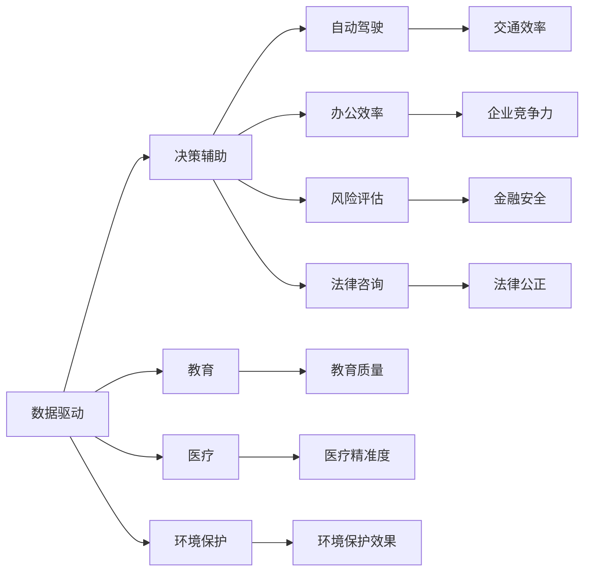

                 

# AI 时代的社会影响：促进社会进步

> 关键词：人工智能(AI), 社会进步, 数据驱动, 决策辅助, 自动驾驶, 教育, 医疗, 环境保护

## 1. 背景介绍

### 1.1 问题由来
随着人工智能技术的飞速发展，AI正迅速渗透到各个行业，深刻改变着我们的生活方式和社会结构。从自动化生产到智能客服，从医疗诊断到环境保护，AI的应用已经渗透到人类社会的各个角落。这些进步带来了显著的效率提升和成本节约，但同时也引发了诸多社会问题和伦理挑战。如何合理利用AI技术，促进社会进步，成为我们时代的一项重要课题。

### 1.2 问题核心关键点
AI技术对社会的影响主要体现在以下几个方面：
- **效率提升**：自动化和智能化极大提高了生产效率和决策效率，优化了资源配置。
- **成本节约**：减少了人工成本和运营成本，提升了企业竞争力和市场份额。
- **创新驱动**：推动了新产品、新服务的创新，激发了新的产业形态和经济增长点。
- **公平性挑战**：AI应用可能加剧数字鸿沟，导致社会不平等现象加剧。
- **就业影响**：AI自动化可能导致部分岗位被替代，引发就业结构性变化。
- **伦理争议**：AI决策透明度、责任归属、隐私保护等问题引发了广泛的伦理争议。

### 1.3 问题研究意义
探讨AI技术对社会的影响，不仅具有理论意义，更具有现实指导意义。了解AI技术的潜在影响，可以帮助我们制定更为合理的应用策略，避免可能的负面后果，最大化其社会价值。同时，通过规范和引导AI技术的发展，可以使其更好地服务于社会进步，实现科技与人文的和谐共生。

## 2. 核心概念与联系

### 2.1 核心概念概述

为了深入理解AI技术对社会的影响，我们需要掌握一些核心概念：

- **人工智能(AI)**：通过模拟人脑的推理、学习、决策等能力，实现对复杂问题的自动化处理。AI包括机器学习、深度学习、自然语言处理等多种技术。
- **数据驱动**：AI技术主要依赖数据进行模型训练和优化，高质量的数据是AI应用成功的基础。
- **决策辅助**：AI技术在医疗、金融、法律等领域，辅助人类进行决策，提高决策效率和准确性。
- **自动驾驶**：AI在交通领域的应用，使汽车等交通工具实现自动化驾驶，提高道路安全和交通效率。
- **教育**：AI技术在个性化教学、智能评估、辅助设计等方面，提高了教育质量和效率。
- **医疗**：AI在医学影像分析、药物研发、手术辅助等方面，提升了医疗服务的精准度和效率。
- **环境保护**：AI技术在气候变化监测、污染治理、资源管理等方面，提供了科学依据和技术手段。

这些概念通过逻辑关系相互连接，共同构成了AI技术对社会影响的整体框架。

### 2.2 核心概念原理和架构的 Mermaid 流程图



## 3. 核心算法原理 & 具体操作步骤
### 3.1 算法原理概述

AI技术的核心算法原理主要基于机器学习、深度学习等技术，通过数据训练模型，实现对特定任务的自动化处理。其基本流程包括数据准备、模型训练、模型评估和模型部署。

### 3.2 算法步骤详解

1. **数据准备**：
   - 收集和清洗数据，确保数据的质量和多样性。
   - 将数据划分为训练集、验证集和测试集，供模型训练和评估使用。

2. **模型训练**：
   - 选择合适的算法和模型架构，如卷积神经网络(CNN)、循环神经网络(RNN)、Transformer等。
   - 使用训练集数据对模型进行训练，通过反向传播算法优化模型参数。
   - 定期在验证集上评估模型性能，防止过拟合。

3. **模型评估**：
   - 使用测试集数据对训练好的模型进行测试，评估其在未见过的数据上的表现。
   - 根据评估结果，调整模型参数和算法策略，进一步提升模型性能。

4. **模型部署**：
   - 将训练好的模型部署到生产环境，供实际应用使用。
   - 定期更新模型参数，保持模型性能和泛化能力。

### 3.3 算法优缺点

**优点**：
- **高效性**：AI技术能够处理大量数据，快速完成复杂任务，提高工作效率。
- **准确性**：通过大量数据训练，AI模型能够在特定任务上取得高精度结果。
- **适应性强**：AI技术可以适应多种任务和环境，具有较强的泛化能力。

**缺点**：
- **数据依赖**：AI模型的性能很大程度上取决于训练数据的质量和数量。
- **复杂性**：AI技术实现复杂，需要大量计算资源和技术积累。
- **可解释性**：AI模型的决策过程往往缺乏透明度，难以解释其内部工作机制。
- **伦理风险**：AI决策可能导致不公平、偏见等伦理问题，需要严格监管。

### 3.4 算法应用领域

AI技术在各个领域的应用非常广泛，以下是一些主要领域：

- **工业生产**：通过自动化和智能化，提高生产效率和产品质量。
- **金融服务**：用于风险评估、信用评分、欺诈检测等，提升金融服务的安全性和效率。
- **医疗健康**：在医学影像分析、个性化诊疗、药物研发等方面，提升医疗服务的精准度和效率。
- **智能交通**：实现自动驾驶、智能交通管理，提高交通安全和效率。
- **智慧城市**：在公共安全、能源管理、环境保护等方面，提供智能化解决方案。
- **教育培训**：通过个性化教学、智能评估，提升教育质量和效率。
- **环境保护**：在气候变化监测、污染治理、资源管理等方面，提供科学依据和技术手段。

## 4. 数学模型和公式 & 详细讲解 & 举例说明

### 4.1 数学模型构建

AI模型的构建通常包括以下几个关键步骤：

1. **数据预处理**：将原始数据转换为模型所需的格式，如标准化、归一化、特征工程等。
2. **模型选择**：根据任务类型选择适合的模型架构，如线性回归、神经网络、深度学习等。
3. **模型训练**：使用训练集数据对模型进行训练，优化模型参数。
4. **模型评估**：使用测试集数据对训练好的模型进行评估，选择最优模型。

### 4.2 公式推导过程

以线性回归模型为例，其基本公式为：

$$
y = \beta_0 + \beta_1 x_1 + \beta_2 x_2 + ... + \beta_n x_n + \epsilon
$$

其中 $y$ 为目标变量，$x_1, x_2, ..., x_n$ 为自变量，$\beta_0, \beta_1, \beta_2, ..., \beta_n$ 为模型参数，$\epsilon$ 为误差项。

在线性回归模型的训练过程中，通过最小化均方误差（MSE）来更新模型参数：

$$
\min_{\beta} \sum_{i=1}^m (y_i - (\beta_0 + \beta_1 x_{1i} + \beta_2 x_{2i} + ... + \beta_n x_{ni}))^2
$$

通过求解上述优化问题，得到最优的模型参数 $\beta$，使得模型预测结果与实际值尽可能接近。

### 4.3 案例分析与讲解

假设我们要构建一个简单的房价预测模型，数据集包含房屋面积（$x_1$）、房间数量（$x_2$）和房屋价格（$y$）。我们的目标是使用线性回归模型预测新房屋的价格。

首先，将数据集划分为训练集和测试集：

```python
import numpy as np
from sklearn.model_selection import train_test_split
from sklearn.linear_model import LinearRegression

# 数据集准备
X = np.array([[100, 2], [120, 3], [150, 4], [160, 5]])
y = np.array([200, 250, 300, 350])

# 数据划分
X_train, X_test, y_train, y_test = train_test_split(X, y, test_size=0.2, random_state=42)
```

然后，训练线性回归模型：

```python
# 模型训练
model = LinearRegression()
model.fit(X_train, y_train)

# 模型评估
y_pred = model.predict(X_test)
mse = np.mean((y_pred - y_test) ** 2)
```

最后，使用测试集评估模型性能：

```python
# 模型评估
mse
```

## 5. 项目实践：代码实例和详细解释说明
### 5.1 开发环境搭建

为了进行AI项目实践，我们需要搭建合适的开发环境。以下是Python环境搭建的步骤：

1. **安装Python**：从官网下载并安装Python 3.x版本。
2. **安装PyTorch**：使用pip安装PyTorch，如：`pip install torch torchvision torchaudio`。
3. **安装TensorFlow**：使用pip安装TensorFlow，如：`pip install tensorflow`。
4. **安装Pandas**：使用pip安装Pandas，如：`pip install pandas`。
5. **安装Matplotlib**：使用pip安装Matplotlib，如：`pip install matplotlib`。
6. **安装Jupyter Notebook**：使用pip安装Jupyter Notebook，如：`pip install jupyter notebook`。

### 5.2 源代码详细实现

以下是一个简单的房价预测模型实现：

```python
import numpy as np
from sklearn.model_selection import train_test_split
from sklearn.linear_model import LinearRegression

# 数据集准备
X = np.array([[100, 2], [120, 3], [150, 4], [160, 5]])
y = np.array([200, 250, 300, 350])

# 数据划分
X_train, X_test, y_train, y_test = train_test_split(X, y, test_size=0.2, random_state=42)

# 模型训练
model = LinearRegression()
model.fit(X_train, y_train)

# 模型评估
y_pred = model.predict(X_test)
mse = np.mean((y_pred - y_test) ** 2)
print(f"Mean Squared Error: {mse:.2f}")
```

### 5.3 代码解读与分析

这段代码主要包含以下几个部分：

- **数据准备**：将原始数据转换为模型所需的格式。
- **模型训练**：使用训练集数据对线性回归模型进行训练，优化模型参数。
- **模型评估**：使用测试集数据对训练好的模型进行评估，计算均方误差。

## 6. 实际应用场景
### 6.4 未来应用展望

AI技术将在未来继续深入各个领域，带来更多创新和变革：

- **智能交通**：自动驾驶技术将极大地提高交通安全和效率，减少交通事故和碳排放。
- **智慧医疗**：AI将在医学影像分析、个性化诊疗、药物研发等方面发挥更大作用，提高医疗服务的精准度和效率。
- **智能制造**：AI将推动制造业的智能化、个性化和自动化，提高生产效率和产品质量。
- **个性化推荐**：AI将在电商、媒体、娱乐等领域，提供更精准的个性化推荐，提升用户体验。
- **智能家居**：AI将使家居设备智能化，提供更加便捷和舒适的生活体验。
- **环境保护**：AI将在气候变化监测、污染治理、资源管理等方面提供科学依据和技术手段，推动绿色发展。

## 7. 工具和资源推荐
### 7.1 学习资源推荐

为了深入学习和理解AI技术，以下是一些优质的学习资源：

1. **Coursera**：提供大量关于AI和机器学习的在线课程，涵盖从基础到高级的内容。
2. **edX**：提供来自世界顶尖大学的AI相关课程，涵盖AI的基础理论和应用技术。
3. **Udacity**：提供实践导向的AI项目课程，培养学生的实际动手能力。
4. **Kaggle**：提供大量数据集和竞赛，帮助学生练习和提升AI技能。
5. **GitHub**：提供大量开源项目和代码示例，供学习者参考和学习。

### 7.2 开发工具推荐

为了提高AI开发的效率和质量，以下是一些推荐的开发工具：

1. **Jupyter Notebook**：开源的交互式开发环境，适合数据探索、模型训练和结果展示。
2. **Google Colab**：Google提供的免费云服务，提供高性能计算资源，适合大规模模型训练。
3. **PyTorch**：基于Python的开源深度学习框架，提供灵活的张量计算和模型训练。
4. **TensorFlow**：由Google开发的开源深度学习框架，提供丰富的工具和库。
5. **Keras**：基于Python的高层神经网络API，易于使用且功能丰富。

### 7.3 相关论文推荐

以下是一些关于AI技术和应用的重要论文，推荐阅读：

1. **Deep Learning**：由Goodfellow等人编写的深度学习经典教材，详细介绍了深度学习的基本原理和应用。
2. **Pattern Recognition and Machine Learning**：由Christopher Bishop编写的机器学习经典教材，涵盖机器学习的各种算法和应用。
3. **Human-AI Collaboration: A Guide to Winning Human-AI Collaborative Systems**：探讨人类和AI系统之间的协作，提供实际应用的指导。
4. **Robustness and Interpretability of AI Systems**：研究AI系统的鲁棒性和可解释性，提出一些重要的研究方向和挑战。
5. **Ethical AI: Toward a Data-Driven Privacy-Preserving AI System**：探讨AI技术的伦理问题，提出一些保障隐私和安全的解决方案。

## 8. 总结：未来发展趋势与挑战
### 8.1 总结

本文对AI技术对社会的影响进行了全面系统的介绍。首先，探讨了AI技术的背景和意义，明确了其在提高效率、节约成本、推动创新等方面的重要作用。其次，从原理到实践，详细讲解了AI技术的应用流程，包括数据准备、模型训练、模型评估和模型部署。最后，展望了AI技术在多个领域的应用前景，强调了其带来的社会进步和潜在挑战。

### 8.2 未来发展趋势

AI技术在未来的发展趋势将体现在以下几个方面：

1. **算法优化**：不断优化和改进算法，提高模型的性能和泛化能力。
2. **数据驱动**：持续积累和挖掘高质量数据，增强模型的训练效果。
3. **跨领域融合**：将AI技术与更多领域相结合，推动交叉学科的发展。
4. **伦理规范**：制定和遵循AI伦理规范，确保技术应用的公平性和安全性。
5. **普适化应用**：开发更加普适、易于使用的AI工具，促进技术的普及和应用。
6. **可持续发展**：推动AI技术在环境保护、资源管理等方面的应用，实现可持续发展。

### 8.3 面临的挑战

尽管AI技术在许多领域取得了显著进展，但仍面临诸多挑战：

1. **数据隐私**：AI技术对大量数据的依赖可能带来隐私泄露风险，需要制定严格的数据保护政策。
2. **伦理争议**：AI决策的透明度和可解释性问题，可能导致不公平和偏见，需要严格监管。
3. **技术壁垒**：AI技术的高门槛和复杂性，可能导致技术普及和应用受限。
4. **资源消耗**：大规模模型训练和推理需要大量的计算资源，可能带来环境和经济成本。
5. **安全性问题**：AI系统可能被恶意攻击或滥用，需要加强安全防护和监管。

### 8.4 研究展望

未来的AI技术研究需要关注以下几个方面：

1. **隐私保护**：研究数据隐私保护技术，确保数据使用的安全性和公平性。
2. **伦理规范**：制定AI伦理规范，推动公平、透明的AI系统设计。
3. **可持续发展**：推动AI技术在环境保护、资源管理等方面的应用，实现可持续发展。
4. **跨领域融合**：促进AI技术与更多领域结合，推动交叉学科的发展。
5. **普适化应用**：开发易于使用、普适化的AI工具，提升技术的普及和应用。

## 9. 附录：常见问题与解答

**Q1：AI技术的发展将如何影响就业市场？**

A: AI技术的发展将对就业市场产生双刃剑效应。一方面，自动化和智能化将提高生产效率，创造更多就业机会。另一方面，某些重复性、低技能的工作可能被AI替代，导致就业结构性变化。因此，需要制定相应的政策，进行职业培训和教育，帮助劳动力市场适应新技术的变革。

**Q2：AI技术在医疗领域的应用有哪些？**

A: AI技术在医疗领域的应用包括但不限于：
- 医学影像分析：使用AI算法对CT、MRI等影像进行自动诊断。
- 个性化诊疗：根据患者的基因、病历等数据，提供个性化的治疗方案。
- 药物研发：使用AI模拟分子结构，加速新药研发过程。
- 手术辅助：使用AI辅助进行手术规划和操作，提高手术精度和安全性。

**Q3：AI技术在环境保护中的应用有哪些？**

A: AI技术在环境保护中的应用包括：
- 气候变化监测：使用AI技术分析气象数据，预测气候变化趋势。
- 污染治理：使用AI技术监测和分析污染源，制定治理方案。
- 资源管理：使用AI技术优化资源分配，提高资源利用效率。
- 生物多样性保护：使用AI技术监测和保护濒危物种，实现生态平衡。

总之，AI技术在各个领域的应用将为社会带来深刻变革，推动社会进步。通过合理利用AI技术，我们有望在提高效率、节约成本、推动创新等方面实现更大的发展。然而，也需要注意AI技术的潜在风险和挑战，制定相应的政策和规范，确保技术应用的公平性和安全性。

