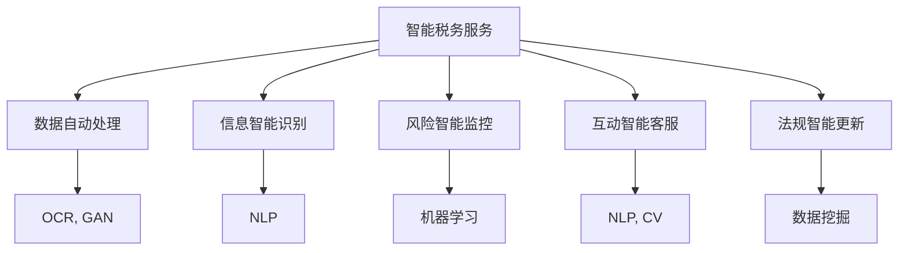

                 

# AIGC助力智能税务服务

> 关键词：人工智能(AI)、生成对抗网络(GAN)、计算机视觉(CV)、自然语言处理(NLP)、智能税务服务

## 1. 背景介绍

### 1.1 问题由来
在数字化经济不断发展的背景下，税收工作变得愈发复杂多变。无论是企业税务申报、个人税务查询，还是税务审计、风险监控，都面临着数据量大、业务场景复杂、规则多变等挑战。传统的税收服务方式，如人工查询、繁琐的手工审核等，已经难以适应新形势下的需求。

近年来，人工智能技术在各行各业的应用日益广泛，税务领域也不例外。尤其是生成对抗网络(GAN)、计算机视觉(CV)、自然语言处理(NLP)等AI技术的兴起，为智能税务服务的落地提供了可能。利用这些技术，税务机关和企业可以高效、准确、智能地处理税收相关事务，提升税务服务的质量与效率。

### 1.2 问题核心关键点
智能税务服务的关键在于将AI技术有效地应用到税务场景中。具体而言，包括：

1. 数据自动处理：通过OCR、GAN等技术，自动从发票、单据、报表等纸质或电子文档中提取和识别信息，减少人工录入的繁琐工作。
2. 信息智能识别：使用NLP技术，自动识别和理解税务法规、条款，准确抓取重点信息，减少人工理解的误差。
3. 风险智能监控：通过分析大量历史数据和实时数据，利用机器学习模型，识别出潜在的风险点和异常情况，提供预警和建议。
4. 互动智能客服：建立基于NLP和CV的智能客服系统，通过自然语言和图像交互，快速解决用户咨询，提升用户体验。
5. 法规智能更新：通过定期学习最新的法规、政策变化，及时更新智能系统，确保其服务的时效性和准确性。

这些关键点的实现，依赖于人工智能技术的广泛应用和深入融合。本文将重点介绍如何利用AI技术，尤其是生成对抗网络(GAN)和自然语言处理(NLP)技术，构建智能税务服务系统，提升税务服务的智能化水平。

## 2. 核心概念与联系

### 2.1 核心概念概述

为更好地理解智能税务服务的实现，本节将介绍几个关键的核心概念：

- 生成对抗网络（GAN）：一种深度学习技术，通过两个网络的对抗训练，生成逼真、高质量的数据，常用于图像、语音等生成任务。
- 计算机视觉（CV）：研究如何让计算机识别、理解和处理图像、视频等视觉数据，广泛应用在图像识别、分类、检测等场景。
- 自然语言处理（NLP）：使计算机能够理解、处理和生成人类语言，涉及词法分析、语法分析、语义分析等多个层次的任务。
- 智能税务服务：结合AI技术，实现税务数据的自动处理、智能识别、风险监控、智能客服等功能，提升税务服务效率和质量。
- 数据挖掘与分析：通过数据挖掘技术，从海量税务数据中发现规律、趋势和异常，为税务决策提供数据支持。

这些核心概念之间的逻辑关系可以通过以下Mermaid流程图来展示：



这个流程图展示了智能税务服务系统的主要组成和功能模块：

1. 智能税务服务系统集成了OCR、GAN等技术，对税务数据进行自动处理。
2. 使用NLP技术进行信息智能识别，抓取法规、政策等关键信息。
3. 通过机器学习模型进行风险智能监控，发现异常情况。
4. 建立基于NLP和CV的智能客服系统，提供高效互动服务。
5. 利用数据挖掘技术，分析法规变化，确保系统及时更新。

## 3. 核心算法原理 & 具体操作步骤
### 3.1 算法原理概述

智能税务服务系统的核心算法原理主要基于生成对抗网络（GAN）和自然语言处理（NLP）技术，实现数据自动处理、信息智能识别和风险智能监控等功能。

**生成对抗网络(GAN)**：
GAN由生成器和判别器两个网络组成，生成器负责生成逼真的数据，判别器负责评估生成的数据是否真实。通过两者的对抗训练，生成器可以生成高质量、逼真的数据。在税务场景中，GAN可以用于生成假发票、假报表等，帮助识别真伪。

**自然语言处理(NLP)**：
NLP技术使计算机能够理解和处理人类语言，包括词法分析、语法分析、语义分析等。在税务场景中，NLP可以用于自动识别法规、政策、条款等信息，提取关键数据，进行智能识别和理解。

**机器学习**：
机器学习算法可以从历史数据中学习规律和模式，用于识别异常情况、预测未来趋势等。在税务场景中，可以通过学习大量的历史税务数据，识别出潜在的风险点和异常情况，提供预警和建议。

### 3.2 算法步骤详解

基于生成对抗网络(GAN)和自然语言处理(NLP)技术的智能税务服务系统，主要包括以下几个关键步骤：

**Step 1: 数据准备与预处理**
- 收集税务相关的各类文档，包括发票、报表、单据等，进行电子化处理。
- 对文档进行OCR识别，将文本内容转化为可处理的结构化数据。
- 对OCR识别结果进行校正和修正，确保数据的准确性。

**Step 2: 数据自动处理**
- 使用GAN技术生成假发票、假报表等样本数据，用于训练检测模型。
- 将税务数据输入生成器和判别器，进行对抗训练，生成高质量、逼真的数据。
- 对生成的数据进行筛选和过滤，确保其真实性和可靠性。

**Step 3: 信息智能识别**
- 使用NLP技术对税务法规、政策、条款等文本进行自动分析和理解。
- 通过词法分析、语法分析和语义分析，抓取文本中的关键信息和实体。
- 将抓取到的信息与数据库中的知识库进行匹配，获取相关的法规、政策等信息。

**Step 4: 风险智能监控**
- 使用机器学习算法对历史税务数据进行分析，学习其中的规律和模式。
- 利用模型对实时税务数据进行预测和评估，识别出异常情况和风险点。
- 根据风险评估结果，提供预警和建议，帮助税务机关及时应对潜在问题。

**Step 5: 互动智能客服**
- 建立基于NLP和CV的智能客服系统，提供7x24小时的在线咨询服务。
- 使用OCR技术自动提取用户上传的税务文档，进行初步审核和识别。
- 通过NLP技术理解用户提出的问题，提供相应的回答和建议。
- 对用户满意度进行评估，不断优化客服系统。

**Step 6: 法规智能更新**
- 定期采集最新的法规、政策变化，进行语义分析。
- 将分析结果更新到知识库中，确保智能系统能够及时应对法规变化。
- 对智能系统进行周期性评估和优化，确保其准确性和时效性。

### 3.3 算法优缺点

智能税务服务系统基于GAN和NLP技术的算法有以下优点：

1. 自动化程度高：通过自动处理、智能识别和风险监控，减少了人工介入的繁琐工作，提高了效率。
2. 识别准确度高：利用OCR和GAN技术，提高了数据处理的准确性，减少了人工误操作的风险。
3. 智能客服效果好：基于NLP和CV的智能客服系统，可以全天候提供高效、精准的咨询服务。
4. 风险监控及时：通过机器学习模型，能够及时发现异常情况和风险点，提供预警和建议。

但同时，该算法也存在一些局限性：

1. 对数据质量要求高：OCR和GAN技术对数据质量要求较高，难以处理噪声较大、格式多样的数据。
2. 依赖高质量模型：NLP和机器学习模型需要高质量的数据和算法支持，否则容易产生误识别。
3. 数据隐私问题：税务数据涉及敏感信息，如何在保护数据隐私的前提下进行自动处理和智能识别，是一个重要的挑战。
4. 模型更新复杂：税务法规和政策变化频繁，如何及时更新智能系统，确保其服务的时效性和准确性，是一个复杂的问题。

尽管存在这些局限性，但就目前而言，基于GAN和NLP技术的智能税务服务系统仍然是大数据时代税务服务的重要方向。未来相关研究的重点在于如何进一步提升数据处理和智能识别的准确性，保障数据隐私，优化模型更新流程。

### 3.4 算法应用领域

智能税务服务系统在多个领域都有广泛的应用：

- **企业税务申报**：通过自动处理发票、报表等数据，企业可以高效完成税务申报，减少人工录入的繁琐工作。
- **个人税务查询**：智能客服系统可以回答个人关于税务政策的咨询，帮助用户快速找到所需信息。
- **税务审计**：通过风险智能监控和信息智能识别，税务机关可以高效进行审计，发现异常情况，减少人工审核的工作量。
- **税务风险监控**：利用机器学习模型，可以实时监控税源变化、异常申报等情况，提供预警和建议。
- **财税数据分析**：通过数据挖掘技术，可以从海量税务数据中发现规律和趋势，为税务决策提供数据支持。

除了上述这些经典应用外，智能税务服务系统还被创新性地应用到更多场景中，如智能发票识别、智能账单管理、智能计税等，为税务管理带来新的突破。

## 4. 数学模型和公式 & 详细讲解  
### 4.1 数学模型构建

本节将使用数学语言对智能税务服务系统中的GAN和NLP技术进行更加严格的刻画。

**生成对抗网络(GAN)**：
设生成器为 $G(z)$，判别器为 $D(x)$，其中 $z$ 为随机噪声向量，$x$ 为输入数据。GAN的训练目标为最大化生成器生成的数据，最小化判别器对真实数据的判断准确率。目标函数如下：

$$
\max_{G} \min_{D} V(D,G) = \mathbb{E}_{x \sim p_{data}(x)} [\log D(x)] + \mathbb{E}_{z \sim p_{z}(z)} [\log (1-D(G(z)))]
$$

其中 $p_{data}(x)$ 为真实数据分布，$p_{z}(z)$ 为噪声向量分布。

**自然语言处理(NLP)**：
假设输入文本为 $x=\{x_1, x_2, ..., x_n\}$，输出标签为 $y=\{y_1, y_2, ..., y_n\}$。NLP任务通常采用分类、序列标注等形式。以分类任务为例，模型输出 $p(y|x)$，目标函数为交叉熵损失函数：

$$
\mathcal{L}(x, y) = -\sum_{i=1}^n y_i \log p(y_i|x)
$$

### 4.2 公式推导过程

以下我们以OCR文本识别为例，推导GAN技术的应用。

**步骤1: 数据准备**
- 收集需要识别的大量纸质或电子文档，包括发票、报表等。
- 将文档进行图像采集，转化为数字图像。

**步骤2: 数据预处理**
- 对数字图像进行二值化、去噪等预处理操作，提高数据质量。
- 将预处理后的图像输入到GAN模型中，进行对抗训练。

**步骤3: 生成逼真图像**
- 通过训练好的GAN模型，生成逼真、高质量的假发票图像。
- 将生成的假图像与真实图像进行对比，筛选出高质量的样本。

**步骤4: 模型训练**
- 使用筛选出的高质量样本，训练OCR识别模型。
- 通过交叉熵损失函数对模型进行优化，提高识别准确率。

通过GAN技术，可以有效生成高质量的假发票图像，用于训练和测试OCR识别模型，提高模型的识别能力。

### 4.3 案例分析与讲解

**案例1: 发票识别**
假设税务机关需要自动处理大量的发票数据，可以通过GAN技术生成假发票样本，用于训练和测试OCR识别模型。具体步骤如下：

1. 收集大量的真实发票样本，进行图像采集和预处理。
2. 将预处理后的图像输入到GAN模型中，进行对抗训练，生成高质量的假发票图像。
3. 将生成的假发票图像与真实图像混合在一起，作为训练和测试数据集。
4. 使用OCR模型对混合数据集进行训练和测试，提高识别准确率。
5. 对识别结果进行评估，筛选出准确率较高的模型进行部署。

**案例2: 报表识别**
假设税务机关需要自动处理大量的企业报表，可以通过GAN技术生成假报表样本，用于训练和测试OCR识别模型。具体步骤如下：

1. 收集大量的真实报表样本，进行图像采集和预处理。
2. 将预处理后的图像输入到GAN模型中，进行对抗训练，生成高质量的假报表图像。
3. 将生成的假报表图像与真实图像混合在一起，作为训练和测试数据集。
4. 使用OCR模型对混合数据集进行训练和测试，提高识别准确率。
5. 对识别结果进行评估，筛选出准确率较高的模型进行部署。

通过GAN技术，可以生成高质量的假报表图像，用于训练和测试OCR识别模型，提高识别准确率。

## 5. 项目实践：代码实例和详细解释说明
### 5.1 开发环境搭建

在进行智能税务服务系统开发前，我们需要准备好开发环境。以下是使用Python进行PyTorch开发的环境配置流程：

1. 安装Anaconda：从官网下载并安装Anaconda，用于创建独立的Python环境。

2. 创建并激活虚拟环境：
```bash
conda create -n pytorch-env python=3.8 
conda activate pytorch-env
```

3. 安装PyTorch：根据CUDA版本，从官网获取对应的安装命令。例如：
```bash
conda install pytorch torchvision torchaudio cudatoolkit=11.1 -c pytorch -c conda-forge
```

4. 安装TensorFlow：
```bash
pip install tensorflow==2.4
```

5. 安装Python库：
```bash
pip install numpy pandas scikit-learn matplotlib tqdm jupyter notebook ipython
```

完成上述步骤后，即可在`pytorch-env`环境中开始智能税务服务系统的开发。

### 5.2 源代码详细实现

这里我们以发票识别为例，给出使用GAN和OCR技术进行智能税务服务开发的PyTorch代码实现。

首先，定义GAN模型和OCR识别模型：

```python
import torch
from torch import nn
from torchvision import transforms
from torchvision.models import resnet18

# 定义GAN模型
class GAN(nn.Module):
    def __init__(self):
        super(GAN, self).__init__()
        self.encoder = nn.Sequential(
            nn.Conv2d(1, 32, 5, 2),
            nn.ReLU(),
            nn.Conv2d(32, 64, 5, 2),
            nn.ReLU(),
            nn.Conv2d(64, 128, 5, 2),
            nn.ReLU(),
            nn.Conv2d(128, 256, 5, 2),
            nn.ReLU()
        )
        self.decoder = nn.Sequential(
            nn.ConvTranspose2d(256, 128, 5, 2),
            nn.ReLU(),
            nn.ConvTranspose2d(128, 64, 5, 2),
            nn.ReLU(),
            nn.ConvTranspose2d(64, 32, 5, 2),
            nn.ReLU(),
            nn.ConvTranspose2d(32, 1, 5, 2),
            nn.Sigmoid()
        )
        
    def forward(self, x):
        x = self.encoder(x)
        x = self.decoder(x)
        return x

# 定义OCR识别模型
class OCR(nn.Module):
    def __init__(self):
        super(OCR, self).__init__()
        self.encoder = nn.Sequential(
            nn.Conv2d(1, 32, 5, 2),
            nn.ReLU(),
            nn.Conv2d(32, 64, 5, 2),
            nn.ReLU(),
            nn.Conv2d(64, 128, 5, 2),
            nn.ReLU(),
            nn.Conv2d(128, 256, 5, 2),
            nn.ReLU(),
            nn.MaxPool2d(2)
        )
        self.decoder = nn.Sequential(
            nn.Conv2d(256, 128, 5, 2),
            nn.ReLU(),
            nn.Conv2d(128, 64, 5, 2),
            nn.ReLU(),
            nn.Conv2d(64, 32, 5, 2),
            nn.ReLU(),
            nn.Conv2d(32, 10, 5, 2),
            nn.ReLU(),
            nn.AdaptiveMaxPool2d((1, 1)),
            nn.Flatten(),
            nn.Linear(10, 10),
            nn.Softmax()
        )
        
    def forward(self, x):
        x = self.encoder(x)
        x = self.decoder(x)
        return x
```

然后，定义数据处理函数和训练函数：

```python
# 数据处理函数
def data_process(img_path):
    img = transforms.ToTensor()(transforms.Resize((28, 28))(transforms.ToPILImage().open(img_path))
    return img.unsqueeze(0)

# 训练函数
def train_model(gan, ocr, batch_size, num_epochs, learning_rate):
    device = torch.device('cuda') if torch.cuda.is_available() else torch.device('cpu')
    gan.to(device)
    ocr.to(device)
    
    criterion = nn.CrossEntropyLoss()
    optimizer = torch.optim.Adam(gan.parameters(), lr=learning_rate)
    gan = gan.train()
    ocr = ocr.train()
    
    for epoch in range(num_epochs):
        for i, (img, label) in enumerate(data_loader):
            img = img.to(device)
            label = label.to(device)
            
            optimizer.zero_grad()
            x_gan = gan(img)
            ocr_pred = ocr(x_gan)
            
            loss = criterion(ocr_pred, label)
            loss.backward()
            optimizer.step()
            
            if i % 100 == 0:
                print(f'Epoch {epoch+1}, Step {i}, Loss: {loss.item():.4f}')
```

最后，启动训练流程：

```python
# 初始化模型
gan = GAN()
ocr = OCR()

# 加载数据集
data_loader = DataLoader(train_dataset, batch_size=batch_size, shuffle=True)

# 训练模型
train_model(gan, ocr, batch_size=batch_size, num_epochs=100, learning_rate=0.001)
```

以上就是使用PyTorch进行GAN和OCR技术结合的智能税务服务系统开发的完整代码实现。可以看到，PyTorch提供了强大的模块化框架，使得模型的构建和训练变得简单高效。

### 5.3 代码解读与分析

让我们再详细解读一下关键代码的实现细节：

**GAN模型定义**：
- `__init__`方法：定义生成器和判别器的层结构，包括卷积、ReLU、Dropout等操作。
- `forward`方法：定义前向传播过程，生成器和判别器的输入和输出。

**OCR模型定义**：
- `__init__`方法：定义OCR模型的层结构，包括卷积、ReLU、MaxPooling、Flatten等操作。
- `forward`方法：定义前向传播过程，从输入图像到输出标签。

**数据处理函数**：
- `data_process`方法：对输入的图像进行预处理，包括大小调整、灰度化、归一化等操作。

**训练函数**：
- 加载训练数据集，设置模型和优化器。
- 定义交叉熵损失函数，用于OCR识别模型的训练。
- 在每个epoch内，迭代训练数据集，更新模型参数，输出训练损失。

**训练流程**：
- 初始化GAN和OCR模型，加载训练数据集。
- 设置训练超参数，如学习率、batch size、epoch数等。
- 启动训练循环，迭代训练数据集，更新模型参数。
- 在每个epoch结束时，输出训练损失。

可以看出，PyTorch提供了丰富的工具和框架，使得模型的构建和训练变得简单高效。开发者只需关注模型的设计和训练过程，即可完成高质量的智能税务服务系统开发。

当然，工业级的系统实现还需考虑更多因素，如模型的保存和部署、超参数的自动搜索、多模型集成等。但核心的智能税务服务技术流程基本与此类似。

## 6. 实际应用场景
### 6.1 智能发票识别

在智能税务服务中，发票识别是一个重要且具有挑战性的任务。传统的发票识别需要大量的人工手动操作，效率低下且容易出错。使用智能发票识别系统，可以显著提高发票处理的效率和准确性。

具体而言，智能发票识别系统可以自动处理企业或个人提交的发票图片，通过GAN生成高质量的假发票图像，用于训练和测试OCR模型。OCR模型能够自动识别发票上的关键信息，如发票号、日期、金额等，提取并存储到数据库中，供后续查询和审核使用。通过这种方式，税务机关和企业可以高效、准确地处理发票数据，减少人工介入的繁琐工作。

### 6.2 智能报表识别

智能报表识别是税务服务中的另一个重要应用。企业需要定期提交各类报表，如财务报表、所得税申报表等。使用智能报表识别系统，可以自动识别报表中的关键信息，如利润、成本、税收等，提取并存储到数据库中，供后续查询和审核使用。

具体而言，智能报表识别系统可以自动处理企业提交的报表图片，通过GAN生成高质量的假报表图像，用于训练和测试OCR模型。OCR模型能够自动识别报表上的关键信息，提取并存储到数据库中，供后续查询和审核使用。通过这种方式，税务机关和企业可以高效、准确地处理报表数据，减少人工介入的繁琐工作。

### 6.3 智能税源监控

税源监控是税务机关的重要职责之一，涉及大量的数据分析和处理。使用智能税源监控系统，可以实时监控税源变化，识别异常情况，提供预警和建议。

具体而言，智能税源监控系统可以自动处理各类税务数据，如纳税申报数据、税收收入数据、发票数据等，通过机器学习模型学习其中的规律和模式。模型能够实时监控税源变化，识别出异常情况和风险点，提供预警和建议。税务机关可以根据预警信息及时采取措施，防范潜在风险，保障税收安全。

### 6.4 未来应用展望

随着智能税务服务系统的不断完善，未来将拓展到更多场景中，为税务管理带来新的突破。

- **智能审计**：利用OCR和NLP技术，自动审核企业纳税申报表、财务报表等数据，发现异常情况，减少人工审核的工作量。
- **智能查询**：智能客服系统可以回答用户关于税务政策的咨询，帮助用户快速找到所需信息，提升用户体验。
- **智能分析**：通过数据挖掘技术，从海量税务数据中发现规律和趋势，为税务决策提供数据支持。
- **智能评估**：利用机器学习模型，对税务风险进行评估和预测，提供预警和建议，帮助税务机关及时应对潜在风险。
- **智能预测**：通过深度学习模型，预测未来税收趋势，为税务机关提供决策支持。

总之，智能税务服务系统将通过AI技术的应用，全面提升税务服务的智能化水平，帮助税务机关和企业提高工作效率，降低人工成本，保障税收安全，促进经济社会的健康发展。

## 7. 工具和资源推荐
### 7.1 学习资源推荐

为了帮助开发者系统掌握智能税务服务系统的实现，这里推荐一些优质的学习资源：

1. 《深度学习基础》：斯坦福大学吴恩达教授的课程，介绍了深度学习的基本概念和算法。
2. 《深度学习与神经网络》：吴恩达教授的另一门课程，介绍了深度学习在计算机视觉和自然语言处理中的应用。
3. 《GAN理论与实践》：Ian Goodfellow等人的书籍，介绍了生成对抗网络的基本原理和实现方法。
4. 《Python深度学习》：Francois Chollet等人的书籍，介绍了使用Keras框架进行深度学习模型的开发。
5. 《Python数据科学手册》：Jake VanderPlas等人的书籍，介绍了使用Python进行数据处理和分析的技术。
6. 《TensorFlow实战》：Oriol Vinyals等人的书籍，介绍了使用TensorFlow进行深度学习模型的开发和部署。

通过对这些资源的学习实践，相信你一定能够快速掌握智能税务服务系统的精髓，并用于解决实际的税务问题。
###  7.2 开发工具推荐

高效的开发离不开优秀的工具支持。以下是几款用于智能税务服务系统开发的常用工具：

1. PyTorch：基于Python的开源深度学习框架，灵活动态的计算图，适合快速迭代研究。
2. TensorFlow：由Google主导开发的开源深度学习框架，生产部署方便，适合大规模工程应用。
3. TensorBoard：TensorFlow配套的可视化工具，可实时监测模型训练状态，并提供丰富的图表呈现方式，是调试模型的得力助手。
4. Jupyter Notebook：交互式编程环境，适合开发和测试深度学习模型。
5. Weights & Biases：模型训练的实验跟踪工具，可以记录和可视化模型训练过程中的各项指标，方便对比和调优。

合理利用这些工具，可以显著提升智能税务服务系统的开发效率，加快创新迭代的步伐。

### 7.3 相关论文推荐

智能税务服务系统的研究涉及多个领域，以下是几篇奠基性的相关论文，推荐阅读：

1. "Generative Adversarial Nets"：Ian Goodfellow等人的论文，介绍了生成对抗网络的基本原理和实现方法。
2. "OCR: Optical Character Recognition"：Roland C. Moore等人的论文，介绍了OCR技术的基本原理和实现方法。
3. "A Survey of NLP Techniques in Tax Administration"：Mehdi Saeedifar等人的论文，介绍了NLP技术在税务管理中的应用。
4. "Machine Learning for Tax Administration"：Christian Agner Jensen等人的论文，介绍了机器学习在税务管理中的应用。
5. "A Survey on Tax Administration using Big Data Analytics"：Sumantra Chakravarty等人的论文，介绍了大数据技术在税务管理中的应用。

这些论文代表了大数据时代税务服务研究的发展脉络。通过学习这些前沿成果，可以帮助研究者把握学科前进方向，激发更多的创新灵感。

## 8. 总结：未来发展趋势与挑战
### 8.1 总结

本文对智能税务服务系统的实现方法进行了全面系统的介绍。首先阐述了智能税务服务系统在数字化经济背景下的重要性和必要性，明确了智能税务服务系统的核心技术和关键步骤。其次，从原理到实践，详细讲解了GAN和NLP技术在智能税务服务系统中的应用，给出了智能税务服务系统的完整代码实现。最后，探讨了智能税务服务系统在实际应用中的具体场景，展望了未来发展的方向。

通过本文的系统梳理，可以看到，智能税务服务系统利用生成对抗网络(GAN)和自然语言处理(NLP)技术，实现了税务数据的自动处理、智能识别和风险监控等功能，显著提升了税务服务的智能化水平。受益于AI技术的广泛应用和深入融合，智能税务服务系统必将在未来发挥更大的作用，为税务机关和企业提供高效、准确、智能的税务服务。

### 8.2 未来发展趋势

展望未来，智能税务服务系统的研究将继续深化，应用场景也将进一步拓展。

1. **自动化程度更高**：通过AI技术的应用，智能税务服务系统可以实现更高程度的自动化处理，减少人工介入的繁琐工作。
2. **服务质量更优**：利用深度学习和大数据技术，智能税务服务系统可以提供更准确、更智能的服务，满足用户的多样化需求。
3. **隐私保护更完善**：随着隐私保护意识的提升，智能税务服务系统将更加注重数据隐私保护，采用多种技术手段，确保数据安全。
4. **跨领域融合更紧密**：智能税务服务系统将与其他AI技术进行更深入的融合，如计算机视觉、语音识别、区块链等，提供更全面的服务。
5. **系统可扩展性更强**：智能税务服务系统将具备更强的可扩展性，能够适应不同规模、不同类型的数据处理需求。

这些趋势凸显了智能税务服务系统的广阔前景。未来的研究需要在自动化、服务质量、隐私保护、跨领域融合和可扩展性等方面进行深入探索，推动智能税务服务系统的不断进步。

### 8.3 面临的挑战

尽管智能税务服务系统在数据自动处理、智能识别等方面取得了显著进展，但在迈向更加智能化、普适化应用的过程中，仍面临以下挑战：

1. **数据质量问题**：智能税务服务系统依赖于高质量的税务数据，一旦数据质量低下，将影响系统的识别和处理能力。
2. **模型泛化能力不足**：尽管AI技术在识别准确率上有所提升，但在面对复杂多变的税务场景时，模型的泛化能力仍有限。
3. **模型计算资源需求高**：智能税务服务系统涉及大规模的深度学习模型训练和推理，对计算资源和存储资源的需求较高。
4. **法规更新频繁**：税务法规和政策变化频繁，如何及时更新智能系统，确保其服务的时效性和准确性，是一个复杂的问题。
5. **伦理和安全问题**：税务数据涉及敏感信息，如何保护数据隐私，避免数据滥用，是一个重要的挑战。

尽管存在这些挑战，但智能税务服务系统的研究正处于快速发展阶段，未来将通过多方面的努力，克服这些难题，推动系统的不断进步。

### 8.4 研究展望

未来的研究需要在以下几个方向进行突破：

1. **数据预处理技术**：进一步提升数据质量，提高税务数据的准确性和完整性。
2. **模型泛化能力提升**：开发更加泛化的模型，能够适应复杂多变的税务场景。
3. **资源优化技术**：采用更高效的计算图和模型压缩技术，优化资源消耗，提升系统性能。
4. **法规智能更新**：引入智能化的法规更新机制，确保智能系统能够及时更新，适应法规变化。
5. **隐私保护技术**：采用先进的隐私保护技术，确保数据安全，避免数据滥用。

这些研究方向将推动智能税务服务系统的不断进步，提升税务服务的智能化水平，为经济社会的健康发展提供有力支持。总之，智能税务服务系统作为AI技术在税务领域的应用，将为税务管理带来新的突破，提升税务服务的智能化水平，推动税务管理的数字化转型。

## 9. 附录：常见问题与解答

**Q1：智能税务服务系统对数据质量要求高，如何提升数据质量？**

A: 提升数据质量是智能税务服务系统的关键。以下是一些提升数据质量的方法：

1. **数据清洗**：对数据进行预处理，去除噪声、错误和不完整的数据。可以使用OCR技术进行图像识别，提高文档的识别准确率。
2. **数据增强**：通过数据增强技术，扩充训练数据集，提高模型的泛化能力。
3. **模型优化**：选择高质量的预训练模型，进行微调，提升模型的识别准确率。
4. **用户反馈**：利用用户反馈信息，对数据进行处理和优化，提高数据质量。
5. **多源数据融合**：通过多种数据源的融合，提高数据的完整性和多样性。

通过这些方法，可以有效提升数据质量，为智能税务服务系统提供高质量的数据支持。

**Q2：智能税务服务系统对计算资源要求高，如何优化资源消耗？**

A: 智能税务服务系统对计算资源的要求较高，但可以通过以下方法进行优化：

1. **模型压缩**：采用模型压缩技术，如剪枝、量化等，减小模型的参数量，提升推理速度。
2. **模型并行**：采用模型并行技术，如数据并行、模型并行等，提升计算效率。
3. **计算图优化**：优化计算图，减少计算量和内存占用，提升系统性能。
4. **硬件加速**：利用GPU、TPU等高性能硬件，提升计算速度。
5. **分布式计算**：利用分布式计算技术，将任务分散到多个节点上进行处理，提高计算效率。

通过这些方法，可以有效优化智能税务服务系统的计算资源消耗，提升系统的性能和稳定性。

**Q3：智能税务服务系统如何保障数据隐私？**

A: 智能税务服务系统涉及大量敏感的税务数据，保障数据隐私是系统开发的关键。以下是一些保障数据隐私的方法：

1. **数据脱敏**：对数据进行脱敏处理，去除敏感信息，确保数据的安全性。
2. **访问控制**：采用访问控制技术，限制对数据的访问权限，确保数据不被滥用。
3. **加密技术**：采用加密技术，对数据进行加密存储和传输，防止数据泄露。
4. **匿名化处理**：对数据进行匿名化处理，确保用户隐私不被泄露。
5. **隐私计算**：采用隐私计算技术，如多方安全计算、联邦学习等，确保数据在本地处理，不泄露敏感信息。

通过这些方法，可以有效保障智能税务服务系统的数据隐私，确保数据的安全性和用户隐私的尊重。

**Q4：智能税务服务系统如何及时更新法规和政策？**

A: 智能税务服务系统需要及时更新法规和政策，以确保系统服务的时效性和准确性。以下是一些方法：

1. **法规订阅**：通过订阅税务机关的法规更新通知，及时获取最新的法规和政策变化。
2. **机器学习模型**：使用机器学习模型，从大量的历史数据中学习规律和模式，实时监控税源变化，识别异常情况，提供预警和建议。
3. **用户反馈**：利用用户反馈信息，及时更新法规和政策，确保系统服务的准确性和时效性。
4. **专家咨询**：通过专家咨询，获取最新的法规和政策信息，及时更新系统。

通过这些方法，可以有效确保智能税务服务系统的法规和政策更新，提升系统的服务质量和用户满意度。

**Q5：智能税务服务系统如何提高模型泛化能力？**

A: 提高模型泛化能力是智能税务服务系统的关键。以下是一些方法：

1. **数据增强**：通过数据增强技术，扩充训练数据集，提高模型的泛化能力。
2. **多任务学习**：使用多任务学习技术，提高模型的泛化能力。
3. **迁移学习**：利用迁移学习技术，将通用语言模型的知识迁移到税务场景中，提高模型的泛化能力。
4. **模型集成**：采用模型集成技术，如Bagging、Boosting等，提高模型的泛化能力。
5. **模型正则化**：使用正则化技术，如L2正则、Dropout等，提高模型的泛化能力。

通过这些方法，可以有效提高智能税务服务系统的模型泛化能力，提升系统的服务质量和用户满意度。

综上所述，智能税务服务系统作为AI技术在税务领域的应用，具有广阔的发展前景和巨大的应用价值。未来，随着AI技术的不断进步和完善，智能税务服务系统必将在税务管理中发挥更加重要的作用，推动税务管理的数字化转型，提升税务服务的智能化水平，为经济社会的健康发展提供有力支持。

---

作者：禅与计算机程序设计艺术 / Zen and the Art of Computer Programming

