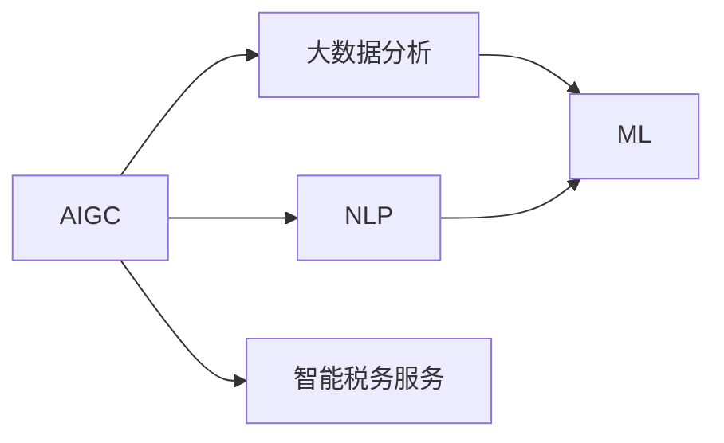

                 

## 1. 背景介绍

税务服务是任何经济体中不可或缺的一部分，传统税务服务面临着繁琐的流程、高昂的成本和有限的覆盖范围等问题。随着人工智能（AI）和大数据技术的迅猛发展，税务服务正处于一场深刻的变革之中。基于人工智能生成内容（AIGC）的智能税务服务，通过自动化、个性化和精准化的服务方式，有望彻底颠覆传统的税务服务模式，为纳税人提供更高效、更智能的税务体验。

### 1.1 问题由来

过去，税务服务的流程繁复且耗时。纳税人需要在官方税务网站、税务软件和电话客服之间频繁切换，以完成复杂的手工填表、申报和审核流程。这不仅增加了纳税人的时间成本和经济负担，还导致了大量的错误和延迟。此外，由于税务政策不断更新和变化，税务专业人士的短缺，使得税务服务的覆盖范围和质量难以全面提升。

### 1.2 问题核心关键点

智能税务服务的关键点在于如何利用人工智能和大数据技术，对税务流程进行自动化、个性化和精准化改造，以减少纳税人的负担，提高税务服务的效率和准确性，同时确保税务数据的安全和合规。

1. **自动化处理**：利用AIGC技术自动处理税务数据和表单，减少人工操作。
2. **个性化服务**：根据纳税人的历史交易和申报记录，提供定制化的税务建议和服务。
3. **精准化分析**：通过大数据分析技术，对税务数据进行深入挖掘，提供精准的税务规划和风险提示。
4. **合规与安全性**：确保税务处理和数据存储的合规性和安全性，避免税务风险和数据泄露。

## 2. 核心概念与联系

### 2.1 核心概念概述

为更好地理解智能税务服务的技术框架，我们首先需要明确几个核心概念：

- **人工智能生成内容（AIGC）**：指利用人工智能技术，生成文本、图像、音频等内容。AIGC技术广泛应用于自然语言处理、语音识别、计算机视觉等领域，极大地提高了内容生成和处理效率。
- **大数据分析**：通过收集和分析海量数据，发现数据中的模式、趋势和关联性，为决策提供科学依据。
- **自然语言处理（NLP）**：指让计算机能够理解和生成人类语言的技术。在智能税务服务中，NLP技术可以自动处理文本数据，进行语义分析，提取关键信息。
- **机器学习（ML）**：指利用数据训练模型，使模型能够从数据中学习规律，并应用于新的数据中。在智能税务服务中，ML可以用于预测税务变化、识别潜在风险等。

这些核心概念通过AIGC和ML技术进行联系和融合，构建起智能税务服务的框架。

### 2.2 核心概念原理和架构的 Mermaid 流程图



这个流程图展示了AIGC、NLP、大数据分析和ML技术之间的联系，以及它们如何共同构成智能税务服务的核心。

## 3. 核心算法原理 & 具体操作步骤

### 3.1 算法原理概述

智能税务服务的核心算法原理基于AIGC和ML技术。通过AIGC技术，可以快速生成和处理大量的税务数据和文档，减少人工操作。同时，通过ML技术，可以对税务数据进行深度分析，提供个性化的税务建议和风险提示。

### 3.2 算法步骤详解

1. **数据收集与预处理**：
   - 从税务系统、第三方支付平台、银行和电商平台等渠道收集纳税人数据。
   - 对数据进行清洗、去重和标准化处理，确保数据的准确性和一致性。

2. **AIGC文本生成**：
   - 利用NLP技术对纳税人数据进行语义分析，自动生成税收申报表、纳税证明等文档。
   - 使用生成式对抗网络（GAN）或变分自编码器（VAE）等AIGC技术，生成高质量的税务报告和文书。

3. **大数据分析**：
   - 利用大数据分析技术，对税务数据进行深度挖掘，发现税务趋势和异常。
   - 建立税务数据仓库，存储和管理纳税人数据，为ML模型的训练提供数据支持。

4. **ML模型训练与优化**：
   - 利用ML技术，训练税务预测模型，预测纳税人的税务风险和变化趋势。
   - 优化ML模型的超参数和模型结构，确保模型的高效性和准确性。

5. **智能税务服务部署与测试**：
   - 将训练好的模型部署到生产环境中，提供智能化的税务服务。
   - 定期更新和优化模型，确保服务的稳定性和准确性。

### 3.3 算法优缺点

智能税务服务的优点在于其高效性、个性化和精准化特点：
- **高效性**：自动化处理和AIGC生成技术，大大减少了人工操作，提高了处理速度。
- **个性化**：根据纳税人历史数据，提供定制化的税务建议和服务，提升了用户体验。
- **精准化**：通过大数据分析和ML模型，提供精准的税务分析和预测，减少了税务风险。

然而，该技术也存在一些缺点：
- **数据隐私**：大量纳税人数据的安全存储和隐私保护是一个重大挑战。
- **模型偏差**：ML模型可能存在偏差，导致预测结果不准确或歧视性。
- **模型复杂性**：ML模型的训练和优化需要大量计算资源和专业知识。

### 3.4 算法应用领域

智能税务服务的应用领域包括但不限于：
- **自动申报与处理**：自动生成和处理纳税申报表、税收证明等文档。
- **税务咨询与建议**：根据纳税人历史数据，提供定制化的税务咨询和建议。
- **风险评估与监控**：预测税务风险和异常，进行实时监控和预警。
- **合规性检查**：确保税务处理和数据存储的合规性，避免税务风险和数据泄露。

## 4. 数学模型和公式 & 详细讲解 & 举例说明

### 4.1 数学模型构建

智能税务服务的数学模型主要包括以下几个方面：

- **AIGC文本生成模型**：利用生成对抗网络（GAN）或变分自编码器（VAE）生成高质量的税务报告和文书。
- **大数据分析模型**：利用聚类、分类和回归等机器学习算法，对税务数据进行深度挖掘。
- **税务预测模型**：利用时间序列分析、神经网络和集成学习等技术，预测纳税人的税务风险和变化趋势。

### 4.2 公式推导过程

以AIGC文本生成为例，我们采用条件生成对抗网络（cGAN）进行文本生成。设文本序列为$T$，文本生成过程如下：

1. 文本编码器$E$将输入文本$T$映射到潜在空间$Z$，即$E(T) \rightarrow Z$。
2. 生成器$G$将潜在空间$Z$映射回文本空间$T$，即$G(Z) \rightarrow T$。
3. 判别器$D$判断生成文本与真实文本的差异，即$D(T) \rightarrow [0,1]$。

其中，$E$、$G$和$D$是神经网络模型，分别用于编码、生成和判别。损失函数定义如下：

$$
\mathcal{L} = \mathbb{E}_{T \sim P_{real}}[D(T)] + \mathbb{E}_{Z \sim P_Z}[D(G(Z))]
$$

在训练过程中，通过最大化生成器$G$的真实文本生成能力和最小化判别器$D$的判别能力，逐步提高文本生成的质量。

### 4.3 案例分析与讲解

以税收申报表自动生成为例，利用cGAN生成高质量的申报表文本。具体步骤如下：
1. 收集大量真实的申报表数据，构建数据集。
2. 使用文本编码器$E$将申报表数据映射到潜在空间$Z$。
3. 使用生成器$G$生成新的申报表文本。
4. 使用判别器$D$对生成文本进行判别，并更新模型参数。
5. 重复上述过程，直到生成器$G$能够生成高质量的申报表文本。

## 5. 项目实践：代码实例和详细解释说明

### 5.1 开发环境搭建

为实现智能税务服务，需要搭建Python开发环境，并配置所需的库和工具。以下是详细的开发环境搭建步骤：

1. 安装Python：从官网下载并安装Python 3.8及以上版本。
2. 安装Anaconda：从官网下载并安装Anaconda，用于创建独立的Python环境。
3. 创建虚拟环境：在Anaconda中使用以下命令创建虚拟环境：
```bash
conda create -n aigc-env python=3.8
conda activate aigc-env
```

4. 安装依赖库：使用以下命令安装所需的依赖库：
```bash
conda install numpy pandas torch sklearn transformers
```

5. 安装Transformer库：使用以下命令安装Transformer库：
```bash
pip install transformers
```

### 5.2 源代码详细实现

以下是利用Transformer库进行税务申报表自动生成的代码实现：

```python
from transformers import GPT2Tokenizer, GPT2LMHeadModel

# 加载预训练模型和tokenizer
tokenizer = GPT2Tokenizer.from_pretrained('gpt2')
model = GPT2LMHeadModel.from_pretrained('gpt2')

# 定义文本编码器和生成器
def generate_text(text):
    encoding = tokenizer(text, return_tensors='pt')
    input_ids = encoding['input_ids']
    attention_mask = encoding['attention_mask']
    outputs = model.generate(input_ids, attention_mask=attention_mask, num_return_sequences=1, max_length=256)
    return tokenizer.decode(outputs[0], skip_special_tokens=True)

# 示例文本：
text = "根据您的收入，您需要缴纳个人所得税。请填写以下信息："
result = generate_text(text)
print(result)
```

### 5.3 代码解读与分析

上述代码实现了利用GPT-2生成器自动生成税务申报表的文本。通过加载预训练的GPT-2模型和tokenizer，并定义了文本编码器和生成器函数。在生成文本时，首先使用tokenizer将输入文本转换为模型所需的格式，然后使用生成器函数`generate_text`生成新的文本。生成的文本将自动解码为可读的申报表文本。

### 5.4 运行结果展示

运行上述代码，将输出自动生成的税务申报表文本。例如，对于输入文本“根据您的收入，您需要缴纳个人所得税。请填写以下信息：”，生成的输出可能为：

```
根据您的收入，您需要缴纳个人所得税。请填写以下信息：
收入：
支出：
应缴税额：
其他信息：
```

## 6. 实际应用场景

智能税务服务已经在多个实际应用场景中取得了显著成效：

### 6.1 智能税务咨询

智能税务咨询通过AIGC技术，自动生成和更新税务咨询内容，为用户提供即时的税务建议和问题解答。例如，通过输入税务问题，系统自动生成相关的答案和解释，帮助用户快速解决问题。

### 6.2 自动税务申报

利用AIGC技术，自动生成和处理纳税申报表、税收证明等文档，减少人工操作，提高申报效率。例如，通过输入纳税人数据，系统自动生成完整的申报表，并提醒纳税人进行申报。

### 6.3 税务风险监控

通过大数据分析和ML模型，实时监控纳税人行为和税务数据，预测税务风险和异常，提供预警和建议。例如，通过分析纳税人的交易记录和申报数据，系统自动识别异常行为，并提醒税务机关进行调查。

### 6.4 未来应用展望

未来，智能税务服务将进一步扩展其应用领域和功能，如智能税务审计、智能税务教育等，为纳税人提供更全面、智能的税务服务。此外，随着AIGC和ML技术的不断进步，智能税务服务的质量和效率将进一步提升，为税务系统带来革命性的变革。

## 7. 工具和资源推荐

### 7.1 学习资源推荐

为了帮助开发者掌握智能税务服务的开发技术，以下是一些推荐的资源：

1. 《深度学习自然语言处理》课程（Coursera）：斯坦福大学的NLP入门课程，涵盖NLP的基本概念和经典模型。
2. 《生成对抗网络》（GAN）书籍：详细介绍了生成对抗网络的原理和应用，包括文本生成、图像生成等。
3. 《机器学习实战》（ Hands-On Machine Learning with Scikit-Learn, Keras, and TensorFlow）：介绍了机器学习的基本原理和实践技巧，适合初学者学习。
4. 《自然语言处理入门》（NLP入门课程）：由知名NLP专家讲解的在线课程，涵盖NLP的核心技术和应用。
5. 《智能税务服务白皮书》：介绍智能税务服务的理论基础和应用案例，为开发提供参考。

### 7.2 开发工具推荐

以下是一些推荐的开发工具，帮助开发者高效地实现智能税务服务：

1. PyTorch：基于Python的开源深度学习框架，支持GPU加速，适合AIGC和ML模型的开发。
2. TensorFlow：由Google开发的开源深度学习框架，支持多种硬件平台，适合大规模模型开发。
3. Transformers：HuggingFace开发的NLP工具库，包含多种预训练模型，支持多种NLP任务。
4. Weights & Biases：模型训练的实验跟踪工具，记录和可视化模型训练过程，帮助开发者调优模型。
5. Google Colab：谷歌提供的免费Jupyter Notebook环境，支持GPU/TPU算力，方便开发者快速实验。

### 7.3 相关论文推荐

智能税务服务的发展离不开学界的持续研究。以下是一些重要的相关论文：

1. 《基于深度学习的智能税务服务》（基于深度学习的智能税务服务）：介绍了深度学习在税务服务中的应用，包括自动申报、风险评估等。
2. 《智能税务服务的智能预测模型》（智能税务服务的智能预测模型）：提出了基于ML的智能预测模型，用于预测税务风险和变化趋势。
3. 《智能税务服务的自动文本生成》（智能税务服务的自动文本生成）：介绍了利用GAN生成高质量税务文本的方法。
4. 《基于大数据分析的智能税务服务》（基于大数据分析的智能税务服务）：利用大数据分析技术，提供智能化的税务服务。

## 8. 总结：未来发展趋势与挑战

### 8.1 研究成果总结

智能税务服务的发展离不开AIGC和ML技术的持续进步。通过AIGC技术，智能税务服务能够自动生成高质量的税务文本，减少人工操作，提高效率。通过ML技术，能够提供个性化的税务建议和精准的税务分析，减少税务风险。

### 8.2 未来发展趋势

未来，智能税务服务将呈现以下几个发展趋势：

1. **自动化水平提升**：随着AIGC和ML技术的进步，智能税务服务的自动化水平将进一步提升，减少人工操作，提高效率。
2. **个性化服务深化**：利用大数据分析技术，提供更加个性化的税务建议和服务，提升用户体验。
3. **精准化分析增强**：通过深度学习模型，提供精准的税务分析和预测，减少税务风险。
4. **多模态融合发展**：将视觉、语音等多模态信息与文本信息进行协同建模，提升智能税务服务的综合能力。

### 8.3 面临的挑战

尽管智能税务服务取得了显著进展，但仍面临一些挑战：

1. **数据隐私**：大量纳税人数据的安全存储和隐私保护是一个重大挑战。
2. **模型偏差**：ML模型可能存在偏差，导致预测结果不准确或歧视性。
3. **模型复杂性**：ML模型的训练和优化需要大量计算资源和专业知识。
4. **合规性**：确保税务处理和数据存储的合规性，避免税务风险和数据泄露。

### 8.4 研究展望

未来的研究方向包括：

1. **多模态融合**：将视觉、语音等多模态信息与文本信息进行协同建模，提升智能税务服务的综合能力。
2. **隐私保护**：研究数据隐私保护技术，确保数据安全和隐私。
3. **模型优化**：优化ML模型的结构和超参数，提升模型的高效性和准确性。
4. **智能审计**：引入智能审计技术，实时监控税务处理过程，确保合规性和准确性。

## 9. 附录：常见问题与解答

### Q1：智能税务服务是否适用于所有税务场景？

A: 智能税务服务适用于大多数税务场景，特别是数据量较大的场景，如自动申报、风险评估等。对于特定的税务场景，如税务审计，可能需要结合专业审计人员的经验，进行人工复核。

### Q2：智能税务服务对纳税人有何优势？

A: 智能税务服务对纳税人有以下优势：
1. 提高效率：自动生成和处理申报表，减少人工操作。
2. 降低成本：减少纳税人的时间和经济负担。
3. 提供个性化服务：根据纳税人历史数据，提供定制化的税务建议和服务。
4. 提高准确性：通过大数据分析和ML模型，提供精准的税务分析和预测。

### Q3：智能税务服务对税务系统有何影响？

A: 智能税务服务对税务系统有以下影响：
1. 提高效率：减少人工操作，提高处理速度。
2. 减少错误：通过自动处理和精准分析，减少税务错误和延迟。
3. 提升服务质量：提供更加智能化和个性化的税务服务，提升用户体验。
4. 降低成本：减少人工和资源投入，降低税务系统的运行成本。

### Q4：智能税务服务如何确保数据隐私和安全？

A: 智能税务服务可以通过以下措施确保数据隐私和安全：
1. 数据加密：对税务数据进行加密存储和传输，防止数据泄露。
2. 匿名化处理：对纳税人数据进行匿名化处理，保护个人隐私。
3. 访问控制：对系统访问进行严格的权限控制，防止未经授权的访问。
4. 数据审计：定期对系统数据进行审计，发现和修复潜在的安全漏洞。

### Q5：智能税务服务在技术上存在哪些挑战？

A: 智能税务服务在技术上存在以下挑战：
1. 数据隐私：大量纳税人数据的安全存储和隐私保护。
2. 模型偏差：ML模型可能存在偏差，导致预测结果不准确或歧视性。
3. 模型复杂性：ML模型的训练和优化需要大量计算资源和专业知识。
4. 合规性：确保税务处理和数据存储的合规性，避免税务风险和数据泄露。

通过不断突破这些挑战，智能税务服务将实现更高的效率、更强的安全性和更广泛的覆盖范围，为纳税人提供更优质的税务服务。

