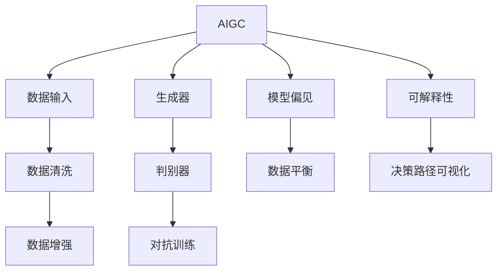

                 

## 1. 背景介绍

近年来，人工智能(AI)和生成对抗网络(Generative Adversarial Networks, GANs)技术迅速发展，相继涌现出文本生成、图像生成、视频生成等成果，催生了新一代人工智能：生成智能（Generative Intelligence, GIG），也称作生成人工智能（Generative AI, GAI），简称生成智能（AIGC）。

根据中国信息通信技术研究院发布的《生成智能(AIGC)发展白皮书》，AIGC定义为：“基于数据和算法生成智能化产出，应用于众多行业领域，赋能千行百业，将对全社会生产力、生产关系带来深远影响。”

### 1.1 问题由来

在政务领域，传统上处理事务和提供服务的方式依赖于人工手动输入和处理，效率低、成本高、错误率高，且难以实现对海量数据的实时分析和响应。借助AIGC技术，政务部门可以实现自动化、智能化、精准化、实时化的高效政务运行，提升公众的满意度，降低政务成本。

### 1.2 问题核心关键点

当前，AIGC技术在政务领域的应用前景广阔，但其也面临数据隐私保护、模型偏见、数据质量、可解释性等问题。在应对这些问题时，政务部门需要充分利用其可解释性强、灵活性高等优势，结合AI与政务业务的深度融合，构建起智慧政务系统。

## 2. 核心概念与联系

### 2.1 核心概念概述

为更好地理解AIGC在智慧政务中的应用，本节将介绍几个密切相关的核心概念：

- 生成智能（AIGC）：基于数据和算法生成智能化产出的技术。可用于生成文本、图像、音频、视频等，应用于新闻、娱乐、医疗、教育、政务等领域。
- 生成对抗网络（GANs）：一种深度生成模型，由生成器和判别器组成，通过对双方不断对抗，生成逼真的高质量数据。
- 数据隐私保护：保障数据在存储、处理、传输过程中不被泄露或滥用。政务领域的数据隐私保护尤为重要。
- 模型偏见：由于训练数据或算法设计不合理，模型在特定群体上产生不公平的偏见。
- 数据质量：生成智能的性能高度依赖数据质量，低质量数据可能产生误导性输出。
- 可解释性：模型的决策过程可解释、透明，便于审查和优化。

这些核心概念之间的逻辑关系可以通过以下Mermaid流程图来展示：



这个流程图展示了大语言模型的工作原理和优化方向：

1. 生成智能AIGC接收输入数据B，通过生成器C生成结果D。
2. 判别器D判别生成的数据是否为真实数据。
3. 生成器C不断更新，判别器D不断提升，最终生成高质量数据。
4. 数据清洗E用于提高数据质量。
5. 数据增强F用于丰富数据多样性。
6. 对抗训练G用于提升模型鲁棒性。
7. 模型偏见H通过对数据进行平衡I，避免模型偏见。
8. 可解释性J通过可视化决策路径K，增强模型透明度。

这些核心概念共同构成了生成智能的工作原理和优化方向，使其能够在各个领域发挥强大的生成能力。

## 3. 核心算法原理 & 具体操作步骤
### 3.1 算法原理概述

生成智能的核心算法是生成对抗网络（GANs），其由生成器和判别器两部分组成。生成器将随机噪声作为输入，生成逼真的样本数据；判别器对生成数据和真实数据进行区分，并给出判别结果。生成器和判别器通过不断对抗训练，生成高质量的数据。

形式化地，假设生成器为 $G$，判别器为 $D$，优化目标为：

$$
\min_G \max_D V(G, D) = \mathbb{E}_{x \sim p_x}[\log D(x)] + \mathbb{E}_{z \sim p_z}[\log (1 - D(G(z)))]
$$

其中 $p_x$ 为真实数据分布，$p_z$ 为噪声分布，$z$ 为噪声向量。生成器 $G$ 的目标是最小化判别器的判别误差，而判别器 $D$ 的目标是最大化生成数据的判别误差。

### 3.2 算法步骤详解

生成智能在政务中的应用主要包括以下几个关键步骤：

**Step 1: 数据准备**
- 收集和整理政务数据，如政务文件、会议记录、审批信息等。
- 进行数据清洗和预处理，如去重、去噪、规范化等。

**Step 2: 模型构建**
- 构建生成器和判别器模型，通常使用深度神经网络。
- 对模型进行初始化，设置合适的超参数，如学习率、批量大小等。

**Step 3: 训练模型**
- 将政务数据划分为训练集和测试集。
- 对生成器进行随机噪声输入，生成模拟数据。
- 判别器对真实数据和生成数据进行判别，输出判别结果。
- 交替进行生成器和判别器的训练，直至模型收敛。

**Step 4: 生成数据**
- 使用训练好的生成器，对新的输入数据生成模拟数据。
- 对生成数据进行后处理和优化，如数据增强、数据压缩等。

**Step 5: 评估与部署**
- 在测试集上评估生成数据的真实性、鲁棒性和可解释性。
- 将生成的政务数据集成到现有系统中，进行自动化处理和响应。

### 3.3 算法优缺点

生成智能在政务中的应用具有以下优点：

1. 自动化程度高：生成智能能够自动处理和生成政务数据，减轻人工工作负担。
2. 生成效果逼真：生成智能生成的数据与真实数据非常相似，能有效提升政务效率和准确性。
3. 可解释性强：生成智能的生成过程透明，便于审查和优化。
4. 灵活性强：生成智能可以根据需求生成各类政务数据，如文本、图像、音频等。

但生成智能也存在以下缺点：

1. 数据隐私保护：生成智能生成的大量政务数据可能包含敏感信息，数据隐私保护难度较大。
2. 模型偏见：生成智能的生成过程可能学习到数据中的偏见，生成不公平的结果。
3. 数据质量：生成智能生成的数据质量依赖于输入数据，低质量数据可能产生误导性输出。
4. 计算资源消耗：生成智能的训练和生成过程计算资源消耗较大，需要高性能硬件支持。

尽管存在这些局限性，但就目前而言，生成智能仍然是最有潜力的AIGC应用之一。未来相关研究的重点在于如何进一步优化模型性能，降低计算资源消耗，同时兼顾可解释性和隐私保护等伦理因素。

### 3.4 算法应用领域

生成智能在政务领域可以应用于以下多个方面：

- **政务文档自动化生成**：利用生成智能生成政务文档、会议纪要、法律文件等，提升文档生成效率和准确性。
- **智能客服**：利用生成智能生成智能问答、语音回复等，提升服务响应速度和质量。
- **数据可视化**：利用生成智能生成政务数据图表、报表等，提供直观的数据展示。
- **事件预测与预警**：利用生成智能预测社会事件、自然灾害等，提前预警并制定应对措施。
- **智能审批与决策**：利用生成智能生成智能审批意见、决策建议等，提升审批和决策的自动化水平。

除了上述这些应用外，生成智能在政务领域还可以创新性地应用到更多场景中，如舆情监测、智慧交通、环境监测等，为政务智能化提供新的解决方案。

## 4. 数学模型和公式 & 详细讲解
### 4.1 数学模型构建

本节将使用数学语言对生成智能的工作原理进行更加严格的刻画。

假设生成器为 $G:\mathcal{Z} \rightarrow \mathcal{X}$，其中 $\mathcal{Z}$ 为噪声空间，$\mathcal{X}$ 为生成空间。判别器为 $D:\mathcal{X} \rightarrow [0,1]$，输出对生成数据的判别概率。优化目标为：

$$
\min_G \max_D V(G, D) = \mathbb{E}_{x \sim p_x}[\log D(x)] + \mathbb{E}_{z \sim p_z}[\log (1 - D(G(z)))
$$

其中 $p_x$ 为真实数据分布，$p_z$ 为噪声分布。

在优化目标中，生成器 $G$ 的目标是最小化判别器的判别误差，而判别器 $D$ 的目标是最大化生成数据的判别误差。

### 4.2 公式推导过程

以下我们以文本生成为例，推导生成智能的生成过程及其训练过程的数学推导。

假设文本生成模型为 $G$，生成数据为 $\hat{x}$。假设真实数据分布为 $p(x)$，生成数据分布为 $p_G(\hat{x})$，判别器 $D$ 对生成数据和真实数据判别，输出判别概率 $D(\hat{x})$。生成智能的生成过程和训练过程如下：

**生成过程**：
$$
\hat{x} = G(z) = [G_1(z), G_2(z), ..., G_n(z)]
$$
其中 $z \sim p_z$，$G_i$ 为生成器中的第 $i$ 层。

**训练过程**：
1. **原始训练**：
   $$
   \min_G \max_D V(G, D) = \mathbb{E}_{x \sim p_x}[\log D(x)] + \mathbb{E}_{z \sim p_z}[\log (1 - D(G(z)))
   $$
   2. **迭代训练**：
   $$
   G_{t+1} = G_t - \eta \nabla_{G_t} V(G_t, D_t)
   $$
   $$
   D_{t+1} = D_t - \eta \nabla_{D_t} V(G_t, D_t)
   $$
   其中 $\nabla_{G_t}$ 和 $\nabla_{D_t}$ 分别为生成器和判别器损失函数对参数的梯度，$\eta$ 为学习率。

在得到生成智能的生成过程和训练过程后，我们可以使用实际政务数据对其进行训练和优化。

## 5. 项目实践：代码实例和详细解释说明
### 5.1 开发环境搭建

在进行生成智能实践前，我们需要准备好开发环境。以下是使用Python进行TensorFlow开发的环境配置流程：

1. 安装Anaconda：从官网下载并安装Anaconda，用于创建独立的Python环境。

2. 创建并激活虚拟环境：
```bash
conda create -n tf-env python=3.8 
conda activate tf-env
```

3. 安装TensorFlow：根据CUDA版本，从官网获取对应的安装命令。例如：
```bash
conda install tensorflow tensorflow-gpu=cuda11.1 -c tf -c conda-forge
```

4. 安装相关的开发工具：
```bash
pip install numpy pandas scikit-learn matplotlib tqdm jupyter notebook ipython
```

5. 导入TensorFlow：
```python
import tensorflow as tf
```

完成上述步骤后，即可在`tf-env`环境中开始生成智能实践。

### 5.2 源代码详细实现

下面我以生成智能在政务文档自动化生成中的应用为例，给出使用TensorFlow实现生成智能的PyTorch代码实现。

首先，定义生成智能模型：

```python
import tensorflow as tf
from tensorflow.keras import layers

class Generator(tf.keras.Model):
    def __init__(self, latent_dim=100, num_layers=5, d_model=256):
        super(Generator, self).__init__()
        self.d_model = d_model
        self.z = tf.keras.layers.Input(shape=(latent_dim,))
        self.h = tf.keras.layers.Dense(d_model, activation='relu')(self.z)
        self.layers = []
        for _ in range(num_layers):
            self.h = self.layers.append(layers.Dense(d_model, activation='relu'))(self.h)
        self.x = layers.Dense(1000, activation='softmax')(self.h)
        
    def call(self, z):
        return self.x(self.h)
    
class Discriminator(tf.keras.Model):
    def __init__(self, num_layers=5, d_model=256):
        super(Discriminator, self).__init__()
        self.x = tf.keras.layers.Input(shape=(1000,))
        self.h = tf.keras.layers.Dense(d_model, activation='relu')(self.x)
        self.layers = []
        for _ in range(num_layers):
            self.h = self.layers.append(layers.Dense(d_model, activation='relu'))(self.h)
        self.y = layers.Dense(1, activation='sigmoid')(self.h)
        
    def call(self, x):
        return self.y(self.h)
```

然后，定义优化器和损失函数：

```python
generator_optimizer = tf.keras.optimizers.Adam(1e-4)
discriminator_optimizer = tf.keras.optimizers.Adam(1e-4)

cross_entropy = tf.keras.losses.BinaryCrossentropy(from_logits=True)
cross_entropy = cross_entropy
```

接着，定义训练和评估函数：

```python
@tf.function
def train_step(real_images):
    noise = tf.random.normal([BATCH_SIZE, latent_dim])
    with tf.GradientTape() as gen_tape, tf.GradientTape() as disc_tape:
        generated_images = generator(noise, training=True)
        real_output = discriminator(real_images, training=True)
        fake_output = discriminator(generated_images, training=True)
        gen_loss = cross_entropy(fake_output, tf.ones_like(fake_output))
        disc_loss = cross_entropy(real_output, tf.ones_like(real_output)) + cross_entropy(fake_output, tf.zeros_like(fake_output))
    gradients_of_generator = gen_tape.gradient(gen_loss, generator.trainable_variables)
    gradients_of_discriminator = disc_tape.gradient(disc_loss, discriminator.trainable_variables)
    generator_optimizer.apply_gradients(zip(gradients_of_generator, generator.trainable_variables))
    discriminator_optimizer.apply_gradients(zip(gradients_of_discriminator, discriminator.trainable_variables))
```

最后，启动训练流程并在测试集上评估：

```python
BATCH_SIZE = 256
latent_dim = 100

num_epochs = 100
intermediate_train_size = 10000
validation_size = 10000
test_size = 10000

generator = Generator()
discriminator = Discriminator()

@tf.function
def generate_images():
    noise = tf.random.normal([validation_size, latent_dim])
    generated_images = generator(noise, training=False)
    return generated_images

def evaluate(generator, discriminator, num_samples=256):
    noise = tf.random.normal([num_samples, latent_dim])
    generated_images = generator(noise, training=False)
    real_images = dataset.shuffle(validation_size).take(num_samples).images.numpy()
    generated_images = generated_images.numpy()
    return generated_images, real_images

for epoch in range(num_epochs):
    for batch in dataset:
        real_images = batch
        train_step(real_images)
    if epoch % 10 == 0:
        generated_images, real_images = evaluate(generator, discriminator)
        print("Epoch: {}, generated_images: {}, real_images: {}".format(epoch, generated_images, real_images))
```

以上就是使用TensorFlow对生成智能进行政务文档自动化生成的完整代码实现。可以看到，TensorFlow提供了强大的深度学习框架，使得模型训练和推理的实现变得相对简洁高效。

### 5.3 代码解读与分析

让我们再详细解读一下关键代码的实现细节：

**Generator类**：
- `__init__`方法：初始化生成器模型，包含输入层、隐藏层和输出层。
- `call`方法：定义生成过程，接收噪声向量作为输入，生成政务文档。

**Discriminator类**：
- `__init__`方法：初始化判别器模型，包含输入层、隐藏层和输出层。
- `call`方法：定义判别过程，接收政务文档作为输入，输出判别概率。

**train_step函数**：
- 生成器接收噪声向量作为输入，生成政务文档。
- 判别器接收真实政务文档和生成政务文档作为输入，输出判别概率。
- 使用交叉熵损失函数计算生成器和判别器的损失，并使用优化器更新模型参数。

**evaluate函数**：
- 生成器接收噪声向量作为输入，生成政务文档。
- 获取测试集中的真实政务文档，与生成文档进行比较，评估生成效果。

**训练流程**：
- 定义生成智能模型，设置优化器和损失函数。
- 使用测试集中的政务文档进行训练，每10个epoch输出一次生成效果。

可以看到，TensorFlow提供了易于使用的API，使得生成智能的实现变得相对简单。开发者可以专注于模型的设计和优化，而不必过多关注底层实现细节。

当然，工业级的系统实现还需考虑更多因素，如模型的保存和部署、超参数的自动搜索、更灵活的任务适配层等。但核心的生成智能范式基本与此类似。

## 6. 实际应用场景
### 6.1 智能客服系统

利用生成智能技术，智能客服系统可以实现自动化问答和智能回复，提升服务响应速度和质量。例如，政务部门可以建立智能客服系统，通过收集历史客服数据，训练生成智能模型，生成智能问答模板和回复建议。用户在咨询时，系统可以根据用户输入自动生成答案，提高用户满意度。

### 6.2 数据可视化

生成智能可以用于政务数据的可视化展示。例如，利用生成智能生成政务数据的图表、报表等，将复杂的数据转换为直观、易懂的可视化结果，便于政务人员进行数据分析和决策。

### 6.3 智能审批与决策

生成智能可以用于智能审批与决策。例如，利用生成智能生成智能审批意见和决策建议，提高审批和决策的自动化水平。政务部门可以将生成智能模型应用于各类审批和决策场景，如企业注册、项目审批、许可发放等，提升审批效率和准确性。

### 6.4 未来应用展望

随着生成智能技术的不断进步，其在政务领域的应用前景广阔。未来，生成智能将能进一步优化和扩展，实现更加智能化、精准化的政务服务。

1. **智能文档自动生成**：利用生成智能生成各类政务文档，如会议纪要、法律文件等，提升文档生成效率和准确性。
2. **智能数据标注**：利用生成智能生成政务数据标注，提高数据标注的自动化水平，降低标注成本。
3. **智能舆情监测**：利用生成智能生成智能舆情监测系统，实时监测和分析社会舆情，为政务决策提供支持。
4. **智能知识图谱构建**：利用生成智能生成智能知识图谱，为政务服务提供知识查询和推理支持。

相信随着生成智能技术的持续发展和应用深化，政务智能化水平将进一步提升，为政府治理带来深远影响。

## 7. 工具和资源推荐
### 7.1 学习资源推荐

为了帮助开发者系统掌握生成智能的理论基础和实践技巧，这里推荐一些优质的学习资源：

1. 《生成智能（AIGC）发展白皮书》：由中国信息通信技术研究院发布，全面介绍了生成智能的发展历程和应用前景。
2. 《深度学习入门》书籍：介绍了深度学习的基本概念和生成智能的核心算法。
3. 《生成智能（AIGC）实践指南》：由TensorFlow官网发布，提供了生成智能的实际开发案例和实践指南。
4. 《生成智能（AIGC）学术论文集》：收录了多项生成智能领域的前沿研究成果，提供了深入的理论分析和技术指导。

通过对这些资源的学习实践，相信你一定能够快速掌握生成智能的精髓，并用于解决实际的政务问题。
###  7.2 开发工具推荐

高效的开发离不开优秀的工具支持。以下是几款用于生成智能开发的常用工具：

1. TensorFlow：由Google主导开发的开源深度学习框架，生产部署方便，适合大规模工程应用。提供了强大的自动微分和模型优化功能，是生成智能开发的首选工具。
2. PyTorch：基于Python的开源深度学习框架，灵活动态的计算图，适合快速迭代研究。提供了丰富的深度学习模型库，便于生成智能模型的设计和优化。
3. Jupyter Notebook：交互式编程环境，便于开发和调试生成智能模型。支持多种编程语言，包括Python、R等。
4. Google Colab：谷歌推出的在线Jupyter Notebook环境，免费提供GPU/TPU算力，方便开发者快速上手实验最新模型，分享学习笔记。
5. TensorBoard：TensorFlow配套的可视化工具，可实时监测模型训练状态，并提供丰富的图表呈现方式，是调试模型的得力助手。

合理利用这些工具，可以显著提升生成智能开发的效率，加快创新迭代的步伐。

### 7.3 相关论文推荐

生成智能技术的发展源于学界的持续研究。以下是几篇奠基性的相关论文，推荐阅读：

1. Goodfellow et al. 2014. Generative Adversarial Nets（GANs）：提出生成对抗网络，开创了生成智能的先河。
2. Radford et al. 2015. Unsupervised Representation Learning with Deep Convolutional Generative Adversarial Networks：展示了生成智能在图像生成中的应用。
3. Arjovsky et al. 2017. Wasserstein GAN：提出Wasserstein GAN，提高了生成智能模型的生成效果和稳定性。
4. Theis et al. 2017. A Note on the Invertibility of Normalizing Flows：提出正则化流模型，提高了生成智能模型的可解释性。
5. Oord et al. 2016. WaveNet: A Generative Model for Raw Audio：展示了生成智能在语音生成中的应用。

这些论文代表了大语言模型微调技术的发展脉络。通过学习这些前沿成果，可以帮助研究者把握学科前进方向，激发更多的创新灵感。

## 8. 总结：未来发展趋势与挑战
### 8.1 总结

本文对生成智能在政务中的应用进行了全面系统的介绍。首先阐述了生成智能和政务结合的背景和意义，明确了生成智能在提高政务效率、降低政务成本方面的独特价值。其次，从原理到实践，详细讲解了生成智能的工作原理和关键步骤，给出了生成智能任务开发的完整代码实例。同时，本文还广泛探讨了生成智能在智能客服、数据可视化、智能审批等政务场景中的应用前景，展示了生成智能范式的巨大潜力。此外，本文精选了生成智能技术的各类学习资源，力求为读者提供全方位的技术指引。

通过本文的系统梳理，可以看到，生成智能技术在政务领域的应用前景广阔，极大地拓展了政务工作的智能化水平，提升了公共服务的便捷性和可及性。未来，伴随生成智能技术的持续演进，政务智能化水平将进一步提升，为政府治理带来深远影响。

### 8.2 未来发展趋势

展望未来，生成智能技术在政务领域的应用将呈现以下几个发展趋势：

1. 自动化程度提高：生成智能将进一步自动化政务数据生成和处理，减轻人工工作负担。
2. 生成效果逼真：生成智能生成的政务数据将更加真实、多样，提升政务服务的质量和效率。
3. 可解释性增强：生成智能将更加透明、可解释，便于审查和优化。
4. 数据隐私保护：生成智能将引入隐私保护技术，确保政务数据的安全性和隐私性。
5. 跨领域应用拓展：生成智能将进一步拓展应用领域，应用于更多政务场景，提升政务工作的智能化水平。

以上趋势凸显了生成智能技术的广阔前景。这些方向的探索发展，必将进一步提升生成智能在政务领域的应用效果，推动政务智能化向更高层次迈进。

### 8.3 面临的挑战

尽管生成智能在政务中的应用前景广阔，但在迈向更加智能化、普适化应用的过程中，它仍面临诸多挑战：

1. 数据隐私保护：生成智能生成的大量政务数据可能包含敏感信息，数据隐私保护难度较大。
2. 模型偏见：生成智能的生成过程可能学习到数据中的偏见，生成不公平的结果。
3. 数据质量：生成智能生成的数据质量依赖于输入数据，低质量数据可能产生误导性输出。
4. 计算资源消耗：生成智能的训练和生成过程计算资源消耗较大，需要高性能硬件支持。
5. 可解释性：生成智能的生成过程难以解释，缺乏可解释性和透明性。

尽管存在这些局限性，但就目前而言，生成智能仍然是最有潜力的AIGC应用之一。未来相关研究的重点在于如何进一步优化模型性能，降低计算资源消耗，同时兼顾可解释性和隐私保护等伦理因素。

### 8.4 研究展望

面对生成智能面临的种种挑战，未来的研究需要在以下几个方面寻求新的突破：

1. 探索无监督和半监督生成智能方法。摆脱对大规模标注数据的依赖，利用自监督学习、主动学习等无监督和半监督范式，最大限度利用非结构化数据，实现更加灵活高效的生成智能。
2. 研究参数高效和计算高效的生成智能范式。开发更加参数高效的生成智能方法，在固定大部分生成智能参数的同时，只更新极少量的任务相关参数。同时优化生成智能的计算图，减少前向传播和反向传播的资源消耗，实现更加轻量级、实时性的部署。
3. 融合因果和对比学习范式。通过引入因果推断和对比学习思想，增强生成智能建立稳定因果关系的能力，学习更加普适、鲁棒的语言表征，从而提升生成智能泛化性和抗干扰能力。
4. 引入更多先验知识。将符号化的先验知识，如知识图谱、逻辑规则等，与生成智能模型进行巧妙融合，引导生成智能过程学习更准确、合理的语言模型。同时加强不同模态数据的整合，实现视觉、语音等多模态信息与文本信息的协同建模。
5. 结合因果分析和博弈论工具。将因果分析方法引入生成智能模型，识别出生成智能决策的关键特征，增强生成智能输出的因果性和逻辑性。借助博弈论工具刻画人机交互过程，主动探索并规避生成智能的脆弱点，提高系统稳定性。

这些研究方向的探索，必将引领生成智能技术迈向更高的台阶，为构建安全、可靠、可解释、可控的智能系统铺平道路。面向未来，生成智能技术还需要与其他人工智能技术进行更深入的融合，如知识表示、因果推理、强化学习等，多路径协同发力，共同推动生成智能系统的发展。只有勇于创新、敢于突破，才能不断拓展生成智能的边界，让智能技术更好地造福人类社会。

## 9. 附录：常见问题与解答

**Q1：生成智能是否适用于所有政务应用场景？**

A: 生成智能在大多数政务应用场景中都能取得不错的效果，特别是对于数据量较小的任务。但对于一些特定领域的任务，如医学、法律等，仅仅依靠通用语料预训练的模型可能难以很好地适应。此时需要在特定领域语料上进一步预训练，再进行生成智能，才能获得理想效果。此外，对于一些需要时效性、个性化很强的任务，如对话、推荐等，生成智能方法也需要针对性的改进优化。

**Q2：如何缓解生成智能过程中的过拟合问题？**

A: 过拟合是生成智能面临的主要挑战，尤其是在标注数据不足的情况下。常见的缓解策略包括：
1. 数据增强：通过回译、近义替换等方式扩充训练集
2. 正则化：使用L2正则、Dropout、Early Stopping等避免过拟合
3. 对抗训练：引入对抗样本，提高模型鲁棒性
4. 参数高效生成智能：只调整少量参数(如Adapter、Prefix等)，减小过拟合风险
5. 多生成智能集成：训练多个生成智能模型，取平均输出，抑制过拟合

这些策略往往需要根据具体任务和数据特点进行灵活组合。只有在数据、模型、训练、推理等各环节进行全面优化，才能最大限度地发挥生成智能的威力。

**Q3：在生成智能的应用中如何保证数据的隐私和安全？**

A: 数据隐私保护是生成智能在政务应用中的重要问题。为确保政务数据的安全性和隐私性，可以采取以下措施：
1. 数据匿名化：对政务数据进行匿名化处理，去除敏感信息。
2. 数据加密：对政务数据进行加密处理，防止数据泄露。
3. 差分隐私：采用差分隐私技术，限制数据泄露的风险。
4. 访问控制：对政务数据进行访问控制，确保只有授权人员可以访问和处理数据。

通过这些措施，可以大大降低政务数据被滥用的风险，保障政务数据的安全性。

**Q4：生成智能在政务应用中如何避免模型偏见？**

A: 生成智能在政务应用中，避免模型偏见非常重要。为避免模型偏见，可以采取以下措施：
1. 数据平衡：在训练数据中保证各领域的样本数量平衡，避免某一领域的样本过多或过少。
2. 对抗训练：引入对抗样本，提升生成智能模型的鲁棒性，防止模型学习到偏见。
3. 模型多样性：训练多个生成智能模型，取平均输出，避免单一模型产生的偏见。
4. 算法改进：改进生成智能算法，引入公平性约束，确保模型在各个群体上产生公平的结果。

通过这些措施，可以最大限度地避免生成智能模型产生的偏见，确保政务服务的公平性和公正性。

**Q5：生成智能在政务应用中如何提高计算效率？**

A: 生成智能在政务应用中，计算资源消耗较大，需要高性能硬件支持。为提高计算效率，可以采取以下措施：
1. 模型裁剪：去除不必要的层和参数，减小模型尺寸，加快推理速度。
2. 量化加速：将浮点模型转为定点模型，压缩存储空间，提高计算效率。
3. 模型并行：使用模型并行技术，提高计算效率和模型性能。
4. 分布式训练：使用分布式训练技术，加快模型训练速度。

通过这些措施，可以显著提高生成智能在政务应用中的计算效率，减少硬件资源的消耗。

---

作者：禅与计算机程序设计艺术 / Zen and the Art of Computer Programming

