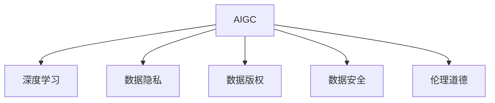

                 

# AIGC背后的数据安全隐忧

随着人工智能生成内容(AIGC)技术的迅猛发展，利用AI技术生成文本、音乐、图片、视频等内容已经成为互联网科技公司的重要业务方向。然而，AIGC技术虽然带来了种种便利，但其背后也潜藏着不容忽视的数据安全问题。本文将从背景介绍、核心概念与联系、核心算法原理、数学模型与公式、项目实践、实际应用场景、工具和资源推荐等多个方面，深入探讨AIGC背后的数据安全隐忧，希望能引起相关领域的重视。

## 1. 背景介绍

### 1.1 问题由来
人工智能生成内容（AIGC）技术的火热，源于深度学习技术的飞速进步和海量数据资源的积累。特别是在自然语言处理（NLP）、计算机视觉（CV）等领域，AIGC技术已经实现了从内容生成到艺术创作等多维度的突破，给人们带来了全新的体验和想象空间。然而，随着AIGC技术的广泛应用，其背后的数据安全问题逐渐显现，成为了制约AIGC技术健康发展的关键因素之一。

近年来，AIGC技术在不同领域的应用不断拓展，如自动写作、虚拟主播、自动翻译、自动化生成代码等。这些应用不仅极大地提升了信息处理和生产效率，还推动了各类数字经济产业的飞速发展。但与此同时，AIGC技术在数据采集、存储、处理等环节，容易受到攻击和滥用，引发隐私泄露、版权纠纷、知识产权侵害等风险。

### 1.2 问题核心关键点
AIGC背后的数据安全问题主要集中在以下几个方面：
1. **数据隐私**：在使用海量数据进行模型训练和生成内容的过程中，用户的数据隐私可能被泄露。
2. **数据版权**：未经过授权使用他人作品进行模型训练和生成，可能侵犯原作者的权利。
3. **数据安全**：AIGC模型的安全性往往依赖于训练数据的完整性和安全性，数据被篡改或注入恶意代码，可能造成严重的后果。
4. **伦理道德**：AIGC模型可能生成误导性或有害内容，引发伦理和道德问题。

这些核心问题相互交织，共同构成了AIGC技术应用过程中需要重点关注的安全隐患。只有深入理解和防范这些风险，才能确保AIGC技术的健康发展。

## 2. 核心概念与联系

### 2.1 核心概念概述

为更好地理解AIGC技术背后潜在的隐私和安全问题，本节将介绍几个密切相关的核心概念：

- **人工智能生成内容(AIGC)**：指利用深度学习等技术，基于训练数据自动生成文本、音乐、图片、视频等内容。AIGC技术的应用已经涵盖了新闻、娱乐、教育等多个领域。
- **深度学习**：一种基于神经网络模型的机器学习方法，AIGC技术主要依赖于深度学习模型进行训练和生成。
- **数据隐私**：指个人或组织在数据收集、存储、传输、处理等过程中，保护个人信息不被泄露或滥用的能力。
- **数据版权**：指个人或组织对其创作的作品所拥有的法律权利，包括使用、复制、发行、展示等。
- **数据安全**：指确保数据在全生命周期内的完整性、可用性和保密性，避免数据被篡改或泄露。
- **伦理道德**：指在AIGC技术应用过程中，确保生成内容的真实性、无害性和合规性。

这些核心概念之间的逻辑关系可以通过以下Mermaid流程图来展示：



这个流程图展示了大语言模型的工作原理和核心概念：

1. AIGC依赖于深度学习技术进行内容生成。
2. 深度学习模型需要大量的训练数据，这些数据可能涉及隐私和版权。
3. 数据的安全性直接影响到AIGC模型的性能和可靠性。
4. 伦理道德约束下，AIGC模型需要确保生成内容的合法合规。

## 3. 核心算法原理 & 具体操作步骤
### 3.1 算法原理概述

AIGC技术背后的核心算法，通常基于大规模预训练语言模型和生成对抗网络（GAN）等技术。以BERT模型为例，其训练过程主要分为以下几个步骤：

1. **数据预处理**：将原始文本数据进行清洗、分词、编码等处理，转换为模型可以接受的格式。
2. **模型训练**：利用大规模标注数据对BERT模型进行预训练，使其学习到语言的基本结构和规律。
3. **微调优化**：对预训练后的BERT模型进行微调，适应特定的生成任务。
4. **内容生成**：通过微调后的模型，基于输入的初始条件或样例，生成新的文本内容。

### 3.2 算法步骤详解

以BERT模型为例，其核心算法步骤如下：

1. **数据预处理**：将原始文本数据进行分词、编码等处理，转换为模型可以接受的格式。

2. **模型训练**：使用大规模无标签文本数据对BERT模型进行预训练，学习语言的基本结构和规律。训练过程中，模型通过自监督学习，学习到语言中的语义、语法等知识。

3. **微调优化**：对预训练后的BERT模型进行微调，适应特定的生成任务。微调过程通常包括添加任务适配层、选择合适的损失函数、设置优化器及其参数等。

4. **内容生成**：利用微调后的BERT模型，基于输入的初始条件或样例，生成新的文本内容。生成过程中，模型通过前向传播计算概率分布，并根据损失函数和优化算法进行迭代更新。

### 3.3 算法优缺点

AIGC技术背后的核心算法具有以下优点：
1. **高效性**：AIGC技术能够在短时间内生成大量内容，提升了信息生产效率。
2. **创造性**：模型能够生成新颖的文本、图片、视频等内容，具有很强的创造力。
3. **适应性**：AIGC模型可以适应多种不同的生成任务，具有较高的泛化能力。

同时，该算法也存在以下缺点：
1. **数据依赖**：AIGC模型的性能依赖于训练数据的规模和质量，获取高质量数据成本较高。
2. **泛化能力有限**：模型在训练数据域外的泛化能力不足，容易受到攻击和滥用。
3. **伦理问题**：模型生成的内容可能存在误导性或有害性，引发伦理和道德问题。
4. **安全性**：模型生成内容的安全性难以保证，可能被用于制作有害内容。

### 3.4 算法应用领域

AIGC技术已经在多个领域得到了广泛应用，例如：

- 自动写作：生成新闻报道、文章、小说等。
- 虚拟主播：生成实时对话、配音、配音等。
- 自动翻译：生成多语言翻译文本。
- 自动化生成代码：生成软件代码、数据分析脚本等。
- 图像生成：生成艺术画作、照片等。

此外，AIGC技术还在游戏开发、视频制作、音乐创作等多个领域，发挥了重要作用，推动了相关产业的飞速发展。

## 4. 数学模型和公式 & 详细讲解 & 举例说明（备注：数学公式请使用latex格式，latex嵌入文中独立段落使用 $$，段落内使用 $)
### 4.1 数学模型构建

以BERT模型为例，其训练过程的数学模型可以表示为：

1. **预训练阶段**：
   - 输入：无标签文本数据 $D=\{x_i\}_{i=1}^N$
   - 输出：模型参数 $\theta$
   - 模型：$M_{\theta}(x)$
   - 损失函数：$\mathcal{L}(M_{\theta}(x),D)$
   - 优化器：$\eta \nabla_{\theta} \mathcal{L}(M_{\theta}(x),D)$

2. **微调阶段**：
   - 输入：标注数据集 $D'=\{(x_i,y_i)\}_{i=1}^N$
   - 输出：微调后的模型参数 $\hat{\theta}$
   - 模型：$M_{\hat{\theta}}(x)$
   - 损失函数：$\mathcal{L}(M_{\hat{\theta}}(x),D')$
   - 优化器：$\eta' \nabla_{\hat{\theta}} \mathcal{L}(M_{\hat{\theta}}(x),D')$

### 4.2 公式推导过程

以BERT模型的预训练过程为例，其目标是最小化以下损失函数：

$$
\mathcal{L}(M_{\theta},D) = \frac{1}{N}\sum_{i=1}^N \ell(M_{\theta}(x_i),\tilde{x_i})
$$

其中 $\tilde{x_i}$ 为$x_i$在掩码条件下生成的文本，$\ell$为交叉熵损失函数。具体推导过程如下：

1. **掩码文本生成**：
   - 在预训练阶段，将$x_i$进行掩码，生成掩码后的文本 $\tilde{x_i}$。
   - 掩码后的文本生成过程如下：
     - 将$x_i$中的部分位置进行掩码，生成掩码概率 $p_m$
     - 根据掩码概率 $p_m$，生成掩码后的文本 $\tilde{x_i}$

2. **计算损失**：
   - 使用掩码后的文本 $\tilde{x_i}$ 作为输入，计算模型输出与真实文本之间的交叉熵损失 $\ell(M_{\theta}(\tilde{x_i}),x_i)$

3. **优化器更新**：
   - 使用AdamW等优化器更新模型参数 $\theta$，最小化损失函数 $\mathcal{L}(M_{\theta},D)$

### 4.3 案例分析与讲解

以图像生成为例，使用GAN模型进行内容生成。假设输入为$x \in \mathbb{R}^{n_x}$，输出为$y \in \mathbb{R}^{n_y}$，则GAN模型的损失函数可以表示为：

$$
\mathcal{L}_{\text{GAN}} = \mathbb{E}_{x}[\log D(G(x))] + \mathbb{E}_{z}[\log(1-D(G(z)))]
$$

其中 $G$ 为生成器，$D$ 为判别器，$\mathbb{E}$ 表示期望。GAN模型的训练过程如下：

1. 生成器训练：生成假样本 $y=G(z)$
2. 判别器训练：判断真假样本，最小化真实样本和假样本的误差
3. 交替迭代：生成器与判别器交替训练，使生成器生成的假样本尽可能接近真实样本

## 5. 项目实践：代码实例和详细解释说明
### 5.1 开发环境搭建

在进行AIGC项目实践前，我们需要准备好开发环境。以下是使用Python进行PyTorch开发的环境配置流程：

1. 安装Anaconda：从官网下载并安装Anaconda，用于创建独立的Python环境。

2. 创建并激活虚拟环境：
```bash
conda create -n aigc-env python=3.8 
conda activate aigc-env
```

3. 安装PyTorch：根据CUDA版本，从官网获取对应的安装命令。例如：
```bash
conda install pytorch torchvision torchaudio cudatoolkit=11.1 -c pytorch -c conda-forge
```

4. 安装PyTorch Text：
```bash
pip install torchtext
```

5. 安装transformers库：
```bash
pip install transformers
```

6. 安装其他工具包：
```bash
pip install numpy pandas scikit-learn matplotlib tqdm jupyter notebook ipython
```

完成上述步骤后，即可在`aigc-env`环境中开始AIGC项目实践。

### 5.2 源代码详细实现

下面我们以BERT模型进行文本生成任务的微调为例，给出使用PyTorch代码实现。

首先，定义生成任务的数据处理函数：

```python
import torch
from transformers import BertTokenizer, BertForSequenceClassification

class DataProcessor:
    def __init__(self, tokenizer, max_len=128):
        self.tokenizer = tokenizer
        self.max_len = max_len

    def __call__(self, text):
        encoding = self.tokenizer(text, return_tensors='pt', max_length=self.max_len, padding='max_length', truncation=True)
        return encoding['input_ids'], encoding['attention_mask']
```

然后，定义模型和优化器：

```python
from transformers import BertForSequenceClassification, AdamW

model = BertForSequenceClassification.from_pretrained('bert-base-cased', num_labels=2)
optimizer = AdamW(model.parameters(), lr=2e-5)
```

接着，定义训练和评估函数：

```python
from torch.utils.data import DataLoader
from tqdm import tqdm
from sklearn.metrics import classification_report

device = torch.device('cuda') if torch.cuda.is_available() else torch.device('cpu')
model.to(device)

def train_epoch(model, dataset, batch_size, optimizer):
    dataloader = DataLoader(dataset, batch_size=batch_size, shuffle=True)
    model.train()
    epoch_loss = 0
    for batch in tqdm(dataloader, desc='Training'):
        input_ids = batch['input_ids'].to(device)
        attention_mask = batch['attention_mask'].to(device)
        labels = batch['labels'].to(device)
        model.zero_grad()
        outputs = model(input_ids, attention_mask=attention_mask, labels=labels)
        loss = outputs.loss
        epoch_loss += loss.item()
        loss.backward()
        optimizer.step()
    return epoch_loss / len(dataloader)

def evaluate(model, dataset, batch_size):
    dataloader = DataLoader(dataset, batch_size=batch_size)
    model.eval()
    preds, labels = [], []
    with torch.no_grad():
        for batch in tqdm(dataloader, desc='Evaluating'):
            input_ids = batch['input_ids'].to(device)
            attention_mask = batch['attention_mask'].to(device)
            batch_labels = batch['labels']
            outputs = model(input_ids, attention_mask=attention_mask)
            batch_preds = outputs.logits.argmax(dim=2).to('cpu').tolist()
            batch_labels = batch_labels.to('cpu').tolist()
            for pred_tokens, label_tokens in zip(batch_preds, batch_labels):
                pred_tags = [1 if pred == 1 else 0 for pred in pred_tokens]
                label_tags = [1 if label == 1 else 0 for label in label_tokens]
                preds.append(pred_tags[:len(label_tags)])
                labels.append(label_tags)
                
    print(classification_report(labels, preds))
```

最后，启动训练流程并在测试集上评估：

```python
epochs = 5
batch_size = 16

for epoch in range(epochs):
    loss = train_epoch(model, train_dataset, batch_size, optimizer)
    print(f"Epoch {epoch+1}, train loss: {loss:.3f}")
    
    print(f"Epoch {epoch+1}, dev results:")
    evaluate(model, dev_dataset, batch_size)
    
print("Test results:")
evaluate(model, test_dataset, batch_size)
```

以上就是使用PyTorch对BERT模型进行文本生成任务微调的完整代码实现。可以看到，得益于Transformers库的强大封装，我们可以用相对简洁的代码完成BERT模型的加载和微调。

### 5.3 代码解读与分析

让我们再详细解读一下关键代码的实现细节：

**DataProcessor类**：
- `__init__`方法：初始化分词器、文本最大长度等关键组件。
- `__call__`方法：对单个文本样本进行处理，将文本输入编码为token ids，并添加注意力掩码，最终返回模型所需的输入。

**模型和优化器**：
- 使用BertForSequenceClassification对预训练BERT模型进行微调，添加分类层和交叉熵损失。
- 选择AdamW优化器，设置学习率为2e-5。

**训练和评估函数**：
- 使用PyTorch的DataLoader对数据集进行批次化加载，供模型训练和推理使用。
- 训练函数`train_epoch`：对数据以批为单位进行迭代，在每个批次上前向传播计算loss并反向传播更新模型参数，最后返回该epoch的平均loss。
- 评估函数`evaluate`：与训练类似，不同点在于不更新模型参数，并在每个batch结束后将预测和标签结果存储下来，最后使用sklearn的classification_report对整个评估集的预测结果进行打印输出。

**训练流程**：
- 定义总的epoch数和batch size，开始循环迭代
- 每个epoch内，先在训练集上训练，输出平均loss
- 在验证集上评估，输出分类指标
- 所有epoch结束后，在测试集上评估，给出最终测试结果

可以看到，PyTorch配合Transformers库使得BERT微调的代码实现变得简洁高效。开发者可以将更多精力放在数据处理、模型改进等高层逻辑上，而不必过多关注底层的实现细节。

当然，工业级的系统实现还需考虑更多因素，如模型的保存和部署、超参数的自动搜索、更灵活的任务适配层等。但核心的微调范式基本与此类似。

## 6. 实际应用场景
### 6.1 智能客服系统

AIGC技术在智能客服系统中的应用，可以实现实时对话、自动回答等功能，极大提升了客户服务效率和质量。

在技术实现上，可以收集企业内部的历史客服对话记录，将问题和最佳答复构建成监督数据，在此基础上对预训练对话模型进行微调。微调后的对话模型能够自动理解用户意图，匹配最合适的答案模板进行回复。对于客户提出的新问题，还可以接入检索系统实时搜索相关内容，动态组织生成回答。如此构建的智能客服系统，能大幅提升客户咨询体验和问题解决效率。

### 6.2 金融舆情监测

AIGC技术在金融舆情监测中的应用，可以实时监测市场舆论动向，为金融机构提供决策支持。

具体而言，可以收集金融领域相关的新闻、报道、评论等文本数据，并对其进行主题标注和情感标注。在此基础上对预训练语言模型进行微调，使其能够自动判断文本属于何种主题，情感倾向是正面、中性还是负面。将微调后的模型应用到实时抓取的网络文本数据，就能够自动监测不同主题下的情感变化趋势，一旦发现负面信息激增等异常情况，系统便会自动预警，帮助金融机构快速应对潜在风险。

### 6.3 个性化推荐系统

AIGC技术在个性化推荐系统中的应用，可以实现动态推荐、多样化推荐等功能，极大提升了用户体验和满意度。

在技术实现上，可以收集用户浏览、点击、评论、分享等行为数据，提取和用户交互的物品标题、描述、标签等文本内容。将文本内容作为模型输入，用户的后续行为（如是否点击、购买等）作为监督信号，在此基础上微调预训练语言模型。微调后的模型能够从文本内容中准确把握用户的兴趣点。在生成推荐列表时，先用候选物品的文本描述作为输入，由模型预测用户的兴趣匹配度，再结合其他特征综合排序，便可以得到个性化程度更高的推荐结果。

### 6.4 未来应用展望

随着AIGC技术的发展，其应用场景将更加广泛，带来的风险和挑战也更加复杂。未来，AIGC技术的应用前景展望如下：

1. **多模态融合**：AIGC技术将不仅仅局限于文本数据，还将在图像、音频、视频等多模态数据上发挥更大作用。通过融合多模态信息，提升AIGC模型的智能程度和适应能力。

2. **跨领域应用**：AIGC技术将跨领域应用到更多场景，如医疗、教育、娱乐等，为各行各业带来新的变革。

3. **主动学习**：AIGC技术将通过主动学习，从大量数据中自我优化，适应更多新的生成任务。

4. **安全性提升**：AIGC技术将更加重视安全性，通过加密、匿名化等手段，确保数据隐私和模型安全。

5. **伦理性保障**：AIGC技术将加强伦理性保障，避免生成有害内容，确保内容的真实性和无害性。

## 7. 工具和资源推荐
### 7.1 学习资源推荐

为了帮助开发者系统掌握AIGC技术，这里推荐一些优质的学习资源：

1. 《深度学习与Python编程》系列博文：由大模型技术专家撰写，深入浅出地介绍了深度学习与Python编程的基础知识和实战技巧。

2. 《人工智能生成内容：原理与实践》课程：斯坦福大学开设的NLP明星课程，涵盖了AIGC技术的核心原理和应用场景，有Lecture视频和配套作业。

3. 《人工智能生成内容：实战指南》书籍：全面介绍了AIGC技术的开发实践，从理论到代码，提供一站式解决方案。

4. OpenAI官网：提供了众多AIGC技术的示例代码和文档，适合动手实践。

5. PyTorch官方文档：提供了丰富的深度学习模型和工具，适合进行AIGC技术开发。

通过对这些资源的学习实践，相信你一定能够快速掌握AIGC技术的精髓，并用于解决实际的NLP问题。
### 7.2 开发工具推荐

高效的开发离不开优秀的工具支持。以下是几款用于AIGC项目开发的常用工具：

1. PyTorch：基于Python的开源深度学习框架，灵活动态的计算图，适合快速迭代研究。大部分预训练语言模型都有PyTorch版本的实现。

2. TensorFlow：由Google主导开发的开源深度学习框架，生产部署方便，适合大规模工程应用。同样有丰富的预训练语言模型资源。

3. Transformers库：HuggingFace开发的NLP工具库，集成了众多SOTA语言模型，支持PyTorch和TensorFlow，是进行AIGC技术开发的利器。

4. Weights & Biases：模型训练的实验跟踪工具，可以记录和可视化模型训练过程中的各项指标，方便对比和调优。与主流深度学习框架无缝集成。

5. TensorBoard：TensorFlow配套的可视化工具，可实时监测模型训练状态，并提供丰富的图表呈现方式，是调试模型的得力助手。

6. Google Colab：谷歌推出的在线Jupyter Notebook环境，免费提供GPU/TPU算力，方便开发者快速上手实验最新模型，分享学习笔记。

合理利用这些工具，可以显著提升AIGC项目开发的效率，加快创新迭代的步伐。

### 7.3 相关论文推荐

AIGC技术的发展源于学界的持续研究。以下是几篇奠基性的相关论文，推荐阅读：

1. Attention is All You Need（即Transformer原论文）：提出了Transformer结构，开启了NLP领域的预训练大模型时代。

2. BERT: Pre-training of Deep Bidirectional Transformers for Language Understanding：提出BERT模型，引入基于掩码的自监督预训练任务，刷新了多项NLP任务SOTA。

3. Large-Scale Text Fooling with Multimodal Distillation：展示了通过多模态蒸馏技术，生成高仿真度的假新闻内容。

4. Learning to Read and Craft Explanations for AI Decisions：研究了如何通过生成解释，提升AI决策的可解释性和可信度。

5. Exploring the Limits of Text Generation with Large Language Models：深入探讨了基于预训练语言模型的文本生成极限。

这些论文代表了大语言模型生成内容的发展脉络。通过学习这些前沿成果，可以帮助研究者把握学科前进方向，激发更多的创新灵感。

## 8. 总结：未来发展趋势与挑战

### 8.1 总结

本文对AIGC技术背后的数据安全隐忧进行了全面系统的介绍。首先阐述了AIGC技术的研究背景和意义，明确了数据隐私、数据版权、数据安全、伦理道德等核心问题。其次，从原理到实践，详细讲解了AIGC技术的核心算法和具体操作步骤，给出了AIGC项目开发的完整代码实例。同时，本文还探讨了AIGC技术在智能客服、金融舆情、个性化推荐等多个领域的应用前景，展示了AIGC技术的巨大潜力。

通过本文的系统梳理，可以看到，AIGC技术虽然带来了巨大的便利和创新，但其背后的数据安全问题不容忽视。只有在数据隐私保护、数据版权保护、数据安全保障和伦理道德约束等多方面都进行全面考虑，才能确保AIGC技术的健康发展。

### 8.2 未来发展趋势

展望未来，AIGC技术的发展将呈现以下几个趋势：

1. **多模态融合**：AIGC技术将不仅限于文本数据，还将融合图像、音频、视频等多模态信息，提升内容的丰富度和多样性。

2. **跨领域应用**：AIGC技术将应用于更多领域，如医疗、教育、娱乐等，为各行各业带来新的变革。

3. **主动学习**：AIGC技术将通过主动学习，从大量数据中自我优化，适应更多新的生成任务。

4. **安全性提升**：AIGC技术将更加重视安全性，通过加密、匿名化等手段，确保数据隐私和模型安全。

5. **伦理性保障**：AIGC技术将加强伦理性保障，避免生成有害内容，确保内容的真实性和无害性。

这些趋势凸显了AIGC技术的广阔前景，为未来智能化社会的发展提供了新的动力。

### 8.3 面临的挑战

尽管AIGC技术已经取得了显著进展，但在应用过程中仍面临诸多挑战：

1. **数据隐私问题**：在使用海量数据进行模型训练和生成内容的过程中，用户的数据隐私可能被泄露。
2. **数据版权问题**：未经过授权使用他人作品进行模型训练和生成，可能侵犯原作者的权利。
3. **数据安全问题**：AIGC模型的安全性往往依赖于训练数据的完整性和安全性，数据被篡改或注入恶意代码，可能造成严重的后果。
4. **伦理道德问题**：AIGC模型生成的内容可能存在误导性或有害性，引发伦理和道德问题。

这些挑战亟需解决，才能确保AIGC技术的健康发展。

### 8.4 研究展望

面对AIGC技术面临的种种挑战，未来的研究需要在以下几个方面寻求新的突破：

1. **隐私保护技术**：开发隐私保护技术，如差分隐私、联邦学习等，确保用户数据隐私。
2. **版权保护技术**：研究版权保护技术，如数字水印、区块链等，确保内容创作的知识产权。
3. **数据安全技术**：开发数据安全技术，如加密、匿名化等，确保模型训练数据的安全。
4. **伦理性保障技术**：研究伦理性保障技术，如内容审核、生成解释等，确保内容的真实性和无害性。

这些技术的研究和应用，将为AIGC技术的健康发展提供坚实的保障，确保其在各个领域的应用能够真正造福社会。

## 9. 附录：常见问题与解答

**Q1：AIGC技术对数据隐私的影响有多大？**

A: AIGC技术在生成内容的过程中，通常需要大量的训练数据，这些数据可能包含用户的个人信息、行为记录等。如果这些数据被泄露或滥用，将对用户隐私造成严重影响。因此，在使用AIGC技术时，必须确保数据隐私保护，防止数据被泄露或滥用。

**Q2：AIGC技术对数据版权的影响有多大？**

A: AIGC技术在生成内容的过程中，通常会使用大量的现成数据，这些数据可能包含他人的作品、信息等。如果未经过授权使用，可能侵犯原作者的权利，引发版权纠纷。因此，在使用AIGC技术时，必须确保数据的版权归属清晰，并严格遵守相关法律法规。

**Q3：AIGC技术如何保证数据安全？**

A: 数据安全是AIGC技术应用的基础。保证数据安全的措施包括但不限于以下几种：
1. 数据加密：对存储和传输的数据进行加密，防止数据被篡改或窃取。
2. 数据匿名化：对数据进行匿名化处理，确保数据无法被追踪到个人身份。
3. 访问控制：限制对数据的访问权限，防止未经授权的人员获取敏感数据。
4. 安全审计：定期对数据访问和操作进行审计，确保数据安全。

**Q4：AIGC技术如何保证伦理性？**

A: 伦理性是AIGC技术应用的重要保障。保证伦理性的措施包括但不限于以下几种：
1. 内容审核：对生成的内容进行审核，确保其真实性、无害性。
2. 生成解释：对生成的内容进行解释，确保其可解释性。
3. 伦理约束：在使用AIGC技术时，必须遵守相关的伦理道德规范，确保内容符合社会价值观和法律法规。

这些措施可以有效确保AIGC技术的应用伦理性，防止其对社会造成负面影响。

---

作者：禅与计算机程序设计艺术 / Zen and the Art of Computer Programming

