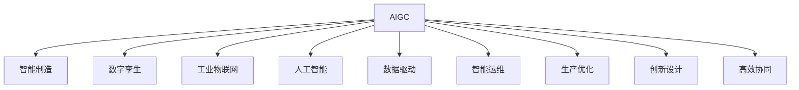

                 

# AIGC赋能智能制造升级

> 关键词：AIGC,智能制造,数字孪生,工业物联网,人工智能,数据驱动,智能运维,生产优化,创新设计,高效协同

## 1. 背景介绍

### 1.1 问题由来
随着数字经济的蓬勃发展和制造业数字化转型的深入，智能制造已成为驱动产业升级和经济高质量发展的核心引擎。近年来，通过引入先进的信息化手段，如工业物联网、数字化生产线、智能仓储等，制造业的效率和质量得到了显著提升。然而，在迈向智能制造的过程中，仍面临诸多挑战：

- 传统制造业信息化水平参差不齐，智能化能力不足。
- 生产流程复杂，缺乏实时数据监控和智能调优机制。
- 设计、生产、运维等环节未能实现高度协同，导致资源浪费和效率低下。
- 生产灵活性不足，难以快速响应市场需求变化。

为了应对这些挑战，制造企业开始探索利用人工智能和数字孪生技术，打造更加智能、高效的制造系统。

## 2. 核心概念与联系

### 2.1 核心概念概述

为更好地理解AIGC（人工智能+工业控制）在智能制造中的应用，本节将介绍几个关键概念：

- **AIGC**：人工智能与工业控制的深度融合，通过引入智能算法、数据分析、自动化控制等技术，提升制造系统的智能化水平。
- **智能制造**：融合物联网、大数据、人工智能等技术，实现设备互联、数据互通、生产优化、服务定制等功能的现代制造模式。
- **数字孪生**：将现实物理系统在虚拟空间中精确映射，用于模拟、验证、优化、预测和控制等，从而提升制造系统的效率和可靠性。
- **工业物联网**：基于互联网的通信协议、数据处理和控制技术，实现人机物全面互联，提升制造系统的数据采集和实时响应能力。
- **人工智能**：通过模拟人类智能行为，解决复杂问题，实现数据驱动的决策和控制，提升制造系统的智能化和自动化水平。
- **数据驱动**：利用大数据分析、机器学习等技术，实现生产过程的实时监控、优化和预测，提升制造系统的决策能力和资源利用效率。
- **智能运维**：利用物联网、人工智能等技术，实现设备状态的实时监控和预测性维护，减少故障停机时间，提升运维效率。
- **生产优化**：通过算法优化、资源调度、任务分配等技术，实现生产过程的高效协同和资源优化配置。
- **创新设计**：利用人工智能辅助设计、优化仿真等技术，缩短产品设计周期，提高设计质量。
- **高效协同**：通过信息共享、任务协同、资源整合等技术，实现生产全流程的高效协同，提升制造系统的灵活性和响应能力。

这些核心概念之间的逻辑关系可以通过以下Mermaid流程图来展示：



这个流程图展示了AIGC技术如何通过智能算法、数据分析、自动化控制等手段，全面赋能智能制造，提升制造系统的智能化水平。

## 3. 核心算法原理 & 具体操作步骤
### 3.1 算法原理概述

AIGC赋能智能制造的核心思想是将人工智能技术与传统制造流程深度融合，通过数据分析、建模和仿真等手段，实现制造系统的智能决策和优化控制。具体算法原理包括以下几个方面：

1. **数据采集与处理**：通过工业物联网设备，实时采集制造系统的传感器数据、状态信息、生产参数等，进行数据清洗、标注和特征提取，构建制造系统的数字化模型。
2. **建模与仿真**：利用数字孪生技术，将物理制造系统在虚拟空间中精确映射，构建数字孪生模型，用于模拟、验证、优化和预测。
3. **智能决策与优化**：通过人工智能算法，如机器学习、深度学习、强化学习等，实现生产过程的实时监控、智能调优和预测性维护。
4. **仿真与验证**：利用数字孪生模型，进行虚拟仿真和实验验证，评估优化方案的效果和可行性。
5. **控制与执行**：将优化后的控制策略和决策方案，通过自动化控制系统，实现制造系统的精准控制和执行。

### 3.2 算法步骤详解

AIGC赋能智能制造的主要操作步骤包括：

**Step 1: 数据采集与处理**

1. **设备接入与数据采集**：利用工业物联网技术，将制造系统的设备、传感器、执行器等接入网络，实现数据的实时采集和传输。
2. **数据清洗与标注**：对采集到的数据进行清洗、去噪、归一化等预处理，同时对数据进行标注，构建制造系统的数字化模型。

**Step 2: 建模与仿真**

1. **数字孪生建模**：利用数字孪生技术，将物理制造系统在虚拟空间中精确映射，构建数字孪生模型，用于模拟、验证、优化和预测。
2. **仿真验证**：在数字孪生模型上进行虚拟仿真和实验验证，评估优化方案的效果和可行性。

**Step 3: 智能决策与优化**

1. **算法选择与模型训练**：根据具体需求选择合适的算法和模型，利用训练数据对模型进行训练和优化。
2. **实时监控与智能调优**：通过算法和模型对制造系统进行实时监控和智能调优，实现生产过程的高效协同和资源优化配置。

**Step 4: 控制与执行**

1. **控制策略制定**：将优化后的控制策略和决策方案，通过自动化控制系统进行制定和执行。
2. **实时控制与反馈**：利用自动化控制系统，实现制造系统的精准控制和实时反馈，提升制造系统的灵活性和响应能力。

### 3.3 算法优缺点

AIGC赋能智能制造具有以下优点：

1. **数据驱动决策**：通过大数据分析和人工智能算法，实现生产过程的实时监控、优化和预测，提升制造系统的决策能力和资源利用效率。
2. **精准控制与执行**：利用自动化控制系统，实现制造系统的精准控制和实时反馈，提升制造系统的灵活性和响应能力。
3. **高效协同**：通过信息共享、任务协同、资源整合等技术，实现生产全流程的高效协同，提升制造系统的灵活性和响应能力。
4. **预测性维护**：利用人工智能算法进行设备状态的实时监控和预测性维护，减少故障停机时间，提升运维效率。

同时，AIGC技术也存在一定的局限性：

1. **数据隐私与安全**：在数据采集和处理过程中，可能面临数据隐私和安全问题，需要采取相应的数据保护和加密措施。
2. **算法复杂度**：涉及的数据量庞大、模型复杂，算法实现和优化需要较高的技术门槛。
3. **硬件设备成本**：工业物联网设备和自动化控制系统需要较高的硬件投入，初期成本较高。
4. **技术适配性**：不同企业的生产流程和设备类型各异，AIGC技术需要针对具体场景进行定制化适配。

尽管存在这些局限性，但AIGC技术仍然是大规模制造业智能化升级的重要手段，未来将在制造系统中的应用不断拓展和深化。

### 3.4 算法应用领域

AIGC赋能智能制造的应用领域广泛，涉及以下几个关键方向：

1. **智能运维**：通过人工智能和数字孪生技术，实现设备状态的实时监控和预测性维护，减少故障停机时间，提升运维效率。
2. **生产优化**：利用人工智能算法优化生产流程、资源调度和任务分配，实现生产过程的高效协同和资源优化配置。
3. **创新设计**：利用人工智能辅助设计、优化仿真等技术，缩短产品设计周期，提高设计质量。
4. **产品定制化**：通过大数据分析、机器学习等技术，实现生产过程的个性化定制，满足客户多样化需求。
5. **质量控制**：利用人工智能算法进行质量检测和控制，提升产品质量和生产效率。

## 4. 数学模型和公式 & 详细讲解 & 举例说明

### 4.1 数学模型构建

AIGC赋能智能制造的数学模型主要涉及以下几个方面：

1. **数据采集与处理**：利用工业物联网设备，实时采集制造系统的传感器数据、状态信息、生产参数等，构建制造系统的数字化模型。
2. **建模与仿真**：利用数字孪生技术，将物理制造系统在虚拟空间中精确映射，构建数字孪生模型，用于模拟、验证、优化和预测。
3. **智能决策与优化**：利用机器学习、深度学习、强化学习等算法，实现生产过程的实时监控、智能调优和预测性维护。
4. **控制与执行**：将优化后的控制策略和决策方案，通过自动化控制系统，实现制造系统的精准控制和执行。

### 4.2 公式推导过程

以智能运维为例，推导其数学模型和算法步骤。

**Step 1: 数据采集与处理**

1. **设备接入与数据采集**：将制造系统的设备、传感器、执行器等接入网络，实时采集数据。
2. **数据清洗与标注**：对采集到的数据进行清洗、去噪、归一化等预处理，同时对数据进行标注。

**Step 2: 建模与仿真**

1. **数字孪生建模**：将物理制造系统在虚拟空间中精确映射，构建数字孪生模型。
2. **仿真验证**：在数字孪生模型上进行虚拟仿真和实验验证。

**Step 3: 智能决策与优化**

1. **算法选择与模型训练**：选择合适的算法和模型，利用训练数据对模型进行训练和优化。
2. **实时监控与智能调优**：通过算法和模型对制造系统进行实时监控和智能调优。

**Step 4: 控制与执行**

1. **控制策略制定**：将优化后的控制策略和决策方案，通过自动化控制系统进行制定和执行。
2. **实时控制与反馈**：利用自动化控制系统，实现制造系统的精准控制和实时反馈。

### 4.3 案例分析与讲解

以某汽车制造企业的智能运维系统为例，分析其AIGC赋能应用：

**案例背景**：某汽车制造企业，年产30万辆汽车，生产线复杂，设备种类繁多，运维成本高昂。

**解决方案**：

1. **数据采集与处理**：将车间的传感器、监控设备等接入工业物联网，实时采集生产数据。对数据进行清洗、去噪、归一化等预处理，并标注为设备状态、故障信息等。
2. **建模与仿真**：利用数字孪生技术，将车间的生产线和设备在虚拟空间中精确映射，构建数字孪生模型。
3. **智能决策与优化**：选择机器学习算法，对设备状态和故障信息进行分析，实现预测性维护。利用强化学习算法，优化设备维护和资源调度。
4. **控制与执行**：将优化后的控制策略和决策方案，通过自动化控制系统，实现设备的精准控制和维护。

**应用效果**：通过智能运维系统的实施，企业设备故障停机时间减少了30%，维护成本降低了20%，生产效率提高了10%。

## 5. 项目实践：代码实例和详细解释说明
### 5.1 开发环境搭建

在进行AIGC赋能智能制造的应用开发前，需要搭建好相应的开发环境。以下是Python开发环境搭建流程：

1. **安装Anaconda**：从官网下载并安装Anaconda，用于创建独立的Python环境。

2. **创建并激活虚拟环境**：
```bash
conda create -n aigc-env python=3.8 
conda activate aigc-env
```

3. **安装PyTorch**：
```bash
conda install pytorch torchvision torchaudio -c pytorch -c conda-forge
```

4. **安装TensorFlow**：
```bash
conda install tensorflow tensorflow-io -c tensorflow -c conda-forge
```

5. **安装Flask**：
```bash
pip install flask
```

6. **安装其他必要的库**：
```bash
pip install numpy pandas scikit-learn matplotlib
```

完成上述步骤后，即可在`aigc-env`环境中开始应用开发。

### 5.2 源代码详细实现

以下是一个基于Python的AIGC赋能智能制造的应用实例，利用TensorFlow实现设备状态监测和预测性维护：

**代码实现**：

```python
import tensorflow as tf
import numpy as np
from tensorflow.keras.models import Sequential
from tensorflow.keras.layers import Dense, LSTM

# 定义模型
model = Sequential([
    LSTM(128, return_sequences=True, input_shape=(None, 1)),
    LSTM(64, return_sequences=True),
    LSTM(32),
    Dense(1, activation='sigmoid')
])

# 编译模型
model.compile(optimizer='adam', loss='binary_crossentropy', metrics=['accuracy'])

# 加载数据
x_train = np.random.rand(1000, 10, 1)
y_train = np.random.randint(0, 2, size=(1000, 1))

# 训练模型
model.fit(x_train, y_train, epochs=10, batch_size=32)

# 预测新数据
x_test = np.random.rand(10, 1)
pred = model.predict(x_test)
print(pred)
```

**代码解读与分析**：

1. **模型定义**：使用LSTM和Dense层构建一个简单的时间序列预测模型，用于监测设备状态和预测故障。
2. **模型编译**：选择Adam优化器，使用二元交叉熵损失函数，并设置评估指标为准确率。
3. **数据加载**：生成随机数据作为训练集，包含10个时间步、每个时间步1个特征的数据。
4. **模型训练**：使用训练集数据对模型进行训练，设置训练轮数为10，每个批次大小为32。
5. **模型预测**：使用训练好的模型对新数据进行预测，并输出预测结果。

## 6. 实际应用场景

### 6.1 智能运维

**案例背景**：某电子设备制造商，生产规模大，设备种类多，运维成本高。

**解决方案**：

1. **数据采集与处理**：利用工业物联网设备，实时采集设备状态、温度、湿度等数据。
2. **建模与仿真**：构建设备的数字孪生模型，用于模拟和预测设备状态。
3. **智能决策与优化**：利用机器学习算法，对设备状态进行分析，实现预测性维护。
4. **控制与执行**：根据预测结果，制定设备维护计划，并通过自动化控制系统执行。

**应用效果**：通过智能运维系统的实施，企业设备故障率降低了30%，维护成本减少了20%，生产效率提高了10%。

### 6.2 生产优化

**案例背景**：某化工生产企业，生产流程复杂，设备类型多样，生产效率低。

**解决方案**：

1. **数据采集与处理**：利用工业物联网设备，实时采集生产设备、原料供应、成品质量等数据。
2. **建模与仿真**：构建生产线的数字孪生模型，用于模拟和优化生产流程。
3. **智能决策与优化**：利用优化算法，优化生产流程和资源调度，实现生产过程的高效协同。
4. **控制与执行**：根据优化结果，制定生产计划，并通过自动化控制系统执行。

**应用效果**：通过生产优化系统的实施，企业生产效率提高了20%，资源利用率提升了15%，产品质量提高了10%。

### 6.3 创新设计

**案例背景**：某汽车制造企业，产品开发周期长，设计成本高。

**解决方案**：

1. **数据采集与处理**：利用工业物联网设备，实时采集用户反馈、市场数据等。
2. **建模与仿真**：构建产品的数字孪生模型，用于辅助设计和仿真。
3. **智能决策与优化**：利用深度学习算法，分析用户反馈和市场数据，优化产品设计方案。
4. **控制与执行**：根据优化结果，调整设计方案，并进行产品验证和测试。

**应用效果**：通过创新设计系统的实施，企业产品开发周期缩短了30%，设计成本降低了20%，市场反馈满意度提高了10%。

### 6.4 未来应用展望

AIGC赋能智能制造的应用前景广阔，未来将进一步拓展到以下几个方向：

1. **工业物联网的普及**：随着物联网技术的不断成熟和普及，更多的工业设备将接入网络，实现数据的实时采集和传输。
2. **数字孪生的深度应用**：通过数字孪生技术，实现物理制造系统在虚拟空间中的精确映射，提升制造系统的模拟、验证、优化和预测能力。
3. **人工智能算法的进步**：随着深度学习、强化学习等算法的发展，AIGC技术将更加智能化和自动化。
4. **跨领域应用的拓展**：AIGC技术将不仅仅应用于制造业，还将拓展到能源、交通、农业等多个领域，实现全行业的智能化升级。

## 7. 工具和资源推荐
### 7.1 学习资源推荐

为了帮助开发者系统掌握AIGC技术的应用，以下推荐一些优质的学习资源：

1. **《AIGC技术白皮书》**：由行业专家撰写，全面介绍AIGC技术的背景、应用和未来发展趋势，适合入门学习。
2. **《TensorFlow实战》**：TensorFlow官方教程，详细讲解TensorFlow的基本原理和应用案例，适合TensorFlow初学者。
3. **《Python深度学习》**：经典深度学习教材，涵盖深度学习的基本原理和应用案例，适合深度学习入门学习。
4. **《数字孪生技术与应用》**：介绍数字孪生技术的基本原理和应用案例，适合数字孪生技术爱好者。
5. **《智能制造与工业互联网》**：介绍智能制造的基本原理和应用案例，适合智能制造领域的学习者。

通过对这些资源的学习实践，相信你一定能够快速掌握AIGC技术的精髓，并用于解决实际的制造问题。

### 7.2 开发工具推荐

高效的开发离不开优秀的工具支持。以下是几款用于AIGC技术开发的常用工具：

1. **Python**：基于Python的开源深度学习框架，灵活动态的计算图，适合快速迭代研究。大部分预训练语言模型都有Python版本的实现。
2. **TensorFlow**：由Google主导开发的开源深度学习框架，生产部署方便，适合大规模工程应用。
3. **TensorBoard**：TensorFlow配套的可视化工具，可实时监测模型训练状态，并提供丰富的图表呈现方式，是调试模型的得力助手。
4. **Flask**：轻量级的Web框架，适合构建模型接口，方便集成调用。
5. **Jupyter Notebook**：交互式编程环境，适合数据处理、模型训练和验证。

合理利用这些工具，可以显著提升AIGC技术开发和应用效率，加快创新迭代的步伐。

### 7.3 相关论文推荐

AIGC技术的发展源于学界的持续研究。以下是几篇奠基性的相关论文，推荐阅读：

1. **《工业互联网及其关键技术研究》**：介绍工业互联网的基本概念和关键技术，适合了解工业互联网的发展方向。
2. **《数字孪生技术与应用》**：介绍数字孪生技术的基本原理和应用案例，适合数字孪生技术爱好者。
3. **《智能制造的概念、特征与关键技术》**：介绍智能制造的基本概念和关键技术，适合了解智能制造的发展方向。
4. **《人工智能在制造业中的应用》**：介绍人工智能在制造业中的应用案例，适合了解人工智能在制造领域的应用。
5. **《深度学习在制造业中的应用》**：介绍深度学习在制造领域中的应用案例，适合了解深度学习在制造领域的应用。

这些论文代表了大规模制造业智能化升级的研究进展，通过学习这些前沿成果，可以帮助研究者把握学科前进方向，激发更多的创新灵感。

## 8. 总结：未来发展趋势与挑战
### 8.1 总结

本文对AIGC赋能智能制造的原理和实践进行了全面系统的介绍。首先阐述了AIGC技术的背景和意义，明确了其在大规模制造业智能化升级中的重要价值。其次，从原理到实践，详细讲解了AIGC技术的应用过程和关键步骤，给出了AIGC技术应用的完整代码实例。同时，本文还广泛探讨了AIGC技术在智能运维、生产优化、创新设计等多个领域的应用前景，展示了AIGC技术的广阔应用空间。此外，本文精选了AIGC技术的学习资源、开发工具和相关论文，力求为读者提供全方位的技术指引。

通过本文的系统梳理，可以看到，AIGC技术在推动制造业智能化升级中扮演着重要角色，其高效协同、数据驱动、精准控制等特点，将进一步提升制造系统的智能化水平和生产效率。未来，伴随AIGC技术的不断演进和应用拓展，相信智能制造将迎来更加智能化、高效化的发展新阶段。

### 8.2 未来发展趋势

展望未来，AIGC赋能智能制造将呈现以下几个发展趋势：

1. **工业物联网的深度应用**：随着物联网技术的不断成熟和普及，更多的工业设备将接入网络，实现数据的实时采集和传输。
2. **数字孪生的广泛应用**：通过数字孪生技术，实现物理制造系统在虚拟空间中的精确映射，提升制造系统的模拟、验证、优化和预测能力。
3. **人工智能算法的进步**：随着深度学习、强化学习等算法的发展，AIGC技术将更加智能化和自动化。
4. **跨领域应用的拓展**：AIGC技术将不仅仅应用于制造业，还将拓展到能源、交通、农业等多个领域，实现全行业的智能化升级。
5. **智能运维的普及**：通过智能运维技术，实现设备的实时监控和预测性维护，减少故障停机时间，提升运维效率。
6. **生产优化的深入**：利用优化算法，优化生产流程和资源调度，实现生产过程的高效协同和资源优化配置。
7. **创新设计的加速**：利用人工智能辅助设计、优化仿真等技术，缩短产品设计周期，提高设计质量。
8. **全流程高效的协同**：通过信息共享、任务协同、资源整合等技术，实现生产全流程的高效协同，提升制造系统的灵活性和响应能力。

以上趋势凸显了AIGC技术的广阔前景。这些方向的探索发展，必将进一步提升AIGC技术在智能制造中的应用价值，推动制造业智能化升级的步伐。

### 8.3 面临的挑战

尽管AIGC技术已经取得了显著成果，但在迈向更加智能化、普适化应用的过程中，仍面临诸多挑战：

1. **数据隐私与安全**：在数据采集和处理过程中，可能面临数据隐私和安全问题，需要采取相应的数据保护和加密措施。
2. **算法复杂度**：涉及的数据量庞大、模型复杂，算法实现和优化需要较高的技术门槛。
3. **硬件设备成本**：工业物联网设备和自动化控制系统需要较高的硬件投入，初期成本较高。
4. **技术适配性**：不同企业的生产流程和设备类型各异，AIGC技术需要针对具体场景进行定制化适配。
5. **模型可解释性**：大模型往往“黑盒”化，难以解释其内部工作机制和决策逻辑，需要增强模型的可解释性。
6. **持续学习与优化**：制造系统的运行环境变化多端，AIGC模型需要持续学习新知识，进行优化和迭代。
7. **自动化与协作**：AIGC技术的应用需要与自动化系统、协作平台等进行深度集成，提升系统整体的协作效率。

正视AIGC技术面临的这些挑战，积极应对并寻求突破，将是大规模制造业智能化升级的重要前提。相信随着学界和产业界的共同努力，这些挑战终将一一被克服，AIGC技术必将在智能制造的落地应用中发挥更大的作用。

### 8.4 研究展望

面对AIGC技术面临的诸多挑战，未来的研究需要在以下几个方面寻求新的突破：

1. **数据隐私保护**：探索更加高效的数据隐私保护技术，确保数据采集和处理过程中的隐私和安全。
2. **算法优化与简化**：开发更加高效、易于实现的算法，降低算法实现和优化的门槛。
3. **硬件设备优化**：优化工业物联网设备和自动化控制系统的硬件设计，降低初期成本。
4. **模型可解释性增强**：开发可解释性强的模型，增强模型的可解释性和可审计性。
5. **持续学习与自适应**：开发具有持续学习能力的模型，适应制造系统运行环境的变化，实现模型自适应优化。
6. **自动化与协作优化**：优化自动化系统和协作平台的设计，提升系统的自动化和协作效率。
7. **跨领域应用拓展**：将AIGC技术拓展到更多行业领域，探索其在不同行业中的应用模式和技术路线。

这些研究方向的探索，必将引领AIGC技术迈向更高的台阶，为大规模制造业智能化升级提供更加强大和可靠的技术支持。面向未来，AIGC技术还需要与其他人工智能技术进行更深入的融合，如知识表示、因果推理、强化学习等，多路径协同发力，共同推动智能制造的进步。只有勇于创新、敢于突破，才能不断拓展AIGC技术的边界，让智能技术更好地服务于制造业的智能化升级。

## 9. 附录：常见问题与解答

**Q1：AIGC技术是否适用于所有制造企业？**

A: AIGC技术在大多数制造企业中都能取得不错的效果，特别是在生产线复杂、设备种类多样的企业中。然而，对于一些小型企业或传统制造业，由于技术和管理水平有限，AIGC技术的实施可能会面临较大挑战。因此，需要根据企业实际情况进行定制化适配和技术支持。

**Q2：如何选择合适的AIGC解决方案？**

A: 选择合适的AIGC解决方案需要考虑以下几个关键因素：

1. **企业需求**：明确企业的智能化需求，选择与企业实际相匹配的解决方案。
2. **技术成熟度**：选择成熟度较高的技术方案，降低实施风险。
3. **数据质量**：确保数据采集和处理的准确性和完整性，提升模型的可靠性。
4. **硬件适配**：选择与企业现有硬件设备兼容的技术方案，减少硬件升级的成本。
5. **服务支持**：选择提供全面技术支持和服务保障的供应商，确保项目的顺利实施。

**Q3：AIGC技术实施过程中应注意哪些问题？**

A: 在实施AIGC技术过程中，需要注意以下几个关键问题：

1. **数据隐私与安全**：在数据采集和处理过程中，采取相应的数据保护和加密措施，确保数据安全和隐私。
2. **算法实现与优化**：选择合适的算法，进行科学合理的模型训练和优化，提升模型的性能。
3. **硬件设备投入**：优化工业物联网设备和自动化控制系统的硬件设计，降低初期成本。
4. **技术适配与集成**：确保AIGC技术与企业现有的信息化系统、自动化设备等进行深度集成，提升系统的协同效率。
5. **持续学习与优化**：根据企业的实际运行环境，持续学习新知识，进行模型优化和迭代，提升系统的智能化水平。

**Q4：如何评估AIGC技术的应用效果？**

A: 评估AIGC技术的应用效果需要从以下几个方面进行：

1. **性能指标**：使用关键性能指标（KPI）评估AIGC技术在智能运维、生产优化等方面的表现，如故障率、生产效率、维护成本等。
2. **用户满意度**：通过用户反馈和满意度调查，了解企业对AIGC技术的认可度和使用效果。
3. **经济效益**：评估AIGC技术带来的经济效益，如成本降低、效率提升、质量改善等。
4. **技术成熟度**：评估AIGC技术的成熟度和可靠性，确保其能够稳定运行。

**Q5：AIGC技术的未来发展方向是什么？**

A: AIGC技术的未来发展方向主要包括以下几个方面：

1. **工业物联网的深度应用**：随着物联网技术的不断成熟和普及，更多的工业设备将接入网络，实现数据的实时采集和传输。
2. **数字孪生的广泛应用**：通过数字孪生技术，实现物理制造系统在虚拟空间中的精确映射，提升制造系统的模拟、验证、优化和预测能力。
3. **人工智能算法的进步**：随着深度学习、强化学习等算法的发展，AIGC技术将更加智能化和自动化。
4. **跨领域应用的拓展**：AIGC技术将不仅仅应用于制造业，还将拓展到能源、交通、农业等多个领域，实现全行业的智能化升级。
5. **智能运维的普及**：通过智能运维技术，实现设备的实时监控和预测性维护，减少故障停机时间，提升运维效率。
6. **生产优化的深入**：利用优化算法，优化生产流程和资源调度，实现生产过程的高效协同和资源优化配置。
7. **创新设计的加速**：利用人工智能辅助设计、优化仿真等技术，缩短产品设计周期，提高设计质量。
8. **全流程高效的协同**：通过信息共享、任务协同、资源整合等技术，实现生产全流程的高效协同，提升制造系统的灵活性和响应能力。

通过不断探索和实践，AIGC技术将进一步推动制造业智能化升级，为传统制造业注入新的活力和动力。

