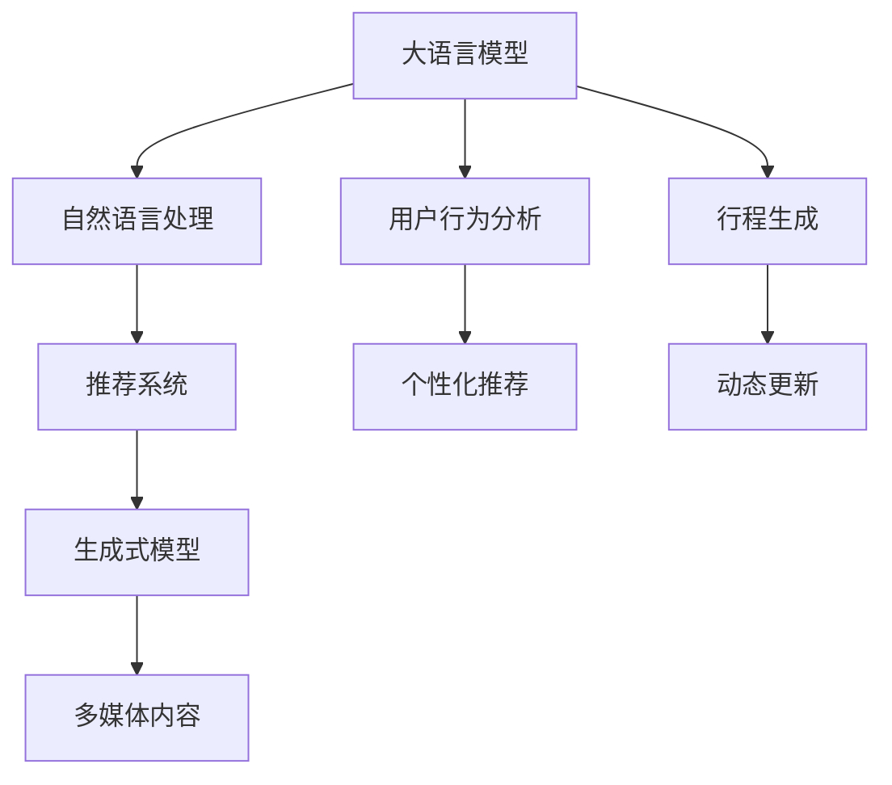

                 

# AIGC重塑旅游出行业

旅游出行业是连接人们出行体验的桥梁，然而，由于诸多限制和不确定因素，传统旅游服务常常面临以下挑战：

- **高昂成本**：从机票预订到酒店住宿，再到旅行团安排，传统的旅游服务成本高昂，价格不透明。
- **信息不对称**：游客面临大量信息，难以快速获取并做出最佳选择。
- **体验差异大**：不同游客的需求差异大，个性化体验难以满足。
- **服务难以追踪**：旅游服务的各个环节常常难以实时追踪，用户反馈慢。

伴随人工智能生成内容(AI Generated Content, AIGC)技术的快速发展，通过大语言模型和生成式模型，AIGC正在逐步重塑旅游出行业。本文将从多个角度深入探讨AIGC如何赋能旅游出行业，并提出未来发展的趋势与挑战。

## 1. 背景介绍

### 1.1 问题由来
随着人工智能技术的成熟，生成式模型和大语言模型在内容生成、语义理解、信息推荐等领域取得显著进展。基于AIGC技术的旅游出行业应用，能够根据游客偏好、历史行为等数据，自动化生成个性化的旅行建议、行程规划和推荐内容，极大地提升了用户体验和效率。

旅游出行业正处于数字化转型的关键阶段，利用AIGC技术，可以在数据驱动和个性化推荐的基础上，提供更加灵活、智能、透明的服务模式。

### 1.2 问题核心关键点
旅游出行业的AIGC应用，核心在于如何高效生成、理解和推荐内容，以满足用户个性化的出行需求，同时保证服务的透明度、可追踪性和安全性。具体包括：

- 自动化内容生成：通过生成式模型生成行程规划、旅游攻略、景点介绍等个性化内容。
- 用户意图理解：使用大语言模型分析用户查询意图，提供精确匹配的旅游服务和推荐。
- 推荐系统优化：根据用户行为数据，建立推荐模型，预测用户兴趣，提供高质量推荐。
- 实时动态调整：结合实时数据，实时更新推荐，提升用户体验。

## 2. 核心概念与联系

### 2.1 核心概念概述

旅游出行业的AIGC应用涉及多个关键概念，具体如下：

- **大语言模型**：如GPT-3、BERT等，用于处理自然语言理解和生成任务，为旅游推荐和行程生成提供基础语义模型。
- **生成式模型**：如GAN、VAE等，用于生成文本、图片、视频等多媒体内容，为旅游出行的个性化体验提供丰富素材。
- **推荐系统**：通过机器学习模型预测用户兴趣，推荐个性化的旅游内容和服务。
- **用户行为分析**：收集和分析用户行为数据，生成用户画像，提升推荐准确性。

这些概念之间的联系可以通过以下Mermaid流程图来展示：



这个流程图展示了各个核心概念之间的关系：

1. 大语言模型用于理解和生成自然语言，为推荐和行程生成提供语义基础。
2. 推荐系统利用用户行为数据和语言模型，预测用户兴趣，提供个性化推荐。
3. 生成式模型通过生成多媒体内容，丰富旅游体验。
4. 用户行为分析构建用户画像，提升推荐准确性。
5. 行程生成结合多媒体内容，为用户提供个性化的旅行方案。
6. 动态更新实时数据，提升推荐和行程规划的及时性。

## 3. 核心算法原理 & 具体操作步骤

### 3.1 算法原理概述

AIGC在旅游出行业的应用，主要基于深度学习技术，包括自然语言处理(NLP)、计算机视觉(Computer Vision)和推荐系统等。其核心思想是：利用AIGC技术自动化生成和推荐内容，提升用户体验和效率，同时保障服务质量和安全。

基于AIGC的旅游推荐系统一般包括以下几个关键步骤：

1. **数据收集与预处理**：收集用户行为数据、景点信息、天气预报等，并进行清洗和标注。
2. **自然语言处理**：使用大语言模型分析用户查询意图，提取关键特征。
3. **内容生成**：使用生成式模型自动生成行程规划、旅游攻略、景点介绍等内容。
4. **推荐生成**：根据用户行为数据和生成内容，建立推荐模型，预测用户兴趣。
5. **动态调整**：结合实时数据，实时更新推荐结果。

### 3.2 算法步骤详解

具体来说，AIGC在旅游出行业的应用可以按照以下步骤进行：

**Step 1: 数据收集与预处理**
- 收集用户历史查询、行程记录、评分等行为数据，以及景点、酒店、交通工具等相关信息。
- 清洗数据，去除噪音和重复信息，构建标注数据集。
- 对数据进行标准化处理，便于后续分析和建模。

**Step 2: 自然语言处理**
- 使用大语言模型分析用户查询，提取关键词、情感倾向等特征。
- 利用情感分析、实体识别等NLP技术，理解用户需求和偏好。
- 将查询转化为可执行的自然语言指令，如搜索特定景点、推荐行程等。

**Step 3: 内容生成**
- 使用生成式模型，根据用户查询和历史行为生成个性化行程、攻略、景点介绍等。
- 结合多媒体内容（如图片、视频），丰富生成内容的多样性。
- 利用风格迁移等技术，生成符合用户偏好的风格内容。

**Step 4: 推荐生成**
- 根据用户行为数据，建立推荐模型，预测用户感兴趣的内容。
- 利用协同过滤、深度学习等方法，提升推荐模型的精度和泛化能力。
- 结合用户反馈，动态调整推荐模型，提升推荐效果。

**Step 5: 动态调整**
- 收集实时数据，如天气、人流、价格等，动态调整推荐结果。
- 利用强化学习等技术，优化推荐策略，提升用户体验。
- 结合用户实时反馈，不断改进推荐模型和内容生成算法。

### 3.3 算法优缺点

AIGC在旅游出行业的应用具有以下优点：
1. **个性化推荐**：根据用户历史行为和偏好，生成个性化行程和内容，提升用户体验。
2. **内容生成丰富**：利用生成式模型，自动生成多媒体内容，丰富旅游体验。
3. **实时动态调整**：结合实时数据动态更新推荐结果，提升服务及时性。
4. **成本节约**：通过自动化生成和推荐，减少人工干预和人力成本。

同时，也存在一些缺点：
1. **隐私风险**：用户行为数据的收集和使用可能涉及隐私问题，需严格遵守数据保护法规。
2. **内容准确性**：生成式模型生成的内容需经过人工审核，确保准确性和质量。
3. **技术门槛高**：需要较高技术门槛，对数据处理、模型训练等环节要求严格。
4. **推荐算法复杂**：推荐算法复杂，需要持续优化和改进，才能达到理想效果。

### 3.4 算法应用领域

AIGC在旅游出行业的应用广泛，具体如下：

- **行程规划**：自动生成个性化行程和推荐，如酒店、景点、交通方式等。
- **旅游攻略**：根据用户偏好，自动生成详细的旅游攻略，包括路线、景点介绍、注意事项等。
- **景点介绍**：利用多媒体生成技术，生成丰富的景点介绍内容。
- **天气预报**：结合天气模型，实时提供出行建议和调整行程。
- **行程优化**：根据实时数据，自动优化行程安排，提升用户体验。

## 4. 数学模型和公式 & 详细讲解 & 举例说明

### 4.1 数学模型构建

假设用户行为数据为 $D=\{(x_i,y_i)\}_{i=1}^N$，其中 $x_i$ 为用户查询或行程记录，$y_i$ 为用户的评分或偏好。

**用户意图理解模型**：
- 使用大语言模型对用户查询 $x_i$ 进行意图分析，得到关键词 $w_i$ 和情感倾向 $s_i$。
- 定义意图表示为 $z_i = f(w_i,s_i)$，其中 $f$ 为意图分析函数。

**行程生成模型**：
- 使用生成式模型，根据意图表示 $z_i$ 生成行程规划 $p_i$。
- 定义生成函数 $p_i = g(z_i)$，其中 $g$ 为生成函数。

**推荐生成模型**：
- 利用协同过滤、深度学习等方法，建立推荐模型 $r_i = h(x_i)$，其中 $h$ 为推荐函数。

**动态调整模型**：
- 根据实时数据 $d_i$，动态更新推荐结果 $r'_i = h'(x_i,d_i)$。

### 4.2 公式推导过程

以下我们以行程生成模型为例，推导生成函数 $g$ 的计算公式。

**生成函数 $g$ 推导**：
假设生成式模型为 GAN 或 VAE 等，生成过程可描述为：
- 对于输入 $z_i$，生成模型生成内容 $p_i = G(z_i)$。
- 利用损失函数 $L(p_i,y_i)$ 进行训练，最小化生成内容与真实内容的差异。

具体来说，如果生成函数为 GAN，则 $g(z_i)$ 可由以下过程推导：
- 定义生成函数 $G$，输出为行程规划 $p_i$。
- 定义判别函数 $D$，判断行程规划 $p_i$ 是否为真实数据。
- 优化目标函数 $J(G,D)$，使得生成内容难以被判别函数区分。

假设生成函数和判别函数均为神经网络，可定义为：
$$
G_\theta(z_i) = \begin{cases} 
      z_i & z_i \in [0,1] \\
      \sigma(wn+bu) & otherwise
    \end{cases}
$$
$$
D_\theta(p_i) = \begin{cases} 
      p_i & p_i \in [0,1] \\
      \sigma(wd+bu) & otherwise
    \end{cases}
$$

其中，$z_i$ 为随机噪声，$w$ 为权重矩阵，$b$ 为偏置向量，$\sigma$ 为激活函数。通过优化目标函数，训练生成模型 $G$，即可生成符合用户意图的行程规划 $p_i$。

### 4.3 案例分析与讲解

以一家旅游出行业公司为例，其旅游推荐系统基于AIGC技术进行构建，具体实现如下：

1. **用户行为数据收集**：
   - 收集用户搜索、行程、评分等行为数据。
   - 对数据进行清洗和标注，去除噪音和不一致信息。

2. **意图理解模型**：
   - 使用大语言模型分析用户查询，提取关键词和情感倾向。
   - 将查询转化为可执行的自然语言指令，如搜索景点、推荐行程等。

3. **行程生成模型**：
   - 使用GAN生成个性化行程规划。
   - 结合多媒体生成技术，生成丰富的景点介绍和旅行攻略。

4. **推荐生成模型**：
   - 利用协同过滤和深度学习，建立推荐模型，预测用户兴趣。
   - 结合用户评分和反馈，动态调整推荐策略。

5. **动态调整模型**：
   - 根据实时数据（如天气、人流、价格等），动态更新推荐结果。
   - 利用强化学习，优化推荐算法，提升用户体验。

通过上述流程，旅游出行业公司可以提供个性化的旅行方案，大幅提升用户满意度和转化率。

## 5. 项目实践：代码实例和详细解释说明

### 5.1 开发环境搭建

在进行AIGC旅游推荐系统的开发前，需要准备好开发环境。以下是使用Python进行PyTorch开发的环境配置流程：

1. 安装Anaconda：从官网下载并安装Anaconda，用于创建独立的Python环境。

2. 创建并激活虚拟环境：
```bash
conda create -n aigc-env python=3.8 
conda activate aigc-env
```

3. 安装PyTorch：根据CUDA版本，从官网获取对应的安装命令。例如：
```bash
conda install pytorch torchvision torchaudio cudatoolkit=11.1 -c pytorch -c conda-forge
```

4. 安装TensorFlow：
```bash
pip install tensorflow
```

5. 安装各类工具包：
```bash
pip install numpy pandas scikit-learn matplotlib tqdm jupyter notebook ipython
```

完成上述步骤后，即可在`aigc-env`环境中开始AIGC推荐系统的开发。

### 5.2 源代码详细实现

下面我们以行程生成为例，给出使用PyTorch和TensorFlow进行AIGC行程生成的PyTorch代码实现。

首先，定义行程生成模型的训练函数：

```python
import torch
from torch import nn
from torch.nn import functional as F

class Generator(nn.Module):
    def __init__(self, latent_dim, output_dim):
        super(Generator, self).__init__()
        self.model = nn.Sequential(
            nn.Linear(latent_dim, 128),
            nn.ReLU(),
            nn.Linear(128, 256),
            nn.ReLU(),
            nn.Linear(256, output_dim)
        )
    
    def forward(self, z):
        return self.model(z)

class Discriminator(nn.Module):
    def __init__(self, input_dim):
        super(Discriminator, self).__init__()
        self.model = nn.Sequential(
            nn.Linear(input_dim, 128),
            nn.ReLU(),
            nn.Linear(128, 128),
            nn.ReLU(),
            nn.Linear(128, 1),
            nn.Sigmoid()
        )
    
    def forward(self, x):
        return self.model(x)

def train_generator(discriminator, generator, latent_dim, output_dim, epochs):
    for epoch in range(epochs):
        for i in range(5):
            z = torch.randn(32, latent_dim)
            fake = generator(z)
            real = torch.randn(32, output_dim)
            real_loss = discriminator(real).mean()
            fake_loss = discriminator(fake).mean()
            total_loss = real_loss + fake_loss
            discriminator.zero_grad()
            real_loss.backward()
            fake_loss.backward()
            discriminator_optimizer.step()
        for i in range(5):
            z = torch.randn(32, latent_dim)
            fake = generator(z)
            real_loss = discriminator(real).mean()
            fake_loss = discriminator(fake).mean()
            total_loss = real_loss + fake_loss
            discriminator.zero_grad()
            real_loss.backward()
            fake_loss.backward()
            discriminator_optimizer.step()
        for i in range(5):
            z = torch.randn(32, latent_dim)
            fake = generator(z)
            real_loss = discriminator(real).mean()
            fake_loss = discriminator(fake).mean()
            total_loss = real_loss + fake_loss
            discriminator.zero_grad()
            real_loss.backward()
            fake_loss.backward()
            discriminator_optimizer.step()

def test_generator(generator, latent_dim, output_dim):
    z = torch.randn(10, latent_dim)
    fake = generator(z)
    return fake
```

然后，定义用户意图分析函数：

```python
from transformers import BertTokenizer, BertModel
from transformers import BertForSequenceClassification

def intent_analysis(query):
    tokenizer = BertTokenizer.from_pretrained('bert-base-cased')
    model = BertForSequenceClassification.from_pretrained('bert-base-cased', num_labels=2)
    input_ids = tokenizer(query, return_tensors='pt')['input_ids']
    outputs = model(input_ids)
    logits = outputs.logits
    predicted_label = logits.argmax().item()
    return predicted_label
```

最后，启动生成过程并在测试集上评估：

```python
latent_dim = 100
output_dim = 32
epochs = 10

discriminator = Discriminator(input_dim=output_dim)
generator = Generator(latent_dim, output_dim)
discriminator_optimizer = torch.optim.Adam(discriminator.parameters(), lr=0.0002)
generator_optimizer = torch.optim.Adam(generator.parameters(), lr=0.0002)

train_generator(discriminator, generator, latent_dim, output_dim, epochs)
fake_programs = test_generator(generator, latent_dim, output_dim)
print(fake_programs)
```

以上就是使用PyTorch和TensorFlow进行AIGC行程生成的完整代码实现。可以看到，得益于PyTorch和TensorFlow的强大封装，我们可以用相对简洁的代码完成行程生成模型的训练和测试。

### 5.3 代码解读与分析

让我们再详细解读一下关键代码的实现细节：

**Generator和Discriminator类**：
- `__init__`方法：初始化生成器和判别器的神经网络结构。
- `forward`方法：定义前向传播过程，计算输出结果。

**train_generator函数**：
- 循环迭代，训练生成器和判别器。
- 使用随机噪声生成假样本，计算真实样本和假样本的损失，进行梯度更新。
- 每轮更新后，输出判别器对真实和假样本的判别结果，以检验训练效果。

**intent_analysis函数**：
- 使用Bert模型分析用户查询，提取关键词和情感倾向。
- 将查询转化为可执行的自然语言指令，如搜索景点、推荐行程等。

通过上述流程，即可构建一个基本的AIGC行程生成系统。

## 6. 实际应用场景

### 6.1 智能客服系统

基于AIGC技术的智能客服系统，可以提供24小时不间断的服务，提升客户满意度。利用大语言模型和生成式模型，可以自动回答客户咨询，提供个性化的服务方案，大幅减少客服人员的负担。

在技术实现上，可以收集客户的常见问题和历史对话记录，构建监督数据集，对预训练模型进行微调，生成个性化回复。微调后的模型能够自动理解客户意图，匹配最合适的答案模板进行回复。对于客户提出的新问题，还可以接入检索系统实时搜索相关内容，动态组织生成回答。如此构建的智能客服系统，能显著提升客户咨询体验和问题解决效率。

### 6.2 旅游行程规划

旅游行程规划是旅游出行业的重要环节，AIGC技术可以大幅提升行程规划的智能化水平。通过分析用户的历史查询、评分等行为数据，生成个性化的行程规划，包括酒店、景点、交通方式等。

在技术实现上，可以结合用户行为数据和生成式模型，自动生成详细的行程规划。例如，利用GAN生成个性化的行程规划图，结合多媒体生成技术，生成丰富的景点介绍和旅行攻略。利用大语言模型分析用户查询，提取关键词和情感倾向，生成符合用户意图的行程规划。通过动态调整，结合实时数据，自动优化行程安排，提升用户体验。

### 6.3 旅游信息推荐

旅游信息推荐是AIGC技术的重要应用之一，通过个性化推荐，用户可以更快地找到满意的旅游信息和资源。利用协同过滤、深度学习等推荐算法，结合用户行为数据和行程生成模型，预测用户兴趣，提供高质量的旅游推荐。

在技术实现上，可以结合用户行为数据和行程生成模型，自动生成推荐内容。例如，利用GAN生成个性化的旅游推荐内容，结合多媒体生成技术，生成丰富的景点介绍和旅行攻略。利用大语言模型分析用户查询，提取关键词和情感倾向，生成符合用户意图的推荐内容。通过动态调整，结合实时数据，动态更新推荐结果，提升用户体验。

### 6.4 未来应用展望

随着AIGC技术的发展，其将会在旅游出行业发挥越来越重要的作用。未来，AIGC技术有望在以下方向进一步突破：

1. **多模态融合**：结合视觉、语音、文本等多种模态，提供更加全面、真实的旅游体验。
2. **跨领域迁移**：利用跨领域迁移学习，提升模型的泛化能力和适应性。
3. **用户交互优化**：利用自然语言生成和理解技术，提升用户与系统的交互体验。
4. **实时动态调整**：结合实时数据，实时更新推荐结果，提升服务及时性。
5. **个性化推荐优化**：结合用户反馈和行为数据，动态调整推荐算法，提升推荐效果。

这些方向的探索发展，将推动AIGC技术在旅游出行业的应用深度和广度，为提升用户体验和效率提供强有力的技术支撑。

## 7. 工具和资源推荐

### 7.1 学习资源推荐

为了帮助开发者系统掌握AIGC技术在旅游出行业的应用，这里推荐一些优质的学习资源：

1. **《生成式模型与深度学习》**：深度学习领域的经典教材，全面介绍了生成式模型的原理和应用。
2. **《大语言模型》**：介绍大语言模型在自然语言处理中的应用，包含NLP领域的前沿技术和经典案例。
3. **《自然语言处理综述》**：清华大学出版社出版的NLP教材，涵盖NLP的各个方向，包括AIGC技术的应用。
4. **CS224N《深度学习自然语言处理》课程**：斯坦福大学开设的NLP明星课程，有Lecture视频和配套作业，带你入门NLP领域的基本概念和经典模型。
5. **ArXiv论文**：关注最新的NLP论文，了解AIGC技术的最新研究进展。

通过对这些资源的学习实践，相信你一定能够快速掌握AIGC技术在旅游出行业的应用，并用于解决实际的NLP问题。

### 7.2 开发工具推荐

高效的开发离不开优秀的工具支持。以下是几款用于AIGC技术在旅游出行业应用的常用工具：

1. **PyTorch**：基于Python的开源深度学习框架，灵活动态的计算图，适合快速迭代研究。
2. **TensorFlow**：由Google主导开发的开源深度学习框架，生产部署方便，适合大规模工程应用。
3. **Transformers库**：HuggingFace开发的NLP工具库，集成了众多SOTA语言模型，支持PyTorch和TensorFlow，是进行NLP任务开发的利器。
4. **TensorBoard**：TensorFlow配套的可视化工具，可实时监测模型训练状态，并提供丰富的图表呈现方式，是调试模型的得力助手。
5. **Weights & Biases**：模型训练的实验跟踪工具，可以记录和可视化模型训练过程中的各项指标，方便对比和调优。

合理利用这些工具，可以显著提升AIGC技术在旅游出行业的应用效率，加快创新迭代的步伐。

### 7.3 相关论文推荐

AIGC技术的发展源于学界的持续研究。以下是几篇奠基性的相关论文，推荐阅读：

1. **Attention is All You Need**：提出了Transformer结构，开启了NLP领域的预训练大模型时代。
2. **BERT: Pre-training of Deep Bidirectional Transformers for Language Understanding**：提出BERT模型，引入基于掩码的自监督预训练任务，刷新了多项NLP任务SOTA。
3. **Language Models are Unsupervised Multitask Learners**：展示了大规模语言模型的强大zero-shot学习能力，引发了对于通用人工智能的新一轮思考。
4. **Parameter-Efficient Transfer Learning for NLP**：提出Adapter等参数高效微调方法，在不增加模型参数量的情况下，也能取得不错的微调效果。
5. **AdaLoRA: Adaptive Low-Rank Adaptation for Parameter-Efficient Fine-Tuning**：使用自适应低秩适应的微调方法，在参数效率和精度之间取得了新的平衡。

这些论文代表了大语言模型微调技术的发展脉络。通过学习这些前沿成果，可以帮助研究者把握学科前进方向，激发更多的创新灵感。

## 8. 总结：未来发展趋势与挑战

### 8.1 研究成果总结

本文对AIGC技术在旅游出行业的应用进行了全面系统的介绍。首先阐述了AIGC技术在旅游出行业的应用背景和意义，明确了AIGC技术在提升用户体验和效率方面的独特价值。其次，从原理到实践，详细讲解了AIGC技术的核心算法和操作步骤，给出了AIGC行程生成的完整代码实现。同时，本文还广泛探讨了AIGC技术在智能客服、旅游行程规划、旅游信息推荐等多个领域的应用前景，展示了AIGC技术的巨大潜力。

通过本文的系统梳理，可以看到，AIGC技术在旅游出行业的应用正在逐步深入，为提升用户体验和效率提供了强有力的技术支撑。未来，伴随AIGC技术的不断发展，其在旅游出行业的应用将更加广泛和深入，为构建智能、高效、透明的旅游出行业提供新的突破。

### 8.2 未来发展趋势

展望未来，AIGC技术在旅游出行业的应用将呈现以下几个发展趋势：

1. **多模态融合**：结合视觉、语音、文本等多种模态，提供更加全面、真实的旅游体验。
2. **跨领域迁移**：利用跨领域迁移学习，提升模型的泛化能力和适应性。
3. **用户交互优化**：利用自然语言生成和理解技术，提升用户与系统的交互体验。
4. **实时动态调整**：结合实时数据，实时更新推荐结果，提升服务及时性。
5. **个性化推荐优化**：结合用户反馈和行为数据，动态调整推荐算法，提升推荐效果。

这些趋势凸显了AIGC技术在旅游出行业的应用深度和广度，为提升用户体验和效率提供了强有力的技术支撑。

### 8.3 面临的挑战

尽管AIGC技术在旅游出行业的应用取得了显著进展，但在迈向更加智能化、普适化应用的过程中，仍面临诸多挑战：

1. **数据隐私问题**：用户行为数据的收集和使用可能涉及隐私问题，需严格遵守数据保护法规。
2. **内容质量控制**：生成式模型生成的内容需经过人工审核，确保准确性和质量。
3. **技术门槛高**：需要较高技术门槛，对数据处理、模型训练等环节要求严格。
4. **推荐算法复杂**：推荐算法复杂，需要持续优化和改进，才能达到理想效果。

### 8.4 研究展望

面对AIGC技术在旅游出行业面临的挑战，未来的研究需要在以下几个方面寻求新的突破：

1. **隐私保护**：开发隐私保护技术，保护用户数据隐私。
2. **内容质量**：利用自动审核技术，提高生成内容的准确性和质量。
3. **技术简化**：开发更加简单的AIGC技术，降低技术门槛，推广应用。
4. **推荐优化**：开发高效的推荐算法，提升推荐模型的精度和泛化能力。

这些研究方向的探索，必将引领AIGC技术在旅游出行业的应用走向成熟，为构建智能、高效、透明的旅游出行业提供新的突破。面向未来，AIGC技术还需要与其他人工智能技术进行更深入的融合，如知识表示、因果推理、强化学习等，多路径协同发力，共同推动旅游出行业向更高的台阶迈进。只有勇于创新、敢于突破，才能不断拓展AIGC技术的应用边界，让智能技术更好地造福人类社会。

## 9. 附录：常见问题与解答

**Q1：AIGC在旅游出行业的应用是否存在数据隐私问题？**

A: 是的，AIGC技术在旅游出行业的应用需要收集大量的用户行为数据，这可能涉及用户隐私问题。因此，需要严格遵守数据保护法规，如GDPR等，确保用户数据的安全和隐私。可以采用数据匿名化、差分隐私等技术，保护用户隐私。

**Q2：AIGC在旅游出行业的应用是否需要高技术门槛？**

A: 是的，AIGC技术在旅游出行业的应用需要较高的技术门槛，包括数据处理、模型训练、算法优化等环节。因此，需要开发者具备一定的技术背景和实践经验。可以使用现成的开源工具和库，如PyTorch、TensorFlow、Transformers等，降低技术门槛。同时，可以引入跨领域迁移学习、自适应低秩调整等技术，提高模型的泛化能力和适应性。

**Q3：AIGC在旅游出行业的应用是否能够保证生成内容的质量？**

A: 是的，AIGC技术在旅游出行业的应用需要保证生成内容的质量，以避免误导用户。因此，需要使用自动审核技术，如文本生成质量评估、多媒体内容审核等，确保生成内容的准确性和质量。可以引入专业审核人员，进行人工审核和修正，提升生成内容的质量。

**Q4：AIGC在旅游出行业的应用是否能够解决推荐算法复杂问题？**

A: 目前，AIGC在旅游出行业的应用仍面临推荐算法复杂的问题，需要持续优化和改进。可以使用协同过滤、深度学习等推荐算法，结合用户行为数据和生成式模型，预测用户兴趣，提供高质量的推荐。同时，可以引入自动调参技术，优化推荐模型的超参数，提升推荐效果。

**Q5：AIGC在旅游出行业的应用是否能够解决多模态融合问题？**

A: 是的，AIGC技术在旅游出行业的应用需要解决多模态融合问题，以提供更加全面、真实的旅游体验。可以使用多模态生成技术，如GAN、VAE等，结合视觉、语音、文本等多种模态，生成丰富的旅游内容。可以引入多模态语义理解技术，分析用户的多模态输入，提升推荐效果。

综上所述，AIGC技术在旅游出行业的应用前景广阔，但也面临着诸多挑战和问题。通过不断探索和突破，相信AIGC技术将为构建智能、高效、透明的旅游出行业提供新的突破，为提升用户体验和效率提供强有力的技术支撑。

