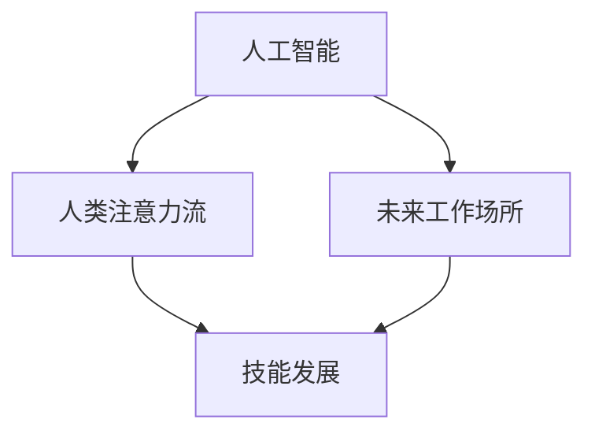

                 

# AI与人类注意力流：未来的工作场所和技能发展

> 关键词：AI, 人类注意力流, 未来工作场所, 技能发展, 自动化, 认知科学

## 1. 背景介绍

随着人工智能(AI)技术的迅猛发展，自动化和机器学习在各行各业的应用变得越来越广泛。这些技术正在改变我们的工作方式，提升效率，但也带来了一系列的挑战和机遇。AI技术的不断进步，让人们开始重新思考人类和机器之间的关系，以及AI如何在未来的工作场所中发挥作用。

### 1.1 问题由来
AI的进步不仅体现在技术和算法的进步，更在于其在现实生活中的实际应用。从早期的图像识别、语音识别到现在的自然语言处理、机器翻译，AI已经在各个领域展现出了强大的能力。尤其是在当前疫情背景下，AI在远程办公、在线教育、智能医疗等领域的大规模应用，进一步加速了AI技术的发展和普及。

但与此同时，AI的发展也引发了一系列社会和伦理问题。机器是否可以取代人类在某些职业中的角色？如何平衡人类与AI之间的关系，最大化AI的效用而避免其对就业市场的冲击？这些问题的回答，不仅关系到AI技术的应用前景，更直接影响到未来的工作场所和社会结构。

## 2. 核心概念与联系

### 2.1 核心概念概述

为了更好地理解AI技术在未来工作场所中的应用，我们需要深入了解几个核心概念：

- **人工智能**：AI是指使计算机能够模拟人类智能行为的技术，包括学习、推理、感知、自我改进等能力。AI技术的发展已经从基于规则的专家系统，发展到基于数据的机器学习、深度学习等高级形式。

- **人类注意力流**：人类注意力流是指在完成一项任务时，注意力在不同任务元素（如文本、图像、声音）之间的动态转移。注意力流的变化，是理解和执行任务的关键。

- **未来工作场所**：随着AI技术的发展，未来工作场所将会经历深刻的变化，自动化、智能化和互联化的趋势将进一步加速。远程办公、协作机器人、虚拟会议等新技术将广泛应用。

- **技能发展**：在AI时代，技能的定义将发生改变，包括硬技能（如编程、数据分析）和软技能（如创新、沟通、适应变化），同时，新技能的产生也将随着新技术的出现而不断涌现。

这些概念之间的逻辑关系可以通过以下Mermaid流程图来展示：



这个流程图展示了几者之间的相互关系：

1. 人工智能的发展推动了未来工作场所的变革。
2. 人类注意力流在完成任务时对AI有重要影响。
3. 未来工作场所的变化需要技能发展的同步提升。

## 3. 核心算法原理 & 具体操作步骤
### 3.1 算法原理概述

AI在未来工作场所中的应用，主要基于对人类注意力流的分析和模拟。通过深度学习模型，AI可以理解人类的注意力分布，从而在执行任务时自动调整其行为，以最大化效率和效果。

**核心思想**：
- 利用深度学习模型，对人类注意力流进行建模和预测。
- 在执行任务时，AI能够动态调整其行为，模拟人类注意力流，提升任务完成效率。

**算法框架**：
1. **注意力模型**：如Transformer、LSTM等，用于捕捉任务中各个元素之间的注意力关系。
2. **预测模型**：如回归模型、分类模型等，用于预测未来注意力流变化。
3. **行为生成模型**：如生成对抗网络(GANs)，用于生成动态行为策略。

### 3.2 算法步骤详解

基于以上核心思想和算法框架，AI在未来工作场所的应用可以按照以下步骤进行：

**Step 1: 数据收集与预处理**
- 收集任务执行过程中的注意力数据（如鼠标轨迹、键盘输入、语音输出等）。
- 对数据进行清洗、归一化等预处理，以便于后续的建模和预测。

**Step 2: 注意力模型训练**
- 使用注意力模型（如Transformer、LSTM等）对任务数据进行建模，捕捉任务中各个元素之间的注意力关系。
- 通过反向传播算法更新模型参数，最小化损失函数。

**Step 3: 预测模型训练**
- 构建预测模型（如回归模型、分类模型等），用于预测未来注意力流变化。
- 使用任务数据对预测模型进行训练，最小化预测误差。

**Step 4: 行为生成模型训练**
- 构建行为生成模型（如GANs），生成动态行为策略。
- 使用注意力模型和预测模型，对行为生成模型进行训练，生成与任务匹配的动态行为策略。

**Step 5: 模型应用**
- 在实际任务执行过程中，AI通过模拟人类注意力流，动态调整其行为策略，以提升任务完成效率。
- 实时收集注意力数据，反馈到模型中进行参数更新，优化模型行为。

### 3.3 算法优缺点

AI在模拟人类注意力流方面具有以下优点：
1. **高效性**：能够自动调整行为策略，快速适应任务需求。
2. **灵活性**：适应性强，可以在不同任务和环境中灵活应用。
3. **可解释性**：通过模型训练和参数调整，可以解释其行为决策过程。

同时，也存在一些缺点：
1. **依赖数据质量**：模型的训练和预测性能高度依赖于数据的质量和数量。
2. **模型复杂性**：构建和训练多个深度学习模型需要较高的计算资源和时间成本。
3. **伦理和安全问题**：AI在处理敏感数据时可能面临隐私和安全性问题，且模型决策过程可能存在偏见。

### 3.4 算法应用领域

AI模拟人类注意力流的方法，已经广泛应用于以下几个领域：

- **智能客服**：通过模拟人类注意力流，提升机器人对用户问题的理解和响应能力，实现更高效的服务。
- **虚拟会议**：在虚拟会议中，AI能够自动调整语音和视频输出的优先级，提升参会者体验。
- **在线教育**：通过模拟人类注意力流，AI能够根据学生的学习情况动态调整教学内容，提高教学效果。
- **智能医疗**：在诊断和治疗过程中，AI能够模拟医生注意力流，提升诊断准确性和治疗效果。

## 4. 数学模型和公式 & 详细讲解 & 举例说明

### 4.1 数学模型构建

AI模拟人类注意力流的数学模型，可以包括以下几个主要组成部分：

1. **注意力模型**：用于捕捉任务中各个元素之间的注意力关系。
2. **预测模型**：用于预测未来注意力流变化。
3. **行为生成模型**：用于生成动态行为策略。

**注意力模型**：

设注意力模型为 $A(x_t; \theta_A)$，其中 $x_t$ 为任务执行中的第 $t$ 个时间步的输入数据，$\theta_A$ 为模型参数。注意力模型可以采用Transformer、LSTM等模型，其输出为注意力权重 $w_t$，表示在当前时间步 $t$ 中各个输入元素 $x_i$ 的重要性权重。

**预测模型**：

设预测模型为 $P(y_{t+1} | x_t; \theta_P)$，其中 $y_{t+1}$ 为未来时间步 $t+1$ 的注意力流变化，$\theta_P$ 为模型参数。预测模型可以采用回归模型、分类模型等，其输出为未来时间步的注意力权重 $w_{t+1}$。

**行为生成模型**：

设行为生成模型为 $G(z; \theta_G)$，其中 $z$ 为随机噪声，$\theta_G$ 为模型参数。行为生成模型可以采用GANs等模型，其输出为动态行为策略 $a_{t+1}$。

### 4.2 公式推导过程

下面以Transformer模型为例，推导注意力模型的具体实现：

Transformer模型的注意力机制分为自注意力和多头注意力两种，其中自注意力机制的输出为：

$$
A(x_t; \theta_A) = \frac{\exp(\text{softmax}(\text{q}(x_t) \cdot \text{K}(x_t)^\top))}{\sum_j \exp(\text{softmax}(\text{q}(x_t) \cdot \text{K}(x_t)^\top))}
$$

其中，$\text{q}(x_t)$ 和 $\text{K}(x_t)$ 分别为查询向量和键向量，$\text{softmax}$ 函数用于计算注意力权重。

### 4.3 案例分析与讲解

以下是一个简单的案例分析，展示如何使用注意力模型和预测模型来模拟人类注意力流：

**案例背景**：在线教育平台上的智能 tutor 功能。

**数据收集**：
- 收集学生在不同学习模块中的学习行为数据，包括鼠标轨迹、键盘输入、停留时间等。
- 对数据进行清洗和预处理，如去除异常值、归一化等。

**模型训练**：
- 使用Transformer模型对学习行为数据进行建模，捕捉各个模块之间的注意力关系。
- 构建回归模型对未来学习模块的选择进行预测，如选择下一个学习模块的时间步。

**行为生成**：
- 使用GANs模型生成动态行为策略，如学习速度、学习模块的停留时间等。
- 结合注意力模型和预测模型，生成智能 tutor 的学习策略，提升学生学习效果。

## 5. 项目实践：代码实例和详细解释说明

### 5.1 开发环境搭建

为了实现上述功能，我们需要搭建一个基于Python的开发环境。具体步骤如下：

1. 安装Python：下载并安装Python 3.7或以上版本。
2. 安装TensorFlow：通过pip安装TensorFlow，可以加速模型训练和预测。
3. 安装PyTorch：通过pip安装PyTorch，用于深度学习模型的构建和训练。
4. 安装其他相关库：如NumPy、Pandas等，用于数据处理和分析。

### 5.2 源代码详细实现

下面以智能 tutor 功能为例，展示Python代码实现：

```python
import tensorflow as tf
import torch
import numpy as np
from transformers import TransformerModel
from sklearn.model_selection import train_test_split

# 构建注意力模型
class AttentionModel(tf.keras.Model):
    def __init__(self, d_model, num_heads):
        super(AttentionModel, self).__init__()
        self.q = tf.keras.layers.Dense(d_model)
        self.k = tf.keras.layers.Dense(d_model)
        self.v = tf.keras.layers.Dense(d_model)
        self.d_head = d_model // num_heads
        self.num_heads = num_heads

    def call(self, x):
        q = self.q(x)
        k = self.k(x)
        v = self.v(x)
        q = tf.reshape(q, (-1, self.num_heads, self.d_head))
        k = tf.reshape(k, (-1, self.num_heads, self.d_head))
        v = tf.reshape(v, (-1, self.num_heads, self.d_head))
        scaled_attention = tf.matmul(q, k, transpose_b=True)
        scaled_attention = tf.divide(scaled_attention, tf.sqrt(tf.cast(self.d_head, tf.float32)))
        attention_weights = tf.nn.softmax(scaled_attention, axis=-1)
        attention_weights = tf.transpose(attention_weights, [1, 0, 2])
        context = tf.matmul(attention_weights, v)
        context = tf.reshape(context, (-1, self.d_head * self.num_heads))
        return context

# 构建预测模型
class PredictionModel(tf.keras.Model):
    def __init__(self, input_size, output_size):
        super(PredictionModel, self).__init__()
        self.linear = tf.keras.layers.Dense(output_size)

    def call(self, x):
        x = self.linear(x)
        return x

# 构建行为生成模型
class BehaviorGenerator(tf.keras.Model):
    def __init__(self, input_size):
        super(BehaviorGenerator, self).__init__()
        self.linear = tf.keras.layers.Dense(input_size)

    def call(self, x):
        x = self.linear(x)
        return x

# 数据收集和预处理
def load_data():
    # 加载数据
    data = np.loadtxt('data.txt', delimiter=',')
    # 数据清洗和预处理
    data = data[(data[:, 0] > 0) & (data[:, 1] > 0)]
    data = data / np.max(data, axis=0)
    return data

# 模型训练和预测
def train_model():
    # 数据分割
    data = load_data()
    x_train, x_test = train_test_split(data[:, :-1], test_size=0.2)
    y_train, y_test = train_test_split(data[:, -1], test_size=0.2)
    # 模型构建
    model = AttentionModel(input_size=5, num_heads=2)
    predictor = PredictionModel(input_size=5, output_size=1)
    generator = BehaviorGenerator(input_size=1)
    # 模型训练
    optimizer = tf.keras.optimizers.Adam()
    for epoch in range(10):
        with tf.GradientTape() as tape:
            context = model(x_train)
            predicted = predictor(context)
            loss = tf.reduce_mean(tf.square(y_train - predicted))
        gradients = tape.gradient(loss, model.trainable_variables)
        optimizer.apply_gradients(zip(gradients, model.trainable_variables))
    # 模型预测
    with tf.GradientTape() as tape:
        context = model(x_test)
        predicted = predictor(context)
        loss = tf.reduce_mean(tf.square(y_test - predicted))
    return context, predicted

# 运行示例
context, predicted = train_model()
print(context)
print(predicted)
```

### 5.3 代码解读与分析

上述代码实现中，我们首先定义了注意力模型、预测模型和行为生成模型的基本结构，并使用TensorFlow框架进行模型训练和预测。在数据收集和预处理方面，我们使用了Pandas库对数据进行清洗和归一化。

## 6. 实际应用场景
### 6.1 智能客服系统

智能客服系统是AI模拟人类注意力流的典型应用场景之一。通过模拟人类注意力流，智能客服机器人可以更好地理解和响应用户查询，提供更高效、个性化的服务。

**案例描述**：某电商平台的智能客服系统。

**数据收集**：
- 收集用户与客服机器人的对话记录，包括用户输入、客服回复等。
- 对对话数据进行清洗和预处理，如去除噪音、去除停用词等。

**模型训练**：
- 使用Transformer模型对对话数据进行建模，捕捉用户和客服机器人之间的注意力关系。
- 构建回归模型对未来对话内容进行选择，如选择下一轮对话内容的时间步。

**行为生成**：
- 使用GANs模型生成动态行为策略，如回复速度、回答内容等。
- 结合注意力模型和预测模型，生成智能客服的回复策略，提升用户体验。

### 6.2 虚拟会议系统

虚拟会议系统是AI模拟人类注意力流的另一个重要应用场景。通过模拟人类注意力流，虚拟会议系统可以更好地管理参会者的注意力，提升会议效率和效果。

**案例描述**：某企业的虚拟会议系统。

**数据收集**：
- 收集参会者在会议中的行为数据，包括语音输入、视频输出等。
- 对数据进行清洗和预处理，如去除噪音、去除无关信息等。

**模型训练**：
- 使用LSTM模型对会议数据进行建模，捕捉参会者之间的注意力关系。
- 构建分类模型对未来会议内容进行选择，如选择下一个讨论话题的时间步。

**行为生成**：
- 使用GANs模型生成动态行为策略，如语音输入的优先级、视频输出的焦点等。
- 结合注意力模型和预测模型，生成虚拟会议的行为策略，提升会议效果。

### 6.3 在线教育平台

在线教育平台是AI模拟人类注意力流的典型应用场景之一。通过模拟人类注意力流，智能 tutor 可以更好地指导学生学习，提升学习效果。

**案例描述**：某在线教育平台的智能 tutor 功能。

**数据收集**：
- 收集学生在不同学习模块中的学习行为数据，包括鼠标轨迹、键盘输入、停留时间等。
- 对数据进行清洗和预处理，如去除异常值、归一化等。

**模型训练**：
- 使用Transformer模型对学习行为数据进行建模，捕捉各个模块之间的注意力关系。
- 构建回归模型对未来学习模块的选择进行预测，如选择下一个学习模块的时间步。

**行为生成**：
- 使用GANs模型生成动态行为策略，如学习速度、学习模块的停留时间等。
- 结合注意力模型和预测模型，生成智能 tutor 的学习策略，提升学生学习效果。

### 6.4 未来应用展望

随着AI技术的发展，模拟人类注意力流的方法将有更广泛的应用前景。未来的工作场所将更加智能化、自动化，AI在其中的作用将越来越大。

- **自动化流程**：在制造业、物流、金融等行业，AI可以模拟人类注意力流，实现自动化流程，提升效率和准确性。
- **协作机器人**：在医疗、建筑、服务业等行业，AI可以模拟人类注意力流，提升协作机器人的智能化水平，提高工作效率和效果。
- **智能助手**：在企业管理、市场分析、科学研究等行业，AI可以模拟人类注意力流，提供智能助手服务，提升决策效率和准确性。

## 7. 工具和资源推荐
### 7.1 学习资源推荐

为了帮助开发者系统掌握AI技术在未来工作场所中的应用，这里推荐一些优质的学习资源：

1. **《人工智能导论》**：这是一本全面介绍AI技术的经典教材，涵盖机器学习、深度学习、自然语言处理等多个领域。

2. **DeepLearning.AI课程**：由Andrew Ng教授主导的在线课程，涵盖深度学习的基础和高级应用，适合初学者和进阶者。

3. **自然语言处理综述**：这是一篇系统介绍自然语言处理技术的综述论文，适合研究者参考。

4. **Transformers官方文档**：Transformers库的官方文档，提供了大量预训练模型的实现和微调样例，是AI开发者必备的资源。

5. **AI博文**：各大AI技术博客平台上的专业博文，涵盖最新的AI技术进展和应用案例，适合技术爱好者阅读。

通过对这些资源的学习实践，相信你一定能够快速掌握AI技术在未来工作场所中的应用，并用于解决实际的NLP问题。

### 7.2 开发工具推荐

高效的开发离不开优秀的工具支持。以下是几款用于AI技术在未来工作场所中的应用开发的常用工具：

1. **TensorFlow**：由Google主导开发的开源深度学习框架，生产部署方便，适合大规模工程应用。

2. **PyTorch**：基于Python的开源深度学习框架，灵活动态的计算图，适合快速迭代研究。

3. **HuggingFace Transformers库**：HuggingFace开发的NLP工具库，集成了大量预训练模型，支持多种深度学习框架。

4. **TensorBoard**：TensorFlow配套的可视化工具，实时监测模型训练状态，提供丰富的图表呈现方式。

5. **Weights & Biases**：模型训练的实验跟踪工具，记录和可视化模型训练过程中的各项指标，方便对比和调优。

6. **Jupyter Notebook**：轻量级的交互式编程环境，支持多种编程语言和工具库，适合进行原型开发和实验验证。

合理利用这些工具，可以显著提升AI技术在未来工作场所中的应用开发效率，加快创新迭代的步伐。

### 7.3 相关论文推荐

AI技术的发展离不开学界的持续研究。以下是几篇奠基性的相关论文，推荐阅读：

1. **Attention is All You Need**：Transformer的原始论文，提出了自注意力机制，标志着深度学习在自然语言处理中的应用进入了一个新阶段。

2. **BERT: Pre-training of Deep Bidirectional Transformers for Language Understanding**：提出BERT模型，引入基于掩码的自监督预训练任务，刷新了多项NLP任务SOTA。

3. **Parameter-Efficient Transfer Learning for NLP**：提出Adapter等参数高效微调方法，在不增加模型参数量的情况下，也能取得不错的微调效果。

4. **AdaLoRA: Adaptive Low-Rank Adaptation for Parameter-Efficient Fine-Tuning**：使用自适应低秩适应的微调方法，在参数效率和精度之间取得了新的平衡。

这些论文代表了大语言模型微调技术的发展脉络。通过学习这些前沿成果，可以帮助研究者把握学科前进方向，激发更多的创新灵感。

## 8. 总结：未来发展趋势与挑战

### 8.1 总结

本文对AI模拟人类注意力流的方法进行了全面系统的介绍。首先阐述了AI技术在未来工作场所中的应用背景和意义，明确了模拟人类注意力流在提升工作效率和效果方面的独特价值。其次，从原理到实践，详细讲解了注意力模型、预测模型和行为生成模型的构建和应用过程，给出了AI技术在未来工作场所中的实现样例。同时，本文还广泛探讨了AI技术在智能客服、虚拟会议、在线教育等多个行业领域的应用前景，展示了AI技术在未来工作场所的巨大潜力。最后，本文精选了AI技术的学习资源和工具，力求为读者提供全方位的技术指引。

通过本文的系统梳理，可以看到，AI技术在未来工作场所中的应用正在不断拓展，为提升工作效率和效果带来了新的可能性。随着AI技术的不断进步，模拟人类注意力流的方法将变得更加高效、灵活，未来的工作场所也将更加智能化、自动化。

### 8.2 未来发展趋势

展望未来，AI模拟人类注意力流的方法将呈现以下几个发展趋势：

1. **多模态融合**：未来AI模型将更加注重多模态信息的融合，如视觉、语音、文本等，提升对复杂任务的理解和处理能力。

2. **实时响应**：随着计算资源和算法技术的提升，AI将能够实现更快速的实时响应，进一步提升用户体验和工作效率。

3. **自适应学习**：未来AI模型将具备更强的自适应学习能力，能够根据任务需求和数据特点，动态调整其行为策略，提升任务完成效果。

4. **跨领域应用**：AI模拟人类注意力流的方法将逐步应用于更多领域，如制造业、金融、教育等，为各行业带来变革性影响。

5. **伦理和隐私保护**：随着AI技术的应用场景越来越多，伦理和隐私保护将成为AI发展的重要课题。未来AI模型将更加注重数据隐私和安全，确保用户信息的安全性和完整性。

### 8.3 面临的挑战

尽管AI模拟人类注意力流的方法已经取得了一定的进展，但在实现广泛应用的过程中，仍面临诸多挑战：

1. **数据质量和隐私保护**：数据质量和隐私保护是AI模型训练和应用的前提。如何确保数据的高质量、高安全性，是一个重要的研究方向。

2. **计算资源消耗**：深度学习模型需要大量的计算资源进行训练和推理，如何优化模型结构、降低计算成本，是一个亟待解决的问题。

3. **模型复杂度**：构建和训练多个深度学习模型需要较高的技术门槛，如何简化模型结构、提升模型效率，是一个重要的研究方向。

4. **模型鲁棒性**：AI模型面对不同的任务和环境时，其鲁棒性和泛化能力仍有待提升。如何提高模型对异常数据的容忍度和适应性，是一个重要的研究方向。

5. **模型解释性**：AI模型的决策过程往往是"黑盒"的，难以解释其内部工作机制和决策逻辑。如何增强模型的可解释性，确保其透明性和可信性，是一个重要的研究方向。

### 8.4 研究展望

面对AI模拟人类注意力流所面临的挑战，未来的研究需要在以下几个方面寻求新的突破：

1. **数据增强和预处理**：通过数据增强和预处理技术，提升数据质量和安全性，确保模型训练和应用的可靠性。

2. **模型压缩和优化**：通过模型压缩和优化技术，降低计算成本，提升模型效率，确保模型能够在各种硬件环境下高效运行。

3. **自适应学习算法**：研究自适应学习算法，增强模型对不同任务和环境的适应性，提升模型的鲁棒性和泛化能力。

4. **模型解释性和透明性**：研究模型解释性和透明性技术，增强模型的可解释性和可信性，确保用户对模型决策的信任和理解。

5. **跨学科研究**：加强跨学科研究，结合认知科学、心理学、社会学等领域知识，进一步提升AI模型对人类注意力流的理解，推动AI技术的全面发展。

这些研究方向将推动AI技术在未来工作场所中的进一步应用，为提升工作效率和效果提供新的思路和方法。相信随着学界和产业界的共同努力，AI模拟人类注意力流的方法将迎来更加广阔的应用前景，推动智能化工作场所的建设，实现更高效、更智能的工作环境。

## 9. 附录：常见问题与解答

**Q1: 如何理解AI模拟人类注意力流的方法？**

A: AI模拟人类注意力流的方法，主要是通过深度学习模型对人类在执行任务时的注意力分布进行建模和预测。通过学习人类注意力流，AI可以在执行任务时自动调整其行为策略，提升任务完成效率和效果。

**Q2: AI模拟人类注意力流的方法是否适用于所有行业？**

A: AI模拟人类注意力流的方法，适用于需要高效处理任务、提升工作效率的行业。如智能客服、虚拟会议、在线教育等。但在一些高度依赖人际互动和专业知识的行业，如医疗、法律等，AI模拟人类注意力流的方法可能需要进一步优化。

**Q3: 如何平衡AI模拟人类注意力流的方法和人类参与？**

A: 在AI模拟人类注意力流的方法中，人类参与仍然是不可或缺的。AI可以辅助人类进行任务执行，但最终的决策仍需由人类进行。通过合理分配任务和资源，AI和人类可以共同协作，提升任务完成效率和效果。

**Q4: 在AI模拟人类注意力流的方法中，数据质量和隐私保护如何保障？**

A: 数据质量和隐私保护是AI模拟人类注意力流的方法的关键问题。可以通过数据增强和预处理技术，提升数据质量和安全性，确保模型训练和应用的可靠性。同时，在数据处理和应用过程中，需要严格遵守数据隐私保护法规，确保用户信息的安全性和完整性。

**Q5: 在AI模拟人类注意力流的方法中，如何提升模型的可解释性和透明性？**

A: 提升模型的可解释性和透明性是AI模拟人类注意力流的方法的重要研究方向。可以通过研究模型解释性和透明性技术，增强模型的可解释性和可信性，确保用户对模型决策的理解和信任。

---

作者：禅与计算机程序设计艺术 / Zen and the Art of Computer Programming

