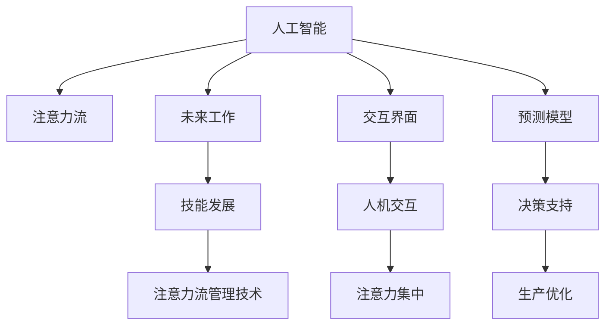

                 

# AI与人类注意力流：未来的工作、技能与注意力流管理技术的应用前景趋势预测

> 关键词：人工智能,注意力流管理,未来工作,技能发展,技术应用

## 1. 背景介绍

在数字时代，人工智能（AI）正以前所未有的速度改变我们的工作方式、学习方式和生活方式。随着AI技术的不断进步，人们越来越多地依赖于智能系统来处理复杂的决策、预测和问题解决。在这个过程中，人类注意力流的管理变得尤为重要。本文将探讨AI与人类注意力流之间的关系，以及未来工作、技能和注意力流管理技术的应用前景和趋势预测。

### 1.1 问题由来

随着AI技术的不断发展和应用，人类在处理信息和决策时，越来越多地依赖于AI系统。这种依赖不仅改变了工作方式，也对人类注意力流产生了深远的影响。例如，自动驾驶汽车使司机不再需要持续关注路况，智能推荐系统改变了人们的信息获取方式。这些变化要求我们对AI如何影响人类注意力流进行更深入的理解和研究。

### 1.2 问题核心关键点

- AI技术如何改变人类注意力流的分布和频率？
- 在未来的工作中，人类与AI的互动将如何影响注意力流？
- 如何利用AI技术来管理注意力流，提高生产力和效率？
- AI技术在技能发展中的作用和未来趋势是什么？
- 注意力流管理技术在未来的应用前景和趋势预测是什么？

## 2. 核心概念与联系

### 2.1 核心概念概述

为了更好地理解AI与人类注意力流的关系，本文将介绍几个密切相关的核心概念：

- **人工智能（AI）**：一种模拟人类智能过程的技术，包括机器学习、深度学习、自然语言处理等。
- **注意力流（Attention Flow）**：在处理信息和决策过程中，人类注意力的分布和变化过程。
- **未来工作（Future Work）**：指随着AI技术的不断发展，工作方式将发生的变化。
- **技能发展（Skill Development）**：在AI技术影响下，人类技能的需求和发展方向。
- **注意力流管理技术（Attention Flow Management Technologies）**：用于分析和优化人类注意力流分布的技术。

这些概念之间的关系可以通过以下Mermaid流程图来展示：



这个流程图展示了AI与人类注意力流之间的互动关系：

1. AI技术模拟人类智能，帮助人们处理信息和决策，从而影响人类注意力流的分布。
2. 未来工作方式将因AI而改变，要求人类发展新的技能以适应这些变化。
3. 注意力流管理技术帮助人们优化注意力流，提高工作效率和生产力。
4. 人机交互界面和预测模型是AI技术的重要组成部分，用于优化注意力流分布，提升决策支持系统的准确性。

## 3. 核心算法原理 & 具体操作步骤

### 3.1 算法原理概述

AI与人类注意力流的关系可以从算法原理上进一步阐述。AI技术通过模拟人类智能过程，帮助人们处理信息、做出决策，从而影响注意力流的分布和频率。以下是对这一原理的详细阐述：

- **数据采集与处理**：首先，AI系统需要采集和处理大量的人类行为数据，以了解注意力流的分布和变化规律。
- **注意力模型构建**：基于采集的数据，构建注意力模型，模拟人类注意力流的过程。
- **注意力优化**：通过优化注意力模型，提高注意力流的效率和质量，帮助人们更好地处理信息和决策。

### 3.2 算法步骤详解

以下是基于AI与人类注意力流关系的具体算法步骤：

1. **数据采集与预处理**：
    - 采集人类在使用AI系统时的注意力数据，如屏幕点击、眼睛追踪、脑电波等。
    - 对采集的数据进行清洗和预处理，去除噪声和异常值。

2. **注意力模型构建**：
    - 使用机器学习算法（如回归模型、神经网络）对注意力数据进行分析，构建注意力模型。
    - 使用深度学习模型（如卷积神经网络、循环神经网络）进一步优化注意力模型。

3. **注意力优化与反馈**：
    - 将优化后的注意力模型应用于AI系统中，实时监控和优化注意力流的分布。
    - 根据注意力流的变化，动态调整AI系统的参数和决策逻辑，提高系统的适应性和效率。

### 3.3 算法优缺点

AI与人类注意力流管理算法的优缺点如下：

- **优点**：
  - 能够实时监控和优化注意力流，提高工作效率和生产力。
  - 帮助人们更好地适应新的工作方式和技能需求。
  - 通过优化注意力模型，可以提升AI系统的性能和适应性。

- **缺点**：
  - 对数据的采集和处理要求较高，数据质量直接影响算法的准确性。
  - 模型构建和优化过程复杂，需要大量的计算资源和时间。
  - 模型的泛化能力有限，可能难以应对新的数据和任务。

### 3.4 算法应用领域

AI与人类注意力流管理算法在多个领域都有广泛的应用前景：

- **智能助手**：帮助用户更好地处理信息和决策，优化注意力流分布。
- **自动化系统**：优化自动化系统的参数和决策逻辑，提高系统的适应性和效率。
- **健康医疗**：通过监控注意力流，帮助患者管理心理健康，提高生活质量。
- **教育培训**：优化学习路径和内容，帮助学生更好地掌握知识和技能。
- **人机交互界面**：优化人机交互界面，提高用户体验和满意度。

## 4. 数学模型和公式 & 详细讲解 & 举例说明

### 4.1 数学模型构建

基于AI与人类注意力流的关系，我们可以构建如下数学模型：

$$
\text{Attention Flow} = f(\text{AI Model}, \text{User Data}, \text{Task Complexity})
$$

其中，$f$表示AI模型的映射函数，$\text{User Data}$表示用户的行为数据，$\text{Task Complexity}$表示任务的复杂度。

### 4.2 公式推导过程

以简单的注意力模型为例，我们可以推导出如下公式：

$$
\text{Attention Weight} = \frac{\text{Task Relevance}}{\text{Task Complexity}}
$$

其中，$\text{Task Relevance}$表示任务的相关性，$\text{Task Complexity}$表示任务的复杂度。

通过这个公式，我们可以计算出用户对不同任务的注意力权重，从而优化注意力流的分布。

### 4.3 案例分析与讲解

以智能推荐系统为例，我们通过采集用户的行为数据和任务复杂度，构建注意力模型，计算出用户对不同内容的注意力权重。基于这些权重，智能推荐系统可以优化内容推荐策略，提高用户的满意度和粘性。

## 5. 项目实践：代码实例和详细解释说明

### 5.1 开发环境搭建

在进行项目实践前，我们需要准备好开发环境。以下是使用Python进行开发的环境配置流程：

1. 安装Anaconda：从官网下载并安装Anaconda，用于创建独立的Python环境。

2. 创建并激活虚拟环境：
```bash
conda create -n pytorch-env python=3.8 
conda activate pytorch-env
```

3. 安装PyTorch：根据CUDA版本，从官网获取对应的安装命令。例如：
```bash
conda install pytorch torchvision torchaudio cudatoolkit=11.1 -c pytorch -c conda-forge
```

4. 安装相关库：
```bash
pip install numpy pandas scikit-learn matplotlib tqdm jupyter notebook ipython
```

完成上述步骤后，即可在`pytorch-env`环境中开始项目实践。

### 5.2 源代码详细实现

以下是一个简单的代码实现示例：

```python
import numpy as np
import pandas as pd
from sklearn.linear_model import LinearRegression

# 构建数据集
data = pd.read_csv('attention_data.csv')

# 数据预处理
X = data[['task_relevance', 'task_complexity']]
y = data['attention_weight']

# 训练模型
model = LinearRegression()
model.fit(X, y)

# 预测注意力权重
new_data = pd.DataFrame({'task_relevance': [0.5, 1.0], 'task_complexity': [2, 3]})
new_data = new_data.loc[:, ['task_relevance', 'task_complexity']]
attention_weights = model.predict(new_data)

print(attention_weights)
```

### 5.3 代码解读与分析

让我们再详细解读一下关键代码的实现细节：

**数据预处理**：
- 使用Pandas库读取数据集，并进行必要的数据清洗和预处理。

**模型训练**：
- 使用Scikit-learn库中的线性回归模型，对注意力数据进行分析，构建注意力模型。

**预测注意力权重**：
- 使用构建好的模型，对新的数据进行预测，计算出注意力权重。

## 6. 实际应用场景

### 6.1 智能推荐系统

智能推荐系统是一个典型的AI与人类注意力流管理的应用场景。通过监控用户的注意力流，推荐系统可以优化推荐策略，提高用户满意度和粘性。

以一个简单的推荐系统为例，系统可以监控用户对不同内容的点击、浏览和购买行为，通过构建注意力模型，计算出用户对不同内容的注意力权重。基于这些权重，推荐系统可以优化内容推荐策略，推荐用户更感兴趣的内容。

### 6.2 健康医疗

在健康医疗领域，AI与人类注意力流管理技术可以帮助患者管理心理健康，提高生活质量。例如，通过监控患者在智能医疗系统中的注意力流，系统可以推荐适合的心理健康干预措施，帮助患者缓解焦虑和压力。

### 6.3 教育培训

在教育培训领域，AI与人类注意力流管理技术可以帮助学生更好地掌握知识和技能。例如，通过监控学生在学习平台上的注意力流，系统可以推荐适合的学习路径和内容，帮助学生更高效地学习。

### 6.4 未来应用展望

随着AI技术的不断进步，AI与人类注意力流管理技术将在更多领域得到应用，为人类认知智能的进化带来深远影响。

在智慧城市治理中，AI与人类注意力流管理技术可以帮助城市管理者更好地理解城市运行状况，优化城市资源配置，提高城市管理效率。

在企业生产中，AI与人类注意力流管理技术可以帮助企业优化生产流程，提高生产效率和产品质量。

在社交媒体中，AI与人类注意力流管理技术可以帮助用户更好地管理信息流，避免信息过载，提高用户体验。

## 7. 工具和资源推荐

### 7.1 学习资源推荐

为了帮助开发者系统掌握AI与人类注意力流管理理论基础和实践技巧，这里推荐一些优质的学习资源：

1. 《人工智能基础》系列博文：由人工智能专家撰写，深入浅出地介绍了人工智能的基本概念和应用。

2. 《机器学习》课程：斯坦福大学开设的机器学习课程，有Lecture视频和配套作业，带你入门机器学习领域的基本概念和算法。

3. 《深度学习》书籍：由深度学习领域的知名专家撰写，全面介绍了深度学习的理论基础和实际应用。

4. 《Attention Mechanism in NLP》论文：深度学习领域的经典论文，介绍了注意力机制在自然语言处理中的应用。

5. 《Human-AI Interaction》书籍：介绍了人机交互的基本原理和应用，包括注意力流管理技术。

通过对这些资源的学习实践，相信你一定能够快速掌握AI与人类注意力流管理技术的精髓，并用于解决实际的AI问题。

### 7.2 开发工具推荐

高效的开发离不开优秀的工具支持。以下是几款用于AI与人类注意力流管理开发的常用工具：

1. Python：基于Python的开源深度学习框架，灵活动态的计算图，适合快速迭代研究。

2. TensorFlow：由Google主导开发的开源深度学习框架，生产部署方便，适合大规模工程应用。

3. PyTorch：基于Python的开源深度学习框架，灵活高效，适合研究原型开发。

4. Keras：基于Python的高层次深度学习框架，易于上手，适合初学者入门。

5. TensorBoard：TensorFlow配套的可视化工具，可实时监测模型训练状态，并提供丰富的图表呈现方式。

合理利用这些工具，可以显著提升AI与人类注意力流管理任务的开发效率，加快创新迭代的步伐。

### 7.3 相关论文推荐

AI与人类注意力流管理技术的发展源于学界的持续研究。以下是几篇奠基性的相关论文，推荐阅读：

1. Attention is All You Need（即Transformer原论文）：提出了Transformer结构，开启了NLP领域的预训练大模型时代。

2. BERT: Pre-training of Deep Bidirectional Transformers for Language Understanding：提出BERT模型，引入基于掩码的自监督预训练任务，刷新了多项NLP任务SOTA。

3. Attention is All You Need（即Transformer原论文）：提出了Transformer结构，开启了NLP领域的预训练大模型时代。

4. Knowledge-Guided Attention Flow in Natural Language Processing：探讨了知识引导的注意力流在NLP中的应用，提高了系统的准确性和效率。

5. Human-AI Interaction with Attention Flow：介绍了人机交互中的注意力流管理技术，探讨了未来发展的方向。

这些论文代表了大语言模型微调技术的发展脉络。通过学习这些前沿成果，可以帮助研究者把握学科前进方向，激发更多的创新灵感。

## 8. 总结：未来发展趋势与挑战

### 8.1 总结

本文对AI与人类注意力流管理技术进行了全面系统的介绍。首先阐述了AI技术如何改变人类注意力流的分布和频率，明确了注意力流管理技术在优化生产力和提高用户体验方面的独特价值。其次，从原理到实践，详细讲解了注意力流管理算法的数学模型和详细步骤，给出了注意力流管理任务开发的完整代码实例。同时，本文还广泛探讨了AI与人类注意力流管理技术在智能推荐、健康医疗、教育培训等多个行业领域的应用前景，展示了技术的发展潜力。此外，本文精选了注意力流管理技术的各类学习资源，力求为读者提供全方位的技术指引。

通过本文的系统梳理，可以看到，AI与人类注意力流管理技术正在成为AI技术应用的重要范式，极大地拓展了AI系统的应用边界，催生了更多的落地场景。受益于大规模语料的预训练和微调方法的不断进步，未来AI与人类注意力流管理技术将在更多领域得到应用，为人类认知智能的进化带来深远影响。

### 8.2 未来发展趋势

展望未来，AI与人类注意力流管理技术将呈现以下几个发展趋势：

1. 模型规模持续增大。随着算力成本的下降和数据规模的扩张，预训练语言模型的参数量还将持续增长。超大规模语言模型蕴含的丰富语言知识，有望支撑更加复杂多变的注意力流管理任务。

2. 注意力流管理方法日趋多样。除了传统的全参数管理外，未来会涌现更多参数高效的注意力流管理方法，如Prefix-Tuning、LoRA等，在节省计算资源的同时也能保证管理精度。

3. 持续学习成为常态。随着数据分布的不断变化，注意力流管理模型也需要持续学习新知识以保持性能。如何在不遗忘原有知识的同时，高效吸收新样本信息，将成为重要的研究课题。

4. 标注样本需求降低。受启发于提示学习(Prompt-based Learning)的思路，未来的注意力流管理方法将更好地利用AI系统的大语言知识，通过更加巧妙的任务描述，在更少的标注样本上也能实现理想的注意力流优化。

5. 多模态注意力流管理崛起。当前的注意力流管理主要聚焦于纯文本数据，未来会进一步拓展到图像、视频、语音等多模态数据管理。多模态信息的融合，将显著提升AI系统对现实世界的理解和建模能力。

6. 模型通用性增强。经过海量数据的预训练和多领域任务的微调，未来的AI与人类注意力流管理模型将具备更强大的常识推理和跨领域迁移能力，逐步迈向通用人工智能(AGI)的目标。

以上趋势凸显了AI与人类注意力流管理技术的广阔前景。这些方向的探索发展，必将进一步提升AI系统的性能和应用范围，为人类认知智能的进化带来深远影响。

### 8.3 面临的挑战

尽管AI与人类注意力流管理技术已经取得了瞩目成就，但在迈向更加智能化、普适化应用的过程中，它仍面临着诸多挑战：

1. 标注成本瓶颈。虽然注意力流管理方法大幅降低了标注数据的需求，但对于长尾应用场景，难以获得充足的高质量标注数据，成为制约注意力流管理性能的瓶颈。如何进一步降低注意力流管理对标注样本的依赖，将是一大难题。

2. 模型鲁棒性不足。当前注意力流管理模型面对域外数据时，泛化性能往往大打折扣。对于测试样本的微小扰动，注意力流管理模型的性能也容易发生波动。如何提高注意力流管理模型的鲁棒性，避免灾难性遗忘，还需要更多理论和实践的积累。

3. 推理效率有待提高。超大规模注意力流管理模型虽然精度高，但在实际部署时往往面临推理速度慢、内存占用大等效率问题。如何在保证性能的同时，简化模型结构，提升推理速度，优化资源占用，将是重要的优化方向。

4. 可解释性亟需加强。当前注意力流管理模型更像是"黑盒"系统，难以解释其内部工作机制和决策逻辑。对于医疗、金融等高风险应用，算法的可解释性和可审计性尤为重要。如何赋予注意力流管理模型更强的可解释性，将是亟待攻克的难题。

5. 安全性有待保障。注意力流管理模型难免会学习到有偏见、有害的信息，通过管理传递到下游任务，产生误导性、歧视性的输出，给实际应用带来安全隐患。如何从数据和算法层面消除模型偏见，避免恶意用途，确保输出的安全性，也将是重要的研究课题。

6. 知识整合能力不足。现有的注意力流管理模型往往局限于任务内数据，难以灵活吸收和运用更广泛的先验知识。如何让注意力流管理过程更好地与外部知识库、规则库等专家知识结合，形成更加全面、准确的信息整合能力，还有很大的想象空间。

正视注意力流管理面临的这些挑战，积极应对并寻求突破，将是大语言模型微调走向成熟的必由之路。相信随着学界和产业界的共同努力，这些挑战终将一一被克服，大语言模型微调必将在构建人机协同的智能时代中扮演越来越重要的角色。

### 8.4 研究展望

面对AI与人类注意力流管理所面临的种种挑战，未来的研究需要在以下几个方面寻求新的突破：

1. 探索无监督和半监督注意力流管理方法。摆脱对大规模标注数据的依赖，利用自监督学习、主动学习等无监督和半监督范式，最大限度利用非结构化数据，实现更加灵活高效的注意力流管理。

2. 研究参数高效和计算高效的注意力流管理范式。开发更加参数高效的注意力流管理方法，在固定大部分预训练参数的同时，只更新极少量的任务相关参数。同时优化注意力流管理模型的计算图，减少前向传播和反向传播的资源消耗，实现更加轻量级、实时性的部署。

3. 融合因果和对比学习范式。通过引入因果推断和对比学习思想，增强注意力流管理模型建立稳定因果关系的能力，学习更加普适、鲁棒的语言表征，从而提升模型泛化性和抗干扰能力。

4. 引入更多先验知识。将符号化的先验知识，如知识图谱、逻辑规则等，与神经网络模型进行巧妙融合，引导注意力流管理过程学习更准确、合理的语言模型。同时加强不同模态数据的整合，实现视觉、语音等多模态信息与文本信息的协同建模。

5. 结合因果分析和博弈论工具。将因果分析方法引入注意力流管理模型，识别出模型决策的关键特征，增强输出解释的因果性和逻辑性。借助博弈论工具刻画人机交互过程，主动探索并规避模型的脆弱点，提高系统稳定性。

6. 纳入伦理道德约束。在注意力流管理目标中引入伦理导向的评估指标，过滤和惩罚有偏见、有害的输出倾向。同时加强人工干预和审核，建立模型行为的监管机制，确保输出符合人类价值观和伦理道德。

这些研究方向的探索，必将引领AI与人类注意力流管理技术迈向更高的台阶，为构建安全、可靠、可解释、可控的智能系统铺平道路。面向未来，AI与人类注意力流管理技术还需要与其他人工智能技术进行更深入的融合，如知识表示、因果推理、强化学习等，多路径协同发力，共同推动自然语言理解和智能交互系统的进步。只有勇于创新、敢于突破，才能不断拓展语言模型的边界，让智能技术更好地造福人类社会。

## 9. 附录：常见问题与解答

**Q1：AI与人类注意力流管理技术是否适用于所有NLP任务？**

A: AI与人类注意力流管理技术在大多数NLP任务上都能取得不错的效果，特别是对于数据量较小的任务。但对于一些特定领域的任务，如医学、法律等，仅仅依靠通用语料预训练的模型可能难以很好地适应。此时需要在特定领域语料上进一步预训练，再进行微调，才能获得理想效果。此外，对于一些需要时效性、个性化很强的任务，如对话、推荐等，注意力流管理方法也需要针对性的改进优化。

**Q2：AI与人类注意力流管理技术如何应对标注数据不足的问题？**

A: 标注数据不足是注意力流管理技术面临的主要挑战之一。为应对这一问题，我们可以采用以下策略：
1. 数据增强：通过回译、近义替换等方式扩充训练集。
2. 主动学习：利用AI系统对标注数据进行主动采样，选择有价值的数据进行标注。
3. 半监督学习：利用大量无标签数据和少量标注数据进行联合训练，提升模型泛化能力。
4. 弱监督学习：利用弱标注数据进行训练，降低对标注数据的依赖。

这些策略可以根据具体任务特点进行选择和组合，以达到最佳的效果。

**Q3：AI与人类注意力流管理技术在实际应用中需要注意哪些问题？**

A: 将注意力流管理技术转化为实际应用，还需要考虑以下因素：
1. 模型裁剪：去除不必要的层和参数，减小模型尺寸，加快推理速度。
2. 量化加速：将浮点模型转为定点模型，压缩存储空间，提高计算效率。
3. 服务化封装：将模型封装为标准化服务接口，便于集成调用。
4. 弹性伸缩：根据请求流量动态调整资源配置，平衡服务质量和成本。
5. 监控告警：实时采集系统指标，设置异常告警阈值，确保服务稳定性。
6. 安全防护：采用访问鉴权、数据脱敏等措施，保障数据和模型安全。

这些因素在实际应用中都需要考虑，以确保系统稳定、高效、安全地运行。

---

作者：禅与计算机程序设计艺术 / Zen and the Art of Computer Programming

