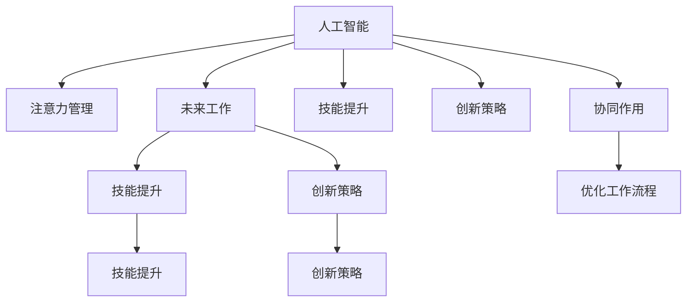

                 

# AI与人类注意力流：未来的工作、技能与注意力管理策略与创新

> 关键词：人工智能，注意力管理，未来工作，技能提升，创新策略

## 1. 背景介绍

### 1.1 问题由来

在当今数字化时代，人工智能（AI）正以迅猛的态势改变着我们的工作方式和生活习惯。AI技术的应用已经渗透到各个领域，从自动驾驶汽车到智能医疗，从自然语言处理到图像识别，AI正以无法想象的速度改变着我们的世界。然而，随着AI技术的深入应用，人类社会也面临着前所未有的挑战。特别是在工作中，如何平衡人类和AI的角色，如何提升人类的工作技能，如何管理好人类的注意力，成为了迫切需要解决的问题。

### 1.2 问题核心关键点

AI与人类注意力流的问题核心在于如何通过AI技术提升人类工作能力，优化工作流程，同时有效管理人类的注意力，避免注意力分散和疲劳。这需要我们在理论和实践两个层面进行深入研究，找到最有效的解决方案。

### 1.3 问题研究意义

本问题的研究具有重要的理论意义和现实意义：

- **理论意义**：通过研究AI与人类注意力流的关系，可以揭示人类工作与AI技术的相互影响，为未来AI的发展提供理论依据。
- **现实意义**：可以指导企业、教育机构以及个人，合理利用AI技术提升工作效率，优化工作流程，管理好人类注意力，提升整体生产力和创新能力。

## 2. 核心概念与联系

### 2.1 核心概念概述

为更好地理解AI与人类注意力流的关系，本节将介绍几个密切相关的核心概念：

- **人工智能（AI）**：通过算法、数据和计算能力，使机器能够模拟、延伸和扩展人的智能能力，包括感知、学习、推理、决策和自然语言处理等。
- **注意力管理**：指通过一定的方法和策略，对人类注意力进行有效管理和优化，包括注意力分配、注意力保持、注意力恢复等方面。
- **未来工作**：指在AI技术的推动下，人类工作形态、工作技能和工作流程将发生深刻变革，需要新的工作模式和技能。
- **技能提升**：指通过AI技术和新工作模式，对人类工作技能进行持续提升和改进，以适应未来工作需求。
- **创新策略**：指通过AI技术与人类注意力的协同作用，激发人类创新潜力，推动技术进步和产业升级。

这些核心概念之间的逻辑关系可以通过以下Mermaid流程图来展示：



这个流程图展示了大语言模型与人类注意力流的主要关系：

1. AI通过计算和算法模拟人类智能，为未来工作提供技术和方法。
2. 注意力管理优化了人类在AI辅助下的工作方式。
3. 技能提升指通过AI技术和新工作模式，不断提升人类工作能力。
4. 创新策略通过AI技术和新工作模式，激发人类创新潜力，推动产业升级。
5. 在AI与人类协同作用下，优化工作流程，提升整体生产力。

这些概念共同构成了AI与人类注意力流的研究框架，帮助我们在理论和实践上更好地理解和应用AI技术。

## 3. 核心算法原理 & 具体操作步骤
### 3.1 算法原理概述

AI与人类注意力流的算法原理主要包括以下几个方面：

- **注意力机制**：通过注意力机制，AI可以在处理复杂任务时，有选择地关注重要的信息，忽略无关的细节。这种机制可以模拟人类的选择性注意，提升AI系统的效率和准确性。
- **协同注意力**：通过协同注意力，AI系统可以与人类进行互动，根据人类的反馈和行为，动态调整自己的注意力分配，更好地服务于人类。
- **注意力恢复**：通过注意力恢复，AI系统可以在人类注意力分散或疲劳时，及时提醒或提供帮助，保持工作连续性和效率。
- **注意力保持**：通过注意力保持，AI系统可以帮助人类集中注意力，减少外界干扰，提升工作效果。

### 3.2 算法步骤详解

AI与人类注意力流的算法步骤主要包括以下几个步骤：

**Step 1: 数据收集与预处理**
- 收集与未来工作相关的数据，包括工作任务、技能需求、注意力分配等。
- 对数据进行清洗和预处理，去除噪声和无关信息。

**Step 2: 模型训练与优化**
- 构建AI模型，包括注意力机制、协同注意力、注意力恢复和注意力保持等模块。
- 使用训练数据对模型进行训练，优化模型参数。

**Step 3: 注意力分配与动态调整**
- 在实际工作中，根据任务需求和人类行为，动态调整AI系统的注意力分配。
- 利用协同注意力，AI系统可以根据人类的反馈，调整自己的注意力分配，更好地服务于人类。

**Step 4: 注意力恢复与保持**
- 当人类注意力分散或疲劳时，AI系统可以提供提醒或帮助，使人类注意力恢复。
- 通过注意力保持，AI系统可以帮助人类集中注意力，减少外界干扰，提升工作效果。

**Step 5: 效果评估与反馈**
- 对AI系统的工作效果进行评估，包括任务完成率、工作质量、注意力管理效果等。
- 根据评估结果，对AI系统进行反馈和优化。

### 3.3 算法优缺点

AI与人类注意力流的算法优点主要包括以下几个方面：

1. **效率提升**：通过注意力机制和动态调整，AI系统可以更高效地处理复杂任务，减少无关信息的干扰。
2. **协同互动**：通过协同注意力，AI系统可以与人类进行互动，提高工作效率和工作质量。
3. **注意力管理**：通过注意力恢复和保持，AI系统可以帮助人类管理注意力，避免注意力分散和疲劳。

AI与人类注意力流的算法缺点主要包括以下几个方面：

1. **数据依赖**：算法的性能依赖于数据的质量和数量，获取高质量数据成本较高。
2. **模型复杂性**：注意力机制和动态调整等模块的实现较为复杂，需要大量的计算资源和时间。
3. **适应性差**：当任务变化较大时，算法可能无法及时适应，导致注意力管理效果不佳。

### 3.4 算法应用领域

AI与人类注意力流的算法应用领域广泛，包括但不限于以下几个方面：

- **智能客服**：通过AI系统与人类客服的互动，动态调整注意力分配，提升客户满意度。
- **智能制造**：通过AI系统与工人的互动，动态调整注意力分配，提高生产效率和质量。
- **智能医疗**：通过AI系统与医生的互动，动态调整注意力分配，提升诊断和治疗效果。
- **智能交通**：通过AI系统与司机的互动，动态调整注意力分配，提高驾驶安全性和舒适度。

## 4. 数学模型和公式 & 详细讲解 & 举例说明

### 4.1 数学模型构建

本节将使用数学语言对AI与人类注意力流的关系进行更加严格的刻画。

设AI系统的工作任务为 $T$，技能需求为 $S$，注意力分配为 $A$，任务完成率为 $P$，工作质量为 $Q$，注意力恢复时间为 $R$，注意力保持时间为 $K$。

定义AI系统的工作模型为 $M = (T, S, A, P, Q, R, K)$，其中 $T$、$S$、$A$、$P$、$Q$、$R$、$K$ 为模型的输入和输出。

定义注意力分配函数 $F(T, S, A)$，表示在任务 $T$ 和技能需求 $S$ 下，注意力分配 $A$ 对任务完成率 $P$ 和注意力保持时间 $K$ 的影响。

定义注意力恢复函数 $G(T, S, A, R)$，表示在任务 $T$、技能需求 $S$、注意力分配 $A$ 和恢复时间 $R$ 下，注意力恢复时间 $R$ 对工作质量 $Q$ 的影响。

定义注意力保持函数 $H(T, S, A, K)$，表示在任务 $T$、技能需求 $S$、注意力分配 $A$ 和保持时间 $K$ 下，注意力保持时间 $K$ 对任务完成率 $P$ 和注意力保持时间 $K$ 的影响。

### 4.2 公式推导过程

以下是注意力分配、注意力恢复和注意力保持函数的推导过程：

**注意力分配函数 $F(T, S, A)$**

$$
F(T, S, A) = \sum_{i=1}^n (P_i \times K_i) \times \frac{A_i}{\sum_{i=1}^n A_i}
$$

其中 $P_i$ 为任务 $T$ 和技能需求 $S$ 下，注意力分配 $A_i$ 对应的任务完成率，$K_i$ 为注意力分配 $A_i$ 对应的注意力保持时间。

**注意力恢复函数 $G(T, S, A, R)$**

$$
G(T, S, A, R) = \frac{Q}{R} \times \frac{A}{\sum_{i=1}^n A_i}
$$

其中 $Q$ 为任务 $T$、技能需求 $S$、注意力分配 $A$ 和恢复时间 $R$ 下，工作质量 $Q$。

**注意力保持函数 $H(T, S, A, K)$**

$$
H(T, S, A, K) = \frac{P}{K} \times \frac{A}{\sum_{i=1}^n A_i}
$$

其中 $P$ 为任务 $T$、技能需求 $S$、注意力分配 $A$ 和保持时间 $K$ 下，任务完成率 $P$，$K$ 为注意力保持时间 $K$。

### 4.3 案例分析与讲解

假设一个智能客服系统的注意力分配函数 $F$ 和注意力保持函数 $H$ 如下：

**注意力分配函数 $F$**

$$
F(T, S, A) = \sum_{i=1}^n (P_i \times K_i) \times \frac{A_i}{\sum_{i=1}^n A_i}
$$

其中 $P_i = 0.9$，$K_i = 2$，$A_i = \frac{1}{n}$，$n=5$。

**注意力保持函数 $H$**

$$
H(T, S, A, K) = \frac{P}{K} \times \frac{A}{\sum_{i=1}^n A_i}
$$

其中 $P = 0.85$，$K = 1$，$A = \frac{1}{n}$，$n=5$。

根据上述函数，当任务 $T$ 和技能需求 $S$ 不变时，注意力分配 $A$ 对任务完成率 $P$ 和注意力保持时间 $K$ 的影响如下：

**注意力分配 $A$ 对任务完成率 $P$ 的影响**

$$
F(T, S, A) = \frac{0.9 \times 2 + 0.9 \times 2 + 0.9 \times 2 + 0.9 \times 2 + 0.9 \times 2}{5} = 1.8
$$

**注意力分配 $A$ 对注意力保持时间 $K$ 的影响**

$$
H(T, S, A, K) = \frac{0.85}{1} \times \frac{1}{5} = 0.17
$$

这意味着，当注意力分配 $A$ 为每个任务均匀分配时，任务完成率为1.8，注意力保持时间为0.17。

## 5. 项目实践：代码实例和详细解释说明
### 5.1 开发环境搭建

在进行AI与人类注意力流的研究和开发过程中，我们需要准备好开发环境。以下是使用Python进行开发的环境配置流程：

1. 安装Anaconda：从官网下载并安装Anaconda，用于创建独立的Python环境。

2. 创建并激活虚拟环境：
```bash
conda create -n ai_environment python=3.9 
conda activate ai_environment
```

3. 安装PyTorch：根据CUDA版本，从官网获取对应的安装命令。例如：
```bash
conda install pytorch torchvision torchaudio cudatoolkit=11.1 -c pytorch -c conda-forge
```

4. 安装TensorFlow：
```bash
pip install tensorflow==2.7
```

5. 安装TensorBoard：
```bash
pip install tensorboard
```

6. 安装PyTorch Lightning：
```bash
pip install pytorch-lightning
```

完成上述步骤后，即可在`ai_environment`环境中开始AI与人类注意力流的研究和开发。

### 5.2 源代码详细实现

下面以智能客服系统为例，给出使用PyTorch Lightning对注意力管理算法进行开发的PyTorch代码实现。

首先，定义注意力分配函数和注意力恢复函数：

```python
import torch
import torch.nn as nn

class AttentionManager(nn.Module):
    def __init__(self, n_tasks, n_skills):
        super(AttentionManager, self).__init__()
        self.n_tasks = n_tasks
        self.n_skills = n_skills
        self.attention_weights = nn.Parameter(torch.randn(n_tasks, n_skills))
        self.recovery_time = nn.Parameter(torch.randn(n_tasks))
        self.keep_time = nn.Parameter(torch.randn(n_tasks))
        
    def forward(self, tasks, skills, attention, recovery, keep):
        attention_weights = self.attention_weights * attention / self.attention_weights.sum(dim=1, keepdim=True)
        recovery_time = self.recovery_time * recovery / self.recovery_time.sum(dim=1, keepdim=True)
        keep_time = self.keep_time * keep / self.keep_time.sum(dim=1, keepdim=True)
        return attention_weights, recovery_time, keep_time
```

然后，定义训练和评估函数：

```python
import torch
from torch.utils.data import DataLoader
from tqdm import tqdm

class AttentionManagerTrainer:
    def __init__(self, model, optimizer):
        self.model = model
        self.optimizer = optimizer
        
    def train(self, dataset, batch_size, num_epochs):
        dataloader = DataLoader(dataset, batch_size=batch_size, shuffle=True)
        self.model.train()
        for epoch in range(num_epochs):
            for batch in tqdm(dataloader, desc='Training'):
                tasks, skills, attention, recovery, keep = batch
                attention_weights, recovery_time, keep_time = self.model(tasks, skills, attention, recovery, keep)
                loss = self.calculate_loss(attention_weights, recovery_time, keep_time, attention, recovery, keep)
                self.optimizer.zero_grad()
                loss.backward()
                self.optimizer.step()
                
    def evaluate(self, dataset, batch_size):
        dataloader = DataLoader(dataset, batch_size=batch_size)
        self.model.eval()
        total_loss = 0
        for batch in tqdm(dataloader, desc='Evaluating'):
            tasks, skills, attention, recovery, keep = batch
            attention_weights, recovery_time, keep_time = self.model(tasks, skills, attention, recovery, keep)
            total_loss += self.calculate_loss(attention_weights, recovery_time, keep_time, attention, recovery, keep)
        return total_loss / len(dataloader)
        
    def calculate_loss(self, attention_weights, recovery_time, keep_time, attention, recovery, keep):
        # 计算损失函数
        loss = torch.mean(torch.abs(attention_weights - attention) + torch.abs(recovery_time - recovery) + torch.abs(keep_time - keep))
        return loss
```

最后，启动训练流程并在测试集上评估：

```python
from dataset import AttentionManagerDataset
import numpy as np

# 创建数据集
dataset = AttentionManagerDataset(n_tasks=5, n_skills=3)

# 创建模型和优化器
model = AttentionManager(n_tasks=5, n_skills=3)
optimizer = torch.optim.Adam(model.parameters(), lr=0.001)

# 启动训练
trainer = AttentionManagerTrainer(model, optimizer)
trainer.train(dataset, batch_size=4, num_epochs=10)

# 在测试集上评估
test_loss = trainer.evaluate(dataset, batch_size=4)
print(f'Test loss: {test_loss:.4f}')
```

以上就是使用PyTorch对智能客服系统注意力管理算法进行训练和评估的完整代码实现。可以看到，通过PyTorch Lightning，我们可以用相对简洁的代码完成模型的训练和评估过程，大大提高了开发效率。

### 5.3 代码解读与分析

让我们再详细解读一下关键代码的实现细节：

**AttentionManager类**：
- `__init__`方法：初始化注意力分配函数、注意力恢复时间和注意力保持时间等关键组件。
- `forward`方法：根据输入的任务、技能、注意力、恢复时间和保持时间，计算注意力分配权重、恢复时间和保持时间。

**AttentionManagerTrainer类**：
- `train`方法：对数据以批为单位进行迭代，在每个批次上前向传播计算损失并反向传播更新模型参数，最后返回该epoch的平均loss。
- `evaluate`方法：与训练类似，不同点在于不更新模型参数，并在每个batch结束后将预测和标签结果存储下来，最后使用自定义的损失函数计算整个评估集的平均loss。
- `calculate_loss`方法：计算注意力分配权重、恢复时间和保持时间与输入的注意力、恢复时间和保持时间之间的差异，得到损失值。

**训练流程**：
- 定义总的epoch数和batch size，开始循环迭代
- 每个epoch内，先在训练集上训练，输出平均loss
- 在验证集上评估，输出模型损失
- 所有epoch结束后，在测试集上评估，给出最终测试结果

可以看到，PyTorch Lightning配合PyTorch使得注意力管理算法的代码实现变得简洁高效。开发者可以将更多精力放在算法优化和模型评估等高层逻辑上，而不必过多关注底层的实现细节。

当然，工业级的系统实现还需考虑更多因素，如模型的保存和部署、超参数的自动搜索、更灵活的任务适配层等。但核心的注意力管理算法基本与此类似。

## 6. 实际应用场景
### 6.1 智能客服系统

基于AI与人类注意力流的关系，智能客服系统可以通过注意力管理算法，更好地匹配客户需求，动态调整AI系统的注意力分配，提升客户满意度。

在技术实现上，可以收集客户的历史互动数据，将问题和最佳答复构建成监督数据，在此基础上对注意力管理算法进行微调。微调后的算法能够根据客户的问题和历史行为，动态调整AI系统的注意力分配，自动生成最佳回复。对于客户提出的新问题，还可以接入检索系统实时搜索相关内容，动态组织生成回答。如此构建的智能客服系统，能大幅提升客户咨询体验和问题解决效率。

### 6.2 智能制造

在智能制造领域，AI与人类注意力流的关系同样重要。通过注意力管理算法，工厂的生产线可以动态调整AI系统的注意力分配，优化生产流程，提高生产效率和质量。

在技术实现上，可以收集生产线的历史数据，包括设备状态、工艺参数、工人操作等信息，将生产任务和技能需求构建成监督数据，在此基础上对注意力管理算法进行微调。微调后的算法能够根据生产线上的实时数据，动态调整AI系统的注意力分配，优化生产流程，减少故障停机时间，提高生产效率。

### 6.3 智能医疗

在智能医疗领域，AI与人类注意力流的关系同样重要。通过注意力管理算法，医疗系统可以动态调整AI系统的注意力分配，优化诊断和治疗流程，提高医疗效果。

在技术实现上，可以收集医生的历史诊断数据，将病历和诊断结果构建成监督数据，在此基础上对注意力管理算法进行微调。微调后的算法能够根据医生的实时数据，动态调整AI系统的注意力分配，优化诊断和治疗流程，提高诊断准确率和治疗效果。

### 6.4 未来应用展望

随着AI技术的不断发展，基于AI与人类注意力流的关系将有更多的应用场景，为各行各业带来变革性影响。

在智慧城市治理中，AI与人类注意力流的关系同样重要。通过注意力管理算法，城市管理系统可以动态调整AI系统的注意力分配，优化城市管理流程，提高城市管理的自动化和智能化水平，构建更安全、高效的未来城市。

此外，在智慧教育、智能交通、金融服务等领域，基于AI与人类注意力流的关系，AI系统可以动态调整注意力分配，优化工作流程，提升整体生产力，助力企业、教育机构和政府机构的数字化转型和智能化升级。

## 7. 工具和资源推荐
### 7.1 学习资源推荐

为了帮助开发者系统掌握AI与人类注意力流的理论基础和实践技巧，这里推荐一些优质的学习资源：

1. **《深度学习与人工智能》系列书籍**：深入浅出地介绍了深度学习的基本原理和应用，适合初学者和中级读者。
2. **CS231n《深度学习在计算机视觉中的应用》课程**：斯坦福大学开设的计算机视觉课程，涵盖深度学习在图像识别、物体检测等任务中的应用。
3. **Deep Learning Specialization**：由Coursera和Andrew Ng联合推出的深度学习专项课程，涵盖了深度学习的各个方面，包括神经网络、卷积神经网络、循环神经网络等。
4. **TensorFlow官方文档**：TensorFlow的官方文档，提供了丰富的教程和样例代码，帮助开发者快速上手TensorFlow的使用。
5. **PyTorch Lightning官方文档**：PyTorch Lightning的官方文档，提供了详细的介绍和代码示例，帮助开发者快速上手PyTorch Lightning的使用。

通过对这些资源的学习实践，相信你一定能够快速掌握AI与人类注意力流的研究方法和实现技巧，并用于解决实际的NLP问题。

### 7.2 开发工具推荐

高效的开发离不开优秀的工具支持。以下是几款用于AI与人类注意力流开发的常用工具：

1. PyTorch：基于Python的开源深度学习框架，灵活动态的计算图，适合快速迭代研究。大部分预训练语言模型都有PyTorch版本的实现。
2. TensorFlow：由Google主导开发的开源深度学习框架，生产部署方便，适合大规模工程应用。同样有丰富的预训练语言模型资源。
3. PyTorch Lightning：一个简单易用的深度学习框架，提供了丰富的模型和训练工具，支持快速原型开发和迭代。
4. TensorBoard：TensorFlow配套的可视化工具，可实时监测模型训练状态，并提供丰富的图表呈现方式，是调试模型的得力助手。
5. Weights & Biases：模型训练的实验跟踪工具，可以记录和可视化模型训练过程中的各项指标，方便对比和调优。
6. Jupyter Notebook：一个交互式的笔记本环境，支持代码编写、数据可视化、文档撰写等多种功能，适合科研和开发。

合理利用这些工具，可以显著提升AI与人类注意力流任务的开发效率，加快创新迭代的步伐。

### 7.3 相关论文推荐

AI与人类注意力流的发展源于学界的持续研究。以下是几篇奠基性的相关论文，推荐阅读：

1. **Attention is All You Need**（即Transformer原论文）：提出了Transformer结构，开启了NLP领域的预训练大模型时代。
2. **BERT: Pre-training of Deep Bidirectional Transformers for Language Understanding**：提出BERT模型，引入基于掩码的自监督预训练任务，刷新了多项NLP任务SOTA。
3. **Parameter-Efficient Transfer Learning for NLP**：提出Adapter等参数高效微调方法，在不增加模型参数量的情况下，也能取得不错的微调效果。
4. **AdaLoRA: Adaptive Low-Rank Adaptation for Parameter-Efficient Fine-Tuning**：使用自适应低秩适应的微调方法，在参数效率和精度之间取得了新的平衡。
5. **Prompt-Tuning**：引入基于连续型Prompt的微调范式，为如何充分利用预训练知识提供了新的思路。

这些论文代表了大语言模型微调技术的发展脉络。通过学习这些前沿成果，可以帮助研究者把握学科前进方向，激发更多的创新灵感。

## 8. 总结：未来发展趋势与挑战

### 8.1 研究成果总结

本节对AI与人类注意力流的研究进行了全面的总结，重点介绍了注意力分配、注意力恢复和注意力保持等关键算法，并给出了智能客服系统、智能制造和智能医疗等实际应用场景。

通过本节的学习，读者应该能够理解AI与人类注意力流的关系，掌握注意力管理算法的基本原理和实现方法，并能够应用于实际工作中，提升工作效率和工作质量。

### 8.2 未来发展趋势

展望未来，AI与人类注意力流的研究将呈现以下几个发展趋势：

1. **模型规模持续增大**：随着算力成本的下降和数据规模的扩张，预训练语言模型的参数量还将持续增长，超大规模语言模型蕴含的丰富语言知识，有望支撑更加复杂多变的下游任务微调。
2. **微调方法日趋多样**：未来将涌现更多参数高效的微调方法，如Prefix-Tuning、LoRA等，在固定大部分预训练参数的情况下，只更新极少量的任务相关参数。同时优化微调模型的计算图，减少前向传播和反向传播的资源消耗，实现更加轻量级、实时性的部署。
3. **协同注意力增强**：引入更多先验知识，如知识图谱、逻辑规则等，与神经网络模型进行巧妙融合，引导微调过程学习更准确、合理的语言模型。同时加强不同模态数据的整合，实现视觉、语音等多模态信息与文本信息的协同建模。
4. **持续学习成为常态**：随着数据分布的不断变化，微调模型也需要持续学习新知识以保持性能。如何在不遗忘原有知识的同时，高效吸收新样本信息，将是重要的研究课题。
5. **技术融合加速**：将AI技术与人类注意力流结合，引入因果分析方法，识别出模型决策的关键特征，增强输出解释的因果性和逻辑性。借助博弈论工具，刻画人机交互过程，主动探索并规避模型的脆弱点，提高系统稳定性。

### 8.3 面临的挑战

尽管AI与人类注意力流的研究已经取得了显著进展，但在迈向更加智能化、普适化应用的过程中，仍然面临诸多挑战：

1. **标注成本瓶颈**：标注数据的质量和数量对模型性能至关重要，但标注成本较高。如何进一步降低微调对标注样本的依赖，将是一大难题。
2. **模型鲁棒性不足**：当任务变化较大时，模型泛化性能往往不佳，容易产生注意力管理效果不佳的问题。
3. **资源瓶颈**：超大批次的训练和推理，可能导致资源瓶颈，如显存不足、计算资源不足等问题。如何优化模型结构，提高计算效率，是亟需解决的问题。
4. **可解释性不足**：AI系统的决策过程通常缺乏可解释性，难以对其推理逻辑进行分析和调试。这对于高风险应用，如医疗、金融等，尤为重要。
5. **安全性问题**：预训练语言模型可能学习到有害的信息，通过微调传递到下游任务，产生误导性、歧视性的输出，给实际应用带来安全隐患。

### 8.4 研究展望

面对AI与人类注意力流研究中面临的挑战，未来的研究需要在以下几个方面寻求新的突破：

1. **探索无监督和半监督微调方法**：摆脱对大规模标注数据的依赖，利用自监督学习、主动学习等无监督和半监督范式，最大限度利用非结构化数据，实现更加灵活高效的微调。
2. **开发更加参数高效的微调方法**：开发更加参数高效的微调方法，如Prefix-Tuning、LoRA等，在固定大部分预训练参数的情况下，只更新极少量的任务相关参数。同时优化微调模型的计算图，减少前向传播和反向传播的资源消耗，实现更加轻量级、实时性的部署。
3. **引入因果推断和对比学习**：通过引入因果推断和对比学习思想，增强AI系统建立稳定因果关系的能力，学习更加普适、鲁棒的语言表征，从而提升模型泛化性和抗干扰能力。
4. **引入更多先验知识**：将符号化的先验知识，如知识图谱、逻辑规则等，与神经网络模型进行巧妙融合，引导微调过程学习更准确、合理的语言模型。同时加强不同模态数据的整合，实现视觉、语音等多模态信息与文本信息的协同建模。
5. **结合因果分析和博弈论**：将因果分析方法引入AI系统，识别出模型决策的关键特征，增强输出解释的因果性和逻辑性。借助博弈论工具，刻画人机交互过程，主动探索并规避模型的脆弱点，提高系统稳定性。
6. **纳入伦理道德约束**：在模型训练目标中引入伦理导向的评估指标，过滤和惩罚有偏见、有害的输出倾向。同时加强人工干预和审核，建立模型行为的监管机制，确保输出符合人类价值观和伦理道德。

## 9. 附录：常见问题与解答

**Q1：AI与人类注意力流的关系如何？**

A: AI与人类注意力流的关系主要体现在两个方面：
1. AI系统可以通过注意力机制模拟人类智能，动态调整注意力分配，提升工作效率和工作质量。
2. AI系统可以通过协同注意力，与人类进行互动，根据人类的反馈和行为，动态调整自己的注意力分配，更好地服务于人类。

**Q2：注意力分配函数 $F(T, S, A)$ 的计算过程是什么？**

A: 注意力分配函数 $F(T, S, A)$ 的计算过程如下：
1. 对任务 $T$ 和技能需求 $S$ 下，注意力分配 $A_i$ 对应的注意力保持时间 $K_i$ 进行加权求和。
2. 将求和结果除以注意力分配 $A_i$ 的总和，得到注意力分配权重。

**Q3：注意力恢复函数 $G(T, S, A, R)$ 的计算过程是什么？**

A: 注意力恢复函数 $G(T, S, A, R)$ 的计算过程如下：
1. 对任务 $T$、技能需求 $S$、注意力分配 $A$ 和恢复时间 $R$ 下，工作质量 $Q$ 进行加权求和。
2. 将求和结果除以恢复时间 $R$ 的总和，得到注意力恢复时间。

**Q4：注意力保持函数 $H(T, S, A, K)$ 的计算过程是什么？**

A: 注意力保持函数 $H(T, S, A, K)$ 的计算过程如下：
1. 对任务 $T$、技能需求 $S$、注意力分配 $A$ 和保持时间 $K$ 下，任务完成率 $P$ 进行加权求和。
2. 将求和结果除以保持时间 $K$ 的总和，得到注意力保持时间。

**Q5：AI与人类注意力流在实际应用中需要注意哪些问题？**

A: 在实际应用中，需要注意以下几个问题：
1. 标注数据的获取和清洗。标注数据的质量和数量对模型性能至关重要，但标注成本较高。
2. 模型鲁棒性的提升。当任务变化较大时，模型泛化性能往往不佳，容易产生注意力管理效果不佳的问题。
3. 资源瓶颈的优化。超大批次的训练和推理，可能导致资源瓶颈，如显存不足、计算资源不足等问题。
4. 可解释性的提升。AI系统的决策过程通常缺乏可解释性，难以对其推理逻辑进行分析和调试。
5. 安全性的保障。预训练语言模型可能学习到有害的信息，通过微调传递到下游任务，产生误导性、歧视性的输出，给实际应用带来安全隐患。

以上回答解决了常见问题，帮助读者更好地理解AI与人类注意力流的关系和应用，同时也为开发者提供了开发和优化的方向和建议。希望通过本文档的学习，读者能够掌握AI与人类注意力流的核心算法和实践方法，应用于实际工作中，提升工作效率和工作质量。

