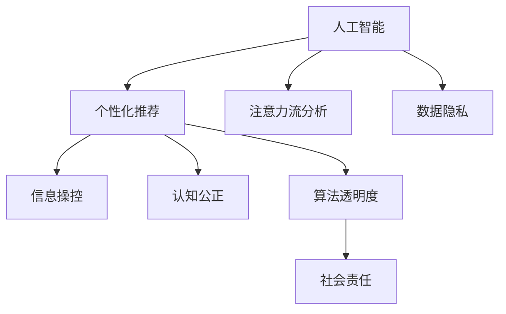

                 

# AI与人类注意力流：道德考量

> 关键词：人工智能，注意力流，道德伦理，用户关注，数据隐私，算法透明度，社会责任

## 1. 背景介绍

### 1.1 问题由来
随着人工智能（AI）技术的发展，AI系统在许多领域中正变得越来越普遍，包括医疗、金融、教育、娱乐等。然而，AI系统的普及也引发了一系列道德问题，这些问题涉及隐私、公平性、安全性、责任归属等方面。在所有这些道德问题中，如何合理利用和保护人类注意力流，是一个尤为重要的方面。

人类注意力流是指人们在信息消费时所关注的内容、情感以及认知过程。AI系统通过算法推荐和自动化分析，可以准确地捕捉和利用人类的注意力流，从而提供个性化的信息和服务。但同时，这些AI系统也可能被滥用来操纵、操控甚至滥用人类注意力，导致信息环境失衡，产生伦理风险。

### 1.2 问题核心关键点
- 个性化推荐与隐私保护：AI系统如何既能够提供个性化服务，又能够保护用户的隐私？
- 信息操控与认知公正：AI系统在推荐过程中是否会对用户的认知产生操控，甚至形成认知偏误？
- 算法透明度与社会信任：AI系统的决策过程是否透明，是否能够让用户和公众信任？
- 责任归属与伦理责任：当AI系统出现问题时，谁应该承担责任？

## 2. 核心概念与联系

### 2.1 核心概念概述

为了更好地理解AI系统对人类注意力流的影响及其道德考量，本节将介绍几个关键概念：

- **人工智能（AI）**：使用算法和数据处理能力模拟人类智能过程的技术。
- **个性化推荐系统**：利用用户历史行为数据，通过算法预测用户未来可能感兴趣的内容或服务。
- **注意力流分析**：通过分析用户的行为和互动数据，理解其注意力分布和兴趣偏好。
- **数据隐私**：指个人信息不被滥用的权利，涉及数据的收集、存储、处理和使用过程中对用户权益的保护。
- **算法透明度**：指AI系统的工作原理是否公开、透明，用户和监管者能否理解其决策依据。
- **社会责任**：AI系统在设计和应用过程中，是否考虑到社会、环境、伦理等多方面的责任和义务。

这些核心概念之间的关系可以通过以下Mermaid流程图来展示：



这个流程图展示了一些关键概念之间的逻辑关系：

1. 人工智能通过个性化推荐和注意力流分析，利用用户数据提供服务。
2. 个性化推荐和注意力流分析可能涉及数据隐私问题，需要合理处理。
3. 推荐系统中的信息操控和认知公正问题，需要透明度来解决。
4. 算法透明度的提升有助于增强社会责任感的实现。

## 3. 核心算法原理 & 具体操作步骤

### 3.1 算法原理概述

AI与人类注意力流的主要交互方式是通过个性化推荐系统实现的。这些系统通过分析用户的历史行为数据，预测其未来偏好，从而为其提供定制化的内容或服务。其核心算法原理基于协同过滤、内容推荐、混合推荐等方法，通过算法模型对用户和内容进行矩阵分解、矩阵分解后的推荐、深度学习推荐等多种方式。

**协同过滤推荐**：通过分析用户的历史行为和兴趣，预测其可能感兴趣的其他内容。

**内容推荐**：根据内容的特征和用户兴趣，预测用户可能感兴趣的内容。

**混合推荐**：结合多种推荐算法，综合利用用户数据、内容数据和模型数据，提升推荐精度和多样性。

### 3.2 算法步骤详解

一个典型的个性化推荐系统的推荐流程包括以下几个步骤：

**Step 1: 数据收集与处理**
- 收集用户行为数据（如浏览记录、点击行为、评分等）和内容数据（如文章、视频、商品等）。
- 对数据进行清洗和预处理，包括去除噪声、填充缺失值等。

**Step 2: 用户建模**
- 使用协同过滤或内容推荐等方法，建立用户兴趣模型。
- 使用深度学习模型（如神经网络），对用户行为进行建模。

**Step 3: 物品建模**
- 对内容进行特征提取，生成内容向量。
- 使用协同过滤、内容推荐等方法，生成物品相似度矩阵。

**Step 4: 推荐计算**
- 根据用户模型和物品模型，计算用户对每个物品的评分或兴趣。
- 根据评分或兴趣计算排名，选择推荐列表。

**Step 5: 反馈循环**
- 收集用户对推荐结果的反馈（如点击、购买、评价等）。
- 根据反馈调整模型参数，优化推荐算法。

### 3.3 算法优缺点

个性化推荐系统在提高用户体验和平台收益方面具有显著优势，但也存在一些问题和挑战：

**优点**：
1. **个性化服务**：提供高度个性化的内容和服务，满足用户的多样化需求。
2. **提高效率**：减少了用户寻找内容的成本，提升了平台流量和用户留存率。
3. **精准营销**：通过精准定位，提升广告效果和营销转化率。

**缺点**：
1. **隐私风险**：用户数据容易被滥用，导致隐私泄露和侵犯。
2. **信息茧房**：可能导致用户陷入“信息茧房”，限制了其信息获取的广度和深度。
3. **认知操控**：可能通过算法操控用户的认知和情感，产生潜在的认知偏误。
4. **算法偏见**：推荐算法可能存在偏见，导致不公和歧视。

### 3.4 算法应用领域

个性化推荐系统已经在众多领域得到了广泛应用，例如：

- **电商领域**：推荐商品、商品分类、购物车推荐等。
- **内容平台**：推荐文章、视频、音乐、书籍等。
- **社交媒体**：推荐好友、新闻、广告等。
- **搜索引擎**：推荐搜索关键词、搜索结果等。
- **金融服务**：推荐金融产品、投资建议等。

## 4. 数学模型和公式 & 详细讲解 & 举例说明

### 4.1 数学模型构建

个性化推荐系统的主要数学模型包括协同过滤模型和深度学习模型。这里以协同过滤模型为例进行说明。

协同过滤模型可以通过矩阵分解方法实现，其核心思想是将用户行为矩阵和物品特征矩阵分解为两个低秩矩阵，通过矩阵乘法预测用户对物品的评分。

设用户行为矩阵为 $U$，物品特征矩阵为 $I$，则协同过滤模型的目标是最小化损失函数：

$$
\min_{U, I} \|U \times I - R\|
$$

其中 $R$ 为用户-物品评分矩阵，$\| \cdot \|$ 表示矩阵范数。

### 4.2 公式推导过程

设用户 $u$ 对物品 $i$ 的评分向量为 $r_{ui}$，用户兴趣向量为 $u$，物品特征向量为 $i$。则协同过滤模型的损失函数可以表示为：

$$
\min_{u_i} \frac{1}{2} \sum_{i} \| r_{ui} - u_i \cdot i \|^2
$$

其中 $u_i$ 为用户对物品 $i$ 的预测评分。

根据矩阵分解，可以将上述损失函数转化为矩阵乘法形式：

$$
\min_{U, I} \|U \times I - R\|
$$

通过求解上述优化问题，可以得到用户兴趣向量 $u$ 和物品特征向量 $i$。

### 4.3 案例分析与讲解

假设我们有一个电商平台，收集了用户 $u_1, u_2, \ldots, u_M$ 和商品 $i_1, i_2, \ldots, i_N$ 的评分矩阵 $R$。我们可以将其分解为两个低秩矩阵 $U$ 和 $I$，其中 $U$ 表示用户兴趣矩阵，$I$ 表示商品特征矩阵。

```python
import numpy as np
from scipy.optimize import minimize

# 假设计算规模化
M, N = 1000, 1000
R = np.random.rand(M, N)
U = np.random.rand(M, K)
I = np.random.rand(K, N)

# 损失函数
def loss(U, I):
    return np.linalg.norm(np.dot(U, I) - R)

# 最小化损失函数
res = minimize(loss, (U, I), method='L-BFGS-B')
U_opt, I_opt = res.x

# 输出优化后的用户兴趣和物品特征矩阵
print(U_opt, I_opt)
```

通过上述代码，我们可以得到用户兴趣向量和物品特征向量，从而实现个性化推荐。

## 5. 项目实践：代码实例和详细解释说明

### 5.1 开发环境搭建

在进行个性化推荐系统开发前，我们需要准备好开发环境。以下是使用Python进行Scikit-Learn开发的环境配置流程：

1. 安装Anaconda：从官网下载并安装Anaconda，用于创建独立的Python环境。

2. 创建并激活虚拟环境：
```bash
conda create -n recommender-env python=3.8 
conda activate recommender-env
```

3. 安装Scikit-Learn和其他相关库：
```bash
conda install scikit-learn pandas numpy scipy
```

4. 安装PyTorch等深度学习库：
```bash
pip install torch torchvision torchaudio
```

5. 安装TensorFlow等深度学习库：
```bash
pip install tensorflow
```

完成上述步骤后，即可在`recommender-env`环境中开始推荐系统开发。

### 5.2 源代码详细实现

这里以协同过滤推荐系统为例，给出Scikit-Learn的推荐系统开发代码实现。

首先，定义数据处理和模型训练函数：

```python
from sklearn.metrics.pairwise import cosine_similarity
from scipy.sparse.linalg import svds

def preprocess_data(R):
    R = R.toarray()
    U, I = svds(R, k=10)
    return U, I

def train_model(U, I, R, alpha=0.5):
    # 训练协同过滤模型
    R_pred = np.dot(U, I.T)
    R_pred = (R_pred + alpha * R_pred.T) / (2 * (alpha + 1))
    return R_pred

# 加载数据
R = np.loadtxt('ratings.csv', delimiter=',')
U, I = preprocess_data(R)

# 训练模型
R_pred = train_model(U, I, R)
```

然后，定义推荐函数：

```python
def recommend_items(R_pred, user_index):
    user_index = int(user_index)
    user_predictions = R_pred[user_index]
    items = np.argsort(user_predictions)[::-1]
    return items
```

最后，测试推荐函数：

```python
# 测试推荐系统
user_index = 0
recommended_items = recommend_items(R_pred, user_index)
print(recommended_items)
```

以上就是使用Scikit-Learn进行协同过滤推荐系统开发的完整代码实现。可以看到，Scikit-Learn提供了丰富的机器学习工具，使得推荐系统的开发变得简单高效。

### 5.3 代码解读与分析

让我们再详细解读一下关键代码的实现细节：

**preprocess_data函数**：
- 对原始评分矩阵进行奇异值分解，得到用户兴趣矩阵和物品特征矩阵。

**train_model函数**：
- 通过矩阵乘法和正则化技术，对用户兴趣矩阵和物品特征矩阵进行优化，得到预测评分矩阵。

**recommend_items函数**：
- 根据预测评分矩阵，推荐与用户最相关的物品。

**测试推荐函数**：
- 对指定用户进行物品推荐，并打印输出。

可以看到，Scikit-Learn使得推荐系统的开发变得简洁高效。开发者可以将更多精力放在数据处理、模型改进等高层逻辑上，而不必过多关注底层的实现细节。

当然，工业级的系统实现还需考虑更多因素，如推荐算法的多样化、实时性、冷启动问题等。但核心的推荐过程基本与此类似。

## 6. 实际应用场景

### 6.1 智能推荐系统

基于个性化推荐系统，智能推荐系统广泛应用于电商、新闻、音乐、视频等多个领域。这些系统通过分析用户行为数据，提供定制化的内容推荐，显著提升用户体验和平台收益。

在技术实现上，可以收集用户的历史行为数据，建立用户兴趣模型，结合物品特征矩阵，进行推荐计算。用户的历史行为数据可以包括浏览记录、点击行为、购买记录等。物品特征矩阵可以包括商品属性、标签、评分等信息。通过优化推荐算法，可以使推荐结果更加精准，提升用户满意度和平台转化率。

### 6.2 智能广告投放

智能广告投放系统通过个性化推荐技术，实现精准广告投放。广告主可以根据用户的兴趣和行为，选择最合适的广告内容，提高广告转化率。同时，通过数据分析和优化，广告主可以更精准地控制广告预算，提升广告投放效果。

在技术实现上，可以构建用户画像，分析用户行为数据，选择相关广告内容。通过优化推荐算法，可以实现更精准的广告投放。同时，通过数据分析和优化，可以更精准地控制广告预算，提升广告投放效果。

### 6.3 智能客服系统

智能客服系统通过个性化推荐技术，提升客户体验和服务质量。系统可以分析用户的历史行为和反馈，推荐最合适的解决方案，提高客户满意度。

在技术实现上，可以收集用户的历史行为数据，建立用户画像，分析用户需求和偏好。通过优化推荐算法，可以实现更精准的解决方案推荐。同时，通过数据分析和优化，可以提高客户满意度和服务质量。

## 7. 工具和资源推荐

### 7.1 学习资源推荐

为了帮助开发者系统掌握个性化推荐技术的理论基础和实践技巧，这里推荐一些优质的学习资源：

1. 《推荐系统实践》系列博文：由深度学习专家撰写，深入浅出地介绍了推荐系统的原理和实践，包括协同过滤、深度学习推荐等多种方法。

2. Coursera《Recommender Systems》课程：斯坦福大学开设的推荐系统课程，涵盖推荐系统的基本概念和经典模型，包括协同过滤、深度学习推荐等。

3. 《深度学习推荐系统》书籍：Deep Learning与推荐系统结合的经典教材，详细介绍了深度学习在推荐系统中的应用，包括神经网络、自编码器等方法。

4. Kaggle推荐系统竞赛：Kaggle平台上举办的推荐系统竞赛，涵盖协同过滤、深度学习推荐等多种方法，提供了丰富的实践案例和经验分享。

通过对这些资源的学习实践，相信你一定能够快速掌握个性化推荐技术的精髓，并用于解决实际的推荐问题。

### 7.2 开发工具推荐

高效的开发离不开优秀的工具支持。以下是几款用于推荐系统开发的常用工具：

1. Scikit-Learn：基于Python的开源机器学习库，支持多种推荐算法，包括协同过滤、深度学习推荐等。

2. TensorFlow：由Google主导开发的开源深度学习框架，支持高效的模型训练和推理。

3. PyTorch：基于Python的开源深度学习框架，支持动态图和静态图两种计算图形式，适合快速迭代研究。

4. Weights & Biases：模型训练的实验跟踪工具，可以记录和可视化模型训练过程中的各项指标，方便对比和调优。

5. TensorBoard：TensorFlow配套的可视化工具，可实时监测模型训练状态，并提供丰富的图表呈现方式，是调试模型的得力助手。

合理利用这些工具，可以显著提升推荐系统的开发效率，加快创新迭代的步伐。

### 7.3 相关论文推荐

推荐系统的研究历史悠久，近年来随着深度学习技术的发展，推荐系统也取得了显著的进展。以下是几篇奠基性的相关论文，推荐阅读：

1. Parallel Matrix Factorization for Recommender Systems：提出了基于并行矩阵分解的推荐算法，有效解决了协同过滤推荐中的计算效率问题。

2. Factorization Machines for Recommender Systems：提出了因子化机模型，结合多项式特征和矩阵分解，提高了推荐精度。

3. Deep Neural Networks for Recommender Systems：提出了基于深度神经网络的推荐算法，提升了推荐系统的复杂性和性能。

4. Multi-Task Learning for Hierarchical Matrix Factorization in Recommender Systems：提出了多任务学习框架，提升了协同过滤推荐的多样性和泛化能力。

5. Attention-based Recommender Systems：提出了基于注意力机制的推荐算法，提升了推荐系统的灵活性和效果。

这些论文代表了大规模推荐系统的研究脉络。通过学习这些前沿成果，可以帮助研究者把握学科前进方向，激发更多的创新灵感。

## 8. 总结：未来发展趋势与挑战

### 8.1 总结

本文对基于机器学习的个性化推荐系统进行了全面系统的介绍。首先阐述了推荐系统的发展背景和意义，明确了个性化推荐系统在提升用户体验和平台收益方面的独特价值。其次，从原理到实践，详细讲解了推荐系统的数学模型和算法流程，给出了推荐系统开发的完整代码实现。同时，本文还广泛探讨了推荐系统在电商、广告、客服等实际应用场景中的应用前景，展示了推荐系统的广泛应用潜力。此外，本文精选了推荐技术的各类学习资源，力求为读者提供全方位的技术指引。

通过本文的系统梳理，可以看到，个性化推荐系统通过智能算法和数据处理，实现了用户行为和兴趣的精准预测，显著提升了用户体验和平台收益。未来，伴随推荐算法的不断进步和优化，推荐系统将在更多领域大放异彩，成为各行各业智能化转型的重要推动力。

### 8.2 未来发展趋势

展望未来，个性化推荐系统将呈现以下几个发展趋势：

1. **推荐算法多样化**：结合协同过滤、深度学习推荐、混合推荐等多种方法，实现更精准、多样化的推荐。

2. **实时性提升**：通过分布式计算、缓存技术等手段，实现实时推荐，提升用户体验。

3. **个性化深度学习**：利用深度神经网络，实现用户兴趣的深度学习和表示，提升推荐精度和灵活性。

4. **跨领域推荐**：结合多模态数据（如图片、视频、文本），实现跨领域推荐，提升推荐效果。

5. **用户反馈循环**：通过收集用户反馈，实时调整推荐算法，实现动态优化和推荐。

6. **隐私保护和安全性**：采用差分隐私、联邦学习等技术，保障用户隐私和数据安全。

以上趋势凸显了个性化推荐系统的广阔前景。这些方向的探索发展，必将进一步提升推荐系统的性能和应用范围，为各行业数字化转型升级提供新的技术路径。

### 8.3 面临的挑战

尽管个性化推荐系统已经取得了显著成效，但在迈向更加智能化、普适化应用的过程中，它仍面临着诸多挑战：

1. **数据稀疏性**：许多用户的行为数据稀疏，难以建立有效的推荐模型。

2. **冷启动问题**：新用户的兴趣难以快速预测，需要通过多模态数据和新行为数据进行补充。

3. **模型复杂度**：深度学习推荐模型往往参数量大、计算复杂，对算力资源要求较高。

4. **用户隐私保护**：推荐系统需要处理大量用户数据，如何保障用户隐私和数据安全是一个重要问题。

5. **算法透明性和公平性**：推荐算法的决策过程不透明，可能导致用户不信任和歧视问题。

6. **多模态数据融合**：不同模态数据（如文本、图片、视频）的融合和处理，是一个复杂且重要的问题。

这些挑战需要通过不断的技术创新和优化来解决，以实现推荐系统的广泛应用和用户信任。

### 8.4 研究展望

面对个性化推荐系统所面临的挑战，未来的研究需要在以下几个方面寻求新的突破：

1. **多模态数据融合**：通过多模态数据的融合，提升推荐系统的综合能力，提供更丰富的推荐内容。

2. **跨领域推荐**：结合不同领域的知识和数据，实现跨领域推荐，提升推荐效果。

3. **实时推荐系统**：通过分布式计算和缓存技术，实现实时推荐，提升用户体验。

4. **隐私保护技术**：采用差分隐私、联邦学习等技术，保障用户隐私和数据安全。

5. **推荐算法的透明性**：通过可解释AI技术，提高推荐算法的透明性和公平性，增强用户信任。

6. **冷启动问题解决**：利用多模态数据和新行为数据，快速预测新用户的兴趣和需求。

这些研究方向的探索，必将引领个性化推荐系统向更高层次迈进，为各行业提供更高效、更精准的推荐服务。

## 9. 附录：常见问题与解答

**Q1：推荐系统如何处理用户数据隐私问题？**

A: 推荐系统在处理用户数据时，需要严格遵守数据隐私保护法规（如GDPR、CCPA等）。具体措施包括：

1. **数据匿名化**：通过去除或模糊化用户个人身份信息，保护用户隐私。

2. **差分隐私**：在数据处理和分析过程中，添加噪声，保护用户隐私。

3. **联邦学习**：在分布式环境中，通过加密技术，保护用户数据隐私。

4. **访问控制**：设置访问权限，限制数据访问范围，保护用户数据安全。

通过以上措施，可以最大限度地保护用户数据隐私，保障用户权益。

**Q2：推荐系统如何处理数据稀疏性问题？**

A: 推荐系统可以通过多种方法处理数据稀疏性问题，包括：

1. **矩阵补全**：通过补全缺失数据，增加数据稠密度，提升推荐精度。

2. **混合推荐**：结合协同过滤、深度学习推荐等多种方法，提升推荐效果。

3. **数据增强**：通过数据增强技术，增加用户行为数据，提高数据稠密度。

4. **多模态数据融合**：通过融合多模态数据，提升推荐效果和数据稠密度。

通过以上方法，可以有效地解决推荐系统中的数据稀疏性问题，提升推荐精度。

**Q3：推荐系统如何处理冷启动问题？**

A: 推荐系统可以通过以下方法处理冷启动问题：

1. **多模态数据融合**：利用用户在不同模态数据下的行为，进行推荐预测。

2. **协同过滤推荐**：利用用户历史行为数据，进行推荐预测。

3. **新行为数据**：收集新用户的少量行为数据，进行推荐预测。

4. **多任务学习**：利用多任务学习框架，进行推荐预测。

5. **推荐引擎集成**：通过集成多个推荐引擎，提升推荐效果。

通过以上方法，可以有效地解决推荐系统中的冷启动问题，提升推荐精度和用户满意度。

**Q4：推荐系统如何处理推荐算法的透明性和公平性问题？**

A: 推荐系统可以通过以下方法处理推荐算法的透明性和公平性问题：

1. **算法透明性**：通过可解释AI技术，提高推荐算法的透明性，让用户理解推荐依据。

2. **公平性算法**：采用公平性算法，避免推荐结果中的偏见和歧视。

3. **用户反馈机制**：通过用户反馈机制，及时调整推荐算法，提升公平性和透明性。

4. **多样性推荐**：通过多样性推荐算法，避免推荐结果中的偏差。

通过以上方法，可以有效地解决推荐系统中的透明性和公平性问题，提升用户信任和满意度。

**Q5：推荐系统如何处理多模态数据融合问题？**

A: 推荐系统可以通过以下方法处理多模态数据融合问题：

1. **特征提取**：通过特征提取技术，将不同模态数据转换为统一特征向量。

2. **深度学习**：利用深度神经网络，融合不同模态数据，提升推荐精度。

3. **数据融合技术**：通过数据融合技术，提升不同模态数据的一致性。

4. **多任务学习**：通过多任务学习框架，提升推荐效果。

5. **推荐引擎集成**：通过集成多个推荐引擎，提升推荐效果。

通过以上方法，可以有效地解决推荐系统中的多模态数据融合问题，提升推荐精度和用户体验。

---

作者：禅与计算机程序设计艺术 / Zen and the Art of Computer Programming

