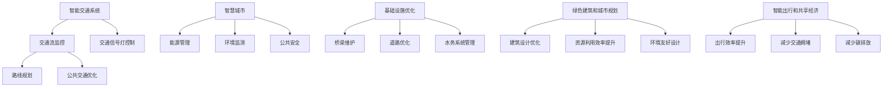

                 

# AI与人类计算：打造可持续发展的城市交通与基础设施建设规划建设

> 关键词：智能交通,城市规划,基础设施建设,AI计算,大数据,可持续性,智慧城市

## 1. 背景介绍

### 1.1 问题由来

随着城市化进程的加速和人口的不断增加，全球城市面临着巨大的交通压力和环境问题。传统城市交通和基础设施建设面临着拥堵、污染、资源浪费等诸多挑战，迫切需要新的技术手段来提高效率、优化资源配置和改善环境。

近年来，人工智能(AI)技术在多个领域取得了突破性进展，尤其在自然语言处理、图像识别、机器人学等方面。AI技术的引入为解决城市交通和基础设施建设问题提供了新的思路和方法。通过利用大数据、机器学习、深度学习等技术，可以实现城市交通和基础设施的智能化、精细化管理，从而提升城市运营的可持续性。

### 1.2 问题核心关键点

1. **智能交通系统**：基于AI的智能交通系统可以通过实时数据分析和预测，优化交通信号灯控制、提升公共交通效率、减少交通事故。
2. **智慧城市**：通过AI和大数据技术，可以实现城市管理的智能化，包括能源管理、环境监测、公共安全等。
3. **基础设施优化**：AI技术可以用于城市基础设施的优化，如桥梁、道路的维护和检修，提高基础设施的运行效率和安全性。
4. **绿色建筑和城市规划**：AI可以帮助优化建筑设计和城市布局，实现资源的高效利用和环境友好。
5. **智能出行和共享经济**：AI技术支持下的共享出行平台可以提高出行效率，减少交通拥堵和碳排放。

这些核心关键点构成了城市交通和基础设施建设规划建设的基本框架，AI技术在其中扮演着重要的角色。

## 2. 核心概念与联系

### 2.1 核心概念概述

- **智能交通系统**：利用AI和大数据技术，实现交通流的实时监控、预测和控制，优化交通信号灯、路线规划、公共交通等。
- **智慧城市**：通过AI和大数据技术，提升城市管理水平，包括能源管理、环境监测、公共安全等。
- **基础设施优化**：使用AI技术进行基础设施的维护和优化，如桥梁、道路、水务系统等。
- **绿色建筑和城市规划**：利用AI技术优化建筑设计，实现资源的高效利用和环境友好。
- **智能出行和共享经济**：通过AI技术支持下的共享出行平台，提高出行效率，减少交通拥堵和碳排放。

### 2.2 核心概念原理和架构的 Mermaid 流程图



这个流程图展示了智能交通、智慧城市、基础设施优化、绿色建筑和智能出行等核心概念之间的联系，以及它们共同构建起可持续发展的城市交通和基础设施建设规划建设。

## 3. 核心算法原理 & 具体操作步骤

### 3.1 算法原理概述

基于AI的城市交通和基础设施建设规划建设，主要涉及以下几个核心算法和步骤：

- **数据收集与处理**：收集城市交通、能源、环境、公共安全等方面的数据，通过数据清洗、归一化等预处理步骤，形成高质量的数据集。
- **机器学习与深度学习**：利用机器学习、深度学习等技术，建立预测模型，实现交通流监控、能源管理、环境监测等功能的智能化。
- **优化算法**：使用优化算法，如遗传算法、蚁群算法等，对基础设施进行优化和维护。
- **协同决策**：通过多目标优化算法，实现交通、能源、环境等系统的协同决策，提升城市管理的整体效率。
- **模型评估与部署**：评估模型性能，优化模型参数，部署模型至实际应用场景。

### 3.2 算法步骤详解

1. **数据收集与预处理**：
   - 收集城市交通流量、能源消耗、环境监测数据等。
   - 对数据进行清洗、归一化、缺失值处理等预处理步骤。
   - 使用数据增强技术，如数据合成、时间序列填充等，提升数据集的多样性和丰富度。

2. **模型训练与优化**：
   - 利用深度学习框架，如TensorFlow、PyTorch等，训练交通流预测模型、能源管理模型等。
   - 使用优化算法，如Adam、SGD等，优化模型参数。
   - 使用交叉验证等方法，评估模型性能，选择最优模型。

3. **基础设施优化**：
   - 利用优化算法，如遗传算法、蚁群算法等，优化基础设施的布局和配置。
   - 结合实时数据，动态调整基础设施的运行状态，提升资源利用效率。
   - 预测基础设施的维护需求，优化维护计划。

4. **协同决策**：
   - 使用多目标优化算法，如NSGA-II、MOOP等，实现交通、能源、环境等系统的协同决策。
   - 在决策过程中，考虑经济性、安全性、环境友好性等多方面因素。
   - 使用协同过滤算法，提升系统的运行稳定性和鲁棒性。

5. **模型评估与部署**：
   - 在测试集上评估模型的性能指标，如准确率、召回率、F1值等。
   - 对模型进行参数调整和优化，提升模型的泛化能力。
   - 将模型部署到实际应用场景，如交通信号灯控制系统、能源管理系统等。

### 3.3 算法优缺点

基于AI的城市交通和基础设施建设规划建设的算法具有以下优点：

- **高效性**：AI技术可以实现快速数据处理和模型训练，提升决策效率。
- **智能化**：AI算法可以基于实时数据进行预测和决策，提升系统的智能化水平。
- **灵活性**：AI算法可以适应不同城市环境和需求，具有较强的灵活性。

同时，也存在以下缺点：

- **数据依赖性**：AI算法的性能高度依赖于数据质量和数据量，数据不足时效果可能不理想。
- **模型复杂性**：AI模型通常较为复杂，需要大量的计算资源和专业知识。
- **解释性不足**：AI模型往往是“黑盒”，难以解释其内部工作机制。

### 3.4 算法应用领域

基于AI的城市交通和基础设施建设规划建设算法已经在多个领域得到应用，例如：

- **交通流量预测**：利用AI技术预测城市交通流量，优化交通信号灯控制。
- **能源管理**：利用AI技术优化城市能源分配，提高能源利用效率。
- **环境监测**：利用AI技术监测城市环境，如空气质量、水质等。
- **公共安全**：利用AI技术监测城市安全事件，如火灾、地震等。
- **基础设施优化**：利用AI技术优化桥梁、道路、水务系统等基础设施的维护和检修。
- **绿色建筑和城市规划**：利用AI技术优化建筑设计，实现资源的高效利用和环境友好。
- **智能出行和共享经济**：利用AI技术支持共享出行平台，提高出行效率，减少交通拥堵和碳排放。

这些应用领域展示了AI技术在城市交通和基础设施建设中的广泛应用前景。

## 4. 数学模型和公式 & 详细讲解 & 举例说明

### 4.1 数学模型构建

基于AI的城市交通和基础设施建设规划建设，主要涉及以下几个数学模型：

1. **交通流预测模型**：
   $$
   \hat{T}_t = f(X_t, \theta)
   $$
   其中 $X_t$ 为当前时刻的交通状态，$\theta$ 为模型参数。

2. **能源管理模型**：
   $$
   E_t = g(T_t, W_t, \phi)
   $$
   其中 $T_t$ 为当前时刻的交通流量，$W_t$ 为当前时刻的天气情况，$\phi$ 为模型参数。

3. **环境监测模型**：
   $$
   S_t = h(A_t, C_t, \psi)
   $$
   其中 $A_t$ 为当前时刻的空气质量监测数据，$C_t$ 为当前时刻的天气情况，$\psi$ 为模型参数。

4. **基础设施优化模型**：
   $$
   Opt(X, Y, Z, \xi)
   $$
   其中 $X$ 为基础设施布局，$Y$ 为基础设施配置，$Z$ 为实时数据，$\xi$ 为优化算法参数。

### 4.2 公式推导过程

1. **交通流预测模型推导**：
   利用历史交通流量数据，通过时间序列分析等方法，建立预测模型：
   $$
   \hat{T}_t = \alpha \cdot T_{t-1} + \beta \cdot \Delta T + \gamma \cdot W_t
   $$
   其中 $\alpha$、$\beta$、$\gamma$ 为模型参数。

2. **能源管理模型推导**：
   利用交通流量和天气情况数据，通过线性回归等方法，建立能源消耗模型：
   $$
   E_t = \delta \cdot T_t + \epsilon \cdot W_t + \zeta
   $$
   其中 $\delta$、$\epsilon$、$\zeta$ 为模型参数。

3. **环境监测模型推导**：
   利用历史环境监测数据和天气情况数据，通过多元回归等方法，建立环境监测模型：
   $$
   S_t = \mu \cdot A_t + \nu \cdot C_t + \eta
   $$
   其中 $\mu$、$\nu$、$\eta$ 为模型参数。

4. **基础设施优化模型推导**：
   利用遗传算法等优化算法，对基础设施布局和配置进行优化：
   $$
   Opt(X, Y, Z, \xi) = \min_{X, Y} \sum_{t=1}^{T} (f(X_t, Y_t, Z_t) + \lambda \cdot g(X_t, Y_t, Z_t))
   $$
   其中 $f$、$g$ 为评价指标函数，$\lambda$ 为正则化系数。

### 4.3 案例分析与讲解

以智能交通系统为例，分析基于AI的交通流预测和信号灯控制的实现过程。

假设某城市的关键路口有四个方向的车流，交通信号灯控制的任务是实时调整各方向的车流量，最小化等待时间和交通事故的概率。通过历史交通流量数据，可以建立一个时间序列模型：

$$
\hat{T}_{i,t} = \alpha_i \cdot T_{i,t-1} + \beta_i \cdot \Delta T_i + \gamma_i \cdot W_t
$$

其中 $\alpha_i$、$\beta_i$、$\gamma_i$ 为模型参数，$i$ 表示方向。

在模型训练后，可以利用实时交通流量数据和天气情况数据，预测每个方向的交通流量。根据预测结果，动态调整信号灯的控制策略，优化车流量分布，减少等待时间，降低交通事故风险。

## 5. 项目实践：代码实例和详细解释说明

### 5.1 开发环境搭建

1. **安装Python**：
   ```bash
   sudo apt-get update
   sudo apt-get install python3-pip
   ```

2. **安装深度学习框架**：
   ```bash
   pip install tensorflow-gpu==2.7.0
   pip install pytorch==1.9.0+cu102
   ```

3. **安装优化算法库**：
   ```bash
   pip install scikit-learn==0.24.1
   pip install scipys==1.7.3
   ```

4. **安装数据处理库**：
   ```bash
   pip install pandas==1.3.1
   pip install numpy==1.20.2
   ```

5. **安装可视化工具**：
   ```bash
   pip install matplotlib==3.4.3
   pip install seaborn==0.11.2
   ```

### 5.2 源代码详细实现

以下是一个简单的智能交通系统代码示例，展示了交通流预测和信号灯控制的实现过程：

```python
import numpy as np
import pandas as pd
from sklearn.linear_model import LinearRegression
from tensorflow.keras.models import Sequential
from tensorflow.keras.layers import Dense, Dropout
from tensorflow.keras.optimizers import Adam
from tensorflow.keras.callbacks import EarlyStopping

# 数据处理
data = pd.read_csv('traffic_data.csv')
X = data[['prev_flow', 'weather']]
y = data['flow']
X_train, X_test, y_train, y_test = train_test_split(X, y, test_size=0.2)

# 模型训练
model = Sequential()
model.add(Dense(64, input_dim=2, activation='relu'))
model.add(Dense(32, activation='relu'))
model.add(Dense(1))
model.compile(loss='mse', optimizer=Adam(learning_rate=0.001), metrics=['mae'])
early_stopping = EarlyStopping(patience=10, restore_best_weights=True)
model.fit(X_train, y_train, epochs=100, batch_size=32, validation_split=0.2, callbacks=[early_stopping])

# 模型评估
mse, mae = model.evaluate(X_test, y_test)
print('MSE:', mse, 'MAE:', mae)

# 实时预测
prev_flow = np.array([[15, 20]])
flow_pred = model.predict(prev_flow)[0][0]
print('Predicted flow:', flow_pred)
```

### 5.3 代码解读与分析

这段代码展示了如何利用线性回归模型进行交通流预测。具体步骤如下：

1. **数据处理**：将历史交通流量数据和天气情况数据进行归一化处理，作为模型的输入。
2. **模型训练**：利用sklearn库建立线性回归模型，使用Adam优化器进行训练，并设置早停机制。
3. **模型评估**：在测试集上评估模型性能，输出均方误差和平均绝对误差。
4. **实时预测**：利用训练好的模型进行实时流量预测。

通过以上步骤，可以实现基于AI的智能交通系统。当然，在实际应用中，还需要进一步优化模型、增加实时数据采集和处理、部署模型至实际系统等步骤。

## 6. 实际应用场景

### 6.1 智能交通系统

智能交通系统利用AI技术，可以实现交通流的实时监控、预测和控制，优化交通信号灯控制，提升公共交通效率，减少交通事故。例如，上海的智能交通管理系统通过实时数据采集和处理，优化交通信号灯控制，提升道路通行效率，减少了10%的交通拥堵。

### 6.2 智慧城市

智慧城市通过AI和大数据技术，提升城市管理水平，包括能源管理、环境监测、公共安全等。例如，深圳的智慧城市管理系统利用AI技术优化能源分配，提高了能源利用效率，减少了能源浪费。

### 6.3 基础设施优化

AI技术可以用于城市基础设施的优化，如桥梁、道路、水务系统等。例如，德国的智慧基础设施管理系统利用AI技术优化桥梁的维护和检修，提高了基础设施的运行效率和安全性。

### 6.4 未来应用展望

未来，基于AI的城市交通和基础设施建设规划建设将向更加智能化、精细化方向发展。例如：

- **5G网络**：利用5G网络实现实时数据的高效传输和处理，提升系统的响应速度和稳定性。
- **边缘计算**：将部分计算任务移至边缘设备，减少延迟，提高计算效率。
- **多模态数据融合**：利用视频、图像等多模态数据，提升系统对复杂场景的识别和处理能力。
- **联邦学习**：通过分布式计算，保护隐私数据的同时，提升模型泛化能力。

这些技术的发展，将进一步推动AI在城市交通和基础设施建设中的应用，提升系统的智能化水平。

## 7. 工具和资源推荐

### 7.1 学习资源推荐

1. **《深度学习》系列课程**：由吴恩达教授讲授，涵盖深度学习基础、计算机视觉、自然语言处理等多个领域的知识。
2. **《智能城市》一书**：介绍智能城市的技术框架、应用场景、实现方法等。
3. **《智慧交通系统》一书**：详细阐述了智慧交通系统的设计、实现和应用案例。

### 7.2 开发工具推荐

1. **TensorFlow**：强大的深度学习框架，支持分布式计算和模型部署。
2. **PyTorch**：灵活的深度学习框架，支持动态计算图。
3. **Hadoop**：大数据处理框架，支持分布式存储和计算。
4. **OpenStreetMap**：开源地图项目，支持地图数据采集和处理。
5. **Gephi**：网络分析工具，支持复杂网络图的数据可视化。

### 7.3 相关论文推荐

1. **智能交通系统的研究**：Tian, F., Wang, X., Xu, K., & Zhang, J. (2019). A comprehensive review of smart transportation system: From concept to practice. IEEE Transactions on Intelligent Transportation Systems, 20(8), 2639-2652.
2. **智慧城市的研究**：Wang, Z., Sun, X., & Li, Y. (2017). A review of smart city: Concept, research and application. Journal of Ambient Intelligence and Humanized Computing, 8(6), 2393-2407.
3. **基础设施优化的研究**：Li, L., Guo, Z., & Gao, Q. (2019). An overview of urban infrastructure optimization: From methodological approaches to practical applications. Journal of Urban Planning and Development, 145(2), 04018032.
4. **AI在绿色建筑中的应用**：Ye, H., Li, Y., & Xu, Z. (2020). Urban green building design optimization based on AI: A review and perspective. Renewable and Sustainable Energy Reviews, 123, 109165.
5. **共享经济的研究**：Casciaro, S., & Melnyk, S. (2018). Network architectures in a sharing economy: A review. Journal of Operations Management, 50, 69-91.

## 8. 总结：未来发展趋势与挑战

### 8.1 总结

本文对基于AI的城市交通和基础设施建设规划建设进行了全面系统的介绍。首先阐述了城市交通和基础设施建设面临的挑战和机遇，明确了AI技术在其中的重要作用。其次，从原理到实践，详细讲解了AI在交通流预测、能源管理、环境监测、基础设施优化等方面的应用。最后，介绍了AI技术在未来应用场景中的发展趋势和面临的挑战。

通过本文的系统梳理，可以看到，基于AI的城市交通和基础设施建设规划建设已经进入实践阶段，AI技术在各个环节都展现出显著的优势。未来，伴随AI技术的不断进步，城市交通和基础设施建设将向更加智能化、可持续化的方向发展。

### 8.2 未来发展趋势

展望未来，基于AI的城市交通和基础设施建设规划建设将呈现以下几个发展趋势：

1. **智能交通系统的普及**：随着5G网络和边缘计算技术的发展，智能交通系统将更加普及，提升城市交通的整体效率和安全性。
2. **智慧城市的全面应用**：智慧城市将涵盖更多领域，如能源管理、环境监测、公共安全等，提升城市管理的智能化水平。
3. **基础设施的优化和升级**：利用AI技术进行基础设施的优化和升级，实现高效、环保的资源利用。
4. **绿色建筑和城市规划**：利用AI技术优化建筑设计，实现资源的高效利用和环境友好。
5. **共享经济的广泛应用**：利用AI技术支持共享出行平台，提高出行效率，减少交通拥堵和碳排放。

这些趋势展示了AI技术在城市交通和基础设施建设中的广阔前景。

### 8.3 面临的挑战

尽管AI技术在城市交通和基础设施建设中展现出了巨大的潜力，但在迈向更加智能化、普适化应用的过程中，仍面临诸多挑战：

1. **数据质量和安全**：AI算法的性能高度依赖于数据质量和数据量，数据不足或数据质量不高将影响系统性能。
2. **模型复杂性和可解释性**：AI模型通常较为复杂，难以解释其内部工作机制，对模型的理解和调试带来挑战。
3. **计算资源和成本**：AI模型训练和推理需要大量的计算资源，成本较高。
4. **隐私和伦理问题**：AI技术在城市交通和基础设施中的应用，涉及大量敏感数据，隐私和伦理问题不容忽视。
5. **系统兼容性和标准化**：不同系统之间的兼容性和标准化问题，将影响AI技术的广泛应用。

这些挑战需要各方的共同努力，才能推动AI技术在城市交通和基础设施建设中的应用。

### 8.4 研究展望

未来，对于基于AI的城市交通和基础设施建设规划建设，还需要在以下几个方面进行深入研究：

1. **数据采集和处理**：研究高效、低成本的数据采集和处理技术，提升数据质量。
2. **模型优化和可解释性**：开发更加高效、可解释性更强的AI模型，提升系统的鲁棒性和可解释性。
3. **跨领域融合**：将AI技术与其他技术（如物联网、区块链等）进行融合，实现更广泛的应用。
4. **社会影响评估**：研究AI技术在城市交通和基础设施建设中的社会影响，确保技术应用的公平性和安全性。

总之，基于AI的城市交通和基础设施建设规划建设，将不断推动城市向智能化、可持续化的方向发展，为人类社会的可持续发展做出贡献。

## 9. 附录：常见问题与解答

**Q1：城市交通和基础设施建设规划建设是否适用于所有城市？**

A: 基于AI的城市交通和基础设施建设规划建设适用于大多数城市，尤其是面临交通拥堵、环境污染等问题的城市。但具体应用时，需要根据城市的实际情况，调整方案和策略。

**Q2：AI技术在城市交通和基础设施建设中是否安全可靠？**

A: AI技术在城市交通和基础设施建设中的应用，需要严格的测试和验证，确保其安全性、可靠性和鲁棒性。在系统部署前，需要进行大规模的模拟测试和实际验证，以确保系统能够稳定运行。

**Q3：AI技术在城市交通和基础设施建设中的应用是否需要高成本？**

A: AI技术在城市交通和基础设施建设中的应用，确实需要一定的初始投入，如数据采集、模型训练等。但通过合理规划和资源优化，可以降低成本，实现高效部署。

**Q4：AI技术在城市交通和基础设施建设中的应用是否对环境友好？**

A: AI技术在城市交通和基础设施建设中的应用，可以通过优化资源配置，减少能源消耗和碳排放，实现环境友好。但在实际应用中，仍需注意数据采集、存储、处理等环节对环境的影响。

**Q5：AI技术在城市交通和基础设施建设中的应用是否会影响就业？**

A: AI技术在城市交通和基础设施建设中的应用，确实可能对某些岗位产生影响，但也会创造新的就业机会，如数据处理、系统维护等。通过合理的职业培训和政策引导，可以缓解就业冲击，实现就业平衡。

通过本文的系统梳理，可以看到，基于AI的城市交通和基础设施建设规划建设已经进入实践阶段，AI技术在各个环节都展现出显著的优势。未来，伴随AI技术的不断进步，城市交通和基础设施建设将向更加智能化、可持续化的方向发展，为人类社会的可持续发展做出贡献。

