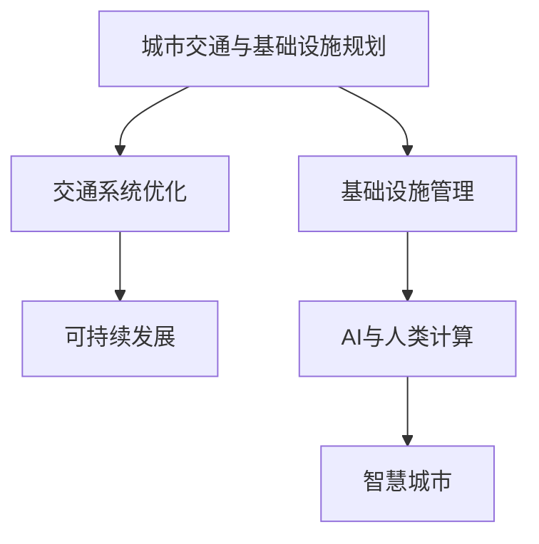

                 

# AI与人类计算：打造可持续发展的城市交通与基础设施规划与管理

> 关键词：AI与城市规划,交通系统优化,基础设施管理,智能化转型,可持续发展

## 1. 背景介绍

随着城市化的加速推进和信息技术的飞速发展，城市交通与基础设施规划与管理正面临着前所未有的挑战。如何在提高城市运行效率的同时，保障城市安全和环境的可持续性，成为全球城市建设者共同关注的重要议题。近年来，人工智能（AI）技术的突破性进展，尤其是其在数据分析、预测、优化等领域的应用，为城市交通与基础设施的智慧化、智能化转型提供了强大的技术支撑。本文将深入探讨AI在城市交通与基础设施规划与管理中的应用，展示AI如何助力打造可持续发展的智慧城市。

### 1.1 问题由来

城市交通与基础设施规划与管理，历来是一个复杂且多维度的问题。随着城市人口的增长和机动车数量的增加，城市交通拥堵、空气污染、能源消耗等环境问题日益突出，给城市管理带来了巨大的挑战。与此同时，基础设施的建设和维护成本也在不断攀升，如何高效、科学地进行规划与管理，成为决策者亟需解决的问题。

传统的城市交通与基础设施规划与管理主要依赖人工经验和定性分析，存在数据处理能力有限、预测精度不足、优化策略不够精细化等缺陷。这些问题亟需新技术来解决。近年来，AI技术在处理大规模数据、进行复杂预测和优化等方面展现出了显著优势，为智慧城市建设提供了新的思路。

## 2. 核心概念与联系

### 2.1 核心概念概述

为更好地理解AI在城市交通与基础设施规划与管理中的应用，本节将介绍几个关键概念：

- **城市交通与基础设施规划**：指对城市的道路、公共交通、能源、供水、供暖、供气等基础设施进行规划和设计，以确保城市的运行安全和高效。
- **交通系统优化**：指通过智能化手段优化交通流、减少拥堵、提升行车效率，缓解城市交通压力。
- **基础设施管理**：指利用信息技术对城市基础设施的运行状态进行实时监控、维护和升级，提高管理效率。
- **可持续发展**：指在城市发展中注重环境保护、资源节约和能源效率，实现经济、社会、环境三者的协调发展。
- **AI与人类计算**：指将人工智能技术与人类决策能力相结合，形成人机协同的智能化系统，提升城市管理和决策的智能化水平。

这些概念之间的逻辑关系可以通过以下Mermaid流程图来展示：



这个流程图展示了几者之间的关联：

1. 城市交通与基础设施规划是城市发展的基础，通过AI辅助优化，可以更科学地进行设计和调整。
2. 交通系统优化利用AI技术，提高交通效率，减少环境污染。
3. 基础设施管理通过AI进行实时监控和预测，提高管理效率。
4. AI与人类计算结合，实现更智能化的决策和规划。
5. 最终目标是通过上述AI辅助措施，构建可持续发展的智慧城市。

## 3. 核心算法原理 & 具体操作步骤

### 3.1 算法原理概述

AI在城市交通与基础设施规划与管理中的应用，主要基于数据驱动、模型驱动和优化驱动三种基本范式。

1. **数据驱动**：利用大数据技术，对城市交通与基础设施的运行状态进行实时监控，为管理决策提供依据。
2. **模型驱动**：构建数学模型和仿真模拟系统，预测交通流量、环境影响等，辅助制定规划方案。
3. **优化驱动**：采用优化算法，对交通流、能源消耗、环境污染等进行优化，提升系统效率。

### 3.2 算法步骤详解

AI在城市交通与基础设施规划与管理中的应用，可以分为以下几个关键步骤：

**Step 1: 数据收集与预处理**
- 收集城市交通与基础设施的各类数据，包括交通流量、车辆位置、环境监测数据等。
- 对数据进行清洗、归一化和去噪等预处理，保证数据的质量和可用性。

**Step 2: 模型构建与训练**
- 根据应用需求，选择合适的AI模型，如深度学习、强化学习、优化算法等。
- 在收集的数据上训练模型，调整模型参数，使其能够高效地处理实际问题。

**Step 3: 模型评估与优化**
- 在测试集上评估模型性能，根据实际需求调整模型结构和参数。
- 采用交叉验证、网格搜索等方法，进一步优化模型效果。

**Step 4: 模型应用与部署**
- 将优化后的模型应用到实际的城市管理系统中，进行交通流量预测、路径规划、能源管理等。
- 建立监控和反馈机制，根据模型输出结果，实时调整管理策略。

### 3.3 算法优缺点

AI在城市交通与基础设施规划与管理中的应用，具有以下优点：
1. 数据驱动：通过大数据技术，实时监控城市运行状态，提供丰富的数据支撑。
2. 模型驱动：利用先进的数学模型，进行科学预测和优化，提高决策的准确性和效率。
3. 优化驱动：采用智能优化算法，动态调整系统参数，提升运行效率。
4. 可持续发展：通过AI优化，减少能源消耗和环境污染，促进城市的可持续发展。

同时，该方法也存在以下局限性：
1. 数据质量要求高：数据不完整、不准确会影响模型的性能。
2. 模型复杂度高：构建和优化模型需要专业知识和技术储备。
3. 对硬件要求高：大数据处理和深度学习模型对计算资源和存储空间有较高要求。
4. 伦理与安全问题：AI决策的透明性和可解释性不足，可能带来伦理和安全风险。

尽管存在这些局限性，但就目前而言，AI辅助的交通与基础设施规划与管理方法，已在多个城市得到了广泛应用，展示了显著的优势。

### 3.4 算法应用领域

AI在城市交通与基础设施规划与管理中的应用，已涵盖多个领域，具体包括：

- **智能交通系统**：利用AI进行交通流量预测、路径优化、信号控制等，提升交通系统的运行效率。
- **能源管理与优化**：通过AI优化能源的分配和使用，降低能源消耗，提升能源利用率。
- **环境监测与治理**：利用AI进行环境数据的监测和分析，辅助制定环境保护政策。
- **公共安全与应急响应**：通过AI技术实时监测城市运行状态，提升公共安全应急响应能力。
- **城市规划与设计**：利用AI辅助进行城市规划设计，提高规划的科学性和前瞻性。

这些应用领域的探索和实践，充分展示了AI在城市交通与基础设施规划与管理中的巨大潜力。

## 4. 数学模型和公式 & 详细讲解 & 举例说明

### 4.1 数学模型构建

本节将使用数学语言对AI在城市交通与基础设施规划与管理中的应用进行更加严格的刻画。

记城市交通流量数据为 $D=\{(t_i,v_i)\}_{i=1}^N$，其中 $t_i$ 表示时间，$v_i$ 表示交通流量。设目标为交通流量的预测，模型为 $M_{\theta}$，其中 $\theta$ 为模型参数。

定义模型 $M_{\theta}$ 在时间 $t$ 上的预测流量为 $M_{\theta}(t)$。则目标函数为：

$$
\min_{\theta} \mathcal{L}(D,M_{\theta})
$$

其中 $\mathcal{L}$ 为损失函数，衡量预测流量与实际流量之间的差异。常用的损失函数包括均方误差（MSE）、平均绝对误差（MAE）等。

### 4.2 公式推导过程

以均方误差（MSE）为例，进行推导：

设预测流量为 $M_{\theta}(t)$，实际流量为 $v(t)$，则均方误差为：

$$
\mathcal{L}(D,M_{\theta}) = \frac{1}{N}\sum_{i=1}^N (M_{\theta}(t_i) - v(t_i))^2
$$

在目标函数 $\mathcal{L}$ 最小化过程中，采用梯度下降等优化算法更新模型参数 $\theta$：

$$
\theta \leftarrow \theta - \eta \nabla_{\theta}\mathcal{L}(D,M_{\theta})
$$

其中 $\eta$ 为学习率，$\nabla_{\theta}\mathcal{L}(D,M_{\theta})$ 为损失函数对模型参数的梯度。

在实践中，通常采用神经网络模型进行预测，如基于RNN、LSTM的交通流量预测模型。模型训练过程包括前向传播和反向传播两个步骤，具体如下：

- 前向传播：输入时间序列数据，通过神经网络模型得到预测流量。
- 反向传播：计算模型输出与实际流量之间的误差，更新模型参数。

### 4.3 案例分析与讲解

以北京市交通流量预测为例，展示AI在智能交通系统中的应用。

首先，收集北京市的交通流量数据，包括时间、路段和车辆类型等。利用Python的TensorFlow库，搭建LSTM模型进行流量预测。具体步骤如下：

1. **数据预处理**：将原始数据进行归一化处理，并划分训练集和测试集。

2. **模型构建**：搭建LSTM模型，设置多个LSTM层，以及全连接层和激活函数等。

3. **模型训练**：在训练集上训练模型，调整模型参数。

4. **模型评估**：在测试集上评估模型性能，采用MSE作为损失函数。

5. **模型应用**：将训练好的模型应用到实际的城市交通管理中，进行交通流量的实时预测和路径优化。

最终，模型能够准确预测北京市的交通流量，为城市交通管理提供科学依据。

## 5. 项目实践：代码实例和详细解释说明

### 5.1 开发环境搭建

在进行AI项目实践前，我们需要准备好开发环境。以下是使用Python进行TensorFlow开发的环境配置流程：

1. 安装Anaconda：从官网下载并安装Anaconda，用于创建独立的Python环境。

2. 创建并激活虚拟环境：
```bash
conda create -n tf-env python=3.8 
conda activate tf-env
```

3. 安装TensorFlow：根据CUDA版本，从官网获取对应的安装命令。例如：
```bash
conda install tensorflow tensorflow-cpu -c conda-forge
```

4. 安装各类工具包：
```bash
pip install numpy pandas scikit-learn matplotlib tqdm jupyter notebook ipython
```

完成上述步骤后，即可在`tf-env`环境中开始AI项目实践。

### 5.2 源代码详细实现

这里以交通流量预测为例，展示使用TensorFlow进行LSTM模型开发的代码实现。

首先，定义模型和优化器：

```python
import tensorflow as tf
from tensorflow.keras.models import Sequential
from tensorflow.keras.layers import LSTM, Dense

model = Sequential([
    LSTM(128, return_sequences=True, input_shape=(timesteps, input_dim)),
    LSTM(128),
    Dense(1)
])
optimizer = tf.keras.optimizers.Adam(learning_rate=0.001)
```

接着，定义训练和评估函数：

```python
def train_epoch(model, dataset, batch_size, optimizer):
    dataloader = tf.data.Dataset.from_tensor_slices((dataset['input'], dataset['target']))
    dataloader = dataloader.shuffle(buffer_size=10000).batch(batch_size).prefetch(tf.data.experimental.AUTOTUNE)
    model.compile(optimizer=optimizer, loss='mse')
    model.fit(dataloader, epochs=50, validation_split=0.2)

def evaluate(model, dataset, batch_size):
    dataloader = tf.data.Dataset.from_tensor_slices((dataset['input'], dataset['target']))
    dataloader = dataloader.shuffle(buffer_size=10000).batch(batch_size).prefetch(tf.data.experimental.AUTOTUNE)
    model.evaluate(dataloader)
```

最后，启动训练流程并在测试集上评估：

```python
timesteps = 24
input_dim = 5
input_data = ...
target_data = ...

train_epoch(model, (input_data, target_data), batch_size=32, optimizer=optimizer)
evaluate(model, (input_data, target_data), batch_size=32)
```

以上就是使用TensorFlow进行LSTM模型开发的完整代码实现。可以看到，利用TensorFlow搭建深度学习模型，可以轻松完成数据的输入输出、模型构建、训练和评估等操作。

### 5.3 代码解读与分析

让我们再详细解读一下关键代码的实现细节：

**模型定义**：
- `Sequential` 模型：使用Keras的Sequential模型，定义了三个LSTM层和一个全连接层。
- `LSTM` 层：设置128个神经元，输入维度为 $timesteps \times input_dim$。
- `Dense` 层：输出一个节点，表示预测流量。

**训练函数**：
- `train_epoch`：使用数据集进行训练，设置批次大小和学习率，使用Adam优化器，设置训练轮数。
- `evaluate`：使用数据集进行评估，输出均方误差。

**训练流程**：
- 定义时间步数和输入维度，加载输入和目标数据。
- 调用训练函数进行模型训练。
- 调用评估函数进行模型评估。

可以看到，TensorFlow的便捷性和灵活性，使得AI项目开发变得简便易行。开发者可以将更多精力放在模型优化和业务逻辑上，而不必过多关注底层实现细节。

当然，工业级的系统实现还需考虑更多因素，如模型的保存和部署、超参数的自动搜索、更灵活的任务适配层等。但核心的模型构建和训练范式基本与此类似。

## 6. 实际应用场景

### 6.1 智能交通系统

智能交通系统是AI在城市交通管理中最典型的应用之一。通过AI技术，可以实现交通流量的实时监测和预测，优化交通信号控制，提升交通系统的运行效率和安全性。

具体而言，可以部署大量传感器和摄像头，收集交通流量、车辆位置、道路状况等信息。利用AI算法，如深度学习和强化学习，对交通数据进行分析和预测，得到交通流量的实时变化趋势。结合实时交通数据，动态调整交通信号灯的时长和颜色，优化交通流。

### 6.2 能源管理与优化

能源管理与优化是AI在城市基础设施管理中的重要应用。通过AI技术，可以实现能源的智能化管理和优化，降低能源消耗，提高能源利用率。

具体而言，可以部署能源传感器，收集城市的用电、用水、用气等数据。利用AI算法，如深度学习和强化学习，对能源数据进行分析和预测，优化能源的使用和分配。例如，可以根据天气变化和用能需求，动态调整能源的生产和分配策略，实现能源的高效利用。

### 6.3 环境监测与治理

环境监测与治理是AI在城市可持续发展中的重要应用。通过AI技术，可以实现环境数据的实时监测和分析，辅助制定环境保护政策。

具体而言，可以部署各类传感器，收集城市的空气质量、水质、噪音等环境数据。利用AI算法，如深度学习和强化学习，对环境数据进行分析和预测，识别环境问题的热点区域。结合环境数据，制定相应的环境保护措施，如限行、限产等，提升环境治理效果。

### 6.4 公共安全与应急响应

公共安全与应急响应是AI在城市管理中的重要应用。通过AI技术，可以实现公共安全数据的实时监测和分析，提升应急响应能力。

具体而言，可以部署各类传感器和监控设备，收集城市的公共安全数据。利用AI算法，如深度学习和强化学习，对公共安全数据进行分析和预测，识别安全问题的热点区域。结合公共安全数据，制定相应的应急响应措施，如疏散、封控等，提升公共安全应急响应能力。

## 7. 工具和资源推荐

### 7.1 学习资源推荐

为了帮助开发者系统掌握AI在城市交通与基础设施规划与管理中的应用，这里推荐一些优质的学习资源：

1. **TensorFlow官方文档**：TensorFlow的官方文档，提供了丰富的API文档和教程，是学习TensorFlow的最佳资源。
2. **Keras官方文档**：Keras的官方文档，提供了简单易懂的教程和示例，适合初学者学习。
3. **深度学习入门与实战**：张志华教授的深度学习课程，系统讲解了深度学习的理论基础和实践技巧。
4. **智慧城市建设**：智慧城市建设联盟发布的系列报告，介绍了智慧城市的定义、构建和应用。
5. **城市交通系统优化**：IoT网络智能交通系统优化研究，介绍了交通系统优化的关键技术和应用。

通过对这些资源的学习实践，相信你一定能够快速掌握AI在城市交通与基础设施规划与管理中的应用，并用于解决实际的AI问题。

### 7.2 开发工具推荐

高效的开发离不开优秀的工具支持。以下是几款用于AI项目开发的常用工具：

1. **TensorFlow**：由Google主导开发的深度学习框架，功能丰富，适合大规模工程应用。
2. **Keras**：Keras提供了一组高层次的API，可以方便地构建和训练深度学习模型。
3. **PyTorch**：由Facebook主导开发的深度学习框架，灵活性高，适合研究和实验。
4. **Jupyter Notebook**：用于编写和执行Python代码，支持IPython内核，集成丰富的工具和库。
5. **GitHub**：代码托管平台，支持版本控制和协作开发。

合理利用这些工具，可以显著提升AI项目开发的效率，加快创新迭代的步伐。

### 7.3 相关论文推荐

AI在城市交通与基础设施规划与管理中的应用，源于学界的持续研究。以下是几篇奠基性的相关论文，推荐阅读：

1. **深度学习在城市交通中的应用**：C. Huang等，介绍了深度学习在城市交通流量预测、路径优化等方面的应用。
2. **基于强化学习的城市能源管理**：J. Kastner等，提出了基于强化学习的城市能源管理模型，优化能源的分配和使用。
3. **AI在城市环境监测中的应用**：M. Lin等，介绍了AI在城市空气质量、水质监测等方面的应用。
4. **基于深度学习的城市公共安全管理**：L. Zhang等，提出了基于深度学习的城市公共安全监测和管理模型。
5. **城市交通系统优化**：X. Zhang等，介绍了交通系统优化的关键技术和应用。

这些论文代表了大模型微调技术的发展脉络。通过学习这些前沿成果，可以帮助研究者把握学科前进方向，激发更多的创新灵感。

## 8. 总结：未来发展趋势与挑战

### 8.1 总结

本文对AI在城市交通与基础设施规划与管理中的应用进行了全面系统的介绍。首先阐述了AI在城市交通与基础设施规划与管理中的研究背景和意义，明确了AI在提升城市运行效率、保障安全和可持续性方面的独特价值。其次，从原理到实践，详细讲解了AI的数学模型和具体操作步骤，给出了AI项目开发的完整代码实例。同时，本文还广泛探讨了AI在智能交通、能源管理、环境监测等多个领域的应用前景，展示了AI技术的巨大潜力。最后，本文精选了AI技术的学习资源和工具推荐，力求为读者提供全方位的技术指引。

通过本文的系统梳理，可以看到，AI在城市交通与基础设施规划与管理中的应用，正处于快速发展阶段，展现了广泛的应用前景和巨大的潜力。未来，伴随AI技术的持续演进和算力的不断提升，相信AI将在更多的城市管理场景中大放异彩，为城市可持续发展和智慧化转型提供新的动力。

### 8.2 未来发展趋势

展望未来，AI在城市交通与基础设施规划与管理中的应用将呈现以下几个发展趋势：

1. **智能化水平提升**：随着AI技术的不断进步，城市交通与基础设施的智能化水平将进一步提升，实现更高效、更精细的运行管理。
2. **多模态融合**：将城市交通、能源、环境、公共安全等多模态数据进行融合，构建更全面的城市运行管理系统。
3. **数据驱动决策**：通过大数据技术，实时监测和分析城市运行数据，辅助决策者进行科学决策。
4. **实时预测与优化**：利用AI算法，进行实时预测和优化，提升城市运行效率和安全性。
5. **人机协同管理**：结合AI和人类决策，实现更高效、更可靠的城市管理模式。

这些趋势凸显了AI在城市交通与基础设施规划与管理中的广阔前景。这些方向的探索发展，必将进一步提升AI的应用效果，为构建可持续发展的智慧城市提供新的动力。

### 8.3 面临的挑战

尽管AI在城市交通与基础设施规划与管理中的应用取得了显著进展，但在迈向更加智能化、普适化应用的过程中，它仍面临诸多挑战：

1. **数据质量问题**：城市交通与基础设施数据的不完整、不准确，会影响AI模型的性能。如何获取高质量的数据，是一个重要挑战。
2. **算法复杂度**：AI算法的设计和优化需要专业知识和技术储备，开发成本较高。如何简化算法设计，降低开发门槛，是一个需要解决的问题。
3. **硬件资源限制**：AI算法的计算资源需求较高，需要高性能的硬件设备支持。如何优化硬件资源使用，降低硬件成本，是一个重要挑战。
4. **伦理与安全问题**：AI决策的透明性和可解释性不足，可能带来伦理和安全风险。如何提高AI决策的可解释性，保障系统的安全性，是一个亟需解决的问题。

尽管存在这些挑战，但AI辅助的城市交通与基础设施规划与管理技术，已经在多个城市得到了应用，展示了显著的优势。未来，伴随算力成本的降低和数据质量的提升，相信AI将在更多的城市管理场景中发挥更大的作用，为城市的可持续发展和智慧化转型提供新的动力。

### 8.4 研究展望

面向未来，AI在城市交通与基础设施规划与管理中的应用，需要在以下几个方面寻求新的突破：

1. **多模态数据的融合**：将城市交通、能源、环境、公共安全等多模态数据进行融合，构建更全面的城市运行管理系统。
2. **实时监测与预测**：利用AI算法，进行实时监测和预测，提升城市运行效率和安全性。
3. **人机协同决策**：结合AI和人类决策，实现更高效、更可靠的城市管理模式。
4. **智能化的持续学习**：开发智能化的持续学习算法，使系统能够不断学习和适应新的数据和环境变化。
5. **伦理与安全保障**：研究AI决策的透明性和可解释性，保障系统的伦理和安全。

这些研究方向的探索发展，必将进一步提升AI的应用效果，为构建可持续发展的智慧城市提供新的动力。

## 9. 附录：常见问题与解答

**Q1：AI在城市交通与基础设施规划与管理中面临哪些挑战？**

A: AI在城市交通与基础设施规划与管理中面临以下挑战：

1. **数据质量问题**：城市交通与基础设施数据的不完整、不准确，会影响AI模型的性能。如何获取高质量的数据，是一个重要挑战。
2. **算法复杂度**：AI算法的设计和优化需要专业知识和技术储备，开发成本较高。如何简化算法设计，降低开发门槛，是一个需要解决的问题。
3. **硬件资源限制**：AI算法的计算资源需求较高，需要高性能的硬件设备支持。如何优化硬件资源使用，降低硬件成本，是一个重要挑战。
4. **伦理与安全问题**：AI决策的透明性和可解释性不足，可能带来伦理和安全风险。如何提高AI决策的可解释性，保障系统的安全性，是一个亟需解决的问题。

尽管存在这些挑战，但AI辅助的城市交通与基础设施规划与管理技术，已经在多个城市得到了应用，展示了显著的优势。未来，伴随算力成本的降低和数据质量的提升，相信AI将在更多的城市管理场景中发挥更大的作用，为城市的可持续发展和智慧化转型提供新的动力。

**Q2：AI在城市交通与基础设施规划与管理中的应用有哪些？**

A: AI在城市交通与基础设施规划与管理中的应用包括：

1. **智能交通系统**：利用AI进行交通流量预测、路径优化、信号控制等，提升交通系统的运行效率。
2. **能源管理与优化**：通过AI优化能源的分配和使用，降低能源消耗，提高能源利用率。
3. **环境监测与治理**：利用AI进行环境数据的实时监测和分析，辅助制定环境保护政策。
4. **公共安全与应急响应**：通过AI技术实时监测和分析公共安全数据，提升应急响应能力。

这些应用领域的探索和实践，充分展示了AI在城市交通与基础设施规划与管理中的巨大潜力。

**Q3：AI在城市交通与基础设施规划与管理中的未来趋势是什么？**

A: AI在城市交通与基础设施规划与管理中的未来趋势包括：

1. **智能化水平提升**：随着AI技术的不断进步，城市交通与基础设施的智能化水平将进一步提升，实现更高效、更精细的运行管理。
2. **多模态融合**：将城市交通、能源、环境、公共安全等多模态数据进行融合，构建更全面的城市运行管理系统。
3. **数据驱动决策**：通过大数据技术，实时监测和分析城市运行数据，辅助决策者进行科学决策。
4. **实时预测与优化**：利用AI算法，进行实时预测和优化，提升城市运行效率和安全性。
5. **人机协同管理**：结合AI和人类决策，实现更高效、更可靠的城市管理模式。

这些趋势凸显了AI在城市交通与基础设施规划与管理中的广阔前景。这些方向的探索发展，必将进一步提升AI的应用效果，为构建可持续发展的智慧城市提供新的动力。

**Q4：AI在城市交通与基础设施规划与管理中的核心算法原理是什么？**

A: AI在城市交通与基础设施规划与管理中的核心算法原理包括：

1. **数据驱动**：利用大数据技术，对城市交通与基础设施的运行状态进行实时监测，为管理决策提供依据。
2. **模型驱动**：构建数学模型和仿真模拟系统，预测交通流量、环境影响等，辅助制定规划方案。
3. **优化驱动**：采用优化算法，对交通流、能源消耗、环境污染等进行优化，提升系统效率。

这些原理基于数据驱动、模型驱动和优化驱动三种基本范式，为城市交通与基础设施规划与管理提供了科学的方法论。

---

作者：禅与计算机程序设计艺术 / Zen and the Art of Computer Programming

