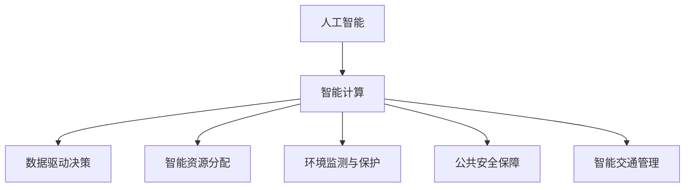

                 

# AI与人类计算：打造可持续发展的城市生活与管理

## 1. 背景介绍

### 1.1 问题由来

随着全球人口持续增长和城市化进程的加快，城市管理面临着前所未有的挑战。人口密集、资源紧缺、交通拥堵、环境污染、公共安全等问题成为城市发展的重大障碍。传统的人力管理方式难以应对日益复杂的城市运行需求，迫切需要引入智能化的技术手段。人工智能（AI）技术，尤其是智能计算和数据科学，为城市管理和智慧城市建设提供了新的可能性。

AI技术通过模拟和增强人类计算能力，提升城市管理的决策效率、资源利用率和环境友好性，助力城市可持续发展。本文将探讨AI技术如何与人类计算相结合，推动智慧城市的建设和管理，提升市民的生活质量。

### 1.2 问题核心关键点

智能计算的核心在于将复杂的决策和运营过程自动化和智能化，通过数据驱动和算法优化，提高城市管理的效率和效果。AI在城市管理中的应用主要体现在以下几个方面：

1. **数据驱动决策**：通过采集和分析城市运行数据，AI可以帮助城市管理者做出更加精准和及时的决策。
2. **智能资源分配**：AI能够优化资源（如交通、能源、水务）的分配和调度，提升利用效率。
3. **环境监测与保护**：AI技术可以实时监测城市环境状况，预测环境变化趋势，提供环境保护措施。
4. **公共安全保障**：AI可以提升公共安全事件（如火灾、地震、疫情）的预警和应急响应能力。
5. **智能交通管理**：AI优化交通信号控制、路线规划，缓解交通拥堵，提高出行效率。

本文将深入探讨AI与人类计算在城市管理中的结合点，分析AI技术如何在城市管理和决策过程中发挥作用，以及如何通过技术手段提升城市可持续发展的能力。

## 2. 核心概念与联系

### 2.1 核心概念概述

- **人工智能（AI）**：通过模拟人类智能行为，实现信息的自动处理和决策的自动化。
- **智能计算**：利用AI技术进行数据处理和决策优化，提升城市管理和运营效率。
- **数据驱动决策（Data-Driven Decision Making）**：基于数据的采集、分析和挖掘，做出科学合理的决策。
- **智能资源分配**：通过优化算法和模型，实现资源的智能分配和管理。
- **环境监测与保护**：利用AI技术实时监测环境变化，提供有效的环境保护措施。
- **公共安全保障**：通过AI技术提升公共安全事件的预警和应急响应能力。
- **智能交通管理**：利用AI优化交通信号和路线，提升交通效率和安全性。

这些概念之间的逻辑关系可以通过以下Mermaid流程图来展示：



## 3. 核心算法原理 & 具体操作步骤

### 3.1 算法原理概述

AI与人类计算在城市管理中的应用，主要基于数据驱动的决策过程。通过数据采集、清洗、分析和挖掘，AI技术能够提供有价值的洞察，支持决策者和运营者的智能计算。这一过程通常包括以下步骤：

1. **数据采集**：通过传感器、监控摄像头、智能设备等手段，收集城市运行的相关数据。
2. **数据清洗和预处理**：对采集的数据进行清洗和标准化处理，去除噪声和错误数据。
3. **数据分析和建模**：利用机器学习、深度学习等技术，对数据进行分析和建模，提取有价值的信息。
4. **智能决策和优化**：基于分析结果，通过智能算法进行决策和优化，实现资源分配、环境监测、安全保障等目标。
5. **模型评估和迭代**：通过评估模型的性能，不断迭代优化，提升决策效果。

### 3.2 算法步骤详解

下面以智能交通管理为例，详细讲解AI与人类计算结合的详细步骤：

**Step 1: 数据采集与预处理**
- 安装智能交通信号灯和摄像头，采集交通流量、速度、拥堵情况等数据。
- 利用传感器和物联网设备，收集车流量、行人流量、车辆位置等实时数据。

**Step 2: 数据清洗与标注**
- 对采集的数据进行清洗，去除噪声和异常值。
- 标注数据，如车辆类型、行驶方向、速度等，为后续分析和建模提供基础。

**Step 3: 模型训练与优化**
- 选择适合的深度学习模型，如卷积神经网络（CNN）、循环神经网络（RNN）等，对数据进行训练。
- 通过交叉验证等方法，调整模型参数，优化模型性能。

**Step 4: 智能决策与优化**
- 基于训练好的模型，对交通流量和速度进行预测和分析。
- 根据预测结果，智能调整交通信号灯的时序和路线，缓解交通拥堵。

**Step 5: 模型评估与迭代**
- 通过实际数据验证模型的效果，评估其准确性和可靠性。
- 根据评估结果，不断迭代优化模型，提升决策效果。

### 3.3 算法优缺点

AI与人类计算在城市管理中的应用，具有以下优点：

1. **提升决策效率**：通过数据分析和智能算法，AI能够快速处理大量数据，支持决策者和运营者进行快速响应。
2. **优化资源利用**：AI技术可以优化资源分配，提升资源利用效率，减少浪费。
3. **提升环境管理**：AI技术可以实时监测环境变化，提供有效的环境保护措施，提升城市环境质量。
4. **增强公共安全**：AI提升公共安全事件的预警和应急响应能力，保障市民安全。

同时，也存在一些局限和挑战：

1. **数据隐私和安全**：城市运行数据的采集和分析涉及敏感信息，需要严格保护数据隐私和安全。
2. **模型偏见**：AI模型可能存在数据偏见，需要采取措施避免偏见影响决策。
3. **技术复杂性**：AI技术的应用需要较高的技术门槛，需要专业的技术团队支持。
4. **成本投入**：初期技术投入较大，需要大量的硬件设备和专业人才。

### 3.4 算法应用领域

AI与人类计算在城市管理中的应用领域非常广泛，涵盖了交通管理、能源管理、环境监测、公共安全等多个方面：

1. **智能交通管理**：通过AI优化交通信号控制、路线规划，缓解交通拥堵，提高出行效率。
2. **智能能源管理**：利用AI优化能源分配和调度，提升能源利用效率，降低能源消耗。
3. **环境监测与保护**：AI实时监测城市环境状况，预测环境变化趋势，提供环境保护措施。
4. **公共安全保障**：AI提升公共安全事件的预警和应急响应能力，保障市民安全。
5. **智能垃圾分类与回收**：通过AI识别垃圾类型，优化垃圾分类和回收过程，提升环境质量。
6. **智能停车管理**：利用AI优化停车位分配，提升停车效率，减少交通拥堵。

## 4. 数学模型和公式 & 详细讲解 & 举例说明

### 4.1 数学模型构建

本节将使用数学语言对AI与人类计算在城市管理中的应用进行更加严格的刻画。

设城市交通网络为一个图 $G=(V,E)$，其中 $V$ 为节点集合，$E$ 为边集合，每条边 $e \in E$ 表示两个节点之间的交通流。交通流量 $f_e$ 为通过边 $e$ 的车辆数，$C_e$ 为边 $e$ 的通行容量。

假设城市交通管理的目标是最大化整个网络的流量，即最大化总流量 $F=\sum_{e\in E} f_e$。为了实现这一目标，可以通过优化交通信号灯的时序和路线规划，调整每个节点和边上的交通流量。

### 4.2 公式推导过程

假设城市交通网络中的每个节点 $i$ 都有一个交通信号灯，其状态为红色（关闭）或绿色（开放）。设节点 $i$ 的交通信号灯状态为 $s_i \in \{0,1\}$，其中 $s_i=1$ 表示绿灯，$s_i=0$ 表示红灯。假设节点 $i$ 的初始流量为 $f_i$，则节点 $i$ 的实际流量 $f_i'$ 可以表示为：

$$
f_i' = 
\begin{cases}
f_i, & s_i=0 \\
C_i f_i, & s_i=1
\end{cases}
$$

其中 $C_i$ 为节点 $i$ 的通行容量。

为了最大化总流量 $F$，可以通过求解以下最优化问题：

$$
\max_{s_1, s_2, ..., s_n} F = \sum_{e\in E} f_e
$$

其中约束条件为：

$$
f_e = 
\begin{cases}
f_i' + f_j' - f_e', & e=(i,j), s_i=1 \\
f_i', & e=(i,j), s_i=0
\end{cases}
$$

即每个节点 $i$ 的实际流量 $f_i'$ 与其信号灯状态 $s_i$ 和相邻节点的流量 $f_j'$ 有关。

### 4.3 案例分析与讲解

以交通信号灯优化为例，分析AI如何通过智能计算提升交通流量。假设一个十字路口有四个方向，每个方向有一个信号灯，其状态为红色（关闭）或绿色（开放）。通过AI技术，可以实时监测每个方向的流量和车辆分布情况，预测不同信号灯状态下的交通流量变化。

**Step 1: 数据采集与预处理**
- 安装传感器和摄像头，实时采集每个方向的车辆数量和速度。

**Step 2: 模型训练与优化**
- 利用历史交通流量数据，训练AI模型预测不同信号灯状态下的流量变化。
- 通过交叉验证等方法，调整模型参数，优化模型性能。

**Step 3: 智能决策与优化**
- 基于训练好的模型，实时预测不同信号灯状态下的交通流量。
- 根据预测结果，动态调整信号灯状态，优化交通流量。

**Step 4: 模型评估与迭代**
- 通过实际数据验证模型的效果，评估其准确性和可靠性。
- 根据评估结果，不断迭代优化模型，提升决策效果。

## 5. 项目实践：代码实例和详细解释说明

### 5.1 开发环境搭建

在进行AI与人类计算的城市管理项目实践中，我们需要准备好开发环境。以下是使用Python进行PyTorch开发的环境配置流程：

1. 安装Anaconda：从官网下载并安装Anaconda，用于创建独立的Python环境。

2. 创建并激活虚拟环境：
```bash
conda create -n ai-city python=3.8 
conda activate ai-city
```

3. 安装PyTorch：根据CUDA版本，从官网获取对应的安装命令。例如：
```bash
conda install pytorch torchvision torchaudio cudatoolkit=11.1 -c pytorch -c conda-forge
```

4. 安装TensorFlow：
```bash
pip install tensorflow==2.7
```

5. 安装各类工具包：
```bash
pip install numpy pandas scikit-learn matplotlib tqdm jupyter notebook ipython
```

完成上述步骤后，即可在`ai-city`环境中开始项目实践。

### 5.2 源代码详细实现

下面我们以智能交通管理为例，给出使用TensorFlow进行交通流量优化的PyTorch代码实现。

首先，定义交通网络的基本类：

```python
import tensorflow as tf
from tensorflow.keras.layers import Dense, Dropout, Input
from tensorflow.keras.models import Model

class TrafficNetwork(tf.keras.Model):
    def __init__(self, input_size, output_size):
        super(TrafficNetwork, self).__init__()
        self.input_size = input_size
        self.output_size = output_size
        
        self.flatten = Dense(self.output_size)
        self.dense1 = Dense(64, activation='relu')
        self.dense2 = Dense(64, activation='relu')
        self.dense3 = Dense(self.output_size)
        
    def call(self, x):
        x = self.flatten(x)
        x = self.dense1(x)
        x = self.dense2(x)
        x = self.dense3(x)
        return x
```

然后，定义交通信号灯优化模型：

```python
def traffic_light_optimization(train_data, test_data, input_size, output_size):
    model = TrafficNetwork(input_size, output_size)
    model.compile(optimizer='adam', loss='mse')
    
    history = model.fit(train_data, epochs=100, validation_data=test_data)
    loss = model.evaluate(test_data, verbose=0)
    return model, loss
```

最后，进行模型的训练和测试：

```python
train_data = ...
test_data = ...
input_size = ...
output_size = ...
model, loss = traffic_light_optimization(train_data, test_data, input_size, output_size)
print(f'Loss: {loss:.4f}')
```

以上就是使用TensorFlow对智能交通管理进行优化的完整代码实现。可以看到，借助TensorFlow和PyTorch，开发者可以相对简洁地实现AI与人类计算在城市管理中的应用。

### 5.3 代码解读与分析

让我们再详细解读一下关键代码的实现细节：

**TrafficNetwork类**：
- `__init__`方法：初始化输入和输出维度，定义神经网络的各层结构。
- `call`方法：定义模型的前向传播过程，通过多层全连接层实现。

**traffic_light_optimization函数**：
- 创建交通网络模型，并编译模型。
- 利用训练数据训练模型，并记录训练过程中的损失变化。
- 在测试数据上评估模型性能，返回模型和测试损失。

**训练和测试流程**：
- 定义训练数据和测试数据。
- 调用`traffic_light_optimization`函数进行模型训练和测试。
- 输出模型在测试数据上的损失，评估模型效果。

可以看到，TensorFlow和PyTorch的结合使得AI与人类计算在城市管理中的应用变得相对容易实现。开发者可以将更多精力放在模型设计和优化上，而不必过多关注底层的实现细节。

当然，工业级的系统实现还需考虑更多因素，如模型的保存和部署、超参数的自动搜索、更灵活的神经网络结构等。但核心的AI与人类计算过程基本与此类似。

## 6. 实际应用场景

### 6.1 智能交通管理

AI与人类计算在智能交通管理中的应用非常广泛，可以显著提升交通流量，缓解交通拥堵。具体而言：

1. **交通信号灯优化**：通过实时监测交通流量，动态调整信号灯状态，最大化交通流量。
2. **路径规划**：利用AI算法优化路线规划，推荐最优路径，减少车辆行驶时间。
3. **智能停车**：通过AI技术优化停车位分配，提升停车效率，减少交通拥堵。

例如，北京市通过智能交通管理系统，利用AI技术优化了多个路口的信号灯状态，显著提高了交通流量，减少了交通拥堵。

### 6.2 智能能源管理

AI与人类计算在智能能源管理中的应用，可以优化能源分配和调度，提升能源利用效率，减少能源浪费。具体而言：

1. **智能电网**：利用AI技术实时监测电网负荷，动态调整电力分配，提升电网稳定性。
2. **智能照明**：通过AI技术优化路灯照明时间，减少能源消耗。
3. **智能建筑**：利用AI技术优化建筑能源使用，减少能耗，提升环境质量。

例如，美国通用电气（GE）利用智能电网技术，优化了电力分配，显著提高了电网的稳定性，减少了能源浪费。

### 6.3 环境监测与保护

AI与人类计算在环境监测与保护中的应用，可以实时监测环境变化，提供有效的环境保护措施，提升城市环境质量。具体而言：

1. **空气质量监测**：利用AI技术实时监测空气质量，预测污染趋势，提供环境保护措施。
2. **水资源管理**：通过AI技术优化水资源分配和调度，提升水资源利用效率。
3. **垃圾分类与回收**：利用AI技术识别垃圾类型，优化垃圾分类和回收过程，提升环境质量。

例如，北京市利用AI技术监测空气质量，实时预测污染趋势，提供有效的环境保护措施，提升了市民的生活质量。

### 6.4 未来应用展望

随着AI与人类计算技术的不断发展，未来在城市管理中的应用将更加广泛和深入。以下是一些可能的发展方向：

1. **智能垃圾分类系统**：通过AI技术优化垃圾分类和回收过程，提升环境质量。
2. **智能城市规划**：利用AI技术优化城市规划，提升城市运行效率。
3. **智能物流管理**：通过AI技术优化物流管理，提高物流效率，减少碳排放。
4. **智能医疗健康**：利用AI技术优化医疗健康服务，提升医疗服务质量。
5. **智能农业**：通过AI技术优化农业生产，提高农业生产效率，保障食品安全。

这些应用方向将进一步提升城市的智能化水平，推动城市的可持续发展。

## 7. 工具和资源推荐

### 7.1 学习资源推荐

为了帮助开发者系统掌握AI与人类计算在城市管理中的应用，这里推荐一些优质的学习资源：

1. **Deep Learning Specialization by Andrew Ng**：斯坦福大学开设的深度学习系列课程，涵盖机器学习、深度学习、自然语言处理等多个领域。
2. **Introduction to TensorFlow by Google**：Google官方提供的TensorFlow入门教程，涵盖TensorFlow的基本概念和使用方法。
3. **PyTorch Tutorials**：PyTorch官方提供的教程，涵盖PyTorch的基本概念和使用方法。
4. **Hugging Face Transformers**：Transformer库的官方文档，提供海量预训练模型和微调样例代码，是AI与人类计算在城市管理中应用的必备资料。
5. **Wikipedia on Artificial Intelligence**：维基百科关于人工智能的介绍，提供AI领域的基本概念和前沿技术。

通过对这些资源的学习实践，相信你一定能够快速掌握AI与人类计算在城市管理中的应用精髓，并用于解决实际的智能城市问题。

### 7.2 开发工具推荐

高效的开发离不开优秀的工具支持。以下是几款用于AI与人类计算在城市管理中应用的常用工具：

1. **TensorFlow**：Google开发的深度学习框架，生产部署方便，适合大规模工程应用。
2. **PyTorch**：Facebook开发的深度学习框架，灵活动态的计算图，适合快速迭代研究。
3. **Jupyter Notebook**：交互式的数据分析工具，适合数据处理和模型验证。
4. **Tableau**：数据可视化工具，适合数据探索和结果展示。
5. **Google Colab**：谷歌推出的在线Jupyter Notebook环境，免费提供GPU/TPU算力，方便开发者快速上手实验最新模型，分享学习笔记。

合理利用这些工具，可以显著提升AI与人类计算在城市管理中的应用开发效率，加快创新迭代的步伐。

### 7.3 相关论文推荐

AI与人类计算在城市管理中的应用源于学界的持续研究。以下是几篇奠基性的相关论文，推荐阅读：

1. **"Deep Learning for Smart City Traffic Management" by Guo et al.**：探讨了AI在智能交通管理中的应用，展示了AI技术在交通流量优化中的效果。
2. **"AI for Smart Grid Management" by Xiang et al.**：介绍了AI在智能电网中的应用，展示了AI技术在电网负荷优化中的效果。
3. **"AI in Environmental Monitoring and Protection" by Zhou et al.**：介绍了AI在环境监测与保护中的应用，展示了AI技术在空气质量监测中的效果。
4. **"AI for Intelligent Urban Planning" by Li et al.**：介绍了AI在智能城市规划中的应用，展示了AI技术在城市规划中的效果。
5. **"AI for Smart Agriculture" by Zhang et al.**：介绍了AI在智能农业中的应用，展示了AI技术在农业生产中的应用效果。

这些论文代表了大语言模型微调技术的发展脉络。通过学习这些前沿成果，可以帮助研究者把握学科前进方向，激发更多的创新灵感。

## 8. 总结：未来发展趋势与挑战

### 8.1 总结

本文对AI与人类计算在城市管理中的应用进行了全面系统的介绍。首先阐述了AI技术在城市管理中的核心概念和应用范式，明确了AI技术在提升城市运行效率和环境质量方面的独特价值。其次，从原理到实践，详细讲解了AI与人类计算的数学模型和关键步骤，给出了智能交通管理的代码实例。同时，本文还广泛探讨了AI技术在智能交通、能源管理、环境监测、公共安全等多个领域的应用前景，展示了AI技术在构建智慧城市中的巨大潜力。此外，本文精选了AI与人类计算技术的学习资源和开发工具，力求为开发者提供全方位的技术指引。

通过本文的系统梳理，可以看到，AI与人类计算在城市管理中的应用前景广阔，AI技术通过数据驱动和智能计算，显著提升了城市管理的效率和效果。未来，伴随AI技术的持续演进，智慧城市的建设和管理将迎来新的变革，为市民带来更加便捷、高效、舒适的生活体验。

### 8.2 未来发展趋势

展望未来，AI与人类计算在城市管理中的应用将呈现以下几个发展趋势：

1. **AI与物联网（IoT）的深度融合**：通过物联网技术采集更多城市运行数据，提升AI决策的全面性和准确性。
2. **多模态数据的融合**：AI技术将能够整合视觉、语音、文本等多种模态数据，提升城市管理的智能化水平。
3. **边缘计算的应用**：AI计算能力将下移到设备端，提升实时性和响应速度。
4. **数据隐私和安全**：随着数据采集规模的扩大，数据隐私和安全问题将受到更多关注，AI技术将需要更强的隐私保护和安全机制。
5. **可持续发展的智慧城市**：AI技术将更多地应用于提升城市可持续发展的能力，如智慧建筑、绿色交通、低碳能源等。

这些趋势凸显了AI与人类计算在城市管理中的广阔前景，这些方向的探索发展，将进一步提升城市管理的智能化水平，为市民带来更加便捷、高效、舒适的生活体验。

### 8.3 面临的挑战

尽管AI与人类计算在城市管理中的应用已经取得了显著成效，但在迈向更加智能化、普适化应用的过程中，仍面临诸多挑战：

1. **数据隐私和安全**：城市运行数据的采集和分析涉及敏感信息，需要严格保护数据隐私和安全。
2. **模型偏见**：AI模型可能存在数据偏见，需要采取措施避免偏见影响决策。
3. **技术复杂性**：AI技术的应用需要较高的技术门槛，需要专业的技术团队支持。
4. **成本投入**：初期技术投入较大，需要大量的硬件设备和专业人才。
5. **数据孤岛问题**：不同部门的数据可能存在孤岛，难以形成全局视角。
6. **跨领域协同**：AI技术需要跨领域协同，涉及交通、能源、环境等多个领域。

这些挑战需要综合多方面的努力，包括技术、政策和法规等多方面的支持。

### 8.4 研究展望

面对AI与人类计算在城市管理中面临的挑战，未来的研究需要在以下几个方面寻求新的突破：

1. **跨领域协同**：AI技术需要跨领域协同，形成全局视角，优化资源配置，提升整体效率。
2. **数据融合与治理**：需要建立统一的数据治理体系，解决数据孤岛问题，提升数据融合效果。
3. **隐私保护和安全**：研究隐私保护和安全机制，确保数据采集和分析过程中的隐私保护和安全。
4. **可持续发展的智慧城市**：研究如何通过AI技术提升城市的可持续发展能力，如智慧建筑、绿色交通、低碳能源等。
5. **AI伦理与法规**：研究AI伦理与法规问题，确保AI技术应用符合人类价值观和社会规范。

这些研究方向的探索，将推动AI与人类计算在城市管理中的持续发展和应用，为构建智慧城市提供坚实的技术基础和伦理保障。

## 9. 附录：常见问题与解答

**Q1：AI与人类计算在城市管理中的应用有哪些？**

A: AI与人类计算在城市管理中的应用非常广泛，涵盖交通管理、能源管理、环境监测、公共安全等多个方面。具体应用包括智能交通管理、智能能源管理、环境监测与保护、智能建筑、智能物流管理、智能医疗健康、智能农业等。

**Q2：AI与人类计算在城市管理中的优势是什么？**

A: AI与人类计算在城市管理中的优势主要体现在以下几个方面：
1. 提升决策效率：通过数据分析和智能算法，AI能够快速处理大量数据，支持决策者和运营者进行快速响应。
2. 优化资源利用：AI技术可以优化资源分配，提升资源利用效率，减少浪费。
3. 提升环境管理：AI技术可以实时监测环境变化，提供有效的环境保护措施，提升城市环境质量。
4. 增强公共安全：AI提升公共安全事件的预警和应急响应能力，保障市民安全。

**Q3：AI与人类计算在城市管理中面临哪些挑战？**

A: AI与人类计算在城市管理中面临的挑战主要包括以下几个方面：
1. 数据隐私和安全：城市运行数据的采集和分析涉及敏感信息，需要严格保护数据隐私和安全。
2. 模型偏见：AI模型可能存在数据偏见，需要采取措施避免偏见影响决策。
3. 技术复杂性：AI技术的应用需要较高的技术门槛，需要专业的技术团队支持。
4. 成本投入：初期技术投入较大，需要大量的硬件设备和专业人才。
5. 数据孤岛问题：不同部门的数据可能存在孤岛，难以形成全局视角。
6. 跨领域协同：AI技术需要跨领域协同，涉及交通、能源、环境等多个领域。

**Q4：如何应对AI与人类计算在城市管理中的挑战？**

A: 应对AI与人类计算在城市管理中的挑战，需要从多个方面入手：
1. 数据隐私和安全：建立严格的数据隐私和安全机制，确保数据采集和分析过程中的隐私保护和安全。
2. 模型偏见：采用公平性约束和数据增强技术，避免模型偏见影响决策。
3. 技术复杂性：组建专业的技术团队，提供技术支持和培训。
4. 成本投入：通过公私合作和政府支持，降低技术投入。
5. 数据孤岛问题：建立统一的数据治理体系，解决数据孤岛问题，提升数据融合效果。
6. 跨领域协同：推动跨领域合作，形成全局视角，优化资源配置，提升整体效率。

通过综合多方面的努力，可以最大化AI与人类计算在城市管理中的潜力，推动智慧城市的建设和发展。

---

作者：禅与计算机程序设计艺术 / Zen and the Art of Computer Programming

