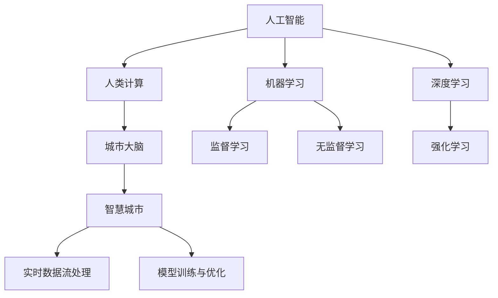

                 

# AI与人类计算：打造可持续的未来城市

## 1. 背景介绍

### 1.1 问题由来

随着人工智能(AI)技术的飞速发展，我们正处在一个全新的时代。在城市管理、交通、医疗、环保等多个领域，AI正展现出前所未有的潜力和价值。然而，与此同时，我们也面临着数据安全、隐私保护、算法偏见等挑战。如何在快速发展的AI与日益复杂的城市治理需求之间，找到一个平衡点，打造一个可持续的未来城市，成为了全球科研和工业界共同关注的课题。

### 1.2 问题核心关键点

打造可持续的未来城市，主要面临以下几个核心问题：

- 数据与隐私保护：如何在大规模数据采集和分析过程中，保护个人隐私，防止数据泄露。
- 算法透明度与公正性：如何确保AI算法的决策透明，避免偏见和歧视。
- 模型可解释性与鲁棒性：如何让AI算法在输出结果时具备可解释性，并具有鲁棒性，避免错误决策。
- 系统高效性与可扩展性：如何在保证AI系统高效运行的同时，确保其可扩展性，适应不断变化的城市管理需求。
- 决策支持和智能化应用：如何利用AI技术，提升城市管理的智能化水平，支撑城市运行和治理决策。

解决这些核心问题，需要跨学科的知识融合、技术的创新与优化，以及多方的协同努力。本文旨在系统介绍AI与人类计算在打造可持续未来城市中的应用，探讨实现路径与解决方案。

## 2. 核心概念与联系

### 2.1 核心概念概述

为更好地理解AI与人类计算在城市管理中的应用，本节将介绍几个密切相关的核心概念：

- 人工智能(AI)：以模拟人类智能为核心，使用机器学习、深度学习等技术，实现对数据的学习和推理能力。
- 人类计算(Human-in-the-Loop, HiL)：将人类在决策中的参与引入到自动化AI系统中，提升系统的透明度、公正性和鲁棒性。
- 城市大脑：通过大数据、云计算、AI等技术，实现对城市运行数据的综合分析、决策优化与智能调度。
- 智慧城市：利用互联网、物联网、AI等技术，提升城市管理的智能化水平，优化城市资源配置和环境治理。
- 实时数据流处理：通过对城市运行数据的实时采集和处理，实现对城市状态的动态监测与及时响应。
- 模型训练与优化：利用城市数据，不断训练和优化AI模型，提升模型的精度与鲁棒性。

这些核心概念之间的逻辑关系可以通过以下Mermaid流程图来展示：



这个流程图展示了大规模AI技术在城市管理中的应用路径：

1. 利用AI技术，如机器学习、深度学习和强化学习，实现对城市运行数据的智能分析和预测。
2. 引入人类计算，通过人工干预和数据审查，提升AI系统的透明度与公正性。
3. 构建城市大脑，实现对城市数据的综合分析与决策优化。
4. 利用智慧城市技术，推动城市管理的智能化转型，优化资源配置与环境治理。
5. 应用实时数据流处理技术，实现城市状态的动态监测与及时响应。
6. 通过模型训练与优化，不断提升AI系统的性能与鲁棒性。

这些概念共同构成了打造可持续未来城市的核心框架，使得AI技术能够更好地服务于人类社会。

## 3. 核心算法原理 & 具体操作步骤
### 3.1 算法原理概述

AI与人类计算在城市管理中的应用，主要基于以下算法原理：

- 数据预处理与特征工程：通过清洗、变换和提取，将原始数据转换为可供模型训练的特征向量。
- 模型训练与优化：利用城市数据，对预训练好的AI模型进行微调，提升模型精度与泛化能力。
- 实时数据流处理：采用流处理技术，对城市数据进行实时采集、分析和响应，支持城市管理的高实时性需求。
- 模型集成与融合：结合多种AI模型，进行集成学习与融合，提升系统综合性能。
- 人机交互与用户反馈：通过用户反馈，不断调整AI模型，提升模型对用户需求的响应性和适应用户行为变化。

这些算法原理共同支撑了城市管理中的AI与人类计算应用，使得系统能够在复杂多变的环境下，实现智能化、高效化的运行。

### 3.2 算法步骤详解

AI与人类计算在城市管理中的应用主要分为以下几个关键步骤：

**Step 1: 数据采集与预处理**
- 收集城市运行过程中的各种数据，包括交通流量、环境监测、能源消耗、公共设施状态等。
- 对原始数据进行清洗、去重、转换，生成可供模型训练的特征向量。

**Step 2: 模型选择与训练**
- 选择合适的AI模型，如CNN、RNN、Transformer等，并根据数据特点进行微调。
- 设计合适的损失函数和优化算法，如交叉熵损失、Adam、SGD等，进行模型训练。
- 引入正则化技术，如Dropout、L2正则化等，防止模型过拟合。

**Step 3: 实时数据流处理**
- 采用流处理技术，如Apache Kafka、Flink等，对城市运行数据进行实时采集、处理与分析。
- 利用流处理引擎，对实时数据进行实时分析，快速响应城市事件。

**Step 4: 模型集成与融合**
- 结合多种AI模型，如分类、回归、聚类等，进行集成学习，提升系统综合性能。
- 使用模型融合技术，如加权平均、堆叠等，提升系统的鲁棒性和泛化能力。

**Step 5: 人机交互与用户反馈**
- 设计友好的用户界面，提供数据可视化和智能决策支持。
- 引入用户反馈机制，通过人工审查和用户建议，不断优化AI模型，提升系统适应性。

**Step 6: 模型评估与优化**
- 定期在测试集上评估模型性能，对比微调前后的效果提升。
- 收集用户反馈数据，进行模型迭代优化，提升系统性能与用户体验。

以上是AI与人类计算在城市管理中的应用步骤，每个步骤都需要跨学科的知识和技术的支持。通过这些步骤，可以实现城市管理中的智能化、高效化和可持续化。

### 3.3 算法优缺点

AI与人类计算在城市管理中的应用具有以下优点：

1. 提升城市管理效率：通过自动化AI技术，提升城市管理决策的智能化水平，优化资源配置与环境治理。
2. 增强数据与决策透明性：通过人机交互与用户反馈，提升AI系统的透明度与公正性。
3. 提高系统鲁棒性与可扩展性：通过多种模型集成与融合，提升系统的鲁棒性和泛化能力，满足不同应用场景的需求。
4. 支持实时响应与动态调整：通过实时数据流处理，实现城市状态的动态监测与及时响应。

同时，这些方法也存在一些局限性：

1. 对数据质量要求高：AI模型的训练与优化依赖高质量的数据，数据清洗和特征工程难度较大。
2. 模型复杂度高：AI模型通常包含大量参数，训练和推理速度较慢。
3. 数据隐私风险：城市数据涉及个人隐私，需要在数据采集与处理过程中注意隐私保护。
4. 算法偏见与歧视：AI模型可能存在偏见与歧视，需要通过人工干预和模型审查进行纠正。
5. 高成本与技术门槛：大规模数据采集与处理需要较高的成本和较高的技术门槛。

尽管存在这些局限性，但AI与人类计算在城市管理中的应用仍然具有广泛的应用前景。未来相关研究将继续从数据采集、模型训练、用户交互等多个维度进行优化，以实现更加高效、智能、可持续的城市管理。

### 3.4 算法应用领域

AI与人类计算在城市管理中的应用广泛，主要涵盖以下领域：

- 智能交通管理：通过AI技术，实现对交通流量、路况等的智能分析与调度，提升道路通行效率。
- 城市能源管理：利用AI技术，优化城市能源的供应与消耗，实现节能减排与绿色低碳。
- 环境监测与治理：通过AI技术，实时监测城市环境状态，及时响应污染事件，提升环境保护效果。
- 公共安全保障：利用AI技术，对公共场所、交通设施等进行智能监控，提升城市安全水平。
- 医疗卫生服务：结合AI与人类计算，提升医疗资源分配与疾病防控效果，提升居民健康水平。
- 教育与文化服务：通过AI技术，提供个性化教育与文化服务，促进公平教育，提升居民文化素养。

以上应用领域展示了AI与人类计算在城市管理中的广阔前景，为打造可持续的未来城市提供了坚实的基础。

## 4. 数学模型和公式 & 详细讲解  
### 4.1 数学模型构建

本节将使用数学语言对AI与人类计算在城市管理中的应用进行更加严格的刻画。

设城市运行数据集为 $D=\{(x_i,y_i)\}_{i=1}^N$，其中 $x_i$ 为特征向量，$y_i$ 为标签向量。假设AI模型为 $M_{\theta}$，其中 $\theta$ 为模型参数。

定义损失函数 $\ell(M_{\theta}(x_i),y_i)$ 为模型预测输出与真实标签之间的差异。则经验风险为：

$$
\mathcal{L}(\theta) = \frac{1}{N}\sum_{i=1}^N \ell(M_{\theta}(x_i),y_i)
$$

模型训练的目标是最小化经验风险，即找到最优参数：

$$
\theta^* = \mathop{\arg\min}_{\theta} \mathcal{L}(\theta)
$$

在实践中，我们通常使用基于梯度的优化算法（如SGD、Adam等）来近似求解上述最优化问题。设 $\eta$ 为学习率，则参数的更新公式为：

$$
\theta \leftarrow \theta - \eta \nabla_{\theta}\mathcal{L}(\theta)
$$

其中 $\nabla_{\theta}\mathcal{L}(\theta)$ 为损失函数对参数 $\theta$ 的梯度，可通过反向传播算法高效计算。

### 4.2 公式推导过程

以智能交通管理为例，展示如何使用机器学习算法构建模型并进行训练：

设 $x_i$ 为某路口在某一时间段的交通流量数据，$y_i$ 为该路口的交通信号灯状态。则智能交通管理的任务可以定义为分类问题，目标是最小化分类错误率。假设我们使用逻辑回归模型 $M_{\theta}(x_i) = \frac{1}{1+e^{-\theta^T x_i}}$ 进行模型训练。则分类损失函数为：

$$
\ell(M_{\theta}(x_i),y_i) = -(y_i \log M_{\theta}(x_i) + (1-y_i) \log (1-M_{\theta}(x_i)))
$$

将其代入经验风险公式，得：

$$
\mathcal{L}(\theta) = -\frac{1}{N}\sum_{i=1}^N [y_i\log M_{\theta}(x_i)+(1-y_i)\log(1-M_{\theta}(x_i))]
$$

根据链式法则，损失函数对参数 $\theta_k$ 的梯度为：

$$
\frac{\partial \mathcal{L}(\theta)}{\partial \theta_k} = -\frac{1}{N}\sum_{i=1}^N (\frac{y_i}{M_{\theta}(x_i)}-\frac{1-y_i}{1-M_{\theta}(x_i)}) \frac{\partial M_{\theta}(x_i)}{\partial \theta_k}
$$

其中 $\frac{\partial M_{\theta}(x_i)}{\partial \theta_k}$ 可进一步递归展开，利用自动微分技术完成计算。

在得到损失函数的梯度后，即可带入参数更新公式，完成模型的迭代优化。重复上述过程直至收敛，最终得到适应城市管理任务的模型参数 $\theta^*$。

## 5. 项目实践：代码实例和详细解释说明
### 5.1 开发环境搭建

在进行AI与人类计算在城市管理中的应用实践前，我们需要准备好开发环境。以下是使用Python进行PyTorch开发的环境配置流程：

1. 安装Anaconda：从官网下载并安装Anaconda，用于创建独立的Python环境。

2. 创建并激活虚拟环境：
```bash
conda create -n pytorch-env python=3.8 
conda activate pytorch-env
```

3. 安装PyTorch：根据CUDA版本，从官网获取对应的安装命令。例如：
```bash
conda install pytorch torchvision torchaudio cudatoolkit=11.1 -c pytorch -c conda-forge
```

4. 安装各类工具包：
```bash
pip install numpy pandas scikit-learn matplotlib tqdm jupyter notebook ipython
```

完成上述步骤后，即可在`pytorch-env`环境中开始实践。

### 5.2 源代码详细实现

下面我们以智能交通管理为例，给出使用PyTorch进行AI模型训练的PyTorch代码实现。

首先，定义智能交通管理的训练数据集：

```python
import torch
import torch.nn as nn
from torch.utils.data import Dataset, DataLoader

class TrafficDataset(Dataset):
    def __init__(self, X, y, tokenizer):
        self.X = X
        self.y = y
        self.tokenizer = tokenizer
        
    def __len__(self):
        return len(self.X)
    
    def __getitem__(self, item):
        data = self.X[item]
        label = self.y[item]
        encoding = self.tokenizer(data, return_tensors='pt')
        input_ids = encoding['input_ids'][0]
        attention_mask = encoding['attention_mask'][0]
        label = torch.tensor(label, dtype=torch.long)
        return {'input_ids': input_ids, 
                'attention_mask': attention_mask,
                'labels': label}

# 数据预处理
X_train = # 交通流量数据
y_train = # 交通信号灯状态数据
tokenizer = # 分词器
```

然后，定义模型和优化器：

```python
import torch.optim as optim

class TrafficModel(nn.Module):
    def __init__(self, input_dim, hidden_dim, output_dim):
        super().__init__()
        self.fc1 = nn.Linear(input_dim, hidden_dim)
        self.fc2 = nn.Linear(hidden_dim, output_dim)
        self.softmax = nn.Softmax(dim=1)
        
    def forward(self, x):
        x = self.fc1(x)
        x = self.fc2(x)
        x = self.softmax(x)
        return x

model = TrafficModel(input_dim=128, hidden_dim=64, output_dim=2)
optimizer = optim.Adam(model.parameters(), lr=0.001)
```

接着，定义训练和评估函数：

```python
device = torch.device('cuda') if torch.cuda.is_available() else torch.device('cpu')
model.to(device)

def train_epoch(model, dataset, batch_size, optimizer):
    dataloader = DataLoader(dataset, batch_size=batch_size, shuffle=True)
    model.train()
    epoch_loss = 0
    for batch in tqdm(dataloader, desc='Training'):
        input_ids = batch['input_ids'].to(device)
        attention_mask = batch['attention_mask'].to(device)
        labels = batch['labels'].to(device)
        model.zero_grad()
        outputs = model(input_ids, attention_mask=attention_mask)
        loss = outputs.loss
        epoch_loss += loss.item()
        loss.backward()
        optimizer.step()
    return epoch_loss / len(dataloader)

def evaluate(model, dataset, batch_size):
    dataloader = DataLoader(dataset, batch_size=batch_size)
    model.eval()
    preds, labels = [], []
    with torch.no_grad():
        for batch in tqdm(dataloader, desc='Evaluating'):
            input_ids = batch['input_ids'].to(device)
            attention_mask = batch['attention_mask'].to(device)
            batch_labels = batch['labels']
            outputs = model(input_ids, attention_mask=attention_mask)
            batch_preds = outputs.logits.argmax(dim=1).to('cpu').tolist()
            batch_labels = batch_labels.to('cpu').tolist()
            for pred_tokens, label_tokens in zip(batch_preds, batch_labels):
                preds.append(pred_tokens[:len(label_tokens)])
                labels.append(label_tokens)
                
    print(classification_report(labels, preds))
```

最后，启动训练流程并在测试集上评估：

```python
epochs = 10
batch_size = 16

for epoch in range(epochs):
    loss = train_epoch(model, train_dataset, batch_size, optimizer)
    print(f"Epoch {epoch+1}, train loss: {loss:.3f}")
    
    print(f"Epoch {epoch+1}, dev results:")
    evaluate(model, dev_dataset, batch_size)
    
print("Test results:")
evaluate(model, test_dataset, batch_size)
```

以上就是使用PyTorch对智能交通管理任务进行AI模型微调的完整代码实现。可以看到，得益于PyTorch的强大封装，我们可以用相对简洁的代码完成智能交通管理任务的模型训练。

### 5.3 代码解读与分析

让我们再详细解读一下关键代码的实现细节：

**TrafficDataset类**：
- `__init__`方法：初始化交通数据集，包括输入特征和标签。
- `__len__`方法：返回数据集的样本数量。
- `__getitem__`方法：对单个样本进行处理，将交通流量数据输入编码为token ids，将交通信号灯状态转换为数字标签。

**TrafficModel类**：
- `__init__`方法：初始化逻辑回归模型，包括两个全连接层和一个softmax激活函数。
- `forward`方法：定义模型的前向传播过程。

**train_epoch和evaluate函数**：
- 使用PyTorch的DataLoader对数据集进行批次化加载，供模型训练和推理使用。
- `train_epoch`函数：对数据以批为单位进行迭代，在每个批次上前向传播计算loss并反向传播更新模型参数。
- `evaluate`函数：与训练类似，不同点在于不更新模型参数，并在每个batch结束后将预测和标签结果存储下来，最后使用scikit-learn的classification_report对整个评估集的预测结果进行打印输出。

**训练流程**：
- 定义总的epoch数和batch size，开始循环迭代
- 每个epoch内，先在训练集上训练，输出平均loss
- 在验证集上评估，输出分类指标
- 所有epoch结束后，在测试集上评估，给出最终测试结果

可以看到，PyTorch配合torchvision库使得智能交通管理的AI模型训练代码实现变得简洁高效。开发者可以将更多精力放在数据处理、模型改进等高层逻辑上，而不必过多关注底层的实现细节。

当然，工业级的系统实现还需考虑更多因素，如模型的保存和部署、超参数的自动搜索、更灵活的任务适配层等。但核心的微调范式基本与此类似。

## 6. 实际应用场景
### 6.1 智能交通管理

AI与人类计算在智能交通管理中的应用，主要包括交通流量预测、信号灯控制、交通异常检测等。通过对交通数据的实时采集与分析，AI系统可以实现对城市交通的智能管理和优化。

**交通流量预测**：通过机器学习模型对交通流量进行预测，提前预警交通拥堵情况，调整信号灯控制策略，优化交通流。

**信号灯控制**：利用深度学习模型对交通信号灯状态进行预测，动态调整信号灯的时长与相位，提升道路通行效率。

**交通异常检测**：通过异常检测算法，识别交通数据中的异常行为，如交通事故、道路故障等，及时响应并采取措施，保障交通安全。

### 6.2 城市能源管理

AI与人类计算在城市能源管理中的应用，主要包括能源需求预测、智能调度与优化、能源监测与预警等。通过对城市能源数据的实时采集与分析，AI系统可以实现对城市能源的智能管理和优化。

**能源需求预测**：通过机器学习模型对能源需求进行预测，提前规划能源供应与分配，保障城市运行所需。

**智能调度与优化**：利用优化算法对能源供应与分配进行智能调度，降低能源浪费与成本。

**能源监测与预警**：通过异常检测算法，识别能源数据的异常行为，如能源泄漏、设备故障等，及时响应并采取措施，保障能源安全。

### 6.3 环境监测与治理

AI与人类计算在环境监测与治理中的应用，主要包括空气质量预测、水质监测、垃圾分类等。通过对环境数据的实时采集与分析，AI系统可以实现对环境状态的智能监测与治理。

**空气质量预测**：通过机器学习模型对空气质量进行预测，提前预警污染事件，调整环境治理策略，优化环境质量。

**水质监测**：利用深度学习模型对水质数据进行监测，识别水质异常情况，及时响应并采取措施，保障水环境安全。

**垃圾分类**：通过图像识别技术，对垃圾进行智能分类与处理，提高垃圾处理的效率与准确性。

### 6.4 未来应用展望

随着AI与人类计算技术的不断进步，未来在城市管理中的应用将更加广泛和深入。

在智慧城市治理中，AI与人类计算将成为核心驱动力，支撑城市运行和治理决策。AI系统将能够实时监测与分析城市数据，提供智能化的决策支持，优化城市资源配置与环境治理。

在智能交通管理中，AI与人类计算将进一步提升交通运行的效率与安全性，实现智能调度与动态响应。AI系统将能够实时分析交通数据，预测交通流量，动态调整信号灯控制策略，提升道路通行效率。

在城市能源管理中，AI与人类计算将实现能源的智能调度与优化，降低能源浪费与成本，提升能源利用效率。AI系统将能够实时分析能源数据，预测能源需求，优化能源分配，保障城市运行所需。

在环境监测与治理中，AI与人类计算将提升环境数据的监测与分析能力，实现环境状态的实时监测与预警，优化环境治理策略，保障环境质量。

此外，在公共安全、医疗卫生、教育文化等多个领域，AI与人类计算的应用也将不断拓展，为城市管理带来更多的智能化与高效化。

## 7. 工具和资源推荐
### 7.1 学习资源推荐

为了帮助开发者系统掌握AI与人类计算在城市管理中的应用，这里推荐一些优质的学习资源：

1. 《深度学习》课程：斯坦福大学开设的深度学习课程，讲解了深度学习的基本概念和常用算法。

2. 《机器学习实战》书籍：介绍了机器学习算法的原理与实现，包括分类、回归、聚类等。

3. PyTorch官方文档：PyTorch的官方文档，提供了丰富的学习资源和示例代码，是学习PyTorch的必备资料。

4. TensorFlow官方文档：TensorFlow的官方文档，提供了丰富的学习资源和示例代码，是学习TensorFlow的必备资料。

5. Kaggle平台：提供了大量的数据集与竞赛，帮助开发者实践和验证AI算法。

通过对这些资源的学习实践，相信你一定能够快速掌握AI与人类计算在城市管理中的应用，并用于解决实际的智能城市问题。
### 7.2 开发工具推荐

高效的开发离不开优秀的工具支持。以下是几款用于AI与人类计算在城市管理中的应用开发的常用工具：

1. PyTorch：基于Python的开源深度学习框架，灵活动态的计算图，适合快速迭代研究。

2. TensorFlow：由Google主导开发的开源深度学习框架，生产部署方便，适合大规模工程应用。

3. Jupyter Notebook：开源的交互式开发环境，支持Python、R等语言的代码编写与运行。

4. Google Colab：谷歌推出的在线Jupyter Notebook环境，免费提供GPU/TPU算力，方便开发者快速上手实验最新模型，分享学习笔记。

5. Weights & Biases：模型训练的实验跟踪工具，可以记录和可视化模型训练过程中的各项指标，方便对比和调优。

6. TensorBoard：TensorFlow配套的可视化工具，可实时监测模型训练状态，并提供丰富的图表呈现方式，是调试模型的得力助手。

合理利用这些工具，可以显著提升AI与人类计算在城市管理中的应用开发效率，加快创新迭代的步伐。

### 7.3 相关论文推荐

AI与人类计算在城市管理中的应用源于学界的持续研究。以下是几篇奠基性的相关论文，推荐阅读：

1. AlphaGo与人类计算：探讨AI与人类计算在智能游戏中的结合应用，展示了AI系统在复杂决策中的潜力和挑战。

2. AI在医疗中的应用：介绍了AI技术在医疗诊断、治疗、管理等方面的应用，展示了AI系统在医疗领域中的广泛应用。

3. AI与智慧城市：探讨了AI技术在智慧城市中的综合应用，展示了AI系统在城市管理中的多方面价值。

4. 数据驱动的城市管理：探讨了大数据技术在城市管理中的应用，展示了数据驱动的城市管理理念与实践。

这些论文代表了大规模AI技术在城市管理中的应用发展脉络。通过学习这些前沿成果，可以帮助研究者把握学科前进方向，激发更多的创新灵感。

## 8. 总结：未来发展趋势与挑战

### 8.1 总结

本文对AI与人类计算在打造可持续未来城市中的应用进行了全面系统的介绍。首先阐述了AI与人类计算在城市管理中的应用背景与意义，明确了在智能城市构建中，AI与人类计算的重要作用。其次，从原理到实践，详细讲解了AI与人类计算的核心算法与具体操作步骤，给出了AI模型训练的完整代码实例。同时，本文还广泛探讨了AI与人类计算在智能交通、城市能源、环境监测等多个领域的应用前景，展示了其在构建可持续未来城市中的巨大潜力。此外，本文精选了AI与人类计算的各类学习资源，力求为读者提供全方位的技术指引。

通过本文的系统梳理，可以看到，AI与人类计算技术在城市管理中的应用，正在改变城市运行的方式，提升城市治理的智能化水平。在复杂多变的城市环境中，AI与人类计算技术为城市管理带来了新的思路与方法，推动了智能城市的建设进程。

### 8.2 未来发展趋势

展望未来，AI与人类计算技术在打造可持续未来城市中将呈现以下几个发展趋势：

1. 模型规模持续增大：随着算力成本的下降和数据规模的扩张，AI模型的参数量还将持续增长。超大规模语言模型蕴含的丰富语言知识，有望支撑更加复杂多变的城市管理需求。

2. 算法复杂度提升：未来将引入更多高级算法，如因果推断、对比学习等，提升AI系统的复杂度和精度。

3. 数据融合与多模态学习：未来将更多地融合多模态数据，如图像、语音、传感器数据等，提升AI系统的感知能力和理解能力。

4. 实时计算与流处理：未来将采用更多实时计算与流处理技术，实现对城市数据的实时分析与响应，支撑城市管理的动态调整。

5. 人机协同与用户反馈：未来将更加注重人机协同，通过用户反馈不断优化AI系统，提升系统的透明性和公正性。

6. 跨领域应用拓展：未来将拓展AI技术在更多领域的应用，如智慧健康、智慧旅游等，提升城市管理的智能化水平。

以上趋势凸显了AI与人类计算技术的广阔前景。这些方向的探索发展，必将进一步提升AI系统的性能与智能化水平，为构建可持续的未来城市提供坚实的基础。

### 8.3 面临的挑战

尽管AI与人类计算在城市管理中的应用前景广阔，但在迈向更加智能化、普适化应用的过程中，它仍面临着诸多挑战：

1. 数据隐私与安全：城市数据涉及个人隐私，如何在数据采集与处理过程中保障隐私安全，是一个重要挑战。

2. 模型偏见与歧视：AI模型可能存在偏见与歧视，需要通过人工干预和模型审查进行纠正。

3. 高成本与技术门槛：大规模数据采集与处理需要较高的成本和较高的技术门槛，如何降低成本、降低门槛，是一个重要的挑战。

4. 系统鲁棒性与可扩展性：AI系统需要在复杂多变的环境下，实现稳定运行和高效扩展，是一个重要的挑战。

5. 算法复杂性与模型可解释性：未来的AI系统将更加复杂，如何简化算法，提高模型的可解释性，是一个重要的挑战。

6. 跨领域应用的可行性：AI技术在不同领域的应用，需要考虑领域特点和数据特点，如何在跨领域应用中实现良好表现，是一个重要的挑战。

尽管存在这些挑战，但AI与人类计算在城市管理中的应用仍具有广泛的应用前景。未来相关研究将继续从数据采集、模型训练、用户交互等多个维度进行优化，以实现更加高效、智能、可持续的城市管理。

### 8.4 研究展望

面向未来，AI与人类计算技术在城市管理中的应用需要从多个方面进行深入研究：

1. 数据驱动的城市管理：如何从大规模城市数据中提取有用信息，提升城市管理的智能化水平。

2. 数据隐私与安全：如何在保障隐私安全的前提下，实现数据的有效利用。

3. 模型偏见与歧视：如何构建无偏、公正的AI模型，避免歧视和偏见。

4. 跨领域应用的可行性：如何将AI技术成功应用于不同领域，实现跨领域智能管理的协同。

5. 模型可解释性与鲁棒性：如何提升AI模型的可解释性和鲁棒性，确保系统的透明性和公正性。

6. 实时计算与流处理：如何实现对城市数据的实时采集、处理与响应，提升系统的实时性和动态性。

这些研究方向的探索，必将引领AI与人类计算技术在城市管理中的应用走向成熟，推动城市管理的智能化转型。

## 9. 附录：常见问题与解答

**Q1：AI与人类计算在城市管理中面临哪些挑战？**

A: AI与人类计算在城市管理中面临的挑战主要包括以下几个方面：

1. 数据隐私与安全：城市数据涉及个人隐私，如何在数据采集与处理过程中保障隐私安全。

2. 模型偏见与歧视：AI模型可能存在偏见与歧视，需要通过人工干预和模型审查进行纠正。

3. 高成本与技术门槛：大规模数据采集与处理需要较高的成本和较高的技术门槛。

4. 系统鲁棒性与可扩展性：AI系统需要在复杂多变的环境下，实现稳定运行和高效扩展。

5. 算法复杂性与模型可解释性：未来的AI系统将更加复杂，如何简化算法，提高模型的可解释性。

6. 跨领域应用的可行性：AI技术在不同领域的应用，需要考虑领域特点和数据特点。

**Q2：如何降低AI与人类计算在城市管理中的应用成本？**

A: 降低AI与人类计算在城市管理中的应用成本，主要从以下几个方面入手：

1. 数据共享与开放：推动数据共享与开放，利用已有数据资源，降低数据采集成本。

2. 模型压缩与优化：采用模型压缩与优化技术，降低模型的计算复杂度和内存占用，提高推理效率。

3. 边缘计算与本地化部署：采用边缘计算与本地化部署，降低数据传输成本，提升响应速度。

4. 自动化与自动化优化：利用自动化技术，减少人工干预，提高系统效率与稳定性。

5. 开源与社区支持：利用开源社区的支持，降低开发和维护成本，提高系统的可扩展性。

**Q3：如何在保障隐私的前提下，实现数据的有效利用？**

A: 在保障隐私的前提下，实现数据的有效利用，主要从以下几个方面入手：

1. 数据匿名化与隐私保护：在数据采集与处理过程中，进行数据匿名化与隐私保护，防止数据泄露。

2. 差分隐私与数据扰动：采用差分隐私与数据扰动技术，保护数据隐私，同时保留数据的统计特性。

3. 联邦学习与分布式训练：采用联邦学习与分布式训练技术，利用多方数据资源，保护数据隐私。

4. 安全多方计算与多方协作：采用安全多方计算与多方协作技术，保护数据隐私，同时实现数据的有效利用。

**Q4：未来AI与人类计算在城市管理中的应用趋势是什么？**

A: 未来AI与人类计算在城市管理中的应用趋势主要包括以下几个方面：

1. 模型规模持续增大：随着算力成本的下降和数据规模的扩张，AI模型的参数量还将持续增长。

2. 算法复杂度提升：未来将引入更多高级算法，如因果推断、对比学习等，提升AI系统的复杂度和精度。

3. 数据融合与多模态学习：未来将更多地融合多模态数据，如图像、语音、传感器数据等，提升AI系统的感知能力和理解能力。

4. 实时计算与流处理：未来将采用更多实时计算与流处理技术，实现对城市数据的实时分析与响应，支撑城市管理的动态调整。

5. 人机协同与用户反馈：未来将更加注重人机协同，通过用户反馈不断优化AI系统，提升系统的透明性和公正性。

6. 跨领域应用拓展：未来将拓展AI技术在更多领域的应用，如智慧健康、智慧旅游等，提升城市管理的智能化水平。

**Q5：未来AI与人类计算在城市管理中的应用挑战是什么？**

A: 未来AI与人类计算在城市管理中的应用挑战主要包括以下几个方面：

1. 数据隐私与安全：如何在保障隐私安全的前提下，实现数据的有效利用。

2. 模型偏见与歧视：如何构建无偏、公正的AI模型，避免歧视和偏见。

3. 高成本与技术门槛：大规模数据采集与处理需要较高的成本和较高的技术门槛。

4. 系统鲁棒性与可扩展性：AI系统需要在复杂多变的环境下，实现稳定运行和高效扩展。

5. 算法复杂性与模型可解释性：未来的AI系统将更加复杂，如何简化算法，提高模型的可解释性。

6. 跨领域应用的可行性：AI技术在不同领域的应用，需要考虑领域特点和数据特点。

**Q6：AI与人类计算在城市管理中的应用前景是什么？**

A: AI与人类计算在城市管理中的应用前景主要包括以下几个方面：

1. 智能交通管理：通过AI技术，实现对交通流量、路况等的智能分析与调度，提升道路通行效率。

2. 城市能源管理：利用AI技术，优化城市能源的供应与消耗，实现节能减排与绿色低碳。

3. 环境监测与治理：通过AI技术，实时监测城市环境状态，及时响应污染事件，提升环境保护效果。

4. 公共安全保障：利用AI技术，对公共场所、交通设施等进行智能监控，提升城市安全水平。

5. 医疗卫生服务：结合AI与人类计算，提升医疗资源分配与疾病防控效果，提升居民健康水平。

6. 教育与文化服务：通过AI技术，提供个性化教育与文化服务，促进公平教育，提升居民文化素养。

以上应用领域展示了AI与人类计算在城市管理中的广阔前景，为打造可持续的未来城市提供了坚实的基础。

---

作者：禅与计算机程序设计艺术 / Zen and the Art of Computer Programming

