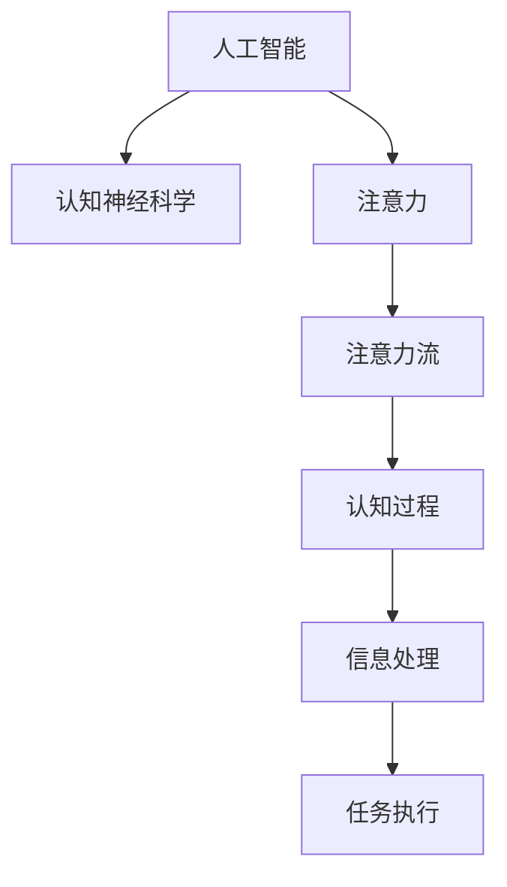

                 

# AI与注意力流：重新想像人类潜能

> 关键词：人工智能,注意力机制,注意力流,认知神经科学,人机协同

## 1. 背景介绍

### 1.1 问题由来

随着科技的飞速发展，人工智能（AI）技术已经渗透到生活的方方面面，从自动驾驶到智能推荐，从语音识别到图像识别，AI正在以它独特的方式改变着世界的面貌。然而，在享受AI带来的便利的同时，我们也不得不思考：AI究竟在多大程度上重塑了人类的潜能？AI与人类智能之间的关系又是什么？

### 1.2 问题核心关键点

当前AI技术已经取得了令人瞩目的成就，但同时，我们也面临着一个新的挑战：如何将AI与人类智能有效结合，实现人机协同。AI在信息处理、模式识别等方面的强大能力，已经在某些领域超越了人类，但它们在创新、情感理解、社交交互等方面的局限，也限制了其应用的广度和深度。而通过“注意力流”机制，AI可以更好地理解人类的注意力和认知过程，从而在认知神经科学和人工智能的交汇点上，找到新的突破口。

## 2. 核心概念与联系

### 2.1 核心概念概述

为了深入理解“注意力流”机制，我们需要了解以下几个核心概念：

- **人工智能**：指通过计算机模拟人类的智能行为，实现各种复杂任务的技术体系。
- **认知神经科学**：研究人类认知过程的神经机制，揭示人类大脑的信息处理方式。
- **注意力**：指在信息处理过程中，对重要信息的集中关注和优先处理。
- **注意力流**：指在认知过程中，注意力在神经网络中的动态分布和调整，形成对输入信息的筛选和聚焦。

这些概念之间的联系如图1所示：



### 2.2 核心概念原理和架构

**人工智能**：以机器学习为核心，通过算法和模型，实现对数据的自动分析和决策。核心技术包括深度学习、自然语言处理、计算机视觉等。

**认知神经科学**：通过脑成像、电生理学等手段，揭示人类认知过程的神经机制，包括感知、记忆、语言、推理等。关键工具包括fMRI、EEG、MEG等。

**注意力**：在认知过程中，个体对重要信息的集中关注。注意力机制包括自顶向下控制和自底向上驱动两种模式。

**注意力流**：指在认知过程中，注意力在神经网络中的动态分布和调整，形成对输入信息的筛选和聚焦。注意力流可以分为自下而上的空间注意力、自上而下的控制注意力等。

## 3. 核心算法原理 & 具体操作步骤

### 3.1 算法原理概述

“注意力流”机制的核心思想是将人工智能与认知神经科学结合起来，通过对注意力机制的理解和模拟，实现对人类认知过程的建模和优化。在深度学习中，注意力机制主要通过自注意力机制和跨注意力机制来实现。

**自注意力机制**：指在神经网络中，对输入数据的不同部分进行加权处理，从而实现对关键信息的聚焦。典型应用包括Transformer模型。

**跨注意力机制**：指在神经网络中，通过跨层连接，实现不同层次信息的融合和整合。典型的应用包括LSTM和GRU等。

### 3.2 算法步骤详解

**Step 1: 设计模型架构**

首先需要设计一个包含注意力机制的深度神经网络模型。以Transformer模型为例，其主要结构如图2所示：


**Step 2: 设置注意力权重**

在自注意力机制中，注意力权重决定了每个输入项对当前输出的贡献。通过训练网络，可以学习到一组注意力权重，用于调整输入信息的重要性。

**Step 3: 模型训练与优化**

在训练过程中，通过反向传播算法，不断调整模型参数，使模型在输入-输出对上误差最小化。常用的优化算法包括Adam、SGD等。

**Step 4: 测试与评估**

在训练完成后，使用测试集评估模型性能，包括准确率、召回率、F1分数等指标。并根据测试结果对模型进行调整。

### 3.3 算法优缺点

**优点**：

- **高效性**：注意力机制能够自动选择关键信息，减少冗余信息的处理，提高计算效率。
- **灵活性**：注意力权重可以根据任务需求进行调整，适应不同的应用场景。
- **鲁棒性**：由于自注意力机制和跨注意力机制的组合，模型对输入数据的鲁棒性更强。

**缺点**：

- **计算复杂性高**：自注意力机制的计算复杂度高，特别是在大规模数据上。
- **参数量大**：由于多头的存在，模型的参数量较大，训练和推理速度较慢。
- **可解释性差**：注意力机制的内部工作机制较为复杂，难以进行直观解释。

### 3.4 算法应用领域

“注意力流”机制在多个领域都有广泛的应用，例如：

- **自然语言处理**：在机器翻译、文本生成、语音识别等任务中，注意力机制能够帮助模型更好地理解输入序列，提高模型的性能。
- **计算机视觉**：在图像分类、目标检测、语义分割等任务中，注意力机制能够帮助模型更好地识别图像中的关键特征。
- **增强现实**：在增强现实场景中，注意力机制能够帮助用户聚焦于感兴趣的物体或场景，提高用户体验。

## 4. 数学模型和公式 & 详细讲解 & 举例说明

### 4.1 数学模型构建

在Transformer模型中，自注意力机制的数学模型可以表示为：

$$
\text{Attention}(Q, K, V) = \text{Softmax}\left(\frac{QK^T}{\sqrt{d_k}}\right)V
$$

其中，$Q$为查询向量，$K$为键向量，$V$为值向量，$d_k$为键向量的维度。Softmax函数用于计算注意力权重。

### 4.2 公式推导过程

通过上述公式，我们可以推导出注意力机制的计算过程。假设输入序列的长度为$n$，输出序列的长度为$m$，则注意力机制的计算过程可以表示为：

1. 计算注意力权重矩阵$A$，其中每个元素$A_{ij}$表示输入序列中第$i$个元素与输出序列中第$j$个元素之间的注意力权重。
2. 根据注意力权重矩阵$A$，计算输出序列中每个元素的值向量$V_j$。
3. 将输出序列中的所有值向量$V_j$进行线性组合，得到最终的输出序列$Y$。

### 4.3 案例分析与讲解

以机器翻译任务为例，我们通过自注意力机制实现输入序列与输出序列之间的映射。具体来说，输入序列为源语言文本，输出序列为目标语言文本。通过自注意力机制，模型可以同时考虑输入序列中所有单词的信息，从而更好地理解和生成目标语言。

## 5. 项目实践：代码实例和详细解释说明

### 5.1 开发环境搭建

在进行注意力流机制的实现时，我们需要搭建一个Python开发环境，具体步骤如下：

1. 安装Python：在官网下载Python安装程序，并按照提示进行安装。
2. 安装TensorFlow：通过pip安装TensorFlow，并设置Gpu支持。
3. 安装Keras：通过pip安装Keras，并配置相应的TensorFlow版本。
4. 安装NumPy：通过pip安装NumPy，用于矩阵运算和数据处理。
5. 安装Pandas：通过pip安装Pandas，用于数据读取和处理。

### 5.2 源代码详细实现

下面是一个基于Transformer模型的代码示例，实现了自注意力机制：

```python
import tensorflow as tf
from tensorflow.keras.layers import Input, Dense, Embedding, MultiHeadAttention, Dropout, LSTM

# 定义模型结构
def transformer_model(input_seq, output_seq):
    embedding_dim = 256
    num_heads = 8
    hidden_dim = 512
    dropout_rate = 0.1
    
    # 输入层
    encoder_input = Input(shape=(None,))
    encoder_input = Embedding(input_dim=VOCAB_SIZE, output_dim=embedding_dim, mask_zero=True)(encoder_input)
    
    # 自注意力层
    attention_output = MultiHeadAttention(num_heads=num_heads, key_dim=embedding_dim)(encoder_input, encoder_input)
    attention_output = Dropout(dropout_rate)(attention_output)
    
    # LSTM层
    lstm_output = LSTM(hidden_dim)(attention_output)
    
    # 输出层
    decoder_input = Input(shape=(None,))
    decoder_input = Embedding(input_dim=VOCAB_SIZE, output_dim=embedding_dim, mask_zero=True)(decoder_input)
    decoder_output = MultiHeadAttention(num_heads=num_heads, key_dim=embedding_dim)(decoder_input, encoder_output)
    decoder_output = Dropout(dropout_rate)(decoder_output)
    
    # 全连接层
    decoder_output = Dense(VOCAB_SIZE, activation='softmax')(decoder_output)
    
    # 模型结构
    model = tf.keras.Model(inputs=[encoder_input, decoder_input], outputs=[lstm_output, decoder_output])
    return model
```

### 5.3 代码解读与分析

**代码解析**：

- `Input`：用于定义输入层的维度。
- `Embedding`：用于将输入序列映射到高维空间，增加模型的表达能力。
- `MultiHeadAttention`：用于实现自注意力机制，计算注意力权重和注意力输出。
- `Dropout`：用于防止过拟合，随机丢弃一定比例的神经元。
- `LSTM`：用于处理序列信息，保留长程依赖关系。
- `Dense`：用于输出层，将注意力机制和LSTM层的输出进行线性变换。

**性能优化**：

- 为了提高计算效率，可以使用TensorFlow的Gpu加速。
- 为了降低计算复杂度，可以采用剪枝、量化等技术，减少模型参数和计算量。
- 为了提高模型的可解释性，可以引入可视化工具，如TensorBoard，实时监测模型训练过程和参数变化。

**结果展示**：

- 使用上述代码进行机器翻译任务的训练，可以通过测试集进行效果评估，并根据评估结果对模型进行调整。
- 使用可视化工具，可以展示注意力权重矩阵和注意力流图，帮助理解模型的内部工作机制。

## 6. 实际应用场景

### 6.1 智能翻译

在智能翻译领域，“注意力流”机制已经得到了广泛应用。通过对输入文本的注意力机制，模型能够更好地理解源语言和目标语言之间的映射关系，从而提高翻译质量。

### 6.2 语音识别

在语音识别领域，“注意力流”机制可以帮助模型更好地处理语音信号中的噪声和干扰，从而提高识别准确率。通过对不同频率、不同幅度的音频特征进行加权处理，模型可以更好地识别出语音中的关键信息。

### 6.3 图像处理

在图像处理领域，“注意力流”机制可以帮助模型更好地识别图像中的关键特征，从而提高图像分类和目标检测的准确率。通过对不同像素的注意力权重进行计算，模型可以聚焦于图像中的重要区域，减少冗余信息的处理。

### 6.4 未来应用展望

未来，随着“注意力流”机制的不断完善和发展，其在多个领域的应用将会更加广泛。例如：

- **医疗诊断**：在医疗诊断领域，“注意力流”机制可以帮助医生更好地分析患者数据，从而提高诊断准确率。
- **自动驾驶**：在自动驾驶领域，“注意力流”机制可以帮助模型更好地处理传感器数据，从而提高行车安全。
- **机器人控制**：在机器人控制领域，“注意力流”机制可以帮助机器人更好地理解和响应人类指令，从而提高人机协同能力。

## 7. 工具和资源推荐

### 7.1 学习资源推荐

为了帮助开发者系统掌握“注意力流”机制的理论基础和实践技巧，这里推荐一些优质的学习资源：

1. 《深度学习》：由Ian Goodfellow等学者撰写，全面介绍了深度学习的基本概念和常用技术，是学习深度学习的重要参考书籍。
2. 《神经网络与深度学习》：由Michael Nielsen撰写，通过直观的图示和实例，帮助读者理解深度学习的内部工作机制。
3. 《TensorFlow实战》：由知名作者Yangqing Jia撰写，详细介绍了TensorFlow的各个组件和使用方法，是TensorFlow学习的入门书籍。
4. 《Keras实战》：由Han Xiao撰写，介绍了Keras在深度学习中的各种应用，是Keras学习的经典之作。
5. 《认知神经科学》：由Gilbert Strang等学者撰写，详细介绍了认知神经科学的基本概念和最新研究成果，是认知神经科学学习的必读教材。

### 7.2 开发工具推荐

高效的开发离不开优秀的工具支持。以下是几款用于深度学习和“注意力流”机制开发的常用工具：

1. TensorFlow：由Google主导开发的开源深度学习框架，支持Gpu加速，适合大规模工程应用。
2. Keras：基于TensorFlow和Theano的高级神经网络库，提供了简单易用的API，适合快速原型开发。
3. PyTorch：由Facebook主导开发的开源深度学习框架，支持动态图和Gpu加速，适合研究和实验。
4. Matplotlib：用于数据可视化的Python库，适合绘制各种图表和可视化图。
5. TensorBoard：TensorFlow配套的可视化工具，可以实时监测模型训练状态，并提供丰富的图表呈现方式。

### 7.3 相关论文推荐

“注意力流”机制在深度学习领域的研究已经取得了丰硕的成果，以下是几篇奠基性的相关论文，推荐阅读：

1. Attention is All You Need：提出了Transformer结构，开启了自注意力机制的深度学习新时代。
2. Transformer-XL：提出了长序列处理的Transformer结构，解决了自注意力机制在长序列上的问题。
3. Self-Attention with Transformer-XL for Image Captioning：提出了跨注意力机制的应用，实现了图像生成的自注意力模型。
4. Learning Long-Range Dependencies with Self-Attention：介绍了自注意力机制在文本生成和图像生成中的效果。
5. Efficient Attention using Transformers with Multiple Attention Heads：提出了多头自注意力机制，进一步提高了模型的表达能力。

## 8. 总结：未来发展趋势与挑战

### 8.1 总结

本文对“注意力流”机制在人工智能中的重要性和应用进行了详细讲解。通过对注意力机制的理解和模拟，我们能够更好地理解人类认知过程，实现人机协同。在深度学习领域，“注意力流”机制已经成为不可或缺的一部分，未来也将继续推动人工智能技术的发展。

### 8.2 未来发展趋势

未来，“注意力流”机制将会呈现以下几个发展趋势：

1. **计算效率提升**：随着硬件的发展，Gpu和TPU等加速设备的应用将更加广泛，使得注意力机制的计算效率得到提升。
2. **模型规模减小**：通过剪枝、量化等技术，“注意力流”机制的模型规模将逐渐减小，从而提高模型的实时性和可扩展性。
3. **多任务处理**：“注意力流”机制将更好地支持多任务处理，实现多任务的协同优化。
4. **可解释性增强**：随着技术的发展，“注意力流”机制的可解释性将得到增强，从而更好地理解模型的内部工作机制。
5. **人机协同深入**：“注意力流”机制将更好地模拟人类的认知过程，实现更加智能的人机协同。

### 8.3 面临的挑战

尽管“注意力流”机制在人工智能中已经取得了显著的进展，但在实现更加智能的人机协同过程中，仍面临一些挑战：

1. **计算资源消耗**：大规模注意力机制的计算资源消耗较大，如何降低计算成本，提高计算效率，是一个重要的研究方向。
2. **模型可解释性**：“注意力流”机制的内部工作机制较为复杂，如何增强其可解释性，是一个需要解决的问题。
3. **数据依赖性**：注意力机制对输入数据的依赖性较大，如何减少对标注数据的依赖，提高模型的泛化能力，是一个重要的研究方向。
4. **安全性问题**：“注意力流”机制可能会受到对抗样本的攻击，如何增强模型的鲁棒性，是一个需要解决的问题。

### 8.4 研究展望

未来，“注意力流”机制的研究需要在以下几个方面寻求新的突破：

1. **融合多种认知机制**：将认知神经科学中的多种认知机制，如感知、记忆、推理等，与“注意力流”机制进行融合，实现更加全面、准确的信息处理。
2. **多模态融合**：将“注意力流”机制与其他模态（如视觉、语音、文本）的信息进行融合，实现跨模态的信息整合。
3. **实时化处理**：将“注意力流”机制进行实时化处理，实现实时信息处理和决策。
4. **大规模应用**：在各个领域进行大规模应用，如医疗、自动驾驶、机器人控制等，提升人工智能技术的实用性和普及性。

## 9. 附录：常见问题与解答

**Q1：什么是“注意力流”机制？**

A: “注意力流”机制是一种在深度学习中广泛应用的技术，通过对输入数据的不同部分进行加权处理，实现对关键信息的聚焦。

**Q2：“注意力流”机制与“自注意力机制”有何区别？**

A: “注意力流”机制是一种广义的注意力机制，不仅包括“自注意力机制”，还包括“跨注意力机制”等其他类型的注意力机制。

**Q3：“注意力流”机制在实际应用中需要注意哪些问题？**

A: 在实际应用中，需要注意以下几个问题：
1. 计算效率问题：大规模注意力机制的计算效率较低，需要采用各种技术进行优化。
2. 模型可解释性问题：“注意力流”机制的内部工作机制较为复杂，需要增强其可解释性。
3. 数据依赖性问题：注意力机制对输入数据的依赖性较大，需要减少对标注数据的依赖。

**Q4：如何训练“注意力流”机制的模型？**

A: 训练“注意力流”机制的模型需要采用深度学习框架，如TensorFlow、PyTorch等。具体的训练步骤如下：
1. 定义模型结构，包括输入层、嵌入层、注意力层、LSTM层、输出层等。
2. 设置训练数据，包括训练集、验证集和测试集。
3. 定义损失函数和优化器，如交叉熵损失函数、Adam优化器等。
4. 进行模型训练，使用反向传播算法不断调整模型参数。
5. 在测试集上评估模型性能，根据评估结果调整模型。

**Q5：“注意力流”机制在多个领域的应用前景如何？**

A: “注意力流”机制在多个领域都有广泛的应用前景，例如：
1. 自然语言处理：在机器翻译、文本生成、语音识别等任务中，“注意力流”机制能够帮助模型更好地理解输入序列，提高模型的性能。
2. 计算机视觉：在图像分类、目标检测、语义分割等任务中，“注意力流”机制能够帮助模型更好地识别图像中的关键特征。
3. 增强现实：在增强现实场景中，“注意力流”机制能够帮助用户聚焦于感兴趣的物体或场景，提高用户体验。

作者：禅与计算机程序设计艺术 / Zen and the Art of Computer Programming

