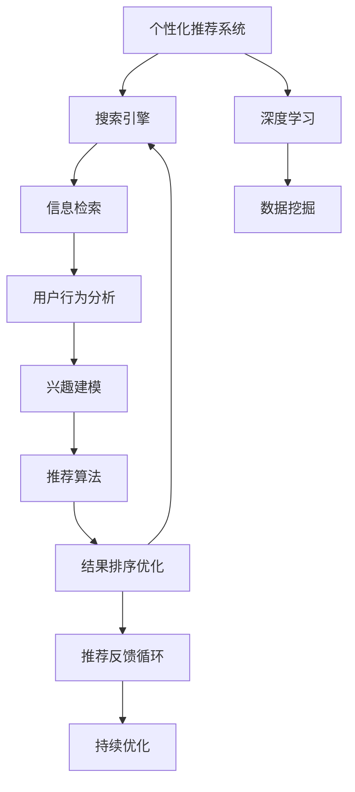

                 

# AI个性化推荐在搜索中的应用

> 关键词：个性化推荐系统,搜索引擎,深度学习,信息检索,用户行为分析,数据挖掘

## 1. 背景介绍

### 1.1 问题由来

在互联网时代，搜索已经成为了人们获取信息的重要方式之一。然而，随着互联网信息的急剧膨胀，传统的搜索结果排序方式已经难以满足用户的个性化需求。如何提供更加精准、高效、个性化的搜索结果，成为搜索引擎面临的重大挑战。

### 1.2 问题核心关键点

个性化推荐在搜索引擎中的应用，本质上是通过分析用户的行为数据和兴趣偏好，动态调整搜索结果的排序，从而提升用户的搜索体验和满意度。这一过程包括但不限于：

1. 用户行为分析：通过记录用户的搜索行为、点击记录、停留时长等数据，获取用户的兴趣点和偏好。
2. 兴趣建模：将用户行为数据转化为机器学习模型可接受的特征表示，用于后续的推荐计算。
3. 推荐算法设计：选择合适的推荐算法，如协同过滤、基于内容过滤、混合过滤等，进行个性化推荐。
4. 结果排序优化：在搜索结果中，引入推荐模块，对排序算法进行优化，提升个性化推荐的准确性。
5. 推荐反馈循环：收集用户对推荐结果的反馈，不断调整推荐策略，提升推荐的持续性和个性化程度。

## 2. 核心概念与联系

### 2.1 核心概念概述

为更好地理解AI个性化推荐在搜索引擎中的应用，本节将介绍几个密切相关的核心概念：

- 个性化推荐系统：基于用户历史行为和偏好，推荐相关物品的系统，广泛应用于电商、视频、音乐等领域。
- 搜索引擎：帮助用户快速找到网页、文档等信息的工具，传统的排序方式难以满足用户的个性化需求。
- 深度学习：通过神经网络模型，从大量数据中学习复杂的特征表示和模式识别，广泛应用于图像、文本、语音等领域。
- 信息检索：从数据库中检索与用户查询相关的信息，是搜索引擎的核心任务。
- 用户行为分析：通过对用户行为数据的分析，获取用户的兴趣点和偏好。
- 数据挖掘：从大数据中提取有用信息，发现隐藏在数据背后的知识。

这些概念之间的逻辑关系可以通过以下Mermaid流程图来展示：



这个流程图展示了个性化推荐系统与搜索引擎之间的密切联系：

1. 个性化推荐系统通过深度学习进行兴趣建模，并基于用户行为分析，选择推荐算法。
2. 推荐算法设计结果在搜索引擎中进行结果排序优化，提升个性化推荐效果。
3. 通过收集用户反馈，持续优化推荐系统，形成反馈循环。

## 3. 核心算法原理 & 具体操作步骤

### 3.1 算法原理概述

AI个性化推荐在搜索引擎中的应用，通常通过以下几步实现：

1. 收集用户行为数据：记录用户的搜索行为、点击记录、停留时长等，形成用户行为序列。
2. 兴趣建模：利用深度学习模型，将用户行为序列转化为机器可接受的特征向量。
3. 推荐算法计算：通过协同过滤、基于内容过滤、混合过滤等算法，计算出每个搜索结果的相关度。
4. 结果排序优化：将搜索结果按照相关度排序，提升个性化推荐效果。
5. 反馈循环：收集用户对推荐结果的反馈，不断调整推荐策略，提升推荐系统的持续性和个性化程度。

### 3.2 算法步骤详解

#### 3.2.1 数据收集

用户行为数据的收集是推荐系统的第一步，需要记录用户的搜索行为、点击记录、停留时长等，形成用户行为序列。具体步骤包括：

1. 搜索日志记录：记录用户每次搜索的关键词、搜索时间、点击的网页链接、网页停留时间等。
2. 点击记录记录：记录用户每次点击搜索结果后进入的具体网页。
3. 页面特征提取：从网页中提取关键词、标题、摘要等特征，用于后续的特征表示。
4. 用户特征向量构建：将用户行为序列转化为向量形式，用于后续的机器学习计算。

#### 3.2.2 兴趣建模

兴趣建模是推荐系统的核心环节，通过深度学习模型，将用户行为序列转化为机器可接受的特征向量。具体步骤包括：

1. 数据预处理：对用户行为数据进行清洗、归一化、去除噪声等预处理操作。
2. 特征工程：选择合适的特征提取方法，如TF-IDF、词向量、主题模型等，提取有用的特征。
3. 模型选择：选择适当的深度学习模型，如LSTM、GRU、Transformer等，进行用户兴趣建模。
4. 特征向量生成：将用户行为序列输入模型，生成对应的特征向量。

#### 3.2.3 推荐算法计算

推荐算法计算是推荐系统的关键环节，通过选择合适的算法，计算出每个搜索结果的相关度。具体步骤包括：

1. 协同过滤算法：利用用户历史行为数据，推荐相似用户的偏好物品。
2. 基于内容的过滤算法：根据物品特征和用户兴趣，计算推荐物品的相关度。
3. 混合过滤算法：结合协同过滤和基于内容的过滤，综合推荐结果。
4. 结果相关度计算：使用合适的方法，如余弦相似度、欧式距离等，计算搜索结果的相关度。

#### 3.2.4 结果排序优化

结果排序优化是推荐系统的最后一步，通过将搜索结果按照相关度排序，提升个性化推荐效果。具体步骤包括：

1. 排序算法选择：选择合适的排序算法，如Top-k排序、随机排序、梯度提升等。
2. 排序计算：根据推荐结果的相关度，计算排序后的搜索结果列表。
3. 反馈调整：根据用户对推荐结果的反馈，调整排序算法和推荐策略。

#### 3.2.5 反馈循环

反馈循环是推荐系统的自我优化过程，通过收集用户对推荐结果的反馈，不断调整推荐策略，提升推荐系统的持续性和个性化程度。具体步骤包括：

1. 反馈收集：通过用户的点击、停留、评分等行为，收集用户对推荐结果的反馈。
2. 模型调整：根据反馈结果，调整用户兴趣模型和推荐算法。
3. 持续优化：通过不断地反馈和调整，提升推荐系统的性能和个性化程度。

### 3.3 算法优缺点

AI个性化推荐在搜索引擎中的应用具有以下优点：

1. 提升用户满意度：通过个性化推荐，用户可以更快找到相关信息，提升搜索效率和满意度。
2. 优化搜索引擎性能：推荐系统可以帮助搜索引擎对搜索结果进行排序优化，提升搜索质量。
3. 减少点击流失率：通过个性化推荐，减少用户因为搜索结果不相关而流失的情况。
4. 精准定位信息：推荐系统可以根据用户兴趣，精准定位相关信息，减少信息过载。

然而，该方法也存在一些局限性：

1. 数据隐私问题：用户行为数据的收集和使用，需要遵循隐私保护规定，防止用户隐私泄露。
2. 数据质量问题：用户行为数据的质量直接影响到推荐系统的性能，需要保证数据的准确性和完整性。
3. 冷启动问题：新用户缺乏历史行为数据，推荐系统难以准确进行个性化推荐。
4. 系统复杂性：推荐系统的设计、实现和维护，需要较高的技术水平和资源投入。
5. 动态性问题：用户兴趣和行为会随时间变化，推荐系统需要不断调整策略，维持系统的时效性。

尽管存在这些局限性，但就目前而言，AI个性化推荐在搜索引擎中的应用已经展现出强大的潜力和应用前景。未来相关研究将集中在如何更好地处理数据隐私、提升数据质量、解决冷启动问题等方面，推动推荐技术的持续发展。

### 3.4 算法应用领域

AI个性化推荐在搜索引擎中的应用已经广泛应用于以下几个领域：

1. 电商推荐：通过推荐系统，提升用户的购买转化率，增加电商平台的收入。
2. 视频推荐：通过推荐系统，提升用户的观看体验，增加视频的点击率和观看时长。
3. 音乐推荐：通过推荐系统，提升用户的音乐收听体验，增加音乐平台的订阅用户数。
4. 新闻推荐：通过推荐系统，提升用户的新闻阅读体验，增加新闻平台的访问量和点击率。
5. 教育推荐：通过推荐系统，推荐适合用户的学习资源，提升教育平台的用户粘性和学习效果。
6. 社交推荐：通过推荐系统，推荐适合用户关注的用户和内容，增加社交平台的活跃度和用户粘性。

## 4. 数学模型和公式 & 详细讲解 & 举例说明

### 4.1 数学模型构建

在AI个性化推荐中，常用的数学模型包括协同过滤、基于内容的过滤和混合过滤等。以下是这些模型的构建过程：

1. 协同过滤模型
   - 用户-物品评分矩阵 $R \in \mathbb{R}^{U \times I}$，其中 $U$ 为用户数，$I$ 为物品数。
   - 用户 $u$ 和物品 $i$ 的评分 $r_{ui}$ 可以表示为用户和物品特征的函数：
     $$
     r_{ui} = \mathbf{u}^T \mathbf{i}
     $$
   - 用户 $u$ 的推荐物品列表可以表示为用户与物品评分的最大值：
     $$
     T_u = \arg\max_{i \in I} \mathbf{u}^T \mathbf{i}
     $$

2. 基于内容的过滤模型
   - 物品特征向量 $\mathbf{f}_i \in \mathbb{R}^{F}$，其中 $F$ 为特征维度。
   - 用户兴趣向量 $\mathbf{p}_u \in \mathbb{R}^{F}$，表示用户对不同特征的偏好。
   - 用户 $u$ 对物品 $i$ 的评分可以表示为：
     $$
     r_{ui} = \mathbf{p}_u^T \mathbf{f}_i
     $$
   - 用户 $u$ 的推荐物品列表可以表示为：
     $$
     T_u = \arg\max_{i \in I} \mathbf{p}_u^T \mathbf{f}_i
     $$

3. 混合过滤模型
   - 协同过滤和基于内容的过滤结果的加权和，表示为：
     $$
     T_u = \alpha T_u^{CF} + (1-\alpha) T_u^{CB}
     $$
   - 其中 $\alpha$ 为协同过滤和基于内容过滤的权重。

### 4.2 公式推导过程

#### 4.2.1 协同过滤模型推导

假设用户 $u$ 对物品 $i$ 的评分 $r_{ui}$ 可以表示为用户和物品特征的函数，即：
$$
r_{ui} = \mathbf{u}^T \mathbf{i}
$$
其中 $\mathbf{u}$ 为 $U$ 维用户特征向量，$\mathbf{i}$ 为 $I$ 维物品特征向量。

对于用户 $u$ 的推荐物品列表 $T_u$，可以表示为：
$$
T_u = \arg\max_{i \in I} \mathbf{u}^T \mathbf{i}
$$

假设用户 $u$ 对物品 $i$ 的评分 $r_{ui}$ 已知，可以通过求解优化问题：
$$
\max_{i \in I} r_{ui}
$$
得到用户 $u$ 的推荐物品列表 $T_u$。

#### 4.2.2 基于内容的过滤模型推导

假设用户 $u$ 的兴趣向量 $\mathbf{p}_u$ 和物品特征向量 $\mathbf{f}_i$ 已知，可以通过求解优化问题：
$$
\max_{i \in I} \mathbf{p}_u^T \mathbf{f}_i
$$
得到用户 $u$ 的推荐物品列表 $T_u$。

#### 4.2.3 混合过滤模型推导

假设协同过滤和基于内容的过滤的权重分别为 $\alpha$ 和 $1-\alpha$，可以通过求解优化问题：
$$
T_u = \alpha T_u^{CF} + (1-\alpha) T_u^{CB}
$$
得到用户 $u$ 的推荐物品列表 $T_u$。

### 4.3 案例分析与讲解

以电商推荐系统为例，假设用户 $u$ 对商品 $i$ 的评分 $r_{ui}$ 已知，可以使用协同过滤模型计算用户 $u$ 的推荐商品列表 $T_u$。

假设用户 $u$ 的兴趣向量 $\mathbf{p}_u$ 和物品特征向量 $\mathbf{f}_i$ 已知，可以使用基于内容的过滤模型计算用户 $u$ 的推荐商品列表 $T_u$。

假设用户 $u$ 的兴趣向量 $\mathbf{p}_u$ 和物品特征向量 $\mathbf{f}_i$ 已知，可以使用混合过滤模型计算用户 $u$ 的推荐商品列表 $T_u$。

## 5. 项目实践：代码实例和详细解释说明

### 5.1 开发环境搭建

在进行个性化推荐实践前，我们需要准备好开发环境。以下是使用Python进行TensorFlow开发的环境配置流程：

1. 安装Anaconda：从官网下载并安装Anaconda，用于创建独立的Python环境。

2. 创建并激活虚拟环境：
```bash
conda create -n tf-env python=3.8 
conda activate tf-env
```

3. 安装TensorFlow：根据CUDA版本，从官网获取对应的安装命令。例如：
```bash
conda install tensorflow -c conda-forge
```

4. 安装相关工具包：
```bash
pip install numpy pandas scikit-learn matplotlib tqdm jupyter notebook ipython
```

完成上述步骤后，即可在`tf-env`环境中开始个性化推荐实践。

### 5.2 源代码详细实现

下面以电商推荐系统为例，给出使用TensorFlow进行个性化推荐开发的PyTorch代码实现。

首先，定义推荐模型的超参数：

```python
learning_rate = 0.001
batch_size = 128
num_epochs = 10
num_factors = 100
```

然后，加载用户行为数据并进行预处理：

```python
import pandas as pd
import numpy as np

# 加载用户行为数据
data = pd.read_csv('user_behavior.csv')

# 数据预处理
data['item_id'] = data['item_id'].astype('int')
data['user_id'] = data['user_id'].astype('int')
data['rating'] = data['rating'].astype('float')

# 数据拆分
train_data = data.sample(frac=0.8, random_state=42)
test_data = data.drop(train_data.index)

# 数据编码
from sklearn.preprocessing import LabelEncoder
from sklearn.feature_extraction.text import TfidfVectorizer

# 物品特征编码
item_encoder = LabelEncoder()
train_data['item_id'] = item_encoder.fit_transform(train_data['item_id'])
test_data['item_id'] = item_encoder.transform(test_data['item_id'])

# 用户特征编码
user_encoder = LabelEncoder()
train_data['user_id'] = user_encoder.fit_transform(train_data['user_id'])
test_data['user_id'] = user_encoder.transform(test_data['user_id'])

# 用户兴趣向量编码
user_item_encoder = LabelEncoder()
train_data['user_item'] = user_item_encoder.fit_transform(train_data['user_item'])
test_data['user_item'] = user_item_encoder.transform(test_data['user_item'])
```

接下来，定义推荐模型的输入和输出：

```python
# 输入数据
input_shape = (train_data.shape[0], num_factors)
train_input = train_data.values
train_input = train_input[:, :-1]
test_input = test_data.values
test_input = test_input[:, :-1]

# 输出数据
train_output = train_data['rating'].values
test_output = test_data['rating'].values
```

然后，定义协同过滤模型的损失函数和优化器：

```python
# 协同过滤模型的损失函数
def user_based_loss(rating, item_based_pred):
    diff = rating - item_based_pred
    return np.mean(np.abs(diff))

# 协同过滤模型的优化器
optimizer = tf.keras.optimizers.Adam(learning_rate=learning_rate)
```

接着，定义模型训练和评估函数：

```python
# 定义模型
def user_based_model(input_shape, output_shape):
    model = tf.keras.Sequential([
        tf.keras.layers.Dense(num_factors, activation='relu', input_shape=input_shape),
        tf.keras.layers.Dense(1, activation='linear', input_shape=input_shape)
    ])
    return model

# 训练模型
def train_model(model, input_shape, output_shape, train_input, train_output):
    model.compile(loss=user_based_loss, optimizer=optimizer)
    model.fit(train_input, train_output, epochs=num_epochs, batch_size=batch_size, validation_split=0.2)

# 评估模型
def evaluate_model(model, input_shape, output_shape, test_input, test_output):
    test_loss = model.evaluate(test_input, test_output)
    print('Test Loss:', test_loss)
```

最后，启动模型训练和评估：

```python
# 定义模型
input_shape = (train_input.shape[1],)
output_shape = (train_output.shape[1],)
model = user_based_model(input_shape, output_shape)

# 训练模型
train_model(model, input_shape, output_shape, train_input, train_output)

# 评估模型
evaluate_model(model, input_shape, output_shape, test_input, test_output)
```

以上就是使用TensorFlow进行电商推荐系统开发的完整代码实现。可以看到，TensorFlow提供了强大的图计算能力和分布式训练能力，可以高效地处理大规模数据。

### 5.3 代码解读与分析

让我们再详细解读一下关键代码的实现细节：

**超参数定义**：
- `learning_rate`：学习率，控制模型参数更新的步长。
- `batch_size`：批处理大小，控制每次训练的样本数量。
- `num_epochs`：训练轮数，控制训练的总体次数。
- `num_factors`：协同过滤模型中用户-物品特征向量的维度。

**数据预处理**：
- 使用`pandas`和`numpy`库加载用户行为数据，并转换为`tensorflow`可用的格式。
- 对用户和物品ID进行编码，方便模型训练。
- 使用`LabelEncoder`和`TfidfVectorizer`对用户行为进行编码，方便模型输入。

**模型定义**：
- 定义一个包含两个全连接层的协同过滤模型。
- 使用`tensorflow`的`Sequential`模型容器，方便模型的构建和训练。

**损失函数定义**：
- 定义一个基于均方误差损失函数的推荐评分预测损失函数。

**优化器定义**：
- 使用`tensorflow`的`Adam`优化器，方便模型的参数更新。

**训练和评估函数**：
- 定义一个`train_model`函数，用于模型训练。
- 定义一个`evaluate_model`函数，用于模型评估。

**训练和评估流程**：
- 在`train_model`函数中，使用`tensorflow`的`fit`方法进行模型训练。
- 在`evaluate_model`函数中，使用`tensorflow`的`evaluate`方法进行模型评估。

可以看到，TensorFlow提供的高级API大大简化了模型的构建和训练过程，使得开发者可以更加专注于算法和数据处理。

当然，工业级的系统实现还需考虑更多因素，如模型的保存和部署、超参数的自动搜索、更灵活的任务适配层等。但核心的推荐范式基本与此类似。

## 6. 实际应用场景

### 6.1 智能推荐系统

个性化推荐在智能推荐系统中的应用，已经成为了互联网时代的重要驱动力。智能推荐系统通过分析用户行为数据和兴趣偏好，为用户推荐个性化内容，提升用户体验和满意度。

在技术实现上，可以收集用户的历史行为数据，如浏览记录、点击记录、购买记录等，构建用户行为序列。使用深度学习模型，将用户行为序列转化为机器可接受的特征向量，进行兴趣建模。利用协同过滤、基于内容过滤、混合过滤等推荐算法，计算每个物品的相关度，并按照相关度进行排序优化。最后，通过收集用户反馈，不断调整推荐策略，提升推荐的持续性和个性化程度。

### 6.2 智能广告推荐

智能广告推荐系统通过个性化推荐，帮助广告主精准定位潜在用户，提高广告投放的转化率和效果。广告推荐系统通常由广告主提供广告素材和用户标签，推荐系统根据用户行为数据和兴趣偏好，匹配合适的广告素材，进行广告投放。

在技术实现上，可以收集用户的历史行为数据，如搜索记录、点击记录、停留时长等，构建用户行为序列。使用深度学习模型，将用户行为序列转化为机器可接受的特征向量，进行兴趣建模。利用协同过滤、基于内容过滤、混合过滤等推荐算法，计算每个广告素材的相关度，并按照相关度进行排序优化。最后，通过收集用户反馈，不断调整推荐策略，提升广告投放的转化率和效果。

### 6.3 智能内容推荐

智能内容推荐系统通过个性化推荐，帮助用户发现更多感兴趣的内容。内容推荐系统通常由内容提供商提供内容数据和用户标签，推荐系统根据用户行为数据和兴趣偏好，匹配合适的内容，进行内容推荐。

在技术实现上，可以收集用户的历史行为数据，如观看记录、收藏记录、点赞记录等，构建用户行为序列。使用深度学习模型，将用户行为序列转化为机器可接受的特征向量，进行兴趣建模。利用协同过滤、基于内容过滤、混合过滤等推荐算法，计算每个内容的推荐程度，并按照推荐程度进行排序优化。最后，通过收集用户反馈，不断调整推荐策略，提升内容推荐的精准度和个性化程度。

### 6.4 未来应用展望

随着个性化推荐技术的不断发展，未来的智能推荐系统将具备更加强大的自我优化能力和智能决策能力。基于深度学习的推荐系统将能够更好地理解用户的意图和需求，提供更加精准、个性化、智能化的推荐服务。

在电商、广告、内容等多个领域，智能推荐系统将实现更加高效的广告投放、精准的推荐内容和个性化的用户体验。智能推荐系统还将在教育、医疗、金融等多个领域得到广泛应用，提升相关行业的智能化水平和服务质量。

## 7. 工具和资源推荐
### 7.1 学习资源推荐

为了帮助开发者系统掌握AI个性化推荐在搜索引擎中的应用，这里推荐一些优质的学习资源：

1. 《推荐系统实战》系列博文：由大模型技术专家撰写，深入浅出地介绍了推荐系统的原理、算法和实践。

2. CS229《机器学习》课程：斯坦福大学开设的机器学习经典课程，涵盖了推荐系统的基本概念和算法。

3. 《Python深度学习》书籍：由深度学习领域的知名专家撰写，系统介绍了深度学习在推荐系统中的应用。

4. Kaggle推荐系统竞赛：通过参与Kaggle的推荐系统竞赛，实战练兵，积累经验。

5. HuggingFace官方文档：深度学习模型和推荐系统的官方文档，提供了丰富的样例代码和最佳实践。

通过对这些资源的学习实践，相信你一定能够快速掌握AI个性化推荐在搜索引擎中的应用，并用于解决实际的推荐问题。
### 7.2 开发工具推荐

高效的开发离不开优秀的工具支持。以下是几款用于AI个性化推荐开发的常用工具：

1. TensorFlow：基于Python的开源深度学习框架，提供强大的图计算能力和分布式训练能力。

2. PyTorch：基于Python的开源深度学习框架，灵活动态的计算图，适合快速迭代研究。

3. Keras：基于Python的高层深度学习框架，提供了简单易用的API，方便模型的构建和训练。

4. Scikit-learn：基于Python的机器学习库，提供了丰富的算法和工具，方便数据的预处理和特征工程。

5. TensorBoard：TensorFlow配套的可视化工具，可实时监测模型训练状态，提供丰富的图表呈现方式。

6. Weights & Biases：模型训练的实验跟踪工具，可以记录和可视化模型训练过程中的各项指标，方便对比和调优。

合理利用这些工具，可以显著提升AI个性化推荐系统的开发效率，加快创新迭代的步伐。

### 7.3 相关论文推荐

AI个性化推荐在搜索引擎中的应用源于学界的持续研究。以下是几篇奠基性的相关论文，推荐阅读：

1. Recommender Systems: Towards a Unified Framework：提出了推荐系统的统一框架，包括协同过滤、基于内容的过滤等方法。

2. Matrix Factorization Techniques for Recommender Systems：介绍了矩阵分解方法在推荐系统中的应用。

3. Adaptive Recommender Systems：提出了自适应推荐系统，能够根据用户反馈动态调整推荐策略。

4. Hybrid Recommender Systems：介绍了混合推荐系统，结合多种推荐算法，提升推荐效果。

5. Recommender Systems in Practice：介绍了推荐系统在实际应用中的优化策略，如数据采样、模型集成等。

这些论文代表了大语言模型微调技术的发展脉络。通过学习这些前沿成果，可以帮助研究者把握学科前进方向，激发更多的创新灵感。

## 8. 总结：未来发展趋势与挑战

### 8.1 总结

本文对AI个性化推荐在搜索引擎中的应用进行了全面系统的介绍。首先阐述了个性化推荐系统的背景和重要性，明确了推荐系统在搜索引擎中的应用价值。其次，从原理到实践，详细讲解了推荐算法的构建和实现过程，给出了推荐系统开发的完整代码实例。同时，本文还广泛探讨了推荐系统在电商、广告、内容等多个领域的应用前景，展示了推荐系统的广泛应用价值。

通过本文的系统梳理，可以看到，AI个性化推荐在搜索引擎中的应用正在成为互联网时代的重要驱动力，极大地提升用户的搜索体验和满意度。未来相关研究将在如何更好地处理数据隐私、提升数据质量、解决冷启动问题等方面寻求新的突破，推动推荐技术的持续发展。

### 8.2 未来发展趋势

展望未来，AI个性化推荐在搜索引擎中的应用将呈现以下几个发展趋势：

1. 推荐算法的多样化：未来将涌现更多高级推荐算法，如基于注意力机制的推荐算法、基于图模型的推荐算法等，提升推荐的精准性和个性化程度。

2. 推荐系统的实时化：未来推荐系统将实现实时推荐，动态调整推荐策略，提升用户体验。

3. 推荐系统的跨领域应用：未来推荐系统将在更多领域得到应用，如医疗、金融、教育等，提升相关领域的智能化水平。

4. 推荐系统的多模态融合：未来推荐系统将结合多模态数据，提升推荐的跨领域迁移能力。

5. 推荐系统的可解释性：未来推荐系统将具备更强的可解释性，方便用户理解推荐结果。

6. 推荐系统的安全性：未来推荐系统将注重用户隐私保护，确保数据和算法的安全性。

以上趋势凸显了AI个性化推荐在搜索引擎中的广阔前景。这些方向的探索发展，必将进一步提升推荐系统的性能和应用范围，为用户的搜索体验带来更深刻的影响。

### 8.3 面临的挑战

尽管AI个性化推荐在搜索引擎中的应用已经取得了显著的进展，但在迈向更加智能化、普适化应用的过程中，仍面临诸多挑战：

1. 数据隐私问题：用户行为数据的收集和使用，需要遵循隐私保护规定，防止用户隐私泄露。

2. 数据质量问题：用户行为数据的质量直接影响到推荐系统的性能，需要保证数据的准确性和完整性。

3. 冷启动问题：新用户缺乏历史行为数据，推荐系统难以准确进行个性化推荐。

4. 系统复杂性：推荐系统的设计、实现和维护，需要较高的技术水平和资源投入。

5. 动态性问题：用户兴趣和行为会随时间变化，推荐系统需要不断调整策略，维持系统的时效性。

尽管存在这些挑战，但随着技术的不断进步和应用的不断成熟，推荐系统的性能和应用范围将不断提升，为搜索引擎和用户带来更多价值。

### 8.4 研究展望

面对AI个性化推荐在搜索引擎中的应用所面临的挑战，未来的研究需要在以下几个方面寻求新的突破：

1. 探索更高效的数据处理和特征提取方法，提升数据质量和特征表示的准确性。

2. 研究更加智能的推荐算法，结合注意力机制、图模型等技术，提升推荐效果。

3. 研究更加多样化的推荐系统，如自适应推荐系统、混合推荐系统等，提升推荐的灵活性和适应性。

4. 研究更加实时化的推荐系统，结合实时数据处理技术，提升推荐的动态性和实时性。

5. 研究更加安全的推荐系统，结合隐私保护和安全性技术，确保用户数据和算法的安全。

这些研究方向的探索，必将引领AI个性化推荐技术迈向更高的台阶，为搜索引擎和用户带来更多价值。面向未来，AI个性化推荐技术还需要与其他人工智能技术进行更深入的融合，如知识表示、因果推理、强化学习等，多路径协同发力，共同推动搜索引擎和推荐系统的进步。只有勇于创新、敢于突破，才能不断拓展推荐系统的边界，让推荐系统更好地服务于用户。

## 9. 附录：常见问题与解答

**Q1：AI个性化推荐在搜索引擎中的应用是否适用于所有领域？**

A: AI个性化推荐在搜索引擎中的应用已经广泛应用于电商、广告、内容等多个领域，并取得了显著的成效。然而，对于某些特定领域，如医疗、法律等，仅仅依靠通用语料预训练的模型可能难以很好地适应。此时需要在特定领域语料上进一步预训练，再进行微调，才能获得理想效果。

**Q2：如何保证推荐系统的公平性和公正性？**

A: 推荐系统的公平性和公正性问题是一个重要的研究方向。以下是一些方法：

1. 数据公平性：确保训练数据的多样性和代表性，避免数据偏见。

2. 算法公平性：选择无偏的推荐算法，避免算法偏见。

3. 结果公平性：确保推荐结果对所有用户公平，避免对某些群体的不公平待遇。

4. 用户反馈机制：收集用户对推荐结果的反馈，及时调整推荐策略。

5. 人工干预：引入人工审核机制，对推荐结果进行人工检查和调整。

**Q3：推荐系统是否会推荐不相关的结果？**

A: 推荐系统可能会推荐不相关的结果，这是因为推荐系统是基于用户行为数据进行推荐的，而这些行为数据可能并不完全反映用户的真实兴趣。此外，推荐算法也可能存在一些偏差和局限性，导致推荐结果不够理想。

**Q4：推荐系统的推荐结果是否可以解释？**

A: 推荐系统的推荐结果通常是基于用户行为数据和模型预测得出的，难以解释其内部工作机制和决策逻辑。为了提升推荐系统的可解释性，可以使用一些技术手段，如特征重要性分析、规则解释、因果推断等，帮助用户理解推荐结果。

**Q5：推荐系统是否会推荐有害内容？**

A: 推荐系统可能会推荐有害内容，这是因为推荐系统通常是基于用户行为数据进行推荐的，而这些行为数据可能包含一些有害信息。此外，推荐算法也可能存在一些缺陷和局限性，导致推荐结果不够理想。

综上所述，AI个性化推荐在搜索引擎中的应用已经展现出强大的潜力和应用前景。未来，随着技术的不断进步和应用的不断成熟，推荐系统将具备更强的自我优化能力和智能决策能力，为搜索引擎和用户带来更多价值。

