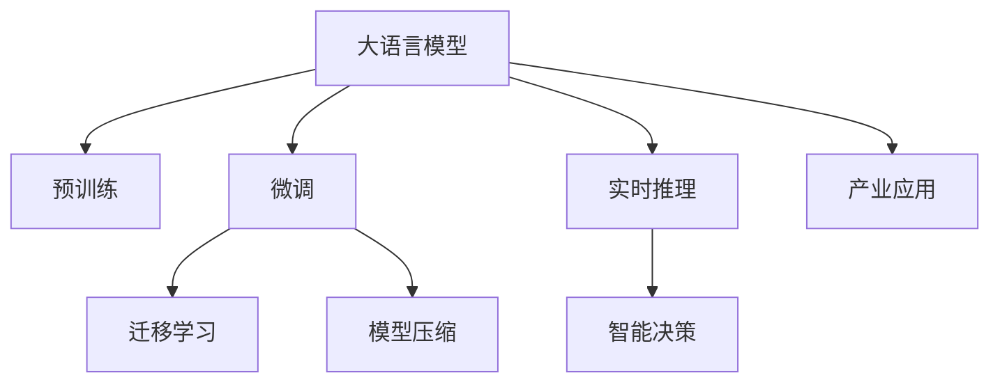

                 

# AI产业新格局：LLM重塑技术生态

> 关键词：大语言模型(LLM), 深度学习, 迁移学习, 预训练, 模型压缩, 实时推理, 智能决策, 产业应用

## 1. 背景介绍

### 1.1 问题由来

过去十年间，人工智能(AI)技术取得了飞速发展，尤其是在深度学习(Deep Learning)领域。大语言模型(Large Language Models, LLMs)是这一波AI热潮中的明星，如GPT-3、BERT等模型在NLP(Natural Language Processing)领域中展示了强大的语言理解和生成能力。

大语言模型通过大规模无标签文本数据进行预训练，学习到丰富的语言知识和语义表示，然后通过微调(Fine-Tuning)在特定任务上进行优化，取得了不俗的性能表现。这种预训练-微调范式，极大地推动了NLP技术的应用落地，激发了产业界的广泛兴趣和投入。

然而，随着大语言模型体量不断增大，大规模训练和推理带来了新的挑战，如算力需求、模型存储、计算效率等问题。此外，模型黑箱性和泛化能力不足也成为应用中难以回避的问题。

这些挑战促使研究人员探索新的技术手段，以期在提升模型性能的同时，优化其应用效率和可解释性。本文将详细介绍LLM技术生态的最新进展，探讨其在产业应用中的潜力和面临的挑战，并给出具体技术建议和方向指引。

### 1.2 问题核心关键点

当前，LLM技术生态的核心问题包括：

- **算力与存储成本**：大规模预训练和微调所需的计算资源和存储空间非常高。
- **推理效率**：模型推理速度慢，难以满足实时性需求。
- **模型可解释性**：模型决策过程复杂，缺乏可解释性。
- **泛化性能**：模型对新数据和新领域的泛化能力不足。
- **产业落地**：如何将LLM技术成功应用到实际业务场景中。

这些问题需要通过技术创新来解决，推动LLM技术从实验室走向实际应用。

## 2. 核心概念与联系

### 2.1 核心概念概述

为了更清晰地理解LLM技术生态，本节将介绍几个关键概念及其相互联系：

- **大语言模型(LLM)**：指基于Transformer架构的预训练语言模型，如GPT系列、BERT系列。通过大规模无标签文本数据预训练，学习到语言和语义表示，能够理解复杂语言结构并进行生成。

- **预训练(Pre-training)**：指在大规模无标签数据上，通过自监督学习任务训练模型的过程。预训练可以学习到通用的语言知识和语义表示。

- **微调(Fine-Tuning)**：指在预训练模型的基础上，使用特定任务的数据进行有监督学习，优化模型在该任务上的性能。

- **迁移学习(Transfer Learning)**：指将一个领域学到的知识迁移到另一个领域，以提升模型的泛化能力。

- **模型压缩(Model Compression)**：指通过剪枝、量化、蒸馏等技术，减小模型参数量和计算量，提升推理速度和存储效率。

- **实时推理(Real-time Inference)**：指在低延迟条件下进行高效推理，满足实时性需求。

- **智能决策(Intelligent Decision-Making)**：指模型能够根据输入数据，自动做出最优决策。

- **产业应用(Industrial Applications)**：指将LLM技术应用到各行各业，解决实际业务问题。

这些概念之间的逻辑关系可以通过以下Mermaid流程图来展示：



### 2.2 核心概念原理和架构

**大语言模型**：
- **架构**：基于Transformer架构，通过自注意力机制进行编码器-解码器计算。
- **预训练**：在大量无标签文本数据上，通过自监督任务如掩码语言模型(Masked Language Model, MLM)、下一句预测任务(Next Sentence Prediction, NSP)等进行预训练。
- **微调**：在特定任务上，通过有监督学习调整模型参数，使其适应新任务。
- **迁移学习**：通过微调或提示学习(Prompt Learning)，将模型应用于不同领域和任务。
- **模型压缩**：通过剪枝、量化、蒸馏等技术，减小模型规模。
- **实时推理**：通过优化计算图、并行计算等技术，提升推理速度。
- **智能决策**：通过逻辑推理、规则结合等技术，提升模型决策能力。
- **产业应用**：将LLM技术应用到各行各业，解决实际问题。

## 3. 核心算法原理 & 具体操作步骤

### 3.1 算法原理概述

基于LLM的AI产业新格局，核心算法原理主要包括以下几个方面：

- **预训练**：通过大规模无标签数据进行自监督学习，学习到语言和语义表示。
- **微调**：在特定任务上，通过有监督学习调整模型参数，提升模型性能。
- **迁移学习**：通过微调或提示学习，将模型应用于不同领域和任务，提升泛化能力。
- **模型压缩**：通过剪枝、量化、蒸馏等技术，减小模型规模。
- **实时推理**：通过优化计算图、并行计算等技术，提升推理速度。
- **智能决策**：通过逻辑推理、规则结合等技术，提升模型决策能力。
- **产业应用**：将LLM技术应用到各行各业，解决实际问题。

### 3.2 算法步骤详解

1. **预训练**：
    - 选择大规模无标签文本数据。
    - 使用自监督任务如MLM、NSP等进行预训练。
    - 记录预训练模型参数。

2. **微调**：
    - 收集特定任务的数据集。
    - 选择合适的任务适配层和损失函数。
    - 设置微调超参数如学习率、批大小、迭代轮数等。
    - 执行梯度训练，更新模型参数。
    - 评估模型性能，决定是否停止微调。

3. **迁移学习**：
    - 选择合适的微调模型和提示模板。
    - 对新任务进行微调或提示学习。
    - 评估模型在新任务上的性能。

4. **模型压缩**：
    - 选择合适的压缩技术如剪枝、量化、蒸馏等。
    - 对模型进行压缩处理。
    - 评估压缩后模型性能。

5. **实时推理**：
    - 选择合适的推理框架如TensorFlow、PyTorch等。
    - 优化计算图，提升推理速度。
    - 进行并行计算，提高计算效率。

6. **智能决策**：
    - 引入规则和逻辑推理机制。
    - 结合预训练和微调模型，进行决策。
    - 评估决策效果。

7. **产业应用**：
    - 选择合适的应用场景。
    - 设计系统架构，集成LLM技术。
    - 进行系统测试和部署。
    - 持续优化系统性能。

### 3.3 算法优缺点

**预训练**：
- **优点**：学习到通用的语言表示，模型性能稳定。
- **缺点**：需要大规模计算资源，耗时较长。

**微调**：
- **优点**：提升特定任务性能，效果显著。
- **缺点**：依赖标注数据，过拟合风险高。

**迁移学习**：
- **优点**：提高模型泛化能力，应用广泛。
- **缺点**：需要大量标注数据，难以处理少样本任务。

**模型压缩**：
- **优点**：减小模型规模，提升推理效率。
- **缺点**：可能损失部分性能，压缩过程复杂。

**实时推理**：
- **优点**：满足实时性需求，用户体验好。
- **缺点**：计算复杂度高，硬件需求高。

**智能决策**：
- **优点**：提升决策能力和鲁棒性。
- **缺点**：决策逻辑复杂，难以解释。

**产业应用**：
- **优点**：解决实际业务问题，应用广泛。
- **缺点**：系统设计复杂，开发成本高。

## 4. 数学模型和公式 & 详细讲解 & 举例说明

### 4.1 数学模型构建

**预训练**：
- **自监督任务**：MLM和NSP。
- **模型架构**：Transformer。

**微调**：
- **损失函数**：交叉熵损失、均方误差损失等。
- **模型架构**：基于Transformer的分类或回归模型。

**迁移学习**：
- **提示模板**：为模型提供任务描述。
- **损失函数**：自定义。

**模型压缩**：
- **量化**：使用TensorRT进行整数量化。
- **蒸馏**：使用知识蒸馏技术，通过学生模型学习教师模型的知识。

**实时推理**：
- **计算图优化**：使用TensorRT进行计算图优化。
- **并行计算**：使用GPU、TPU等设备进行并行计算。

**智能决策**：
- **逻辑推理**：使用规则引擎进行逻辑推理。
- **模型结合**：将预训练和微调模型结合，提升决策效果。

### 4.2 公式推导过程

以BERT微调为例，其训练过程包括预训练和微调两个阶段。

**预训练**：
- **MLM任务**：
    - 输入文本 $x$。
    - 模型输出概率分布 $p(x_i|x)$。
    - 损失函数 $L=\sum_{i=1}^N[-\log p(x_i|x)]$。

**微调**：
- **任务适配层**：
    - 输入文本 $x$。
    - 分类器输出 $y$。
    - 损失函数 $L=\sum_{i=1}^N[-y_i\log p(y_i|x)]$。

**迁移学习**：
- **提示模板**：
    - 输入 $(x_t, p_t)$。
    - 模型输出 $y_t$。
    - 损失函数 $L=\sum_{t=1}^T[-y_t\log p(y_t|x_t, p_t)]$。

### 4.3 案例分析与讲解

以医疗领域为例，分析LLM技术的应用：

**预训练**：
- 在电子病历、医学文献等大规模无标签文本数据上进行预训练。
- 学习到通用的医学知识表示。

**微调**：
- 收集特定任务的数据，如疾病诊断、医学问答等。
- 调整分类器，优化模型性能。

**迁移学习**：
- 使用提示模板，引导模型进行特定任务的推理。
- 减少标注样本需求。

**模型压缩**：
- 对预训练和微调后的模型进行量化。
- 提升推理效率。

**实时推理**：
- 使用TensorRT进行计算图优化。
- 在GPU上进行并行计算。

**智能决策**：
- 结合规则引擎，进行临床决策。
- 提升决策的准确性和鲁棒性。

## 5. 项目实践：代码实例和详细解释说明

### 5.1 开发环境搭建

1. 安装Anaconda，创建虚拟环境。
2. 安装PyTorch、TensorRT、HuggingFace等库。
3. 配置计算资源，如GPU、TPU等。

### 5.2 源代码详细实现

以BERT微调为例，详细代码如下：

```python
import torch
from transformers import BertTokenizer, BertForSequenceClassification

# 加载预训练模型和分词器
model = BertForSequenceClassification.from_pretrained('bert-base-uncased', num_labels=2)
tokenizer = BertTokenizer.from_pretrained('bert-base-uncased')

# 数据准备
train_dataset = ...
dev_dataset = ...
test_dataset = ...

# 设置微调超参数
optimizer = torch.optim.AdamW(model.parameters(), lr=1e-5)
epochs = 10

# 训练过程
for epoch in range(epochs):
    for batch in train_loader:
        input_ids = batch['input_ids']
        attention_mask = batch['attention_mask']
        labels = batch['labels']

        # 前向传播
        outputs = model(input_ids, attention_mask=attention_mask)
        loss = outputs.loss

        # 反向传播
        optimizer.zero_grad()
        loss.backward()
        optimizer.step()

    # 评估过程
    with torch.no_grad():
        dev_loss, dev_acc = evaluate(dev_loader)
        test_loss, test_acc = evaluate(test_loader)
```

### 5.3 代码解读与分析

**分词器和模型加载**：
- 使用HuggingFace库，加载BERT预训练模型和分词器。

**数据准备**：
- 准备训练、验证和测试数据集。

**优化器和超参数**：
- 设置AdamW优化器和合适的学习率。

**训练过程**：
- 在每个epoch中，对训练集进行迭代。
- 使用输入_ids和attention_mask，进行前向传播计算损失。
- 反向传播更新模型参数。

**评估过程**：
- 在验证集和测试集上评估模型性能。

## 6. 实际应用场景

### 6.1 智能医疗

- **案例**：电子病历分析、疾病诊断。
- **技术应用**：BERT微调、迁移学习。
- **效果**：提升诊断准确性，辅助医生决策。

### 6.2 智能客服

- **案例**：客服聊天机器人。
- **技术应用**：GPT-3微调、提示学习。
- **效果**：提升客户满意度，降低人工成本。

### 6.3 金融风险控制

- **案例**：信用评分、欺诈检测。
- **技术应用**：BERT微调、迁移学习。
- **效果**：提高风险控制效率，降低金融风险。

### 6.4 智能制造

- **案例**：设备维护预测。
- **技术应用**：LLM微调、实时推理。
- **效果**：提升设备维护效率，降低故障率。

## 7. 工具和资源推荐

### 7.1 学习资源推荐

1. **《深度学习》课程**：斯坦福大学开设的深度学习课程，涵盖NLP基本概念和常用模型。
2. **《NLP实战指南》书籍**：介绍NLP技术和应用，包括微调和模型压缩等内容。
3. **HuggingFace官方文档**：提供丰富的预训练模型和微调样例，适合初学者学习。
4. **NLP Challenge竞赛**：参加NLP挑战赛，积累实战经验，提升技术水平。

### 7.2 开发工具推荐

1. **PyTorch**：高效灵活的深度学习框架，支持GPU/TPU计算。
2. **TensorRT**：加速推理计算，支持GPU和CPU计算。
3. **TensorBoard**：可视化训练过程，帮助调试和优化模型。
4. **Jupyter Notebook**：交互式编程环境，方便实验和记录。

### 7.3 相关论文推荐

1. **《BERT: Pre-training of Deep Bidirectional Transformers for Language Understanding》**：BERT模型的提出，改变了NLP任务的预训练范式。
2. **《Attention is All You Need》**：Transformer架构的提出，奠定了现代NLP模型的基础。
3. **《Knowledge Distillation》**：知识蒸馏技术，用于模型压缩和迁移学习。

## 8. 总结：未来发展趋势与挑战

### 8.1 研究成果总结

1. **技术进步**：预训练模型性能提升，微调方法多样，模型压缩技术成熟。
2. **应用拓展**：从NLP扩展到多模态、多领域。
3. **产业落地**：NLP技术在各行各业的应用逐渐成熟。

### 8.2 未来发展趋势

1. **模型规模增大**：预训练模型参数量持续增长，性能提升显著。
2. **算法多样性**：更多的微调方法、压缩技术涌现，提升应用效率。
3. **模型应用**：从NLP扩展到多模态、多领域，提升泛化能力。
4. **产业落地**：更多行业应用落地，提升经济效益和社会价值。

### 8.3 面临的挑战

1. **算力与存储**：模型规模大，训练和推理耗资高。
2. **推理效率**：计算复杂度高，实时性需求难以满足。
3. **可解释性**：模型决策过程复杂，难以解释。
4. **泛化能力**：模型泛化性能不足，新领域适应性差。
5. **伦理与安全性**：模型可能引入偏见和有害信息，安全风险高。

### 8.4 研究展望

1. **算法优化**：提升模型训练效率，减小计算资源消耗。
2. **模型压缩**：减少模型参数量，提升推理速度。
3. **多模态融合**：将视觉、语音等多模态信息与文本结合，提升模型能力。
4. **伦理与安全**：引入伦理导向评估指标，增强模型安全性。

## 9. 附录：常见问题与解答

### Q1: 如何选择合适的预训练模型和微调任务？

A: 选择与任务相似的预训练模型，调整任务适配层和损失函数。注意数据集规模和质量。

### Q2: 微调过程中如何避免过拟合？

A: 使用正则化技术如L2正则、Dropout等，设置合适的学习率和批大小。

### Q3: 模型压缩后性能如何保证？

A: 选择合适的压缩技术如剪枝、量化等，评估压缩后模型性能。

### Q4: 实时推理时如何提高效率？

A: 使用TensorRT进行计算图优化，进行并行计算。

### Q5: 如何增强模型决策的可解释性？

A: 引入规则引擎和逻辑推理，结合预训练和微调模型。

---

作者：禅与计算机程序设计艺术 / Zen and the Art of Computer Programming

