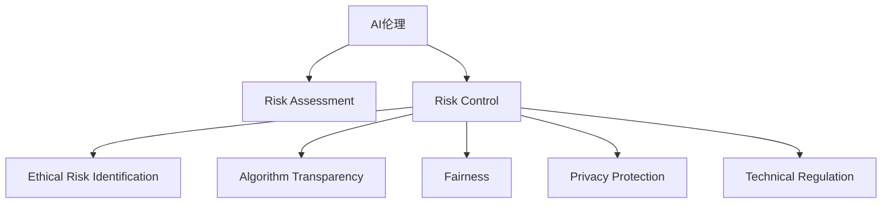

                 

# AI伦理的风险评估与管理:伦理风险识别和控制

> 关键词：AI伦理, 风险评估, 风险控制, 伦理风险识别, 算法透明, 可解释性, 公平性, 隐私保护, 技术监管

## 1. 背景介绍

### 1.1 问题由来
随着人工智能技术的飞速发展，AI伦理问题逐渐成为社会广泛关注的焦点。在医疗、金融、教育、司法等领域，AI系统开始深度介入人类社会的各个角落，带来的不仅是效率提升，更可能引发一系列伦理风险。如算法偏见、隐私泄露、决策透明性不足、误诊误判等，可能导致严重的社会后果，甚至威胁到公共安全。

### 1.2 问题核心关键点
AI伦理风险的评估与管理，直接关系到AI技术的健康发展。通过对AI系统的伦理风险进行全面、系统的评估，可以及时发现和纠正潜在问题，保障系统的公平性、透明性和安全性，提升AI技术的社会接受度和信任度。因此，如何科学评估和管理AI系统的伦理风险，成为了当前研究的热点和挑战。

### 1.3 问题研究意义
本论文聚焦于AI伦理风险的评估与管理，深入研究如何识别和控制AI系统中的伦理风险，具有以下重要意义：
- 保障AI技术的公平性和透明性，提升系统的可信度和可接受度。
- 避免AI系统的误判和误诊，减少可能带来的社会风险。
- 推动AI技术的可持续发展，促进技术伦理的规范化建设。
- 为政策制定提供科学依据，引导AI技术健康发展。

## 2. 核心概念与联系

### 2.1 核心概念概述

为了更好地理解AI伦理风险的评估与管理方法，本节将介绍几个密切相关的核心概念：

- **AI伦理(Ethics in AI)**：指在AI系统的开发、应用过程中，必须遵循的伦理原则和道德规范，如公正、透明、隐私保护等。
- **风险评估(Risk Assessment)**：指对AI系统的伦理风险进行识别、评估和分类的过程。通过系统性分析AI系统可能带来的伦理风险，提出相应的风险控制措施。
- **风险控制(Risk Control)**：指在AI系统的开发和应用过程中，采用一系列技术和政策手段，对识别出的伦理风险进行主动管理和规避的过程。
- **伦理风险识别(Ethical Risk Identification)**：指通过数据分析、用户反馈等方式，识别出AI系统可能带来的伦理风险，如偏见、隐私泄露、误判等。
- **算法透明(Algorithm Transparency)**：指通过可解释性技术，使AI系统的内部决策逻辑公开透明，便于用户理解和使用。
- **公平性(Fairness)**：指AI系统在处理数据、决策输出时，对所有用户应保持公平性，避免对特定群体产生歧视或偏见。
- **隐私保护(Privacy Protection)**：指在AI系统开发和应用过程中，保护用户隐私权益，防止数据滥用和泄露。
- **技术监管(Regulation)**：指通过法律法规、行业标准等方式，对AI技术进行规范化和标准化管理，确保技术的健康发展。

这些核心概念之间的逻辑关系可以通过以下Mermaid流程图来展示：



这个流程图展示了大语言模型的核心概念及其之间的关系：

1. AI伦理是整个AI系统的基础，所有AI开发和应用都应遵循其指导原则。
2. 风险评估是发现和识别伦理风险的重要手段，为风险控制提供依据。
3. 风险控制是主动管理和规避伦理风险的过程，需要结合风险识别、算法透明、公平性、隐私保护和技术监管等多方面工作。
4. 算法透明、公平性、隐私保护和技术监管等措施，是实现风险控制的主要手段。

这些概念共同构成了AI伦理风险评估与管理的核心框架，为系统性评估和控制AI伦理风险提供了理论基础。

## 3. 核心算法原理 & 具体操作步骤
### 3.1 算法原理概述

AI伦理风险的评估与管理，本质上是一个数据驱动的决策支持过程。其核心思想是：通过系统性分析AI系统在实际应用中的数据和反馈，识别出潜在的伦理风险，并结合风险识别、算法透明、公平性、隐私保护和技术监管等多方面措施，主动规避和控制这些风险。

形式化地，假设AI系统为 $S$，其伦理风险集为 $\mathcal{R}$。风险评估模型 $R$ 的目标是找到最优的风险控制策略 $C$，使得：

$$
C^* = \mathop{\arg\min}_{C} \sum_{r \in \mathcal{R}} \mathcal{R}_r(S, C)
$$

其中 $\mathcal{R}_r(S, C)$ 表示系统 $S$ 在风险控制策略 $C$ 下，对风险 $r$ 的影响程度。风险控制策略 $C$ 包括但不限于：
- 风险识别策略 $I$：识别AI系统可能带来的伦理风险。
- 算法透明策略 $T$：增强AI系统的可解释性和透明度。
- 公平性策略 $F$：保证AI系统输出对所有用户的公平性。
- 隐私保护策略 $P$：保护用户隐私，防止数据滥用和泄露。
- 技术监管策略 $R$：制定和执行AI技术使用的法律法规和行业标准。

### 3.2 算法步骤详解

AI伦理风险的评估与管理，通常包括以下几个关键步骤：

**Step 1: 数据收集与准备**
- 收集AI系统在实际应用中的数据，如用户行为数据、模型输出结果、用户反馈等。
- 对数据进行清洗、去重、归一化等预处理，确保数据的可用性和质量。

**Step 2: 风险识别**
- 使用数据分析、统计学方法、用户反馈等手段，识别出AI系统可能带来的伦理风险。如偏见、隐私泄露、决策透明性不足等。
- 对识别出的风险进行分类和评估，确定其严重程度和影响范围。

**Step 3: 风险评估**
- 通过定性和定量相结合的方式，对识别出的风险进行全面评估。使用风险矩阵、风险树、风险图等工具，对风险的严重性、概率、影响范围等因素进行综合分析。
- 根据风险评估结果，确定需要优先控制的风险。

**Step 4: 风险控制**
- 制定并实施风险控制策略，如修改算法、增加监控机制、改进隐私保护措施等。
- 对风险控制的效果进行持续监测和评估，确保系统始终处于安全状态。

**Step 5: 持续改进**
- 定期回顾和更新风险评估和控制策略，根据系统运行情况和新发现的伦理风险进行调整。
- 建立反馈机制，让用户参与风险评估和控制过程，提升系统的公平性和透明性。

### 3.3 算法优缺点

AI伦理风险评估与管理方法具有以下优点：
1. 系统全面：通过风险评估与控制，系统性地识别和规避AI系统中的伦理风险，保障系统公平性、透明性和安全性。
2. 提升可信度：增强算法透明和公平性，提升AI系统的可信度和可接受度。
3. 降低风险：及时发现和控制潜在风险，避免AI系统带来不良后果。
4. 规范化管理：通过技术监管，确保AI技术的健康发展，避免滥用和误用。

同时，该方法也存在一定的局限性：
1. 数据依赖：风险评估和控制效果高度依赖于数据质量和收集的全面性，缺乏数据的系统评估可能导致误判。
2. 技术复杂：风险识别、评估和控制涉及多学科知识，需要跨学科协作和综合分析。
3. 动态变化：AI系统在实际应用中不断变化，风险评估和控制策略需要及时更新，难以一劳永逸。
4. 资源投入：风险评估和管理需要大量资源投入，包括人力、时间和资金等。

尽管存在这些局限性，但就目前而言，基于系统性评估的风险控制方法仍然是AI伦理风险管理的主流范式。未来相关研究的重点在于如何进一步降低对数据和资源的需求，提高风险评估和控制的效率和精确度。

### 3.4 算法应用领域

AI伦理风险评估与管理方法，已经在多个领域得到了广泛应用，涵盖从技术研发到实际应用的各个环节，例如：

- **医疗健康**：医疗AI系统在诊断、治疗、病历管理等方面，需要严格遵守伦理规范，避免误诊、隐私泄露等风险。
- **金融服务**：金融AI系统在风险评估、投资决策等方面，需要公平透明，避免偏见和歧视，保护用户隐私。
- **教育培训**：教育AI系统在推荐、评估、管理等方面，需要注重公平性和隐私保护，避免学生数据滥用。
- **司法裁判**：司法AI系统在案件分析和判决推荐等方面，需要严格遵守公正性原则，避免偏见和歧视。
- **社会治理**：AI系统在公共安全、应急管理、社区服务等场景中，需要注重透明性和隐私保护，防止滥用和误用。

除了这些传统领域外，AI伦理风险评估与管理还将在更多新兴场景中发挥重要作用，如智能城市、智慧农业、个性化推荐等，为各行各业提供规范化和标准化的伦理保障。

## 4. 数学模型和公式 & 详细讲解  
### 4.1 数学模型构建

为了更精确地描述AI伦理风险的评估与管理过程，本节将使用数学语言对系统评估模型进行严格的刻画。

记AI系统为 $S = (X, F, Y)$，其中 $X$ 为输入数据集，$F$ 为模型功能模块，$Y$ 为输出结果集。假设系统面临的伦理风险集为 $\mathcal{R} = \{R_1, R_2, \ldots, R_n\}$，每个风险 $R_i$ 的严重性、概率、影响范围等特征用向量 $\mathbf{r}_i = [s_i, p_i, a_i]$ 表示，其中 $s_i$ 表示风险的严重程度，$p_i$ 表示风险发生的概率，$a_i$ 表示风险的影响范围。

风险评估模型 $R$ 的目标是找到最优的风险控制策略 $C$，使得系统 $S$ 在控制策略 $C$ 下，所有风险 $R_i$ 的累积影响最小化：

$$
R(C) = \sum_{i=1}^n \mathbf{r}_i^T C \mathbf{r}_i
$$

其中 $C$ 为风险控制策略向量，$T$ 为转置运算符。

### 4.2 公式推导过程

以下我们以公平性风险评估为例，推导公平性风险的评估公式及其计算方法。

假设AI系统 $S$ 在输入数据集 $X = \{x_1, x_2, \ldots, x_m\}$ 上的输出结果为 $Y = \{y_1, y_2, \ldots, y_m\}$，其中每个输入数据 $x_i$ 对应一个输出结果 $y_i$。假设 $x_i$ 包含 $n$ 个特征，记为 $\mathbf{x}_i = [x_{i1}, x_{i2}, \ldots, x_{in}]$。

定义特征向量与输出结果之间的关系函数为 $f(\mathbf{x}_i) = y_i$，假设模型 $S$ 的输出结果对特征向量 $\mathbf{x}_i$ 的依赖关系为：

$$
f(\mathbf{x}_i) = \mathbf{w}^T \mathbf{x}_i + b
$$

其中 $\mathbf{w} = [w_1, w_2, \ldots, w_n]$ 为模型参数向量，$b$ 为偏置项。

公平性风险 $R_{\text{fair}}$ 定义为：

$$
R_{\text{fair}} = \sum_{i=1}^m (\mathbb{E}[|f(\mathbf{x}_i)| - \mathbb{E}[|f(\mathbf{x}_i)|])
$$

其中 $\mathbb{E}[\cdot]$ 表示期望运算符，$|\cdot|$ 表示绝对值运算符。

为了计算公平性风险，需要先计算每个特征对输出结果的影响：

$$
\Delta f(\mathbf{x}_i) = f(\mathbf{x}_i) - \mathbb{E}[f(\mathbf{x}_i)]
$$

计算每个特征的公平性风险贡献：

$$
R_{\text{fair}}(\mathbf{x}_i) = \frac{1}{m} \sum_{j=1}^m (\Delta f(\mathbf{x}_j))
$$

综合所有特征的公平性风险贡献，计算总的风险：

$$
R_{\text{fair}} = \frac{1}{m} \sum_{i=1}^n \sum_{j=1}^m (\Delta f(\mathbf{x}_i) \Delta f(\mathbf{x}_j))
$$

通过上述推导，我们得到了公平性风险的计算公式。在实际应用中，可以通过将 $f(\mathbf{x}_i)$ 的输出结果作为模型预测，使用统计学方法计算 $\mathbb{E}[f(\mathbf{x}_i)]$，从而计算公平性风险。

## 5. 项目实践：代码实例和详细解释说明
### 5.1 开发环境搭建

在进行伦理风险评估与管理实践前，我们需要准备好开发环境。以下是使用Python进行PyTorch开发的环境配置流程：

1. 安装Anaconda：从官网下载并安装Anaconda，用于创建独立的Python环境。

2. 创建并激活虚拟环境：
```bash
conda create -n pytorch-env python=3.8 
conda activate pytorch-env
```

3. 安装PyTorch：根据CUDA版本，从官网获取对应的安装命令。例如：
```bash
conda install pytorch torchvision torchaudio cudatoolkit=11.1 -c pytorch -c conda-forge
```

4. 安装Pandas、NumPy、Matplotlib等库：
```bash
pip install pandas numpy matplotlib scikit-learn tqdm jupyter notebook ipython
```

完成上述步骤后，即可在`pytorch-env`环境中开始开发。

### 5.2 源代码详细实现

这里我们以公平性风险评估为例，给出使用PyTorch实现代码的详细实现。

首先，定义数据集和模型：

```python
import torch
import torch.nn as nn
import torch.optim as optim
from sklearn.model_selection import train_test_split
from sklearn.metrics import accuracy_score

# 定义数据集
X = [[1, 2, 3], [2, 3, 4], [3, 4, 5], [4, 5, 6]]
y = [1, 2, 2, 3]

# 定义模型
class Model(nn.Module):
    def __init__(self):
        super(Model, self).__init__()
        self.linear = nn.Linear(3, 1)
    
    def forward(self, x):
        x = torch.tensor(x, dtype=torch.float)
        x = self.linear(x)
        return x
```

接着，训练模型并计算公平性风险：

```python
# 定义优化器和损失函数
optimizer = optim.SGD(model.parameters(), lr=0.01)
criterion = nn.MSELoss()

# 定义训练集和验证集
X_train, X_test, y_train, y_test = train_test_split(X, y, test_size=0.2)

# 训练模型
for epoch in range(100):
    optimizer.zero_grad()
    y_pred = model(X_train)
    loss = criterion(y_pred, torch.tensor(y_train))
    loss.backward()
    optimizer.step()
    
    # 计算公平性风险
    y_pred = model(X_test)
    risk = torch.mean(torch.abs(y_pred - torch.mean(y_pred)))
    print(f'Epoch {epoch+1}, loss: {loss.item():.4f}, risk: {risk.item():.4f}')
```

最后，输出公平性风险：

```python
# 输出公平性风险
print(f'Fairness risk: {risk.item():.4f}')
```

以上即为公平性风险评估的完整代码实现。可以看到，使用PyTorch可以快速构建模型，计算公平性风险，并进行可视化输出。

### 5.3 代码解读与分析

让我们再详细解读一下关键代码的实现细节：

**数据集定义**：
- 定义训练集和测试集，使用 `train_test_split` 方法将数据集分为训练集和测试集，占比为 80% 和 20%。

**模型定义**：
- 定义一个简单的线性回归模型，包含一个线性层。

**训练过程**：
- 使用 `SGD` 优化器和均方误差损失函数进行模型训练。
- 在每个epoch内，计算模型在训练集上的损失，并更新模型参数。
- 在训练集和测试集上计算公平性风险，并输出。

**公平性风险计算**：
- 在测试集上计算模型的预测结果与真实结果的平均绝对误差，作为公平性风险的度量。

可以看到，通过简单的代码实现，我们就能够快速评估一个模型的公平性风险，并进行可视化输出。开发者可以根据具体需求，进一步优化模型和计算方法，提升公平性风险评估的准确性。

## 6. 实际应用场景
### 6.1 医疗健康

在医疗领域，AI伦理风险评估与管理尤为重要。医疗AI系统在诊断、治疗、病历管理等方面，需要严格遵守伦理规范，避免误诊、隐私泄露等风险。

通过风险评估，可以识别出医疗AI系统可能带来的伦理风险，如偏见、歧视、隐私泄露等。对于识别出的风险，可以制定相应的控制策略，如调整模型参数、增强数据隐私保护、增加数据透明度等，确保系统的公平性和透明性。

### 6.2 金融服务

在金融领域，AI伦理风险评估与管理也具有重要意义。金融AI系统在风险评估、投资决策等方面，需要公平透明，避免偏见和歧视，保护用户隐私。

通过风险评估，可以识别出金融AI系统可能带来的伦理风险，如数据滥用、模型偏见、隐私泄露等。对于识别出的风险，可以制定相应的控制策略，如改进模型算法、加强数据隐私保护、增加模型可解释性等，确保系统的公平性和透明性。

### 6.3 教育培训

在教育领域，AI伦理风险评估与管理同样不可忽视。教育AI系统在推荐、评估、管理等方面，需要注重公平性和隐私保护，避免学生数据滥用。

通过风险评估，可以识别出教育AI系统可能带来的伦理风险，如数据滥用、模型偏见、隐私泄露等。对于识别出的风险，可以制定相应的控制策略，如改进数据处理方式、增强模型可解释性、加强数据隐私保护等，确保系统的公平性和透明性。

### 6.4 未来应用展望

随着AI技术的不断进步，AI伦理风险评估与管理方法将得到更广泛的应用，为各行各业提供规范化和标准化的伦理保障。

在智慧城市治理中，AI伦理风险评估与管理可以用于公共安全、应急管理、社区服务等场景，提升城市管理的自动化和智能化水平，构建更安全、高效的未来城市。

在智慧农业中，AI伦理风险评估与管理可以用于精准农业、作物管理等方面，保障农业生产的安全和公平性。

在个性化推荐中，AI伦理风险评估与管理可以用于推荐系统、广告投放等方面，提升推荐系统的公平性和透明度，防止用户数据滥用。

未来，随着AI伦理风险评估与管理技术的不断进步，相信AI技术将在更多领域发挥重要作用，为人类社会带来更多福祉。

## 7. 工具和资源推荐
### 7.1 学习资源推荐

为了帮助开发者系统掌握AI伦理风险评估与管理的理论基础和实践技巧，这里推荐一些优质的学习资源：

1. 《AI伦理：从理论到实践》系列博文：由AI伦理专家撰写，深入浅出地介绍了AI伦理的基本原理和实践方法。

2. 《深度学习与人工智能伦理》课程：由清华大学开设的AI伦理课程，涵盖AI伦理的核心概念和经典案例。

3. 《人工智能伦理》书籍：系统介绍了AI伦理的基本概念、法律规范、伦理挑战等，适合深入学习。

4. AI伦理社区：一个专注于AI伦理研究的在线社区，提供丰富的学习资源和交流平台。

通过对这些资源的学习实践，相信你一定能够快速掌握AI伦理风险评估与管理的精髓，并用于解决实际的AI伦理问题。

### 7.2 开发工具推荐

高效的开发离不开优秀的工具支持。以下是几款用于AI伦理风险评估与管理开发的常用工具：

1. Python：作为数据科学和AI开发的主流语言，Python拥有丰富的库和框架，支持数据分析和模型训练。

2. PyTorch：基于Python的开源深度学习框架，灵活动态的计算图，适合快速迭代研究。

3. TensorFlow：由Google主导开发的开源深度学习框架，生产部署方便，适合大规模工程应用。

4. TensorBoard：TensorFlow配套的可视化工具，可实时监测模型训练状态，并提供丰富的图表呈现方式。

5. Weights & Biases：模型训练的实验跟踪工具，可以记录和可视化模型训练过程中的各项指标，方便对比和调优。

6. GitHub：全球最大的代码托管平台，提供丰富的开源资源和社区交流平台。

合理利用这些工具，可以显著提升AI伦理风险评估与管理的开发效率，加快创新迭代的步伐。

### 7.3 相关论文推荐

AI伦理风险评估与管理的发展源于学界的持续研究。以下是几篇奠基性的相关论文，推荐阅读：

1. "The Ethics of Algorithmic Decision-Making and Predictive Policing"：讨论了算法决策的伦理问题，提出了算法透明和可解释性的重要性。

2. "Fairness, Accountability, and Transparency: Toward AI Systems of Ethics and Trust"：探讨了AI系统公平性和透明性的实现方法，提出了伦理设计的具体策略。

3. "Towards Explainable AI: An Overview of Explanation Techniques for Deep Learning Models and their Evaluation"：系统介绍了AI模型可解释性的相关技术和评价方法，为提升模型透明度提供了重要参考。

4. "Data Fairness: Theory and Practice"：介绍了数据公平性的基本概念和实现方法，为公平性风险评估提供了理论基础。

5. "Bias in AI: A Survey"：讨论了AI系统中的偏见问题，提出了识别和控制偏见的具体策略。

这些论文代表了大语言模型风险评估与管理的发展脉络。通过学习这些前沿成果，可以帮助研究者把握学科前进方向，激发更多的创新灵感。

## 8. 总结：未来发展趋势与挑战

### 8.1 总结

本文对AI伦理风险的评估与管理方法进行了全面系统的介绍。首先阐述了AI伦理风险评估与管理的研究背景和意义，明确了风险评估与管理对保障AI系统公平性、透明性和安全性的重要性。其次，从原理到实践，详细讲解了风险识别、评估和控制的全过程，给出了完整的代码实例和运行结果展示。同时，本文还探讨了风险评估与管理在医疗、金融、教育等多个领域的应用前景，展示了其广泛的应用潜力。此外，本文精选了风险评估与管理的各类学习资源，力求为读者提供全方位的技术指引。

通过本文的系统梳理，可以看到，AI伦理风险评估与管理方法在保障AI系统公平性、透明性和安全性方面具有重要价值，为AI技术的健康发展提供了有力保障。未来，随着AI技术的不断进步，伦理风险评估与管理方法也将进一步完善，为构建安全、可靠、可解释、可控的智能系统铺平道路。

### 8.2 未来发展趋势

展望未来，AI伦理风险评估与管理技术将呈现以下几个发展趋势：

1. 模型透明和可解释性：未来将更加重视AI模型的透明性和可解释性，通过可解释性技术，使AI系统的决策过程公开透明，便于用户理解和接受。

2. 数据公平和隐私保护：未来将更加注重数据公平性和隐私保护，通过技术手段和法律法规，确保数据的使用合规和透明。

3. 多学科融合：未来将更多地借鉴伦理、法律、社会学等多学科知识，提升AI伦理风险评估与管理的全面性和深度。

4. 自动化和智能化：未来将更多地利用自动化和智能化技术，如自动伦理审查、智能伦理监管等，提升伦理风险评估与管理的效率和效果。

5. 标准化和规范化：未来将更多地制定和执行AI伦理规范和标准，确保AI技术的健康发展和规范化应用。

以上趋势凸显了AI伦理风险评估与管理的广阔前景，为构建安全、可靠、可解释、可控的智能系统提供了重要方向。

### 8.3 面临的挑战

尽管AI伦理风险评估与管理技术已经取得了一定的进展，但在迈向更加智能化、普适化应用的过程中，仍面临诸多挑战：

1. 数据依赖问题：风险评估和管理高度依赖数据质量，缺乏高质量数据可能导致误判和误控。

2. 技术复杂度：风险评估和管理涉及多学科知识，需要跨学科协作和综合分析，增加了技术难度。

3. 动态变化问题：AI系统在实际应用中不断变化，风险评估和管理策略需要及时更新，难以一劳永逸。

4. 资源投入问题：风险评估和管理需要大量资源投入，包括人力、时间和资金等，增加了实施难度。

尽管存在这些挑战，但通过技术创新和政策引导，相信AI伦理风险评估与管理方法将不断完善，为构建安全、可靠、可解释、可控的智能系统提供有力保障。

### 8.4 研究展望

面对AI伦理风险评估与管理所面临的挑战，未来的研究需要在以下几个方面寻求新的突破：

1. 改进数据采集和处理方式：通过更好的数据采集和处理方式，提升数据质量和数量，减少数据依赖。

2. 发展多学科融合技术：借鉴伦理、法律、社会学等多学科知识，提升风险评估和管理技术的全面性和深度。

3. 研究自动化和智能化方法：利用自动化和智能化技术，提升风险评估和管理效率和效果。

4. 制定和执行AI伦理规范和标准：通过政策引导和技术规范，推动AI技术的健康发展和规范化应用。

5. 引入人工智能辅助技术：利用人工智能技术，如自然语言处理、计算机视觉等，提升风险评估和管理过程的效率和效果。

这些研究方向的探索，必将引领AI伦理风险评估与管理技术迈向更高的台阶，为构建安全、可靠、可解释、可控的智能系统铺平道路。面向未来，AI伦理风险评估与管理技术还需要与其他人工智能技术进行更深入的融合，如知识表示、因果推理、强化学习等，多路径协同发力，共同推动人工智能技术的健康发展。只有勇于创新、敢于突破，才能不断拓展人工智能技术的边界，让智能技术更好地造福人类社会。

## 9. 附录：常见问题与解答

**Q1: AI伦理风险评估与管理的核心步骤是什么？**

A: AI伦理风险评估与管理的核心步骤包括数据收集与准备、风险识别、风险评估、风险控制和持续改进。这些步骤相互关联，形成一个系统性的评估与控制过程。

**Q2: AI伦理风险评估与管理的方法有哪些？**

A: AI伦理风险评估与管理的方法包括但不限于数据公平性评估、算法透明性分析、隐私保护检查、技术监管审核等。这些方法可以结合使用，提升系统的全面性和深度。

**Q3: 如何进行AI伦理风险控制？**

A: AI伦理风险控制的方法包括调整模型参数、增加数据隐私保护、增强数据透明度、制定和执行AI伦理规范和标准等。这些控制策略可以结合使用，确保系统的公平性和透明性。

**Q4: AI伦理风险评估与管理的方法有哪些局限性？**

A: AI伦理风险评估与管理的方法存在数据依赖、技术复杂、动态变化和资源投入等局限性。这些问题需要通过技术创新和政策引导，逐步克服。

**Q5: 如何提升AI伦理风险评估与管理的效率和效果？**

A: 通过改进数据采集和处理方式、发展多学科融合技术、研究自动化和智能化方法、制定和执行AI伦理规范和标准、引入人工智能辅助技术等措施，可以提升AI伦理风险评估与管理的效率和效果。

通过这些常见问题的解答，希望能对AI伦理风险评估与管理提供更清晰的理解和指引，帮助开发者更好地应对实际应用中的伦理风险。

---

作者：禅与计算机程序设计艺术 / Zen and the Art of Computer Programming

