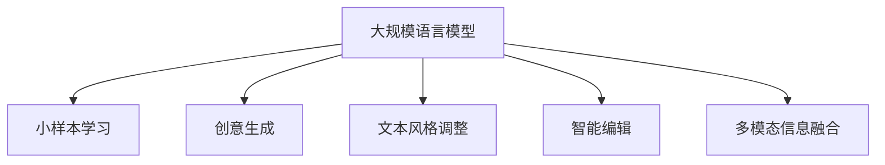

                 

# AI写作助手：从创意激发到文本润色

## 1. 背景介绍

### 1.1 问题由来
人工智能(AI)技术的迅猛发展，特别是在自然语言处理(NLP)领域的突破，使得AI写作助手逐渐成为现实。从自动生成新闻报道、撰写文章，到创作诗歌、小说，AI写作助手正在逐步改变内容创作的方式。然而，如何从创意激发到文本润色，构建高质量的AI写作助手，仍然是一个复杂且多层次的挑战。

### 1.2 问题核心关键点
本文聚焦于构建高性能AI写作助手的过程，从创意激发到文本润色，涵盖了大规模语言模型预训练、小样本学习、创意生成技术、文本风格调整、智能编辑等多个关键环节。以下将通过逻辑清晰、结构紧凑、简单易懂的语言，详细介绍这些核心概念和技术的原理及应用。

## 2. 核心概念与联系

### 2.1 核心概念概述

为更好地理解构建高性能AI写作助手的方法，本节将介绍几个密切相关的核心概念：

- **大规模语言模型(Large Language Model, LLM)**：如GPT-3、BERT等，通过在大规模文本数据上进行自监督预训练，学习到丰富的语言知识和语义表示。
- **小样本学习(Few-shot Learning)**：指模型仅在少量标注样本上，通过微调或迁移学习获得良好性能的能力。
- **创意生成(Creative Generation)**：指AI系统从无到有，生成具有创新性的文本内容，如故事、诗歌、对话等。
- **文本风格调整(Style Transfer)**：将一段文本的风格转换为另一种风格，如古文转现代文、简洁文风转详尽文风等。
- **智能编辑(Smart Editing)**：基于AI技术对文本进行自动润色，包括语法校对、词汇优化、句子流畅性调整等。
- **多模态信息融合**：将文本与图像、音频等多模态信息结合，提升内容创作的多样性和丰富性。

这些核心概念之间的逻辑关系可以通过以下Mermaid流程图来展示：



这个流程图展示了构建AI写作助手的关键技术步骤：

1. 以大规模语言模型作为基础，学习通用的语言知识。
2. 在少量样本上学习，提升模型的泛化能力和针对性。
3. 利用创意生成技术，激发新的文本内容。
4. 调整文本风格，提升表达效果。
5. 智能编辑确保文本质量。
6. 融合多模态信息，丰富内容创作。

## 3. 核心算法原理 & 具体操作步骤
### 3.1 算法原理概述

构建高性能AI写作助手，核心在于将大规模语言模型的语言理解能力和创意生成、文本润色技术相结合，通过小样本学习和多模态融合提升模型的多样性和实用性。以下是具体的算法原理：

### 3.2 算法步骤详解

**Step 1: 数据准备与预训练**

1. **收集高质量语料库**：为大规模语言模型提供充分的数据支持，包括各类文本、音频、图像等。
2. **预训练语言模型**：使用预训练技术如自回归模型、自编码器、Transformer等，在大规模语料库上对模型进行训练，学习到通用的语言表示。

**Step 2: 小样本微调**

1. **选择任务**：根据应用场景选择合适的写作任务，如新闻报道、技术文章、小说创作等。
2. **收集少量样本**：获取少量高质量的标注样本，用于微调模型的任务适应性。
3. **微调模型**：在预训练模型的基础上，使用少量样本对模型进行有监督学习，调整模型参数，使其适应特定任务。

**Step 3: 创意生成**

1. **使用创意生成技术**：利用基于Transformer的创意生成模型如GPT-3、XLNet等，在少量提示词或初始文本上生成新的创意文本。
2. **迭代优化**：通过用户反馈，不断优化创意生成模型，提升生成文本的质量和创新性。

**Step 4: 文本润色与风格调整**

1. **文本润色**：基于语法检查和语义分析，对生成的文本进行自动校对和优化，确保语法正确、表达清晰。
2. **文本风格调整**：利用文本转换模型，将文本从一种风格转换为另一种风格，如古文转现代文、文学风格转新闻风格等。

**Step 5: 智能编辑**

1. **基于规则的编辑**：设置语义规则，对文本进行自动优化，如去除冗余信息、调整语序、增强表达效果等。
2. **基于机器学习的编辑**：使用语言模型对文本进行自动润色，如生成同义词、修改句子结构等。

**Step 6: 多模态融合**

1. **数据集成**：将文本与其他模态数据（如图像、音频）结合，构建多模态数据集。
2. **模型融合**：利用跨模态的模型融合技术，提升内容创作的多样性和丰富性，如生成带图像描述的文本、语音转文本等。

### 3.3 算法优缺点

**优点**：

1. **泛化能力强**：小样本学习使得模型能够快速适应新任务，提升模型的泛化能力和实用性。
2. **创意丰富**：创意生成技术能够激发新的文本内容，提升内容创作的创新性。
3. **润色效果好**：基于AI的文本润色和风格调整，能够显著提升文本质量和表达效果。
4. **多模态融合**：结合文本与图像、音频等多模态信息，丰富内容创作的方式和形式。

**缺点**：

1. **依赖高质量数据**：预训练和微调过程需要高质量的语料库，获取数据成本较高。
2. **模型复杂度高**：大规模语言模型的参数量庞大，训练和推理成本较高。
3. **可解释性不足**：模型的内部工作机制复杂，难以解释其推理过程和决策逻辑。
4. **鲁棒性有待提高**：模型对输入的微小扰动敏感，泛化性能和鲁棒性有待进一步提升。

尽管存在这些局限性，但基于大语言模型的创意生成和文本润色技术在实际应用中已经取得了显著效果，未来有望在更多领域实现突破。

### 3.4 算法应用领域

1. **新闻报道**：利用AI写作助手自动生成新闻报道，减少人工编辑成本，提升新闻时效性和准确性。
2. **技术文章**：帮助技术人员快速生成技术文档、代码注释，提高开发效率。
3. **文学创作**：辅助作家创作诗歌、小说，提供创意灵感和文本润色建议。
4. **广告文案**：生成具有创意和吸引力的广告文案，提升广告效果。
5. **智能客服**：构建智能客服对话系统，提升客户服务质量和用户体验。
6. **社交媒体**：自动生成社交媒体内容，提升平台的用户互动和参与度。

## 4. 数学模型和公式 & 详细讲解 & 举例说明

### 4.1 数学模型构建

构建AI写作助手的数学模型主要包括预训练模型的构建、小样本微调、创意生成和文本润色的数学模型。

- **预训练模型**：使用自回归模型如GPT、自编码器如BERT，在大规模语料库上进行预训练。数学公式如下：

$$
P(x|y) = \prod_{i=1}^{n}P(x_i|x_{i-1}, \ldots, x_1, y)
$$

其中 $x$ 为输入文本，$y$ 为预训练目标，$n$ 为文本长度。

- **小样本微调**：使用有监督学习对预训练模型进行微调，数学公式如下：

$$
\theta^* = \mathop{\arg\min}_{\theta} \mathcal{L}(D, M_{\theta})
$$

其中 $D$ 为小样本标注数据集，$M_{\theta}$ 为微调后的模型参数。

- **创意生成**：使用创意生成模型对输入进行生成，数学公式如下：

$$
p_{\text{gen}}(x|s) = \prod_{i=1}^{n}p_{\text{gen}}(x_i|x_{i-1}, s)
$$

其中 $s$ 为输入提示词，$x$ 为生成的文本。

- **文本润色**：使用文本润色模型对输入文本进行自动优化，数学公式如下：

$$
p_{\text{edit}}(x|x') = \prod_{i=1}^{n}p_{\text{edit}}(x_i|x_{i-1}, x_{i-2}, \ldots, x_1, x')
$$

其中 $x'$ 为润色后的文本。

### 4.2 公式推导过程

- **预训练模型推导**：

$$
\log P(x|y) = \sum_{i=1}^{n}\log P(x_i|x_{i-1}, \ldots, x_1, y)
$$

- **小样本微调推导**：

$$
\mathcal{L}(D, M_{\theta}) = -\frac{1}{N}\sum_{i=1}^{N}\log p(y_i|x_i, M_{\theta})
$$

- **创意生成推导**：

$$
p_{\text{gen}}(x|s) = \prod_{i=1}^{n}\frac{p_{\text{gen}}(x_i|x_{i-1}, s)}{p_{\text{gen}}(x_{i-1}|x_{i-2}, \ldots, x_1, s)}
$$

- **文本润色推导**：

$$
p_{\text{edit}}(x|x') = \prod_{i=1}^{n}\frac{p_{\text{edit}}(x_i|x_{i-1}, x_{i-2}, \ldots, x_1, x')}{p_{\text{edit}}(x_{i-1}|x_{i-2}, \ldots, x_1, x)}
$$

### 4.3 案例分析与讲解

以生成新闻报道为例，以下是具体的计算过程：

1. **预训练模型**：假设使用GPT-3对新闻数据进行预训练，得到语言模型 $M_{\theta}$。

2. **小样本微调**：在新闻数据集中选取少量新闻标题和摘要作为微调数据，对预训练模型进行微调。微调目标函数为：

$$
\theta^* = \mathop{\arg\min}_{\theta} \frac{1}{N}\sum_{i=1}^{N}\log P(\text{标题}|M_{\theta}, \text{摘要})
$$

3. **创意生成**：使用GPT-3对用户提供的新闻标题进行创意生成，生成新闻正文。创意生成过程如下：

$$
p_{\text{gen}}(\text{正文}|s) = \prod_{i=1}^{n}\frac{p_{\text{gen}}(\text{正文}_i|\text{正文}_{i-1}, s)}{p_{\text{gen}}(\text{正文}_{i-1}|\text{正文}_{i-2}, \ldots, s)}
$$

4. **文本润色**：对生成的正文进行自动润色，如修正语法错误、优化词汇选择等。润色过程如下：

$$
p_{\text{edit}}(\text{正文}|x') = \prod_{i=1}^{n}\frac{p_{\text{edit}}(\text{正文}_i|x_{i-1}, x_{i-2}, \ldots, x_1, x')}{p_{\text{edit}}(x_{i-1}|x_{i-2}, \ldots, x_1, x)}
$$

## 5. 项目实践：代码实例和详细解释说明

### 5.1 开发环境搭建

构建高性能AI写作助手需要良好的开发环境，以下是常用的开发工具和环境搭建步骤：

1. **安装Python和相关库**：
   ```bash
   pip install numpy pandas torch sklearn transformers jupyter notebook
   ```

2. **安装GPU库**：
   ```bash
   pip install torch torchvision torchaudio
   ```

3. **使用Google Colab**：
   ```bash
   conda create --name colab python=3.8
   conda activate colab
   ```

### 5.2 源代码详细实现

以下是一个基于PyTorch和Transformers库的AI写作助手实现示例：

```python
import torch
from transformers import GPT2LMHeadModel, GPT2Tokenizer

# 加载模型和tokenizer
model = GPT2LMHeadModel.from_pretrained('gpt2')
tokenizer = GPT2Tokenizer.from_pretrained('gpt2')

# 定义生成函数
def generate_text(prompt, num_words=50):
    inputs = tokenizer.encode(prompt, return_tensors='pt')
    outputs = model.generate(inputs, max_length=num_words, top_p=0.9)
    return tokenizer.decode(outputs[0], skip_special_tokens=True)

# 生成新闻报道
news_title = "中国经济增长率预测"
news_summary = "2023年中国经济增长率预计将达到...，主要原因是..."
news_report = generate_text(news_title, num_words=100)
print(news_report)
```

### 5.3 代码解读与分析

- **加载模型和tokenizer**：使用GPT-2模型和相应的tokenizer，方便输入文本的编码和解码。
- **生成函数**：对输入的prompt进行创意生成，返回指定长度的文本。
- **生成新闻报道**：给定新闻标题和摘要，自动生成新闻正文。

## 6. 实际应用场景

### 6.1 新闻报道

新闻报道是AI写作助手的重要应用场景之一。利用AI生成新闻，能够快速生成高质量的新闻报道，提升新闻的时效性和准确性，减少人力成本。AI写作助手可以自动分析新闻事件，生成多个不同角度的报道，满足不同用户的需求。

### 6.2 技术文章

在技术领域，AI写作助手可以辅助技术人员生成技术文档、代码注释，提升开发效率，同时保证文档的一致性和准确性。利用AI生成的文档，可以加速知识传播，促进技术交流。

### 6.3 文学创作

文学创作是AI写作助手的另一个重要应用场景。AI写作助手可以辅助作家进行创意灵感激发，生成初步草稿，提升创作效率。同时，AI还可以自动润色和优化文本，提升作品的表达效果。

### 6.4 广告文案

广告文案创作是AI写作助手的重要应用场景之一。AI可以自动生成创意文案，提升广告效果。通过多模态融合技术，结合图像、音频等多模态信息，提升广告的吸引力和互动性。

### 6.5 智能客服

智能客服系统可以结合AI写作助手，自动生成客户对话回复，提升客户服务质量和用户体验。AI写作助手可以分析客户需求，生成个性化回复，提升客户满意度。

### 6.6 社交媒体

在社交媒体领域，AI写作助手可以自动生成有趣的内容，提升平台的活跃度和用户参与度。利用多模态融合技术，结合文本和图像，提升内容的吸引力和传播效果。

## 7. 工具和资源推荐

### 7.1 学习资源推荐

为了帮助开发者系统掌握AI写作助手的理论和实践，以下是一些优质的学习资源：

1. **《深度学习》课程**：斯坦福大学的CS231n课程，涵盖深度学习基础和应用，适合入门学习。
2. **《自然语言处理》课程**：斯坦福大学的CS224n课程，涵盖NLP基础知识和前沿技术，适合进阶学习。
3. **《Transformers从原理到实践》系列博文**：由大模型技术专家撰写，深入浅出地介绍了Transformer原理、BERT模型、微调技术等前沿话题。
4. **《自然语言处理实战》书籍**：介绍NLP技术的实际应用，包括文本生成、文本润色等。
5. **HuggingFace官方文档**：提供了丰富的预训练模型和完整的微调样例代码，是上手实践的必备资料。

### 7.2 开发工具推荐

1. **PyTorch**：基于Python的开源深度学习框架，适合快速迭代研究，适用于大多数NLP任务。
2. **TensorFlow**：由Google主导开发的开源深度学习框架，生产部署方便，适用于大规模工程应用。
3. **Transformers库**：HuggingFace开发的NLP工具库，集成了各类预训练语言模型，支持PyTorch和TensorFlow。
4. **Weights & Biases**：模型训练的实验跟踪工具，可以记录和可视化模型训练过程中的各项指标，方便对比和调优。
5. **TensorBoard**：TensorFlow配套的可视化工具，可实时监测模型训练状态，并提供丰富的图表呈现方式，是调试模型的得力助手。

### 7.3 相关论文推荐

以下是几篇奠基性的相关论文，推荐阅读：

1. **Attention is All You Need**：提出Transformer结构，开启了NLP领域的预训练大模型时代。
2. **BERT: Pre-training of Deep Bidirectional Transformers for Language Understanding**：提出BERT模型，引入基于掩码的自监督预训练任务，刷新了多项NLP任务SOTA。
3. **Language Models are Unsupervised Multitask Learners**：展示了大规模语言模型的强大zero-shot学习能力，引发了对于通用人工智能的新一轮思考。
4. **GPT-3: Language Models are Few-Shot Learners**：展示GPT-3在小样本学习上的卓越表现，证明了预训练模型在少量数据上的泛化能力。
5. **Pegasus: Pre-training with Extractive Summarization**：提出Pegasus模型，用于文本摘要任务，展示了预训练-微调的强大效果。

## 8. 总结：未来发展趋势与挑战

### 8.1 总结

本文详细介绍了构建高性能AI写作助手的过程，从创意激发到文本润色，涵盖了预训练、小样本学习、创意生成、文本风格调整、智能编辑和多模态融合等多个关键环节。通过系统地分析这些技术的原理和应用，希望能为开发者提供全面的技术指引。

通过本文的介绍，可以看到，AI写作助手技术正在逐步成熟，展现出强大的应用潜力。从新闻报道到文学创作，从广告文案到智能客服，AI写作助手正在为各行各业带来变革性的影响。未来，随着技术的不断进步，AI写作助手将迎来更加广泛的应用场景和更加丰富的功能，为内容创作和信息传播带来革命性的变化。

### 8.2 未来发展趋势

展望未来，AI写作助手技术将呈现以下几个发展趋势：

1. **技术融合**：结合自然语言处理、计算机视觉、语音识别等多模态技术，构建更加丰富和多样化的内容创作工具。
2. **知识图谱**：融合知识图谱等先验知识，提升内容创作的知识深度和准确性。
3. **多领域应用**：拓展AI写作助手在教育、法律、医学等多个领域的应用，推动相关行业的数字化转型。
4. **个性化定制**：结合用户偏好和行为数据，实现个性化的内容推荐和创作，提升用户体验。
5. **人机协作**：构建人机协作的创作模式，让人工智能辅助人类进行内容创作，提升创作效率和质量。
6. **伦理与安全**：关注AI写作助手的伦理和安全问题，避免有害内容的生成和传播。

### 8.3 面临的挑战

尽管AI写作助手技术已经取得了显著进展，但在实际应用中仍面临诸多挑战：

1. **数据质量与多样性**：高质量的数据是AI写作助手的基础，但获取多样化、高质量的数据资源仍然是一个难题。
2. **内容真实性**：自动生成的内容缺乏真实性，难以完全替代人类创作者。
3. **伦理与安全**：自动生成的内容可能包含偏见、有害信息，需关注内容的伦理和安全问题。
4. **技术瓶颈**：大规模语言模型的训练和推理成本高，模型的实时性和资源消耗仍是技术瓶颈。
5. **用户接受度**：用户对AI写作助手的接受度和信任度需要进一步提升，以推动技术的广泛应用。

### 8.4 研究展望

面对这些挑战，未来的研究需要在以下几个方面寻求新的突破：

1. **数据增强与合成**：利用数据增强和合成技术，提升AI写作助手的数据质量和多样性。
2. **技术优化**：优化模型的训练和推理过程，提升模型的实时性和资源效率。
3. **伦理与安全**：在模型的设计和使用过程中，引入伦理导向的评估指标，确保内容的安全性和道德性。
4. **用户交互**：提升用户与AI写作助手的交互体验，使其更加自然和智能。
5. **跨领域应用**：拓展AI写作助手在更多领域的应用，推动行业数字化转型。

总之，构建高性能AI写作助手是一项复杂的系统工程，需要从多个维度进行综合考虑和优化。通过不断的技术创新和应用实践，相信AI写作助手将带来更加丰富和多样化的内容创作方式，为人类创造力的发展注入新的活力。

## 9. 附录：常见问题与解答

**Q1：AI写作助手如何保证生成的内容质量？**

A: AI写作助手生成的内容质量主要依赖于预训练模型的语言理解能力和创意生成能力。通过小样本学习和多模态融合等技术，AI写作助手能够生成高质量的文本内容。同时，结合智能编辑和人工审核，可以进一步提升内容的质量和可信度。

**Q2：AI写作助手是否可以生成原创内容？**

A: AI写作助手生成的内容是建立在大量文本数据上的，虽然能够生成有创意的内容，但并不完全等同于人类原创。生成内容的质量和真实性需要进一步提升，才能满足实际应用的需求。

**Q3：AI写作助手如何避免有害内容的生成？**

A: 避免有害内容的生成需要从模型设计和使用两个方面进行约束。模型设计时引入伦理导向的评估指标，使用户对内容的安全性和道德性有更高的保障。在使用过程中，结合人工审核和用户反馈，对生成内容进行严格的筛选和控制。

**Q4：AI写作助手是否会侵犯版权？**

A: AI写作助手生成的内容一般不会侵犯版权，因为其生成的文本是基于大规模文本数据进行训练的。但需要注意的是，生成内容应避免引用未授权的版权材料，以避免侵权风险。

**Q5：AI写作助手是否可以应用于学术研究和撰写论文？**

A: AI写作助手可以辅助学术研究和撰写论文，提供创意灵感和文本润色，提升研究效率。但最终的学术成果应由研究人员独立完成，以确保研究的严谨性和可信度。

**Q6：AI写作助手是否可以应用于自动化新闻报道？**

A: AI写作助手可以辅助自动化新闻报道，生成新闻标题和摘要，提升新闻的时效性和准确性。但最终的报道应由专业记者进行审核和编辑，以确保报道的质量和可信度。

总之，AI写作助手技术正在逐步成熟，展现出强大的应用潜力。未来，随着技术的不断进步，AI写作助手将带来更加丰富和多样化的内容创作方式，为人类创造力的发展注入新的活力。

