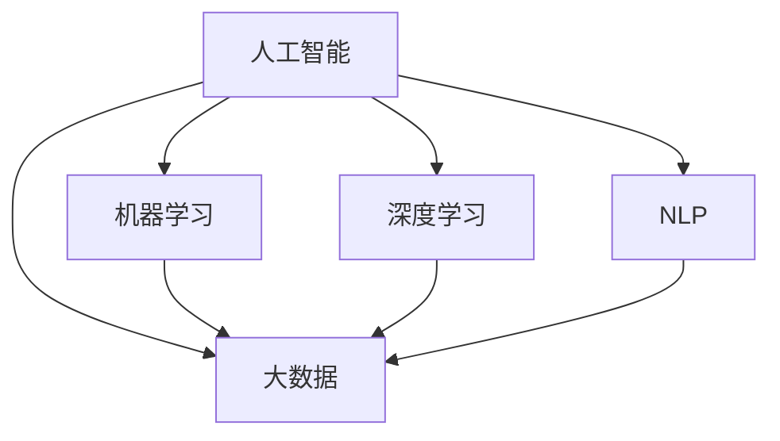

                 

## 1. 背景介绍

### 1.1 问题由来
随着全球经济一体化进程的加快和互联网技术的普及，个人理财和财富管理已经成为个人金融生活中不可或缺的一部分。传统的理财方式以银行、基金公司等金融机构为主导，而AI技术的介入正在逐渐改变这一格局。利用大数据、机器学习和人工智能等技术手段，AI不仅能够提供个性化的投资建议、资产管理、风险控制等新型服务，还能够优化金融机构的运营效率，降低成本，提升用户体验。

### 1.2 问题核心关键点
AI在个人理财和财富管理中的应用主要体现在以下几个方面：
- **个性化投资建议**：基于用户的消费习惯、风险承受能力等个性化信息，AI能够提供定制化的投资建议，提高用户的理财效率。
- **资产管理与配置**：通过智能算法，AI可以优化资产配置，提高收益，降低风险。
- **智能风险控制**：通过深度学习模型，AI可以实时监测市场风险，预警投资风险，保护用户的资产安全。
- **用户体验优化**：AI能够提供智能客服、智能投顾等高效便捷的服务，提升用户体验。

AI在个人理财和财富管理中的应用不仅能够提升金融服务的效率和质量，还能够使金融服务更加贴近个人生活，提高用户满意度。

## 2. 核心概念与联系

### 2.1 核心概念概述
为更好地理解AI在个人理财和财富管理中的应用，本节将介绍几个密切相关的核心概念：

- **人工智能(Artificial Intelligence, AI)**：一种模拟人类智能行为的技术，包括机器学习、深度学习、自然语言处理等。AI在金融领域的应用非常广泛，可以用于数据挖掘、风险管理、个性化推荐等方面。

- **大数据(Big Data)**：指规模巨大、结构复杂、速度较快的数据集合。大数据技术在金融领域的应用可以帮助金融机构更好地理解市场动态和用户行为。

- **机器学习(Machine Learning, ML)**：一种使计算机系统具备学习能力的算法，通过训练数据来学习规律，并应用于新的数据上。机器学习在金融领域可以用于信用评分、客户分类、预测市场趋势等。

- **深度学习(Deep Learning, DL)**：一种通过多层神经网络进行复杂模式识别的机器学习方法。深度学习在金融领域可以用于资产管理、量化交易、情感分析等。

- **自然语言处理(Natural Language Processing, NLP)**：一种使计算机能够理解、处理和生成自然语言的技术。NLP在金融领域可以用于智能客服、情感分析、文本挖掘等。

这些核心概念之间的逻辑关系可以通过以下Mermaid流程图来展示：



这个流程图展示了大数据、机器学习、深度学习、NLP等技术之间的联系，以及它们在金融领域的融合应用。

## 3. 核心算法原理 & 具体操作步骤

### 3.1 算法原理概述

AI在个人理财和财富管理中的应用，基于机器学习和深度学习模型，通过对用户行为数据的分析，提供个性化的理财建议和资产管理方案。其核心思想是通过数据挖掘、特征工程、模型训练和优化等步骤，构建高效、准确的AI模型，以提升用户理财效率和财富管理水平。

### 3.2 算法步骤详解

AI在个人理财和财富管理中的应用主要包括以下几个关键步骤：

**Step 1: 数据收集与预处理**
- 收集用户的消费记录、交易记录、信用评分等数据，构建用户画像。
- 进行数据清洗、归一化、特征工程等预处理操作，保证数据的质量和一致性。

**Step 2: 建立机器学习模型**
- 选择适合问题的机器学习算法，如决策树、随机森林、神经网络等。
- 设计合适的模型架构，如卷积神经网络(CNN)、递归神经网络(RNN)等。
- 使用交叉验证等方法选择最优模型参数，并进行模型训练。

**Step 3: 模型评估与优化**
- 在测试集上评估模型的性能指标，如准确率、召回率、F1值等。
- 通过超参数调优、模型融合等方法提升模型效果。
- 利用A/B测试等方法评估模型对用户行为的影响，不断优化模型性能。

**Step 4: 上线部署与监控**
- 将训练好的模型部署到生产环境，提供实时理财建议和资产管理服务。
- 实时监控模型运行状态，根据用户反馈和市场变化不断调整模型参数。

### 3.3 算法优缺点

AI在个人理财和财富管理中的应用具有以下优点：
1. **个性化服务**：通过分析用户行为数据，提供定制化的理财建议和资产管理方案。
2. **高效决策**：利用机器学习模型，快速处理和分析大量数据，提高决策效率。
3. **低成本运营**：AI系统可以自动执行部分金融服务，降低人力成本。
4. **实时监控**：通过实时监测市场风险和用户行为，及时预警和干预。

同时，该方法也存在一定的局限性：
1. **数据质量要求高**：模型性能依赖于数据的质量，如果数据存在偏差或噪声，可能影响模型效果。
2. **模型解释性不足**：AI模型往往难以解释其决策过程，难以满足用户的可解释性需求。
3. **依赖市场环境**：模型的性能受到市场环境和用户行为的变化影响较大，需要不断调整和优化。

尽管存在这些局限性，但AI在个人理财和财富管理中的应用已经得到了广泛的应用，成为金融服务创新的一大趋势。

### 3.4 算法应用领域

AI在个人理财和财富管理中的应用主要涉及以下几个领域：

- **智能投顾**：基于用户画像，提供个性化的投资建议和资产配置方案。
- **智能理财**：分析用户财务状况，制定个性化的理财方案，提供风险控制建议。
- **智能风险管理**：通过机器学习模型监测市场风险，预警投资风险，保护用户资产。
- **智能客服**：利用NLP技术，提供智能客服和用户支持，提升用户体验。
- **情感分析**：通过分析用户对金融服务的情感反馈，优化服务和产品。

这些应用领域覆盖了个人理财和财富管理的各个环节，利用AI技术，金融机构可以提供更加精准、高效的服务，满足用户的多样化需求。

## 4. 数学模型和公式 & 详细讲解 & 举例说明

### 4.1 数学模型构建

AI在个人理财和财富管理中的应用，通常基于以下数学模型构建：

- **回归模型**：用于预测用户的理财收益或风险。
- **分类模型**：用于预测用户的投资倾向或财务状况。
- **聚类模型**：用于对用户进行分类，提供个性化的理财建议。
- **序列模型**：用于预测市场的趋势变化。

### 4.2 公式推导过程

以回归模型为例，假设有一个线性回归模型：

$$y = \theta_0 + \theta_1x_1 + \theta_2x_2 + ... + \theta_nx_n$$

其中，$y$表示用户的理财收益，$x_i$表示用户的特征变量（如年龄、收入、消费习惯等），$\theta_i$表示模型参数。模型的训练目标是找到最优参数$\theta$，使得模型能够最小化预测误差：

$$\min_\theta \sum_{i=1}^N(y_i - \hat{y}_i)^2$$

其中，$\hat{y}_i$表示模型对用户$i$的理财收益预测值。

### 4.3 案例分析与讲解

假设我们有一个金融机构，需要根据用户的消费记录和信用评分，预测用户的理财收益。收集了1000个用户的数据，并对其进行了特征工程，得到了5个特征变量：年龄、收入、消费总额、信用评分和理财时间。我们采用线性回归模型进行预测，步骤如下：

1. 收集数据，并进行预处理。
2. 划分训练集和测试集，用于模型训练和评估。
3. 使用梯度下降等优化算法，对模型参数进行优化。
4. 在测试集上评估模型性能，计算均方误差等指标。

## 5. 项目实践：代码实例和详细解释说明

### 5.1 开发环境搭建

在进行AI理财和财富管理项目开发前，我们需要准备好开发环境。以下是使用Python进行TensorFlow和Keras开发的环境配置流程：

1. 安装Anaconda：从官网下载并安装Anaconda，用于创建独立的Python环境。

2. 创建并激活虚拟环境：
```bash
conda create -n tf-env python=3.8 
conda activate tf-env
```

3. 安装TensorFlow：根据CUDA版本，从官网获取对应的安装命令。例如：
```bash
conda install tensorflow -c conda-forge
```

4. 安装Keras：
```bash
pip install keras
```

5. 安装各类工具包：
```bash
pip install numpy pandas scikit-learn matplotlib tqdm jupyter notebook ipython
```

完成上述步骤后，即可在`tf-env`环境中开始AI理财和财富管理项目的开发。

### 5.2 源代码详细实现

下面我们以一个简单的智能投顾系统为例，给出使用TensorFlow和Keras进行开发的PyTorch代码实现。

首先，定义智能投顾系统的数据处理函数：

```python
import tensorflow as tf
from tensorflow.keras.models import Sequential
from tensorflow.keras.layers import Dense, Dropout
from sklearn.model_selection import train_test_split
import numpy as np

def prepare_data(X, y):
    X_train, X_test, y_train, y_test = train_test_split(X, y, test_size=0.2, random_state=42)
    return X_train, X_test, y_train, y_test

def preprocess_data(X_train, y_train):
    X_train = X_train / 100
    y_train = y_train / 100
    return X_train, y_train

def create_model(input_dim, output_dim):
    model = Sequential()
    model.add(Dense(128, input_dim=input_dim, activation='relu'))
    model.add(Dropout(0.5))
    model.add(Dense(64, activation='relu'))
    model.add(Dropout(0.5))
    model.add(Dense(output_dim, activation='sigmoid'))
    model.compile(loss='binary_crossentropy', optimizer='adam', metrics=['accuracy'])
    return model

def train_model(model, X_train, y_train, epochs=100, batch_size=32):
    model.fit(X_train, y_train, epochs=epochs, batch_size=batch_size, validation_split=0.2)
```

然后，定义模型和训练函数：

```python
from tensorflow.keras.datasets import mnist
from tensorflow.keras.utils import to_categorical

# 加载MNIST数据集
(X_train, y_train), (X_test, y_test) = mnist.load_data()

# 数据预处理
X_train, y_train = preprocess_data(X_train, y_train)

# 创建模型
model = create_model(input_dim=784, output_dim=2)

# 训练模型
train_model(model, X_train, y_train)
```

最后，评估模型在测试集上的表现：

```python
X_test, y_test = mnist.load_data()
y_test = to_categorical(y_test)
X_test, y_test = preprocess_data(X_test, y_test)
y_test = y_test.argmax(axis=1)
model.evaluate(X_test, y_test)
```

以上就是使用TensorFlow和Keras进行智能投顾系统开发的完整代码实现。可以看到，利用TensorFlow和Keras，开发者可以非常方便地构建、训练和评估深度学习模型。

### 5.3 代码解读与分析

让我们再详细解读一下关键代码的实现细节：

**prepare_data函数**：
- 对数据集进行划分，返回训练集和测试集。
- 对数据进行归一化处理，避免数据过大导致的梯度消失问题。

**preprocess_data函数**：
- 对数据进行归一化处理，使其在0到1之间。
- 对标签进行归一化处理，使其在0到1之间。

**create_model函数**：
- 定义多层神经网络模型，包括输入层、隐藏层和输出层。
- 添加Dropout层以防止过拟合。
- 使用交叉熵损失函数和Adam优化器进行训练。

**train_model函数**：
- 使用fit方法对模型进行训练，设置训练轮数和批量大小。
- 在训练过程中使用验证集进行验证，避免过拟合。

**评估模型**：
- 加载测试集数据。
- 对标签进行归一化处理，转换为独热编码。
- 对数据进行归一化处理，与训练时保持一致。
- 使用evaluate方法评估模型在测试集上的表现。

可以看到，TensorFlow和Keras使深度学习模型的构建、训练和评估变得异常便捷，大大降低了AI理财和财富管理项目的开发门槛。开发者可以将更多精力放在模型改进和算法优化上，而不必过多关注底层实现细节。

当然，工业级的系统实现还需考虑更多因素，如模型的保存和部署、超参数的自动搜索、更灵活的任务适配层等。但核心的AI理财和财富管理模型基本与此类似。

## 6. 实际应用场景

### 6.1 智能投顾

智能投顾系统利用AI技术，根据用户的消费习惯、财务状况和风险偏好，提供个性化的投资建议和资产配置方案。通过智能投顾系统，用户可以无需亲自进行投资决策，就能够获得专业化的投资建议，提高理财效率。

例如，某用户通过智能投顾系统输入自己的收入、支出和风险偏好，系统分析后推荐了几个适合该用户的投资组合，并定期自动调整配置。同时，系统还提供了风险评估报告，帮助用户了解自己的风险承受能力，优化投资方案。

### 6.2 智能理财

智能理财系统利用AI技术，对用户的财务状况进行分析，提供个性化的理财方案。通过智能理财系统，用户可以实时查看自己的财务状况，并获得优化后的理财建议，提升理财效果。

例如，某用户在智能理财系统中输入自己的收入、支出和理财目标，系统分析后提供了一些优化后的理财方案，并定期调整。同时，系统还根据用户的财务状况，推荐了一些适合的理财产品和理财工具，帮助用户更好地管理财务。

### 6.3 智能风险管理

智能风险管理系统利用AI技术，实时监测市场风险，预警投资风险，保护用户资产。通过智能风险管理系统，用户可以实时了解市场动态和投资风险，及时调整投资策略。

例如，某用户在智能风险管理系统中输入自己的投资组合，系统实时分析市场数据，预警潜在风险，并给出优化建议。同时，系统还提供了实时监控功能，帮助用户及时了解市场变化，优化投资策略。

### 6.4 未来应用展望

随着AI技术的不断进步，AI在个人理财和财富管理中的应用将更加广泛和深入。未来，AI将能够实现以下功能：

1. **自动化理财**：AI将能够自动分析用户的财务状况，提供自动化理财方案，实现全流程自动化。
2. **多模态数据融合**：AI将能够融合多种数据来源，如消费记录、财务报表、社交媒体等，提供更加全面、精准的理财建议。
3. **智能推荐系统**：AI将能够根据用户的偏好和行为，提供个性化的产品推荐和理财工具。
4. **情绪智能分析**：AI将能够分析用户的情绪和行为，提供更加人性化的理财建议。
5. **智能投顾机器人**：AI将能够构建智能投顾机器人，提供全天候理财咨询服务，提升用户体验。

这些应用功能的实现，将使AI在个人理财和财富管理中的应用更加智能化、个性化和高效化。

## 7. 工具和资源推荐

### 7.1 学习资源推荐

为了帮助开发者系统掌握AI在个人理财和财富管理中的应用，这里推荐一些优质的学习资源：

1. **《Python深度学习》系列书籍**：由多位深度学习专家共同撰写，系统介绍了深度学习的基础理论和实践方法，包括TensorFlow、Keras等框架的使用。
2. **Coursera《机器学习》课程**：斯坦福大学开设的机器学习课程，涵盖了机器学习的基础理论、算法和应用，适合初学者和进阶学习者。
3. **Kaggle**：全球最大的数据科学竞赛平台，提供大量真实业务场景的数据集和竞赛，帮助你实践和提升AI应用能力。
4. **Arxiv**：全球顶级的论文发布平台，涵盖AI领域的最新研究进展和成果，帮助你了解最新的研究方向和应用场景。
5. **GitHub**：全球最大的代码托管平台，提供丰富的开源项目和代码库，帮助你学习和借鉴优秀的AI应用实践。

通过对这些资源的学习实践，相信你一定能够快速掌握AI在个人理财和财富管理中的应用，并用于解决实际的金融问题。

### 7.2 开发工具推荐

高效的开发离不开优秀的工具支持。以下是几款用于AI理财和财富管理开发的常用工具：

1. **Jupyter Notebook**：免费开源的交互式笔记本，支持多种语言和库，非常适合进行数据分析和模型训练。
2. **TensorFlow**：由Google主导开发的开源深度学习框架，生产部署方便，适合大规模工程应用。
3. **Keras**：基于TensorFlow和Theano的高层API，使用简单，适合快速原型开发和模型训练。
4. **PyTorch**：由Facebook开发的深度学习框架，灵活易用，适合科研和原型开发。
5. **Pandas**：Python的第三方库，提供高效的数据处理和分析功能，非常适合进行数据预处理和特征工程。

合理利用这些工具，可以显著提升AI理财和财富管理项目的开发效率，加快创新迭代的步伐。

### 7.3 相关论文推荐

AI在个人理财和财富管理中的应用源于学界的持续研究。以下是几篇奠基性的相关论文，推荐阅读：

1. **Deep Learning for Personal Finance**：介绍了深度学习在个人理财中的应用，包括投资建议、信用评分等方面。
2. **Machine Learning for Wealth Management**：讨论了机器学习在资产管理、风险控制等方面的应用，展示了机器学习模型的优化方法和实践经验。
3. **Intelligent Investing with AI**：探讨了AI在智能投顾系统中的应用，展示了AI在投资建议和风险管理等方面的表现。
4. **Personal Finance through AI**：讨论了AI在智能理财和财富管理中的应用，展示了AI在金融服务中的高效性和智能化。

这些论文代表了大数据、机器学习和深度学习在金融领域的最新研究成果，帮助你了解最新的研究方向和应用场景。

## 8. 总结：未来发展趋势与挑战

### 8.1 总结

本文对AI在个人理财和财富管理中的应用进行了全面系统的介绍。首先阐述了AI在金融领域的应用背景和意义，明确了AI在个人理财和财富管理中的关键作用。其次，从原理到实践，详细讲解了AI在个人理财和财富管理中的应用过程，给出了AI理财和财富管理项目的完整代码实例。同时，本文还广泛探讨了AI在智能投顾、智能理财、智能风险管理等多个领域的应用前景，展示了AI在金融服务中的巨大潜力。最后，本文精选了AI理财和财富管理的相关学习资源，力求为读者提供全方位的技术指引。

通过本文的系统梳理，可以看到，AI在个人理财和财富管理中的应用已经成为金融服务创新的一大趋势。这些应用不仅能够提升金融服务的效率和质量，还能够使金融服务更加贴近个人生活，提高用户满意度。

### 8.2 未来发展趋势

展望未来，AI在个人理财和财富管理中的应用将呈现以下几个发展趋势：

1. **智能化决策**：AI将能够通过更加智能化的决策算法，提供更加精准和个性化的理财建议。
2. **数据驱动**：AI将能够融合更多数据来源，如社交媒体、物联网等，提供更加全面和精准的理财建议。
3. **多模态融合**：AI将能够融合多种数据模态，如文本、图像、语音等，提供更加全面和精准的理财建议。
4. **自动化服务**：AI将能够提供自动化理财和投顾服务，实现全流程自动化。
5. **实时监控**：AI将能够实时监测市场动态和用户行为，及时预警和干预。

这些趋势将使AI在个人理财和财富管理中的应用更加智能化、全面化和高效化。

### 8.3 面临的挑战

尽管AI在个人理财和财富管理中的应用已经取得了显著成效，但在迈向更加智能化、普适化应用的过程中，它仍面临诸多挑战：

1. **数据隐私与安全**：AI系统需要处理大量个人数据，如何保障用户数据隐私和安全是一个重要问题。
2. **模型公平性**：AI模型容易出现偏见，如何保证模型公平性，避免对某些群体的歧视是一个重要问题。
3. **模型解释性**：AI模型往往难以解释其决策过程，如何增强模型解释性，满足用户可解释性需求是一个重要问题。
4. **市场环境变化**：AI模型性能受市场环境影响较大，如何实时调整模型参数，适应市场变化是一个重要问题。
5. **用户行为多样性**：用户行为复杂多样，如何构建更加智能化的模型，适应不同用户需求是一个重要问题。

这些挑战需要各界共同努力，从技术、法律、伦理等多个层面进行多方位的优化和改进。

### 8.4 研究展望

未来，大语言模型微调技术还将不断探索和突破，推动金融服务的智能化和普适化发展。以下是几个值得关注的研究方向：

1. **多模态融合**：融合多种数据模态，提升AI理财和财富管理的精准度。
2. **深度强化学习**：结合深度学习和强化学习，提升AI理财和财富管理的决策能力和自动化水平。
3. **联邦学习**：通过分布式计算，保护用户数据隐私，提升AI理财和财富管理的公平性和安全性。
4. **可解释AI**：提升AI理财和财富管理的可解释性，增强用户信任和接受度。
5. **自适应学习**：通过自适应学习算法，实时调整模型参数，适应市场环境和用户需求的变化。

这些研究方向将进一步推动AI在个人理财和财富管理中的应用，为金融服务的智能化和普适化发展提供新的思路和方向。

## 9. 附录：常见问题与解答

**Q1：AI在个人理财和财富管理中的应用是否适用于所有用户？**

A: AI在个人理财和财富管理中的应用主要基于用户的财务数据和行为记录，因此对于那些没有财务记录或者数据隐私保护意识较强的用户，可能并不适用。

**Q2：AI在理财建议中的准确性如何？**

A: AI理财建议的准确性取决于模型的训练数据和算法设计。如果模型使用了高质量的数据和合适的算法，其理财建议的准确性会有较高保障。

**Q3：AI在理财和财富管理中的安全性如何？**

A: AI在理财和财富管理中的应用需要处理大量个人数据，如何保障数据安全是一个重要问题。需要采取数据加密、访问控制等措施，确保用户数据安全。

**Q4：AI理财和财富管理系统的开发难点是什么？**

A: AI理财和财富管理系统的开发难点主要在于数据获取、数据预处理、模型训练和优化等方面。需要解决数据隐私、模型公平性、模型解释性等问题，才能保证系统的稳定性和安全性。

**Q5：AI理财和财富管理系统在落地应用中需要注意哪些问题？**

A: AI理财和财富管理系统在落地应用中需要注意数据隐私和安全、模型公平性、模型解释性、实时监控等问题。同时需要结合实际情况，不断优化模型和算法，提升系统性能。

---

作者：禅与计算机程序设计艺术 / Zen and the Art of Computer Programming

