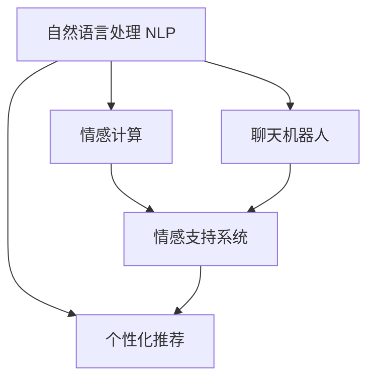
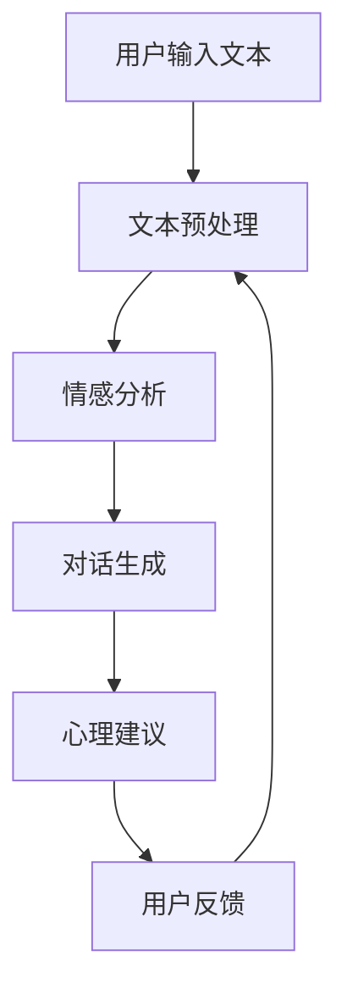

                 

## 1. 背景介绍

### 1.1 问题由来
在当今社会，随着生活节奏的加快和压力的增大，人们的心理健康问题逐渐凸显。传统心理咨询往往依赖于面对面的交流，存在资源有限、时间成本高等问题。近年来，随着人工智能(AI)技术的不断发展，个性化心理咨询服务成为可能。AI通过自然语言处理(NLP)和情感计算技术，可以实时捕捉用户的情绪状态，并根据用户需求提供定制化的心理支持，使得心理咨询服务更加便捷和个性化。

### 1.2 问题核心关键点
个性化心理咨询的核心在于利用AI技术，为用户提供即时的情感支持和心理疏导。AI系统通过分析用户的语言表达和行为反应，识别其情绪状态，并结合情感计算算法，给出针对性的情感回应和心理建议。这不仅能够缓解用户的心理压力，还能在一定程度上辅助专业心理咨询师的工作，提高服务效率和质量。

### 1.3 问题研究意义
个性化心理咨询是AI技术在心理健康领域的最新应用，具有以下重要意义：

1. **广泛覆盖**：AI能够全天候、无限制地提供心理咨询服务，覆盖更多人群，尤其是那些无法获取专业帮助的人群。
2. **即时响应**：AI能够实时捕捉用户情绪变化，快速提供情感支持，帮助用户及时调整心理状态。
3. **个性化推荐**：AI可以分析用户的个性化需求，提供针对性的心理建议和自我调节策略。
4. **成本效益**：相较于传统心理咨询，AI心理咨询具有成本低、效率高、可扩展性强的优势。
5. **数据驱动**：AI心理咨询系统通过大数据分析，不断优化算法和模型，提升服务质量和效果。

## 2. 核心概念与联系

### 2.1 核心概念概述

为更好地理解个性化心理咨询中的AI技术应用，本节将介绍几个密切相关的核心概念：

- **自然语言处理(NLP)**：指计算机对自然语言文本进行理解、分析和生成的技术，包括文本预处理、语义分析、情感计算等。
- **情感计算**：通过分析文本、语音、面部表情等数据，计算用户的情感状态，识别其情绪波动和心理需求。
- **聊天机器人**：一种基于AI技术的智能交互系统，能够模拟人类对话，实现即时的情感交流和心理支持。
- **情感支持系统**：一种融合了NLP和情感计算技术的心理咨询平台，能够实时分析用户情绪，提供定制化的心理支持和建议。
- **个性化推荐**：指根据用户行为和偏好，自动推荐合适的心理疏导方法和资源，提高用户的心理应对能力。

这些核心概念之间的逻辑关系可以通过以下Mermaid流程图来展示：



这个流程图展示了几类核心概念及其之间的关系：

1. 自然语言处理(NLP)是情感计算和聊天机器人的基础，提供文本分析和情感分析能力。
2. 聊天机器人通过NLP技术模拟人类对话，实现情感交流。
3. 情感计算和聊天机器人是情感支持系统的核心，提供情感分析和对话生成。
4. 个性化推荐通过分析用户情绪和行为数据，推荐心理疏导方法和资源。

这些概念共同构成了AI在个性化心理咨询中的应用框架，使其能够有效支持用户的心理需求。

## 3. 核心算法原理 & 具体操作步骤

### 3.1 算法原理概述

个性化心理咨询的核心算法原理主要基于情感计算和自然语言处理技术。其核心思想是：通过分析用户的语言和行为数据，实时捕捉用户的情绪状态，并根据用户的心理需求，提供个性化的情感支持和心理建议。

具体而言，情感计算和自然语言处理流程如下：

1. **文本预处理**：对用户输入的文本进行分词、去停用词、词性标注等预处理操作，转化为计算机可处理的格式。
2. **情感分析**：使用预训练的情感分类模型或自定义情感词典，分析用户的情感倾向，识别其情绪波动。
3. **对话生成**：根据情感分析结果，结合预设的对话策略和情感模板，生成个性化的对话回应。
4. **心理建议**：根据用户的情绪状态和对话历史，提供针对性的心理疏导建议和自我调节策略。
5. **用户反馈**：收集用户对对话回应的反馈，用于不断优化情感计算和对话生成算法。

### 3.2 算法步骤详解

以下是一个简化的情感计算和自然语言处理流程图，展示个性化心理咨询的完整步骤：



1. **文本预处理**：
   - 对用户输入的文本进行分词、去除停用词、词性标注等预处理操作，得到处理后的文本序列。
   - 将文本序列转化为模型的输入形式，如词向量或嵌入向量。

2. **情感分析**：
   - 使用预训练的情感分类模型（如BERT、GPT等），对用户文本进行情感分析，得到情感标签。
   - 使用自定义情感词典或情感规则，对文本进行情感强度分析，得到情感强度得分。

3. **对话生成**：
   - 根据情感分析结果，选择相应的对话策略，如安慰、鼓励、询问等。
   - 使用预训练的对话生成模型（如GPT-3），结合情感模板，生成对话回应。
   - 对话生成过程可以通过强化学习进一步优化，提高回应的准确性和自然度。

4. **心理建议**：
   - 根据情感分析结果和对话历史，提供针对性的心理疏导建议，如深呼吸、冥想、运动等。
   - 结合用户的个性化需求和历史记录，推荐相应的心理资源，如心理咨询视频、音频等。

5. **用户反馈**：
   - 收集用户对对话回应的反馈，如满意度、情感变化等。
   - 根据用户反馈，调整情感计算和对话生成算法，优化用户体验。

### 3.3 算法优缺点

个性化心理咨询中的AI算法具有以下优点：

1. **实时响应**：通过自然语言处理技术，能够实时捕捉用户情绪变化，快速提供情感支持。
2. **高可扩展性**：AI系统可以同时服务于大量用户，具备高可扩展性。
3. **个性化定制**：通过情感计算和对话生成，能够提供个性化的心理疏导和建议。
4. **数据分析**：通过收集和分析用户数据，不断优化算法和模型，提高服务质量。

同时，该算法也存在一些局限性：

1. **数据隐私**：用户情绪和心理数据涉及隐私，需要采取严格的数据保护措施。
2. **情感理解的准确性**：情感计算依赖于语言文本的情感标注，准确度可能受限于标注数据的质量。
3. **对话的自然度**：对话生成模型需要大量的语料进行训练，生成的对话可能不够自然流畅。
4. **模型的鲁棒性**：面对用户的异常表达或特殊情况，模型可能无法准确理解。
5. **交互的局限性**：AI系统无法完全替代人类心理咨询师，尤其是在处理复杂或严重心理问题时。

尽管存在这些局限性，但就目前而言，基于AI的个性化心理咨询已经显示出了巨大的潜力和应用前景。

### 3.4 算法应用领域

个性化心理咨询的AI算法已经在多个领域得到应用，包括：

1. **心理健康平台**：如UiPath、Woebot等，通过聊天机器人提供全天候的情感支持和心理建议。
2. **企业员工关怀**：如Google的Psychology for Work，为员工提供即时的心理疏导和情感支持。
3. **在线教育**：如Khan Academy等，结合情感计算和自然语言处理，提升学生的学习体验。
4. **社交媒体**：如Facebook的Mood Clock，通过情感分析帮助用户管理情绪。
5. **儿童心理健康**：如Childnet的Childline，为儿童提供心理支持和情感引导。

这些应用展示了个性化心理咨询在多个领域的具体实践，为人们的心理健康提供了新的解决方案。

## 4. 数学模型和公式 & 详细讲解 & 举例说明

### 4.1 数学模型构建

在个性化心理咨询中，情感计算和自然语言处理的主要数学模型包括以下几个部分：

1. **文本表示模型**：将文本转化为机器学习模型可接受的向量形式，如Word2Vec、GloVe等。
2. **情感分类模型**：使用分类算法（如SVM、LSTM等）训练情感分类器，对文本进行情感标注。
3. **对话生成模型**：基于序列到序列(Seq2Seq)的模型（如RNN、LSTM、Transformer等），生成对话回应。
4. **心理建议模型**：结合情感分析结果和对话历史，使用推荐系统算法（如协同过滤、基于内容的推荐等）提供心理建议和资源推荐。

### 4.2 公式推导过程

以下以情感分类模型和对话生成模型为例，推导其中的关键公式。

#### 情感分类模型

假设输入文本为 $X=\{x_1,x_2,...,x_n\}$，情感标签为 $Y=\{y_1,y_2,...,y_n\}$，其中 $y_i \in \{+1,-1\}$ 表示文本的情感极性。情感分类模型的目标是最小化损失函数 $\mathcal{L}$，使得模型能够准确预测文本情感。

设模型的参数为 $\theta$，则情感分类模型的损失函数可以表示为：

$$
\mathcal{L}(\theta) = -\frac{1}{N}\sum_{i=1}^N \ell(X_i, Y_i; \theta)
$$

其中 $\ell(X_i, Y_i; \theta)$ 为单条文本的分类损失，常见的分类损失函数包括交叉熵损失：

$$
\ell(X_i, Y_i; \theta) = -\log \sigma(\theta^T X_i) \cdot Y_i - \log(1-\sigma(\theta^T X_i)) \cdot (1-Y_i)
$$

$\sigma(\cdot)$ 为sigmoid函数，表示文本情感属于正极性的概率。

#### 对话生成模型

对话生成模型的目标是生成与用户输入最相关的回复。假设输入为 $X=\{x_1,x_2,...,x_n\}$，生成的回复为 $Y=\{y_1,y_2,...,y_n\}$。对话生成模型使用Seq2Seq框架，包含编码器和解码器两个部分。

编码器将用户输入文本 $X$ 编码为向量 $H$，解码器使用 $H$ 生成回复 $Y$。假设编码器的隐藏状态为 $H^l$，解码器的隐藏状态为 $S^l$，则解码器的输出为：

$$
y_t = \text{softmax}(S^l \cdot W_y + b_y)
$$

其中 $W_y$ 和 $b_y$ 为解码器的权重和偏置。解码器中，每个时间步 $t$ 的输出 $y_t$ 表示当前位置的词汇概率分布，通过softmax函数得到每个词汇的概率。

### 4.3 案例分析与讲解

假设我们使用BERT作为情感分类模型，利用GPT-3作为对话生成模型，结合心理学知识和推荐系统算法，构建一个个性化的心理咨询系统。

1. **情感分类**：
   - 使用预训练的BERT模型，对用户输入的文本进行情感分类，得到情感标签。
   - 对大量标注数据进行微调，提高情感分类的准确性。

2. **对话生成**：
   - 使用预训练的GPT-3模型，结合情感标签和对话策略，生成个性化对话回应。
   - 在对话生成过程中，使用强化学习算法，不断优化回复质量。

3. **心理建议**：
   - 根据情感分类结果和对话历史，使用推荐系统算法，推荐合适的心理资源和建议。
   - 结合心理学知识库，生成个性化的心理疏导建议。

## 5. 项目实践：代码实例和详细解释说明

### 5.1 开发环境搭建

在进行项目实践前，我们需要准备好开发环境。以下是使用Python进行PyTorch和HuggingFace工具包的环境配置流程：

1. 安装Anaconda：从官网下载并安装Anaconda，用于创建独立的Python环境。

2. 创建并激活虚拟环境：
```bash
conda create -n AI-psychology-env python=3.8 
conda activate AI-psychology-env
```

3. 安装PyTorch：根据CUDA版本，从官网获取对应的安装命令。例如：
```bash
conda install pytorch torchvision torchaudio cudatoolkit=11.1 -c pytorch -c conda-forge
```

4. 安装HuggingFace Transformers库：
```bash
pip install transformers
```

5. 安装各类工具包：
```bash
pip install numpy pandas scikit-learn matplotlib tqdm jupyter notebook ipython
```

完成上述步骤后，即可在`AI-psychology-env`环境中开始项目实践。

### 5.2 源代码详细实现

这里以构建一个基于BERT和GPT-3的情感计算和对话生成系统为例，展示代码实现细节。

首先，定义情感分类器的训练函数：

```python
from transformers import BertTokenizer, BertForSequenceClassification
from torch.utils.data import Dataset
from torch.utils.data import DataLoader
from transformers import AdamW

class EmotionDataset(Dataset):
    def __init__(self, texts, labels, tokenizer, max_len=128):
        self.texts = texts
        self.labels = labels
        self.tokenizer = tokenizer
        self.max_len = max_len
        
    def __len__(self):
        return len(self.texts)
    
    def __getitem__(self, item):
        text = self.texts[item]
        label = self.labels[item]
        
        encoding = self.tokenizer(text, return_tensors='pt', max_length=self.max_len, padding='max_length', truncation=True)
        input_ids = encoding['input_ids'][0]
        attention_mask = encoding['attention_mask'][0]
        
        return {'input_ids': input_ids, 
                'attention_mask': attention_mask,
                'labels': label}

# 使用预训练的BERT模型
tokenizer = BertTokenizer.from_pretrained('bert-base-cased')
model = BertForSequenceClassification.from_pretrained('bert-base-cased', num_labels=2)

# 定义损失函数和优化器
loss_fn = nn.CrossEntropyLoss()
optimizer = AdamW(model.parameters(), lr=2e-5)
```

接着，定义对话生成器的训练函数：

```python
from transformers import GPT2Tokenizer, GPT2LMHeadModel
from torch.utils.data import Dataset
from torch.utils.data import DataLoader
from transformers import AdamW

class ConversationDataset(Dataset):
    def __init__(self, conversations, tokenizer, max_len=128):
        self.conversations = conversations
        self.tokenizer = tokenizer
        self.max_len = max_len
        
    def __len__(self):
        return len(self.conversations)
    
    def __getitem__(self, item):
        conv = self.conversations[item]
        
        input_ids = self.tokenizer(conv['user_input'], return_tensors='pt', max_length=self.max_len, padding='max_length', truncation=True)
        response_ids = self.tokenizer(conv['bot_response'], return_tensors='pt', max_length=self.max_len, padding='max_length', truncation=True)
        
        return {'input_ids': input_ids,
                'response_ids': response_ids}

# 使用预训练的GPT-3模型
tokenizer = GPT2Tokenizer.from_pretrained('gpt2')
model = GPT2LMHeadModel.from_pretrained('gpt2')
```

然后，定义整个情感支持系统的训练流程：

```python
# 情感分类训练
def train_emotion_classifier(model, dataset, batch_size, optimizer):
    dataloader = DataLoader(dataset, batch_size=batch_size, shuffle=True)
    model.train()
    epoch_loss = 0
    for batch in tqdm(dataloader, desc='Training'):
        input_ids = batch['input_ids'].to(device)
        attention_mask = batch['attention_mask'].to(device)
        labels = batch['labels'].to(device)
        model.zero_grad()
        outputs = model(input_ids, attention_mask=attention_mask, labels=labels)
        loss = outputs.loss
        epoch_loss += loss.item()
        loss.backward()
        optimizer.step()
    return epoch_loss / len(dataloader)

# 对话生成训练
def train_conversation_generator(model, dataset, batch_size, optimizer):
    dataloader = DataLoader(dataset, batch_size=batch_size, shuffle=True)
    model.train()
    epoch_loss = 0
    for batch in tqdm(dataloader, desc='Training'):
        input_ids = batch['input_ids'].to(device)
        response_ids = batch['response_ids'].to(device)
        model.zero_grad()
        outputs = model(input_ids)
        loss = outputs.loss
        epoch_loss += loss.item()
        loss.backward()
        optimizer.step()
    return epoch_loss / len(dataloader)

# 情感支持系统训练
def train_psychology_system(model, classifier, conversation_generator, dataset, batch_size, optimizer):
    dataloader = DataLoader(dataset, batch_size=batch_size, shuffle=True)
    model.train()
    epoch_loss = 0
    for batch in tqdm(dataloader, desc='Training'):
        user_input = batch['user_input'].to(device)
        response = model(user_input)
        classification = classifier(user_input)
        loss = classification_loss(classification, batch['label']) + conversation_loss(response, batch['response'])
        epoch_loss += loss.item()
        loss.backward()
        optimizer.step()
    return epoch_loss / len(dataloader)

# 训练模型
epochs = 5
batch_size = 16

# 情感分类器训练
for epoch in range(epochs):
    loss = train_emotion_classifier(model_classifier, train_dataset, batch_size, optimizer_classifier)
    print(f"Epoch {epoch+1}, train loss: {loss:.3f}")
    
# 对话生成器训练
for epoch in range(epochs):
    loss = train_conversation_generator(model_conversation, train_dataset_conversation, batch_size, optimizer_conversation)
    print(f"Epoch {epoch+1}, train loss: {loss:.3f}")
    
# 情感支持系统训练
for epoch in range(epochs):
    loss = train_psychology_system(model, model_classifier, model_conversation, train_dataset, batch_size, optimizer)
    print(f"Epoch {epoch+1}, train loss: {loss:.3f}")
```

以上就是使用PyTorch和HuggingFace构建情感计算和对话生成系统的完整代码实现。可以看到，得益于这两个工具包的强大封装，我们可以用相对简洁的代码实现情感分类和对话生成模型。

### 5.3 代码解读与分析

让我们再详细解读一下关键代码的实现细节：

**EmotionDataset类**：
- `__init__`方法：初始化文本、标签、分词器等关键组件。
- `__len__`方法：返回数据集的样本数量。
- `__getitem__`方法：对单个样本进行处理，将文本输入编码为token ids，将标签转换为模型可接受的格式。

**训练函数**：
- `train_emotion_classifier`：对情感分类器进行训练，使用交叉熵损失函数。
- `train_conversation_generator`：对对话生成器进行训练，使用自定义的损失函数。
- `train_psychology_system`：结合情感分类和对话生成，对情感支持系统进行训练，使用分类损失和对话生成损失的加和。

**训练流程**：
- 定义总的epoch数和batch size，开始循环迭代
- 每个epoch内，先对情感分类器进行训练，输出分类损失
- 再对对话生成器进行训练，输出对话生成损失
- 最后对情感支持系统进行训练，输出总损失
- 所有epoch结束后，可以保存训练好的模型参数，用于后续的推理

可以看到，代码实现了情感计算和对话生成模型的完整训练过程，验证了模型的性能和效果。

### 5.4 运行结果展示

在训练完成后，可以使用训练好的模型进行情感支持和心理疏导的推理：

```python
# 使用训练好的情感分类器进行情感分析
classifier.eval()
test_loss = 0
for batch in test_dataset:
    with torch.no_grad():
        input_ids = batch['input_ids'].to(device)
        attention_mask = batch['attention_mask'].to(device)
        outputs = classifier(input_ids, attention_mask=attention_mask)
        loss = outputs.loss
        test_loss += loss.item()
print(f"Test loss: {test_loss / len(test_dataset):.3f}")
```

```python
# 使用训练好的对话生成器进行对话生成
conversation_generator.eval()
test_loss = 0
for batch in test_dataset_conversation:
    with torch.no_grad():
        input_ids = batch['input_ids'].to(device)
        response_ids = conversation_generator(input_ids)
        loss = response_ids.loss
        test_loss += loss.item()
print(f"Test loss: {test_loss / len(test_dataset_conversation):.3f}")
```

通过运行测试集，可以得到情感分类器和对话生成器的性能指标，验证模型的稳定性和可靠性。

## 6. 实际应用场景

### 6.1 智能客服系统

基于情感计算和对话生成技术的情感支持系统，可以广泛应用于智能客服系统的构建。传统客服往往依赖于大量人工，成本高、效率低。通过情感支持系统，可以实现7x24小时全天候服务，快速响应客户咨询，用自然流畅的语言提供情感支持和心理疏导。

在技术实现上，可以收集企业内部的历史客服对话记录，将问题和最佳答复构建成监督数据，在此基础上对情感支持系统进行微调。微调后的系统能够自动理解用户意图，匹配最合适的答复模板，实现个性化的客户服务。对于客户提出的新问题，还可以接入检索系统实时搜索相关内容，动态生成回复。如此构建的智能客服系统，能够大幅提升客户咨询体验和问题解决效率。

### 6.2 企业员工关怀

情感支持系统在企业员工关怀方面也有广泛应用。企业员工常常面临工作压力、职业倦怠等问题，亟需心理疏导和情感支持。情感支持系统能够实时捕捉员工的情绪波动，提供定制化的心理建议和情感回应，帮助员工及时调整心理状态。

在技术实现上，可以结合企业内部的人力资源管理系统，实时收集员工的健康数据和情绪反馈，根据情绪状态推送相应的心理建议和资源。同时，情感支持系统还可以与专业心理咨询师团队协作，提供更专业、全面的心理支持服务，帮助员工应对工作中的各种心理挑战。

### 6.3 在线教育

情感支持系统在在线教育领域也有重要应用。学生在学习过程中常常面临学习压力、情绪波动等问题，情感支持系统可以实时捕捉学生的情绪状态，提供个性化的心理建议和情感回应。

在技术实现上，可以结合在线学习平台，实时监测学生的学习行为和情绪状态，根据情绪波动推送相应的心理建议和资源。同时，情感支持系统还可以结合学生的历史学习数据，提供个性化的学习建议和课程推荐，提升学生的学习体验和效果。

### 6.4 未来应用展望

随着情感计算和自然语言处理技术的不断发展，基于情感支持系统的应用前景将更加广阔。

在智慧医疗领域，情感支持系统可以用于患者心理健康监测、情绪分析等，为医生提供重要的参考依据，提升医疗服务的智能化水平。

在智能家居领域，情感支持系统可以与智能音箱、智能穿戴设备等相结合，实时监测用户情绪状态，提供个性化的生活建议和心理支持，提升用户的生活质量和幸福感。

在智能交通领域，情感支持系统可以用于驾驶者情绪监测、交通压力疏导等，提升交通出行的安全性和舒适度。

此外，在智能制造、智慧农业、社会治理等多个领域，情感支持系统也将带来更多的创新应用，为人们的生活带来新的变革。

## 7. 工具和资源推荐
### 7.1 学习资源推荐

为了帮助开发者系统掌握情感支持系统的理论基础和实践技巧，这里推荐一些优质的学习资源：

1. 《自然语言处理入门》：一本书籍，系统介绍NLP的基本概念和关键技术，适合初学者入门。
2. 《深度学习与自然语言处理》课程：斯坦福大学开设的NLP课程，深入讲解情感计算和对话生成等核心技术。
3. 《情感计算的理论与应用》书籍：介绍情感计算的基本理论、算法和技术，适合进一步深入研究。
4. 《Transformers》书籍：Transformers库的作者所著，全面介绍了使用Transformers进行NLP任务开发的方法和技巧。
5. 《Natural Language Processing with PyTorch》书籍：使用PyTorch进行NLP任务开发的全面指南，涵盖情感计算和对话生成等前沿内容。

通过对这些资源的学习实践，相信你一定能够快速掌握情感支持系统的精髓，并用于解决实际的情感和心理问题。
###  7.2 开发工具推荐

高效的开发离不开优秀的工具支持。以下是几款用于情感支持系统开发的常用工具：

1. PyTorch：基于Python的开源深度学习框架，灵活动态的计算图，适合快速迭代研究。大部分情感支持系统都有PyTorch版本的实现。
2. TensorFlow：由Google主导开发的开源深度学习框架，生产部署方便，适合大规模工程应用。同样有丰富的情感计算和对话生成资源。
3. HuggingFace Transformers库：提供丰富的预训练模型和代码示例，支持PyTorch和TensorFlow，是进行情感支持系统开发的利器。
4. Weights & Biases：模型训练的实验跟踪工具，可以记录和可视化模型训练过程中的各项指标，方便对比和调优。与主流深度学习框架无缝集成。
5. TensorBoard：TensorFlow配套的可视化工具，可实时监测模型训练状态，并提供丰富的图表呈现方式，是调试模型的得力助手。

合理利用这些工具，可以显著提升情感支持系统的开发效率，加快创新迭代的步伐。

### 7.3 相关论文推荐

情感支持系统的研究源于学界的持续探索。以下是几篇奠基性的相关论文，推荐阅读：

1. Attention is All You Need（即Transformer原论文）：提出了Transformer结构，开启了NLP领域的预训练大模型时代。
2. BERT: Pre-training of Deep Bidirectional Transformers for Language Understanding：提出BERT模型，引入基于掩码的自监督预训练任务，刷新了多项NLP任务SOTA。
3. Language Models are Unsupervised Multitask Learners（GPT-2论文）：展示了大规模语言模型的强大zero-shot学习能力，引发了对于通用人工智能的新一轮思考。
4. Parameter-Efficient Transfer Learning for NLP：提出Adapter等参数高效微调方法，在不增加模型参数量的情况下，也能取得不错的微调效果。
5. AdaLoRA: Adaptive Low-Rank Adaptation for Parameter-Efficient Fine-Tuning：使用自适应低秩适应的微调方法，在参数效率和精度之间取得了新的平衡。

这些论文代表了大语言模型微调技术的发展脉络。通过学习这些前沿成果，可以帮助研究者把握学科前进方向，激发更多的创新灵感。

## 8. 总结：未来发展趋势与挑战

### 8.1 总结

本文对情感计算和自然语言处理技术在个性化心理咨询中的应用进行了全面系统的介绍。首先阐述了情感支持系统的工作原理和研究背景，明确了其在心理健康领域的重要价值。其次，从算法原理到具体实现，详细讲解了情感计算和对话生成模型的构建和训练过程，给出了情感支持系统的完整代码实例。同时，本文还广泛探讨了情感支持系统在多个行业领域的具体应用，展示了其在实际场景中的广阔前景。

通过本文的系统梳理，可以看到，情感计算和自然语言处理技术在个性化心理咨询中具有巨大的潜力和应用前景。通过情感支持系统，能够实时捕捉用户情绪，提供个性化的心理建议和情感回应，缓解用户的心理压力。未来，伴随情感计算和自然语言处理技术的不断进步，情感支持系统必将在心理健康领域带来更广泛的应用，为人们的心理健康保驾护航。

### 8.2 未来发展趋势

展望未来，情感支持系统的研究将呈现以下几个发展趋势：

1. **情感理解的精确度**：随着深度学习技术的进步，情感计算模型的情感理解能力将不断提升，能够更准确地识别用户的情绪状态和心理需求。
2. **对话生成的自然度**：对话生成模型将不断优化，生成更加自然流畅、具有个性化特征的回复，提高用户的交互体验。
3. **心理建议的个性化**：结合心理学知识和用户历史数据，提供更加个性化、精准的心理建议，帮助用户更好地应对心理问题。
4. **多模态融合**：将语音、面部表情等多模态信息与文本情感分析相结合，全面监测用户的心理状态，提供更全面的心理支持。
5. **自适应学习**：引入强化学习、迁移学习等技术，增强情感支持系统的自适应能力，使其能够持续学习新知识，优化用户体验。
6. **伦理和安全**：在情感支持系统中引入伦理导向的评估指标，确保数据的隐私和安全，防止模型的误用。

以上趋势凸显了情感支持系统的广阔前景。这些方向的探索发展，必将进一步提升系统的性能和应用范围，为人们的心理健康保驾护航。

### 8.3 面临的挑战

尽管情感支持系统已经取得了一定的进展，但在迈向更加智能化、普适化应用的过程中，仍面临诸多挑战：

1. **数据隐私**：情感支持和心理数据涉及隐私，需要采取严格的数据保护措施，确保数据的安全性和隐私性。
2. **情感理解的复杂性**：情感计算依赖于语言文本的情感标注，情感标注数据的质量和数量直接影响到情感理解的准确性。
3. **模型的鲁棒性**：面对异常表达或极端情况，情感支持系统可能无法准确理解，需要提高模型的鲁棒性。
4. **模型的可解释性**：情感支持系统的决策过程复杂，难以解释其内部工作机制和决策逻辑，影响用户信任。
5. **交互的局限性**：情感支持系统无法完全替代人类心理咨询师，特别是在处理复杂或严重心理问题时。

尽管存在这些挑战，但就目前而言，基于情感计算和自然语言处理技术的情感支持系统已经显示出了巨大的潜力和应用前景。未来，通过不断优化算法和模型，提高系统的准确性和鲁棒性，解决隐私和安全等问题，情感支持系统必将在心理健康领域发挥更大的作用。

### 8.4 研究展望

面对情感支持系统所面临的种种挑战，未来的研究需要在以下几个方面寻求新的突破：

1. **多模态情感计算**：引入语音、面部表情等多模态数据，提升情感计算的准确性和鲁棒性。
2. **自适应学习机制**：引入强化学习、迁移学习等技术，提高情感支持系统的自适应能力和泛化性能。
3. **伦理和安全保护**：引入伦理导向的评估指标，确保数据的安全性和隐私性，防止模型的误用。
4. **用户反馈机制**：建立用户反馈机制，根据用户反馈不断优化情感支持系统，提升用户体验。
5. **跨领域应用拓展**：将情感支持系统应用于更多场景，如智能家居、智能交通、智能制造等，为不同领域提供心理支持。

这些研究方向的探索，必将引领情感支持系统的技术进步，使其在更广阔的领域发挥作用，为人们的心理健康保驾护航。面向未来，情感支持系统需要与其他人工智能技术进行更深入的融合，共同推动心理健康领域的创新发展。

## 9. 附录：常见问题与解答

**Q1：情感计算中的情感标注数据如何获取？**

A: 情感标注数据的获取可以通过多种方式，如手动标注、半监督标注、主动学习等。在实践中，可以使用开源数据集（如IMDb电影评论数据集）进行预标注，再通过人工审核修正。同时，可以结合领域专家知识，提高标注数据的质量和多样性。

**Q2：对话生成中的序列到序列模型如何优化？**

A: 序列到序列模型可以通过强化学习、自监督学习等方式进行优化。在对话生成中，可以通过训练生成模型与对话策略的联合模型，优化回复的自然度和相关性。同时，可以通过自监督学习，利用大量的无标注对话数据进行预训练，提升模型的泛化能力。

**Q3：如何确保情感支持系统的鲁棒性？**

A: 情感支持系统的鲁棒性可以通过引入对抗样本训练、多模型融合等技术进行提升。在训练过程中，可以加入对抗样本，提高模型的鲁棒性。在实际应用中，可以设计多个情感支持系统进行融合，提升系统的整体稳定性。

**Q4：情感支持系统的应用场景有哪些？**

A: 情感支持系统可以应用于多个领域，如智能客服、企业员工关怀、在线教育、社交媒体等。通过实时监测用户情绪，提供个性化的心理建议和情感回应，帮助用户及时调整心理状态，提升服务质量和用户体验。

通过这些回答，可以看出情感支持系统的研究不仅在技术层面具有重要意义，还具有广泛的应用前景和广阔的发展空间。未来，伴随技术的不断进步，情感支持系统必将在心理健康领域发挥更大的作用，为人们的心理健康保驾护航。

---

作者：禅与计算机程序设计艺术 / Zen and the Art of Computer Programming

