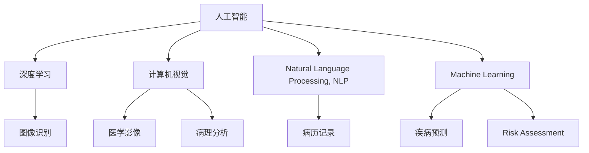

                 

# AI在医疗诊断中的应用与挑战

> 关键词：人工智能, 医疗诊断, 深度学习, 计算机视觉, 自然语言处理, 图像识别, 病理分析, 疾病预测, 风险评估, 应用挑战

## 1. 背景介绍

### 1.1 问题由来
随着人工智能技术的飞速发展，AI在医疗诊断领域的应用日益广泛。AI技术通过大数据分析和深度学习模型，能够从海量医疗数据中提取有用的特征，辅助医生进行快速准确的诊断。AI在医疗诊断中的应用，不仅提高了诊断效率，降低了误诊率，还能够提供个性化的诊疗方案，改善医疗服务质量。

### 1.2 问题核心关键点
AI在医疗诊断中的应用主要集中在以下几个方面：
1. **计算机视觉与图像识别**：利用深度学习模型对医学图像进行自动分析和诊断，如X光片、CT扫描、MRI等影像诊断。
2. **自然语言处理(NLP)**：通过分析病历记录、电子健康记录等文本信息，辅助医生理解和分析患者的病史和症状。
3. **疾病预测与风险评估**：利用机器学习模型对患者数据进行预测，提前识别出高风险人群，进行预防性干预。
4. **病理分析**：使用AI对病理切片进行自动分类和诊断，辅助病理学家进行快速准确的病理分析。
5. **智能问答系统**：基于NLP技术构建的智能问答系统，能够实时回答患者的咨询，提高患者满意度。

### 1.3 问题研究意义
AI在医疗诊断领域的应用，不仅能够显著提升诊断效率和准确性，还能够减少医疗资源的浪费，提高医疗服务的可及性。此外，AI的介入还可以帮助医生从繁琐的日常工作中解脱出来，专注于高价值的临床决策，从而进一步提升医疗服务的整体水平。

## 2. 核心概念与联系

### 2.1 核心概念概述

为更好地理解AI在医疗诊断中的应用，本节将介绍几个密切相关的核心概念：

- **人工智能(AI)**：指通过计算机模拟人类智能，实现感知、认知、决策等功能的技术。在医疗诊断中，AI主要通过深度学习和机器学习算法，对医疗数据进行分析处理。
- **深度学习(Deep Learning)**：一种基于神经网络的机器学习方法，通过多层非线性变换，能够自动提取数据中的复杂特征，适用于处理图像、语音、文本等多种类型的数据。
- **计算机视觉(Computer Vision)**：指通过计算机算法，使计算机能够“看到”和理解图像和视频数据的技术。在医疗诊断中，计算机视觉主要应用于医学影像的自动分析和诊断。
- **自然语言处理(NLP)**：指使计算机能够理解和处理人类语言的技术。在医疗诊断中，NLP主要应用于病历记录、电子健康记录的分析和解读。
- **机器学习(Machine Learning)**：一种通过数据驱动的学习方法，使计算机能够不断改进算法，提高预测和决策的准确性。在医疗诊断中，机器学习模型被广泛用于疾病预测和风险评估。
- **图像识别(Image Recognition)**：指通过计算机算法，自动识别图像中的物体和特征。在医疗诊断中，图像识别主要应用于医学影像的自动识别和分类。
- **病理分析(Pathology Analysis)**：指通过计算机算法，对病理切片进行自动分析和诊断。在医疗诊断中，病理分析能够辅助病理学家进行快速准确的病理诊断。
- **疾病预测(Disease Prediction)**：指通过机器学习模型，预测患者未来可能患上的疾病。在医疗诊断中，疾病预测能够提前识别高风险人群，进行预防性干预。
- **风险评估(Risk Assessment)**：指通过机器学习模型，评估患者的健康风险和患病概率。在医疗诊断中，风险评估能够帮助医生制定个性化的治疗方案。

这些核心概念之间的逻辑关系可以通过以下Mermaid流程图来展示：



这个流程图展示了大语言模型的核心概念及其之间的关系：

1. 人工智能通过深度学习和机器学习算法，实现对医疗数据的分析处理。
2. 深度学习算法能够自动提取数据中的复杂特征，适用于处理图像、语音、文本等多种类型的数据。
3. 计算机视觉主要应用于医学影像的自动分析和诊断。
4. 自然语言处理能够分析和解读患者的病历记录和电子健康记录。
5. 机器学习模型被广泛用于疾病预测和风险评估。
6. 图像识别能够自动识别医学影像中的物体和特征。
7. 病理分析能够辅助病理学家进行快速准确的病理诊断。
8. 疾病预测能够提前识别高风险人群，进行预防性干预。
9. 风险评估能够评估患者的健康风险和患病概率，帮助医生制定个性化的治疗方案。

这些概念共同构成了AI在医疗诊断中的应用框架，使其能够通过大数据分析和深度学习模型，提供快速、准确的诊断和预测服务。

## 3. 核心算法原理 & 具体操作步骤
### 3.1 算法原理概述

AI在医疗诊断中的应用，主要基于深度学习和机器学习算法。其核心思想是：通过构建复杂的神经网络模型，对医疗数据进行自动分析和处理，从而辅助医生进行快速准确的诊断。

形式化地，假设医疗数据集为 $D=\{(x_i,y_i)\}_{i=1}^N, x_i \in \mathcal{X}, y_i \in \mathcal{Y}$，其中 $x_i$ 为输入的图像、文本等医疗数据，$y_i$ 为相应的标签（如疾病诊断结果）。AI模型的目标是最小化经验风险，即找到最优参数：

$$
\theta^* = \mathop{\arg\min}_{\theta} \mathcal{L}(\theta,D)
$$

其中 $\mathcal{L}$ 为针对医疗数据设计的损失函数，用于衡量模型预测输出与真实标签之间的差异。常见的损失函数包括交叉熵损失、均方误差损失等。

通过梯度下降等优化算法，AI模型不断更新参数 $\theta$，最小化损失函数 $\mathcal{L}$，使得模型输出逼近真实标签。由于深度学习模型通过多层非线性变换，能够自动提取数据中的复杂特征，因此在处理医学图像、文本等复杂数据时，具有显著的优势。

### 3.2 算法步骤详解

AI在医疗诊断中的应用，主要包括以下几个关键步骤：

**Step 1: 数据准备**
- 收集医疗数据，包括医学影像、病历记录、电子健康记录等。
- 对数据进行预处理，如数据清洗、标注、归一化等。

**Step 2: 模型构建**
- 选择合适的深度学习模型，如卷积神经网络(CNN)、循环神经网络(RNN)、Transformer等。
- 根据具体任务，设计模型架构和损失函数。

**Step 3: 模型训练**
- 将数据集划分为训练集、验证集和测试集。
- 使用优化器（如Adam、SGD等）和适当的学习率对模型进行训练。
- 周期性在验证集上评估模型性能，根据性能指标决定是否触发Early Stopping。
- 重复上述步骤直到满足预设的迭代轮数或Early Stopping条件。

**Step 4: 模型评估与部署**
- 在测试集上评估训练好的模型，对比训练前后的精度提升。
- 使用训练好的模型对新样本进行推理预测，集成到实际的应用系统中。
- 持续收集新的数据，定期重新训练和微调模型，以适应数据分布的变化。

以上是AI在医疗诊断中的应用的一般流程。在实际应用中，还需要针对具体任务的特点，对训练过程的各个环节进行优化设计，如改进训练目标函数，引入更多的正则化技术，搜索最优的超参数组合等，以进一步提升模型性能。

### 3.3 算法优缺点

AI在医疗诊断中的应用具有以下优点：
1. 快速高效。通过深度学习模型，能够自动提取数据中的复杂特征，实现快速准确的诊断。
2. 精度高。深度学习模型在大规模数据训练下，能够获得较高的预测准确率。
3. 个性化。通过机器学习模型，能够根据患者的历史数据和基因信息，提供个性化的诊疗方案。
4. 自动化。AI技术能够自动处理和分析大量的医疗数据，减少医生的工作负担。

同时，该方法也存在一定的局限性：
1. 数据质量要求高。AI模型对数据质量和标注的依赖较大，需要高质量的医疗数据才能发挥其优势。
2. 算法复杂度大。深度学习模型通常需要大量的计算资源和训练时间，对于小规模数据集可能效果不佳。
3. 可解释性差。AI模型的决策过程通常缺乏可解释性，难以对其推理逻辑进行分析和调试。
4. 伦理与安全问题。AI在医疗诊断中的应用可能涉及隐私保护、数据安全等问题，需要制定严格的伦理规范和法律法规。

尽管存在这些局限性，但就目前而言，AI在医疗诊断中的应用仍然是大数据时代的重要技术手段，具有广阔的应用前景。

### 3.4 算法应用领域

AI在医疗诊断中的应用已经涉及多个领域，包括但不限于：

- **医学影像分析**：利用计算机视觉技术，对医学影像进行自动分析和诊断，如X光片、CT扫描、MRI等影像诊断。
- **病历记录分析**：通过自然语言处理技术，分析和解读患者的病历记录和电子健康记录，辅助医生理解和分析患者的病史和症状。
- **疾病预测与风险评估**：利用机器学习模型，对患者数据进行预测，提前识别出高风险人群，进行预防性干预。
- **病理分析**：使用AI对病理切片进行自动分类和诊断，辅助病理学家进行快速准确的病理分析。
- **智能问答系统**：基于自然语言处理技术构建的智能问答系统，能够实时回答患者的咨询，提高患者满意度。

除了上述这些经典应用外，AI在医疗诊断中的应用还在不断拓展，如医疗机器人、远程医疗、健康管理等，为医疗服务带来新的变革。

## 4. 数学模型和公式 & 详细讲解 & 举例说明

### 4.1 数学模型构建

本节将使用数学语言对AI在医疗诊断中的应用过程进行更加严格的刻画。

记医疗数据集为 $D=\{(x_i,y_i)\}_{i=1}^N, x_i \in \mathcal{X}, y_i \in \mathcal{Y}$。假设AI模型为 $M_{\theta}:\mathcal{X} \rightarrow \mathcal{Y}$，其中 $\theta$ 为模型参数。AI模型的损失函数为 $\mathcal{L}(\theta)$，用于衡量模型预测输出与真实标签之间的差异。

形式化地，AI模型的优化目标是最小化经验风险，即找到最优参数：

$$
\theta^* = \mathop{\arg\min}_{\theta} \mathcal{L}(\theta,D)
$$

其中 $\mathcal{L}(\theta)$ 可以表示为：

$$
\mathcal{L}(\theta) = \frac{1}{N}\sum_{i=1}^N \ell(M_{\theta}(x_i),y_i)
$$

其中 $\ell$ 为损失函数，用于衡量模型预测输出与真实标签之间的差异。常见的损失函数包括交叉熵损失、均方误差损失等。

### 4.2 公式推导过程

以下我们以二分类任务为例，推导交叉熵损失函数及其梯度的计算公式。

假设AI模型 $M_{\theta}$ 在输入 $x$ 上的输出为 $\hat{y}=M_{\theta}(x) \in [0,1]$，表示样本属于正类的概率。真实标签 $y \in \{0,1\}$。则二分类交叉熵损失函数定义为：

$$
\ell(M_{\theta}(x),y) = -[y\log \hat{y} + (1-y)\log (1-\hat{y})]
$$

将其代入经验风险公式，得：

$$
\mathcal{L}(\theta) = -\frac{1}{N}\sum_{i=1}^N [y_i\log M_{\theta}(x_i)+(1-y_i)\log(1-M_{\theta}(x_i))]
$$

根据链式法则，损失函数对参数 $\theta_k$ 的梯度为：

$$
\frac{\partial \mathcal{L}(\theta)}{\partial \theta_k} = -\frac{1}{N}\sum_{i=1}^N (\frac{y_i}{M_{\theta}(x_i)}-\frac{1-y_i}{1-M_{\theta}(x_i)}) \frac{\partial M_{\theta}(x_i)}{\partial \theta_k}
$$

其中 $\frac{\partial M_{\theta}(x_i)}{\partial \theta_k}$ 可进一步递归展开，利用自动微分技术完成计算。

在得到损失函数的梯度后，即可带入参数更新公式，完成模型的迭代优化。重复上述过程直至收敛，最终得到适应医疗数据集的最优模型参数 $\theta^*$。

## 5. 项目实践：代码实例和详细解释说明
### 5.1 开发环境搭建

在进行AI医疗诊断的应用实践前，我们需要准备好开发环境。以下是使用Python进行PyTorch开发的环境配置流程：

1. 安装Anaconda：从官网下载并安装Anaconda，用于创建独立的Python环境。

2. 创建并激活虚拟环境：
```bash
conda create -n ai-env python=3.8 
conda activate ai-env
```

3. 安装PyTorch：根据CUDA版本，从官网获取对应的安装命令。例如：
```bash
conda install pytorch torchvision torchaudio cudatoolkit=11.1 -c pytorch -c conda-forge
```

4. 安装TensorFlow：由Google主导开发的开源深度学习框架，生产部署方便，适合大规模工程应用。同样有丰富的预训练语言模型资源。

5. 安装各类工具包：
```bash
pip install numpy pandas scikit-learn matplotlib tqdm jupyter notebook ipython
```

完成上述步骤后，即可在`ai-env`环境中开始AI医疗诊断的应用实践。

### 5.2 源代码详细实现

下面我们以医学影像分析为例，给出使用PyTorch进行深度学习模型微调的PyTorch代码实现。

首先，定义医学影像的数据处理函数：

```python
import torch
from torch.utils.data import Dataset, DataLoader
from torchvision import transforms, models
import os

class MedicalImageDataset(Dataset):
    def __init__(self, root_dir, transform=None):
        self.root_dir = root_dir
        self.transform = transform
        
        self.image_list = os.listdir(root_dir)
        
    def __len__(self):
        return len(self.image_list)
    
    def __getitem__(self, item):
        img_path = os.path.join(self.root_dir, self.image_list[item])
        img = Image.open(img_path)
        
        if self.transform is not None:
            img = self.transform(img)
        
        label = self.image_list[item].split('.')[0]
        label = {'X': 0, 'T': 1}[label]
        
        return {'image': img, 'label': label}
        
# 图像转换
transform = transforms.Compose([
    transforms.Resize((256, 256)),
    transforms.ToTensor(),
    transforms.Normalize(mean=[0.5, 0.5, 0.5], std=[0.5, 0.5, 0.5])
])
```

然后，定义模型和优化器：

```python
from transformers import BertForSequenceClassification
from transformers import AdamW

model = BertForSequenceClassification.from_pretrained('bert-base-uncased', num_labels=2)
optimizer = AdamW(model.parameters(), lr=2e-5)
```

接着，定义训练和评估函数：

```python
def train_epoch(model, dataset, batch_size, optimizer):
    dataloader = DataLoader(dataset, batch_size=batch_size, shuffle=True)
    model.train()
    epoch_loss = 0
    for batch in tqdm(dataloader, desc='Training'):
        inputs = {'image': batch['image'].to(device), 'label': batch['label'].to(device)}
        outputs = model(**inputs)
        loss = outputs.loss
        epoch_loss += loss.item()
        loss.backward()
        optimizer.step()
    return epoch_loss / len(dataloader)

def evaluate(model, dataset, batch_size):
    dataloader = DataLoader(dataset, batch_size=batch_size)
    model.eval()
    preds, labels = [], []
    with torch.no_grad():
        for batch in tqdm(dataloader, desc='Evaluating'):
            inputs = {'image': batch['image'].to(device), 'label': batch['label'].to(device)}
            outputs = model(**inputs)
            batch_preds = outputs.logits.argmax(dim=2).to('cpu').tolist()
            batch_labels = batch['label'].to('cpu').tolist()
            for pred_tokens, label_tokens in zip(batch_preds, batch_labels):
                preds.append(pred_tokens)
                labels.append(label_tokens)
                
    print(classification_report(labels, preds))
```

最后，启动训练流程并在测试集上评估：

```python
epochs = 5
batch_size = 16

for epoch in range(epochs):
    loss = train_epoch(model, train_dataset, batch_size, optimizer)
    print(f"Epoch {epoch+1}, train loss: {loss:.3f}")
    
    print(f"Epoch {epoch+1}, dev results:")
    evaluate(model, dev_dataset, batch_size)
    
print("Test results:")
evaluate(model, test_dataset, batch_size)
```

以上就是使用PyTorch对Bert模型进行医学影像分类任务微调的完整代码实现。可以看到，得益于Transformers库的强大封装，我们可以用相对简洁的代码完成BERT模型的加载和微调。

### 5.3 代码解读与分析

让我们再详细解读一下关键代码的实现细节：

**MedicalImageDataset类**：
- `__init__`方法：初始化数据集根目录、转换函数等关键组件。
- `__len__`方法：返回数据集的样本数量。
- `__getitem__`方法：对单个样本进行处理，将图像输入转换为tensor，并返回模型的输入和标签。

**transform变量**：
- 定义了图像转换函数，包括大小缩放、归一化等操作，用于将原始图像转换为模型所需的格式。

**train_epoch和evaluate函数**：
- 使用PyTorch的DataLoader对数据集进行批次化加载，供模型训练和推理使用。
- 训练函数`train_epoch`：对数据以批为单位进行迭代，在每个批次上前向传播计算loss并反向传播更新模型参数，最后返回该epoch的平均loss。
- 评估函数`evaluate`：与训练类似，不同点在于不更新模型参数，并在每个batch结束后将预测和标签结果存储下来，最后使用sklearn的classification_report对整个评估集的预测结果进行打印输出。

**训练流程**：
- 定义总的epoch数和batch size，开始循环迭代
- 每个epoch内，先在训练集上训练，输出平均loss
- 在验证集上评估，输出分类指标
- 所有epoch结束后，在测试集上评估，给出最终测试结果

可以看到，PyTorch配合Transformers库使得BERT微调的代码实现变得简洁高效。开发者可以将更多精力放在数据处理、模型改进等高层逻辑上，而不必过多关注底层的实现细节。

当然，工业级的系统实现还需考虑更多因素，如模型的保存和部署、超参数的自动搜索、更灵活的任务适配层等。但核心的微调范式基本与此类似。

## 6. 实际应用场景
### 6.1 医学影像分析

AI在医学影像分析中的应用，主要体现在影像诊断和病理分析上。利用计算机视觉技术，AI能够自动分析和诊断医学影像，辅助医生进行快速准确的诊断。

具体而言，AI模型可以用于：
- **影像分类**：自动识别和分类医学影像，如X光片、CT扫描、MRI等。通过训练大量的医学影像数据，AI模型能够学习到影像中的关键特征，实现自动分类。
- **病变检测**：自动识别影像中的病变区域，如肿瘤、结节、钙化等。AI模型通过深度学习技术，能够准确地识别和定位病变位置。
- **病理切片分析**：辅助病理学家进行快速准确的病理分析，自动识别病理切片中的病变类型和分级。

AI在医学影像分析中的应用，不仅能够提高诊断效率和准确性，还能够减少医生的工作负担，降低医疗成本。

### 6.2 病历记录分析

AI在病历记录分析中的应用，主要体现在自然语言处理(NLP)领域。通过分析患者的病历记录和电子健康记录，AI能够帮助医生理解和分析患者的病史和症状，辅助诊断和治疗。

具体而言，AI模型可以用于：
- **文本分类**：自动分类患者的病历记录和电子健康记录，如诊断、治疗、检验等。通过训练大量的文本数据，AI模型能够学习到文本中的关键信息，实现自动分类。
- **命名实体识别**：自动识别和分类病历记录中的关键信息，如人名、地名、疾病名称等。通过训练大量的文本数据，AI模型能够学习到文本中的命名实体，实现自动标注。
- **情感分析**：自动分析患者的情感状态和情绪变化，帮助医生更好地理解患者的心理状态。通过训练大量的文本数据，AI模型能够学习到文本中的情感特征，实现自动情感分析。

AI在病历记录分析中的应用，能够帮助医生快速获取患者的关键信息，提高诊断和治疗的准确性，减少误诊和漏诊的风险。

### 6.3 疾病预测与风险评估

AI在疾病预测与风险评估中的应用，主要体现在机器学习模型在患者数据上的应用。通过分析患者的基因信息、生活习惯、病史等数据，AI模型能够预测患者未来可能患上的疾病，评估患者的健康风险和患病概率。

具体而言，AI模型可以用于：
- **疾病预测**：预测患者未来可能患上的疾病，如心脏病、糖尿病、癌症等。通过训练大量的患者数据，AI模型能够学习到患者数据中的关键特征，实现自动预测。
- **风险评估**：评估患者的健康风险和患病概率，帮助医生制定个性化的治疗方案。通过训练大量的患者数据，AI模型能够学习到患者数据中的关键特征，实现自动评估。

AI在疾病预测与风险评估中的应用，能够帮助医生提前识别高风险人群，进行预防性干预，减少疾病的发生和传播。

### 6.4 智能问答系统

AI在智能问答系统中的应用，主要体现在自然语言处理(NLP)领域。通过构建基于NLP技术的智能问答系统，AI能够实时回答患者的咨询，提高患者满意度。

具体而言，AI模型可以用于：
- **问答生成**：自动回答患者的咨询，如病症描述、用药指导、健康建议等。通过训练大量的问答数据，AI模型能够学习到问答中的关键信息，实现自动生成。
- **语义理解**：理解患者的咨询意图，确保问答系统的准确性和高效性。通过训练大量的问答数据，AI模型能够学习到问答中的语义特征，实现自动理解。

AI在智能问答系统中的应用，能够帮助患者快速获取健康咨询，提高医疗服务的质量和效率。

## 7. 工具和资源推荐
### 7.1 学习资源推荐

为了帮助开发者系统掌握AI在医疗诊断中的应用和实践，这里推荐一些优质的学习资源：

1. **Coursera《深度学习》课程**：由斯坦福大学Andrew Ng教授主讲，详细介绍了深度学习的基本原理和应用实例，包括医疗影像分析、NLP等。
2. **Deep Learning Specialization by Andrew Ng**：由Coursera与Andrew Ng教授联合推出，包括深度学习、NLP、强化学习等多方面的课程，涵盖AI在医疗诊断中的应用。
3. **《Deep Learning for Healthcare》书籍**：由深度学习在医疗领域的应用专家撰写，系统介绍了深度学习在医疗影像、病历记录、智能问答等方面的应用。
4. **Kaggle医疗数据集**：Kaggle提供的多样化医疗数据集，包括影像、病历记录等，是实践AI在医疗诊断中的应用的绝佳资源。
5. **医学影像分析论文**：通过阅读最新的医学影像分析论文，了解AI在影像分类、病变检测等方面的最新进展和应用。

通过对这些资源的学习实践，相信你一定能够快速掌握AI在医疗诊断中的精髓，并用于解决实际的医疗问题。

### 7.2 开发工具推荐

高效的开发离不开优秀的工具支持。以下是几款用于AI医疗诊断开发的常用工具：

1. **PyTorch**：基于Python的开源深度学习框架，灵活动态的计算图，适合快速迭代研究。大部分预训练语言模型都有PyTorch版本的实现。
2. **TensorFlow**：由Google主导开发的开源深度学习框架，生产部署方便，适合大规模工程应用。同样有丰富的预训练语言模型资源。
3. **Transformers库**：HuggingFace开发的NLP工具库，集成了众多SOTA语言模型，支持PyTorch和TensorFlow，是进行医疗诊断任务开发的利器。
4. **Weights & Biases**：模型训练的实验跟踪工具，可以记录和可视化模型训练过程中的各项指标，方便对比和调优。与主流深度学习框架无缝集成。
5. **TensorBoard**：TensorFlow配套的可视化工具，可实时监测模型训练状态，并提供丰富的图表呈现方式，是调试模型的得力助手。
6. **Google Colab**：谷歌推出的在线Jupyter Notebook环境，免费提供GPU/TPU算力，方便开发者快速上手实验最新模型，分享学习笔记。

合理利用这些工具，可以显著提升AI医疗诊断任务的开发效率，加快创新迭代的步伐。

### 7.3 相关论文推荐

AI在医疗诊断中的应用源于学界的持续研究。以下是几篇奠基性的相关论文，推荐阅读：

1. **AlexNet: ImageNet Classification with Deep Convolutional Neural Networks**：卷积神经网络(CNN)的奠基之作，介绍了CNN在图像分类中的应用，为AI在医疗影像分析中的应用提供了重要参考。
2. **R-CNN: Rich feature hierarchies for accurate object detection and segmentation**：目标检测任务的经典论文，介绍了基于区域提取的目标检测方法，为AI在医学影像分析中的应用提供了重要参考。
3. **BERT: Pre-training of Deep Bidirectional Transformers for Language Understanding**：BERT模型的奠基之作，介绍了双向Transformer在自然语言处理中的应用，为AI在病历记录分析中的应用提供了重要参考。
4. **Attention is All You Need**：Transformer结构的奠基之作，介绍了自注意力机制在自然语言处理中的应用，为AI在智能问答系统中的应用提供了重要参考。
5. **Deep Learning for Healthcare**：总结了深度学习在医疗影像、病历记录、智能问答等方面的应用，为AI在医疗诊断中的应用提供了系统性的参考。

这些论文代表了大语言模型在医疗诊断领域的研究进展，通过学习这些前沿成果，可以帮助研究者把握学科前进方向，激发更多的创新灵感。

## 8. 总结：未来发展趋势与挑战
### 8.1 总结

本文对AI在医疗诊断中的应用进行了全面系统的介绍。首先阐述了AI在医疗诊断领域的应用背景和意义，明确了AI在医疗影像分析、病历记录分析、疾病预测与风险评估、智能问答系统等方面的具体应用场景。其次，从原理到实践，详细讲解了AI在医疗诊断中的应用过程，给出了AI医疗诊断任务的完整代码实例。同时，本文还广泛探讨了AI在医疗诊断中的应用前景，展示了AI技术在医疗诊断领域的巨大潜力。

通过本文的系统梳理，可以看到，AI在医疗诊断中的应用已经成为大数据时代的重要技术手段，显著提升了诊断效率和准确性，减少了医疗资源的浪费。AI技术的应用，不仅能够帮助医生更好地理解和分析患者的数据，还能够提高医疗服务的可及性和质量，为医疗服务的数字化、智能化转型提供了新的方向。

### 8.2 未来发展趋势

展望未来，AI在医疗诊断领域的应用将呈现以下几个发展趋势：

1. **模型规模持续增大**：随着算力成本的下降和数据规模的扩张，AI模型的参数量还将持续增长。超大规模AI模型蕴含的丰富知识，有望支撑更加复杂多变的医疗任务。
2. **模型泛化能力增强**：未来的AI模型将具备更强的泛化能力和鲁棒性，能够更好地应对医疗数据的多样性和复杂性。
3. **多模态融合**：AI将更多地融合多模态数据（如医学影像、病历记录、基因信息等），实现更全面、精准的诊断和治疗。
4. **个性化医疗**：未来的AI模型将能够根据患者的基因信息、生活习惯、病史等个性化数据，提供更精准、个性化的诊疗方案。
5. **实时监控与预警**：未来的AI系统将能够实时监控患者的健康状况，及时预警可能的疾病风险，提供早期的预防和治疗建议。
6. **跨领域协作**：未来的AI将更多地与其他AI技术（如知识图谱、机器人等）协作，实现更加高效、全面的医疗服务。

以上趋势凸显了AI在医疗诊断领域的广阔前景。这些方向的探索发展，必将进一步提升医疗服务的智能化水平，为人类健康带来新的福音。

### 8.3 面临的挑战

尽管AI在医疗诊断中的应用已经取得了瞩目成就，但在迈向更加智能化、普适化应用的过程中，它仍面临着诸多挑战：

1. **数据质量要求高**：AI模型对数据质量和标注的依赖较大，需要高质量的医疗数据才能发挥其优势。如何获取和管理高质量的医疗数据，是AI在医疗诊断中面临的一大挑战。
2. **算法复杂度大**：AI模型通常需要大量的计算资源和训练时间，对于小规模数据集可能效果不佳。如何在保证模型性能的同时，降低计算资源消耗，是AI在医疗诊断中需要解决的重要问题。
3. **可解释性差**：AI模型的决策过程通常缺乏可解释性，难以对其推理逻辑进行分析和调试。如何赋予AI模型更强的可解释性，是AI在医疗诊断中需要解决的重要问题。
4. **伦理与安全问题**：AI在医疗诊断中的应用可能涉及隐私保护、数据安全等问题，需要制定严格的伦理规范和法律法规。如何保障医疗数据的安全和隐私，是AI在医疗诊断中需要解决的重要问题。

尽管存在这些挑战，但就目前而言，AI在医疗诊断中的应用仍然是大数据时代的重要技术手段，具有广阔的应用前景。未来，随着AI技术的不断发展和成熟，相信这些问题都将逐步得到解决，AI在医疗诊断中的作用将更加广泛和深入。

### 8.4 研究展望

面对AI在医疗诊断中所面临的种种挑战，未来的研究需要在以下几个方面寻求新的突破：

1. **无监督和半监督学习**：探索无监督和半监督学习范式，摆脱对大规模标注数据的依赖，利用自监督学习、主动学习等无监督和半监督方法，最大限度利用非结构化数据。
2. **参数高效和计算高效**：开发更加参数高效和计算高效的AI模型，在固定大部分预训练参数的同时，只更新极少量的任务相关参数。
3. **可解释性增强**：引入因果分析方法和博弈论工具，增强AI模型的可解释性，确保其决策过程透明、可信。
4. **跨领域协作**：与其他AI技术（如知识图谱、机器人等）进行深度协作，实现更加高效、全面的医疗服务。
5. **伦理道德规范**：制定严格的伦理规范和法律法规，确保AI在医疗诊断中的应用符合伦理道德标准，保障患者隐私和数据安全。

这些研究方向的探索，必将引领AI在医疗诊断领域迈向更高的台阶，为构建安全、可靠、可解释、可控的智能系统铺平道路。面向未来，AI在医疗诊断领域的应用还需与其他AI技术进行更深入的融合，共同推动医疗服务的数字化、智能化转型。只有勇于创新、敢于突破，才能不断拓展AI在医疗诊断领域的边界，让智能技术更好地造福人类健康。

## 9. 附录：常见问题与解答

**Q1：AI在医疗诊断中的应用是否安全可靠？**

A: AI在医疗诊断中的应用，能够显著提高诊断效率和准确性，但也存在一定的风险和挑战。AI模型可能存在数据偏差、算法错误等问题，需要进行严格的验证和监管。此外，AI的决策过程通常缺乏可解释性，难以对其推理逻辑进行分析和调试。因此，在使用AI进行医疗诊断时，需要进行严格的验证和监管，确保其安全性和可靠性。

**Q2：AI在医疗诊断中的应用是否符合伦理道德规范？**

A: AI在医疗诊断中的应用，需要遵循伦理道德规范，确保患者的隐私和数据安全。AI模型的训练和应用过程，需要遵循数据保护、隐私保护等法律法规，避免对患者隐私的侵犯。此外，AI的决策过程需要透明、可信，确保其符合伦理道德标准。

**Q3：AI在医疗诊断中的应用是否适用于所有疾病？**

A: AI在医疗诊断中的应用，主要适用于数据量较大、特征明显的疾病。对于一些罕见病、复杂病等，由于数据量不足，AI模型的效果可能有限。因此，在使用AI进行医疗诊断时，需要结合医生的临床经验和专业判断，综合考虑多种诊断手段，确保诊断的准确性和可靠性。

**Q4：AI在医疗诊断中的应用是否需要大量的标注数据？**

A: AI在医疗诊断中的应用，通常需要大量的标注数据进行训练。对于常见病、多发病等，标注数据相对较多，AI模型的效果较好。但对于一些罕见病、复杂病等，由于数据量不足，标注数据的获取难度较大，AI模型的效果可能有限。因此，在使用AI进行医疗诊断时，需要结合医生的临床经验和专业判断，综合考虑多种诊断手段，确保诊断的准确性和可靠性。

**Q5：AI在医疗诊断中的应用是否能够替代医生？**

A: AI在医疗诊断中的应用，能够辅助医生进行诊断和治疗，但不能完全替代医生。AI模型在数据处理、特征提取等方面具有优势，但在病情复杂、诊断困难的情况下，医生的临床经验和专业判断仍然不可替代。因此，在使用AI进行医疗诊断时，需要结合医生的临床经验和专业判断，综合考虑多种诊断手段，确保诊断的准确性和可靠性。

总之，AI在医疗诊断中的应用具有广阔的前景和潜力，但也需要解决数据质量、算法复杂度、可解释性、伦理道德等问题，才能真正实现安全、可靠、高效的医疗服务。通过不断的研究和探索，相信AI在医疗诊断领域的应用将更加广泛和深入，为人类健康带来新的福音。

