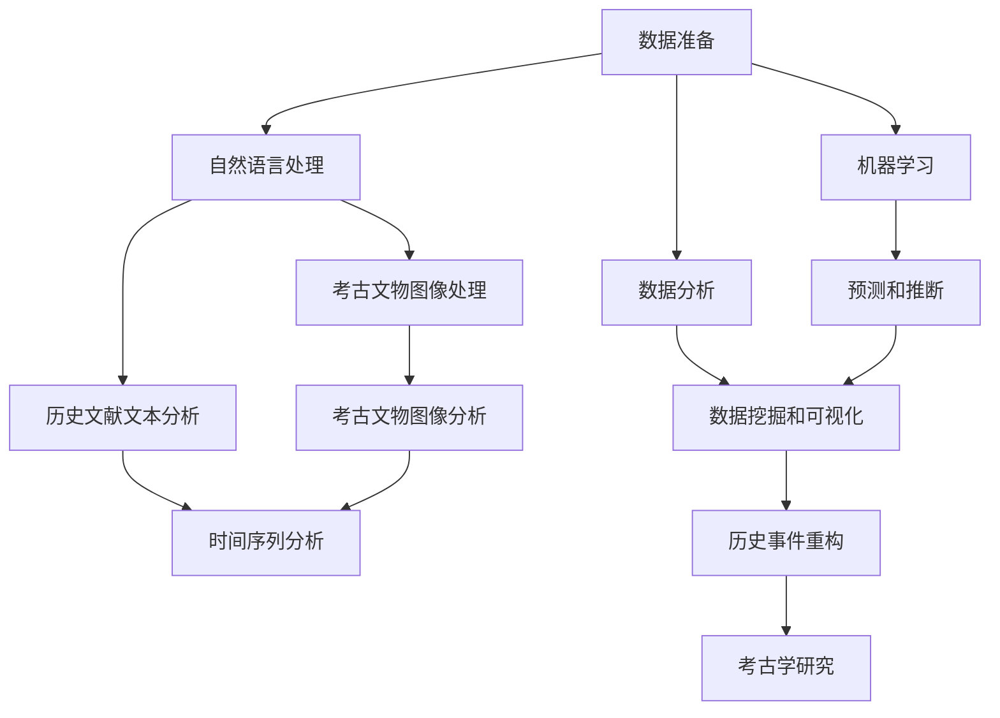

                 

# AI在历史研究和考古学中的应用

> 关键词：人工智能,历史研究,考古学,数据分析,自然语言处理(NLP),计算机视觉(CV),机器学习(ML),时间序列分析

## 1. 背景介绍

### 1.1 问题由来
随着科技的飞速发展，人工智能(AI)技术在各个领域的应用日益广泛，尤其在历史研究和考古学等传统领域，AI的应用正引发一场革命性的变革。AI技术可以高效地处理和分析大量历史文献和考古数据，帮助学者们更快速、更精确地探索历史之谜，解开考古学的各种谜团。本文将深入探讨AI如何在历史研究和考古学中发挥作用，以期为该领域的未来研究提供新的视角和工具。

### 1.2 问题核心关键点
AI在历史研究和考古学中的应用主要体现在以下几个方面：

- 数据分析：AI可以对海量历史文献和考古数据进行高效的数据挖掘和分析，提取有用的信息和模式。
- 自然语言处理(NLP)：通过NLP技术，AI可以理解和分析古文献、碑刻、铭文等文本资料，帮助学者们解读古代语言和文字。
- 计算机视觉(CV)：利用CV技术，AI可以自动识别和分析考古文物的图像，包括器物识别、图像拼接、年代鉴定等。
- 机器学习(ML)：AI可以通过ML算法，对历史事件、考古发现等进行预测和推断，提升研究的准确性和深度。
- 时间序列分析：AI可以对历史事件、考古发现进行时间序列分析，发现潜在的周期性和趋势。

这些技术的应用，极大地推动了历史研究和考古学的发展，使得学者们能够更高效、更全面地理解历史和人类文明。

## 2. 核心概念与联系

### 2.1 核心概念概述

为了更好地理解AI在历史研究和考古学中的应用，我们首先介绍几个关键概念：

- **自然语言处理(NLP)**：涉及计算机如何理解和生成人类语言的技术，包括文本分析、语音识别、情感分析等。
- **计算机视觉(CV)**：涉及计算机如何通过摄像头或图像传感器获取和理解视觉信息，包括图像识别、物体检测、三维重建等。
- **机器学习(ML)**：一种数据驱动的学习方法，通过算法让计算机从数据中学习规律，并应用于新的数据。
- **时间序列分析**：通过对时间序列数据进行建模和分析，发现数据中的趋势、周期性和相关性。

### 2.2 核心概念原理和架构的 Mermaid 流程图



这个流程图展示了AI在历史研究和考古学中各个环节的应用。数据准备阶段为后续所有处理提供基础；NLP技术帮助解读文本；CV技术用于处理图像；时间序列分析用于发现数据中的趋势和周期性；机器学习提供预测和推断功能；数据分析和数据挖掘用于发现数据中的模式；最终，这些信息可以用于历史事件的重构和考古学研究。

## 3. 核心算法原理 & 具体操作步骤

### 3.1 算法原理概述

AI在历史研究和考古学中的应用，本质上是一种数据驱动的分析和推理过程。其核心算法原理主要包括以下几个方面：

- **NLP算法**：用于分析和理解文本数据，包括文本预处理、情感分析、主题建模等。
- **CV算法**：用于分析和理解图像数据，包括图像识别、物体检测、图像分割等。
- **ML算法**：用于构建模型，通过数据学习规律，进行预测和推断。
- **时间序列分析算法**：用于发现数据中的趋势和周期性，包括时间序列建模、ARIMA模型等。

### 3.2 算法步骤详解

AI在历史研究和考古学中的应用，一般分为以下几个步骤：

**Step 1: 数据准备**
- 收集和整理历史文献、考古文物等数据，确保数据质量和完整性。
- 对数据进行清洗和预处理，去除噪声和无用信息。

**Step 2: 自然语言处理(NLP)**
- 使用NLP技术对文本数据进行分析，提取关键词、主题、情感等信息。
- 使用NLP技术对文本数据进行情感分析，判断文本的情感倾向。
- 使用NLP技术对文本数据进行文本分类，将其分类到不同的主题下。

**Step 3: 计算机视觉(CV)**
- 使用CV技术对图像数据进行分析，识别考古文物的图像。
- 使用CV技术对考古文物的图像进行拼接，还原完整的文物形态。
- 使用CV技术对考古文物的图像进行年代鉴定，确定文物的年代和历史背景。

**Step 4: 机器学习(ML)**
- 使用ML算法对历史事件、考古发现等进行建模和预测，推断其原因和影响。
- 使用ML算法对历史事件、考古发现等进行聚类和分类，发现其中的模式和规律。

**Step 5: 数据分析和数据挖掘**
- 使用数据分析技术对历史事件、考古发现等进行描述性统计和可视化，发现其中的趋势和周期性。
- 使用数据挖掘技术对历史事件、考古发现等进行关联分析和预测，发现其中的关联和影响。

**Step 6: 时间序列分析**
- 使用时间序列分析技术对历史事件、考古发现等进行建模和预测，发现其中的趋势和周期性。
- 使用时间序列分析技术对历史事件、考古发现等进行异常检测，发现其中的异常和突变。

### 3.3 算法优缺点

AI在历史研究和考古学中的应用，有以下优点和缺点：

**优点**：
- **效率高**：AI可以快速处理和分析大量数据，极大地提高了研究的效率。
- **精度高**：AI可以识别和分析文本、图像等复杂数据，提供了高精度的分析结果。
- **可扩展性**：AI可以处理和分析不同类型的历史和考古数据，具有很强的可扩展性。

**缺点**：
- **依赖数据质量**：AI对数据质量和完整性要求较高，数据偏差可能导致分析结果不准确。
- **需要大量计算资源**：AI处理复杂数据需要大量计算资源，对硬件要求较高。
- **结果可解释性不足**：AI算法的黑盒性质可能导致其分析结果难以解释，需要进一步研究。

### 3.4 算法应用领域

AI在历史研究和考古学中的应用，涵盖以下几个主要领域：

- **历史文献分析**：通过对历史文献进行文本分析和情感分析，提取历史事件和人物的背景信息。
- **考古文物识别**：利用CV技术对考古文物的图像进行识别和分析，确定其形态、年代和背景。
- **历史事件重构**：使用时间序列分析和ML算法，对历史事件进行建模和预测，重构历史事件的全过程。
- **考古学研究**：利用数据分析和数据挖掘技术，对考古学发现进行关联分析和预测，发现其中的规律和关联。

这些领域的应用，使得AI在历史研究和考古学中发挥了重要作用，极大地推动了该领域的发展。

## 4. 数学模型和公式 & 详细讲解 & 举例说明

### 4.1 数学模型构建

为了更好地理解和应用AI在历史研究和考古学中的应用，我们需要构建相应的数学模型。以下是一些常用的数学模型：

- **文本分析模型**：用于对文本数据进行分析，包括TF-IDF模型、LDA模型、情感分析模型等。
- **图像识别模型**：用于对图像数据进行识别和分析，包括卷积神经网络(CNN)、YOLO模型、R-CNN模型等。
- **时间序列分析模型**：用于发现数据中的趋势和周期性，包括ARIMA模型、LSTM模型等。

### 4.2 公式推导过程

以LSTM模型为例，推导时间序列分析的基本公式。

假设输入序列为 $X_t=[x_t,x_{t-1},x_{t-2},\cdots,x_1]$，输出序列为 $Y_t=[y_t,y_{t-1},y_{t-2},\cdots,y_1]$，时间序列模型为 $Y_t=f(X_t;\theta)$，其中 $\theta$ 为模型参数。LSTM模型的基本公式如下：

$$
\begin{align*}
i_t &= \sigma(W_{i}\cdot [h_{t-1},x_t] + b_i) \\
f_t &= \sigma(W_{f}\cdot [h_{t-1},x_t] + b_f) \\
o_t &= \sigma(W_{o}\cdot [h_{t-1},x_t] + b_o) \\
g_t &= \tanh(W_{g}\cdot [h_{t-1},x_t] + b_g) \\
c_t &= f_t \odot c_{t-1} + i_t \odot g_t \\
h_t &= o_t \odot \tanh(c_t)
\end{align*}
$$

其中 $\sigma$ 为激活函数，$W$ 为权重矩阵，$b$ 为偏置向量，$\odot$ 为逐元素乘法，$h_t$ 为LSTM的隐状态，$c_t$ 为LSTM的细胞状态。

### 4.3 案例分析与讲解

以LSTM模型为例，分析其在历史事件时间序列预测中的应用。

假设要预测某个历史事件的时间序列，输入序列为 $X_t=[x_t,x_{t-1},x_{t-2},\cdots,x_1]$，其中 $x_t$ 为事件在时间 $t$ 的某个指标，如人口、经济等。输出序列为 $Y_t=[y_t,y_{t-1},y_{t-2},\cdots,y_1]$，其中 $y_t$ 为事件在时间 $t$ 的另一个指标，如战争、社会变动等。

使用LSTM模型进行预测时，首先需要对输入序列进行标准化处理，将其转化为归一化的向量形式。然后，将归一化的向量输入LSTM模型，计算出隐状态 $h_t$ 和细胞状态 $c_t$。最后，将隐状态 $h_t$ 输入全连接层，得到预测结果 $Y_t$。

## 5. 项目实践：代码实例和详细解释说明

### 5.1 开发环境搭建

在进行AI在历史研究和考古学中的应用开发时，我们需要准备好相应的开发环境。以下是使用Python进行TensorFlow开发的环境配置流程：

1. 安装Anaconda：从官网下载并安装Anaconda，用于创建独立的Python环境。

2. 创建并激活虚拟环境：
```bash
conda create -n tf-env python=3.8 
conda activate tf-env
```

3. 安装TensorFlow：根据CUDA版本，从官网获取对应的安装命令。例如：
```bash
conda install tensorflow -c tf -c conda-forge
```

4. 安装NumPy、Pandas、Matplotlib等库：
```bash
pip install numpy pandas matplotlib scikit-learn tensorflow
```

5. 安装相关的NLP和CV库：
```bash
pip install gensim keras tensorflow-addons
```

完成上述步骤后，即可在`tf-env`环境中开始项目开发。

### 5.2 源代码详细实现

以下是一个使用TensorFlow实现历史事件时间序列预测的代码示例：

```python
import tensorflow as tf
from tensorflow.keras.layers import LSTM, Dense
from tensorflow.keras.models import Sequential
from sklearn.preprocessing import StandardScaler

# 加载历史事件数据
data = pd.read_csv('event_data.csv')

# 将数据标准化
scaler = StandardScaler()
data_scaled = scaler.fit_transform(data.values)

# 划分训练集和测试集
train_data = data_scaled[:train_size]
test_data = data_scaled[train_size:]

# 构建LSTM模型
model = Sequential()
model.add(LSTM(units=50, return_sequences=True, input_shape=(train_size, 1)))
model.add(LSTM(units=50))
model.add(Dense(units=1))

# 编译模型
model.compile(loss='mse', optimizer='adam')

# 训练模型
model.fit(train_data, epochs=100)

# 在测试集上评估模型
test_predictions = model.predict(test_data)
test_errors = np.sqrt(np.mean(np.square(test_predictions - test_data[:, -1])))
print('测试集均方误差：', test_errors)
```

### 5.3 代码解读与分析

让我们再详细解读一下关键代码的实现细节：

**数据加载**：使用pandas库加载历史事件数据，并将其转化为NumPy数组。

**数据标准化**：使用sklearn的StandardScaler对数据进行标准化处理，将其转化为归一化的向量形式。

**模型构建**：使用TensorFlow的Sequential模型构建LSTM模型，其中包含两个LSTM层和一个全连接层。

**模型编译**：使用均方误差损失函数和Adam优化器编译模型。

**模型训练**：使用训练集数据训练模型，设置迭代轮数为100。

**模型评估**：使用测试集数据评估模型性能，输出测试集均方误差。

以上代码示例展示了使用TensorFlow进行历史事件时间序列预测的完整流程。可以看到，TensorFlow提供了强大的框架和库，可以快速构建和训练复杂的深度学习模型，实现高效的AI应用。

## 6. 实际应用场景

### 6.1 考古学文物修复

在考古学中，文物修复是一个重要而复杂的任务。传统方法往往需要大量时间和人力，而且效果难以保证。利用AI技术，可以显著提高文物修复的效率和精度。

**Step 1: 数据准备**
- 收集考古文物的高分辨率图像数据。
- 对图像数据进行预处理，去除噪声和无用信息。

**Step 2: 图像识别**
- 使用CV技术对图像数据进行物体检测，确定文物的主要部分和边缘。
- 使用图像分割技术将文物的各个部分分离，便于后续处理。

**Step 3: 图像修复**
- 使用图像生成对抗网络(GAN)对文物的缺失部分进行补全。
- 使用图像融合技术将修复后的部分和原有部分融合，形成完整的文物图像。

**Step 4: 图像验证**
- 对修复后的文物图像进行验证，确保其与真实文物形态一致。
- 对修复效果进行评估，发现和纠正可能存在的问题。

通过AI技术，考古学文物修复可以更加高效、准确和可靠，为考古学研究提供了重要的技术支持。

### 6.2 历史文献情感分析

在历史研究中，情感分析是重要的分析手段之一。通过情感分析，可以了解历史事件的情感倾向，揭示历史事件的背景和影响。

**Step 1: 数据准备**
- 收集历史文献的文本数据。
- 对文本数据进行预处理，去除噪声和无用信息。

**Step 2: 文本分析**
- 使用NLP技术对文本数据进行情感分析，判断文本的情感倾向。
- 使用NLP技术对文本数据进行情感分类，将其分类到不同的情感类别下。

**Step 3: 情感可视化**
- 使用可视化技术将情感分析结果进行展示，形成情感趋势图。
- 对情感分析结果进行总结和分析，发现历史事件的情感变化。

通过情感分析，历史研究者可以更全面地了解历史事件的情感背景，发现其中的情感变化和趋势。

### 6.3 历史事件重构

在历史研究中，历史事件的重构是一个重要且复杂的任务。通过AI技术，可以更准确、更全面地重构历史事件的全过程。

**Step 1: 数据准备**
- 收集历史事件的文本和图像数据。
- 对数据进行预处理，去除噪声和无用信息。

**Step 2: 时间序列分析**
- 使用时间序列分析技术对历史事件的时间序列进行建模和预测。
- 使用LSTM模型对历史事件的时间序列进行建模和预测。

**Step 3: 预测和推断**
- 使用ML算法对历史事件进行预测和推断，重构历史事件的全过程。
- 对预测和推断结果进行验证和修正，确保其准确性和可靠性。

通过时间序列分析和预测，历史事件重构可以更加准确和全面，为历史研究提供了重要的技术支持。

### 6.4 未来应用展望

随着AI技术的不断发展，其在历史研究和考古学中的应用将更加广泛和深入。未来，AI技术可能会在以下几个方面发挥更大作用：

**数据挖掘和分析**：AI可以处理和分析更大量的数据，发现更多的历史和考古信息。

**知识图谱构建**：AI可以构建历史和考古知识图谱，帮助研究者更全面地理解历史和考古知识。

**情感和行为分析**：AI可以分析历史事件中的情感和行为，揭示其中的情感变化和行为规律。

**多模态融合**：AI可以将文本、图像、音频等多种模态数据进行融合，提升历史和考古研究的准确性和深度。

总之，AI技术在历史研究和考古学中的应用，将会极大地推动该领域的发展，为研究者提供更强大的技术支持。

## 7. 工具和资源推荐

### 7.1 学习资源推荐

为了帮助开发者系统掌握AI在历史研究和考古学中的应用，这里推荐一些优质的学习资源：

1. **《Python自然语言处理》**：一本介绍NLP的书籍，涵盖了NLP的基础理论和常用算法。

2. **《深度学习基础》**：一本介绍深度学习的书籍，涵盖了深度学习的基础理论和常用算法。

3. **TensorFlow官方文档**：TensorFlow的官方文档，提供了丰富的API和使用示例，是TensorFlow学习的必备资源。

4. **Keras官方文档**：Keras的官方文档，提供了丰富的API和使用示例，是深度学习学习的必备资源。

5. **Coursera深度学习课程**：Coursera提供的深度学习课程，由深度学习领域的专家授课，涵盖深度学习的基础理论和实践应用。

6. **ArXiv**：一个开放获取的预印本服务器，提供了大量的AI研究论文，是学习AI最新研究成果的宝贵资源。

通过对这些资源的学习实践，相信你一定能够快速掌握AI在历史研究和考古学中的应用，并用于解决实际的NLP问题。

### 7.2 开发工具推荐

高效的开发离不开优秀的工具支持。以下是几款用于AI在历史研究和考古学中的应用开发的常用工具：

1. **TensorFlow**：由Google主导开发的深度学习框架，具有强大的计算能力和灵活的API。

2. **Keras**：Keras提供了高层API，使得深度学习模型的开发更加简洁和高效。

3. **TensorBoard**：TensorFlow配套的可视化工具，可以实时监测模型训练状态，并提供丰富的图表呈现方式。

4. **Jupyter Notebook**：一个免费的交互式编程环境，支持Python代码的编写和执行，是数据科学学习的常用工具。

5. **PyCharm**：一个功能强大的IDE，支持Python代码的编写、调试和执行，是深度学习学习的常用工具。

6. **GitHub**：一个开源代码托管平台，提供了丰富的AI项目和资源，是学习和分享AI知识的常用工具。

合理利用这些工具，可以显著提升AI在历史研究和考古学中的应用开发效率，加快创新迭代的步伐。

### 7.3 相关论文推荐

AI在历史研究和考古学中的应用，源于学界的持续研究。以下是几篇奠基性的相关论文，推荐阅读：

1. **《自然语言处理综述》**：一篇综述性论文，涵盖了自然语言处理的基础理论和常用算法。

2. **《深度学习在考古学中的应用》**：一篇综述性论文，介绍了深度学习在考古学中的应用实例。

3. **《历史文献中的情感分析》**：一篇研究论文，介绍了情感分析在历史文献中的应用。

4. **《计算机视觉在考古学中的应用》**：一篇研究论文，介绍了计算机视觉在考古学中的应用实例。

5. **《历史事件重构中的时间序列分析》**：一篇研究论文，介绍了时间序列分析在历史事件重构中的应用。

这些论文代表了大语言模型微调技术的发展脉络。通过学习这些前沿成果，可以帮助研究者把握学科前进方向，激发更多的创新灵感。

## 8. 总结：未来发展趋势与挑战

### 8.1 研究成果总结

本文对AI在历史研究和考古学中的应用进行了全面系统的介绍。首先阐述了AI技术在历史研究和考古学中的应用背景和意义，明确了AI技术在提升历史研究和考古学研究效率和精度方面的独特价值。其次，从原理到实践，详细讲解了AI在历史研究和考古学中的核心算法和操作步骤，给出了AI在历史研究和考古学中的应用代码示例。同时，本文还广泛探讨了AI技术在考古学文物修复、历史文献情感分析、历史事件重构等多个行业领域的应用前景，展示了AI技术在历史研究和考古学中的巨大潜力。

通过本文的系统梳理，可以看到，AI技术在历史研究和考古学中的应用，正在改变传统的研究模式，推动该领域的发展。未来，随着AI技术的不断发展，其在历史研究和考古学中的应用将更加广泛和深入，为研究者提供更强大的技术支持。

### 8.2 未来发展趋势

展望未来，AI在历史研究和考古学中的应用将呈现以下几个发展趋势：

**趋势1: 数据驱动研究**：AI技术将更加广泛地应用于历史和考古数据处理和分析中，推动数据驱动的历史和考古研究。

**趋势2: 多模态融合**：AI技术将更加广泛地应用于多模态数据处理和分析中，推动多模态的历史和考古研究。

**趋势3: 知识图谱构建**：AI技术将更加广泛地应用于历史和考古知识图谱构建中，推动基于知识的历史和考古研究。

**趋势4: 智能推断与预测**：AI技术将更加广泛地应用于历史和考古事件推断与预测中，推动基于智能的历史和考古研究。

**趋势5: 个性化定制**：AI技术将更加广泛地应用于历史和考古个性化定制中，推动基于个性化的历史和考古研究。

以上趋势凸显了AI在历史研究和考古学中的应用前景，这些方向的探索发展，必将进一步推动历史研究和考古学的发展，为人类文明的研究提供新的视角和工具。

### 8.3 面临的挑战

尽管AI在历史研究和考古学中的应用取得了显著成果，但在迈向更加智能化、普适化应用的过程中，仍面临诸多挑战：

**挑战1: 数据质量问题**：AI技术对数据质量和完整性要求较高，历史和考古数据往往存在缺失和噪声，数据质量问题仍需进一步解决。

**挑战2: 技术门槛较高**：AI技术的应用需要一定的技术门槛，历史和考古研究者可能存在一定的学习障碍。

**挑战3: 模型可解释性不足**：AI模型的黑盒性质可能导致其分析结果难以解释，需要进一步研究可解释性问题。

**挑战4: 资源需求较大**：AI技术的应用需要大量的计算资源和时间，对于历史和考古研究来说，资源需求较大。

**挑战5: 伦理道德问题**：AI技术的应用可能涉及伦理道德问题，需要进一步研究如何保护历史和考古数据的隐私和安全。

以上挑战需要研究者积极应对并寻求突破，才能更好地推动AI技术在历史研究和考古学中的应用。

### 8.4 研究展望

面向未来，AI在历史研究和考古学中的应用还需要在以下几个方面寻求新的突破：

**展望1: 数据质量提升**：研究历史和考古数据的质量提升技术，使得数据更加完整和可靠。

**展望2: 技术门槛降低**：研究历史和考古数据处理和分析的技术门槛降低方法，使得研究者更容易使用AI技术。

**展望3: 模型可解释性增强**：研究AI模型的可解释性增强方法，使得分析结果更加透明和可理解。

**展望4: 资源需求降低**：研究AI技术的资源需求降低方法，使得历史和考古研究更加高效和可行。

**展望5: 伦理道德保障**：研究AI技术的伦理道德保障方法，确保历史和考古数据的隐私和安全。

这些研究方向的探索，必将引领AI在历史研究和考古学中的应用迈向更高的台阶，为历史和考古研究提供更强大的技术支持。

## 9. 附录：常见问题与解答

**Q1: AI在历史研究和考古学中的应用有哪些优势和劣势？**

A: AI在历史研究和考古学中的应用具有以下优势：
- 高效处理和分析大量数据，极大地提高了研究效率。
- 提供高精度的分析结果，使得研究更加准确和全面。
- 可以处理和分析多种类型的数据，具有很强的可扩展性。

同时，AI在历史研究和考古学中的应用也存在以下劣势：
- 对数据质量和完整性要求较高，数据偏差可能导致分析结果不准确。
- 需要大量计算资源，对硬件要求较高。
- 结果可解释性不足，需要进一步研究。

**Q2: 如何应对AI在历史研究和考古学中的应用中的数据质量问题？**

A: 应对AI在历史研究和考古学中的应用中的数据质量问题，可以采取以下措施：
- 对历史和考古数据进行预处理，去除噪声和无用信息。
- 对历史和考古数据进行标准化处理，使其符合AI模型的输入要求。
- 对历史和考古数据进行验证和校正，确保其真实性和可靠性。

**Q3: 如何应对AI在历史研究和考古学中的应用中的技术门槛问题？**

A: 应对AI在历史研究和考古学中的应用中的技术门槛问题，可以采取以下措施：
- 提供易用的工具和框架，降低AI技术的使用门槛。
- 提供详细的教程和示例，帮助研究者快速上手。
- 组织培训和交流活动，提高研究者的技术水平。

**Q4: 如何应对AI在历史研究和考古学中的应用中的模型可解释性问题？**

A: 应对AI在历史研究和考古学中的应用中的模型可解释性问题，可以采取以下措施：
- 研究可解释性增强方法，如LIME、SHAP等。
- 在模型设计中引入可解释性因子，如可视化技术、特征选择等。
- 提供可解释性报告和工具，帮助研究者理解模型分析结果。

**Q5: 如何应对AI在历史研究和考古学中的应用中的资源需求问题？**

A: 应对AI在历史研究和考古学中的应用中的资源需求问题，可以采取以下措施：
- 研究资源优化技术，如梯度累积、混合精度训练等。
- 使用云计算和分布式计算技术，降低本地计算资源的需求。
- 使用高效算法和数据结构，提高模型的计算效率。

通过这些措施，可以克服AI在历史研究和考古学中的应用中的技术瓶颈，推动AI技术在该领域中的广泛应用。

---

作者：禅与计算机程序设计艺术 / Zen and the Art of Computer Programming

