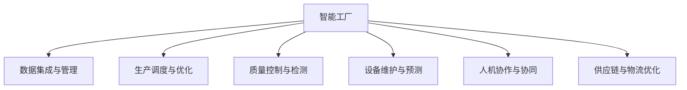

                 

# AI在智能工厂中的应用：提高生产灵活性

## 1. 背景介绍

### 1.1 问题由来

智能工厂是工业4.0时代的重要标志，通过先进的信息化、自动化技术，实现生产过程的数字化、智能化、网络化。AI在智能工厂中的应用，极大地提高了生产效率、降低了成本，推动了制造业的升级转型。然而，当前的智能工厂仍然存在许多挑战，如数据管理、生产调度、质量控制等问题。AI如何更好地融入智能工厂，提升生产灵活性，成为当前工业界和学术界的重要课题。

### 1.2 问题核心关键点

AI在智能工厂的应用核心关键点在于：

1. 数据整合与管理。智能工厂产生海量数据，需要高效、可靠的数据管理系统。
2. 生产调度与优化。AI需要参与生产调度，实时调整生产流程，提升生产效率。
3. 质量控制与检测。AI通过图像识别、缺陷检测等技术，实现对生产质量的精准控制。
4. 设备维护与预测。AI分析设备数据，预测设备故障，实现预防性维护。
5. 人机协作与协同。AI提供智能助手、辅助决策，助力生产人员高效工作。
6. 供应链与物流优化。AI优化供应链与物流过程，提升供应链响应速度。

### 1.3 问题研究意义

研究AI在智能工厂中的应用，对于推动制造业向数字化、智能化方向转型，提高生产灵活性和效率，具有重要意义：

1. 降低生产成本。AI通过优化生产流程、减少物料浪费，降低生产成本。
2. 提高产品质量。AI通过精准质量控制，减少产品缺陷，提升客户满意度。
3. 加速产品创新。AI通过数据分析和模拟，加速新产品设计和试制，缩短上市周期。
4. 提升管理效率。AI通过自动化管理，减少人工干预，提升生产管理效率。
5. 增强市场竞争力。AI助力企业优化供应链和生产流程，提升市场竞争力。

## 2. 核心概念与联系

### 2.1 核心概念概述

为更好地理解AI在智能工厂中的应用，本节将介绍几个密切相关的核心概念：

- 智能工厂：以互联网、物联网、大数据、人工智能等技术为基础，实现数字化、智能化、网络化的制造工厂。
- 人工智能：通过计算机模拟人类智能过程，实现问题解决、智能决策等功能。
- 数据集成与管理：将企业内外部的数据进行整合、清洗、存储和分析，支持企业决策。
- 生产调度与优化：通过AI优化生产流程，实现生产任务的自动分配和调度。
- 质量控制与检测：利用AI进行图像识别、缺陷检测等，实现对产品质量的自动监控和评估。
- 设备维护与预测：通过AI分析设备数据，预测设备故障，实现预防性维护。
- 人机协作与协同：AI提供智能助手、辅助决策，提升生产人员的工作效率。
- 供应链与物流优化：通过AI优化供应链与物流过程，提升供应链响应速度。

这些核心概念之间的逻辑关系可以通过以下Mermaid流程图来展示：



这个流程图展示了他的核心概念及其之间的关系：

1. 智能工厂以数据集成为基础，支持生产、质量、设备、人机、供应链等多个环节的AI应用。
2. AI通过优化生产流程、质量控制、设备维护等，提升智能工厂的生产效率和质量。
3. 人机协作和供应链优化，进一步增强智能工厂的灵活性和竞争力。

## 3. 核心算法原理 & 具体操作步骤

### 3.1 算法原理概述

AI在智能工厂中的应用，主要通过以下几个步骤进行：

1. 数据预处理与清洗：从生产系统、传感器、ERP系统等收集数据，并对其进行预处理和清洗。
2. 特征提取与建模：通过机器学习算法提取数据特征，并建立模型进行预测和优化。
3. 模型训练与优化：使用历史数据对模型进行训练，并进行超参数优化。
4. 模型部署与集成：将训练好的模型部署到生产系统，实现实时监控和预测。
5. 实时监控与反馈：实时监控生产过程，根据反馈调整生产参数和模型参数。
6. 持续学习与改进：利用新数据不断更新模型，提升模型性能。

### 3.2 算法步骤详解

以智能工厂中的生产调度与优化为例，以下是具体算法步骤：

**Step 1: 数据预处理与清洗**

- 收集生产系统、传感器、ERP系统等的数据，如生产设备状态、物料库存、订单信息等。
- 清洗数据，去除噪声、缺失值，进行数据归一化和标准化处理。
- 使用时间序列分析等技术，处理数据的时序特性，提取生产节拍的规律性。

**Step 2: 特征提取与建模**

- 提取关键特征，如生产设备状态、设备负载、工艺参数等。
- 使用机器学习算法（如决策树、随机森林、深度学习等）建立生产调度模型。
- 使用正则化、交叉验证等技术优化模型，确保模型的泛化能力和稳定性。

**Step 3: 模型训练与优化**

- 使用历史生产数据训练模型，并进行超参数优化，如调整学习率、正则化系数、模型结构等。
- 使用随机梯度下降等优化算法进行模型训练，确保模型收敛于最优解。
- 使用交叉验证等技术评估模型性能，选取最优模型进行部署。

**Step 4: 模型部署与集成**

- 将训练好的模型部署到生产系统，如工业以太网、边缘计算等。
- 集成到SCADA系统、MES系统等，实现对生产流程的实时监控和优化。
- 提供API接口，实现生产系统的自动化控制和优化。

**Step 5: 实时监控与反馈**

- 实时采集生产数据，进行模型预测和决策。
- 根据预测结果和反馈调整生产流程，如调整生产速度、优化工艺参数等。
- 记录生产过程数据，用于后续模型训练和优化。

**Step 6: 持续学习与改进**

- 定期采集新数据，进行模型更新和优化。
- 利用新数据不断训练和调整模型，提升模型性能。
- 引入在线学习、增量学习等技术，实现模型的持续更新。

### 3.3 算法优缺点

AI在智能工厂中的应用具有以下优点：

1. 提高生产效率。通过优化生产流程、调度优化等，提升生产效率，减少人工干预。
2. 降低生产成本。通过智能调度、预测性维护等，降低物料浪费、设备维护成本。
3. 提升产品质量。通过自动质量检测、精准控制等，减少产品缺陷，提升客户满意度。
4. 增强决策支持。通过数据分析和预测，辅助生产人员做出更科学的决策。
5. 提升灵活性。通过实时监控和调整，提高生产系统的灵活性和适应性。

同时，AI在智能工厂中的应用也存在以下局限性：

1. 数据质量依赖。模型性能依赖于数据的准确性和完整性，数据质量问题可能影响模型效果。
2. 模型复杂度高。智能工厂中的数据多维度、非结构化，模型复杂度高，训练难度大。
3. 系统集成难度。将AI模型集成到现有的生产系统，可能面临数据格式、接口等问题。
4. 隐私和安全问题。生产数据涉及企业商业机密，需要严格的数据安全措施。
5. 人才和技术需求。AI应用需要具备相关技术背景和专业人才，推广应用存在挑战。

尽管存在这些局限性，但AI在智能工厂中的应用仍具有巨大潜力，未来有待进一步突破。

### 3.4 算法应用领域

AI在智能工厂中的应用领域非常广泛，涵盖以下几个方面：

1. 生产调度与优化：AI优化生产流程，实现生产任务的自动分配和调度。
2. 质量控制与检测：AI进行图像识别、缺陷检测等，实现对产品质量的自动监控和评估。
3. 设备维护与预测：AI分析设备数据，预测设备故障，实现预防性维护。
4. 人机协作与协同：AI提供智能助手、辅助决策，提升生产人员的工作效率。
5. 供应链与物流优化：AI优化供应链与物流过程，提升供应链响应速度。
6. 能耗与环保：AI优化能源消耗，实现环保生产。
7. 安全监控：AI进行异常行为检测，保障生产安全。

AI通过优化这些关键环节，大大提升了智能工厂的灵活性和效率。未来，随着AI技术的进一步发展，智能工厂的生产效率和智能化水平将不断提升。

## 4. 数学模型和公式 & 详细讲解 & 举例说明

### 4.1 数学模型构建

以生产调度优化为例，其数学模型可以表示为：

$$
\min_{x} \sum_{i=1}^{n} (c_i x_i) + \sum_{i=1}^{m} \sum_{j=1}^{n} (d_{ij} x_i x_j)
$$

其中 $x$ 为生产任务的调度变量， $c_i$ 为任务 $i$ 的成本系数， $d_{ij}$ 为任务 $i$ 和任务 $j$ 之间的依赖关系系数。

### 4.2 公式推导过程

在上述线性规划模型中，通过求解最优调度变量 $x$，可以实现生产任务的优化调度。

具体推导过程如下：

1. 建立目标函数和约束条件。
2. 利用拉格朗日乘子法将目标函数和约束条件转化为拉格朗日方程。
3. 对拉格朗日方程求导，求解得最优调度变量 $x$。
4. 将最优调度变量 $x$ 代入目标函数，计算最小成本。

### 4.3 案例分析与讲解

以某制造企业为例，假设企业有3条生产线，分别生产A、B、C三种产品，产品生产顺序依赖关系如下：

| 任务 | 生产成本 | 依赖关系 | 单位 |
| --- | --- | --- | --- |
| A1 | 10 | 无 | 1 |
| A2 | 15 | 必须先于A1 | 1 |
| B1 | 20 | 必须先于A2 | 1 |
| B2 | 25 | 必须先于B1 | 1 |
| C1 | 30 | 必须先于B2 | 1 |
| C2 | 35 | 必须先于C1 | 1 |

假设生产A、B、C三种产品的单位成本分别为1、1.2、1.5，求解最优生产调度。

通过求解线性规划模型，可以得出最优调度为：

1. A1 -> A2 -> B1 -> B2 -> C1 -> C2

最优生产成本为65。

## 5. 项目实践：代码实例和详细解释说明

### 5.1 开发环境搭建

在进行生产调度优化项目实践前，我们需要准备好开发环境。以下是使用Python进行PyTorch开发的环境配置流程：

1. 安装Anaconda：从官网下载并安装Anaconda，用于创建独立的Python环境。

2. 创建并激活虚拟环境：
```bash
conda create -n pytorch-env python=3.8 
conda activate pytorch-env
```

3. 安装PyTorch：根据CUDA版本，从官网获取对应的安装命令。例如：
```bash
conda install pytorch torchvision torchaudio cudatoolkit=11.1 -c pytorch -c conda-forge
```

4. 安装相关库：
```bash
pip install pandas numpy sklearn
```

完成上述步骤后，即可在`pytorch-env`环境中开始生产调度优化实践。

### 5.2 源代码详细实现

这里我们以某智能工厂的生产调度优化为例，给出使用PyTorch进行线性规划优化的代码实现。

```python
import torch
import torch.nn as nn
import torch.optim as optim

# 定义生产调度的线性规划模型
class ProductionScheduler(nn.Module):
    def __init__(self, num_tasks, cost_coeffs, dep_rel_coeffs):
        super(ProductionScheduler, self).__init__()
        self.num_tasks = num_tasks
        self.cost_coeffs = cost_coeffs
        self.dep_rel_coeffs = dep_rel_coeffs
        self.linear = nn.Linear(num_tasks, num_tasks)
    
    def forward(self, x):
        x = self.linear(x)
        return x
    
    def compute_cost(self, x):
        cost = 0
        for i in range(self.num_tasks):
            cost += self.cost_coeffs[i] * x[i]
            for j in range(self.num_tasks):
                if j != i and self.dep_rel_coeffs[i][j] > 0:
                    cost += self.dep_rel_coeffs[i][j] * x[i] * x[j]
        return cost
    
    def compute_loss(self, x, y):
        cost = self.compute_cost(x)
        loss = cost - y
        return loss

# 训练函数
def train_scheduler(scheduler, train_loader, epochs, batch_size, learning_rate):
    model = scheduler
    criterion = nn.MSELoss()
    optimizer = optim.Adam(model.parameters(), lr=learning_rate)
    
    for epoch in range(epochs):
        for batch_idx, (data, target) in enumerate(train_loader):
            optimizer.zero_grad()
            outputs = model(data)
            loss = criterion(outputs, target)
            loss.backward()
            optimizer.step()
            print('Train Epoch: {} [{}/{} ({:.0f}%)]\tLoss: {:.6f}'.format(
                epoch, batch_idx * len(data), len(train_loader.dataset),
                100. * batch_idx / len(train_loader), loss.item()))

# 测试函数
def test_scheduler(scheduler, test_loader):
    model = scheduler
    criterion = nn.MSELoss()
    
    with torch.no_grad():
        total_loss = 0
        for batch_idx, (data, target) in enumerate(test_loader):
            outputs = model(data)
            loss = criterion(outputs, target)
            total_loss += loss.item()
        print('Test Loss: {:.6f}'.format(total_loss/len(test_loader)))
```

在上述代码中，我们首先定义了生产调度的线性规划模型，包括成本系数、依赖关系系数等关键参数。然后，定义了训练和测试函数，使用Adam优化器进行模型训练和评估。最后，在训练和测试过程中，通过损失函数和优化器更新模型参数。

### 5.3 代码解读与分析

让我们再详细解读一下关键代码的实现细节：

**ProductionScheduler类**：
- `__init__`方法：初始化模型参数，包括成本系数和依赖关系系数。
- `forward`方法：进行前向传播，将输入数据通过线性层进行计算。
- `compute_cost`方法：计算目标函数中的成本。
- `compute_loss`方法：计算损失函数，包括目标函数和优化目标。

**train_scheduler函数**：
- 定义模型、优化器和损失函数，进行模型训练。
- 在每个epoch中，对每个batch进行前向传播和反向传播，更新模型参数。
- 输出训练损失。

**test_scheduler函数**：
- 定义模型和损失函数，进行模型测试。
- 在每个batch中，进行前向传播，计算损失，并累加测试损失。
- 输出测试损失。

通过上述代码实现，我们可以看到，基于PyTorch进行生产调度优化具有较高的灵活性和可扩展性。开发者可以根据具体需求，调整模型参数和优化算法，进一步提升生产调度的优化效果。

## 6. 实际应用场景

### 6.1 生产调度与优化

智能工厂的生产调度与优化是AI应用的重要场景之一。通过AI优化生产流程，可以实现生产任务的自动分配和调度，提升生产效率和资源利用率。

具体而言，可以采用AI算法优化生产节拍、调度优化、库存管理等环节，实现生产任务的自动化和智能化。例如，可以使用线性规划、优化器、遗传算法等方法，对生产任务进行调度和优化，降低生产成本，提高生产效率。

### 6.2 质量控制与检测

质量控制与检测是智能工厂中的重要环节。通过AI进行图像识别、缺陷检测等，可以实现对产品质量的自动监控和评估。

具体而言，可以采用计算机视觉技术，对生产过程中的关键环节进行图像采集和分析，识别出产品质量问题，并进行及时纠正。例如，可以使用卷积神经网络(CNN)对图像进行识别，使用生成对抗网络(GAN)进行图像增强，提升图像识别精度。

### 6.3 设备维护与预测

设备维护与预测是智能工厂中的重要环节。通过AI分析设备数据，可以预测设备故障，实现预防性维护，降低设备维护成本。

具体而言，可以采用时间序列分析、深度学习等方法，对设备数据进行分析和建模，预测设备故障，并进行维护和预防。例如，可以使用LSTM网络对设备数据进行建模，预测设备故障，实现实时维护。

### 6.4 供应链与物流优化

供应链与物流优化是智能工厂中的重要环节。通过AI优化供应链与物流过程，可以提升供应链响应速度，降低物流成本。

具体而言，可以采用优化算法、预测模型等方法，对供应链和物流过程进行优化。例如，可以使用遗传算法对供应链进行优化，使用深度学习对物流路径进行预测和优化。

### 6.5 未来应用展望

随着AI技术的不断发展，基于AI的智能工厂应用将呈现更多的创新和突破。以下是几个可能的发展方向：

1. 工业互联网：通过AI与工业互联网的深度融合，实现设备互联、信息互通、数据共享，提升生产系统的智能化水平。
2. 自动化协作：通过AI与机器人、协作机器人等自动化设备的融合，实现生产流程的自动化和协同化，提升生产效率。
3. 智能生产：通过AI与生产系统的深度融合，实现生产过程的实时监控、预测和优化，提升生产系统的灵活性和适应性。
4. 个性化定制：通过AI与生产系统的深度融合，实现个性化定制生产，提升客户满意度和市场竞争力。

未来，随着AI技术的不断进步和深入应用，智能工厂的生产效率和智能化水平将不断提升，推动制造业向更高层次的智能化方向发展。

## 7. 工具和资源推荐

### 7.1 学习资源推荐

为了帮助开发者系统掌握AI在智能工厂中的应用，这里推荐一些优质的学习资源：

1. 《深度学习基础》系列书籍：由深度学习专家撰写，全面介绍了深度学习的基本概念和算法。
2. 《机器学习实战》：提供了大量的Python代码实现，适合动手实践。
3. 《TensorFlow实战》：提供了TensorFlow的详细教程和应用案例，适合深入学习。
4. 《智能工厂案例分析》：分析了多个智能工厂的实际案例，提供有价值的经验和参考。
5. 《工业大数据》：介绍了工业大数据的概念、技术和应用，适合了解智能工厂的高级技术。

通过学习这些资源，相信你一定能够快速掌握AI在智能工厂中的应用方法，并用于解决实际的智能工厂问题。

### 7.2 开发工具推荐

高效的开发离不开优秀的工具支持。以下是几款用于AI在智能工厂中应用开发的常用工具：

1. Python：Python是最流行的编程语言之一，拥有丰富的机器学习库和框架，适合进行AI项目开发。
2. TensorFlow：由Google主导开发的深度学习框架，适合大规模工程应用。
3. PyTorch：由Facebook主导开发的深度学习框架，适合快速迭代研究和开发。
4. Scikit-Learn：提供了简单易用的机器学习算法库，适合快速原型开发。
5. Jupyter Notebook：免费的Jupyter Notebook环境，适合进行数据处理、模型训练和可视化。
6. Visual Studio Code：支持Python、TensorFlow等插件，适合AI项目开发。

合理利用这些工具，可以显著提升AI在智能工厂中应用的开发效率，加快创新迭代的步伐。

### 7.3 相关论文推荐

AI在智能工厂中的应用受到了学术界的广泛关注。以下是几篇奠基性的相关论文，推荐阅读：

1. "A Survey on Optimization Algorithms for the Industry 4.0 Smart Manufacturing"：综述了优化算法在智能制造中的应用。
2. "AI in Smart Manufacturing: A Review and Outlook"：综述了AI在智能制造中的应用，包括生产调度、质量控制、设备维护等。
3. "Deep Learning in Manufacturing"：介绍了深度学习在制造领域的应用，包括预测性维护、质量控制等。
4. "Industry 4.0: Intelligent Manufacturing with AI"：介绍了AI在智能制造中的应用，包括生产调度、供应链优化、质量控制等。
5. "Optimization Algorithms for Smart Manufacturing: A Survey"：综述了优化算法在智能制造中的应用，包括遗传算法、模拟退火等。

这些论文代表了大语言模型微调技术的发展脉络。通过学习这些前沿成果，可以帮助研究者把握学科前进方向，激发更多的创新灵感。

## 8. 总结：未来发展趋势与挑战

### 8.1 研究成果总结

本文对AI在智能工厂中的应用进行了全面系统的介绍。首先阐述了智能工厂和AI技术的基本概念和应用背景，明确了AI在智能工厂中的重要价值。其次，从原理到实践，详细讲解了AI在智能工厂中的应用方法，包括生产调度、质量控制、设备维护等。最后，讨论了AI在智能工厂中应用面临的挑战和未来发展趋势。

通过本文的系统梳理，可以看到，AI在智能工厂中的应用具有广阔前景，能够显著提升生产效率、降低成本、提升产品质量。未来，随着AI技术的不断进步和深入应用，智能工厂的生产效率和智能化水平将不断提升，推动制造业向更高层次的智能化方向发展。

### 8.2 未来发展趋势

展望未来，AI在智能工厂中的应用将呈现以下几个发展趋势：

1. 深度融合：AI与工业互联网、工业大数据等技术的深度融合，提升生产系统的智能化水平。
2. 自动化协作：AI与机器人、协作机器人等自动化设备的深度融合，实现生产流程的自动化和协同化。
3. 智能生产：AI与生产系统的深度融合，实现生产过程的实时监控、预测和优化。
4. 个性化定制：AI与生产系统的深度融合，实现个性化定制生产。
5. 工业互联网：AI与工业互联网的深度融合，实现设备互联、信息互通、数据共享。

以上趋势凸显了AI在智能工厂中的广阔前景。这些方向的探索发展，必将进一步提升智能工厂的生产效率和智能化水平，推动制造业向更高层次的智能化方向发展。

### 8.3 面临的挑战

尽管AI在智能工厂中的应用已经取得了显著成效，但在迈向更加智能化、普适化应用的过程中，仍面临诸多挑战：

1. 数据质量瓶颈：AI模型依赖于高质量的数据，但生产数据往往存在噪声、缺失等问题，影响模型效果。
2. 模型复杂度高：智能工厂中的数据多维度、非结构化，模型复杂度高，训练难度大。
3. 系统集成难度：将AI模型集成到现有的生产系统，可能面临数据格式、接口等问题。
4. 隐私和安全问题：生产数据涉及企业商业机密，需要严格的数据安全措施。
5. 人才和技术需求：AI应用需要具备相关技术背景和专业人才，推广应用存在挑战。

尽管存在这些挑战，但AI在智能工厂中的应用仍具有巨大潜力，未来有待进一步突破。

### 8.4 研究展望

未来，针对AI在智能工厂中的应用，需要在以下几个方面进行更多的研究：

1. 数据质量管理：研究和开发高质量的数据管理工具，提升数据质量。
2. 模型优化：研究和开发高效、简单的AI模型，提升模型训练和推理速度。
3. 系统集成：研究和开发高效的系统集成工具，实现AI模型的无缝集成。
4. 隐私保护：研究和开发隐私保护技术，保障生产数据的隐私和安全。
5. 人才培训：加强AI人才培养和技术普及，推动AI在智能工厂中的广泛应用。

这些研究方向的研究进展，将为AI在智能工厂中的应用提供有力支持，推动制造业向智能化、绿色化、个性化方向发展。

## 9. 附录：常见问题与解答

**Q1：AI在智能工厂中的应用是否只能用于大规模生产？**

A: AI在智能工厂中的应用不仅仅限于大规模生产，其广泛适用于各种生产规模的制造企业。通过AI优化生产流程、质量控制、设备维护等，各种规模的制造企业都能显著提升生产效率和产品质量。

**Q2：AI在智能工厂中的应用是否需要大量投资？**

A: AI在智能工厂中的应用需要一定的初期投资，但长期来看，能够显著提升生产效率、降低成本、提升产品质量，带来更高的收益。

**Q3：AI在智能工厂中的应用是否需要更改生产设备？**

A: 不需要。AI在智能工厂中的应用主要涉及软件和算法，不需要更改生产设备。但需要对生产系统和设备进行数据采集和集成，以实现AI模型的输入。

**Q4：AI在智能工厂中的应用是否需要人工干预？**

A: AI在智能工厂中的应用可以大大减少人工干预，但需要根据实际情况进行人工干预，如模型参数调整、系统集成等。

**Q5：AI在智能工厂中的应用是否需要特定的人才和技能？**

A: 是的。AI在智能工厂中的应用需要具备相关技术背景和专业人才，如数据工程师、算法工程师、系统集成工程师等。需要加强AI人才培养和技术普及，推动AI在智能工厂中的广泛应用。

---

作者：禅与计算机程序设计艺术 / Zen and the Art of Computer Programming

