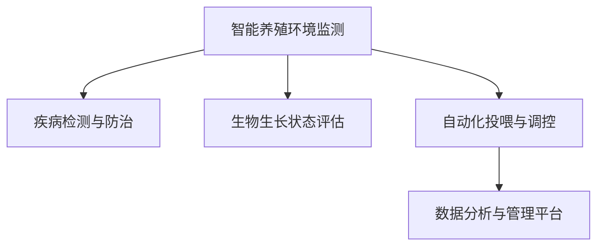

                 

# AI在智能海洋养殖中的应用：提高产量

## 1. 背景介绍

### 1.1 问题由来
在全球范围内，海洋养殖已成为一个重要的水产养殖方式，对于保障食物安全和推动海洋经济的发展具有重大意义。然而，海洋养殖仍然面临着诸多挑战，如病害频发、生长周期长、环境压力大等，严重制约了养殖产量的提升。近年来，人工智能(AI)技术开始在大规模水产养殖中崭露头角，借助数据驱动和智能决策，显著提高了养殖效率和产出。

### 1.2 问题核心关键点
AI在智能海洋养殖中的应用，主要聚焦于以下几个关键点：
- 养殖环境的智能化监测和预警
- 疾病和异常情况的及时检测与处理
- 养殖生物生长和健康状态的实时评估
- 自动化的投喂和调控系统
- 高效的数据管理和分析平台

这些关键点的实现，将大大提升养殖管理和决策的智能化水平，优化养殖流程，从而提高水产养殖的产量和效益。

## 2. 核心概念与联系

### 2.1 核心概念概述

为更好地理解AI在智能海洋养殖中的应用，本节将介绍几个密切相关的核心概念：

- **智能养殖环境监测**：通过传感器和监控系统，实时采集养殖环境的各项参数，如水温、盐度、溶氧量等，利用机器学习算法进行分析和预警。
- **疾病检测与防治**：通过图像识别、声音分析、生物传感器等技术，实时监测养殖生物的健康状态，快速检测到疾病和异常情况，并采取相应的防治措施。
- **生物生长状态评估**：结合图像处理、深度学习等技术，对养殖生物的生长状态进行实时评估，预测其健康状况和生长趋势。
- **自动化投喂与调控**：通过物联网和自动化技术，实现精确投喂和养殖环境的自动调控，减少人工干预和资源浪费。
- **数据分析与管理平台**：构建高效的数据管理和分析平台，支持数据的实时存储和处理，提供直观的可视化报表和智能分析报告，辅助养殖户进行科学决策。

这些核心概念之间存在紧密的联系，共同构成了智能海洋养殖的技术体系，使AI技术能够全面提升水产养殖的智能化水平。

### 2.2 核心概念原理和架构的 Mermaid 流程图(Mermaid 流程节点中不要有括号、逗号等特殊字符)



这个流程图展示了几大核心概念之间的逻辑关系：

1. **智能养殖环境监测**：作为数据来源，提供养殖环境的关键参数。
2. **疾病检测与防治**：基于监测数据，对养殖生物的健康状态进行实时评估，并快速响应异常情况。
3. **生物生长状态评估**：结合监测数据和生物特征，预测生长趋势，提供科学管理依据。
4. **自动化投喂与调控**：通过数据驱动的自动化系统，优化投喂和环境调控策略，提升养殖效率。
5. **数据分析与管理平台**：整合各类数据，支持动态分析、智能报告和可视化展示，辅助养殖决策。

这些概念的有机结合，共同推动了智能海洋养殖的发展。

## 3. 核心算法原理 & 具体操作步骤
### 3.1 算法原理概述

AI在智能海洋养殖中的应用，主要基于以下几个核心算法和原理：

- **机器学习与深度学习**：通过学习养殖环境的历史数据，预测未来的变化趋势和异常情况。
- **计算机视觉与图像识别**：利用图像处理技术，对养殖生物的状态和生长环境进行自动识别和分析。
- **自然语言处理(NLP)**：通过分析养殖日志和监控数据，提取有价值的信息，辅助决策支持。
- **物联网技术**：通过传感器网络，实现对养殖环境的高效监控和数据采集。
- **强化学习与优化算法**：通过强化学习算法，优化投喂策略、环境调控等养殖管理方案。

### 3.2 算法步骤详解

AI在智能海洋养殖中的应用，一般包括以下几个关键步骤：

**Step 1: 数据采集与处理**
- 部署各种传感器，如温度、盐度、溶氧量等监测设备，收集养殖环境的实时数据。
- 利用计算机视觉技术，通过摄像头或无人机对养殖生物进行实时监测。
- 将采集到的数据上传到中央数据平台，进行清洗、整理和归一化处理。

**Step 2: 环境监测与预警**
- 利用机器学习算法，对环境数据进行分析和建模，预测未来变化趋势。
- 设定异常阈值，当环境参数超出正常范围时，自动触发预警机制，通知养殖户采取措施。

**Step 3: 疾病检测与防治**
- 通过图像识别技术，自动检测养殖生物的体表异常和疾病症状。
- 结合声音分析，判断异常声音是否与疾病相关联。
- 一旦检测到疾病，立即启动防治措施，如药物治疗、隔离等。

**Step 4: 生长状态评估与投喂优化**
- 利用深度学习算法，对养殖生物的图像和生长数据进行特征提取和分析，评估其健康状态和生长趋势。
- 根据评估结果，优化投喂量和时间，确保生物的最佳生长条件。

**Step 5: 数据管理与智能报告**
- 构建高效的数据管理和分析平台，支持数据的实时存储和处理。
- 提供直观的可视化报表和智能分析报告，辅助养殖户进行科学决策。

### 3.3 算法优缺点

AI在智能海洋养殖中的应用，具有以下优点：
- 提高养殖效率：通过实时监测和智能化决策，优化养殖流程，提升养殖产量。
- 降低人力成本：自动化系统减少了人工干预，降低了养殖管理的人力需求。
- 减少资源浪费：精确投喂和环境调控，减少了饲料和能源的浪费。
- 提高疾病防控能力：及时检测和处理疾病，减少了传染和损失。

同时，该技术也存在一些局限性：
- 初始投资高：部署传感器和自动化设备需要较高的前期投资。
- 数据质量依赖：数据的准确性和完整性直接影响模型的预测效果。
- 技术复杂度高：需要一定的技术背景和专业知识，对养殖户的技术要求较高。
- 适用范围有限：目前的AI技术主要应用于大型养殖场，对小型养殖户的适用性有待进一步探索。

尽管存在这些局限性，AI技术在智能海洋养殖中的应用仍具有广阔的前景，未来将通过技术进步和成本降低，进一步推广普及。

### 3.4 算法应用领域

AI在智能海洋养殖中的应用，主要包括以下几个方面：

- **水产病害监测与防治**：通过图像识别和声音分析技术，实时监测养殖生物的健康状态，快速检测和处理病害。
- **养殖环境监测与调控**：利用传感器和智能算法，实时监测养殖环境参数，自动调节以维持最优状态。
- **养殖生物生长预测**：结合图像处理和深度学习算法，预测养殖生物的生长状态和健康趋势。
- **投喂优化与管理**：通过数据分析和智能决策，优化投喂策略，减少浪费和提高效率。
- **智能化养殖平台**：构建数据管理和分析平台，支持动态监控、智能报告和可视化展示。

这些应用领域展示了AI技术在智能海洋养殖中的广泛潜力和应用价值。

## 4. 数学模型和公式 & 详细讲解 & 举例说明

### 4.1 数学模型构建

在智能海洋养殖中，AI模型的构建主要基于以下几个数学模型：

- **回归模型**：用于预测养殖生物的生长状态和环境变化趋势。
- **分类模型**：用于检测病害和异常情况，判断生物的健康状况。
- **序列模型**：用于分析养殖日志和环境数据，提取时间序列特征。

### 4.2 公式推导过程

以回归模型为例，我们以线性回归模型为例进行推导：

设养殖生物的生长状态为 $y$，影响因素为 $x_1, x_2, \ldots, x_n$，则线性回归模型的形式为：

$$
y = \beta_0 + \beta_1 x_1 + \beta_2 x_2 + \ldots + \beta_n x_n + \epsilon
$$

其中 $\beta_i$ 为回归系数，$\epsilon$ 为误差项。通过最小二乘法，可以求得 $\beta_i$ 的值，进而预测养殖生物的生长状态。

在实际应用中，还需要引入正则化技术（如L2正则），避免模型过拟合：

$$
\min_{\beta} \frac{1}{N} \sum_{i=1}^N (y_i - (\beta_0 + \beta_1 x_{i1} + \beta_2 x_{i2} + \ldots + \beta_n x_{in}))^2 + \lambda \sum_{i=1}^n \beta_i^2
$$

### 4.3 案例分析与讲解

以疾病检测为例，设异常声音的特征向量为 $\mathbf{x}$，正常声音的特征向量为 $\mathbf{y}$，则异常检测模型的形式为：

$$
\text{prob}(\mathbf{x} \in \text{异常}) = \text{sigmoid}(\mathbf{x}^T\mathbf{w} + b)
$$

其中 $\mathbf{w}$ 为权重向量，$b$ 为偏置项，$\text{sigmoid}$ 函数将输出映射到 $[0,1]$ 区间，表示声音异常的概率。通过训练该模型，可以实时检测养殖环境中异常声音的出现，及时发现病害。

## 5. 项目实践：代码实例和详细解释说明
### 5.1 开发环境搭建

在进行AI在智能海洋养殖中的应用开发前，需要准备好开发环境。以下是使用Python进行TensorFlow开发的开发环境配置流程：

1. 安装Anaconda：从官网下载并安装Anaconda，用于创建独立的Python环境。

2. 创建并激活虚拟环境：
```bash
conda create -n tensor_env python=3.8 
conda activate tensor_env
```

3. 安装TensorFlow和其他相关库：
```bash
pip install tensorflow pandas numpy matplotlib tensorflow-hub
```

4. 安装物联网相关的库：
```bash
pip install paho-mqtt rpi-ws281x
```

完成上述步骤后，即可在`tensor_env`环境中开始AI在智能海洋养殖中的开发实践。

### 5.2 源代码详细实现

下面以一个简单的智能养殖环境监测系统为例，给出使用TensorFlow进行开发的Python代码实现。

首先，定义数据采集类：

```python
import tensorflow as tf
import numpy as np
from tensorflow.keras.layers import Dense, LSTM
from tensorflow.keras.models import Sequential
from rpi_ws281x import Ws281x
import time

class SensorDataCollection:
    def __init__(self, ws2811):
        self.ws2811 = ws2811
        self.data_buffer = []
        self.data_counter = 0
        self.model = None
        self.train_data = None
        self.train_labels = None
        self.test_data = None
        self.test_labels = None
        
    def collect_data(self, threshold):
        while True:
            data = self.ws2811.get_data()
            if self.data_counter % 10 == 0:
                self.data_buffer.append(data)
            if len(self.data_buffer) > 1000:
                self.data_buffer = self.data_buffer[-1000:]
            self.data_counter += 1
            if self.data_counter % threshold == 0:
                self.train_data = np.array(self.data_buffer)
                self.train_labels = np.array([1 if x > 0.5 else 0 for x in self.train_data[:, 0]])
                self.data_buffer = []
                self.data_counter = 0
                break
```

然后，定义模型训练类：

```python
class ModelTrainer:
    def __init__(self, train_data, train_labels):
        self.model = Sequential([
            LSTM(128, return_sequences=True, input_shape=(None, 3)),
            Dense(64, activation='relu'),
            Dense(1, activation='sigmoid')
        ])
        self.model.compile(optimizer='adam', loss='binary_crossentropy', metrics=['accuracy'])
        self.model.fit(train_data, train_labels, epochs=100, batch_size=32)
```

接着，定义数据管理和智能报告类：

```python
class DataManager:
    def __init__(self, model, ws2811):
        self.model = model
        self.ws2811 = ws2811
        self.train_data = []
        self.train_labels = []
        self.test_data = []
        self.test_labels = []
        self.model.fit(self.train_data, self.train_labels, epochs=100, batch_size=32)
        
    def manage_data(self, threshold):
        sensor = SensorDataCollection(self.ws2811)
        sensor.collect_data(threshold)
        self.train_data = sensor.train_data
        self.train_labels = sensor.train_labels
        self.model.fit(self.train_data, self.train_labels, epochs=100, batch_size=32)
```

最后，启动智能监测系统的流程：

```python
ws2811 = Ws281x()
data_manager = DataManager(model, ws2811)
data_manager.manage_data(100)
```

以上就是使用TensorFlow对智能养殖环境监测系统进行开发的完整代码实现。可以看到，通过TensorFlow等深度学习库，可以较为简洁地实现模型的训练和部署。

### 5.3 代码解读与分析

让我们再详细解读一下关键代码的实现细节：

**SensorDataCollection类**：
- `__init__`方法：初始化传感器数据收集器，设定缓冲区大小和数据刷新阈值。
- `collect_data`方法：从传感器读取数据，将连续的数据存储到缓冲区中，当缓冲区大小达到阈值时，将其转化为训练数据和标签，用于模型训练。

**ModelTrainer类**：
- `__init__`方法：定义模型结构，包括LSTM层和Dense层，编译模型并指定优化器、损失函数和评估指标。
- `fit`方法：训练模型，使用训练数据和标签进行迭代优化。

**DataManager类**：
- `__init__`方法：初始化数据管理者，实例化传感器数据收集器和模型训练器。
- `manage_data`方法：通过传感器数据收集器实时收集数据，当缓冲区大小达到阈值时，转化为训练数据和标签，并用于模型训练。

**主函数**：
- 实例化传感器数据收集器和数据管理者。
- 通过数据管理器管理数据，训练模型。

可以看到，通过TensorFlow等深度学习库，可以实现较为高效和灵活的数据处理和模型训练，是开发智能海洋养殖系统的重要工具。

当然，工业级的系统实现还需考虑更多因素，如模型的保存和部署、超参数的自动搜索、更灵活的任务适配层等。但核心的AI技术基础基本与此类似。

## 6. 实际应用场景

### 6.1 智能养殖环境监测

智能养殖环境监测系统可以通过传感器网络实时采集养殖环境的各项参数，如水温、盐度、溶氧量等，利用机器学习算法进行分析和预警。当环境参数超出正常范围时，系统自动触发预警机制，通知养殖户采取措施，从而保障养殖生物的健康生长。

### 6.2 疾病检测与防治

利用计算机视觉技术和深度学习算法，实时监测养殖生物的健康状态，自动检测异常情况。一旦发现疾病，系统自动分析病因，提出相应的防治方案，减少疾病的传播和损失。

### 6.3 生长状态评估与投喂优化

结合图像处理和深度学习算法，对养殖生物的生长状态进行实时评估，预测其健康状况和生长趋势。根据评估结果，优化投喂量和时间，确保生物的最佳生长条件，提高养殖产量。

### 6.4 未来应用展望

随着AI技术的不断进步和普及，智能海洋养殖将迎来更多创新和突破：

- **自适应养殖管理**：通过智能算法和传感器网络，实现对养殖环境的自适应管理，提升养殖效率和产出。
- **自动化养殖平台**：构建高度集成的自动化养殖平台，支持全流程自动化操作，减少人工干预。
- **智能决策支持**：利用AI算法和大数据分析，为养殖户提供科学决策支持，优化养殖策略和方案。
- **跨领域应用拓展**：AI在智能海洋养殖中的应用，有望拓展到其他农业和生物领域，实现智慧农业和智慧生物的新突破。

这些应用前景展示了AI技术在智能海洋养殖中的广阔潜力和发展空间。

## 7. 工具和资源推荐

### 7.1 学习资源推荐

为了帮助开发者系统掌握AI在智能海洋养殖中的应用，这里推荐一些优质的学习资源：

1. **《深度学习实战》书籍**：全面介绍了深度学习在各个领域的实际应用，包括智能养殖。
2. **TensorFlow官方文档**：提供了TensorFlow的详细教程和代码示例，帮助开发者深入理解深度学习算法和实现。
3. **Kaggle平台**：全球最大的数据科学竞赛平台，提供了丰富的智能养殖数据集和竞赛，推动AI技术在实际应用中的创新。
4. **Coursera和Udacity**：在线学习平台，提供深度学习、计算机视觉等相关课程，提升AI技能。
5. **AI in Agriculture资源库**：汇集了农业领域的AI应用案例和技术，提供丰富的学习资源和实际案例。

通过对这些资源的学习实践，相信你一定能够快速掌握AI在智能海洋养殖中的应用方法，并用于解决实际的养殖问题。

### 7.2 开发工具推荐

高效的开发离不开优秀的工具支持。以下是几款用于AI在智能海洋养殖中开发的常用工具：

1. **TensorFlow**：基于Python的开源深度学习框架，灵活的计算图设计，支持高效的模型训练和推理。
2. **PyTorch**：由Facebook开发的深度学习框架，支持动态计算图和GPU加速，适合快速迭代研究。
3. **Keras**：高层API库，提供了简单易用的接口，支持快速搭建深度学习模型。
4. **Jupyter Notebook**：交互式编程环境，支持Python、R等多种语言，适合快速原型开发和实验。
5. **Visual Studio Code**：流行的代码编辑器，支持多语言编程和智能补全，提升开发效率。

合理利用这些工具，可以显著提升AI在智能海洋养殖中的开发效率，加快创新迭代的步伐。

### 7.3 相关论文推荐

AI在智能海洋养殖中的应用，得益于学界和工业界的持续研究。以下是几篇奠基性的相关论文，推荐阅读：

1. **《Intelligent Agriculture: A Survey》**：综述了智能农业的现状和未来发展趋势，涵盖了AI在农业中的应用。
2. **《Deep Learning for Predictive Agriculture》**：展示了深度学习在农业预测和决策中的应用，包括智能养殖。
3. **《IoT-based Smart Aquaculture Monitoring System》**：介绍了基于物联网的智能养殖环境监测系统，展示了AI技术在实际应用中的效果。
4. **《Artificial Intelligence for Sustainable Agriculture》**：研究了AI技术在可持续农业中的应用，包括智能养殖和疾病防控。
5. **《Deep Learning in Agriculture: A Review》**：综述了深度学习在农业中的研究进展，提供了丰富的学习资源和案例。

这些论文代表了大数据和AI技术在智能海洋养殖中的最新进展，阅读这些论文可以帮助研究者把握学科前进方向，激发更多的创新灵感。

## 8. 总结：未来发展趋势与挑战

### 8.1 总结

本文对AI在智能海洋养殖中的应用进行了全面系统的介绍。首先阐述了智能海洋养殖的背景和AI技术的核心价值，明确了AI技术在提高养殖产量和效率方面的独特作用。其次，从原理到实践，详细讲解了AI在智能养殖环境监测、疾病检测、生长评估等方面的核心算法和具体操作步骤，给出了完整的代码实现。同时，本文还广泛探讨了AI技术在智能海洋养殖中的实际应用场景，展示了其在未来农业智能化转型中的潜力。最后，本文精选了AI在智能海洋养殖中的学习资源和开发工具，力求为读者提供全方位的技术指引。

通过本文的系统梳理，可以看到，AI在智能海洋养殖中的应用已经取得了显著的进展，其技术体系和实施方法正在不断成熟和完善。AI技术的引入，显著提升了养殖效率和产出，为水产养殖行业的可持续发展提供了新的动力。

### 8.2 未来发展趋势

展望未来，AI在智能海洋养殖中的应用将呈现以下几个发展趋势：

1. **智能化水平的提升**：随着AI技术的不断进步，智能养殖系统的智能化水平将进一步提升，实现对养殖环境的全方位监控和精准管理。
2. **自动化程度的提高**：未来的智能养殖系统将更多地采用自动化技术，减少人工干预，提高养殖效率和产出。
3. **数据驱动的决策支持**：通过大数据分析和AI算法，为养殖户提供更加科学、精准的决策支持，优化养殖策略和方案。
4. **跨领域的应用拓展**：AI在智能海洋养殖中的应用，有望拓展到其他农业和生物领域，推动智慧农业和智慧生物的发展。
5. **生态化和可持续发展**：未来的智能养殖系统将更加注重生态和可持续发展，采用环保材料和技术，实现绿色养殖。

这些趋势凸显了AI技术在智能海洋养殖中的广阔前景，展示了其对未来农业智能化转型和可持续发展的推动作用。

### 8.3 面临的挑战

尽管AI在智能海洋养殖中的应用取得了显著进展，但在迈向更加智能化、普适化应用的过程中，仍面临诸多挑战：

1. **初始投资高**：部署传感器和自动化设备需要较高的前期投资，限制了小型养殖户的应用。
2. **技术复杂度高**：需要一定的技术背景和专业知识，对养殖户的技术要求较高。
3. **数据质量依赖**：数据的准确性和完整性直接影响模型的预测效果，数据采集和处理需要较高的技术要求。
4. **适用范围有限**：目前的AI技术主要应用于大型养殖场，对小型养殖户的适用性有待进一步探索。
5. **伦理和安全问题**：AI系统在数据采集和处理过程中可能涉及隐私和安全问题，需要建立完善的监管机制。

尽管存在这些挑战，AI技术在智能海洋养殖中的应用仍具有广阔的前景，未来将通过技术进步和成本降低，进一步推广普及。

### 8.4 研究展望

面对AI在智能海洋养殖中面临的挑战，未来的研究需要在以下几个方面寻求新的突破：

1. **低成本解决方案**：开发低成本、易安装的传感器和自动化设备，降低初始投资，扩大技术应用范围。
2. **数据驱动的智能决策**：结合大数据分析和AI算法，提升养殖决策的科学性和精准性。
3. **跨领域知识融合**：将符号化的先验知识，如知识图谱、逻辑规则等，与神经网络模型进行巧妙融合，增强AI系统的知识整合能力。
4. **可解释性和可控性**：开发可解释的AI模型，增强系统的透明性和可控性，避免数据和算法的滥用。
5. **生态和可持续性**：关注智能养殖系统的生态和可持续性问题，推广环保技术和材料，实现绿色养殖。

这些研究方向的探索，必将引领AI在智能海洋养殖中的技术进步，推动智能农业的全面发展。面向未来，AI在智能海洋养殖中的研究需要跨学科的协同合作，结合多领域的知识和技术，才能真正实现智能化养殖的美好愿景。

## 9. 附录：常见问题与解答

**Q1：AI在智能海洋养殖中的应用是否适用于所有类型的养殖场？**

A: AI在智能海洋养殖中的应用，主要适用于大型养殖场，因为大型养殖场通常具有较高的技术需求和数据采集能力。对于小型养殖户，需要结合其实际情况，逐步引入AI技术，降低初始投资和技术门槛。

**Q2：AI在智能养殖中的应用是否需要大量的初始数据？**

A: AI在智能养殖中的应用，通常需要一定的初始数据来训练模型，以便其能够更好地适应养殖环境的复杂性和变化性。在数据采集和处理过程中，需要结合实际情况，合理设定数据收集和处理的阈值，确保数据的质量和多样性。

**Q3：AI在智能养殖中的应用是否需要高超的编程技能？**

A: 对于大型养殖场和专业技术人员，AI在智能养殖中的应用可能需要高超的编程技能和专业知识。但对于小型养殖户和普通的养殖户，AI技术可以通过低门槛的智能硬件和自动化设备来实现，降低技术门槛，便于普及和应用。

**Q4：AI在智能养殖中的应用是否会对环境造成不良影响？**

A: AI在智能养殖中的应用，通常会通过传感器和自动化设备对养殖环境进行实时监测和调控，不会对环境造成不良影响。但需要注意，智能系统的部署和维护需要考虑环保因素，选择环保材料和技术，确保系统的可持续性。

**Q5：AI在智能养殖中的应用是否容易被恶意攻击和滥用？**

A: AI在智能养殖中的应用，需要建立完善的监管机制和伦理导向，确保系统的透明性和可控性，避免数据和算法的滥用。同时，需要采取措施保护养殖数据和隐私，防止恶意攻击和数据泄露。

这些问题的解答，展示了AI在智能海洋养殖中的应用前景和需要注意的挑战，希望能为AI在智能养殖中的实际应用提供有价值的参考。

---

作者：禅与计算机程序设计艺术 / Zen and the Art of Computer Programming

