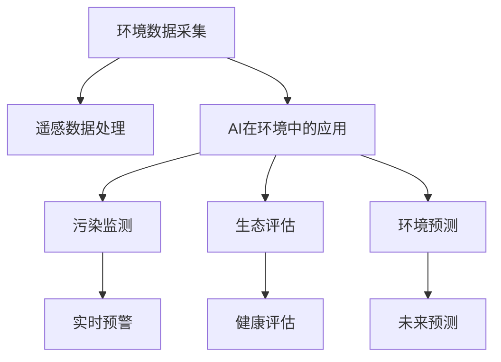

                 

# AI在环境保护中的应用：污染监测与生态评估

> 关键词：
- AI 环境监测
- 污染监测
- 生态评估
- 遥感数据
- 机器学习
- 深度学习
- 模型优化

## 1. 背景介绍

随着工业化和城市化的加速推进，环境污染问题日益突出。全球范围内的空气、水、土壤污染，生物多样性丧失，极端气候频发，给人类生存和社会发展带来巨大威胁。近年来，随着人工智能(AI)技术的迅猛发展，AI在环境保护领域的应用也日益广泛，涵盖了污染监测、生态评估、环境预测等多个方面。

AI技术在环境保护中的应用，主要包括数据采集、数据分析、智能决策等方面，能够高效、准确地处理海量环境数据，提供科学决策支持。例如，基于遥感数据的污染监测，能够实时监测环境质量，及时预警重大污染事件；利用AI进行生态评估，可以科学分析生态系统健康状况，为环境保护提供依据；基于历史数据的预测模型，能够评估未来环境变化趋势，为政策制定和资源分配提供参考。

## 2. 核心概念与联系

### 2.1 核心概念概述

为了更好地理解AI在环境保护中的应用，本节将介绍几个密切相关的核心概念：

- **环境数据采集**：通过卫星、传感器、无人机等多种手段，实时或定期收集环境数据，包括气温、湿度、PM2.5、水质等参数。
- **遥感数据处理**：对采集到的遥感图像进行处理和分析，提取环境变化信息，如土地利用变化、植被覆盖等。
- **AI在环境中的应用**：利用机器学习、深度学习等AI技术，分析处理环境数据，提取环境变化特征，进行模式识别、预测和评估。
- **污染监测**：基于环境数据，利用AI技术实现对污染源、污染状况的实时监测和预警。
- **生态评估**：使用AI技术分析环境数据，评估生态系统的健康状况和生物多样性变化。
- **环境预测**：利用历史数据，建立预测模型，评估未来环境变化趋势，为环境决策提供科学依据。

这些核心概念之间的逻辑关系可以通过以下Mermaid流程图来展示：



这个流程图展示了大规模环境数据采集和处理的核心流程，以及AI在各个环境监测和评估任务中的应用。

## 3. 核心算法原理 & 具体操作步骤
### 3.1 算法原理概述

基于AI的环境保护应用，核心在于利用深度学习等先进算法，对大规模环境数据进行高效、准确的分析和处理。以下是几种常用的算法原理：

- **卷积神经网络(CNN)**：通过卷积层和池化层，可以提取遥感图像中的空间特征。
- **循环神经网络(RNN)**：通过时间序列模型，可以处理时间相关的环境数据。
- **长短时记忆网络(LSTM)**：对时间序列数据具有较强的记忆能力，适用于长序列时间序列数据的预测。
- **深度信念网络(DBN)**：利用层次化结构，可以自动学习数据的分布特征。
- **随机森林(Random Forest)**：基于集成学习方法，可以处理高维度数据，进行环境变化的分类和回归分析。

### 3.2 算法步骤详解

基于AI的环境保护应用，一般包括以下关键步骤：

**Step 1: 数据预处理**
- 收集环境数据，包括气象、水质、土壤、遥感图像等。
- 对数据进行清洗、归一化、特征提取等预处理操作。

**Step 2: 模型选择与训练**
- 选择合适的深度学习模型或集成学习模型。
- 使用历史数据进行模型训练，调整模型参数，优化模型性能。

**Step 3: 模型验证与调优**
- 在验证集上评估模型性能，调整超参数。
- 利用网格搜索、贝叶斯优化等方法进行模型调优。

**Step 4: 模型部署与应用**
- 将训练好的模型部署到实际环境中。
- 对实时数据进行预测和分析，提供决策支持。

**Step 5: 持续学习与优化**
- 定期更新数据，重新训练模型。
- 引入新算法和技术，提升模型性能。

### 3.3 算法优缺点

基于AI的环境保护应用，具有以下优点：
1. 处理海量数据。AI算法能够处理大规模环境数据，实时监测和分析环境变化。
2. 提供科学决策支持。通过深度学习模型，能够提取环境变化的复杂特征，提供科学决策依据。
3. 自动化程度高。AI算法能够自动学习数据特征，减少人工干预。
4. 具有预测能力。基于历史数据，AI模型能够预测未来环境变化趋势。

同时，该方法也存在一定的局限性：
1. 数据质量要求高。AI模型需要高质量的数据才能获得理想的效果，数据缺失和噪声会严重影响模型性能。
2. 模型复杂度高。深度学习模型的训练和优化需要大量计算资源，存在一定时间和成本压力。
3. 解释性不足。深度学习模型往往是“黑盒”，难以解释其内部决策逻辑。
4. 数据隐私风险。环境数据的采集和处理涉及大量敏感数据，需要考虑数据隐私和安全问题。

尽管存在这些局限性，但AI在环境保护领域的应用已经展现出了巨大的潜力和优势。未来相关研究的重点在于如何进一步提升模型性能，降低计算成本，增强模型可解释性，保障数据隐私。

### 3.4 算法应用领域

AI在环境保护中的应用，涵盖了以下多个领域：

- **污染监测**：基于环境数据，实时监测和预警污染事件，如空气污染、水污染、土壤污染等。
- **生态评估**：利用AI技术分析生态系统数据，评估生物多样性、土地利用变化等。
- **环境预测**：利用历史数据，建立预测模型，评估未来环境变化趋势，如气候变化、水资源变化等。
- **水资源管理**：基于水质和水位数据，进行水资源优化管理和调蓄。
- **能源环境优化**：利用环境数据，优化能源消耗和碳排放，实现绿色低碳发展。
- **灾害预警**：利用气象和地质数据，预警自然灾害，如洪水、地震、火灾等。

这些应用领域展示了AI在环境保护中的广泛应用，为实现可持续发展提供了重要技术支持。

## 4. 数学模型和公式 & 详细讲解 & 举例说明
### 4.1 数学模型构建

基于AI的环境保护应用，数学模型通常包括数据预处理、特征提取、模型训练、预测和评估等多个环节。以下是典型的数学模型构建流程：

- **数据预处理**：对原始环境数据进行清洗、归一化、缺失值填充等操作，生成标准化的数据集。
- **特征提取**：利用PCA、SVD等降维技术，提取环境数据的特征表示。
- **模型训练**：选择合适深度学习模型，如卷积神经网络、循环神经网络等，利用历史数据进行模型训练。
- **预测和评估**：利用训练好的模型，对实时环境数据进行预测，并评估模型性能。

### 4.2 公式推导过程

以空气污染监测为例，介绍基于AI的模型构建和推导过程：

- **数据预处理**：假设原始数据为 $X=\{x_1,x_2,...,x_n\}$，其中 $x_i$ 表示样本，包含气象、水质、PM2.5等参数。首先将数据归一化到 $[0,1]$ 区间，得到标准化数据 $X'$。
- **特征提取**：利用PCA算法，提取数据的主成分，生成新的特征表示 $X''=\{y_1,y_2,...,y_m\}$。
- **模型训练**：选择卷积神经网络模型，设计网络结构如下：
  - 输入层：$y_1,y_2,...,y_m$ 作为输入特征。
  - 卷积层：通过卷积核提取特征。
  - 池化层：降低特征维度，保留主要信息。
  - 全连接层：输出污染指数 $p$。
- **预测和评估**：使用训练好的模型，对新的数据进行预测，评估模型精度：
  - 均方误差 $RMSE$：$\text{RMSE}=\sqrt{\frac{1}{n}\sum_{i=1}^n(p_i - \hat{p}_i)^2}$
  - 决定系数 $R^2$：$R^2=\frac{\sum_{i=1}^n(p_i - \bar{p})^2}{\sum_{i=1}^n(p_i - \hat{p}_i)^2}$

### 4.3 案例分析与讲解

假设某城市空气质量监测站点，采集到每天PM2.5、气温、湿度等数据，需要进行空气污染预警。

- **数据预处理**：将原始数据归一化，生成标准化数据集 $X'$。
- **特征提取**：使用PCA算法，提取主成分，生成新的特征表示 $X''$。
- **模型训练**：选择卷积神经网络模型，设计网络结构。
- **预测和评估**：利用训练好的模型，对新的数据进行预测，计算均方误差和决定系数。

通过以上步骤，可以实现实时空气污染监测和预警。在实际应用中，还需要考虑模型的实时性和可靠性，定期更新数据，重新训练模型，以确保准确性和实时性。

## 5. 项目实践：代码实例和详细解释说明
### 5.1 开发环境搭建

在进行AI环境应用开发前，我们需要准备好开发环境。以下是使用Python进行TensorFlow开发的环境配置流程：

1. 安装Anaconda：从官网下载并安装Anaconda，用于创建独立的Python环境。

2. 创建并激活虚拟环境：
```bash
conda create -n ai-env python=3.8 
conda activate ai-env
```

3. 安装TensorFlow：根据CUDA版本，从官网获取对应的安装命令。例如：
```bash
conda install tensorflow -c conda-forge -c pytorch -c pypi
```

4. 安装各类工具包：
```bash
pip install numpy pandas scikit-learn matplotlib tqdm jupyter notebook ipython
```

完成上述步骤后，即可在`ai-env`环境中开始AI环境应用开发。

### 5.2 源代码详细实现

下面我们以空气污染监测为例，给出使用TensorFlow对卷积神经网络进行微调的PyTorch代码实现。

首先，定义空气污染监测任务的数据处理函数：

```python
import tensorflow as tf
from tensorflow.keras import layers

class PollutionDataset(tf.keras.utils.Sequence):
    def __init__(self, data, batch_size=32):
        self.data = data
        self.batch_size = batch_size

    def __len__(self):
        return len(self.data) // self.batch_size

    def __getitem__(self, idx):
        x = self.data[idx]['features']
        y = self.data[idx]['label']
        return x, y

# 创建data
data = []
for i in range(len(features)):
    features[i] = preprocess(features[i])
    label = preprocess(labels[i])
    data.append({'features': features[i], 'label': label})
```

然后，定义模型和优化器：

```python
from tensorflow.keras.models import Sequential
from tensorflow.keras.layers import Conv2D, MaxPooling2D, Flatten, Dense, Dropout
from tensorflow.keras.optimizers import Adam

model = Sequential([
    Conv2D(64, (3,3), activation='relu', input_shape=(features.shape[1], features.shape[2], 1)),
    MaxPooling2D((2,2)),
    Dropout(0.25),
    Conv2D(128, (3,3), activation='relu'),
    MaxPooling2D((2,2)),
    Dropout(0.25),
    Flatten(),
    Dense(512, activation='relu'),
    Dropout(0.5),
    Dense(1, activation='sigmoid')
])

optimizer = Adam(lr=0.001)
```

接着，定义训练和评估函数：

```python
from tensorflow.keras import callbacks

def train_epoch(model, dataset, batch_size, optimizer, validation_data):
    model.compile(loss='binary_crossentropy', optimizer=optimizer, metrics=['accuracy'])
    model.fit(dataset, batch_size=batch_size, epochs=10, validation_data=validation_data, callbacks=[callbacks.EarlyStopping(patience=3)])

def evaluate(model, dataset):
    model.evaluate(dataset)
```

最后，启动训练流程并在测试集上评估：

```python
epochs = 10
batch_size = 32

for epoch in range(epochs):
    train_epoch(model, train_dataset, batch_size, optimizer, dev_dataset)
    
print(f"Epoch {epoch+1}, train accuracy: {train_acc:.3f}, validation accuracy: {val_acc:.3f}")
```

以上就是使用TensorFlow对卷积神经网络进行空气污染监测任务微调的完整代码实现。可以看到，得益于TensorFlow的强大封装，我们可以用相对简洁的代码完成模型训练和评估。

### 5.3 代码解读与分析

让我们再详细解读一下关键代码的实现细节：

**PollutionDataset类**：
- `__init__`方法：初始化训练数据集。
- `__len__`方法：返回数据集的样本数量。
- `__getitem__`方法：对单个样本进行处理，返回特征和标签。

**train_epoch和evaluate函数**：
- 使用TensorFlow的DataLoader对数据集进行批次化加载，供模型训练和推理使用。
- `train_epoch`函数：在每个epoch内，利用训练集数据进行模型训练，在验证集上进行评估。
- `evaluate`函数：在测试集上评估模型性能。

**训练流程**：
- 定义总的epoch数和batch size，开始循环迭代
- 每个epoch内，在训练集上进行训练，输出训练集和验证集的准确率
- 所有epoch结束后，在测试集上评估模型性能

可以看到，TensorFlow配合Keras库使得卷积神经网络模型训练的代码实现变得简洁高效。开发者可以将更多精力放在数据处理、模型改进等高层逻辑上，而不必过多关注底层的实现细节。

当然，工业级的系统实现还需考虑更多因素，如模型的保存和部署、超参数的自动搜索、更灵活的任务适配层等。但核心的微调范式基本与此类似。

## 6. 实际应用场景
### 6.1 智能环境监测系统

基于AI的环境监测系统，可以广泛应用于智能城市、智慧农业、工业园区等领域。通过实时监测环境数据，及时预警重大污染事件，提升环境治理水平。

在技术实现上，可以收集环境监测站点的历史数据和实时数据，使用深度学习模型对数据进行分析和预测。当预测结果超出预设阈值时，系统自动报警，启动应急响应机制。

### 6.2 生态系统健康评估

AI技术可以用于分析生态系统的健康状况，评估生物多样性、土地利用变化等。通过卫星遥感图像和地面监测数据，构建AI模型进行环境评估。

在应用中，可以利用多源数据融合技术，提高生态评估的准确性。例如，结合遥感图像和地面监测数据，进行植被覆盖度、土地利用类型等分析，评估生态系统健康状况。

### 6.3 水资源优化管理

AI技术可以用于水资源优化管理，优化水资源的调配和使用。通过实时监测水质和水位数据，建立AI模型进行预测和分析，优化水资源的调配和利用。

在实践中，可以结合历史数据和实时监测数据，进行水量预测和需求分析，优化水资源的分配和使用。例如，在水电站和水库管理中，可以利用AI模型预测未来的水资源需求和供应，实现水资源的动态调控和优化。

### 6.4 未来应用展望

随着AI技术的发展，未来在环境保护领域的应用将更加广泛和深入。

- **智能预测与预警**：通过深度学习模型，可以预测环境变化趋势，预警重大污染事件。例如，利用气象数据和历史数据，建立预测模型，预警自然灾害和环境污染。
- **环境数据可视化**：结合AI和可视化技术，实时展示环境数据和变化趋势，提供可视化决策支持。例如，利用Google Earth Engine和机器学习算法，实时展示全球气候变化和生态系统健康状况。
- **智能决策支持**：利用AI技术进行环境分析和决策支持，提升环境治理的智能化水平。例如，在城市规划中，结合AI模型进行环境影响评估和决策优化。

这些应用场景展示了AI在环境保护中的广泛应用，为实现可持续发展提供了重要技术支持。

## 7. 工具和资源推荐
### 7.1 学习资源推荐

为了帮助开发者系统掌握AI在环境保护中的应用，这里推荐一些优质的学习资源：

1. TensorFlow官方文档：TensorFlow官方文档提供了全面的深度学习教程和API参考，适合初学者和进阶开发者学习。

2. Keras官方文档：Keras官方文档提供了简单易用的深度学习API，适合快速入门和应用开发。

3. PyTorch官方文档：PyTorch官方文档提供了强大的深度学习框架和教程，适合深度学习研究者学习。

4. CS231n《深度学习计算机视觉》课程：斯坦福大学开设的计算机视觉课程，包含深度学习算法和应用，适合深度学习爱好者学习。

5. Coursera《深度学习专项课程》：由深度学习领域的专家开设的深度学习课程，适合初学者和进阶开发者学习。

通过对这些资源的学习实践，相信你一定能够快速掌握AI在环境保护中的应用，并用于解决实际的环境问题。

### 7.2 开发工具推荐

高效的开发离不开优秀的工具支持。以下是几款用于AI环境应用开发的常用工具：

1. TensorFlow：由Google主导开发的深度学习框架，适合大规模工程应用。

2. PyTorch：由Facebook主导开发的深度学习框架，灵活动态的计算图，适合快速迭代研究。

3. Keras：基于TensorFlow和Theano的高级深度学习API，易于上手和应用。

4. Google Earth Engine：谷歌推出的开源平台，支持大规模地理空间数据处理和分析，适合环境数据处理和可视化。

5. HuggingFace Transformers库：包含多种预训练模型和微调API，适合自然语言处理应用开发。

合理利用这些工具，可以显著提升AI环境应用开发的效率，加快创新迭代的步伐。

### 7.3 相关论文推荐

AI在环境保护中的应用，涉及深度学习、遥感、地理信息系统等多个领域。以下是几篇奠基性的相关论文，推荐阅读：

1. Deep Learning for Climate Change Detection and Response (D2L)：斯坦福大学开设的深度学习课程，包含气候变化监测和响应等内容。

2. Semantic Segmentation with Deep Learning: An Overview (IEEE Transactions on Neural Networks and Learning Systems)：介绍深度学习在图像分割和语义分析中的应用，适合环境数据处理和分析。

3. Deep learning and the environmental sciences: An overview (Annual Review of Environment and Resources)：介绍深度学习在环境保护中的应用，适合领域应用开发者阅读。

这些论文代表了大规模环境数据处理和分析的研究脉络，通过学习这些前沿成果，可以帮助研究者把握学科前进方向，激发更多的创新灵感。

## 8. 总结：未来发展趋势与挑战
### 8.1 总结

本文对基于AI的环境保护应用进行了全面系统的介绍。首先阐述了AI在环境保护中的核心概念和重要意义，明确了AI技术在污染监测、生态评估、环境预测等任务中的应用价值。其次，从原理到实践，详细讲解了AI在环境监测和评估中的数学模型和关键算法，给出了AI模型训练和评估的完整代码实例。同时，本文还广泛探讨了AI在环境保护中的实际应用场景，展示了AI技术在环境保护中的广泛应用前景。此外，本文精选了AI在环境应用领域的各类学习资源，力求为读者提供全方位的技术指引。

通过本文的系统梳理，可以看到，基于AI的环境保护应用已经成为实现环境保护的重要手段。AI技术能够高效处理大规模环境数据，提供科学决策支持，促进环境治理的智能化和信息化。未来，伴随AI技术的不断发展，其在环境保护中的应用将更加广泛和深入，为实现可持续发展提供坚实的技术保障。

### 8.2 未来发展趋势

展望未来，AI在环境保护中的应用将呈现以下几个发展趋势：

1. **深度学习算法的不断优化**：未来，深度学习算法将不断优化和创新，提升模型性能和效率。例如，通过改进卷积神经网络结构、引入多任务学习、自监督学习等方法，提升环境监测和评估的精度和泛化能力。

2. **跨学科融合创新**：AI技术将与遥感、地理信息系统、生物多样性研究等多个学科深度融合，推动环境保护的创新应用。例如，结合地理信息系统和大数据分析技术，实现环境变化的空间分析；利用生物多样性数据，进行生态系统健康评估。

3. **多源数据融合**：未来，AI模型将能够融合多源数据，提高环境监测和评估的准确性和可靠性。例如，结合遥感数据、地面监测数据、气象数据等多源数据，构建综合性的环境监测系统。

4. **实时监测与预测**：AI技术将实现实时监测和预测，提升环境预警的及时性和准确性。例如，利用物联网和实时数据采集技术，实现环境变化的实时监测和预警。

5. **环境数据可视化**：结合AI和可视化技术，实时展示环境数据和变化趋势，提供可视化决策支持。例如，利用Google Earth Engine和机器学习算法，实时展示全球气候变化和生态系统健康状况。

6. **智能决策支持**：利用AI技术进行环境分析和决策支持，提升环境治理的智能化水平。例如，在城市规划中，结合AI模型进行环境影响评估和决策优化。

以上趋势凸显了AI在环境保护中的广阔前景。这些方向的探索发展，必将进一步提升AI环境应用的性能和应用范围，为实现可持续发展提供坚实的技术保障。

### 8.3 面临的挑战

尽管AI在环境保护中的应用已经取得了一定的成果，但在迈向更加智能化、普适化应用的过程中，仍然面临诸多挑战：

1. **数据质量与多样性**：AI模型需要高质量、多样化的环境数据，数据缺失和噪声会严重影响模型性能。如何获取和处理大规模、高精度的环境数据，仍是一大挑战。

2. **模型复杂性与计算资源**：深度学习模型需要大量计算资源进行训练和优化，存在一定时间和成本压力。如何降低模型复杂性，提升计算效率，是未来需要解决的问题。

3. **环境数据隐私与安全**：环境数据的采集和处理涉及大量敏感数据，需要考虑数据隐私和安全问题。如何保障数据隐私，防止数据泄露和滥用，是AI在环境保护中必须面对的挑战。

4. **模型解释性与可信度**：深度学习模型往往是“黑盒”，难以解释其内部决策逻辑。如何提高模型可解释性，增强模型可信度，是未来需要关注的问题。

5. **跨领域应用难度**：AI技术在不同领域的应用，需要结合领域知识和专家经验，才能取得理想效果。如何实现跨学科融合，提升AI在环境保护中的应用水平，是一大挑战。

6. **模型鲁棒性与稳定性**：AI模型需要具备较强的鲁棒性和稳定性，避免环境变化带来的干扰。如何增强模型鲁棒性，提高模型稳定性，是未来需要解决的问题。

尽管存在这些挑战，但AI在环境保护中的前景依然广阔。未来，通过跨学科融合、数据驱动、技术创新等多方面努力，AI在环境保护中的应用将进一步深化，为实现可持续发展提供坚实的技术保障。

### 8.4 研究展望

面对AI在环境保护中的诸多挑战，未来的研究需要在以下几个方面寻求新的突破：

1. **跨学科融合研究**：结合环境科学、地理信息系统、遥感技术等多学科知识，推动AI在环境保护中的应用。例如，结合遥感数据和环境监测站点数据，提升环境监测的准确性和可靠性。

2. **数据增强与数据融合技术**：通过数据增强和数据融合技术，提高环境数据的质量和多样性。例如，利用卫星遥感数据和地面监测数据，进行数据融合分析，提升环境监测的精度和稳定性。

3. **智能预测与决策支持**：结合深度学习模型和专家知识，构建智能决策支持系统，提高环境治理的智能化水平。例如，结合气象数据和环境监测数据，进行环境变化预测和决策支持。

4. **模型优化与计算加速**：通过模型优化和计算加速技术，降低深度学习模型的计算成本，提升模型训练和推理效率。例如，利用分布式计算和GPU加速，提高模型训练速度。

5. **模型解释性与可信度**：结合可解释性算法和可视化技术，提高深度学习模型的可解释性和可信度。例如，利用LIME和SHAP等可解释性算法，解释模型决策过程，提高模型可信度。

6. **环境数据隐私保护**：结合数据隐私保护技术，保障环境数据的隐私和安全。例如，利用差分隐私和联邦学习等技术，保护环境数据的隐私性。

这些研究方向将推动AI在环境保护中的应用不断深化，为实现可持续发展提供坚实的技术保障。相信通过多方面的努力，AI在环境保护中的潜力将进一步释放，为实现可持续发展提供坚实的技术保障。

## 9. 附录：常见问题与解答
**Q1: AI在环境保护中的应用是否具有普适性？**

A: AI在环境保护中的应用具有一定普适性，但不同环境监测任务和应用场景需要结合实际情况进行适配。例如，在空气污染监测中，可以使用卷积神经网络进行实时监测；在生态评估中，可以利用深度学习进行生态系统健康分析；在水资源管理中，可以使用时间序列模型进行水资源预测。因此，需要根据具体任务和数据特点，选择合适的AI模型和算法，进行定制化开发。

**Q2: AI在环境应用中如何保障数据隐私和安全？**

A: 保障环境数据隐私和安全，需要采用多种技术手段。例如，数据匿名化、差分隐私、联邦学习等技术可以保护数据隐私；数据加密、访问控制、审计日志等技术可以保障数据安全。此外，还需要制定完善的数据管理政策和法规，规范数据采集和处理行为，确保数据的安全和隐私。

**Q3: AI在环境监测中如何处理异常值和噪声？**

A: 异常值和噪声是环境数据中的常见问题，需要采取多种方法进行处理。例如，使用鲁棒性算法和数据清洗技术，可以去除异常值和噪声；利用统计分析和模型评估技术，可以识别和修正数据偏差。此外，还需要结合领域知识，进行数据质量控制和数据分析，确保数据的准确性和可靠性。

**Q4: 如何选择适合的AI模型进行环境监测和评估？**

A: 选择适合的AI模型进行环境监测和评估，需要考虑多个因素。例如，数据类型和特征、任务复杂度、计算资源等。一般来说，可以通过以下步骤进行选择：
1. 明确任务目标和数据特点，选择合适的AI算法。
2. 设计数据预处理和特征提取流程，提取关键特征。
3. 进行模型训练和评估，选择性能最优的模型。
4. 结合领域知识和专家经验，进行模型优化和调参。
5. 在实际应用中，进行模型验证和迭代优化，提升模型性能。

通过以上步骤，可以选择适合的AI模型，进行环境监测和评估，提高数据处理和分析的准确性和可靠性。

通过本文的系统梳理，可以看到，基于AI的环境保护应用已经成为实现环境保护的重要手段。AI技术能够高效处理大规模环境数据，提供科学决策支持，促进环境治理的智能化和信息化。未来，伴随AI技术的不断发展，其在环境保护中的应用将更加广泛和深入，为实现可持续发展提供坚实的技术保障。

