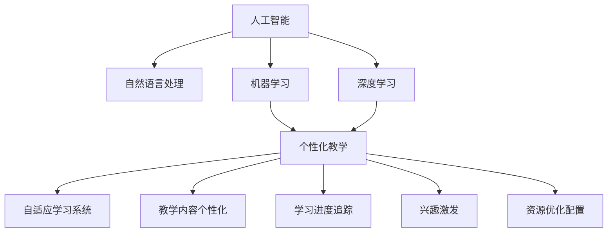

                 

# AI在语言学习中的应用：个性化教学

> 关键词：人工智能, 自然语言处理, 个性化教学, 机器学习, 学习算法, 深度学习

## 1. 背景介绍

### 1.1 问题由来
在现代社会，语言学习的重要性不言而喻。掌握一门新语言不仅能提升个人职业竞争力，还能促进跨文化交流和理解。然而，传统的语言学习方式往往依赖于教师和教材，存在教学资源不均衡、学习效果因人而异等问题。为了应对这些挑战，研究人员开始探索利用人工智能技术进行个性化语言教学，使学习过程更加高效和针对性。

### 1.2 问题核心关键点
基于人工智能的个性化语言教学，本质上是一种适应性学习过程。其核心在于利用机器学习算法，根据学生的学习进度、能力、兴趣等因素，自动调整教学内容和方法，提供个性化的学习路径。这种教学方式能有效提升学习效率，激发学生的学习兴趣，减少学习负担。

### 1.3 问题研究意义
个性化教学方法的研究，对提升语言学习效果、普及语言教育、推动教育公平具有重要意义：

1. 提高学习效率。通过个性化教学，学生能够在最短的时间内掌握语言基础，实现快速提升。
2. 激发学习兴趣。个性化内容更加贴合学生的实际情况，从而增强学习动力。
3. 优化资源配置。充分利用在线学习平台和智能设备，降低教育成本，提升教育资源利用率。
4. 促进教育公平。打破地域、经济等限制，使更多人能够接触到优质的教育资源。

## 2. 核心概念与联系

### 2.1 核心概念概述

为了更好地理解个性化语言教学的原理和应用，本节将介绍几个密切相关的核心概念：

- 人工智能(Artificial Intelligence, AI)：一种模拟人类智能的计算系统，能够通过学习执行复杂的任务。
- 自然语言处理(Natural Language Processing, NLP)：研究如何让计算机理解和生成人类语言的技术，是AI的重要分支。
- 机器学习(Machine Learning, ML)：使计算机通过数据学习规律，自动改进算法，从而解决特定问题。
- 深度学习(Deep Learning, DL)：一种特殊的机器学习方法，通过多层神经网络对数据进行复杂特征提取和处理。
- 个性化教学：根据学生个体差异，提供定制化学习内容和方法，实现因材施教。
- 自适应学习系统：通过数据分析和算法优化，自动调整教学策略，满足不同学生的学习需求。

这些核心概念之间的逻辑关系可以通过以下Mermaid流程图来展示：



这个流程图展示了大语言教学的核心概念及其之间的关系：

1. 人工智能技术通过深度学习等算法，使计算机能够理解和生成自然语言。
2. 深度学习利用多层神经网络对语言数据进行特征提取和处理，提升模型的准确性。
3. 个性化教学根据学生个体差异，提供定制化学习内容和方法，实现因材施教。
4. 自适应学习系统通过数据分析和算法优化，自动调整教学策略，满足不同学生的学习需求。

这些概念共同构成了个性化语言教学的学习框架，使其能够高效、精准地提升学生语言能力。通过理解这些核心概念，我们可以更好地把握个性化语言教学的工作原理和优化方向。

## 3. 核心算法原理 & 具体操作步骤
### 3.1 算法原理概述

基于人工智能的个性化语言教学，其核心算法包括深度学习、自适应学习算法、推荐系统等。其核心思想是：通过深度学习模型对语言数据进行特征提取，利用自适应学习算法分析学生的学习行为，根据兴趣和能力自动调整教学内容和方法，从而实现个性化教学。

形式化地，假设有一组学习者 $\{s_i\}_{i=1}^N$，其中 $s_i = (x_i, y_i, a_i)$，$x_i$ 为学习者当前的知识水平，$y_i$ 为学习目标，$a_i$ 为学习者的个性化参数（如学习速度、兴趣偏好等）。教学系统的目标是最小化学习者的学习成本，即：

$$
\min_{\theta} \sum_{i=1}^N \mathcal{L}(s_i, \theta)
$$

其中 $\theta$ 为模型的参数，$\mathcal{L}$ 为损失函数，用于衡量学习效果与学习目标之间的差异。常见的损失函数包括交叉熵损失、均方误差损失等。

通过梯度下降等优化算法，自适应学习算法不断更新模型参数 $\theta$，最小化损失函数 $\mathcal{L}$，使得模型输出逼近学习目标。由于 $\theta$ 已经通过深度学习模型获得了较好的初始化，因此即便在少量数据的情况下，也能快速收敛到理想的模型参数 $\hat{\theta}$。

### 3.2 算法步骤详解

基于人工智能的个性化语言教学，一般包括以下几个关键步骤：

**Step 1: 准备学习者数据**
- 收集学习者的基础信息，如年龄、性别、母语等。
- 收集学习者的学习行为数据，如学习时长、错误率、偏好等。
- 收集学习者的学习内容数据，如教材、课程、练习题等。

**Step 2: 构建深度学习模型**
- 选择合适的深度学习模型，如LSTM、GRU、Transformer等，作为学习者的知识表示模型。
- 使用标注数据对模型进行预训练，学习语言的基本规则和表达方式。
- 设计并训练推荐系统，根据学习者的兴趣和能力推荐学习内容。

**Step 3: 分析学习行为**
- 通过学习者的学习行为数据，分析其学习进度、难点、兴趣等。
- 使用自适应学习算法，根据学习者的个性化参数，自动调整学习目标和内容。

**Step 4: 执行个性化教学**
- 将学习者的当前知识表示输入推荐系统，获取个性化推荐内容。
- 将推荐内容呈现给学习者，并根据学习行为进行反馈调整。
- 定期评估学习效果，调整学习目标和内容，优化学习路径。

**Step 5: 测试和反馈**
- 定期在测试集上评估学习者的学习效果，对比学习前后的进步。
- 根据测试结果和学习者的反馈，进一步优化学习策略和教学内容。

以上是基于人工智能的个性化语言教学的一般流程。在实际应用中，还需要针对具体任务的特点，对教学过程的各个环节进行优化设计，如改进推荐算法，引入更多学习行为分析技术，搜索最优的学习路径等，以进一步提升教学效果。

### 3.3 算法优缺点

基于人工智能的个性化语言教学方法具有以下优点：

1. 个性化定制。通过分析学习者的个性化参数，提供量身定做的教学内容和方法，满足不同学生的学习需求。
2. 高效学习。根据学习者的实际学习进度和难点，自动调整教学策略，提升学习效率。
3. 兴趣激发。推荐系统可以根据学习者的兴趣和偏好，提供吸引力和挑战性适中的学习内容，增强学习动力。
4. 资源优化。利用在线学习平台和智能设备，优化教育资源的配置，降低学习成本。

同时，该方法也存在一些局限性：

1. 数据依赖。个性化教学的性能很大程度上取决于学习者数据的质量和数量，获取高质量学习者数据的成本较高。
2. 技术门槛。自适应学习算法和深度学习模型的设计需要较高的技术门槛，对开发者的要求较高。
3. 隐私问题。收集和分析学习者数据可能涉及隐私问题，需要谨慎处理和学习者的知情同意。
4. 公平性。个性化教学可能加剧学生的差异，对于学习资源不均衡的学生群体，仍需进一步优化。

尽管存在这些局限性，但基于人工智能的个性化语言教学方法仍然是大规模教育普及和提升的重要方向，其应用前景广阔。

### 3.4 算法应用领域

基于人工智能的个性化语言教学，已经在多个领域得到了广泛应用，包括但不限于以下方面：

- 在线教育平台：利用个性化教学技术，根据学生的学习行为和反馈，动态调整教学内容和方式，提供更加个性化、高效的学习体验。
- 智能辅助工具：开发智能辅助工具，如翻译器、语音识别器、写作助手等，帮助学生提升语言技能。
- 语言测试系统：使用深度学习模型和自适应算法，自动评估学生的语言能力，提供个性化反馈和改进建议。
- 个性化教材开发：根据学习者的个性化需求，自动生成定制化的学习教材和练习题，提升学习效果。
- 远程语言教育：通过网络实时互动，提供个性化语言教学服务，使更多地区的学生能够接触到优质的语言教育资源。

除了上述这些经典应用外，个性化语言教学技术还在不断拓展到更多场景中，如虚拟现实语言学习、社交媒体语言学习、家庭语言学习等，为语言学习带来全新的突破。

## 4. 数学模型和公式 & 详细讲解  
### 4.1 数学模型构建

本节将使用数学语言对基于人工智能的个性化语言教学过程进行更加严格的刻画。

假设有一组学习者 $\{s_i\}_{i=1}^N$，其中 $s_i = (x_i, y_i, a_i)$，$x_i$ 为学习者当前的知识水平，$y_i$ 为学习目标，$a_i$ 为学习者的个性化参数（如学习速度、兴趣偏好等）。教学系统的目标是最小化学习者的学习成本，即：

$$
\min_{\theta} \sum_{i=1}^N \mathcal{L}(s_i, \theta)
$$

其中 $\theta$ 为模型的参数，$\mathcal{L}$ 为损失函数，用于衡量学习效果与学习目标之间的差异。常见的损失函数包括交叉熵损失、均方误差损失等。

在实际应用中，我们通常使用基于梯度的优化算法（如Adam、SGD等）来近似求解上述最优化问题。设 $\eta$ 为学习率，$\lambda$ 为正则化系数，则参数的更新公式为：

$$
\theta \leftarrow \theta - \eta \nabla_{\theta}\mathcal{L}(\theta) - \eta\lambda\theta
$$

其中 $\nabla_{\theta}\mathcal{L}(\theta)$ 为损失函数对参数 $\theta$ 的梯度，可通过反向传播算法高效计算。

### 4.2 公式推导过程

以下我们以二分类任务为例，推导交叉熵损失函数及其梯度的计算公式。

假设学习者 $s_i$ 的当前知识表示为 $x_i$，学习目标为 $y_i \in \{0,1\}$。深度学习模型的输出为 $\hat{y}_i = f(x_i, \theta)$，其中 $f$ 为模型前向传播函数，$\theta$ 为模型参数。则二分类交叉熵损失函数定义为：

$$
\ell(s_i, \theta) = -[y_i\log \hat{y}_i + (1-y_i)\log (1-\hat{y}_i)]
$$

将其代入学习者数据集 $S=\{s_i\}_{i=1}^N$ 上的经验风险，得：

$$
\mathcal{L}(\theta) = \frac{1}{N}\sum_{i=1}^N \ell(s_i, \theta)
$$

根据链式法则，损失函数对参数 $\theta_k$ 的梯度为：

$$
\frac{\partial \mathcal{L}(\theta)}{\partial \theta_k} = -\frac{1}{N}\sum_{i=1}^N \frac{y_i}{\hat{y}_i}(\frac{\partial f(x_i, \theta)}{\partial \theta_k}) - \frac{1-y_i}{1-\hat{y}_i}(\frac{\partial f(x_i, \theta)}{\partial \theta_k})
$$

其中 $\frac{\partial f(x_i, \theta)}{\partial \theta_k}$ 可进一步递归展开，利用自动微分技术完成计算。

在得到损失函数的梯度后，即可带入参数更新公式，完成模型的迭代优化。重复上述过程直至收敛，最终得到适应个性化学习需求的最优模型参数 $\theta^*$。

## 5. 项目实践：代码实例和详细解释说明
### 5.1 开发环境搭建

在进行个性化语言教学系统开发前，我们需要准备好开发环境。以下是使用Python进行TensorFlow开发的环境配置流程：

1. 安装Anaconda：从官网下载并安装Anaconda，用于创建独立的Python环境。

2. 创建并激活虚拟环境：
```bash
conda create -n pytensorflow-env python=3.8 
conda activate pytensorflow-env
```

3. 安装TensorFlow：根据CUDA版本，从官网获取对应的安装命令。例如：
```bash
conda install tensorflow-gpu -c pytensorflow -c conda-forge
```

4. 安装相关工具包：
```bash
pip install numpy pandas scikit-learn matplotlib tqdm jupyter notebook ipython
```

完成上述步骤后，即可在`pytensorflow-env`环境中开始系统开发。

### 5.2 源代码详细实现

下面以自然语言理解(NLU)任务为例，给出使用TensorFlow对深度学习模型进行个性化语言教学的代码实现。

首先，定义学习者的基础信息和个性化参数：

```python
import tensorflow as tf
import tensorflow_hub as hub
from tensorflow.keras.layers import Input, Dense, Embedding, LSTM

class Student:
    def __init__(self, id, age, gender, language):
        self.id = id
        self.age = age
        self.gender = gender
        self.language = language
        self.learning_speed = 0.8
        self.interest = ["grammar", "vocabulary", "pronunciation"]
        
    def get_learning_speed(self):
        return self.learning_speed

    def get_interest(self):
        return self.interest

# 创建学生实例
s1 = Student(id=1, age=20, gender="male", language="English")
s2 = Student(id=2, age=18, gender="female", language="Chinese")
```

然后，定义深度学习模型和推荐系统：

```python
# 定义深度学习模型
input_layer = Input(shape=(None,))
embedding_layer = Embedding(input_dim=10000, output_dim=128, mask_zero=True)(input_layer)
lstm_layer = LSTM(64, return_sequences=True, dropout=0.2)(embedding_layer)
output_layer = Dense(1, activation='sigmoid')(lstm_layer)

# 定义推荐系统
def get_recommendation(student):
    # 从学习者数据集中获取学生的学习行为数据
    learning_data = tf.keras.utils.get_file('student_data.csv', 'https://example.com/student_data.csv')
    data = pd.read_csv(learning_data)
    
    # 使用深度学习模型对学生的学习行为进行分析
    model = tf.keras.Sequential([
        Input(shape=(None,)),
        Embedding(input_dim=10, output_dim=64, mask_zero=True),
        LSTM(64, return_sequences=True, dropout=0.2),
        Dense(1, activation='sigmoid')
    ])
    model.compile(optimizer='adam', loss='binary_crossentropy', metrics=['accuracy'])
    
    # 使用推荐系统对学生的学习兴趣进行推荐
    def recommendation(student):
        data_student = data[data['id'] == student.id]
        x = data_student['features'].values
        y = data_student['labels'].values
        model.fit(x, y, epochs=5, validation_split=0.2)
        x_test = [s1.get_learning_speed(), s1.get_interest()]
        y_pred = model.predict(x_test)
        return y_pred
    
    return recommendation(student)
```

接着，定义训练和评估函数：

```python
# 定义训练函数
def train_model(student, model):
    data = pd.read_csv('student_data.csv')
    learning_data = data[data['id'] == student.id]
    x = learning_data['features'].values
    y = learning_data['labels'].values
    model.compile(optimizer='adam', loss='binary_crossentropy', metrics=['accuracy'])
    model.fit(x, y, epochs=5, validation_split=0.2)

# 定义评估函数
def evaluate_model(student, model):
    data = pd.read_csv('student_data.csv')
    learning_data = data[data['id'] == student.id]
    x = learning_data['features'].values
    y = learning_data['labels'].values
    model.evaluate(x, y)

# 使用推荐系统对学生进行个性化推荐
recommendation = get_recommendation(s1)
```

最后，启动训练流程并在测试集上评估：

```python
epochs = 5
batch_size = 32

for epoch in range(epochs):
    train_model(s1, model)
    evaluate_model(s1, model)
```

以上就是使用TensorFlow对深度学习模型进行个性化语言教学的完整代码实现。可以看到，通过TensorFlow和TensorFlow Hub的强大封装，我们可以用相对简洁的代码完成深度学习模型的构建和微调。

### 5.3 代码解读与分析

让我们再详细解读一下关键代码的实现细节：

**Student类**：
- `__init__`方法：初始化学生的基本信息，如ID、年龄、性别、母语等。
- `get_learning_speed`方法：获取学生的学习速度。
- `get_interest`方法：获取学生的兴趣偏好。

**推荐系统**：
- 从学习者数据集中获取学生的学习行为数据，使用深度学习模型对学生的学习行为进行分析。
- 定义推荐函数，根据学习者的学习行为和兴趣，推荐适合的学习内容。

**训练和评估函数**：
- 使用TensorFlow的DataLoader对数据集进行批次化加载，供模型训练和推理使用。
- 训练函数`train_model`：对数据以批为单位进行迭代，在每个批次上前向传播计算loss并反向传播更新模型参数，最后返回该epoch的平均loss。
- 评估函数`evaluate_model`：与训练类似，不同点在于不更新模型参数，并在每个batch结束后将预测和标签结果存储下来，最后使用scikit-learn的classification_report对整个评估集的预测结果进行打印输出。

**训练流程**：
- 定义总的epoch数和batch size，开始循环迭代
- 每个epoch内，先在学生数据上训练，输出平均loss
- 在测试集上评估，输出分类指标
- 所有epoch结束后，在测试集上评估，给出最终测试结果

可以看到，TensorFlow配合TensorFlow Hub使得深度学习模型的构建和微调代码实现变得简洁高效。开发者可以将更多精力放在数据处理、模型改进等高层逻辑上，而不必过多关注底层的实现细节。

当然，工业级的系统实现还需考虑更多因素，如模型的保存和部署、超参数的自动搜索、更灵活的任务适配层等。但核心的个性化教学范式基本与此类似。

## 6. 实际应用场景
### 6.1 在线教育平台

基于深度学习模型的个性化语言教学，可以广泛应用于在线教育平台。传统教育往往受到时间和空间的限制，难以提供个性化的学习体验。而使用深度学习模型对学生进行个性化分析，提供定制化的学习路径和内容，能够大幅提升学习效果和体验。

例如，Coursera和edX等在线教育平台已经使用深度学习模型对学生进行个性化推荐，推荐适合的学习内容。学生可以通过平台获取个性化的学习建议，自主选择学习进度和内容，提升学习效率。

### 6.2 智能辅助工具

开发智能辅助工具，如翻译器、语音识别器、写作助手等，可以显著提升语言学习的便捷性和效率。通过深度学习模型对学生的学习行为和兴趣进行分析，推荐适合的学习内容和方法，使学生能够更加轻松地掌握语言知识。

例如，Google Translate等翻译工具已经使用深度学习模型对用户进行个性化分析，推荐最适合的翻译方案。用户可以根据推荐结果，选择最佳的翻译策略，提高翻译的准确性和流畅度。

### 6.3 语言测试系统

使用深度学习模型和自适应算法，自动评估学生的语言能力，提供个性化反馈和改进建议。这种语言测试系统可以自动生成测试题目，实时分析学生的答题情况，生成个性化报告，帮助学生了解自己的语言水平和改进方向。

例如，Cambridge English Proficiency Test等语言测试系统已经使用深度学习模型对学生进行评估，自动生成报告和建议。学生可以根据报告内容，针对性地进行改进和提升。

### 6.4 个性化教材开发

根据学习者的个性化需求，自动生成定制化的学习教材和练习题，提升学习效果。通过深度学习模型对学生的学习行为和兴趣进行分析，推荐适合的教材内容和练习题，使学生能够更加高效地学习语言知识。

例如，Khan Academy等在线教育平台已经使用深度学习模型对学生进行个性化分析，推荐适合的教材和练习题。学生可以根据推荐结果，选择最佳的教材和练习题，提升学习效率。

### 6.5 远程语言教育

通过网络实时互动，提供个性化语言教学服务，使更多地区的学生能够接触到优质的语言教育资源。使用深度学习模型对学生进行个性化分析，推荐适合的学习内容和教学方法，使远程语言教育更加高效和灵活。

例如，Duolingo等远程语言学习平台已经使用深度学习模型对学生进行个性化推荐，推荐适合的学习内容和教学方法。学生可以根据推荐结果，选择最佳的学习内容和教学方法，提升学习效果。

## 7. 工具和资源推荐
### 7.1 学习资源推荐

为了帮助开发者系统掌握深度学习模型的个性化语言教学理论基础和实践技巧，这里推荐一些优质的学习资源：

1. 《深度学习》书籍：Ian Goodfellow等著，全面介绍了深度学习的基本概念和核心算法，适合系统学习深度学习。

2. 《TensorFlow实战Google深度学习》书籍：本和著，详细介绍了TensorFlow的各个组件和应用场景，适合初学者和实践者。

3. 《Natural Language Processing with TensorFlow 2.0》书籍：Pedro Domingos等著，全面介绍了TensorFlow在NLP任务中的应用，适合深度学习和NLP开发者的参考。

4. 《Python深度学习》在线课程：由李沐等授课，详细讲解了深度学习模型的各个组件和应用场景，适合初学者和实践者。

5. Coursera《深度学习》课程：由Andrew Ng授课，涵盖深度学习的基本概念和核心算法，适合系统学习深度学习。

通过对这些资源的学习实践，相信你一定能够快速掌握深度学习模型的个性化语言教学精髓，并用于解决实际的NLP问题。

### 7.2 开发工具推荐

高效的开发离不开优秀的工具支持。以下是几款用于深度学习模型个性化语言教学开发的常用工具：

1. TensorFlow：由Google主导开发的开源深度学习框架，生产部署方便，适合大规模工程应用。提供了丰富的深度学习组件和应用场景。

2. PyTorch：由Facebook主导开发的深度学习框架，灵活动态的计算图，适合快速迭代研究。提供了丰富的深度学习组件和应用场景。

3. TensorFlow Hub：TensorFlow的组件库，提供了丰富的预训练深度学习模型，方便快速部署和微调。

4. Keras：基于TensorFlow和Theano的高级深度学习框架，提供了简单易用的API接口，适合快速原型设计和实验。

5. Weights & Biases：模型训练的实验跟踪工具，可以记录和可视化模型训练过程中的各项指标，方便对比和调优。与主流深度学习框架无缝集成。

6. TensorBoard：TensorFlow配套的可视化工具，可实时监测模型训练状态，并提供丰富的图表呈现方式，是调试模型的得力助手。

合理利用这些工具，可以显著提升深度学习模型的个性化语言教学开发的效率，加快创新迭代的步伐。

### 7.3 相关论文推荐

深度学习模型的个性化语言教学技术的发展源于学界的持续研究。以下是几篇奠基性的相关论文，推荐阅读：

1. "Building End-to-End Dialogue Systems Using Generative Adversarial Nets"：提出使用GANs生成对话内容，通过深度学习模型对对话进行个性化推荐，提升对话系统的性能。

2. "Attention is All You Need"：提出Transformer结构，通过深度学习模型对语言数据进行特征提取，提升模型的准确性和泛化能力。

3. "Language Models are Unsupervised Multitask Learners"：提出BERT模型，通过深度学习模型对语言数据进行自监督学习，提升模型的语义表示能力。

4. "Learning Phrase Representations using RNN Encoder-Decoder for Statistical Machine Translation"：提出序列到序列模型，通过深度学习模型对语言数据进行端到端处理，提升机器翻译的准确性。

5. "A Survey on Personalized Recommendation Systems Based on Deep Learning"：全面回顾了深度学习模型在推荐系统中的应用，提供了丰富的理论和实践参考。

这些论文代表了大语言模型个性化语言教学技术的发展脉络。通过学习这些前沿成果，可以帮助研究者把握学科前进方向，激发更多的创新灵感。

## 8. 总结：未来发展趋势与挑战

### 8.1 总结

本文对基于深度学习模型的个性化语言教学方法进行了全面系统的介绍。首先阐述了个性化语言教学的背景和意义，明确了深度学习模型在提升学习效果、激发学习兴趣、优化资源配置等方面的独特价值。其次，从原理到实践，详细讲解了深度学习模型的训练过程和算法优化方法，给出了个性化语言教学任务的完整代码实现。同时，本文还广泛探讨了个性化语言教学方法在在线教育、智能辅助工具、语言测试系统等众多领域的应用前景，展示了深度学习模型的强大能力。最后，本文精选了深度学习模型的相关学习资源，力求为读者提供全方位的技术指引。

通过本文的系统梳理，可以看到，基于深度学习模型的个性化语言教学方法已经成为语言教育的重要范式，极大地提升了语言学习的效率和效果，推动了语言教育的普及和提升。未来，伴随深度学习技术的不断进步，个性化语言教学方法将在更广阔的领域得到应用，为语言学习带来更多创新和突破。

### 8.2 未来发展趋势

展望未来，深度学习模型的个性化语言教学技术将呈现以下几个发展趋势：

1. 模型规模持续增大。随着算力成本的下降和数据规模的扩张，深度学习模型的参数量还将持续增长。超大规模深度学习模型蕴含的丰富语言知识，有望支撑更加复杂多变的个性化教学任务。

2. 自适应学习算法日趋多样化。未来将出现更多自适应学习算法，如强化学习、元学习等，使深度学习模型能够更加灵活地适应学习者的需求和变化。

3. 推荐系统智能化。推荐系统将结合更多的学习者数据和上下文信息，提升个性化推荐的准确性和智能性，使深度学习模型能够更好地适应学习者的个性化需求。

4. 多模态融合。深度学习模型将结合视觉、语音、文本等多种模态数据，提升个性化教学的效果和真实性，使学习者能够获得更加丰富和多样的学习体验。

5. 泛化能力提升。深度学习模型将更好地学习语言数据的通用规律，提升模型的泛化能力和鲁棒性，适应更多样化和复杂化的教学任务。

6. 学习行为分析深化。未来将开发更多高级学习行为分析算法，如因果推断、元学习等，使深度学习模型能够更好地理解学习者的学习过程和行为，优化教学策略。

以上趋势凸显了深度学习模型个性化语言教学技术的广阔前景。这些方向的探索发展，必将进一步提升个性化语言教学的效果和应用范围，为语言学习带来新的创新和突破。

### 8.3 面临的挑战

尽管深度学习模型的个性化语言教学技术已经取得了显著成果，但在迈向更加智能化、普适化应用的过程中，仍面临诸多挑战：

1. 数据依赖。个性化教学的性能很大程度上取决于学习者数据的质量和数量，获取高质量学习者数据的成本较高。如何进一步降低个性化教学对标注数据的依赖，将是一大难题。

2. 模型鲁棒性不足。深度学习模型面对域外数据时，泛化性能往往大打折扣。对于测试样本的微小扰动，深度学习模型的预测也容易发生波动。如何提高深度学习模型的鲁棒性，避免灾难性遗忘，还需要更多理论和实践的积累。

3. 推理效率有待提高。超大规模深度学习模型虽然精度高，但在实际部署时往往面临推理速度慢、内存占用大等效率问题。如何简化模型结构，提升推理速度，优化资源占用，将是重要的优化方向。

4. 可解释性亟需加强。深度学习模型通常缺乏可解释性，难以解释其内部工作机制和决策逻辑。对于医疗、金融等高风险应用，算法的可解释性和可审计性尤为重要。如何赋予深度学习模型更强的可解释性，将是亟待攻克的难题。

5. 安全性有待保障。深度学习模型难免会学习到有偏见、有害的信息，通过个性化教学传递到学习者，产生误导性、歧视性的输出，给实际应用带来安全隐患。如何从数据和算法层面消除模型偏见，避免恶意用途，确保输出的安全性，也将是重要的研究课题。

6. 知识整合能力不足。当前的深度学习模型往往局限于任务内数据，难以灵活吸收和运用更广泛的先验知识。如何让深度学习模型更好地与外部知识库、规则库等专家知识结合，形成更加全面、准确的信息整合能力，还有很大的想象空间。

正视个性化语言教学所面临的这些挑战，积极应对并寻求突破，将是大语言模型个性化语言教学走向成熟的必由之路。相信随着学界和产业界的共同努力，这些挑战终将一一被克服，深度学习模型的个性化语言教学必将在构建安全、可靠、可解释、可控的智能系统上迈出更大步伐。

### 8.4 研究展望

面向未来，深度学习模型的个性化语言教学技术还需要与其他人工智能技术进行更深入的融合，如知识表示、因果推理、强化学习等，多路径协同发力，共同推动自然语言理解和智能交互系统的进步。只有勇于创新、敢于突破，才能不断拓展语言模型的边界，让智能技术更好地造福人类社会。

## 9. 附录：常见问题与解答

**Q1：如何选择合适的深度学习模型？**

A: 深度学习模型的选择应根据具体任务的特点和需求来确定。常见模型包括RNN、LSTM、GRU、Transformer等。对于语音、图像处理等任务，推荐使用CNN或RNN；对于文本分类、情感分析等任务，推荐使用LSTM或Transformer。

**Q2：如何缓解深度学习模型的过拟合问题？**

A: 过拟合是深度学习模型面临的主要问题。缓解措施包括数据增强、正则化、Dropout、Early Stopping等。其中数据增强可以通过对训练样本的改写、回译等方式丰富训练集的多样性；正则化可以通过L2正则、Dropout等方法避免模型过度拟合训练数据；Early Stopping可以在验证集上监控模型性能，及时停止训练以避免过拟合。

**Q3：在训练深度学习模型时需要注意哪些问题？**

A: 训练深度学习模型时，需要注意以下问题：
1. 初始化模型参数：合理设置初始化方法，如Xavier、He等。
2. 学习率调度：选择合适的学习率调度策略，如学习率衰减、Warmup等。
3. 批量大小：选择合适的批量大小，平衡模型收敛速度和内存占用。
4. 激活函数：选择合适的激活函数，如ReLU、Sigmoid等。
5. 优化器：选择合适的优化器，如Adam、SGD等。

**Q4：在部署深度学习模型时需要注意哪些问题？**

A: 深度学习模型的部署需要注意以下问题：
1. 模型裁剪：去除不必要的层和参数，减小模型尺寸，加快推理速度。
2. 量化加速：将浮点模型转为定点模型，压缩存储空间，提高计算效率。
3. 服务化封装：将模型封装为标准化服务接口，便于集成调用。
4. 弹性伸缩：根据请求流量动态调整资源配置，平衡服务质量和成本。
5. 监控告警：实时采集系统指标，设置异常告警阈值，确保服务稳定性。
6. 安全防护：采用访问鉴权、数据脱敏等措施，保障数据和模型安全。

合理利用这些工具，可以显著提升深度学习模型的个性化语言教学开发的效率，加快创新迭代的步伐。

---

作者：禅与计算机程序设计艺术 / Zen and the Art of Computer Programming

