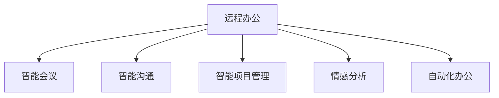

                 

# AI在远程工作中的应用：增强团队协作

## 1. 背景介绍

随着新冠疫情的全球蔓延，远程办公已经成为越来越多企业的主要工作模式。然而，传统办公模式下的许多协作方式在远程工作环境下变得不再适用，如何利用AI技术增强远程团队的协作效率，成为当前企业IT管理者面临的重要课题。AI在远程工作中的应用，可以从智能会议、智能沟通、智能项目管理等多个维度入手，实现远程协作的智能化转型。

## 2. 核心概念与联系

### 2.1 核心概念概述

为更好地理解AI在远程工作中的应用，本节将介绍几个密切相关的核心概念：

- **远程办公(Remote Work/Working)**：指员工无需到实体办公场所，通过互联网、移动设备等工具，完成工作的办公模式。
- **智能会议(Intelligent Meetings)**：利用AI技术，自动记录会议内容、识别关键议题、总结会议纪要等，提升会议效率。
- **智能沟通(Chatbots and AI-Assisted Chat)**：通过智能聊天机器人等工具，自动解答常见问题、推荐相关资料、组织协同任务等，降低沟通成本。
- **智能项目管理(Project Management with AI)**：通过AI算法优化任务分配、监控项目进度、预测风险等，提高项目管理的科学性。
- **情感分析(Emotion Analysis)**：利用AI技术，识别员工情绪状态，及时发现问题、调整工作氛围，提升员工满意度。
- **自动化办公(Automation in Office Work)**：利用AI技术自动化处理日常办公任务，如邮件管理、文档整理、数据分析等，提升办公效率。

这些核心概念之间的逻辑关系可以通过以下Mermaid流程图来展示：



这个流程图展示了几类典型的AI应用场景，以及它们如何共同构建了远程工作的智能化协作环境。

## 3. 核心算法原理 & 具体操作步骤
### 3.1 算法原理概述

AI在远程工作中的应用，主要基于以下几个核心算法和原理：

1. **自然语言处理(NLP)**：利用NLP技术，自动理解和生成人类语言，从而实现智能沟通和会议记录等功能。
2. **计算机视觉(CV)**：利用CV技术，自动识别会议中的视觉元素，如人脸、手势等，提升智能会议体验。
3. **机器学习(ML)**：利用ML算法，预测任务进度、识别员工情绪等，优化项目管理和团队协作。
4. **自动化和机器人流程自动化(RPA)**：利用自动化技术，自动完成办公任务，提高办公效率。

这些算法和技术共同构成了AI在远程工作中的应用框架，使得远程协作更加智能化和高效化。

### 3.2 算法步骤详解

#### 3.2.1 智能会议

**Step 1: 数据收集与预处理**
- 收集远程会议的视频、音频、文本等数据。
- 对音频进行降噪、回声消除等预处理，对视频进行裁剪、去噪等预处理。
- 对文本数据进行分词、实体识别等预处理。

**Step 2: 特征提取与建模**
- 使用深度学习模型（如卷积神经网络、循环神经网络）提取音频、视频的特征。
- 使用预训练的NLP模型（如BERT、GPT等）提取文本特征。
- 结合多模态数据，进行综合特征表示，构建会议内容模型。

**Step 3: 任务执行**
- 利用语音识别模型将会议音频转换成文字记录。
- 使用文本分类模型自动识别会议中的关键议题、情绪等。
- 使用自然语言生成模型自动生成会议纪要。

#### 3.2.2 智能沟通

**Step 1: 聊天机器人训练**
- 收集常见问题、常见场景的对话数据。
- 使用监督学习或无监督学习算法训练聊天机器人。
- 引入上下文理解、意图识别等NLP技术，提升聊天机器人的智能水平。

**Step 2: 交互设计**
- 设计聊天机器人的交互界面，确保人机交互友好。
- 实现聊天机器人的自动回复、推荐功能。
- 加入情感识别、个性化推荐等高级功能，提升用户体验。

**Step 3: 集成与部署**
- 将聊天机器人集成到企业的即时通讯工具（如Slack、Microsoft Teams等）中。
- 在企业内部进行试点部署，收集用户反馈，持续优化聊天机器人的表现。

#### 3.2.3 智能项目管理

**Step 1: 数据收集与预处理**
- 收集项目相关的文档、进度报告、会议记录等数据。
- 对文档进行OCR识别，将其转换为结构化数据。
- 对进度报告进行文本分类，识别关键信息。

**Step 2: 建模与训练**
- 使用机器学习算法（如决策树、随机森林、神经网络）对项目数据进行建模。
- 使用预测模型预测项目进度、风险等指标。
- 引入时间序列分析、因果推断等技术，提升预测的准确性。

**Step 3: 应用与优化**
- 将模型结果应用到项目管理工具（如JIRA、Trello等）中，进行任务分配、进度跟踪。
- 利用反馈数据持续优化预测模型，提升项目管理效果。

### 3.3 算法优缺点

AI在远程工作中的应用，具有以下优点：

1. **提高效率**：利用AI技术，自动处理大量繁琐的办公任务，提升工作效率。
2. **增强协作**：通过智能沟通、智能会议等功能，降低沟通成本，提升协作效率。
3. **优化管理**：利用智能项目管理，提升项目管理科学性，减少人工干预。
4. **提升用户体验**：通过情感分析、个性化推荐等功能，提升远程工作的用户体验。

同时，这些应用也存在一些局限性：

1. **数据质量要求高**：AI应用的效果很大程度上依赖于数据的准确性和完整性，数据质量不高会导致AI应用效果不佳。
2. **技术复杂性高**：实现AI应用需要较强的技术储备，企业需要投入较多的人力和物力进行开发和维护。
3. **安全性与隐私问题**：AI应用涉及大量的数据和信息，如果数据泄露或被滥用，可能导致严重的隐私和安全问题。
4. **用户接受度低**：部分员工对AI应用存在抵触情绪，认为其影响工作效率或隐私。

尽管存在这些局限性，但AI在远程工作中的应用已经成为趋势，未来将会有更多企业通过AI技术提升远程团队的协作效率。

### 3.4 算法应用领域

AI在远程工作中的应用，广泛涉及以下几个领域：

1. **企业内部协作**：通过智能沟通、智能会议等功能，提升企业内部员工的协作效率。
2. **跨部门协作**：利用智能项目管理等技术，实现跨部门的协同作业，解决部门间信息孤岛问题。
3. **客户服务**：通过AI聊天机器人等工具，提升客户服务质量，降低客户服务成本。
4. **远程招聘**：利用AI技术分析应聘者的简历和面试表现，提升招聘效率和质量。
5. **远程培训**：通过AI技术生成个性化的学习内容，提升远程培训的效果和满意度。

## 4. 数学模型和公式 & 详细讲解 & 举例说明

### 4.1 数学模型构建

本节将使用数学语言对AI在远程工作中的应用进行更加严格的刻画。

记远程会议的数据为 $D=\{(x_i,y_i)\}_{i=1}^N$，其中 $x_i$ 为音频/视频/文本数据，$y_i$ 为对应的会议内容、关键议题、情绪等标签。

假设使用的NLP模型为 $M_{\theta}$，其中 $\theta$ 为模型参数。

定义模型 $M_{\theta}$ 在输入 $x_i$ 上的预测结果为 $\hat{y}_i=M_{\theta}(x_i)$，其中 $\hat{y}_i$ 为会议内容的预测结果、关键议题的分类结果、情绪的识别结果等。

模型 $M_{\theta}$ 在数据集 $D$ 上的经验风险为：

$$
\mathcal{L}(\theta) = \frac{1}{N}\sum_{i=1}^N \ell(\hat{y}_i,y_i)
$$

其中 $\ell(\hat{y}_i,y_i)$ 为预测结果与真实标签之间的损失函数。

### 4.2 公式推导过程

以智能会议中的语音识别为例，推导其基本流程。

**Step 1: 数据预处理**
- 对音频进行降噪、回声消除等预处理，将音频数据转换为一维信号。
- 使用MFCC等特征提取技术，提取音频的特征向量。

**Step 2: 模型训练**
- 使用深度学习模型（如卷积神经网络、循环神经网络）对特征向量进行建模。
- 使用标签数据训练模型，最小化预测结果与真实标签之间的差异。

**Step 3: 预测与后处理**
- 将待识别的音频输入到训练好的模型中，得到预测结果。
- 利用语言模型对预测结果进行语言解码，得到最终的文本记录。

### 4.3 案例分析与讲解

以智能沟通中的聊天机器人为例，分析其实现步骤。

**Step 1: 数据收集与预处理**
- 收集常见问题、常见场景的对话数据。
- 对对话数据进行分词、去除停用词等预处理。

**Step 2: 模型训练**
- 使用监督学习算法（如Seq2Seq模型、Transformer模型）训练聊天机器人。
- 引入上下文理解、意图识别等NLP技术，提升聊天机器人的智能水平。

**Step 3: 交互设计**
- 设计聊天机器人的交互界面，确保人机交互友好。
- 实现聊天机器人的自动回复、推荐功能。
- 加入情感识别、个性化推荐等高级功能，提升用户体验。

## 5. 项目实践：代码实例和详细解释说明
### 5.1 开发环境搭建

在进行AI在远程工作中的应用开发前，我们需要准备好开发环境。以下是使用Python进行PyTorch开发的环境配置流程：

1. 安装Anaconda：从官网下载并安装Anaconda，用于创建独立的Python环境。

2. 创建并激活虚拟环境：
```bash
conda create -n ai-env python=3.8 
conda activate ai-env
```

3. 安装PyTorch：根据CUDA版本，从官网获取对应的安装命令。例如：
```bash
conda install pytorch torchvision torchaudio cudatoolkit=11.1 -c pytorch -c conda-forge
```

4. 安装各类工具包：
```bash
pip install numpy pandas scikit-learn matplotlib tqdm jupyter notebook ipython
```

完成上述步骤后，即可在`ai-env`环境中开始开发。

### 5.2 源代码详细实现

下面我们以智能沟通中的聊天机器人为例，给出使用PyTorch进行开发的PyTorch代码实现。

首先，定义聊天机器人所需的基本类：

```python
import torch
import torch.nn as nn
from torch.nn import functional as F

class RNN(nn.Module):
    def __init__(self, input_size, hidden_size, output_size, n_layers=1, dropout=0.0):
        super(RNN, self).__init__()
        self.input_size = input_size
        self.hidden_size = hidden_size
        self.output_size = output_size
        self.n_layers = n_layers
        
        self.encoder = nn.Embedding(input_size, hidden_size)
        self.rnn = nn.RNN(hidden_size, hidden_size, n_layers, dropout=dropout)
        self.decoder = nn.Linear(hidden_size, output_size)
        
    def forward(self, input, hidden):
        input = self.encoder(input)
        output, hidden = self.rnn(input, hidden)
        output = self.decoder(output.view(output.size(0) * output.size(1), output.size(2)))
        return output, hidden

class ChatBot(nn.Module):
    def __init__(self, input_size, hidden_size, output_size, n_layers=1, dropout=0.0):
        super(ChatBot, self).__init__()
        self.rnn = RNN(input_size, hidden_size, output_size, n_layers, dropout)
        
    def forward(self, input, hidden):
        output, hidden = self.rnn(input, hidden)
        return output, hidden
```

然后，定义模型训练函数：

```python
from torch.utils.data import Dataset, DataLoader
import numpy as np

class ChatDataset(Dataset):
    def __init__(self, text, target):
        self.text = text
        self.target = target
        
    def __len__(self):
        return len(self.text)
    
    def __getitem__(self, idx):
        return np.array(self.text[idx]), np.array(self.target[idx])

def train(model, dataloader, optimizer, n_epochs=10, print_every=10):
    for epoch in range(n_epochs):
        model.train()
        total_loss = 0
        for batch in dataloader:
            input, target = batch
            optimizer.zero_grad()
            output, _ = model(input, None)
            loss = F.nll_loss(output, target)
            loss.backward()
            optimizer.step()
            total_loss += loss.item()
            if epoch % print_every == 0:
                print(f'Epoch {epoch+1}, loss: {total_loss/len(dataloader):.4f}')
                total_loss = 0
```

最后，启动训练流程：

```python
import torch

input_size = 100
hidden_size = 50
output_size = 10
n_layers = 1
dropout = 0.0

model = ChatBot(input_size, hidden_size, output_size, n_layers, dropout)
optimizer = torch.optim.Adam(model.parameters(), lr=0.001)

# 加载训练数据
dataset = ChatDataset(...)
dataloader = DataLoader(dataset, batch_size=64)

# 训练模型
train(model, dataloader, optimizer)
```

以上就是使用PyTorch进行聊天机器人训练的完整代码实现。可以看到，通过定义基本的类和函数，并结合数据预处理和训练流程，即可实现AI在远程工作中的应用。

### 5.3 代码解读与分析

让我们再详细解读一下关键代码的实现细节：

**ChatDataset类**：
- `__init__`方法：初始化训练数据集，包括输入文本和目标标签。
- `__len__`方法：返回数据集的样本数量。
- `__getitem__`方法：返回单个样本的输入和目标。

**ChatBot类**：
- `__init__`方法：初始化聊天机器人模型。
- `forward`方法：实现前向传播，输出预测结果。

**train函数**：
- 定义训练过程，包括模型前向传播、计算损失、反向传播和参数更新。
- 每固定轮次打印训练损失，以便监控模型训练效果。

**训练流程**：
- 定义模型的参数和训练器。
- 加载训练数据集。
- 调用训练函数，训练模型。

可以看到，PyTorch提供了灵活且高效的API，可以方便地构建、训练和部署AI模型。开发者可以根据具体需求，进一步优化模型的结构和训练过程，提升模型性能。

## 6. 实际应用场景

### 6.1 智能会议

智能会议在远程工作中的应用，可以显著提升会议的效率和质量。

**应用场景**：
- **会议记录**：自动记录会议内容，生成会议纪要。
- **关键议题识别**：自动识别会议中的关键议题，帮助参会者快速抓住重点。
- **情绪识别**：识别会议参与者的情绪状态，及时调整会议氛围。

**技术实现**：
- 使用音频、视频和文本数据，构建多模态会议模型。
- 利用语音识别、文本分类、情感分析等技术，实现会议内容的自动处理。
- 结合聊天机器人和智能推荐系统，提升会议体验。

### 6.2 智能沟通

智能沟通在远程工作中的应用，可以大大降低沟通成本，提升协作效率。

**应用场景**：
- **常见问题解答**：自动解答员工常见问题，减轻客服负担。
- **任务分配**：根据员工的工作负荷，智能分配任务，提升工作效率。
- **资源推荐**：根据员工的工作需求，推荐相关资料，帮助员工提升工作效率。

**技术实现**：
- 使用聊天机器人进行自动回复、推荐功能。
- 引入上下文理解、意图识别等NLP技术，提升聊天机器人的智能水平。
- 结合情感识别、个性化推荐等高级功能，提升用户体验。

### 6.3 智能项目管理

智能项目管理在远程工作中的应用，可以提升项目管理的科学性和效率。

**应用场景**：
- **任务分配**：根据项目需求和员工能力，智能分配任务。
- **进度跟踪**：实时监控项目进度，预测项目风险。
- **资源优化**：优化资源配置，提升项目管理效率。

**技术实现**：
- 使用机器学习算法对项目数据进行建模，预测任务进度、风险等指标。
- 引入时间序列分析、因果推断等技术，提升预测的准确性。
- 结合项目管理工具，实现任务分配、进度跟踪等功能。

### 6.4 未来应用展望

未来，AI在远程工作中的应用将进一步拓展，带来更加智能化、高效化的协作体验。

1. **多模态协作**：结合视觉、语音等多模态数据，提升远程协作的交互体验。
2. **实时沟通**：利用AI技术，实现实时语音、文本交互，提升沟通效率。
3. **个性化推荐**：结合员工的历史行为数据，进行个性化推荐，提升工作效率。
4. **智能调度**：利用AI技术，优化任务调度和资源配置，提升项目管理的效率和精度。
5. **自动化办公**：利用AI技术，自动化处理办公任务，提升办公效率。

## 7. 工具和资源推荐
### 7.1 学习资源推荐

为了帮助开发者系统掌握AI在远程工作中的应用，这里推荐一些优质的学习资源：

1. **《AI与智能系统》课程**：由知名大学开设的在线课程，涵盖AI的基本原理和应用案例，适合初学者入门。
2. **NLP与深度学习实战**：由实战经验丰富的工程师撰写的书籍，介绍了NLP和深度学习的各种技术和应用，适合有基础的开发者阅读。
3. **PyTorch官方文档**：PyTorch的官方文档，提供了丰富的教程和样例，是学习和使用PyTorch的必备资源。
4. **NLP实验室**：提供了NLP任务的数据集和模型库，便于开发者快速迭代开发AI应用。
5. **Kaggle竞赛平台**：Kaggle上举办了大量AI竞赛，参与竞赛可以提高AI应用开发能力，同时了解最新的AI应用趋势。

通过对这些资源的学习实践，相信你一定能够快速掌握AI在远程工作中的应用，并用于解决实际的远程协作问题。

### 7.2 开发工具推荐

高效的开发离不开优秀的工具支持。以下是几款用于AI开发和部署的常用工具：

1. **PyTorch**：基于Python的开源深度学习框架，灵活的计算图和动态图，适合快速迭代研究。
2. **TensorFlow**：由Google主导开发的开源深度学习框架，适合大规模工程应用。
3. **Hugging Face Transformers库**：提供了大量的预训练语言模型和工具，便于开发者快速构建AI应用。
4. **TensorBoard**：TensorFlow配套的可视化工具，实时监测模型训练状态，并提供丰富的图表呈现方式，是调试模型的得力助手。
5. **Kubeflow**：谷歌开源的机器学习平台，提供一站式机器学习应用开发、训练、部署和运维解决方案。

合理利用这些工具，可以显著提升AI应用的开发效率，加快创新迭代的步伐。

### 7.3 相关论文推荐

AI在远程工作中的应用涉及多个前沿技术领域，以下是几篇奠基性的相关论文，推荐阅读：

1. **《智能会议系统的设计与实现》**：介绍了智能会议系统的基本原理和实现方法，涵盖了语音识别、文本分类等关键技术。
2. **《基于聊天机器人的智能沟通系统》**：介绍了聊天机器人的工作原理和实现方法，涵盖了上下文理解、意图识别等关键技术。
3. **《AI辅助的智能项目管理》**：介绍了AI辅助项目管理的基本原理和实现方法，涵盖了机器学习、时间序列分析等关键技术。
4. **《情绪识别与远程工作》**：介绍了情绪识别的基本原理和应用方法，特别是在远程工作中的应用。
5. **《自动化办公系统设计与实现》**：介绍了自动化办公系统的基本原理和实现方法，涵盖了自动化流程、数据处理等关键技术。

这些论文代表了大规模语言模型微调技术的发展脉络。通过学习这些前沿成果，可以帮助研究者把握学科前进方向，激发更多的创新灵感。

## 8. 总结：未来发展趋势与挑战

### 8.1 总结

本文对AI在远程工作中的应用进行了全面系统的介绍。首先阐述了AI在远程工作中的应用背景和意义，明确了AI应用在提升远程团队协作效率方面的独特价值。其次，从原理到实践，详细讲解了AI应用的数学原理和关键步骤，给出了AI应用任务开发的完整代码实例。同时，本文还广泛探讨了AI应用在智能会议、智能沟通、智能项目管理等多个领域的应用前景，展示了AI应用范式的巨大潜力。此外，本文精选了AI应用的各类学习资源，力求为读者提供全方位的技术指引。

通过本文的系统梳理，可以看到，AI在远程工作中的应用已经成为趋势，通过智能化协作，企业可以大幅提升工作效率和协作质量。未来，伴随AI技术的不断发展，AI在远程工作中的应用将更加广泛和深入，为构建高效、智能的远程团队提供更多可能性。

### 8.2 未来发展趋势

展望未来，AI在远程工作中的应用将呈现以下几个发展趋势：

1. **智能化程度提升**：随着AI技术的发展，未来的远程协作系统将更加智能化，能够更好地理解人类语言和行为，提供更加个性化的服务。
2. **多模态融合**：结合视觉、语音等多模态数据，提升远程协作的交互体验。
3. **实时性增强**：利用AI技术，实现实时语音、文本交互，提升沟通效率。
4. **个性化推荐**：结合员工的历史行为数据，进行个性化推荐，提升工作效率。
5. **自动化办公**：利用AI技术，自动化处理办公任务，提升办公效率。
6. **安全性与隐私保护**：随着AI应用的发展，数据安全和隐私保护问题将更加重要，需要在设计时予以充分考虑。

以上趋势凸显了AI在远程工作中的应用前景。这些方向的探索发展，必将进一步提升远程协作的智能化水平，为构建高效、智能的远程团队提供更多可能性。

### 8.3 面临的挑战

尽管AI在远程工作中的应用已经取得了一定进展，但在迈向更加智能化、普适化应用的过程中，仍面临诸多挑战：

1. **数据质量瓶颈**：AI应用的效果很大程度上依赖于数据的准确性和完整性，数据质量不高会导致AI应用效果不佳。
2. **技术复杂性高**：实现AI应用需要较强的技术储备，企业需要投入较多的人力和物力进行开发和维护。
3. **用户体验问题**：部分员工对AI应用存在抵触情绪，认为其影响工作效率或隐私。
4. **安全性与隐私问题**：AI应用涉及大量的数据和信息，如果数据泄露或被滥用，可能导致严重的隐私和安全问题。
5. **技术演进挑战**：AI技术的快速演进需要开发者持续学习和更新知识，保持与前沿技术的同步。

尽管存在这些挑战，但AI在远程工作中的应用已经成为趋势，未来将会有更多企业通过AI技术提升远程团队的协作效率。

### 8.4 研究展望

面对AI在远程工作中的应用所面临的种种挑战，未来的研究需要在以下几个方面寻求新的突破：

1. **数据质量提升**：探索新的数据收集和预处理技术，提升数据质量。
2. **技术简化**：开发更加轻量级的AI应用，降低技术复杂度，提高可部署性。
3. **用户体验优化**：引入更多的用户体验设计，提升AI应用的用户接受度。
4. **安全性与隐私保护**：设计安全的AI应用架构，保障数据安全和隐私保护。
5. **技术演进跟进**：持续跟踪AI技术的最新进展，保持与前沿技术的同步。

这些研究方向将推动AI在远程工作中的应用更加广泛和深入，为构建高效、智能的远程团队提供更多可能性。相信随着技术的不断发展，AI在远程工作中的应用将更加普及和成熟，带来更加智能化、高效化的协作体验。

## 9. 附录：常见问题与解答

**Q1：AI在远程工作中的应用效果如何？**

A: AI在远程工作中的应用效果显著。通过智能会议、智能沟通、智能项目管理等功能，企业可以大幅提升远程团队的协作效率和协作质量。例如，智能会议可以自动记录会议内容，生成会议纪要，提升会议效率；智能沟通可以自动解答常见问题，减轻客服负担，提升沟通效率；智能项目管理可以优化任务分配和资源配置，提升项目管理效率。

**Q2：AI在远程工作中的应用是否适用于所有企业？**

A: AI在远程工作中的应用适用于大部分企业，特别是对于远程协作需求较高的企业。通过AI技术，企业可以大幅提升远程团队的协作效率和协作质量，降低沟通成本，提高工作效率。然而，对于一些技术储备不足或数据资源匮乏的企业，需要投入较多的人力和物力进行开发和维护。

**Q3：AI在远程工作中的应用是否会导致失业？**

A: 不会。AI在远程工作中的应用主要是提升远程协作效率，而不是替代人工。AI技术可以帮助员工更高效地完成工作，提升工作效率和协作质量，从而更好地适应远程工作的需求。同时，AI技术也可以解放员工，使其专注于更有创造性和战略性的工作。

**Q4：AI在远程工作中的应用是否会带来隐私和安全问题？**

A: 是的。AI在远程工作中的应用涉及大量的数据和信息，如果数据泄露或被滥用，可能导致严重的隐私和安全问题。因此，企业需要在设计和部署AI应用时，充分考虑数据安全和隐私保护问题，采取合适的数据加密、访问控制等措施，保障数据安全。

**Q5：AI在远程工作中的应用是否会导致工作效率降低？**

A: 不会。AI在远程工作中的应用主要是提升远程团队的协作效率，而不是降低工作效率。通过智能会议、智能沟通、智能项目管理等功能，企业可以大幅提升远程团队的协作效率和协作质量，降低沟通成本，提高工作效率。同时，AI技术也可以帮助员工更高效地完成工作，提升工作效率和协作质量，从而更好地适应远程工作的需求。

**Q6：AI在远程工作中的应用是否会导致员工抵触情绪？**

A: 有可能。部分员工对AI应用存在抵触情绪，认为其影响工作效率或隐私。因此，企业需要在设计和部署AI应用时，充分考虑员工的需求和反馈，引入更多的用户体验设计，提升AI应用的用户接受度。同时，企业也可以通过员工培训和技术支持，帮助员工更好地适应AI应用。

**Q7：AI在远程工作中的应用是否会导致技术复杂性提高？**

A: 是的。AI在远程工作中的应用需要较强的技术储备，企业需要投入较多的人力和物力进行开发和维护。因此，企业需要合理规划AI应用的开发和部署，选择合适的技术和工具，提高开发效率和部署效率。同时，企业也需要持续跟踪AI技术的最新进展，保持与前沿技术的同步。

通过以上常见问题的解答，可以看出AI在远程工作中的应用具有广阔的前景，但也面临一些挑战。只有在设计时充分考虑这些问题，AI在远程工作中的应用才能更好地服务于企业，提升远程团队的协作效率和协作质量。

---

作者：禅与计算机程序设计艺术 / Zen and the Art of Computer Programming

