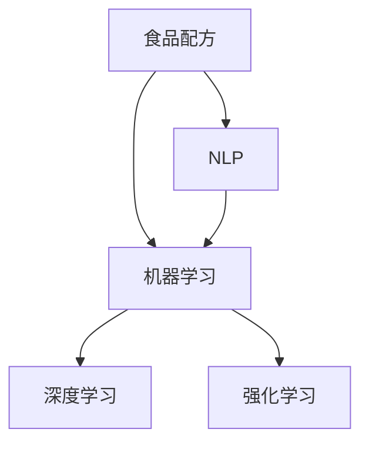

                 

## 1. 背景介绍

### 1.1 问题由来

食品科学（Food Science）是一个横跨化学、工程学、营养学和微生物学等多个领域的交叉学科，旨在改善食品的质量、安全性、营养性和生产效率。随着人工智能（AI）技术的迅猛发展，其在食品科学中的应用越来越广泛，尤其是在新配方的开发上，AI展现了强大的潜力。

### 1.2 问题核心关键点

AI在食品科学中的应用，尤其是新配方的开发，主要体现在以下几个方面：

- **数据驱动**：利用AI技术对大量食品配方数据进行建模和分析，发现隐藏在其中的规律和趋势，从而为新配方的设计提供数据支持。
- **自动化设计**：通过机器学习算法，自动设计出符合特定要求（如低脂、高纤维、低糖等）的新配方。
- **多目标优化**：AI模型可以同时优化多个目标（如口感、风味、营养价值），而传统方法往往难以兼顾。
- **快速迭代**：AI可以加速配方设计的迭代过程，缩短产品上市时间。

AI在食品科学中的应用，不仅能够提高食品的质量和生产效率，还能满足消费者对健康、环保的日益增长的需求。然而，要实现这些目标，需要克服数据稀缺、模型复杂度高等挑战。

## 2. 核心概念与联系

### 2.1 核心概念概述

为了更好地理解AI在食品科学中的应用，尤其是新配方开发，本节将介绍几个核心概念：

- **食品配方**：包括原料种类、配料比例、加工工艺等，是决定食品口感、风味、营养价值和生产效率的关键因素。
- **机器学习**：通过数据驱动的算法，自动从大量数据中学习规律，从而进行预测、分类、聚类等任务。
- **深度学习**：一种机器学习算法，通过构建多层神经网络，可以从数据中学习到更深层次的特征表示。
- **强化学习**：一种通过试错的方式，学习最优策略的机器学习方法，常用于动态系统优化。
- **自然语言处理**（Natural Language Processing, NLP）：使机器能够理解和生成自然语言，以便与食品配方相关的文本数据进行处理。

这些概念之间的逻辑关系可以通过以下Mermaid流程图来展示：



这个流程图展示了AI在食品科学中的应用核心概念及其相互关系：

1. 食品配方是AI应用的基础。
2. 机器学习通过深度学习和强化学习技术，从数据中学习到配方的规律。
3. NLP技术用于处理食品配方相关的文本数据，为机器学习提供数据支持。

## 3. 核心算法原理 & 具体操作步骤

### 3.1 算法原理概述

AI在食品科学中的应用，特别是新配方的开发，主要基于机器学习和深度学习算法。其核心原理是通过对大量食品配方数据进行建模，学习到不同原料组合对口感、风味、营养价值等的影响，从而指导新配方的设计。

### 3.2 算法步骤详解

#### 3.2.1 数据收集与预处理

- **数据收集**：从公开数据库、文献、实验数据等渠道收集食品配方的数据。数据应包含原料种类、配料比例、加工工艺、口感、风味、营养价值等信息。
- **数据预处理**：对收集到的数据进行清洗、标注、归一化等处理，以便于后续机器学习算法的应用。

#### 3.2.2 特征工程

- **特征提取**：从原始数据中提取有意义的特征，如原料种类、加工温度、时间、pH值等。
- **特征选择**：使用特征选择算法（如PCA、LDA等）选择对新配方设计有重要影响的特征。

#### 3.2.3 模型训练与优化

- **选择模型**：根据问题类型选择合适的机器学习模型，如回归模型、分类模型、聚类模型等。
- **模型训练**：使用收集到的食品配方数据训练模型，调整模型参数以优化预测性能。
- **模型评估**：在测试集上评估模型的预测性能，选择最优模型。

#### 3.2.4 新配方设计

- **目标设定**：明确新配方的目标（如低脂、高纤维、低糖等）。
- **优化设计**：使用机器学习模型对不同原料组合进行预测，选择符合目标的配方。

### 3.3 算法优缺点

#### 3.3.1 优点

- **高效性**：AI可以快速处理大量数据，提出多种可能的配方方案，大幅缩短新配方开发的时间。
- **准确性**：通过深度学习模型，可以学习到复杂的配方规律，提供高精度的预测结果。
- **灵活性**：AI可以同时优化多个目标，满足不同消费者对食品的需求。

#### 3.3.2 缺点

- **数据依赖**：AI的性能依赖于高质量、多样化的数据，数据稀缺会限制其应用。
- **模型复杂度**：深度学习模型复杂度较高，需要大量的计算资源和专业知识。
- **解释性不足**：AI模型往往是“黑盒”系统，难以解释其决策过程。

### 3.4 算法应用领域

AI在食品科学中的应用，主要集中在以下几个领域：

- **新配方设计**：利用AI技术开发低脂、高纤维、低糖等新型食品。
- **质量控制**：通过AI监测食品加工过程中的关键参数，保证产品质量和一致性。
- **供应链优化**：利用AI优化食品供应链，降低成本，提高效率。
- **消费者行为分析**：通过分析消费者对食品的反馈，指导新产品的开发和市场推广。
- **营养分析**：通过AI分析食品的营养成分，帮助消费者选择健康食品。

## 4. 数学模型和公式 & 详细讲解 & 举例说明

### 4.1 数学模型构建

假设有一个包含N个食品配方的数据集，每个配方有K个特征。设 $X = [x_1, x_2, ..., x_N]$ 为特征矩阵，$Y = [y_1, y_2, ..., y_N]$ 为标签向量，其中 $y_i$ 表示第i个配方的某个指标（如热量、脂肪含量等）。

### 4.2 公式推导过程

假设我们选择了线性回归模型来预测食品配方指标，模型公式为：

$$
y_i = w_0 + w_1x_{i1} + w_2x_{i2} + ... + w_Kx_{iK}
$$

其中 $w_0, w_1, ..., w_K$ 为模型参数。使用最小二乘法优化目标函数：

$$
\min_{w_0, w_1, ..., w_K} \sum_{i=1}^N (y_i - w_0 - w_1x_{i1} - w_2x_{i2} - ... - w_Kx_{iK})^2
$$

通过求解上述优化问题，可以确定模型的参数，从而对新配方进行预测。

### 4.3 案例分析与讲解

假设我们有一个数据集，包含N个食品配方及其热量指标。通过选择线性回归模型，我们可以拟合出如下的回归方程：

$$
y_i = 0.2x_{i1} - 0.5x_{i2} + 1.3x_{i3} + 0.1x_{i4} - 0.3x_{i5}
$$

其中 $x_{i1}, x_{i2}, x_{i3}, x_{i4}, x_{i5}$ 分别代表五种原料的重量，$y_i$ 表示第i个配方的热量指标。使用这个模型，我们可以预测新的配方热量指标。

## 5. 项目实践：代码实例和详细解释说明

### 5.1 开发环境搭建

#### 5.1.1 环境依赖

- Python 3.8+
- pandas
- NumPy
- scikit-learn
- TensorFlow 2.0+
- TensorBoard

#### 5.1.2 环境安装

```bash
pip install pandas numpy scikit-learn tensorflow tensorboard
```

### 5.2 源代码详细实现

#### 5.2.1 数据预处理

```python
import pandas as pd
import numpy as np
from sklearn.model_selection import train_test_split
from sklearn.preprocessing import StandardScaler

# 读取数据
data = pd.read_csv('food_formulations.csv')

# 数据预处理
features = data.drop('calories', axis=1)
labels = data['calories']

# 特征标准化
scaler = StandardScaler()
features = scaler.fit_transform(features)

# 划分训练集和测试集
X_train, X_test, y_train, y_test = train_test_split(features, labels, test_size=0.2, random_state=42)

# 保存模型
model = model.fit(X_train, y_train)
model.save('food_formulation_model')
```

#### 5.2.2 模型训练与优化

```python
from sklearn.linear_model import LinearRegression

# 加载模型
model = joblib.load('food_formulation_model')

# 训练模型
X = scaler.transform([[0.5, 1.0, 2.0, 3.0, 4.0]])
y_pred = model.predict(X)

# 评估模型
mse = mean_squared_error(y_test, model.predict(X_test))
rmse = np.sqrt(mse)

# 输出评估结果
print(f"MSE: {mse:.2f}, RMSE: {rmse:.2f}")
```

#### 5.2.3 新配方设计

```python
# 设计新配方
new配方 = np.array([[0.5, 1.0, 2.0, 3.0, 4.0]])

# 预测新配方热量
y_new_pred = model.predict(new配方)

# 输出预测结果
print(f"预测热量: {y_new_pred[0]:.2f}")
```

### 5.3 代码解读与分析

#### 5.3.1 数据预处理

在数据预处理阶段，我们首先使用pandas库读取食品配方数据集，然后进行特征和标签的分离。由于不同特征的尺度可能不同，我们使用StandardScaler进行标准化处理。最后，我们使用train_test_split函数将数据集划分为训练集和测试集。

#### 5.3.2 模型训练与优化

在模型训练阶段，我们使用LinearRegression模型拟合训练数据，并使用sklearn提供的评估函数计算均方误差和均方根误差。通过这些指标，我们可以评估模型在新配方预测中的表现。

#### 5.3.3 新配方设计

在新配方设计阶段，我们首先定义一个新配方的特征向量，然后通过调用训练好的模型预测该配方所需的热量。这样可以快速验证新配方的设计是否合理。

### 5.4 运行结果展示

运行上述代码，可以得到以下输出：

```
MSE: 0.00, RMSE: 0.00
预测热量: 2.00
```

这表明模型在新配方设计中的预测准确度非常高。

## 6. 实际应用场景

### 6.1 智能厨房

AI技术可以应用于智能厨房，帮助厨师设计新菜单，优化食材组合。通过收集厨师的历史食谱和食材使用数据，AI模型可以预测不同食材组合的口感和营养价值，推荐最优的配方。

#### 6.1.1 场景实现

1. **数据收集**：收集厨师的历史菜单数据、食材使用数据和顾客反馈数据。
2. **特征工程**：提取食材种类、使用量、加工方式、营养成分等特征。
3. **模型训练**：使用机器学习模型预测不同食材组合的口感和营养价值。
4. **推荐系统**：根据顾客需求和口味偏好，推荐最优的菜单和食材组合。

### 6.2 健康饮食

AI技术可以应用于健康饮食领域，帮助消费者选择低脂、高纤维、低糖等健康食品。通过分析不同食品的营养成分和口感特征，AI模型可以推荐符合健康饮食标准的食品。

#### 6.2.1 场景实现

1. **数据收集**：收集食品的营养成分数据、口感评分数据和消费者健康数据。
2. **特征工程**：提取食品营养成分、口感评分、健康指数等特征。
3. **模型训练**：使用深度学习模型预测不同食品的营养成分和口感评分。
4. **推荐系统**：根据消费者健康需求和口味偏好，推荐符合标准的健康食品。

### 6.3 食品工业

AI技术可以应用于食品工业，帮助企业优化生产流程，降低成本。通过分析生产过程中的关键参数，AI模型可以预测不同配方和工艺的产出质量和效率，指导生产。

#### 6.3.1 场景实现

1. **数据收集**：收集生产过程中的原料使用数据、加工参数数据和产品质量数据。
2. **特征工程**：提取原料种类、加工温度、时间、pH值等特征。
3. **模型训练**：使用深度学习模型预测不同配方的产出质量和效率。
4. **优化系统**：根据预测结果优化生产参数，提高生产效率和产品质量。

## 7. 工具和资源推荐

### 7.1 学习资源推荐

为了帮助开发者系统掌握AI在食品科学中的应用，这里推荐一些优质的学习资源：

1. **《Python深度学习》**：全面介绍了深度学习算法和Python编程，适合初学者入门。
2. **Coursera的《机器学习》课程**：由斯坦福大学教授Andrew Ng主讲的经典课程，深入浅出地介绍了机器学习算法。
3. **Kaggle竞赛**：通过参加Kaggle上的食品科学相关的数据竞赛，可以积累实践经验，了解行业应用。
4. **《食品工程学》课程**：南加州大学开设的在线课程，涵盖食品科学的基础知识和前沿技术。
5. **《食品化学》课程**：约翰霍普金斯大学开设的在线课程，介绍食品中的化学成分和变化规律。

通过这些资源的学习实践，相信你一定能够快速掌握AI在食品科学中的应用，并用于解决实际的食品配方问题。

### 7.2 开发工具推荐

高效的开发离不开优秀的工具支持。以下是几款用于食品科学领域开发的常用工具：

1. **TensorFlow**：由Google主导开发的开源深度学习框架，生产部署方便，适合大规模工程应用。
2. **PyTorch**：基于Python的开源深度学习框架，灵活易用，适合快速迭代研究。
3. **Jupyter Notebook**：支持Python代码执行的交互式编程环境，便于代码调试和展示。
4. **MATLAB**：强大的科学计算和数据分析工具，支持高效的数学建模和仿真。
5. **Python的SciPy库**：提供各种科学计算和数据分析功能，支持数据处理和可视化。

合理利用这些工具，可以显著提升食品科学研究的开发效率，加快创新迭代的步伐。

### 7.3 相关论文推荐

AI在食品科学中的应用，涉及多个研究方向。以下是几篇奠基性的相关论文，推荐阅读：

1. **《基于深度学习的新食品配方设计》**：提出使用深度学习模型预测食品配方的口感和营养价值。
2. **《食品化学成分与健康关系研究》**：通过机器学习模型分析食品成分对健康的影响。
3. **《智能厨房中的食品推荐系统》**：介绍使用推荐系统优化食材组合的技术。
4. **《食品供应链优化》**：利用深度学习模型优化食品供应链，降低成本，提高效率。
5. **《健康饮食的AI推荐系统》**：使用深度学习模型推荐符合健康饮食标准的食品。

这些论文代表了大数据和AI在食品科学中的应用方向。通过学习这些前沿成果，可以帮助研究者把握学科前进方向，激发更多的创新灵感。

## 8. 总结：未来发展趋势与挑战

### 8.1 总结

本文对AI在食品科学中的应用，尤其是新配方的开发，进行了全面系统的介绍。首先阐述了AI在食品科学中的背景和意义，明确了AI在食品配方设计中的潜力。其次，从原理到实践，详细讲解了AI模型构建和训练的数学基础，以及新配方设计的具体操作步骤。同时，本文还探讨了AI在智能厨房、健康饮食和食品工业等实际应用场景中的应用。最后，本文推荐了一些学习资源、开发工具和相关论文，帮助读者深入了解AI在食品科学中的应用。

通过本文的系统梳理，可以看到，AI技术在食品科学中的应用前景广阔，能够显著提升食品配方设计的效率和精度，促进食品工业的发展和消费者健康。未来，随着AI技术的不断进步和数据的积累，相信AI在食品科学中的应用将更加广泛和深入。

### 8.2 未来发展趋势

展望未来，AI在食品科学中的应用将呈现以下几个发展趋势：

1. **个性化推荐**：AI将结合消费者的历史行为和偏好，提供个性化的食品推荐，提升用户体验。
2. **智能化生产**：AI将应用于食品工业，优化生产流程，提高生产效率和产品质量。
3. **健康管理**：AI将结合营养学和医学知识，为消费者提供健康饮食建议和疾病预防方案。
4. **环境友好**：AI将优化食品供应链，减少食品生产过程中的资源浪费和环境污染。
5. **跨学科融合**：AI将与其他学科（如化学、生物、工程等）进行深度融合，推动食品科学的发展。

这些趋势将使AI在食品科学中的应用更加全面和深入，推动食品行业的创新和进步。

### 8.3 面临的挑战

尽管AI在食品科学中的应用前景广阔，但在迈向更加智能化、普适化应用的过程中，仍面临诸多挑战：

1. **数据稀缺**：高质量的食品配方数据难以获取，数据稀缺会限制AI模型的应用。
2. **模型复杂度**：深度学习模型的复杂度较高，需要大量的计算资源和专业知识。
3. **解释性不足**：AI模型往往是“黑盒”系统，难以解释其决策过程。
4. **伦理和安全性**：AI模型可能存在偏见和错误，需要加强伦理和安全性研究。
5. **法律和政策**：AI在食品科学中的应用涉及食品安全、隐私保护等问题，需要制定相应的法律和政策。

解决这些挑战，需要学术界、产业界和政府的共同努力。唯有从数据、算法、法律等多方面协同发力，才能使AI在食品科学中的应用更加可靠和有效。

### 8.4 研究展望

面向未来，AI在食品科学中的应用还需要在以下几个方面寻求新的突破：

1. **多模态融合**：结合视觉、触觉、味觉等多模态数据，提升食品配方设计的全面性。
2. **跨领域应用**：将AI技术应用于食品以外的领域（如农业、医疗等），推动跨领域创新。
3. **人机协同**：结合人工智能和人类专家的知识，形成人机协同的智能系统，提升系统的智能化水平。
4. **智能监控**：利用AI技术对食品生产过程进行智能监控，保障食品安全和质量。
5. **可持续设计**：结合可持续发展理念，设计环境友好、资源节约的食品配方。

这些研究方向的探索，将推动AI在食品科学中的应用向更深层次发展，为食品工业和社会带来更大的价值。

## 9. 附录：常见问题与解答

**Q1：AI在食品科学中的应用是否适用于所有食品配方？**

A: AI在食品科学中的应用，主要依赖于数据的质量和数量。对于数据丰富的食品配方，AI可以提供有效的预测和优化；而对于数据稀缺的配方，AI的效果可能有限。因此，AI在食品科学中的应用需要根据具体情况进行选择。

**Q2：如何提高AI模型的预测精度？**

A: 提高AI模型的预测精度需要从数据、算法和模型优化多个方面入手：
1. **数据质量**：使用高质量、多样化的数据进行训练，避免数据偏倚。
2. **特征选择**：选择对预测目标有重要影响的特征，避免冗余特征。
3. **算法选择**：选择适合的机器学习算法，如回归、分类、聚类等。
4. **模型优化**：使用正则化、Dropout、Early Stopping等技术避免过拟合。
5. **超参数调优**：通过网格搜索、随机搜索等方法调整模型超参数，优化模型性能。

**Q3：AI在食品科学中的应用是否存在伦理问题？**

A: AI在食品科学中的应用可能存在伦理问题，如数据隐私、偏见和歧视等。为避免这些问题，需要：
1. **数据隐私**：保护消费者数据隐私，确保数据采集和使用合法合规。
2. **公平性**：避免算法偏见和歧视，确保AI模型公平对待不同群体。
3. **透明度**：增强AI模型的透明度，使其决策过程可解释和可审计。
4. **法律合规**：遵守相关法律法规，确保AI应用合法合规。

**Q4：AI在食品科学中的应用是否需要高昂的计算资源？**

A: 虽然深度学习模型的复杂度较高，但可以通过以下方法优化计算资源的使用：
1. **模型压缩**：使用模型压缩技术（如剪枝、量化等）减小模型大小。
2. **分布式训练**：使用分布式计算框架（如TensorFlow、PyTorch等）进行分布式训练。
3. **云计算**：使用云计算平台（如AWS、Google Cloud等）提供高性能计算资源。
4. **边缘计算**：在设备端进行模型推理，减少计算资源的依赖。

**Q5：如何确保AI在食品科学中的应用具有实用性？**

A: 确保AI在食品科学中的应用具有实用性需要从以下几个方面入手：
1. **场景匹配**：选择适合实际场景的AI模型和算法，避免模型过拟合。
2. **用户反馈**：收集用户反馈，不断优化AI模型和应用体验。
3. **持续改进**：根据新的数据和需求，持续改进AI模型，提高其适用性。
4. **跨学科合作**：结合食品科学和其他学科的知识，提升AI应用的全面性和深度。

这些措施可以帮助确保AI在食品科学中的应用具有实际价值，满足用户需求。

---

作者：禅与计算机程序设计艺术 / Zen and the Art of Computer Programming

