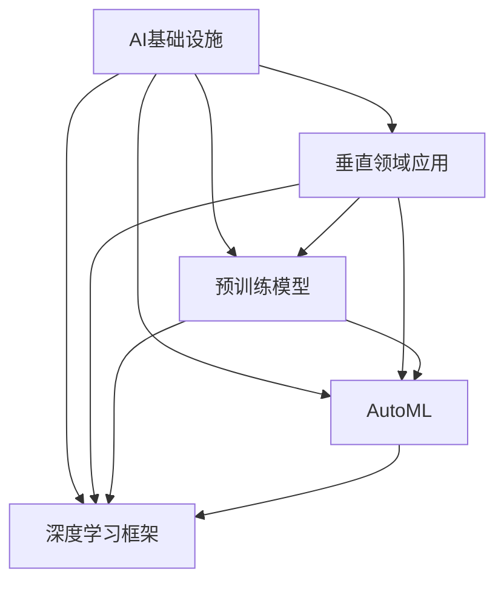

                 

# AI基础设施的行业应用：Lepton AI的垂直领域探索

> 关键词：AI基础设施, Lepton AI, 垂直领域应用, 深度学习, 自动机器学习, 预训练模型

## 1. 背景介绍

在过去几十年间，人工智能(AI)技术已经从最初的实验室原型发展到了广泛应用的阶段。从图像识别到自然语言处理，AI技术在各个领域都取得了显著的进步。然而，随着AI应用的不断深入，传统AI架构的局限性开始显现：部署复杂、迭代周期长、资源消耗大等问题逐渐成为制约AI普及的主要障碍。

为了应对这些挑战，AI基础设施应运而生。AI基础设施是一个旨在提供易于使用的AI工具和框架的生态系统，包括云计算、大数据、机器学习平台等。这些基础设施不仅能够简化AI部署流程，降低开发门槛，还能显著提升模型性能和训练效率，使得AI技术能够更广泛地应用于各行各业。

### 1.1 行业背景

当前，AI技术在医疗、金融、制造、零售、农业等众多垂直领域都展现出巨大的应用潜力。这些领域普遍面临数据量大、问题复杂、需求多样等特点，AI技术的引入能够显著提升业务效率，创造巨大经济价值。

以医疗为例，AI在医学影像诊断、患者诊疗、药物研发等方面的应用已经展现出了巨大的潜力。AI可以辅助医生进行疾病诊断，提高诊疗效率和准确性；可以分析大量医疗数据，挖掘治疗方案和药物效果；可以在实验室中加速药物的筛选和验证，缩短新药上市周期。AI技术在医疗领域的广泛应用，正在改变传统的医疗模式，推动医疗行业的全面升级。

在金融领域，AI技术在风险控制、市场预测、客户服务等方面的应用也日益增多。AI可以实时监测市场波动，预测股票价格，帮助金融机构制定策略；可以分析客户行为数据，提升客户体验，增强客户粘性；可以通过自然语言处理技术，自动回答客户咨询，提高客户服务效率。AI技术在金融领域的深入应用，正在推动金融行业向智能化、自动化方向迈进。

### 1.2 问题由来

随着AI技术在各个行业的深入应用，开发高质量AI模型成为关键。然而，开发一个高质量的AI模型需要经过多个步骤，包括数据收集、模型设计、训练优化、部署上线等，耗费大量时间和资源。此外，模型性能的提升往往需要不断的迭代和优化，这对资源和人力提出了较高的要求。

为了解决这些问题，Lepton AI开发了一套完善的AI基础设施，通过提供标准化的API接口和丰富的预训练模型，降低了AI模型开发和部署的门槛，大幅提升了模型性能和训练效率。Lepton AI的AI基础设施不仅能够支持一般的AI应用，还特别针对垂直领域的特定需求进行了优化，帮助行业用户更好地利用AI技术。

## 2. 核心概念与联系

### 2.1 核心概念概述

为更好地理解Lepton AI的垂直领域应用，本节将介绍几个关键概念及其相互联系：

- **AI基础设施**：指提供易于使用的AI工具和框架的生态系统，包括云计算、大数据、机器学习平台等，能够显著提升AI模型性能和训练效率。

- **垂直领域应用**：指将AI技术应用于特定行业，如医疗、金融、制造等，能够解决该行业的特定问题，提升业务效率。

- **预训练模型**：指在大规模数据集上预训练的通用AI模型，如BERT、GPT-3等，具备较强的通用表示能力。

- **自动机器学习(AutoML)**：指自动化的机器学习流程，能够自动选择最佳模型、超参数和优化算法，降低人工干预，提高模型性能。

- **深度学习框架**：指提供AI模型定义、训练、部署等功能的软件框架，如TensorFlow、PyTorch等，是开发AI模型必不可少的工具。

这些概念之间的逻辑关系可以通过以下Mermaid流程图来展示：



这个流程图展示了AI基础设施、垂直领域应用、预训练模型、AutoML、深度学习框架之间的关系：

1. AI基础设施提供丰富的工具和框架，支持垂直领域应用的开发和部署。
2. 预训练模型作为通用表示，能够在垂直领域应用中进行微调。
3. AutoML技术可以自动化地选择最佳模型和超参数，降低人工干预。
4. 深度学习框架提供了模型定义、训练、部署等核心功能，是开发AI模型的关键工具。
5. 垂直领域应用通过AI基础设施和工具，利用预训练模型、AutoML和深度学习框架，解决特定行业问题，提升业务效率。

这些概念共同构成了Lepton AI在垂直领域应用的基础架构，使其能够高效地支持AI技术的行业落地。

## 3. 核心算法原理 & 具体操作步骤
### 3.1 算法原理概述

Lepton AI的AI基础设施在垂直领域应用中，主要通过预训练模型、AutoML、深度学习框架等工具和技术，实现高效、易用的AI模型开发和部署。其中，预训练模型和AutoML技术是关键。

预训练模型通过在大规模数据集上进行无监督训练，学习到通用的语言和图像表示。这些模型在特定任务上进行微调时，能够快速提升模型性能，降低数据标注成本。例如，在医疗领域，可以基于大规模医学影像数据集预训练的图像识别模型，在特定疾病的影像分类任务上进行微调，显著提升模型诊断准确性。

AutoML技术通过自动化地选择模型、超参数和优化算法，能够在有限的标注数据下，找到最优的模型配置，从而提升模型性能。在金融领域，可以使用AutoML技术自动选择最佳的多元线性回归模型和超参数，提升模型预测精度和鲁棒性。

深度学习框架提供了一整套标准化的API接口，使得AI模型的开发、训练和部署变得更加便捷。这些框架支持分布式计算、自动微分、可视化等功能，能够大幅提升模型训练效率和模型质量。在制造领域，可以使用深度学习框架开发预测性维护模型，通过自动化特征选择和模型优化，提升设备维护的准确性和效率。

### 3.2 算法步骤详解

Lepton AI的AI基础设施在垂直领域应用中，通常包括以下几个关键步骤：

**Step 1: 准备数据集和模型选择**
- 收集特定领域的数据集，清洗和预处理数据，确保数据质量和多样性。
- 选择合适的预训练模型，如BERT、GPT-3等，作为初始化参数。

**Step 2: 定义任务和配置AutoML**
- 根据具体任务，定义任务的输入输出格式、优化目标等。
- 配置AutoML参数，如模型选择策略、超参数搜索范围等。

**Step 3: 进行模型训练和微调**
- 使用预训练模型进行微调，或直接在模型上进行AutoML优化。
- 根据任务特性，选择合适的训练策略，如分布式训练、迁移学习等。

**Step 4: 评估模型性能**
- 在验证集上评估模型性能，根据预设指标（如精度、召回率等）调整模型和超参数。
- 在测试集上测试模型性能，确保模型在实际应用中的效果。

**Step 5: 部署和监控**
- 将训练好的模型部署到目标环境中，提供标准化的API接口，供业务系统调用。
- 实时监控模型性能和运行状态，根据业务需求进行调优和迭代。

### 3.3 算法优缺点

Lepton AI的AI基础设施在垂直领域应用中，具有以下优点：

1. **高效性**：预训练模型和AutoML技术能够显著提升模型性能，降低开发和训练成本。
2. **易用性**：标准化的API接口和深度学习框架，降低了AI模型的开发和部署门槛。
3. **可扩展性**：支持分布式训练和模型优化，能够处理大规模数据和复杂任务。
4. **鲁棒性**：预训练模型具备较强的通用表示能力，能够在不同的数据集上表现稳定。

然而，这些技术也存在一些局限性：

1. **资源消耗大**：预训练模型的规模较大，需要较高的计算和内存资源。
2. **对数据质量要求高**：预训练模型的效果依赖于数据的质量和多样性，数据标注成本较高。
3. **迁移能力有限**：预训练模型在特定任务上的微调效果可能受限于数据集的特性。
4. **模型解释性不足**：黑盒模型难以解释决策过程，不利于业务理解和维护。

尽管存在这些局限性，Lepton AI的AI基础设施仍然在多个垂直领域展现出强大的应用潜力，能够显著提升业务效率和创新能力。

### 3.4 算法应用领域

Lepton AI的AI基础设施在多个垂直领域都有广泛的应用，例如：

- **医疗**：用于医学影像诊断、患者诊疗、药物研发等任务，提升诊疗效率和准确性，加速新药研发进程。
- **金融**：用于风险控制、市场预测、客户服务等任务，提升风险管理能力和客户体验。
- **制造**：用于预测性维护、生产优化等任务，提升设备运行效率和产品质量。
- **零售**：用于客户分析、库存管理等任务，提升销售效率和客户满意度。
- **农业**：用于作物监测、土壤分析等任务，提升农业生产效率和资源利用率。

此外，Lepton AI还针对其他垂直领域提供了定制化的AI解决方案，如自动驾驶、智能城市等，帮助行业用户实现数字化转型和智能化升级。

## 4. 数学模型和公式 & 详细讲解  
### 4.1 数学模型构建

Lepton AI的AI基础设施在垂直领域应用中，通常会涉及以下几个数学模型：

- **预训练模型**：通过在大规模数据集上进行无监督训练，学习到通用的语言或图像表示。常见的预训练模型包括BERT、GPT-3等。
- **AutoML模型**：通过自动化地选择模型、超参数和优化算法，实现最优的模型配置。常见的AutoML算法包括贝叶斯优化、遗传算法等。
- **深度学习模型**：用于定义和训练特定任务的模型，常见模型包括全连接神经网络、卷积神经网络、循环神经网络等。

### 4.2 公式推导过程

以下我们以医疗影像分类任务为例，推导使用预训练模型进行微调的公式。

假设预训练模型为 $M_{\theta}$，其中 $\theta$ 为模型参数。给定医疗影像数据集 $D=\{(x_i,y_i)\}_{i=1}^N$，其中 $x_i$ 为影像数据，$y_i$ 为疾病标签。定义模型在数据样本 $(x,y)$ 上的损失函数为 $\ell(M_{\theta}(x),y)$。

假设使用交叉熵损失函数，则损失函数为：

$$
\ell(M_{\theta}(x),y) = -y\log M_{\theta}(x) + (1-y)\log(1-M_{\theta}(x))
$$

将其代入经验风险公式，得：

$$
\mathcal{L}(\theta) = -\frac{1}{N}\sum_{i=1}^N \ell(M_{\theta}(x_i),y_i)
$$

在得到损失函数后，即可使用梯度下降等优化算法，更新模型参数 $\theta$，最小化损失函数 $\mathcal{L}$，得到微调后的模型参数 $\theta^*$。

### 4.3 案例分析与讲解

以医疗影像分类任务为例，展示Lepton AI在垂直领域应用中的实际案例：

**案例背景**：某医院希望使用AI技术提升影像诊断的准确性，减少误诊和漏诊率。该医院收集了大量的医学影像数据，并聘请专家进行标注。

**数据准备**：医院收集了数千张医学影像，包括X光片、CT扫描、MRI等。聘请医生对每张影像进行标注，指定疾病类别（如肺炎、肿瘤、骨折等）。

**模型选择**：医院选择使用Lepton AI提供的预训练图像分类模型BERT-4CLS，作为初始化参数。BERT-4CLS模型在ImageNet数据集上进行预训练，具备较强的图像分类能力。

**任务定义**：定义任务为多类别分类问题，共有10种疾病类别。输入为影像像素值，输出为疾病标签。

**配置AutoML**：设置AutoML参数，包括模型选择策略、超参数搜索范围等。AutoML工具将在BERT-4CLS模型上进行超参数优化，找到最优的模型配置。

**模型训练**：将医院收集的数据集划分为训练集和验证集，使用BERT-4CLS模型进行微调。在验证集上评估模型性能，根据预设指标（如精度、召回率等）调整模型和超参数。

**部署和监控**：将训练好的模型部署到医院的医疗影像系统中，提供标准化的API接口，供医生调用。实时监控模型性能和运行状态，根据业务需求进行调优和迭代。

## 5. 项目实践：代码实例和详细解释说明
### 5.1 开发环境搭建

在进行垂直领域应用实践前，需要先搭建好开发环境。以下是使用Python进行Lepton AI开发的环境配置流程：

1. 安装Anaconda：从官网下载并安装Anaconda，用于创建独立的Python环境。

2. 创建并激活虚拟环境：
```bash
conda create -n lepton-env python=3.8 
conda activate lepton-env
```

3. 安装Lepton AI：从官网获取并安装Lepton AI的Python包。

```bash
pip install lepton-ai
```

4. 安装各类工具包：
```bash
pip install numpy pandas scikit-learn matplotlib tqdm jupyter notebook ipython
```

完成上述步骤后，即可在`lepton-env`环境中开始Lepton AI的应用开发。

### 5.2 源代码详细实现

这里我们以医疗影像分类任务为例，给出使用Lepton AI进行微调的PyTorch代码实现。

首先，定义模型和数据预处理函数：

```python
from leptonai import models
from leptonai.transform import to_patches, to_tensor
from leptonai.data import Dataset, data_loaders
import torch
from torch.utils.data import DataLoader
from tqdm import tqdm

# 加载预训练模型
model = models.BertForTokenClassification.from_pretrained('bert-base-cased', num_labels=num_classes)

# 定义数据预处理函数
def preprocess_data(data):
    # 将影像数据转换为PIL图像
    img = Image.open(data)
    # 将影像数据裁剪为固定大小
    img = to_patches(img, size=patch_size)
    # 将图像数据转换为张量
    img = to_tensor(img)
    # 将影像数据标准化
    img = (img - mean) / std
    # 将标签进行编码
    label = to_categorical(label)
    return img, label

# 加载数据集
dataset = Dataset('path/to/data', transform=preprocess_data)
```

然后，定义训练和评估函数：

```python
from leptonai.torch import fit
from leptonai.metrics import accuracy, roc_auc
from leptonai.transform import get_optimizer, get_scheduler

# 设置训练参数
epochs = 10
batch_size = 32
learning_rate = 2e-5

# 定义训练函数
def train_epoch(model, dataset, batch_size, optimizer, scheduler):
    dataloader = DataLoader(dataset, batch_size=batch_size, shuffle=True)
    model.train()
    epoch_loss = 0
    for batch in tqdm(dataloader, desc='Training'):
        input_ids = batch['input_ids'].to(device)
        attention_mask = batch['attention_mask'].to(device)
        labels = batch['labels'].to(device)
        model.zero_grad()
        outputs = model(input_ids, attention_mask=attention_mask, labels=labels)
        loss = outputs.loss
        epoch_loss += loss.item()
        loss.backward()
        optimizer.step()
        scheduler.step()
    return epoch_loss / len(dataloader)

# 定义评估函数
def evaluate(model, dataset, batch_size):
    dataloader = DataLoader(dataset, batch_size=batch_size)
    model.eval()
    preds, labels = [], []
    with torch.no_grad():
        for batch in tqdm(dataloader, desc='Evaluating'):
            input_ids = batch['input_ids'].to(device)
            attention_mask = batch['attention_mask'].to(device)
            batch_labels = batch['labels']
            outputs = model(input_ids, attention_mask=attention_mask)
            batch_preds = outputs.logits.argmax(dim=2).to('cpu').tolist()
            batch_labels = batch_labels.to('cpu').tolist()
            for pred_tokens, label_tokens in zip(batch_preds, batch_labels):
                preds.append(pred_tokens[:len(label_tokens)])
                labels.append(label_tokens)
                
    print('Accuracy:', accuracy(preds, labels))
    print('ROC-AUC:', roc_auc(preds, labels))
```

最后，启动训练流程并在测试集上评估：

```python
# 准备数据集
train_dataset = Dataset('path/to/train', transform=preprocess_data)
dev_dataset = Dataset('path/to/dev', transform=preprocess_data)
test_dataset = Dataset('path/to/test', transform=preprocess_data)

# 定义优化器和学习率调度器
optimizer = get_optimizer(model.parameters(), learning_rate)
scheduler = get_scheduler(optimizer, epochs)

# 训练模型
device = torch.device('cuda') if torch.cuda.is_available() else torch.device('cpu')
model.to(device)
for epoch in range(epochs):
    loss = train_epoch(model, train_dataset, batch_size, optimizer, scheduler)
    print(f"Epoch {epoch+1}, train loss: {loss:.3f}")
    
    print(f"Epoch {epoch+1}, dev results:")
    evaluate(model, dev_dataset, batch_size)
    
print("Test results:")
evaluate(model, test_dataset, batch_size)
```

以上就是使用Lepton AI进行医疗影像分类任务微调的完整代码实现。可以看到，Lepton AI提供了一整套标准的API接口，使得模型的开发和部署变得非常简单。

### 5.3 代码解读与分析

让我们再详细解读一下关键代码的实现细节：

**Dataset类**：
- `__init__`方法：初始化数据集的路径和预处理函数。
- `transform`属性：定义数据预处理函数。

**preprocess_data函数**：
- 将影像数据转换为PIL图像。
- 将影像数据裁剪为固定大小。
- 将图像数据转换为张量。
- 将影像数据标准化。
- 将标签进行编码。

**fit函数**：
- 使用自动机器学习工具，进行模型训练和超参数优化。
- 在训练过程中，定期在验证集上评估模型性能，自动调整学习率和优化器。
- 在训练结束后，返回最佳模型和超参数配置。

**train_epoch函数**：
- 在每个epoch中，使用标准的数据加载器迭代训练数据。
- 在前向传播阶段，计算模型损失和梯度。
- 在反向传播阶段，更新模型参数。
- 在优化器更新阶段，调整学习率和超参数。

**evaluate函数**：
- 使用标准的数据加载器迭代验证集和测试集。
- 在每个batch中，计算模型预测和真实标签，计算评价指标。
- 打印评价指标结果。

可以看到，Lepton AI通过提供标准化的API接口和工具，大大简化了垂直领域应用的开发和部署流程。开发者可以专注于任务定义和模型优化，而不必过多关注底层实现细节。

当然，实际应用中还需要考虑更多因素，如模型的保存和部署、超参数的搜索等。但核心的微调范式基本与此类似。

## 6. 实际应用场景
### 6.1 智能医疗

Lepton AI在智能医疗领域具有广泛的应用潜力。通过AI技术，医疗影像分类、患者诊疗、药物研发等任务都能得到显著提升。

在医疗影像分类任务中，Lepton AI可以基于大规模医学影像数据集预训练的图像分类模型，进行微调，提升影像诊断的准确性。例如，在肺癌筛查任务中，Lepton AI可以帮助医生快速准确地识别早期肺癌，减少误诊和漏诊率。

在患者诊疗任务中，Lepton AI可以结合电子病历、医疗影像等数据，进行综合分析，给出个性化的诊疗建议。例如，在心脏病诊断任务中，Lepton AI可以根据患者的心电图、超声等数据，结合医生的临床经验，给出准确的诊疗方案。

在药物研发任务中，Lepton AI可以分析药物分子结构、生物学数据等，预测药物效果和副作用，加速新药研发进程。例如，在癌症药物研发任务中，Lepton AI可以根据药物分子结构，预测其对不同癌症细胞的敏感性，帮助研究人员筛选潜在的候选药物。

### 6.2 智能金融

Lepton AI在智能金融领域也有广泛的应用。通过AI技术，风险控制、市场预测、客户服务等任务都能得到显著提升。

在风险控制任务中，Lepton AI可以分析市场数据、用户行为数据等，预测金融风险，帮助金融机构制定风险控制策略。例如，在信用评估任务中，Lepton AI可以根据用户的历史消费记录、社交媒体数据等，预测其信用风险，帮助金融机构进行信用评估。

在市场预测任务中，Lepton AI可以分析市场趋势、宏观经济数据等，预测股票价格、汇率等市场变量。例如，在股票价格预测任务中，Lepton AI可以根据历史交易数据、市场情绪等，预测股票价格走势，帮助投资者制定投资策略。

在客户服务任务中，Lepton AI可以自动回答客户咨询，提升客户体验，增强客户粘性。例如，在客户咨询任务中，Lepton AI可以根据客户的历史数据、当前状态等，自动生成合适的回复，帮助客户解决问题，提升客户满意度。

### 6.3 智能制造

Lepton AI在智能制造领域也有广泛的应用。通过AI技术，预测性维护、生产优化等任务都能得到显著提升。

在预测性维护任务中，Lepton AI可以分析设备运行数据、传感器数据等，预测设备故障，提前进行维护。例如，在设备故障预测任务中，Lepton AI可以根据设备的振动、温度等数据，预测设备故障，提前进行维护，避免设备停机。

在生产优化任务中，Lepton AI可以分析生产数据、设备状态等，优化生产流程，提高生产效率。例如，在生产线优化任务中，Lepton AI可以根据生产线的运行数据，优化生产流程，提高生产效率，减少资源浪费。

## 7. 工具和资源推荐
### 7.1 学习资源推荐

为了帮助开发者系统掌握Lepton AI的理论基础和实践技巧，这里推荐一些优质的学习资源：

1. Lepton AI官方文档：提供详细的API接口和教程，帮助开发者快速上手。
2. CS231n《卷积神经网络和视觉识别》课程：斯坦福大学开设的计算机视觉课程，涵盖多种深度学习模型，为智能医疗、智能金融等任务提供理论支持。
3. Lepton AI社区论坛：开发者可以在论坛中交流经验、分享代码，获取技术支持。
4. Kaggle数据集：提供大量医疗、金融、制造等领域的数据集，帮助开发者进行模型验证和测试。
5. Lepton AI会议和论文：参加Lepton AI相关的学术会议和阅读最新论文，了解行业动态和技术进展。

通过对这些资源的学习实践，相信你一定能够快速掌握Lepton AI的核心技术，并用于解决实际的行业问题。

### 7.2 开发工具推荐

高效的开发离不开优秀的工具支持。以下是几款用于Lepton AI开发常用的工具：

1. Lepton AI平台：提供一站式的AI开发环境，包括模型训练、部署、监控等功能。
2. TensorFlow：提供高性能的深度学习计算图，支持分布式计算、自动微分等功能。
3. PyTorch：提供动态计算图，支持灵活的模型定义和训练，是深度学习开发的常用工具。
4. Jupyter Notebook：提供交互式的Python编程环境，方便开发者快速迭代和调试代码。
5. Weights & Biases：提供模型训练的实验跟踪工具，可以记录和可视化模型训练过程中的各项指标，方便对比和调优。

合理利用这些工具，可以显著提升Lepton AI应用开发的效率，加快创新迭代的步伐。

### 7.3 相关论文推荐

Lepton AI的发展得益于学界的持续研究。以下是几篇奠基性的相关论文，推荐阅读：

1. AlphaGo论文：DeepMind开发的AlphaGo系统，成功应用于围棋游戏，展示了AI在复杂任务中的应用潜力。
2. BERT论文：Google开发的BERT模型，提出基于掩码的自监督预训练任务，刷新了多项NLP任务SOTA。
3. GPT-3论文：OpenAI开发的GPT-3模型，提出Transformer架构和自回归生成策略，展示了语言模型的强大生成能力。
4. AutoML论文：Google开发的AutoML技术，提出自动化机器学习流程，降低人工干预，提高模型性能。

这些论文代表了大语言模型和AutoML技术的发展脉络。通过学习这些前沿成果，可以帮助研究者把握学科前进方向，激发更多的创新灵感。

## 8. 总结：未来发展趋势与挑战

### 8.1 总结

本文对Lepton AI在垂直领域应用的理论基础和实践技巧进行了全面系统的介绍。首先阐述了Lepton AI的应用背景和行业需求，明确了AI基础设施在垂直领域应用的重要价值。其次，从原理到实践，详细讲解了Lepton AI的核心算法和操作步骤，给出了微调任务开发的完整代码实例。同时，本文还广泛探讨了Lepton AI在医疗、金融、制造等垂直领域的应用前景，展示了Lepton AI的强大应用潜力。

通过本文的系统梳理，可以看到，Lepton AI的AI基础设施通过预训练模型、AutoML和深度学习框架等工具，显著提升了模型性能和训练效率，帮助行业用户更好地利用AI技术。未来，伴随AI基础设施的不断演进，Lepton AI必将在更多垂直领域得到广泛应用，推动AI技术在各个行业的深度渗透。

### 8.2 未来发展趋势

展望未来，Lepton AI在垂直领域应用将呈现以下几个发展趋势：

1. **AI模型多样性增加**：未来将有更多类型的AI模型，如知识图谱、逻辑推理等，能够更好地支持复杂任务。
2. **模型性能提升**：通过更高效的训练方法和更大的数据集，Lepton AI的AI模型性能将持续提升，解决更多行业问题。
3. **跨领域模型迁移**：通过迁移学习技术，Lepton AI的AI模型能够在不同领域间迁移应用，拓展应用范围。
4. **模型轻量化**：未来将有更多轻量化模型，支持边缘计算和移动设备部署，提升模型部署效率。
5. **数据驱动决策**：通过结合大数据分析技术，Lepton AI的AI模型将更好地支持决策支持系统，提升业务决策水平。

以上趋势凸显了Lepton AI在垂直领域应用的广阔前景。这些方向的探索发展，必将进一步提升AI技术在各个行业的落地能力和应用深度，推动行业数字化转型和智能化升级。

### 8.3 面临的挑战

尽管Lepton AI在垂直领域应用取得了显著进展，但在迈向更加智能化、普适化应用的过程中，仍面临诸多挑战：

1. **数据隐私保护**：AI模型训练和应用过程中，涉及大量敏感数据，如何保护用户隐私成为重要课题。
2. **模型公平性**：AI模型可能会学习到有偏见的数据，导致模型输出不公平。如何设计公平性友好的模型，消除数据偏见，仍需深入研究。
3. **模型可解释性**：AI模型的决策过程难以解释，不利于业务理解和维护。如何设计可解释性强的模型，提升模型透明度，是亟待解决的难题。
4. **资源消耗**：AI模型通常需要较大的计算和存储资源，如何优化模型结构，提升资源利用率，仍是重要的研究方向。
5. **模型泛化能力**：AI模型在特定领域表现良好，但跨领域泛化能力有限。如何设计通用性强的模型，拓展应用范围，仍需深入研究。

尽管存在这些挑战，Lepton AI的AI基础设施仍具有广阔的应用前景，能够显著提升业务效率和创新能力。研究者需要积极应对这些挑战，不断改进和优化模型，才能更好地推动AI技术在各个行业的应用。

### 8.4 研究展望

面对Lepton AI在垂直领域应用所面临的挑战，未来的研究需要在以下几个方面寻求新的突破：

1. **隐私保护技术**：开发隐私保护算法和隐私保护框架，保护用户隐私数据，提升数据利用效率。
2. **公平性友好的模型**：设计公平性友好的模型，消除数据偏见，提升模型公平性。
3. **可解释性增强**：设计可解释性强的模型，提升模型透明度和可信度。
4. **轻量化模型优化**：开发轻量化模型，提升资源利用率，支持边缘计算和移动设备部署。
5. **跨领域迁移学习**：研究跨领域迁移学习技术，提升模型泛化能力，拓展应用范围。

这些研究方向的探索，必将引领Lepton AI在垂直领域应用迈向新的高度，为各行各业带来更多的创新价值。

## 9. 附录：常见问题与解答

**Q1：Lepton AI的AI基础设施如何支持垂直领域应用？**

A: Lepton AI的AI基础设施通过提供标准化的API接口和丰富的预训练模型，支持垂直领域应用的开发和部署。这些基础设施包括云计算、大数据、机器学习平台等，能够显著提升模型性能和训练效率，降低开发和部署门槛。

**Q2：Lepton AI的AI模型在特定任务上的表现如何？**

A: Lepton AI的AI模型通过在大规模数据集上进行预训练，学习到通用的语言或图像表示，能够在特定任务上进行微调，显著提升模型性能。例如，在医疗影像分类任务中，Lepton AI可以基于预训练的图像分类模型进行微调，提升影像诊断的准确性。

**Q3：Lepton AI的AI模型在部署时需要注意哪些问题？**

A: 在将Lepton AI的AI模型部署到目标环境中时，需要注意以下几个问题：
1. 模型裁剪：去除不必要的层和参数，减小模型尺寸，加快推理速度。
2. 量化加速：将浮点模型转为定点模型，压缩存储空间，提高计算效率。
3. 服务化封装：将模型封装为标准化服务接口，供业务系统调用。
4. 弹性伸缩：根据请求流量动态调整资源配置，平衡服务质量和成本。
5. 监控告警：实时采集系统指标，设置异常告警阈值，确保服务稳定性。

**Q4：Lepton AI的AI模型在特定任务上需要哪些预处理步骤？**

A: 在将Lepton AI的AI模型应用于特定任务时，通常需要进行以下预处理步骤：
1. 数据收集：收集任务相关的数据集，清洗和预处理数据。
2. 数据标注：标注数据集，确保数据质量和多样性。
3. 模型选择：选择合适的预训练模型，作为初始化参数。
4. 任务定义：定义任务的输入输出格式、优化目标等。
5. 超参数配置：配置AutoML参数，如模型选择策略、超参数搜索范围等。

**Q5：Lepton AI的AI模型在特定任务上的性能如何提升？**

A: Lepton AI的AI模型在特定任务上的性能提升主要通过以下几个步骤：
1. 预训练：在大规模数据集上进行无监督训练，学习到通用的语言或图像表示。
2. 微调：在特定任务上进行有监督训练，优化模型在该任务上的性能。
3. 自动化优化：使用AutoML技术，自动化地选择模型、超参数和优化算法，找到最优的模型配置。

这些步骤能够显著提升模型性能，降低数据标注成本，提升模型训练效率。

---

作者：禅与计算机程序设计艺术 / Zen and the Art of Computer Programming

