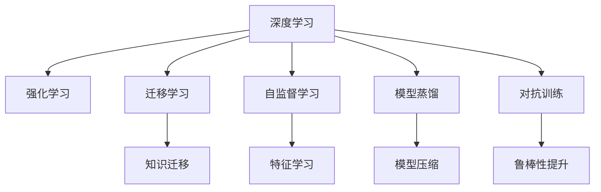

                 

# AI处理复杂问题的能力

> 关键词：AI,复杂问题,深度学习,神经网络,算法优化,强化学习,自然语言处理,计算机视觉

## 1. 背景介绍

### 1.1 问题由来

在现代科技高速发展的背景下，AI技术已经成为解决复杂问题的利器。无论是自动驾驶、语音识别、图像处理、自然语言理解，还是推荐系统、金融预测、医疗诊断，AI正以不可阻挡的趋势渗透进各个领域。然而，面对日益复杂的现实世界问题，AI仍面临诸多挑战：数据稀缺、特征提取困难、模型泛化不足、求解非凸问题等。这些问题不仅阻碍了AI技术的落地应用，也限制了其发展潜力。因此，如何利用AI处理复杂问题，成为一个亟待探索的研究课题。

### 1.2 问题核心关键点

复杂问题处理的核心在于构建能够有效学习、适应和预测的AI模型。当前，深度学习和强化学习是解决复杂问题的两大主要范式：

1. **深度学习（Deep Learning）**：通过构建多层神经网络，利用大量标注数据训练模型，使得模型能够高效提取特征、捕捉复杂模式。
2. **强化学习（Reinforcement Learning, RL）**：通过模拟环境和智能体（agent）交互，训练模型在动态变化环境中做出最优决策。

本文旨在通过梳理深度学习和强化学习的核心原理和操作步骤，探讨如何构建高效、鲁棒的AI模型，解决现实世界中的复杂问题。

## 2. 核心概念与联系

### 2.1 核心概念概述

为更好地理解AI处理复杂问题的能力，本节将介绍几个密切相关的核心概念：

- **深度学习（Deep Learning）**：以多层神经网络为代表的模型训练方法，通过学习大量数据中的复杂特征，实现对复杂问题的预测和分类。
- **强化学习（Reinforcement Learning）**：通过智能体与环境交互，基于奖励和惩罚机制学习最优策略，适用于动态变化、目标导向的问题求解。
- **迁移学习（Transfer Learning）**：利用预训练模型在大规模数据集上学习的知识，迁移到小规模数据集上，提升模型泛化能力。
- **自监督学习（Self-Supervised Learning）**：通过利用无标签数据的自监督任务，训练模型提取有用特征，减少对标注数据的需求。
- **模型蒸馏（Model Distillation）**：通过将大模型知识迁移到小模型，提高模型效率和泛化能力。
- **对抗训练（Adversarial Training）**：通过加入对抗样本训练，增强模型鲁棒性和泛化性能。

这些核心概念之间的逻辑关系可以通过以下Mermaid流程图来展示：



这个流程图展示了大语言模型的核心概念及其之间的关系：

1. 深度学习通过多层神经网络进行特征提取和复杂模式捕捉。
2. 强化学习通过智能体与环境的交互，学习最优策略。
3. 迁移学习利用预训练模型知识提升小模型性能。
4. 自监督学习通过无标签数据进行特征学习。
5. 模型蒸馏将大模型知识迁移到小模型，提高效率和泛化能力。
6. 对抗训练通过加入对抗样本，增强模型鲁棒性。

这些概念共同构成了AI处理复杂问题的框架，使得AI模型能够在各种场景下发挥强大的能力。通过理解这些核心概念，我们可以更好地把握AI处理复杂问题的机制和优化方向。

## 3. 核心算法原理 & 具体操作步骤
### 3.1 算法原理概述

AI处理复杂问题的核心算法原理主要基于深度学习和强化学习：

- **深度学习**：通过多层神经网络结构，利用反向传播算法优化模型参数，最大化对输入数据的拟合。
- **强化学习**：通过智能体与环境的交互，学习最优策略，最大化累计奖励。

这两大算法范式在构建高效、鲁棒的AI模型中各具优势。深度学习擅长处理结构化数据和静态特征，强化学习则适合动态环境和高维状态空间。

### 3.2 算法步骤详解

以下是深度学习和强化学习解决复杂问题的典型步骤：

**深度学习步骤**：
1. **数据预处理**：对原始数据进行清洗、归一化、特征工程等处理，提高模型输入质量。
2. **模型选择**：根据任务特点选择合适的神经网络架构（如CNN、RNN、Transformer等）。
3. **模型训练**：利用标注数据训练模型，通过反向传播算法优化参数，最大化模型性能。
4. **模型评估**：在验证集上评估模型性能，调整超参数和模型结构。
5. **模型部署**：将训练好的模型应用于实际问题，进行推理和预测。

**强化学习步骤**：
1. **环境建模**：构建模拟环境或现实环境，定义状态空间和行动空间。
2. **智能体设计**：设计智能体，定义其行为策略和奖励机制。
3. **模型训练**：通过与环境交互，利用探索-利用平衡策略训练智能体，学习最优策略。
4. **策略评估**：在测试环境中评估智能体策略，优化参数和策略。
5. **模型部署**：将训练好的智能体应用于实际环境，进行决策和行动。

### 3.3 算法优缺点

深度学习和强化学习在处理复杂问题时各具优缺点：

**深度学习优点**：
- **数据依赖低**：利用标注数据进行训练，适应性强。
- **特征提取能力强**：能够自动学习数据的复杂特征，泛化能力强。
- **模型表达力高**：多层神经网络能够表达复杂的非线性关系，适用于多种任务。

**深度学习缺点**：
- **数据需求大**：需要大量标注数据，标注成本高。
- **过拟合风险高**：模型复杂，易受噪声干扰，泛化性能差。
- **训练时间长**：需要较长时间训练，难以实时响应动态变化。

**强化学习优点**：
- **动态适应能力强**：能够在动态变化环境中做出最优决策。
- **自适应性强**：能够通过环境反馈不断优化策略，自适应性强。
- **鲁棒性强**：通过与环境的交互学习，模型具备较强的鲁棒性。

**强化学习缺点**：
- **数据需求高**：需要大量数据进行训练，数据采集难度大。
- **策略探索困难**：在高维状态空间中探索最优策略难度大。
- **模型复杂度高**：智能体设计复杂，训练难度大。

## 4. 数学模型和公式 & 详细讲解  
### 4.1 数学模型构建

本节将使用数学语言对深度学习和强化学习的核心模型进行更加严格的刻画。

**深度学习模型**：
以多层神经网络为例，设输入为 $x \in \mathbb{R}^d$，输出为 $y \in \mathbb{R}^k$。网络由 $L$ 层组成，每层由一个线性变换 $W_l \in \mathbb{R}^{d_l \times d_{l-1}}$ 和一个非线性激活函数 $f_l$ 构成。模型参数为 $\theta = \{W_l, b_l\}_{l=1}^L$，其中 $b_l \in \mathbb{R}^{d_l}$ 为偏置项。

模型前向传播公式为：
$$
h_l = f_l(W_lh_{l-1} + b_l), \quad l=1,2,\cdots,L
$$
最终输出为：
$$
y = W_Lh_{L-1} + b_L
$$

损失函数一般采用交叉熵损失，用于衡量模型预测与真实标签之间的差异：
$$
\mathcal{L}(\theta) = -\frac{1}{N}\sum_{i=1}^N\sum_{j=1}^k y_{ij}\log p_{ij}
$$
其中 $y_{ij}$ 为第 $i$ 个样本第 $j$ 个类别的真实标签，$p_{ij}$ 为模型预测第 $i$ 个样本第 $j$ 个类别的概率。

**强化学习模型**：
以Q-Learning为例，设智能体在时间 $t$ 时的状态为 $s_t$，行动为 $a_t$，智能体在时间 $t+1$ 时的状态为 $s_{t+1}$，奖励为 $r_{t+1}$。智能体的状态空间为 $S$，行动空间为 $A$，状态转移概率为 $P(s_{t+1}|s_t,a_t)$，奖励函数为 $R(s_t,a_t)$。

智能体的行为策略为 $\pi(a_t|s_t)$，期望累计奖励为 $Q^{\pi}(s_t,a_t)$，Q值函数为：
$$
Q^{\pi}(s_t,a_t) = \mathbb{E}_{s_{t+1}}\left[r_{t+1} + \gamma \max_{a_{t+1}}Q^{\pi}(s_{t+1},a_{t+1})\right]
$$
Q-Learning算法的目标是最小化模型预测的Q值与真实Q值之间的差异：
$$
\theta = \mathop{\arg\min}_{\theta} \frac{1}{N}\sum_{i=1}^N \| Q^{\pi}(s_i,a_i) - (r_i + \gamma Q^{\pi}(s_{i+1},a_{i+1})) \|^2
$$

### 4.2 公式推导过程

以下是深度学习和强化学习的数学公式推导：

**深度学习中的交叉熵损失**：
设模型在训练样本 $(x_i,y_i)$ 上的预测概率为 $\hat{y}_i$，则交叉熵损失为：
$$
\mathcal{L}(\theta) = -\frac{1}{N}\sum_{i=1}^N\sum_{j=1}^k y_{ij}\log \hat{y}_{ij}
$$
其中 $y_{ij}$ 为第 $i$ 个样本第 $j$ 个类别的真实标签，$\hat{y}_{ij}$ 为模型预测第 $i$ 个样本第 $j$ 个类别的概率。

通过链式法则，损失函数对参数 $\theta$ 的梯度为：
$$
\frac{\partial \mathcal{L}(\theta)}{\partial \theta} = -\frac{1}{N}\sum_{i=1}^N \sum_{j=1}^k \frac{y_{ij}}{\hat{y}_{ij}}\frac{\partial \hat{y}_{ij}}{\partial \theta}
$$
其中 $\frac{\partial \hat{y}_{ij}}{\partial \theta}$ 可通过反向传播算法高效计算。

**强化学习中的Q值函数推导**：
设智能体在时间 $t$ 时的状态为 $s_t$，行动为 $a_t$，智能体在时间 $t+1$ 时的状态为 $s_{t+1}$，奖励为 $r_{t+1}$。状态空间为 $S$，行动空间为 $A$，状态转移概率为 $P(s_{t+1}|s_t,a_t)$，奖励函数为 $R(s_t,a_t)$。

智能体的行为策略为 $\pi(a_t|s_t)$，期望累计奖励为 $Q^{\pi}(s_t,a_t)$，Q值函数为：
$$
Q^{\pi}(s_t,a_t) = \mathbb{E}_{s_{t+1}}\left[r_{t+1} + \gamma \max_{a_{t+1}}Q^{\pi}(s_{t+1},a_{t+1})\right]
$$
通过递归，Q值函数可以进一步展开为：
$$
Q^{\pi}(s_t,a_t) = r_t + \gamma \max_{a_{t+1}}\left(Q^{\pi}(s_{t+1},a_{t+1})\right)
$$
因此，智能体策略 $\pi(a_t|s_t)$ 的目标是最大化累计奖励：
$$
\pi^*(a_t|s_t) = \mathop{\arg\max}_{a_t}\mathbb{E}_{s_{t+1}}\left[r_{t+1} + \gamma \max_{a_{t+1}}Q^{\pi}(s_{t+1},a_{t+1})\right]
$$

### 4.3 案例分析与讲解

**深度学习案例分析**：
考虑一个图像分类任务，利用CNN模型进行图像特征提取和分类。首先，对原始图像进行归一化、中心化等预处理，然后通过卷积层、池化层提取特征，再通过全连接层进行分类。模型参数通过反向传播算法进行优化，最终在验证集上评估模型性能。

**强化学习案例分析**：
考虑一个机器人控制任务，通过与环境的交互，学习最优的行动策略。首先，定义环境状态空间和行动空间，设定状态转移概率和奖励函数。智能体通过与环境交互，利用探索-利用平衡策略，最大化累计奖励。模型参数通过Q-Learning算法进行优化，最终在测试环境中评估智能体策略。

## 5. 项目实践：代码实例和详细解释说明
### 5.1 开发环境搭建

在进行AI处理复杂问题实践前，我们需要准备好开发环境。以下是使用Python进行TensorFlow开发的环境配置流程：

1. 安装Anaconda：从官网下载并安装Anaconda，用于创建独立的Python环境。

2. 创建并激活虚拟环境：
```bash
conda create -n tf-env python=3.8 
conda activate tf-env
```

3. 安装TensorFlow：根据CUDA版本，从官网获取对应的安装命令。例如：
```bash
conda install tensorflow -c tf -c conda-forge
```

4. 安装各类工具包：
```bash
pip install numpy pandas scikit-learn matplotlib tqdm jupyter notebook ipython
```

完成上述步骤后，即可在`tf-env`环境中开始AI处理复杂问题的实践。

### 5.2 源代码详细实现

下面我们以图像分类任务为例，给出使用TensorFlow进行卷积神经网络（CNN）训练的PyTorch代码实现。

首先，定义CNN模型：

```python
import tensorflow as tf
from tensorflow.keras import layers

model = tf.keras.Sequential([
    layers.Conv2D(32, (3,3), activation='relu', input_shape=(28,28,1)),
    layers.MaxPooling2D((2,2)),
    layers.Conv2D(64, (3,3), activation='relu'),
    layers.MaxPooling2D((2,2)),
    layers.Flatten(),
    layers.Dense(64, activation='relu'),
    layers.Dense(10, activation='softmax')
])
```

然后，定义训练函数：

```python
train_data = ...
train_labels = ...

def train_step(model, data, labels):
    with tf.GradientTape() as tape:
        predictions = model(data)
        loss = tf.keras.losses.sparse_categorical_crossentropy(labels, predictions)
    gradients = tape.gradient(loss, model.trainable_variables)
    optimizer.apply_gradients(zip(gradients, model.trainable_variables))

for epoch in range(10):
    for data, labels in train_dataset:
        train_step(model, data, labels)
```

最后，启动训练流程：

```python
train_dataset = tf.data.Dataset.from_tensor_slices(train_data, train_labels).batch(batch_size)
train_model(train_dataset)
```

以上就是使用TensorFlow进行卷积神经网络训练的完整代码实现。可以看到，TensorFlow提供了简单易用的API，使得深度学习模型的构建和训练变得高效便捷。

### 5.3 代码解读与分析

让我们再详细解读一下关键代码的实现细节：

**Sequential模型**：
- `tf.keras.Sequential` 类：用于构建顺序连接的神经网络模型。
- `layers.Conv2D` 层：卷积层，用于提取图像特征。
- `layers.MaxPooling2D` 层：池化层，用于降维。
- `layers.Flatten` 层：展平层，将多维特征向量展开为一维。
- `layers.Dense` 层：全连接层，用于分类。

**train_step函数**：
- `tf.GradientTape` 对象：用于记录梯度计算，自动求导。
- `predictions`：前向传播计算模型输出。
- `loss`：计算交叉熵损失。
- `gradients`：反向传播计算参数梯度。
- `optimizer.apply_gradients`：更新模型参数。

**训练流程**：
- `train_dataset`：将数据集转换为TensorFlow数据集，方便模型训练。
- 循环迭代训练数据集，每个epoch中对每个样本进行前向传播和反向传播计算。
- 最终在测试集上评估模型性能。

可以看到，TensorFlow使得深度学习模型的构建和训练变得简单易懂，开发者可以将更多精力放在模型设计、数据处理和模型调优等核心任务上。

## 6. 实际应用场景
### 6.1 智能推荐系统

智能推荐系统是AI处理复杂问题的经典应用之一。推荐系统通过分析用户行为数据，为用户推荐最感兴趣的物品。然而，由于用户兴趣的动态变化和物品的多样性，推荐系统面临数据稀疏、协同过滤困难等挑战。

AI处理复杂问题的方法在此场景中得到了广泛应用：
1. **深度学习**：利用用户行为数据进行特征提取和模式挖掘，生成用户和物品的向量表示。
2. **强化学习**：通过模拟用户与物品的交互，学习最优的推荐策略，提升推荐效果。

通过深度学习和强化学习的结合，推荐系统能够更好地理解用户需求，推荐更精准、多样化的物品。

### 6.2 自动驾驶

自动驾驶技术是AI处理复杂问题的另一个重要应用领域。自动驾驶系统需要在复杂的交通环境中，实时做出最优决策，保证车辆安全。然而，自动驾驶系统面临高维状态空间、多目标优化等问题，难以通过简单的规则或启发式算法解决。

AI处理复杂问题的方法在此场景中得到了广泛应用：
1. **深度学习**：利用计算机视觉技术进行目标检测、姿态估计等任务，提取高维视觉特征。
2. **强化学习**：通过与环境的交互，学习最优的决策策略，优化路径规划和行为控制。

通过深度学习和强化学习的结合，自动驾驶系统能够更好地感知环境，做出更安全、高效的车道切换、避障等决策。

### 6.3 医疗诊断

医疗诊断是AI处理复杂问题的另一个重要应用领域。医疗数据具有高维性、复杂性和多样性，难以通过简单的规则或统计方法进行分析和诊断。

AI处理复杂问题的方法在此场景中得到了广泛应用：
1. **深度学习**：利用医学影像数据进行分类、分割等任务，提取图像特征。
2. **强化学习**：通过模拟医生的诊断过程，学习最优的诊断策略，提升诊断效果。

通过深度学习和强化学习的结合，医疗诊断系统能够更好地理解病灶特征，进行精准的病理分析和疾病预测。

### 6.4 未来应用展望

随着AI技术的不断发展，基于深度学习和强化学习的方法将进一步拓展其应用范围，为复杂问题的解决提供更多可能。

**医疗健康**：AI在医疗健康领域的潜在应用包括疾病预测、个性化治疗、药物研发等，有望为全球健康事业带来革命性变革。

**智能制造**：AI在智能制造领域的潜在应用包括生产调度、质量控制、设备维护等，有望提升制造业的效率和质量。

**金融科技**：AI在金融科技领域的潜在应用包括风险预测、投资决策、客户服务等，有望提升金融服务的智能化和精准化。

此外，AI在更多领域的应用也将不断涌现，如城市管理、环境保护、公共安全等，为人类社会的可持续发展注入新的动力。

## 7. 工具和资源推荐
### 7.1 学习资源推荐

为了帮助开发者系统掌握AI处理复杂问题的理论基础和实践技巧，这里推荐一些优质的学习资源：

1. **《深度学习》（Deep Learning）**：Ian Goodfellow等人合著的经典书籍，全面介绍了深度学习的基本原理和应用。

2. **《机器学习》（Machine Learning）**：Tom Mitchell的经典书籍，介绍了机器学习的基本概念和算法。

3. **《强化学习》（Reinforcement Learning: An Introduction）**：Richard S. Sutton和Andrew G. Barto合著的经典书籍，介绍了强化学习的基本原理和应用。

4. **Deep Learning Specialization（深度学习专项课程）**：由Andrew Ng教授讲授的Coursera课程，覆盖深度学习的基础知识和高级应用。

5. **Reinforcement Learning Specialization（强化学习专项课程）**：由David Silver教授讲授的Coursera课程，介绍了强化学习的基本原理和应用。

6. **《TensorFlow 2.0实战》（TensorFlow 2.0 Hands-On）**：O'Reilly出版社的书籍，介绍了TensorFlow 2.0的实战应用。

7. **《PyTorch 实战》（PyTorch Hands-On）**：O'Reilly出版社的书籍，介绍了PyTorch的实战应用。

通过对这些资源的学习实践，相信你一定能够快速掌握AI处理复杂问题的精髓，并用于解决实际的复杂问题。

### 7.2 开发工具推荐

高效的开发离不开优秀的工具支持。以下是几款用于AI处理复杂问题开发的常用工具：

1. **TensorFlow**：Google开发的深度学习框架，支持多种编程语言和平台，具有强大的计算图和分布式训练能力。

2. **PyTorch**：Facebook开发的深度学习框架，支持动态计算图，易于使用和调试，具有强大的社区和资源支持。

3. **Keras**：高层次的深度学习框架，提供简单易用的API，适合快速迭代研究。

4. **MXNet**：由Apache开发的深度学习框架，支持多种编程语言和平台，具有高效的计算图和分布式训练能力。

5. **TensorBoard**：TensorFlow配套的可视化工具，可实时监测模型训练状态，提供丰富的图表呈现方式。

6. **Weights & Biases**：模型训练的实验跟踪工具，可以记录和可视化模型训练过程中的各项指标，方便对比和调优。

7. **Jupyter Notebook**：交互式编程环境，支持代码运行、数据可视化、模型调试等，适合快速迭代研究。

合理利用这些工具，可以显著提升AI处理复杂问题的开发效率，加快创新迭代的步伐。

### 7.3 相关论文推荐

AI处理复杂问题的发展源于学界的持续研究。以下是几篇奠基性的相关论文，推荐阅读：

1. **《ImageNet Classification with Deep Convolutional Neural Networks》**：Alex Krizhevsky等人提出卷积神经网络（CNN），开启了深度学习在图像分类领域的研究。

2. **《Playing Atari with Deep Reinforcement Learning》**：Volodymyr Mnih等人提出Q-Learning，展示了深度强化学习在复杂环境中的应用。

3. **《A Tutorial on Deep Reinforcement Learning》**：Dario Amodei等人介绍了深度强化学习的基本原理和应用。

4. **《Attention is All You Need》**：Ashish Vaswani等人提出Transformer结构，展示了深度学习在自然语言处理领域的应用。

5. **《Generative Adversarial Nets》**：Ian Goodfellow等人提出生成对抗网络（GAN），展示了生成模型在图像生成、风格转换等任务中的应用。

这些论文代表了大语言模型处理复杂问题的研究方向，通过学习这些前沿成果，可以帮助研究者把握学科前进方向，激发更多的创新灵感。

## 8. 总结：未来发展趋势与挑战

### 8.1 总结

本文对AI处理复杂问题的能力进行了全面系统的介绍。首先阐述了深度学习和强化学习的核心原理和操作步骤，明确了AI在复杂问题求解中的独特优势。其次，从理论到实践，详细讲解了深度学习和强化学习的应用方法和操作步骤，给出了深度学习和强化学习在实际问题中的代码实现。同时，本文还广泛探讨了AI处理复杂问题的未来应用场景，展示了其在各领域的广泛应用。

通过本文的系统梳理，可以看到，AI处理复杂问题在数据处理、特征提取、模型训练等方面具有强大的能力，能够有效应对各种复杂场景。未来，随着深度学习和强化学习技术的不断进步，AI处理复杂问题的方法将得到更广泛的应用，为各行各业带来革命性变革。

### 8.2 未来发展趋势

展望未来，AI处理复杂问题的发展趋势主要体现在以下几个方面：

1. **深度学习与强化学习的结合**：未来将更加注重深度学习和强化学习的结合，通过多模态信息融合、协同训练等方法，提升AI系统的综合能力。

2. **联邦学习与隐私保护**：联邦学习通过分布式训练，保护数据隐私，将成为AI处理复杂问题的重要方向。

3. **自监督学习与迁移学习**：自监督学习和迁移学习能够利用无标签数据和先验知识，提升AI系统的泛化能力和适应性。

4. **可解释性与透明性**：AI系统的可解释性和透明性将成为重要的研究方向，通过模型蒸馏、因果推理等方法，提升AI系统的可信度和可控性。

5. **跨领域知识融合**：未来将更加注重跨领域知识的融合，通过知识图谱、专家系统等方法，提升AI系统的知识整合能力。

6. **多智能体协同**：多智能体协同学习将带来更多的优化方案和创新，提升AI系统的复杂问题求解能力。

以上趋势凸显了AI处理复杂问题的广阔前景。这些方向的探索发展，必将进一步提升AI系统的性能和应用范围，为人类认知智能的进化带来深远影响。

### 8.3 面临的挑战

尽管AI处理复杂问题已经取得了显著进展，但在迈向更加智能化、普适化应用的过程中，仍面临诸多挑战：

1. **数据获取成本高**：高质量标注数据的获取成本高昂，难以大规模采集。

2. **模型复杂度高**：大规模模型需要高计算资源和存储资源，难以实时部署。

3. **泛化能力差**：AI模型容易受噪声干扰，泛化能力不足，难以处理复杂环境。

4. **可解释性不足**：许多AI模型缺乏可解释性，难以进行调试和优化。

5. **安全性问题**：AI模型容易受到恶意攻击，存在安全隐患。

6. **伦理道德问题**：AI模型可能产生偏见、歧视等问题，影响社会公平。

这些挑战需要通过技术创新和多方合作来解决。只有不断攻克这些难题，AI处理复杂问题才能真正实现广泛应用。

### 8.4 研究展望

未来，针对AI处理复杂问题所面临的挑战，研究的方向和突破主要体现在以下几个方面：

1. **数据高效获取与处理**：通过自监督学习、联邦学习等方法，高效获取和处理大规模数据，降低对标注数据的需求。

2. **模型结构优化**：通过模型蒸馏、参数高效微调等方法，优化模型结构，提升模型效率和泛化能力。

3. **多任务学习**：通过多任务学习，提升模型在不同任务之间的知识迁移能力，提升AI系统的综合能力。

4. **因果推理与可解释性**：通过因果推理、可解释性分析等方法，提升AI系统的透明性和可信度。

5. **跨领域知识整合**：通过知识图谱、专家系统等方法，提升AI系统的知识整合能力，提升其复杂问题求解能力。

6. **多智能体协同**：通过多智能体协同学习，提升AI系统的复杂问题求解能力，实现更高效、更智能的决策。

这些研究方向的探索，必将引领AI处理复杂问题技术的进一步发展，推动AI技术的广泛应用和落地。

## 9. 附录：常见问题与解答

**Q1：深度学习与强化学习有什么区别？**

A: 深度学习是通过多层神经网络进行特征提取和模式学习，适用于静态数据和结构化特征。强化学习则是通过智能体与环境的交互，学习最优策略，适用于动态环境和高维状态空间。

**Q2：深度学习如何解决复杂问题？**

A: 深度学习通过多层神经网络结构，利用反向传播算法优化模型参数，最大化对输入数据的拟合。通过特征提取和模式学习，深度学习能够处理高维、非线性数据，适用于多种任务。

**Q3：强化学习如何解决复杂问题？**

A: 强化学习通过智能体与环境的交互，学习最优策略，最大化累计奖励。通过探索-利用平衡策略，强化学习能够在动态环境中做出最优决策，适用于多目标优化和高维状态空间。

**Q4：深度学习与强化学习结合的典型应用场景有哪些？**

A: 深度学习和强化学习的结合在推荐系统、自动驾驶、机器人控制、医疗诊断等领域得到了广泛应用。通过深度学习和强化学习的结合，系统能够更好地理解复杂数据和动态环境，做出更智能的决策。

**Q5：AI处理复杂问题的主要难点有哪些？**

A: AI处理复杂问题的主要难点包括数据获取成本高、模型复杂度高、泛化能力差、可解释性不足、安全性问题等。这些难点需要通过技术创新和多方合作来解决。

---

作者：禅与计算机程序设计艺术 / Zen and the Art of Computer Programming

