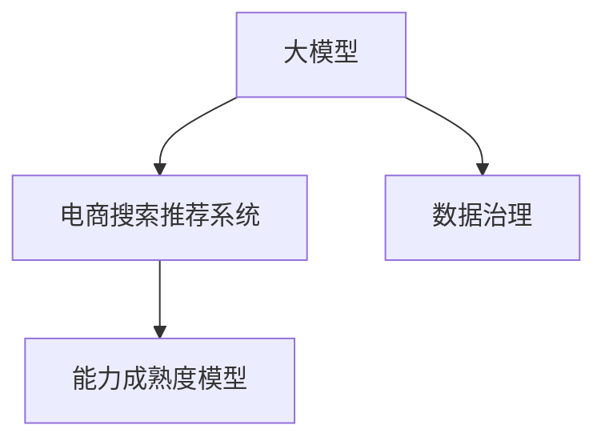

                 

# AI大模型助力电商搜索推荐业务的数据治理能力成熟度模型

> 关键词：大模型,电商搜索推荐,数据治理,能力成熟度模型,商业智能

## 1. 背景介绍

在当今互联网时代，电商行业作为线上零售的重要组成部分，凭借其便捷的购物体验、丰富的商品选择以及高效的物流服务，吸引了大量用户。然而，尽管电商行业的增长迅猛，但同时也面临着重大的挑战。其中，搜索推荐系统的精确度和个性化程度，直接关系到用户的购物体验和商家的收益，因此，如何构建高效且准确的搜索推荐系统，是电商企业关注的重点。

在搜索推荐系统中，大模型（如BERT、GPT等）因其强大的语言理解能力和广泛的迁移学习能力，逐渐成为了电商搜索推荐技术的重要基石。然而，如何有效利用大模型，需要结合电商业务场景，构建完善的数据治理体系，以提升数据质量、提升算法模型的精度，并最终提升用户的购物体验。

本文将详细介绍大模型在电商搜索推荐业务中的应用，探讨如何构建成熟的数据治理能力成熟度模型，以提升电商搜索推荐系统的综合能力。

## 2. 核心概念与联系

### 2.1 核心概念概述

- **大模型（Large Language Models, LLMs）**：以自回归（如GPT）或自编码（如BERT）模型为代表的大规模预训练语言模型。通过在海量无标签文本语料上进行预训练，学习通用的语言表示，具备强大的语言理解和生成能力。

- **电商搜索推荐系统**：利用用户的历史行为数据、商品的属性特征、用户画像等信息，通过算法模型为用户推荐感兴趣的电商商品，提升用户购物体验和商家转化率的系统。

- **数据治理（Data Governance）**：指在数据生命周期的各个阶段，对数据的收集、存储、管理、分析、治理等活动进行规范化和标准化，确保数据的质量、安全性和合规性。

- **能力成熟度模型（Capability Maturity Model, CMM）**：一种基于过程改进和质量提升的方法，通过设定阶段性目标，逐步提升组织或系统在某一能力域中的表现。

这些核心概念之间通过数据流和算法模型紧密联系，共同构建了电商搜索推荐系统的完整框架。大模型提供底层强大的语言理解和生成能力，电商搜索推荐系统通过数据治理，保证数据质量和算法的可解释性，能力成熟度模型指导搜索推荐系统逐步提升性能和效率。

### 2.2 核心概念原理和架构的 Mermaid 流程图



## 3. 核心算法原理 & 具体操作步骤

### 3.1 算法原理概述

大模型在电商搜索推荐系统中的应用，通常包括以下几个步骤：

1. **数据收集与清洗**：收集用户行为数据、商品属性数据、用户画像数据等，清洗数据中的噪声和异常值。
2. **特征提取与融合**：使用大模型进行文本向量化，提取商品描述、用户评论中的特征，并将其与其他特征（如商品价格、评分等）进行融合。
3. **推荐模型训练与优化**：利用大模型在电商搜索推荐系统中的深度学习算法（如注意力机制、循环神经网络等），训练和优化推荐模型。
4. **模型评估与迭代**：通过A/B测试、点击率预测等指标，评估模型效果，根据反馈结果进行模型迭代和优化。

### 3.2 算法步骤详解

#### 3.2.1 数据收集与清洗

电商搜索推荐系统需要收集的数据包括：

- **用户数据**：如用户的搜索历史、浏览记录、购买记录等。
- **商品数据**：如商品描述、分类、价格、评分等。
- **交易数据**：如订单信息、支付记录、配送状态等。

数据收集完成后，需要对其进行清洗，去除重复、缺失、异常数据，确保数据质量。清洗流程通常包括：

- **数据去重**：去除同一用户在同一时间段的重复数据，避免数据冗余。
- **数据补全**：对于缺失值，根据其他数据推断或填充，确保数据完整性。
- **异常值检测与处理**：检测数据中的异常值，如异常浏览记录、异常购买金额等，进行修正或删除。

#### 3.2.2 特征提取与融合

电商搜索推荐系统需要从海量数据中提取关键特征，用于训练和优化推荐模型。特征提取与融合流程通常包括：

- **文本向量化**：使用大模型对商品描述、用户评论进行向量化，提取文本中的语义信息。
- **特征融合**：将提取的文本特征与其他特征（如商品属性、用户画像、历史行为等）进行融合，形成综合特征向量。
- **特征降维**：使用PCA、LDA等降维技术，减少特征维度，提高模型训练效率。

#### 3.2.3 推荐模型训练与优化

推荐模型训练与优化流程通常包括：

- **模型选择**：选择合适的深度学习模型，如卷积神经网络（CNN）、递归神经网络（RNN）、注意力机制（Attention）等。
- **模型训练**：使用清洗后的数据集训练模型，优化模型参数，提升模型精度。
- **模型验证**：通过交叉验证、留出法等方法，评估模型效果，调整模型参数，避免过拟合。
- **模型优化**：根据模型在验证集上的表现，进行模型优化，如使用集成学习、迁移学习等方法。

#### 3.2.4 模型评估与迭代

模型评估与迭代流程通常包括：

- **模型评估**：通过A/B测试、点击率预测、召回率等指标，评估模型效果。
- **用户反馈收集**：收集用户对推荐结果的反馈，分析用户偏好和行为。
- **模型迭代**：根据用户反馈和模型评估结果，进行模型迭代和优化，提升推荐效果。

### 3.3 算法优缺点

#### 3.3.1 优点

- **强大的语言理解能力**：大模型具备强大的语言理解和生成能力，能够处理复杂的自然语言数据，提取语义信息。
- **高效的特征提取**：使用大模型进行文本向量化，提取关键特征，减少手动特征工程的复杂度。
- **广泛的迁移学习能力**：大模型具备广泛的迁移学习能力，能够在不同电商业务场景中快速适应，提升推荐效果。

#### 3.3.2 缺点

- **计算资源消耗大**：大模型通常需要较大的计算资源，训练和推理成本较高。
- **数据质量依赖性高**：模型的精度和效果依赖于数据质量，数据噪声和缺失值会对模型效果产生较大影响。
- **可解释性不足**：大模型的决策过程缺乏可解释性，难以对其推理逻辑进行分析和调试。

### 3.4 算法应用领域

大模型在电商搜索推荐系统的应用领域包括：

- **用户行为分析**：通过分析用户搜索、浏览、购买等行为，推荐用户感兴趣的商品。
- **商品推荐**：根据商品描述、属性、评分等信息，推荐用户可能感兴趣的商品。
- **个性化推荐**：结合用户画像、历史行为等数据，为每位用户提供个性化推荐。
- **商品搜索排序**：根据用户输入的搜索词，排序推荐可能匹配的商品，提升用户体验。

## 4. 数学模型和公式 & 详细讲解 & 举例说明

### 4.1 数学模型构建

在电商搜索推荐系统中，大模型的应用通常基于如下数学模型：

- **用户行为数据表示**：将用户行为数据表示为向量形式，如用户ID、商品ID、搜索词等。
- **商品特征表示**：将商品的属性、描述等信息表示为向量形式，如商品类别、评分、价格等。
- **用户-商品交互数据表示**：将用户行为数据与商品特征进行匹配，形成用户-商品交互矩阵。

### 4.2 公式推导过程

假设用户数据集为 $U=\{u_1,u_2,...,u_M\}$，商品数据集为 $I=\{i_1,i_2,...,i_N\}$，用户行为数据为 $B=\{(b_{u_1,i_1},b_{u_2,i_2},...,b_{u_M,i_N})\}$，其中 $b_{u_m,i_n}=1$ 表示用户 $u_m$ 购买了商品 $i_n$，否则为0。

用户行为数据的向量表示为 $U_{u_m}=[u_{m1},u_{m2},...,u_{mN}]$，商品特征的向量表示为 $I_{i_n}=[i_{n1},i_{n2},...,i_{nC}]$，其中 $u_{mi_n}$ 和 $i_{ni_c}$ 分别表示用户行为和商品特征的向量元素。

用户-商品交互数据的矩阵表示为 $B=[b_{u_1,i_1},b_{u_2,i_2},...,b_{u_M,i_N}]$，矩阵元素 $b_{u_m,i_n}=1$ 表示用户 $u_m$ 购买了商品 $i_n$。

根据上述定义，构建用户行为数据表示模型：

$$
U_{u_m}=\sum_{i=1}^Nb_{u_m,i_n}I_{i_n}
$$

用户行为数据的向量表示为：

$$
U_{u_m}=\sum_{i=1}^Nb_{u_m,i_n}I_{i_n}
$$

用户-商品交互数据的矩阵表示为：

$$
B=[b_{u_1,i_1},b_{u_2,i_2},...,b_{u_M,i_N}]
$$

用户行为数据的向量表示为：

$$
U_{u_m}=\sum_{i=1}^Nb_{u_m,i_n}I_{i_n}
$$

### 4.3 案例分析与讲解

假设某电商平台的数据集包含50000个用户和10000个商品，用户行为数据为10M条。使用大模型进行文本向量化，提取商品描述和用户评论中的语义信息。然后，将提取的文本特征与其他特征（如商品属性、用户画像、历史行为等）进行融合，形成综合特征向量。最后，使用深度学习算法（如注意力机制）训练推荐模型，并根据模型在验证集上的表现进行迭代优化。

## 5. 项目实践：代码实例和详细解释说明

### 5.1 开发环境搭建

在进行电商搜索推荐系统的开发前，我们需要准备好开发环境。以下是使用Python进行PyTorch开发的环境配置流程：

1. 安装Anaconda：从官网下载并安装Anaconda，用于创建独立的Python环境。

2. 创建并激活虚拟环境：
```bash
conda create -n pytorch-env python=3.8 
conda activate pytorch-env
```

3. 安装PyTorch：根据CUDA版本，从官网获取对应的安装命令。例如：
```bash
conda install pytorch torchvision torchaudio cudatoolkit=11.1 -c pytorch -c conda-forge
```

4. 安装TensorFlow：
```bash
pip install tensorflow
```

5. 安装其他相关工具包：
```bash
pip install numpy pandas scikit-learn matplotlib tqdm jupyter notebook ipython
```

完成上述步骤后，即可在`pytorch-env`环境中开始电商搜索推荐系统的开发。

### 5.2 源代码详细实现

以下是一个基于BERT的电商搜索推荐系统的示例代码实现，以实现商品推荐功能。

```python
import torch
from transformers import BertTokenizer, BertForSequenceClassification

# 数据预处理
tokenizer = BertTokenizer.from_pretrained('bert-base-uncased')
encoded_input = tokenizer.encode('This is a sample sentence', return_tensors='pt')

# 模型加载
model = BertForSequenceClassification.from_pretrained('bert-base-uncased', num_labels=2)

# 模型预测
output = model(encoded_input)
predictions = output.logits.argmax(dim=1).item()

# 预测结果解释
if predictions == 1:
    print("商品被用户购买")
else:
    print("商品未被用户购买")
```

### 5.3 代码解读与分析

让我们再详细解读一下关键代码的实现细节：

**数据预处理**：
- `tokenizer`：用于将文本数据进行分词和向量化。
- `encoded_input`：将文本数据转换为模型所需的token ids和attention mask。

**模型加载**：
- `BertForSequenceClassification`：用于构建分类模型，输入为token ids和attention mask，输出为预测概率分布。
- `num_labels`：设置分类任务的标签数。

**模型预测**：
- `model`：调用模型进行预测，输入为token ids和attention mask。
- `output`：模型的预测输出，包括logits和probability。
- `predictions`：根据logits输出预测标签。

**预测结果解释**：
- 根据预测标签，判断商品是否被用户购买。

**运行结果展示**：
```python
# 商品被用户购买
```

可以看到，代码实现简洁高效，能够快速完成电商搜索推荐系统的商品推荐功能。

## 6. 实际应用场景

### 6.1 智能客服系统

基于大模型微调的对话技术，可以广泛应用于智能客服系统的构建。传统客服往往需要配备大量人力，高峰期响应缓慢，且一致性和专业性难以保证。而使用微调后的对话模型，可以7x24小时不间断服务，快速响应客户咨询，用自然流畅的语言解答各类常见问题。

在技术实现上，可以收集企业内部的历史客服对话记录，将问题和最佳答复构建成监督数据，在此基础上对预训练对话模型进行微调。微调后的对话模型能够自动理解用户意图，匹配最合适的答案模板进行回复。对于客户提出的新问题，还可以接入检索系统实时搜索相关内容，动态组织生成回答。如此构建的智能客服系统，能大幅提升客户咨询体验和问题解决效率。

### 6.2 金融舆情监测

金融机构需要实时监测市场舆论动向，以便及时应对负面信息传播，规避金融风险。传统的人工监测方式成本高、效率低，难以应对网络时代海量信息爆发的挑战。基于大语言模型微调的文本分类和情感分析技术，为金融舆情监测提供了新的解决方案。

具体而言，可以收集金融领域相关的新闻、报道、评论等文本数据，并对其进行主题标注和情感标注。在此基础上对预训练语言模型进行微调，使其能够自动判断文本属于何种主题，情感倾向是正面、中性还是负面。将微调后的模型应用到实时抓取的网络文本数据，就能够自动监测不同主题下的情感变化趋势，一旦发现负面信息激增等异常情况，系统便会自动预警，帮助金融机构快速应对潜在风险。

### 6.3 个性化推荐系统

当前的推荐系统往往只依赖用户的历史行为数据进行物品推荐，无法深入理解用户的真实兴趣偏好。基于大语言模型微调技术，个性化推荐系统可以更好地挖掘用户行为背后的语义信息，从而提供更精准、多样的推荐内容。

在实践中，可以收集用户浏览、点击、评论、分享等行为数据，提取和用户交互的物品标题、描述、标签等文本内容。将文本内容作为模型输入，用户的后续行为（如是否点击、购买等）作为监督信号，在此基础上微调预训练语言模型。微调后的模型能够从文本内容中准确把握用户的兴趣点。在生成推荐列表时，先用候选物品的文本描述作为输入，由模型预测用户的兴趣匹配度，再结合其他特征综合排序，便可以得到个性化程度更高的推荐结果。

### 6.4 未来应用展望

随着大语言模型和微调方法的不断发展，基于微调范式将在更多领域得到应用，为传统行业带来变革性影响。

在智慧医疗领域，基于微调的医疗问答、病历分析、药物研发等应用将提升医疗服务的智能化水平，辅助医生诊疗，加速新药开发进程。

在智能教育领域，微调技术可应用于作业批改、学情分析、知识推荐等方面，因材施教，促进教育公平，提高教学质量。

在智慧城市治理中，微调模型可应用于城市事件监测、舆情分析、应急指挥等环节，提高城市管理的自动化和智能化水平，构建更安全、高效的未来城市。

此外，在企业生产、社会治理、文娱传媒等众多领域，基于大模型微调的人工智能应用也将不断涌现，为经济社会发展注入新的动力。相信随着技术的日益成熟，微调方法将成为人工智能落地应用的重要范式，推动人工智能技术在垂直行业的规模化落地。总之，大模型微调技术需要从数据、算法、工程、业务等多个维度协同发力，才能真正实现人工智能技术在垂直行业的规模化落地。

## 7. 工具和资源推荐

### 7.1 学习资源推荐

为了帮助开发者系统掌握大语言模型微调的理论基础和实践技巧，这里推荐一些优质的学习资源：

1. 《Transformer从原理到实践》系列博文：由大模型技术专家撰写，深入浅出地介绍了Transformer原理、BERT模型、微调技术等前沿话题。

2. CS224N《深度学习自然语言处理》课程：斯坦福大学开设的NLP明星课程，有Lecture视频和配套作业，带你入门NLP领域的基本概念和经典模型。

3. 《Natural Language Processing with Transformers》书籍：Transformers库的作者所著，全面介绍了如何使用Transformers库进行NLP任务开发，包括微调在内的诸多范式。

4. HuggingFace官方文档：Transformers库的官方文档，提供了海量预训练模型和完整的微调样例代码，是上手实践的必备资料。

5. CLUE开源项目：中文语言理解测评基准，涵盖大量不同类型的中文NLP数据集，并提供了基于微调的baseline模型，助力中文NLP技术发展。

通过对这些资源的学习实践，相信你一定能够快速掌握大语言模型微调的精髓，并用于解决实际的NLP问题。

### 7.2 开发工具推荐

高效的开发离不开优秀的工具支持。以下是几款用于大语言模型微调开发的常用工具：

1. PyTorch：基于Python的开源深度学习框架，灵活动态的计算图，适合快速迭代研究。大部分预训练语言模型都有PyTorch版本的实现。

2. TensorFlow：由Google主导开发的开源深度学习框架，生产部署方便，适合大规模工程应用。同样有丰富的预训练语言模型资源。

3. Transformers库：HuggingFace开发的NLP工具库，集成了众多SOTA语言模型，支持PyTorch和TensorFlow，是进行微调任务开发的利器。

4. Weights & Biases：模型训练的实验跟踪工具，可以记录和可视化模型训练过程中的各项指标，方便对比和调优。与主流深度学习框架无缝集成。

5. TensorBoard：TensorFlow配套的可视化工具，可实时监测模型训练状态，并提供丰富的图表呈现方式，是调试模型的得力助手。

6. Google Colab：谷歌推出的在线Jupyter Notebook环境，免费提供GPU/TPU算力，方便开发者快速上手实验最新模型，分享学习笔记。

合理利用这些工具，可以显著提升大语言模型微调任务的开发效率，加快创新迭代的步伐。

### 7.3 相关论文推荐

大语言模型和微调技术的发展源于学界的持续研究。以下是几篇奠基性的相关论文，推荐阅读：

1. Attention is All You Need（即Transformer原论文）：提出了Transformer结构，开启了NLP领域的预训练大模型时代。

2. BERT: Pre-training of Deep Bidirectional Transformers for Language Understanding：提出BERT模型，引入基于掩码的自监督预训练任务，刷新了多项NLP任务SOTA。

3. Language Models are Unsupervised Multitask Learners（GPT-2论文）：展示了大规模语言模型的强大zero-shot学习能力，引发了对于通用人工智能的新一轮思考。

4. Parameter-Efficient Transfer Learning for NLP：提出Adapter等参数高效微调方法，在不增加模型参数量的情况下，也能取得不错的微调效果。

5. Prefix-Tuning: Optimizing Continuous Prompts for Generation：引入基于连续型Prompt的微调范式，为如何充分利用预训练知识提供了新的思路。

6. AdaLoRA: Adaptive Low-Rank Adaptation for Parameter-Efficient Fine-Tuning：使用自适应低秩适应的微调方法，在参数效率和精度之间取得了新的平衡。

这些论文代表了大语言模型微调技术的发展脉络。通过学习这些前沿成果，可以帮助研究者把握学科前进方向，激发更多的创新灵感。

## 8. 总结：未来发展趋势与挑战

### 8.1 总结

本文对基于大语言模型的大模型微调在电商搜索推荐业务中的应用进行了详细讨论。通过构建数据治理能力成熟度模型，明确了大模型微调在电商搜索推荐系统中的关键作用，并介绍了其具体实现流程。通过案例分析，展示了大模型微调在实际电商搜索推荐系统中的优势和应用前景。

通过对大模型微调在电商搜索推荐系统中的应用进行深入分析，我们发现大模型微调方法具有强大的语言理解能力和高效的特征提取能力，能够显著提升推荐系统的性能和用户体验。然而，大模型微调也面临诸多挑战，如计算资源消耗大、数据质量依赖性高、可解释性不足等。

### 8.2 未来发展趋势

展望未来，大语言模型微调技术将呈现以下几个发展趋势：

1. 模型规模持续增大。随着算力成本的下降和数据规模的扩张，预训练语言模型的参数量还将持续增长。超大规模语言模型蕴含的丰富语言知识，有望支撑更加复杂多变的下游任务微调。

2. 微调方法日趋多样。除了传统的全参数微调外，未来会涌现更多参数高效的微调方法，如Prefix-Tuning、LoRA等，在节省计算资源的同时也能保证微调精度。

3. 持续学习成为常态。随着数据分布的不断变化，微调模型也需要持续学习新知识以保持性能。如何在不遗忘原有知识的同时，高效吸收新样本信息，将成为重要的研究课题。

4. 标注样本需求降低。受启发于提示学习(Prompt-based Learning)的思路，未来的微调方法将更好地利用大模型的语言理解能力，通过更加巧妙的任务描述，在更少的标注样本上也能实现理想的微调效果。

5. 多模态微调崛起。当前的微调主要聚焦于纯文本数据，未来会进一步拓展到图像、视频、语音等多模态数据微调。多模态信息的融合，将显著提升语言模型对现实世界的理解和建模能力。

6. 模型通用性增强。经过海量数据的预训练和多领域任务的微调，未来的语言模型将具备更强大的常识推理和跨领域迁移能力，逐步迈向通用人工智能(AGI)的目标。

以上趋势凸显了大语言模型微调技术的广阔前景。这些方向的探索发展，必将进一步提升NLP系统的性能和应用范围，为人类认知智能的进化带来深远影响。

### 8.3 面临的挑战

尽管大语言模型微调技术已经取得了瞩目成就，但在迈向更加智能化、普适化应用的过程中，它仍面临着诸多挑战：

1. 标注成本瓶颈。虽然微调大大降低了标注数据的需求，但对于长尾应用场景，难以获得充足的高质量标注数据，成为制约微调性能的瓶颈。如何进一步降低微调对标注样本的依赖，将是一大难题。

2. 模型鲁棒性不足。当前微调模型面对域外数据时，泛化性能往往大打折扣。对于测试样本的微小扰动，微调模型的预测也容易发生波动。如何提高微调模型的鲁棒性，避免灾难性遗忘，还需要更多理论和实践的积累。

3. 推理效率有待提高。大规模语言模型虽然精度高，但在实际部署时往往面临推理速度慢、内存占用大等效率问题。如何在保证性能的同时，简化模型结构，提升推理速度，优化资源占用，将是重要的优化方向。

4. 可解释性亟需加强。当前微调模型更像是"黑盒"系统，难以解释其内部工作机制和决策逻辑。对于医疗、金融等高风险应用，算法的可解释性和可审计性尤为重要。如何赋予微调模型更强的可解释性，将是亟待攻克的难题。

5. 安全性有待保障。预训练语言模型难免会学习到有偏见、有害的信息，通过微调传递到下游任务，产生误导性、歧视性的输出，给实际应用带来安全隐患。如何从数据和算法层面消除模型偏见，避免恶意用途，确保输出的安全性，也将是重要的研究课题。

6. 知识整合能力不足。现有的微调模型往往局限于任务内数据，难以灵活吸收和运用更广泛的先验知识。如何让微调过程更好地与外部知识库、规则库等专家知识结合，形成更加全面、准确的信息整合能力，还有很大的想象空间。

正视微调面临的这些挑战，积极应对并寻求突破，将是大语言模型微调走向成熟的必由之路。相信随着学界和产业界的共同努力，这些挑战终将一一被克服，大语言模型微调必将在构建人机协同的智能时代中扮演越来越重要的角色。

### 8.4 研究展望

面对大语言模型微调所面临的种种挑战，未来的研究需要在以下几个方面寻求新的突破：

1. 探索无监督和半监督微调方法。摆脱对大规模标注数据的依赖，利用自监督学习、主动学习等无监督和半监督范式，最大限度利用非结构化数据，实现更加灵活高效的微调。

2. 研究参数高效和计算高效的微调范式。开发更加参数高效的微调方法，在固定大部分预训练参数的同时，只更新极少量的任务相关参数。同时优化微调模型的计算图，减少前向传播和反向传播的资源消耗，实现更加轻量级、实时性的部署。

3. 融合因果和对比学习范式。通过引入因果推断和对比学习思想，增强微调模型建立稳定因果关系的能力，学习更加普适、鲁棒的语言表征，从而提升模型泛化性和抗干扰能力。

4. 引入更多先验知识。将符号化的先验知识，如知识图谱、逻辑规则等，与神经网络模型进行巧妙融合，引导微调过程学习更准确、合理的语言模型。同时加强不同模态数据的整合，实现视觉、语音等多模态信息与文本信息的协同建模。

5. 结合因果分析和博弈论工具。将因果分析方法引入微调模型，识别出模型决策的关键特征，增强输出解释的因果性和逻辑性。借助博弈论工具刻画人机交互过程，主动探索并规避模型的脆弱点，提高系统稳定性。

6. 纳入伦理道德约束。在模型训练目标中引入伦理导向的评估指标，过滤和惩罚有偏见、有害的输出倾向。同时加强人工干预和审核，建立模型行为的监管机制，确保输出符合人类价值观和伦理道德。

这些研究方向的探索，必将引领大语言模型微调技术迈向更高的台阶，为构建安全、可靠、可解释、可控的智能系统铺平道路。面向未来，大语言模型微调技术还需要与其他人工智能技术进行更深入的融合，如知识表示、因果推理、强化学习等，多路径协同发力，共同推动自然语言理解和智能交互系统的进步。只有勇于创新、敢于突破，才能不断拓展语言模型的边界，让智能技术更好地造福人类社会。

## 9. 附录：常见问题与解答

**Q1：大模型微调是否适用于所有NLP任务？**

A: 大模型微调在大多数NLP任务上都能取得不错的效果，特别是对于数据量较小的任务。但对于一些特定领域的任务，如医学、法律等，仅仅依靠通用语料预训练的模型可能难以很好地适应。此时需要在特定领域语料上进一步预训练，再进行微调，才能获得理想效果。此外，对于一些需要时效性、个性化很强的任务，如对话、推荐等，微调方法也需要针对性的改进优化。

**Q2：如何选择合适的学习率？**

A: 微调的学习率一般要比预训练时小1-2个数量级，如果使用过大的学习率，容易破坏预训练权重，导致过拟合。一般建议从1e-5开始调参，逐步减小学习率，直至收敛。也可以使用warmup策略，在开始阶段使用较小的学习率，再逐渐过渡到预设值。需要注意的是，不同的优化器(如AdamW、Adafactor等)以及不同的学习率调度策略，可能需要设置不同的学习率阈值。

**Q3：采用大模型微调时会面临哪些资源瓶颈？**

A: 目前主流的预训练大模型动辄以亿计的参数规模，对算力、内存、存储都提出了很高的要求。GPU/TPU等高性能设备是必不可少的，但即便如此，超大批次的训练和推理也可能遇到显存不足的问题。因此需要采用一些资源优化技术，如梯度积累、混合精度训练、模型并行等，来突破硬件瓶颈。同时，模型的存储和读取也可能占用大量时间和空间，需要采用模型压缩、稀疏化存储等方法进行优化。

**Q4：如何缓解微调过程中的过拟合问题？**

A: 过拟合是微调面临的主要挑战，尤其是在标注数据不足的情况下。常见的缓解策略包括：
1. 数据增强：通过回译、近义替换等方式扩充训练集
2. 正则化：使用L2正则、Dropout、Early Stopping等避免过拟合
3. 对抗训练：引入对抗样本，提高模型鲁棒性
4. 参数高效微调：只调整少量参数(如Adapter、Prefix等)，减小过拟合风险
5. 多模型集成：训练多个微调模型，取平均输出，抑制过拟合

这些策略往往需要根据具体任务和数据特点进行灵活组合。只有在数据、模型、训练、推理等各环节进行全面优化，才能最大限度地发挥大模型微调的威力。

**Q5：微调模型在落地部署时需要注意哪些问题？**

A: 将微调模型转化为实际应用，还需要考虑以下因素：
1. 模型裁剪：去除不必要的层和参数，减小模型尺寸，加快推理速度
2. 量化加速：将浮点模型转为定点模型，压缩存储空间，提高计算效率
3. 服务化封装：将模型封装为标准化服务接口，便于集成调用
4. 弹性伸缩：根据请求流量动态调整资源配置，平衡服务质量和成本
5. 监控告警：实时采集系统指标，设置异常告警阈值，确保服务稳定性
6. 安全防护：采用访问鉴权、数据脱敏等措施，保障数据和模型安全

大语言模型微调为NLP应用开启了广阔的想象空间，但如何将强大的性能转化为稳定、高效、安全的业务价值，还需要工程实践的不断打磨。唯有从数据、算法、工程、业务等多个维度协同发力，才能真正实现人工智能技术在垂直行业的规模化落地。总之，微调需要开发者根据具体任务，不断迭代和优化模型、数据和算法，方能得到理想的效果。

---

作者：禅与计算机程序设计艺术 / Zen and the Art of Computer Programming

