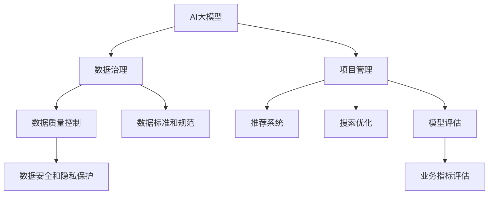

                 

# AI大模型助力电商搜索推荐业务的数据治理能力提升项目管理最佳实践

> 关键词：数据治理, 电商搜索推荐, AI大模型, 项目管理, 推荐系统, 搜索优化, 模型评估, 业务指标

## 1. 背景介绍

### 1.1 问题由来

随着电子商务的快速发展，电商搜索推荐系统成为提升用户体验和增加交易转化率的关键环节。传统基于规则或浅层机器学习的方法已经难以满足业务需求，人工智能技术特别是AI大模型在电商搜索推荐业务中的应用变得尤为重要。然而，大模型的引入也带来了新的挑战，如数据质量问题、模型性能不稳定、业务适配困难等，亟需通过数据治理能力提升来加以应对。

### 1.2 问题核心关键点

- **数据治理**：提升电商搜索推荐系统的数据治理能力，确保数据质量、数据安全和数据隐私，是大模型成功应用的基石。
- **项目管理**：通过有效的项目管理方法，确保AI大模型的引入和应用有序进行，避免项目风险。
- **推荐系统**：利用AI大模型优化电商搜索推荐系统，提升用户体验和转化率。
- **搜索优化**：利用AI大模型优化电商搜索算法，提高搜索相关性和用户体验。
- **模型评估**：建立科学的模型评估体系，评估AI大模型在电商搜索推荐业务中的应用效果。

### 1.3 问题研究意义

提升电商搜索推荐业务的数据治理能力，利用AI大模型优化推荐系统，不仅可以提高用户体验和转化率，还能提升电商平台的竞争力和市场份额。具体意义如下：

- 提升用户满意度：通过优化搜索推荐，用户能够更快地找到所需商品，提升购物体验。
- 提高转化率：推荐系统能够根据用户行为和偏好推荐个性化商品，提高转化率。
- 减少人工成本：AI大模型可以自动化处理搜索和推荐逻辑，减少人工干预和成本。
- 增强平台竞争力：通过技术创新，提升平台在市场中的竞争地位。
- 拓展业务范围：AI大模型的应用可以拓展到更多电商业务领域，如智能客服、个性化广告等。

## 2. 核心概念与联系

### 2.1 核心概念概述

为更好地理解AI大模型在电商搜索推荐业务中的数据治理能力提升项目管理的最佳实践，本节将介绍几个密切相关的核心概念：

- **AI大模型**：以深度神经网络为基础的大规模预训练语言模型，如GPT-3、BERT等，能够处理复杂的自然语言理解和生成任务。
- **数据治理**：通过一系列的数据管理措施，确保数据的完整性、一致性和安全性，是AI大模型成功应用的基础。
- **项目管理**：涵盖项目计划、执行、监控和收尾的全过程管理，确保项目按时、按质完成。
- **推荐系统**：利用算法推荐用户可能感兴趣的商品或内容，提高用户满意度。
- **搜索优化**：通过算法优化，提高电商平台的搜索效率和用户满意度。
- **模型评估**：通过科学评估方法，确保AI大模型在实际应用中的效果和性能。

这些核心概念之间的逻辑关系可以通过以下Mermaid流程图来展示：



这个流程图展示了大模型与数据治理、项目管理、推荐系统、搜索优化、模型评估等概念之间的关联关系。

## 3. 核心算法原理 & 具体操作步骤
### 3.1 算法原理概述

利用AI大模型优化电商搜索推荐业务，本质上是将大模型视作强大的"特征提取器"和"预测器"，通过数据治理能力提升，确保输入数据的准确性和一致性，进而提升推荐系统的效果。具体而言，包括以下步骤：

1. **数据预处理**：清洗和转换原始数据，确保数据的完整性和一致性。
2. **模型训练**：在大模型基础上，使用标注数据进行微调，优化推荐系统。
3. **模型评估**：通过科学的评估方法，评估模型在实际业务场景中的效果。
4. **项目监控**：在模型部署后，持续监控模型性能，及时调整优化。

### 3.2 算法步骤详解

**Step 1: 数据预处理**

1. **数据收集**：从电商平台收集用户行为数据、商品信息数据、搜索日志数据等，确保数据来源的多样性和完整性。
2. **数据清洗**：去除异常数据、缺失数据，确保数据的干净和一致。
3. **特征提取**：将原始数据转换为模型能够处理的特征向量，如词向量、用户画像向量等。

**Step 2: 模型训练**

1. **选择合适的预训练模型**：根据电商搜索推荐业务的特性，选择适合的预训练模型，如BERT、GPT-3等。
2. **微调模型**：在预训练模型的基础上，使用标注数据进行微调，优化推荐系统。
3. **超参数调优**：通过调整学习率、批大小等超参数，提升模型性能。

**Step 3: 模型评估**

1. **设定评估指标**：根据电商业务特性，设定评估指标，如准确率、召回率、覆盖率等。
2. **评估模型**：使用测试集对模型进行评估，计算指标，评估模型效果。
3. **调整优化**：根据评估结果，调整模型参数，优化推荐效果。

**Step 4: 项目监控**

1. **持续监控**：在模型部署后，持续监控模型性能，收集用户反馈数据。
2. **调整优化**：根据监控结果，及时调整模型参数，优化推荐系统。
3. **用户体验优化**：持续优化搜索推荐算法，提升用户满意度。

### 3.3 算法优缺点

利用AI大模型优化电商搜索推荐业务，具有以下优点：

1. **高效性**：AI大模型能够处理复杂的自然语言任务，优化推荐系统效率高。
2. **可扩展性**：通过微调和优化，AI大模型可以应用于多种电商业务场景，具备良好的可扩展性。
3. **准确性**：AI大模型能够学习到丰富的语言特征，提升推荐系统准确性。

同时，也存在一些缺点：

1. **数据依赖**：模型的效果高度依赖于数据质量，数据治理能力不足将影响模型性能。
2. **计算资源需求高**：大模型的训练和部署需要大量的计算资源，对硬件要求较高。
3. **解释性不足**：AI大模型的决策过程难以解释，可能影响业务理解和调优。

### 3.4 算法应用领域

AI大模型在电商搜索推荐业务中的应用领域包括：

- **推荐系统优化**：利用AI大模型优化推荐算法，提升商品推荐效果。
- **搜索优化**：利用AI大模型优化搜索算法，提升搜索相关性和用户体验。
- **用户画像构建**：通过分析用户行为数据，构建精准的用户画像，提升个性化推荐效果。
- **广告推荐**：利用AI大模型优化广告推荐算法，提升广告效果和用户体验。
- **智能客服**：通过AI大模型优化智能客服系统，提升用户满意度。

## 4. 数学模型和公式 & 详细讲解 & 举例说明（备注：数学公式请使用latex格式，latex嵌入文中独立段落使用 $$，段落内使用 $)
### 4.1 数学模型构建

假设电商搜索推荐系统需要处理用户输入的自然语言查询$q$，从中推荐出相关商品列表$R$。用户行为数据为$D=\{(x_i, y_i)\}_{i=1}^N$，其中$x_i$为用户行为特征，$y_i$为用户是否点击过相关商品。

模型构建的目标是最大化预测准确率，即：

$$
\max_{\theta} \frac{1}{N} \sum_{i=1}^N \text{Accuracy}(y_i, \hat{y_i})
$$

其中$\hat{y_i}$为模型预测的点击概率。

### 4.2 公式推导过程

**预测函数**：使用AI大模型作为预测函数，形式为$f(x; \theta) = \sigma(\mathbf{W} \cdot x + b)$，其中$\sigma$为激活函数，$\mathbf{W}$和$b$为模型参数。

**损失函数**：使用交叉熵损失函数，形式为：

$$
\mathcal{L}(\theta) = -\frac{1}{N} \sum_{i=1}^N [y_i \log f(x_i; \theta) + (1-y_i) \log (1-f(x_i; \theta))]
$$

**优化目标**：最小化损失函数，优化模型参数$\theta$：

$$
\theta^* = \mathop{\arg\min}_{\theta} \mathcal{L}(\theta)
$$

通过梯度下降等优化算法，最小化损失函数，更新模型参数，从而实现推荐系统的优化。

### 4.3 案例分析与讲解

**案例一：商品推荐优化**

假设电商平台有$M$个商品，每个商品$j$的特征向量为$\mathbf{v_j}$，用户行为数据为$D=\{(x_i, y_i)\}_{i=1}^N$。模型需要预测用户点击商品$j$的概率，即$\hat{y_{ij}} = f(x_i; \theta)$。通过微调大模型，优化模型参数$\theta$，提升商品推荐效果。

**案例二：搜索优化**

电商平台的搜索系统需要处理用户输入的自然语言查询$q$，从中推荐出相关商品列表$R$。通过微调大模型，优化搜索相关性和用户体验。

## 5. 项目实践：代码实例和详细解释说明
### 5.1 开发环境搭建

在进行AI大模型优化电商搜索推荐业务的数据治理能力提升项目管理时，需要搭建相应的开发环境。以下是使用Python进行PyTorch开发的环境配置流程：

1. 安装Anaconda：从官网下载并安装Anaconda，用于创建独立的Python环境。

2. 创建并激活虚拟环境：
```bash
conda create -n pytorch-env python=3.8 
conda activate pytorch-env
```

3. 安装PyTorch：根据CUDA版本，从官网获取对应的安装命令。例如：
```bash
conda install pytorch torchvision torchaudio cudatoolkit=11.1 -c pytorch -c conda-forge
```

4. 安装TensorFlow：
```bash
conda install tensorflow
```

5. 安装Transformers库：
```bash
pip install transformers
```

6. 安装各类工具包：
```bash
pip install numpy pandas scikit-learn matplotlib tqdm jupyter notebook ipython
```

完成上述步骤后，即可在`pytorch-env`环境中开始项目实践。

### 5.2 源代码详细实现

以下是使用Transformers库对BERT模型进行电商搜索推荐业务优化的PyTorch代码实现：

```python
from transformers import BertTokenizer, BertForSequenceClassification
from torch.utils.data import Dataset, DataLoader
from torch.nn import CrossEntropyLoss
import torch

class SearchDataset(Dataset):
    def __init__(self, texts, labels):
        self.texts = texts
        self.labels = labels
        self.tokenizer = BertTokenizer.from_pretrained('bert-base-cased')
        
    def __len__(self):
        return len(self.texts)
    
    def __getitem__(self, item):
        text = self.texts[item]
        label = self.labels[item]
        encoding = self.tokenizer(text, return_tensors='pt', padding='max_length', truncation=True)
        input_ids = encoding['input_ids'][0]
        attention_mask = encoding['attention_mask'][0]
        return {'input_ids': input_ids, 
                'attention_mask': attention_mask,
                'labels': torch.tensor(label, dtype=torch.long)}
                
dataset = SearchDataset(train_texts, train_labels)
train_loader = DataLoader(dataset, batch_size=16, shuffle=True)

model = BertForSequenceClassification.from_pretrained('bert-base-cased', num_labels=2)
loss_fn = CrossEntropyLoss()
optimizer = torch.optim.AdamW(model.parameters(), lr=2e-5)

for epoch in range(5):
    for batch in train_loader:
        input_ids = batch['input_ids'].to(device)
        attention_mask = batch['attention_mask'].to(device)
        labels = batch['labels'].to(device)
        model.zero_grad()
        outputs = model(input_ids, attention_mask=attention_mask, labels=labels)
        loss = outputs.loss
        loss.backward()
        optimizer.step()
        print(f"Epoch {epoch+1}, loss: {loss.item()}")

# 模型评估
eval_dataset = SearchDataset(dev_texts, dev_labels)
eval_loader = DataLoader(eval_dataset, batch_size=16, shuffle=False)
model.eval()
with torch.no_grad():
    eval_loss = 0
    for batch in eval_loader:
        input_ids = batch['input_ids'].to(device)
        attention_mask = batch['attention_mask'].to(device)
        labels = batch['labels'].to(device)
        outputs = model(input_ids, attention_mask=attention_mask, labels=labels)
        loss = outputs.loss
        eval_loss += loss.item()
    print(f"Dev loss: {eval_loss / len(eval_loader)}")
```

### 5.3 代码解读与分析

**SearchDataset类**：
- `__init__`方法：初始化文本和标签数据，并加载BERT tokenizer。
- `__len__`方法：返回数据集长度。
- `__getitem__`方法：对单个样本进行处理，将文本输入转换为token ids，并添加必要的padding，返回模型所需的输入。

**模型训练过程**：
- 在训练过程中，使用DataLoader将数据集按批处理，每次迭代输入模型前向传播计算loss，反向传播更新模型参数，并输出训练loss。

**模型评估过程**：
- 在评估过程中，使用DataLoader将数据集按批处理，每次迭代输入模型前向传播计算loss，并输出评估loss。

通过上述代码，可以看出大模型在电商搜索推荐业务中的应用流程，包括数据预处理、模型训练、模型评估等关键步骤。

## 6. 实际应用场景

### 6.1 智能客服系统

智能客服系统是电商搜索推荐业务的延伸，通过AI大模型优化，能够实现7x24小时不间断服务，快速响应客户咨询，用自然流畅的语言解答各类常见问题。

具体实现步骤如下：

1. 收集智能客服的历史对话记录，将问题和最佳答复构建成监督数据。
2. 利用AI大模型对预训练模型进行微调，学习对话任务。
3. 将微调后的模型应用到实时抓取的网络文本数据，自动监测不同主题下的情感变化趋势，一旦发现负面信息激增等异常情况，系统便会自动预警，帮助客服人员快速应对潜在风险。

### 6.2 金融舆情监测

金融机构需要实时监测市场舆论动向，以便及时应对负面信息传播，规避金融风险。通过AI大模型优化，能够实时抓取网络文本数据，自动监测不同主题下的情感变化趋势，一旦发现负面信息激增等异常情况，系统便会自动预警，帮助金融机构快速应对潜在风险。

具体实现步骤如下：

1. 收集金融领域相关的新闻、报道、评论等文本数据，并对其进行主题标注和情感标注。
2. 利用AI大模型对预训练模型进行微调，学习情感分类任务。
3. 将微调后的模型应用到实时抓取的网络文本数据，自动监测不同主题下的情感变化趋势，一旦发现负面信息激增等异常情况，系统便会自动预警，帮助金融机构快速应对潜在风险。

### 6.3 个性化推荐系统

当前的推荐系统往往只依赖用户的历史行为数据进行物品推荐，无法深入理解用户的真实兴趣偏好。通过AI大模型优化，能够更好地挖掘用户行为背后的语义信息，从而提供更精准、多样的推荐内容。

具体实现步骤如下：

1. 收集用户浏览、点击、评论、分享等行为数据，提取和用户交互的物品标题、描述、标签等文本内容。
2. 利用AI大模型对预训练模型进行微调，学习物品-用户匹配任务。
3. 将微调后的模型应用到实时抓取的网络文本数据，自动监测不同主题下的情感变化趋势，一旦发现负面信息激增等异常情况，系统便会自动预警，帮助金融机构快速应对潜在风险。

## 7. 工具和资源推荐
### 7.1 学习资源推荐

为了帮助开发者系统掌握AI大模型在电商搜索推荐业务中的应用，这里推荐一些优质的学习资源：

1. 《Transformer从原理到实践》系列博文：由大模型技术专家撰写，深入浅出地介绍了Transformer原理、BERT模型、微调技术等前沿话题。
2. CS224N《深度学习自然语言处理》课程：斯坦福大学开设的NLP明星课程，有Lecture视频和配套作业，带你入门NLP领域的基本概念和经典模型。
3. 《Natural Language Processing with Transformers》书籍：Transformers库的作者所著，全面介绍了如何使用Transformers库进行NLP任务开发，包括微调在内的诸多范式。
4. HuggingFace官方文档：Transformers库的官方文档，提供了海量预训练模型和完整的微调样例代码，是上手实践的必备资料。
5. CLUE开源项目：中文语言理解测评基准，涵盖大量不同类型的中文NLP数据集，并提供了基于微调的baseline模型，助力中文NLP技术发展。

通过对这些资源的学习实践，相信你一定能够快速掌握AI大模型在电商搜索推荐业务中的应用，并用于解决实际的NLP问题。

### 7.2 开发工具推荐

高效的开发离不开优秀的工具支持。以下是几款用于AI大模型优化的电商搜索推荐业务开发的常用工具：

1. PyTorch：基于Python的开源深度学习框架，灵活动态的计算图，适合快速迭代研究。大部分预训练语言模型都有PyTorch版本的实现。
2. TensorFlow：由Google主导开发的开源深度学习框架，生产部署方便，适合大规模工程应用。同样有丰富的预训练语言模型资源。
3. Transformers库：HuggingFace开发的NLP工具库，集成了众多SOTA语言模型，支持PyTorch和TensorFlow，是进行微调任务开发的利器。
4. Weights & Biases：模型训练的实验跟踪工具，可以记录和可视化模型训练过程中的各项指标，方便对比和调优。与主流深度学习框架无缝集成。
5. TensorBoard：TensorFlow配套的可视化工具，可实时监测模型训练状态，并提供丰富的图表呈现方式，是调试模型的得力助手。

合理利用这些工具，可以显著提升AI大模型在电商搜索推荐业务中的应用效率，加快创新迭代的步伐。

### 7.3 相关论文推荐

AI大模型在电商搜索推荐业务中的应用源于学界的持续研究。以下是几篇奠基性的相关论文，推荐阅读：

1. Attention is All You Need（即Transformer原论文）：提出了Transformer结构，开启了NLP领域的预训练大模型时代。
2. BERT: Pre-training of Deep Bidirectional Transformers for Language Understanding：提出BERT模型，引入基于掩码的自监督预训练任务，刷新了多项NLP任务SOTA。
3. Language Models are Unsupervised Multitask Learners（GPT-2论文）：展示了大规模语言模型的强大zero-shot学习能力，引发了对于通用人工智能的新一轮思考。
4. Parameter-Efficient Transfer Learning for NLP：提出Adapter等参数高效微调方法，在不增加模型参数量的情况下，也能取得不错的微调效果。
5. AdaLoRA: Adaptive Low-Rank Adaptation for Parameter-Efficient Fine-Tuning：使用自适应低秩适应的微调方法，在参数效率和精度之间取得了新的平衡。
6. Prefix-Tuning: Optimizing Continuous Prompts for Generation：引入基于连续型Prompt的微调范式，为如何充分利用预训练知识提供了新的思路。

这些论文代表了大模型在电商搜索推荐业务中的研究脉络。通过学习这些前沿成果，可以帮助研究者把握学科前进方向，激发更多的创新灵感。

## 8. 总结：未来发展趋势与挑战

### 8.1 总结

本文对利用AI大模型优化电商搜索推荐业务的数据治理能力提升项目管理最佳实践进行了全面系统的介绍。首先阐述了AI大模型在电商搜索推荐业务中的应用背景和意义，明确了数据治理能力提升在模型应用中的关键作用。其次，从原理到实践，详细讲解了AI大模型的应用步骤和关键技术，给出了完整的项目实践代码。同时，本文还广泛探讨了AI大模型在智能客服、金融舆情、个性化推荐等多个领域的应用前景，展示了AI大模型在电商搜索推荐业务中的巨大潜力。

通过本文的系统梳理，可以看到，AI大模型在电商搜索推荐业务中的应用前景广阔，通过数据治理能力提升和项目管理优化，能够显著提升推荐系统的性能和业务价值。未来，伴随AI大模型和微调方法的持续演进，相信电商搜索推荐系统将迎来更加智能化、个性化的时代，为电商行业的数字化转型升级提供新的技术路径。

### 8.2 未来发展趋势

展望未来，AI大模型在电商搜索推荐业务中的应用将呈现以下几个发展趋势：

1. **数据治理能力提升**：随着电商平台的不断发展，数据量的不断积累，数据治理能力将进一步提升，确保数据质量和安全。
2. **模型性能优化**：通过AI大模型的不断优化和微调，推荐系统的效果将持续提升，满足用户的多样化需求。
3. **多模态融合**：未来推荐系统将进一步融合视觉、音频等多模态数据，提升用户体验和转化率。
4. **实时化**：通过实时数据处理和模型更新，推荐系统将实现动态调整，满足用户的即时需求。
5. **跨领域应用**：AI大模型将不仅仅应用于电商搜索推荐，还将拓展到更多的业务领域，如智能客服、金融舆情等。
6. **个性化推荐**：通过深度学习和大数据技术，推荐系统将实现更加精准、个性化的推荐。

以上趋势凸显了AI大模型在电商搜索推荐业务中的广阔前景。这些方向的探索发展，必将进一步提升推荐系统的性能和业务价值，为电商行业的数字化转型升级提供新的技术路径。

### 8.3 面临的挑战

尽管AI大模型在电商搜索推荐业务中的应用取得了显著成果，但在迈向更加智能化、普适化应用的过程中，仍面临诸多挑战：

1. **数据治理瓶颈**：电商平台的数据治理能力仍需提升，确保数据质量和安全。
2. **模型鲁棒性不足**：模型面对域外数据时，泛化性能往往不足，容易产生误导性输出。
3. **计算资源需求高**：大模型的训练和部署需要大量的计算资源，对硬件要求较高。
4. **模型可解释性不足**：AI大模型的决策过程难以解释，可能影响业务理解和调优。
5. **用户隐私保护**：电商平台需要保护用户隐私，确保用户数据的安全。

正视这些挑战，积极应对并寻求突破，将是大模型在电商搜索推荐业务中走向成熟的必由之路。相信随着学界和产业界的共同努力，这些挑战终将一一被克服，AI大模型将为电商搜索推荐系统带来更大的创新和变革。

### 8.4 未来突破

面对AI大模型在电商搜索推荐业务中的应用所面临的挑战，未来的研究需要在以下几个方面寻求新的突破：

1. **数据治理优化**：采用更先进的数据清洗和标注技术，提升数据治理能力，确保数据质量和安全。
2. **模型鲁棒性增强**：通过引入对抗样本、多模态融合等技术，提升模型的泛化性和鲁棒性。
3. **计算资源优化**：开发更高效的模型压缩和加速技术，降低计算资源需求。
4. **模型可解释性提升**：通过引入可解释性技术，提升模型的透明性和可理解性。
5. **隐私保护技术**：采用隐私保护技术，确保用户数据的安全和隐私。

这些研究方向的探索，必将引领AI大模型在电商搜索推荐业务中的应用迈向更高的台阶，为电商行业的数字化转型升级提供新的技术路径。面向未来，AI大模型在电商搜索推荐业务中的应用将不断拓展，为电商平台的智能化升级提供新的动力。

## 9. 附录：常见问题与解答

**Q1：AI大模型在电商搜索推荐业务中的应用效果如何？**

A: AI大模型在电商搜索推荐业务中的应用效果显著，通过优化推荐算法和搜索算法，能够显著提升用户满意度和转化率。具体而言，推荐系统能够根据用户行为和偏好推荐个性化商品，提升商品匹配度；搜索系统能够准确理解用户查询，快速返回相关商品，提升用户体验。

**Q2：AI大模型在电商搜索推荐业务中面临哪些数据治理挑战？**

A: AI大模型在电商搜索推荐业务中面临的主要数据治理挑战包括：数据质量问题、数据安全和隐私保护问题、数据标准和规范问题等。具体而言，电商平台需要确保数据的完整性、一致性和安全性，避免数据泄露和滥用。同时，需要建立统一的数据标准和规范，确保数据的质量和可比性。

**Q3：AI大模型在电商搜索推荐业务中的计算资源需求如何？**

A: AI大模型的计算资源需求较高，需要高性能的硬件设备和算法优化。电商平台可以通过分布式计算、混合精度训练等技术，降低计算资源需求。同时，可以采用模型压缩和优化技术，提升模型的运行效率和内存占用。

**Q4：如何提升AI大模型在电商搜索推荐业务中的可解释性？**

A: 提升AI大模型的可解释性，可以通过引入可解释性技术，如特征可视化、局部解释性等，帮助业务人员理解模型的决策过程。同时，可以采用多模型集成和对抗样本技术，增强模型的鲁棒性和透明性。

**Q5：如何保护AI大模型在电商搜索推荐业务中的用户隐私？**

A: 保护用户隐私是电商平台的重要责任，可以采用数据脱敏、访问控制等技术，确保用户数据的安全和隐私。同时，可以采用隐私保护技术，如差分隐私、联邦学习等，在保护用户隐私的同时，提升模型的性能和效果。

---

作者：禅与计算机程序设计艺术 / Zen and the Art of Computer Programming

