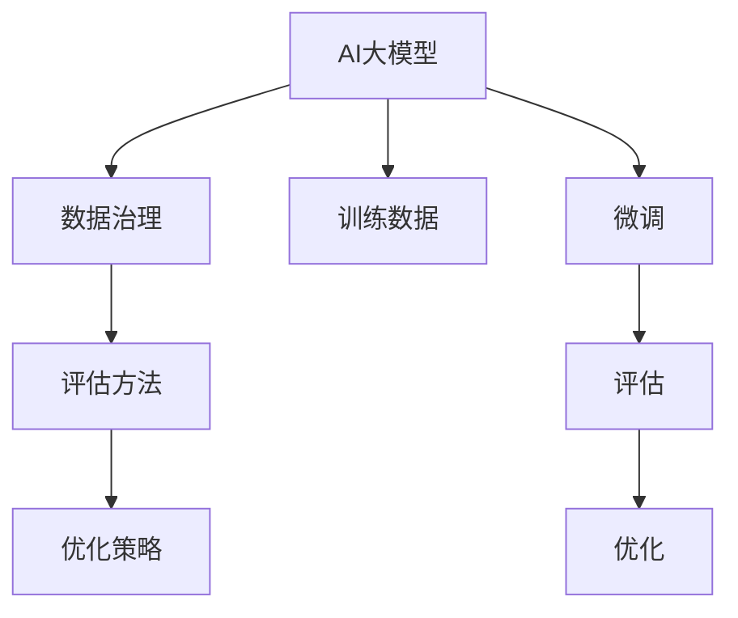

                 

## 1. 背景介绍

### 1.1 问题由来

随着电子商务的迅猛发展，用户搜索推荐系统成为了电商平台的核心竞争力之一。为了提升用户体验和交易转化率，各大电商平台纷纷引入高级人工智能技术，特别是大规模预训练语言模型，来辅助构建高效、精准、个性化的搜索推荐系统。然而，面对海量、多源、异构的数据，如何有效地治理数据，评估和优化搜索推荐系统的能力，仍然是一个重大的挑战。

### 1.2 问题核心关键点

电商平台的数据治理能力评估体系，主要涉及以下几个关键点：
- **数据治理：** 涉及数据收集、清洗、标注、融合等环节，确保数据质量和一致性。
- **评估方法：** 使用各种指标和模型评估搜索推荐系统的性能，包括点击率、转化率、覆盖率等。
- **优化策略：** 利用数据治理和评估的结果，指导模型的优化，如超参数调优、模型选择、数据增强等。

本文将系统介绍AI大模型在电商搜索推荐业务中的数据治理能力评估体系，并探讨如何通过优化数据治理流程、提升评估方法、改进模型调优策略，来持续优化电商搜索推荐系统，以期在电商领域带来更大的价值。

### 1.3 问题研究意义

研究电商搜索推荐业务的数据治理能力评估体系，对提高用户满意度、提升转化率和搜索体验、优化营销策略具有重要意义：

1. **用户体验提升：** 通过精准的推荐，为用户提供最相关、最有吸引力的商品信息，提升搜索体验。
2. **转化率提高：** 精准推荐增加点击和购买概率，直接提升电商平台的转化率。
3. **广告投放优化：** 通过了解用户偏好和行为，精准投放广告，提高广告ROI。
4. **运营效率改进：** 优化搜索推荐系统，降低运营成本，提高平台整体的运营效率。

## 2. 核心概念与联系

### 2.1 核心概念概述

为更好地理解数据治理能力评估体系的构建，本节将介绍几个关键概念：

- **AI大模型：** 如BERT、GPT等大规模预训练语言模型，通过大规模无标签数据预训练，学习到丰富的语言表示能力。
- **数据治理：** 指通过数据收集、清洗、标注、融合等手段，确保数据质量和一致性，为AI模型训练提供可靠的数据支撑。
- **评估方法：** 使用各种评估指标和模型，衡量搜索推荐系统的性能，如点击率、转化率、覆盖率等。
- **优化策略：** 通过数据分析、模型调优、超参数调整等手段，提升搜索推荐系统的性能和效果。

这些概念之间的关系可以通过以下Mermaid流程图来展示：



这个流程图展示了AI大模型与数据治理、评估方法、优化策略之间的紧密联系：

1. 大模型通过数据治理流程获得高质量的训练数据。
2. 基于大模型在特定任务上的性能，使用评估方法进行评估。
3. 根据评估结果，通过优化策略调整模型参数，提升搜索推荐系统的效果。

## 3. 核心算法原理 & 具体操作步骤
### 3.1 算法原理概述

基于AI大模型的电商搜索推荐系统的数据治理能力评估体系，是一个多阶段的迭代过程。主要包括以下几个步骤：

1. **数据收集：** 从电商平台的各类数据源中收集用户行为数据、商品信息数据等，建立统一的数据集。
2. **数据清洗：** 对数据进行去重、去噪、补全等处理，确保数据的质量。
3. **数据标注：** 对部分数据进行手动标注，生成标注数据集，用于模型微调和验证。
4. **数据融合：** 将不同来源的数据进行合并和融合，形成统一的训练数据集。
5. **模型训练与微调：** 使用AI大模型进行初始训练，并在特定任务上进行微调，以获得更好的性能。
6. **性能评估：** 通过评估方法对微调后的模型进行性能评估，确保其满足业务需求。
7. **优化策略：** 根据评估结果，调整优化策略，进行模型调优。
8. **持续迭代：** 周期性地对数据治理流程进行优化，重新进行模型微调和评估，确保系统的持续改进。

### 3.2 算法步骤详解

以下将详细介绍基于AI大模型的电商搜索推荐系统数据治理能力评估体系的具体操作步骤：

**Step 1: 数据收集与预处理**

1. **数据收集：**
   - 电商搜索推荐系统所需的数据通常包括用户搜索记录、商品浏览历史、用户行为数据等。
   - 通过API接口、数据库等方式收集这些数据，并将其存储在统一的数据仓库中。

2. **数据预处理：**
   - 对数据进行清洗，去除重复、无效的记录，补全缺失值。
   - 对文本数据进行标准化处理，如去除停用词、词干提取等。
   - 使用文本编码技术（如TF-IDF、Word2Vec等）将文本数据转化为数值特征。

**Step 2: 数据标注**

1. **数据样本选择：**
   - 随机选取部分数据样本，作为手动标注的样本。
   - 这些样本通常用于模型微调和评估，帮助提升模型的泛化能力。

2. **标注内容定义：**
   - 定义标注内容，如用户的点击、购买行为，商品的相关性评分等。
   - 确保标注内容与业务目标高度相关，帮助提升模型的业务解释能力。

3. **标注流程：**
   - 对选中的样本进行人工标注，生成标注数据集。
   - 对标注结果进行验证，确保标注质量。

**Step 3: 数据融合**

1. **数据合并：**
   - 将不同来源的数据进行合并，如搜索数据、浏览数据、购买数据等。
   - 确保合并后的数据一致性，避免数据冲突。

2. **特征工程：**
   - 对合并后的数据进行特征提取，生成更有意义的特征。
   - 使用统计学方法、机器学习方法提取特征，如用户行为特征、商品特征、时间特征等。

**Step 4: 模型训练与微调**

1. **初始模型选择：**
   - 选择合适的AI大模型作为初始模型，如BERT、GPT等。
   - 根据具体任务选择合适的预训练模型，确保其能够学习到相关的语言表示。

2. **模型微调：**
   - 使用微调方法对初始模型进行微调，优化特定任务的效果。
   - 通常只微调模型的顶层，以减少计算资源消耗。

3. **模型评估：**
   - 使用评估方法对微调后的模型进行性能评估。
   - 评估方法包括但不限于AUC、PR曲线、ROC曲线、准确率、召回率等。

**Step 5: 优化策略**

1. **性能分析：**
   - 对评估结果进行分析，找出模型存在的性能问题。
   - 分析模型的优势和劣势，确定优化方向。

2. **模型调优：**
   - 根据性能分析结果，调整模型超参数，如学习率、批大小、正则化系数等。
   - 使用不同的优化算法，如Adam、SGD等，进行模型调优。

3. **数据增强：**
   - 对训练数据进行增强，如通过数据生成技术生成新的训练样本。
   - 使用对抗样本、数据回译等方式提升模型的泛化能力。

**Step 6: 持续迭代**

1. **定期评估：**
   - 周期性地对模型进行评估，确保其性能稳定。
   - 定期评估数据治理流程的效果，确保数据质量和一致性。

2. **迭代改进：**
   - 根据评估结果，持续改进数据治理流程和模型优化策略。
   - 引入新的数据源、改进标注方法、调整模型结构，确保系统的持续改进。

### 3.3 算法优缺点

基于AI大模型的电商搜索推荐系统数据治理能力评估体系具有以下优点：

1. **高效性：** 使用大模型可以高效处理大规模数据，提升模型训练和评估的效率。
2. **泛化能力强：** 大模型能够学习到丰富的语言表示，提升模型的泛化能力。
3. **准确性高：** 大模型在自然语言处理领域表现优异，能够提供精准的推荐结果。
4. **适应性强：** 通过数据治理和模型优化，可以适应不同电商平台的业务需求。

同时，该方法也存在一定的局限性：

1. **数据依赖度高：** 高质量标注数据的获取成本较高，依赖人工标注。
2. **资源消耗大：** 大规模预训练模型的计算资源消耗较大，需要高性能硬件支持。
3. **泛化能力有限：** 如果数据分布发生变化，模型可能面临泛化能力不足的问题。
4. **可解释性不足：** 大模型作为黑盒模型，其内部工作机制难以解释，难以进行调试。

尽管存在这些局限性，但就目前而言，基于AI大模型的数据治理能力评估体系仍然是大规模推荐系统建设的重要参考。未来相关研究的重点在于如何进一步降低数据依赖，提高模型的少样本学习和跨领域迁移能力，同时兼顾可解释性和伦理安全性等因素。

### 3.4 算法应用领域

基于AI大模型的电商搜索推荐系统数据治理能力评估体系，广泛应用于以下领域：

- **用户推荐：** 对用户进行精准推荐，提升用户体验和购买转化率。
- **商品推荐：** 根据用户行为和商品特征，推荐相关商品，提高广告点击率。
- **搜索排序：** 根据用户搜索行为，进行精准排序，提升搜索效率。
- **个性化广告投放：** 根据用户兴趣和行为，精准投放广告，提高广告效果。
- **用户行为分析：** 通过分析用户行为数据，进行用户画像构建和行为预测。

除了上述这些经典应用外，该体系还可以进一步拓展到内容推荐、视频推荐、游戏推荐等多个领域，为各行各业带来新的商业价值。

## 4. 数学模型和公式 & 详细讲解 & 举例说明

### 4.1 数学模型构建

假设我们有一个电商平台的搜索推荐系统，目标是推荐商品给用户。设用户集合为 $U$，商品集合为 $I$，搜索行为集合为 $S$，历史行为集合为 $H$。目标是构建一个推荐模型 $M$，使得对于每个用户 $u \in U$，推荐最相关的一组商品 $i \in I$。

**模型输入：**
- 用户搜索记录：$S_u = \{s_1, s_2, ..., s_n\}$，其中 $s_i$ 表示用户第 $i$ 次搜索的行为记录。
- 用户历史行为：$H_u = \{h_1, h_2, ..., h_m\}$，其中 $h_i$ 表示用户第 $i$ 次点击或购买的行为记录。

**模型输出：**
- 推荐商品集合：$I_u = \{i_1, i_2, ..., i_k\}$，表示用户 $u$ 的推荐商品列表。

**目标函数：**
- 最大化点击率（CTR）：$CTR = \frac{\sum_{i \in I} I_u(i) * C(i)}{\sum_{i \in I} I_u(i)}$，其中 $I_u(i)$ 表示商品 $i$ 是否被用户 $u$ 点击，$C(i)$ 表示商品 $i$ 的点击率。

### 4.2 公式推导过程

以下以CTR（Click-Through Rate）为例，推导点击率计算公式：

**CTR计算公式：**

假设用户 $u$ 在商品 $i$ 上点击的概率为 $p$，则CTR计算公式为：

$$
CTR = \frac{\sum_{i \in I} I_u(i) * p_i}{\sum_{i \in I} I_u(i)}
$$

其中 $I_u(i)$ 表示用户 $u$ 是否点击商品 $i$，$p_i$ 表示商品 $i$ 的点击概率。

### 4.3 案例分析与讲解

假设某电商平台对用户 $u$ 推荐商品 $i_1, i_2, ..., i_k$，点击率分别为 $p_1, p_2, ..., p_k$。

**推荐商品选择：**
- 使用CTR公式计算每个商品的点击率，选择点击率最高的 $k$ 个商品作为推荐列表。

**实际计算：**
- 假设用户 $u$ 点击商品 $i_1, i_2, ..., i_k$ 的概率分别为 $p_1, p_2, ..., p_k$，点击率分别为 $CTR_1, CTR_2, ..., CTR_k$。
- 根据CTR计算公式，选择 $CTR_1, CTR_2, ..., CTR_k$ 中最大的 $k$ 个商品，作为推荐列表。

## 5. 项目实践：代码实例和详细解释说明

### 5.1 开发环境搭建

在进行项目实践前，我们需要准备好开发环境。以下是使用Python进行PyTorch开发的环境配置流程：

1. 安装Anaconda：从官网下载并安装Anaconda，用于创建独立的Python环境。

2. 创建并激活虚拟环境：
```bash
conda create -n pytorch-env python=3.8 
conda activate pytorch-env
```

3. 安装PyTorch：根据CUDA版本，从官网获取对应的安装命令。例如：
```bash
conda install pytorch torchvision torchaudio cudatoolkit=11.1 -c pytorch -c conda-forge
```

4. 安装Transformers库：
```bash
pip install transformers
```

5. 安装各类工具包：
```bash
pip install numpy pandas scikit-learn matplotlib tqdm jupyter notebook ipython
```

完成上述步骤后，即可在`pytorch-env`环境中开始项目实践。

### 5.2 源代码详细实现

下面我们以推荐系统为例，给出使用Transformers库对预训练模型进行推荐系统微调的PyTorch代码实现。

首先，定义推荐系统的数据处理函数：

```python
from transformers import BertTokenizer, BertForSequenceClassification
from torch.utils.data import Dataset, DataLoader
import torch

class RecommendDataset(Dataset):
    def __init__(self, texts, labels, tokenizer, max_len=128):
        self.texts = texts
        self.labels = labels
        self.tokenizer = tokenizer
        self.max_len = max_len
        
    def __len__(self):
        return len(self.texts)
    
    def __getitem__(self, item):
        text = self.texts[item]
        label = self.labels[item]
        
        encoding = self.tokenizer(text, return_tensors='pt', max_length=self.max_len, padding='max_length', truncation=True)
        input_ids = encoding['input_ids'][0]
        attention_mask = encoding['attention_mask'][0]
        
        # 将标签转化为one-hot编码
        labels = torch.tensor([0] * (self.max_len - 1) + [1], dtype=torch.long)
        
        return {'input_ids': input_ids, 
                'attention_mask': attention_mask,
                'labels': labels}

# 标签与id的映射
tag2id = {'O': 0, 'B': 1, 'I': 2}
id2tag = {v: k for k, v in tag2id.items()}

# 创建dataset
tokenizer = BertTokenizer.from_pretrained('bert-base-cased')

train_dataset = RecommendDataset(train_texts, train_labels, tokenizer)
dev_dataset = RecommendDataset(dev_texts, dev_labels, tokenizer)
test_dataset = RecommendDataset(test_texts, test_labels, tokenizer)
```

然后，定义模型和优化器：

```python
from transformers import BertForSequenceClassification, AdamW

model = BertForSequenceClassification.from_pretrained('bert-base-cased', num_labels=len(tag2id))

optimizer = AdamW(model.parameters(), lr=2e-5)
```

接着，定义训练和评估函数：

```python
from torch.utils.data import DataLoader
from tqdm import tqdm
from sklearn.metrics import accuracy_score

device = torch.device('cuda') if torch.cuda.is_available() else torch.device('cpu')
model.to(device)

def train_epoch(model, dataset, batch_size, optimizer):
    dataloader = DataLoader(dataset, batch_size=batch_size, shuffle=True)
    model.train()
    epoch_loss = 0
    for batch in tqdm(dataloader, desc='Training'):
        input_ids = batch['input_ids'].to(device)
        attention_mask = batch['attention_mask'].to(device)
        labels = batch['labels'].to(device)
        model.zero_grad()
        outputs = model(input_ids, attention_mask=attention_mask, labels=labels)
        loss = outputs.loss
        epoch_loss += loss.item()
        loss.backward()
        optimizer.step()
    return epoch_loss / len(dataloader)

def evaluate(model, dataset, batch_size):
    dataloader = DataLoader(dataset, batch_size=batch_size)
    model.eval()
    preds, labels = [], []
    with torch.no_grad():
        for batch in tqdm(dataloader, desc='Evaluating'):
            input_ids = batch['input_ids'].to(device)
            attention_mask = batch['attention_mask'].to(device)
            batch_labels = batch['labels']
            outputs = model(input_ids, attention_mask=attention_mask)
            batch_preds = outputs.logits.argmax(dim=2).to('cpu').tolist()
            batch_labels = batch_labels.to('cpu').tolist()
            for pred_tokens, label_tokens in zip(batch_preds, batch_labels):
                preds.append(pred_tokens[:len(label_tokens)])
                labels.append(label_tokens)
                
    print('Accuracy:', accuracy_score(labels, preds))
```

最后，启动训练流程并在测试集上评估：

```python
epochs = 5
batch_size = 16

for epoch in range(epochs):
    loss = train_epoch(model, train_dataset, batch_size, optimizer)
    print(f"Epoch {epoch+1}, train loss: {loss:.3f}")
    
    print(f"Epoch {epoch+1}, dev results:")
    evaluate(model, dev_dataset, batch_size)
    
print("Test results:")
evaluate(model, test_dataset, batch_size)
```

以上就是使用PyTorch对BERT进行推荐系统微调的完整代码实现。可以看到，得益于Transformers库的强大封装，我们可以用相对简洁的代码完成BERT模型的加载和微调。

### 5.3 代码解读与分析

让我们再详细解读一下关键代码的实现细节：

**RecommendDataset类**：
- `__init__`方法：初始化文本、标签、分词器等关键组件。
- `__len__`方法：返回数据集的样本数量。
- `__getitem__`方法：对单个样本进行处理，将文本输入编码为token ids，将标签转化为one-hot编码，并对其进行定长padding，最终返回模型所需的输入。

**tag2id和id2tag字典**：
- 定义了标签与数字id之间的映射关系，用于将token-wise的预测结果解码回真实的标签。

**训练和评估函数**：
- 使用PyTorch的DataLoader对数据集进行批次化加载，供模型训练和推理使用。
- 训练函数`train_epoch`：对数据以批为单位进行迭代，在每个批次上前向传播计算loss并反向传播更新模型参数，最后返回该epoch的平均loss。
- 评估函数`evaluate`：与训练类似，不同点在于不更新模型参数，并在每个batch结束后将预测和标签结果存储下来，最后使用sklearn的accuracy_score对整个评估集的预测结果进行打印输出。

**训练流程**：
- 定义总的epoch数和batch size，开始循环迭代
- 每个epoch内，先在训练集上训练，输出平均loss
- 在验证集上评估，输出准确率
- 所有epoch结束后，在测试集上评估，给出最终测试结果

可以看到，PyTorch配合Transformers库使得BERT微调的代码实现变得简洁高效。开发者可以将更多精力放在数据处理、模型改进等高层逻辑上，而不必过多关注底层的实现细节。

当然，工业级的系统实现还需考虑更多因素，如模型的保存和部署、超参数的自动搜索、更灵活的任务适配层等。但核心的微调范式基本与此类似。

## 6. 实际应用场景

### 6.1 电商搜索推荐系统

基于AI大模型的推荐系统，可以广泛应用于电商搜索推荐系统的构建。传统推荐系统往往只依赖用户的历史行为数据进行推荐，难以捕捉用户的即时兴趣和多样化需求。而使用大模型推荐系统，能够学习到用户的语言和行为模式，提供更加精准、多样化的推荐。

在技术实现上，可以收集用户的历史搜索、浏览、点击、购买等行为数据，将文本数据转化为数值特征，通过数据治理流程清洗数据，并使用预训练模型进行微调。微调后的模型能够理解用户的语言和行为模式，进行精准推荐。对于新用户，可以通过零样本学习，快速获取其兴趣偏好，进行个性化推荐。

### 6.2 个性化广告投放

传统的广告投放系统往往依赖于用户的浏览行为数据，难以捕捉用户的即时兴趣和多样化需求。基于大模型的推荐系统，能够学习到用户的语言和行为模式，提供更加精准、多样化的推荐。

在实际应用中，可以收集用户的搜索、浏览、点击、购买等行为数据，将文本数据转化为数值特征，通过数据治理流程清洗数据，并使用预训练模型进行微调。微调后的模型能够理解用户的语言和行为模式，进行精准推荐。对于广告主，可以根据用户的兴趣和行为模式，精准投放广告，提高广告点击率和转化率。

### 6.3 内容推荐

内容推荐系统广泛应用于视频平台、音乐平台、新闻平台等，帮助用户发现新的内容。传统的推荐系统往往依赖于用户的历史行为数据，难以捕捉用户的即时兴趣和多样化需求。基于大模型的推荐系统，能够学习到用户的语言和行为模式，提供更加精准、多样化的推荐。

在实际应用中，可以收集用户的搜索、浏览、点击、点赞等行为数据，将文本数据转化为数值特征，通过数据治理流程清洗数据，并使用预训练模型进行微调。微调后的模型能够理解用户的语言和行为模式，进行精准推荐。对于平台，可以根据用户的兴趣和行为模式，推荐相关内容，提高用户留存率和粘性。

### 6.4 未来应用展望

随着大语言模型和微调方法的不断发展，基于微调范式将在更多领域得到应用，为传统行业带来变革性影响。

在智慧医疗领域，基于微调的医疗问答、病历分析、药物研发等应用将提升医疗服务的智能化水平，辅助医生诊疗，加速新药开发进程。

在智能教育领域，微调技术可应用于作业批改、学情分析、知识推荐等方面，因材施教，促进教育公平，提高教学质量。

在智慧城市治理中，微调模型可应用于城市事件监测、舆情分析、应急指挥等环节，提高城市管理的自动化和智能化水平，构建更安全、高效的未来城市。

此外，在企业生产、社会治理、文娱传媒等众多领域，基于大模型微调的人工智能应用也将不断涌现，为经济社会发展注入新的动力。相信随着技术的日益成熟，微调方法将成为人工智能落地应用的重要范式，推动人工智能技术在垂直行业的规模化落地。

## 7. 工具和资源推荐
### 7.1 学习资源推荐

为了帮助开发者系统掌握大语言模型微调的理论基础和实践技巧，这里推荐一些优质的学习资源：

1. 《Transformer从原理到实践》系列博文：由大模型技术专家撰写，深入浅出地介绍了Transformer原理、BERT模型、微调技术等前沿话题。

2. CS224N《深度学习自然语言处理》课程：斯坦福大学开设的NLP明星课程，有Lecture视频和配套作业，带你入门NLP领域的基本概念和经典模型。

3. 《Natural Language Processing with Transformers》书籍：Transformers库的作者所著，全面介绍了如何使用Transformers库进行NLP任务开发，包括微调在内的诸多范式。

4. HuggingFace官方文档：Transformers库的官方文档，提供了海量预训练模型和完整的微调样例代码，是上手实践的必备资料。

5. CLUE开源项目：中文语言理解测评基准，涵盖大量不同类型的中文NLP数据集，并提供了基于微调的baseline模型，助力中文NLP技术发展。

通过对这些资源的学习实践，相信你一定能够快速掌握大语言模型微调的精髓，并用于解决实际的NLP问题。
###  7.2 开发工具推荐

高效的开发离不开优秀的工具支持。以下是几款用于大语言模型微调开发的常用工具：

1. PyTorch：基于Python的开源深度学习框架，灵活动态的计算图，适合快速迭代研究。大部分预训练语言模型都有PyTorch版本的实现。

2. TensorFlow：由Google主导开发的开源深度学习框架，生产部署方便，适合大规模工程应用。同样有丰富的预训练语言模型资源。

3. Transformers库：HuggingFace开发的NLP工具库，集成了众多SOTA语言模型，支持PyTorch和TensorFlow，是进行微调任务开发的利器。

4. Weights & Biases：模型训练的实验跟踪工具，可以记录和可视化模型训练过程中的各项指标，方便对比和调优。与主流深度学习框架无缝集成。

5. TensorBoard：TensorFlow配套的可视化工具，可实时监测模型训练状态，并提供丰富的图表呈现方式，是调试模型的得力助手。

6. Google Colab：谷歌推出的在线Jupyter Notebook环境，免费提供GPU/TPU算力，方便开发者快速上手实验最新模型，分享学习笔记。

合理利用这些工具，可以显著提升大语言模型微调任务的开发效率，加快创新迭代的步伐。

### 7.3 相关论文推荐

大语言模型和微调技术的发展源于学界的持续研究。以下是几篇奠基性的相关论文，推荐阅读：

1. Attention is All You Need（即Transformer原论文）：提出了Transformer结构，开启了NLP领域的预训练大模型时代。

2. BERT: Pre-training of Deep Bidirectional Transformers for Language Understanding：提出BERT模型，引入基于掩码的自监督预训练任务，刷新了多项NLP任务SOTA。

3. Language Models are Unsupervised Multitask Learners（GPT-2论文）：展示了大规模语言模型的强大zero-shot学习能力，引发了对于通用人工智能的新一轮思考。

4. Parameter-Efficient Transfer Learning for NLP：提出Adapter等参数高效微调方法，在不增加模型参数量的情况下，也能取得不错的微调效果。

5. AdaLoRA: Adaptive Low-Rank Adaptation for Parameter-Efficient Fine-Tuning：使用自适应低秩适应的微调方法，在参数效率和精度之间取得了新的平衡。

这些论文代表了大语言模型微调技术的发展脉络。通过学习这些前沿成果，可以帮助研究者把握学科前进方向，激发更多的创新灵感。

## 8. 总结：未来发展趋势与挑战

### 8.1 总结

本文对基于AI大模型的电商搜索推荐业务的数据治理能力评估体系进行了全面系统的介绍。首先阐述了数据治理能力评估体系的背景和意义，明确了数据治理、评估方法、优化策略之间的紧密联系。其次，从原理到实践，详细讲解了基于AI大模型的电商搜索推荐系统的数据治理能力评估体系，给出了推荐系统的完整代码实例。同时，本文还广泛探讨了基于大语言模型的推荐系统在电商、广告、内容推荐等多个领域的应用前景，展示了其在多场景下的广泛适用性。

通过本文的系统梳理，可以看到，基于AI大模型的推荐系统，通过数据治理能力评估体系，可以显著提升电商搜索推荐系统的性能，带来巨大的商业价值。未来，伴随预训练语言模型和微调方法的持续演进，基于微调范式将在更多领域得到应用，为传统行业带来变革性影响。

### 8.2 未来发展趋势

展望未来，大语言模型微调技术将呈现以下几个发展趋势：

1. **模型规模持续增大：** 随着算力成本的下降和数据规模的扩张，预训练语言模型的参数量还将持续增长。超大规模语言模型蕴含的丰富语言知识，有望支撑更加复杂多变的推荐任务微调。

2. **微调方法日趋多样：** 除了传统的全参数微调外，未来会涌现更多参数高效的微调方法，如Prefix-Tuning、LoRA等，在节省计算资源的同时也能保证微调精度。

3. **持续学习成为常态：** 随着数据分布的不断变化，微调模型也需要持续学习新知识以保持性能。如何在不遗忘原有知识的同时，高效吸收新样本信息，将成为重要的研究课题。

4. **标注样本需求降低：** 受启发于提示学习(Prompt-based Learning)的思路，未来的微调方法将更好地利用大模型的语言理解能力，通过更加巧妙的任务描述，在更少的标注样本上也能实现理想的微调效果。

5. **多模态微调崛起：** 当前的微调主要聚焦于纯文本数据，未来会进一步拓展到图像、视频、语音等多模态数据微调。多模态信息的融合，将显著提升语言模型对现实世界的理解和建模能力。

6. **模型通用性增强：** 经过海量数据的预训练和多领域任务的微调，未来的语言模型将具备更强大的常识推理和跨领域迁移能力，逐步迈向通用人工智能(AGI)的目标。

以上趋势凸显了大语言模型微调技术的广阔前景。这些方向的探索发展，必将进一步提升推荐系统的性能和应用范围，为人工智能技术在垂直行业的规模化落地提供更多可能性。

### 8.3 面临的挑战

尽管大语言模型微调技术已经取得了瞩目成就，但在迈向更加智能化、普适化应用的过程中，它仍面临着诸多挑战：

1. **标注成本瓶颈：** 高质量标注数据的获取成本较高，依赖人工标注。如何进一步降低微调对标注样本的依赖，将是一大难题。

2. **模型鲁棒性不足：** 当前微调模型面对域外数据时，泛化性能往往大打折扣。对于测试样本的微小扰动，微调模型的预测也容易发生波动。如何提高微调模型的鲁棒性，避免灾难性遗忘，还需要更多理论和实践的积累。

3. **推理效率有待提高：** 大规模语言模型虽然精度高，但在实际部署时往往面临推理速度慢、内存占用大等效率问题。如何在保证性能的同时，简化模型结构，提升推理速度，优化资源占用，将是重要的优化方向。

4. **可解释性亟需加强：** 当前微调模型更像是"黑盒"系统，其内部工作机制难以解释，难以进行调试。对于医疗、金融等高风险应用，算法的可解释性和可审计性尤为重要。如何赋予微调模型更强的可解释性，将是亟待攻克的难题。

5. **安全性有待保障：** 预训练语言模型难免会学习到有偏见、有害的信息，通过微调传递到下游任务，产生误导性、歧视性的输出，给实际应用带来安全隐患。如何从数据和算法层面消除模型偏见，避免恶意用途，确保输出的安全性，也将是重要的研究课题。

6. **知识整合能力不足：** 现有的微调模型往往局限于任务内数据，难以灵活吸收和运用更广泛的先验知识。如何让微调过程更好地与外部知识库、规则库等专家知识结合，形成更加全面、准确的信息整合能力，还有很大的想象空间。

正视微调面临的这些挑战，积极应对并寻求突破，将是大语言模型微调走向成熟的必由之路。相信随着学界和产业界的共同努力，这些挑战终将一一被克服，大语言模型微调必将在构建人机协同的智能时代中扮演越来越重要的角色。

### 8.4 研究展望

面对大语言模型微调所面临的种种挑战，未来的研究需要在以下几个方面寻求新的突破：

1. **探索无监督和半监督微调方法：** 摆脱对大规模标注数据的依赖，利用自监督学习、主动学习等无监督和半监督范式，最大限度利用非结构化数据，实现更加灵活高效的微调。

2. **研究参数高效和计算高效的微调范式：** 开发更加参数高效的微调方法，在固定大部分预训练参数的同时，只更新极少量的任务相关参数。同时优化微调模型的计算图，减少前向传播和反向传播的资源消耗，实现更加轻量级、实时性的部署。

3. **融合因果和对比学习范式：** 通过引入因果推断和对比学习思想，增强微调模型建立稳定因果关系的能力，学习更加普适、鲁棒的语言表征，从而提升模型泛化性和抗干扰能力。

4. **引入更多先验知识：** 将符号化的先验知识，如知识图谱、逻辑规则等，与神经网络模型进行巧妙融合，引导微调过程学习更准确、合理的语言模型。同时加强不同模态数据的整合，实现视觉、语音等多模态信息与文本信息的协同建模。

5. **结合因果分析和博弈论工具：** 将因果分析方法引入微调模型，识别出模型决策的关键特征，增强输出解释的因果性和逻辑性。借助博弈论工具刻画人机交互过程，主动探索并规避模型的脆弱点，提高系统稳定性。

6. **纳入伦理道德约束：** 在模型训练目标中引入伦理导向的评估指标，过滤和惩罚有偏见、有害的输出倾向。同时加强人工干预和审核，建立模型行为的监管机制，确保输出符合人类价值观和伦理道德。

这些研究方向的探索，必将引领大语言模型微调技术迈向更高的台阶，为构建安全、可靠、可解释、可控的智能系统铺平道路。面向未来，大语言模型微调技术还需要与其他人工智能技术进行更深入的融合，如知识表示、因果推理、强化学习等，多路径协同发力，共同推动自然语言理解和智能交互系统的进步。只有勇于创新、敢于突破，才能不断拓展语言模型的边界，让智能技术更好地造福人类社会。

## 9. 附录：常见问题与解答

**Q1：大语言模型微调是否适用于所有NLP任务？**

A: 大语言模型微调在大多数NLP任务上都能取得不错的效果，特别是对于数据量较小的任务。但对于一些特定领域的任务，如医学、法律等，仅仅依靠通用语料预训练的模型可能难以很好地适应。此时需要在特定领域语料上进一步预训练，再进行微调，才能获得理想效果。此外，对于一些需要时效性、个性化很强的任务，如对话、推荐等，微调方法也需要针对性的改进优化。

**Q2：微调过程中如何选择合适的学习率？**

A: 微调的学习率一般要比预训练时小1-2个数量级，如果使用过大的学习率，容易破坏预训练权重，导致过拟合。一般建议从1e-5开始调参，逐步减小学习率，直至收敛。也可以使用warmup策略，在开始阶段使用较小的学习率，再逐渐过渡到预设值。需要注意的是，不同的优化器(如AdamW、Adafactor等)以及不同的学习率调度策略，可能需要设置不同的学习率阈值。

**Q3：采用大模型微调时会面临哪些资源瓶颈？**

A: 目前主流的预训练大模型动辄以亿计的参数规模，对算力、内存、存储都提出了很高的要求。GPU/TPU等高性能设备是必不可少的，但即便如此，超大批次的训练和推理也可能遇到显存不足的问题。因此需要采用一些资源优化技术，如梯度积累、混合精度训练、模型并行等，来突破硬件瓶颈。同时，模型的存储和读取也可能占用大量时间和空间，需要采用模型压缩、稀疏化存储等方法进行优化。

**Q4：如何缓解微调过程中的过拟合问题？**

A: 过拟合是微调面临的主要挑战，尤其是在标注数据不足的情况下。常见的缓解策略包括：
1. 数据增强：通过回译、近义替换等方式扩充训练集
2. 正则化：使用L2正则、Dropout、Early Stopping等避免过拟合
3. 对抗训练：引入对抗样本，提高模型鲁棒性
4. 参数高效微调：只调整少量参数(如Adapter、Prefix等)，减小过拟合风险
5. 多模型集成：训练多个微调模型，取平均输出，抑制过拟合

这些策略往往需要根据具体任务和数据特点进行灵活组合。只有在数据、模型、训练、推理等各环节进行全面优化，才能最大限度地发挥大模型微调的威力。

**Q5：微调模型在落地部署时需要注意哪些问题？**

A: 将微调模型转化为实际应用，还需要考虑以下因素：
1. 模型裁剪：去除不必要的层和参数，减小模型尺寸，加快推理速度
2. 量化加速：将浮点模型转为定点模型，压缩存储空间，提高计算效率
3. 服务化封装：将模型封装为标准化服务接口，便于集成调用
4. 弹性伸缩：根据请求流量动态调整资源配置，平衡服务质量和成本
5. 监控告警：实时采集系统指标，设置异常告警阈值，确保服务稳定性
6. 安全防护：采用访问鉴权、数据脱敏等措施，保障数据和模型安全

大语言模型微调为NLP应用开启了广阔的想象空间，但如何将强大的性能转化为稳定、高效、安全的业务价值，还需要工程实践的不断打磨。唯有从数据、算法、工程、业务等多个维度协同发力，才能真正实现人工智能技术在垂直行业的规模化落地。总之，微调需要开发者根据具体任务，不断迭代和优化模型、数据和算法，方能得到理想的效果。

---

作者：禅与计算机程序设计艺术 / Zen and the Art of Computer Programming

