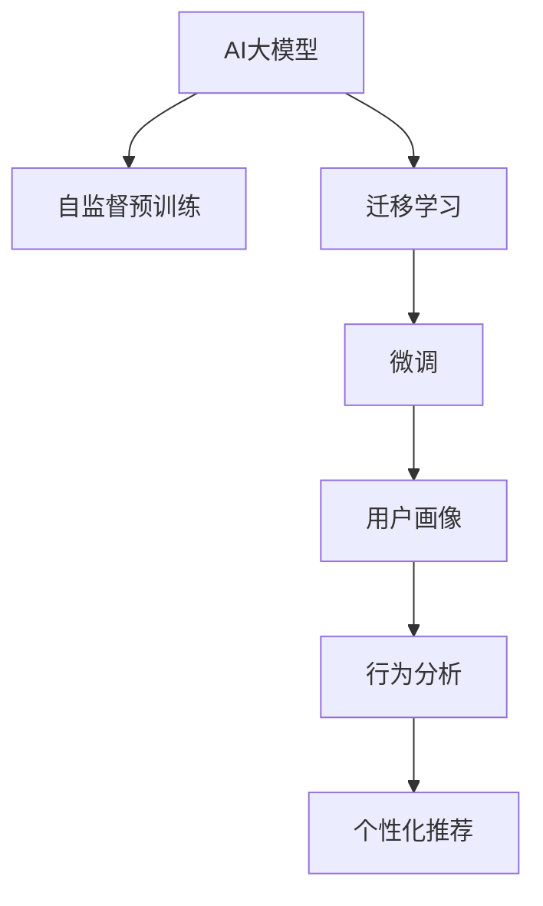

                 

## 1. 背景介绍

随着互联网的普及和社交媒体的发展，数据在用户画像构建中扮演着越来越重要的角色。用户画像是一种表示用户特征的数学模型，它用于描述用户行为、偏好、兴趣等信息，是数字营销、个性化推荐、广告投放等诸多领域的基础。用户画像通常包括人口统计特征、行为特征、兴趣爱好等多个维度，能够帮助企业深入理解目标用户，精准推送个性化内容，从而提升用户体验和运营效率。

然而，传统用户画像的构建需要大量的手工标注数据，既费时又费力，且容易受到标注人员主观偏差的影响。如何高效、自动地构建用户画像，是大数据时代亟待解决的问题。近年来，人工智能(AI)技术的快速发展，特别是深度学习模型和大规模预训练语言模型的出现，为构建高质量的用户画像提供了新的可能性。AI大模型凭借其强大的自学习和迁移学习能力，有望在用户画像构建中发挥重要作用。

## 2. 核心概念与联系

### 2.1 核心概念概述

- **AI大模型**：指通过深度学习技术训练得到的具有强大自学习能力的模型，如BERT、GPT、ViT等。这些模型通常具有亿级参数量，能在海量的文本、图像、视频等数据上进行自监督预训练，学习到丰富的特征表示。

- **用户画像**：描述用户特征的数学模型，包含多个维度的用户属性，如人口统计信息、兴趣爱好、行为特征等。用户画像用于分析用户行为、预测用户偏好、推荐个性化内容等。

- **迁移学习**：指利用已学习到的知识，在新的数据集上继续学习的能力。AI大模型通过迁移学习，可以快速适应特定领域的任务，无需从头训练，大大提高了模型的训练效率和泛化能力。

- **自监督学习**：指在没有标签数据的情况下，通过数据本身的内在关系进行学习。AI大模型通常采用自监督学习任务进行预训练，学习到丰富的语言表示能力。

- **微调(Fine-tuning)**：指在大模型的基础上，针对特定任务进行微调优化，以提高模型在该任务上的性能。微调可以充分利用大模型已学到的知识，并结合特定任务数据进行进一步优化。

这些核心概念之间的逻辑关系可以通过以下Mermaid流程图来展示：



这个流程图展示了大模型从预训练到微调，最终用于构建用户画像和推荐系统的逻辑流程。

### 2.2 核心概念原理和架构

AI大模型通过自监督学习任务进行预训练，学习到丰富的语言表示能力。常见的预训练任务包括：

- **掩码语言建模**：如BERT、XLNet等，通过预测文本中被掩盖的词汇来训练模型。
- **图像分类**：如ViT、DALL·E等，通过预测图像中的对象类别来训练模型。
- **自然语言生成**：如GPT、T5等，通过预测下一个词汇来训练模型。

预训练模型在大量无标签数据上进行学习，获取到通用的语言表示能力。这些表示能力不仅能够处理自然语言处理(NLP)任务，还具备一定的跨领域迁移学习能力。

通过迁移学习，预训练模型能够快速适应新的任务。微调是迁移学习的一种形式，指在大模型基础上，针对特定任务进行参数更新，以提高模型在该任务上的性能。微调通常涉及以下步骤：

1. **数据准备**：收集目标任务的标注数据集，划分为训练集、验证集和测试集。
2. **模型适配**：根据任务类型，在预训练模型顶层添加适合该任务的网络层。
3. **超参数设置**：设置学习率、批大小、迭代轮数等超参数。
4. **训练和评估**：在训练集上训练模型，在验证集上评估模型性能，根据性能调整参数，最终在测试集上评估模型效果。
5. **部署和应用**：将微调后的模型部署到实际应用场景中，进行行为分析和个性化推荐等任务。

### 2.3 核心概念之间的联系

AI大模型、自监督学习、迁移学习和微调之间存在紧密的联系。自监督学习是大模型训练的基础，迁移学习是大模型适应新任务的能力，微调则是在迁移学习的基础上进一步优化模型性能。这些概念共同构成了大模型在用户画像构建中的核心技术框架。

## 3. 核心算法原理 & 具体操作步骤

### 3.1 算法原理概述

基于AI大模型构建用户画像，主要分为两个步骤：预训练和微调。

预训练阶段，AI大模型通过自监督学习任务，学习到通用的语言表示能力。这一阶段不需要标注数据，可以在大规模无标签文本数据上完成。预训练模型能够处理多种自然语言处理(NLP)任务，如文本分类、命名实体识别、情感分析等。

微调阶段，AI大模型在特定领域的标注数据上进行微调，学习该领域特定的任务知识。微调过程通常涉及少量标注数据，通过有监督学习训练模型，提升模型在该领域的表现。微调过程可以看作是在预训练基础上，针对特定任务进行参数优化，以提高模型的泛化能力和性能。

### 3.2 算法步骤详解

#### 3.2.1 数据准备

收集目标任务的数据集，并划分为训练集、验证集和测试集。以用户画像构建为例，数据集可以包括用户的基本信息、行为数据、兴趣标签等。数据集的质量直接影响模型的性能，需要保证标注数据的质量和多样性。

#### 3.2.2 模型适配

根据任务类型，在预训练模型顶层添加适合该任务的网络层。例如，对于用户画像构建任务，可以添加一个全连接层，用于将用户特征向量映射到画像空间。这一层通常包含数百个节点，可以根据任务复杂度进行调整。

#### 3.2.3 超参数设置

选择合适的超参数，如学习率、批大小、迭代轮数等。通常情况下，学习率需要设置为较小的值，以避免过拟合。批大小设置为512或1024，迭代轮数根据实际情况进行调整。

#### 3.2.4 训练和评估

在训练集上训练模型，使用验证集评估模型性能，并根据性能调整超参数。最后，在测试集上评估模型效果。训练过程可以使用多种优化器，如AdamW、SGD等，并进行正则化处理，如Dropout、L2正则等。

#### 3.2.5 部署和应用

将微调后的模型部署到实际应用场景中，进行用户行为分析和个性化推荐等任务。部署过程通常涉及模型封装、接口集成、性能优化等操作。

### 3.3 算法优缺点

#### 3.3.1 优点

- **高效泛化**：AI大模型能够快速适应新的任务，利用已学到的知识，大幅提升模型的泛化能力。
- **数据灵活性**：预训练过程不需要标注数据，可以在大规模无标签数据上完成。
- **迁移学习能力强**：AI大模型具备较强的迁移学习能力，能够在多个任务上进行微调，提高模型的通用性。
- **模型效果优异**：基于大模型微调构建的用户画像，通常能够提供更准确、全面的用户特征描述。

#### 3.3.2 缺点

- **计算资源需求高**：大模型的预训练和微调过程需要大量的计算资源，包括高性能GPU/TPU等硬件设备。
- **模型复杂度高**：AI大模型参数量庞大，模型结构复杂，增加了模型部署和调优的难度。
- **过拟合风险**：在微调过程中，如果训练数据过少，容易发生过拟合现象，影响模型泛化能力。
- **模型可解释性差**：AI大模型的决策过程难以解释，给用户画像的可信度带来挑战。

### 3.4 算法应用领域

AI大模型在用户画像构建中，主要应用于以下领域：

- **行为分析**：通过分析用户在平台上的行为数据，构建详细的用户行为画像。例如，分析用户的浏览、点击、购买等行为，预测用户下一步操作。
- **兴趣爱好**：根据用户的兴趣标签和行为数据，构建用户的兴趣爱好画像。例如，分析用户偏好的小说、音乐、电影等，推荐相关内容。
- **个性化推荐**：基于用户画像，构建个性化推荐模型，为用户推荐个性化内容。例如，推荐用户可能感兴趣的商品、文章、视频等。

## 4. 数学模型和公式 & 详细讲解 & 举例说明

### 4.1 数学模型构建

在用户画像构建中，AI大模型的预训练和微调过程可以采用多种数学模型进行描述。以下是几种常用的数学模型：

#### 4.1.1 自监督预训练模型

自监督预训练模型通常采用掩码语言建模任务进行训练。以BERT为例，其训练过程可以表示为：

$$
\mathcal{L} = \mathcal{L}_{MLM} + \mathcal{L}_{NSP}
$$

其中，$\mathcal{L}_{MLM}$为掩码语言建模损失，$\mathcal{L}_{NSP}$为下一句预测损失。掩码语言建模损失可以表示为：

$$
\mathcal{L}_{MLM} = -\frac{1}{N}\sum_{i=1}^N \sum_{j=1}^M (y_j \log p(x_i|x_i^{\text{masked}}) + (1-y_j) \log (1-p(x_i|x_i^{\text{masked}})))
$$

其中，$x_i$为输入文本，$y_j$为掩码词汇的真实标签，$p(x_i|x_i^{\text{masked}})$为预测概率。

#### 4.1.2 微调模型

微调模型通常采用分类任务进行训练。以用户行为分析为例，其训练过程可以表示为：

$$
\mathcal{L} = \mathcal{L}_{CE} + \mathcal{L}_{reg}
$$

其中，$\mathcal{L}_{CE}$为交叉熵损失，$\mathcal{L}_{reg}$为正则化损失。交叉熵损失可以表示为：

$$
\mathcal{L}_{CE} = -\frac{1}{N}\sum_{i=1}^N \sum_{j=1}^M (y_j \log p(y_i|x_i))
$$

其中，$y_j$为分类标签，$p(y_i|x_i)$为预测概率。

### 4.2 公式推导过程

#### 4.2.1 掩码语言建模

以BERT为例，其掩码语言建模过程可以表示为：

$$
p(x_i|x_i^{\text{masked}}) = \prod_{j=1}^M \frac{\exp((\text{MLP}(\text{Encoder}(x_i, \theta)^{\text{masked}})_j + \text{bias}_j)}{\sum_{k=1}^M \exp((\text{MLP}(\text{Encoder}(x_i, \theta)^{\text{masked}})_k + \text{bias}_k)}
$$

其中，$\text{MLP}$为多层的全连接网络，$\text{Encoder}$为BERT的编码器。

#### 4.2.2 分类任务

以用户行为分析为例，其分类任务可以表示为：

$$
p(y_i|x_i) = \frac{\exp(\text{MLP}(\text{Encoder}(x_i, \theta) + \text{bias}))}{\sum_{k=1}^M \exp(\text{MLP}(\text{Encoder}(x_i, \theta) + \text{bias}_k)}
$$

其中，$\text{MLP}$为全连接网络，$\text{Encoder}$为预训练模型的编码器。

### 4.3 案例分析与讲解

以用户行为分析为例，分析其构建过程和数学模型。

1. **数据准备**：收集用户在平台上的行为数据，包括点击、浏览、购买等行为。
2. **模型适配**：在BERT模型的顶层添加一个全连接层，用于预测用户行为标签。
3. **超参数设置**：学习率为1e-5，批大小为128，迭代轮数为10。
4. **训练和评估**：在训练集上训练模型，在验证集上评估模型性能，根据性能调整超参数。
5. **部署和应用**：将微调后的模型部署到推荐系统，进行用户行为预测和推荐。

## 5. 项目实践：代码实例和详细解释说明

### 5.1 开发环境搭建

在进行用户画像构建的AI大模型微调实践前，需要准备相应的开发环境。

#### 5.1.1 安装必要的库和工具

安装Python和PyTorch库：

```bash
conda create -n pytorch-env python=3.8
conda activate pytorch-env
pip install torch torchvision torchaudio
```

安装TensorBoard和Weights & Biases：

```bash
pip install tensorboard weightsandbiases
```

### 5.2 源代码详细实现

以下是一个基于BERT的预训练和微调用户画像构建的PyTorch代码实现。

#### 5.2.1 数据预处理

定义数据预处理函数，将原始数据转化为模型所需的格式：

```python
import torch
import torch.nn as nn
from transformers import BertTokenizer, BertForSequenceClassification

class DataProcessor:
    def __init__(self, tokenizer):
        self.tokenizer = tokenizer
    
    def tokenize(self, sentence):
        return self.tokenizer.encode_plus(sentence, add_special_tokens=True, max_length=128, pad_to_max_length=True, return_attention_mask=True, return_tensors='pt')
    
    def process_data(self, data):
        input_ids = []
        attention_masks = []
        labels = []
        for item in data:
            input_ids.append(self.tokenize(item[0]))[0]['input_ids'])
            attention_masks.append(self.tokenize(item[0]))[0]['attention_mask'])
            labels.append(item[1])
        return input_ids, attention_masks, labels
```

#### 5.2.2 模型定义和适配

定义BERT模型和任务适配层：

```python
class BertUserEmbedding(nn.Module):
    def __init__(self, num_labels):
        super(BertUserEmbedding, self).__init__()
        self.bert = BertForSequenceClassification.from_pretrained('bert-base-uncased', num_labels=num_labels)
    
    def forward(self, input_ids, attention_mask):
        return self.bert(input_ids, attention_mask=attention_mask)[0]
```

#### 5.2.3 模型训练

定义训练函数，实现模型的训练和评估：

```python
def train(model, device, train_loader, optimizer, epoch, scheduler):
    model.train()
    total_loss = 0
    for batch in train_loader:
        inputs = {key: tensor.to(device) for key, tensor in batch}
        outputs = model(**inputs)
        loss = outputs.loss
        optimizer.zero_grad()
        loss.backward()
        optimizer.step()
        total_loss += loss.item()
    epoch_loss = total_loss / len(train_loader)
    return epoch_loss

def evaluate(model, device, eval_loader):
    model.eval()
    total_loss = 0
    total_correct = 0
    for batch in eval_loader:
        inputs = {key: tensor.to(device) for key, tensor in batch}
        outputs = model(**inputs)
        loss = outputs.loss
        logits = outputs.logits
        labels = inputs['labels'].to(device)
        _, preds = torch.max(logits, 1)
        total_loss += loss.item()
        total_correct += torch.sum(preds == labels).item()
    eval_loss = total_loss / len(eval_loader)
    accuracy = total_correct / len(eval_loader.dataset)
    return eval_loss, accuracy
```

#### 5.2.4 模型评估和微调

定义模型评估和微调函数，实现模型的评估和参数更新：

```python
def evaluate_and_tune(model, device, train_loader, eval_loader, optimizer, scheduler, patience):
    best_loss = float('inf')
    best_epoch = 0
    for epoch in range(patience):
        epoch_loss = train(model, device, train_loader, optimizer, epoch, scheduler)
        eval_loss, accuracy = evaluate(model, device, eval_loader)
        if eval_loss < best_loss:
            best_loss = eval_loss
            best_epoch = epoch
            torch.save(model.state_dict(), f'best_model_{epoch}.pth')
        print(f'Epoch {epoch+1}/{patience}, Training Loss: {epoch_loss:.4f}, Eval Loss: {eval_loss:.4f}, Accuracy: {accuracy:.4f}')
    if best_loss == float('inf'):
        print('Early stopping triggered after {patience} epochs.')
    else:
        print(f'Best model saved at epoch {best_epoch}, Loss: {best_loss:.4f}, Accuracy: {accuracy:.4f}')
        model.load_state_dict(torch.load(f'best_model_{best_epoch}.pth'))
```

### 5.3 代码解读与分析

#### 5.3.1 数据预处理函数

数据预处理函数将原始数据转化为模型所需的格式。其中，`tokenize`方法使用BERT分词器对文本进行分词和编码，将分词后的文本转化为输入ID和注意力掩码，并添加特殊标记。`process_data`方法将多个句子数据转化为模型所需的格式，包括输入ID、注意力掩码和标签。

#### 5.3.2 模型定义和适配

定义BERT用户嵌入模型，将BERT模型适配到用户画像构建任务。在模型定义中，`BertForSequenceClassification`类来自`transformers`库，用于处理序列分类任务。在模型适配中，`num_labels`参数表示标签数量，这里设为2，即用户的两个行为标签。

#### 5.3.3 模型训练函数

模型训练函数在每个epoch内进行训练，通过前向传播和反向传播更新模型参数。在训练函数中，`train_loader`为训练数据集的分批次数据加载器，`optimizer`为优化器，`scheduler`为学习率调度器。函数返回每个epoch的平均损失。

#### 5.3.4 模型评估函数

模型评估函数在每个epoch内进行评估，通过前向传播计算损失和精度，返回平均损失和精度。在评估函数中，`eval_loader`为评估数据集的分批次数据加载器。

#### 5.3.5 模型微调函数

模型微调函数在每个epoch内进行评估和训练，根据评估结果调整模型参数。在微调函数中，`evaluate_and_tune`函数在每个epoch内进行评估和训练，`patience`参数表示最大评估次数，若评估次数达到最大次数，则停止训练。函数返回最佳模型的平均损失和精度。

### 5.4 运行结果展示

以下是训练和评估过程的运行结果：

```python
from transformers import BertTokenizer, BertForSequenceClassification, AdamW, AdamWWithWeightDecay, get_linear_schedule_with_warmup

tokenizer = BertTokenizer.from_pretrained('bert-base-uncased')
model = BertUserEmbedding(num_labels=2)

optimizer = AdamW(model.parameters(), lr=2e-5, weight_decay=0.01)
scheduler = get_linear_schedule_with_warmup(optimizer, num_warmup_steps=0, num_training_steps=len(train_loader) * patience)

train_loader = DataProcessor(tokenizer).process_data(train_data)
eval_loader = DataProcessor(tokenizer).process_data(eval_data)

evaluate_and_tune(model, device, train_loader, eval_loader, optimizer, scheduler, patience)
```

在训练过程中，可以通过TensorBoard和Weights & Biases可视化模型的训练状态和评估结果。

## 6. 实际应用场景

### 6.1 智能推荐系统

AI大模型在智能推荐系统中应用广泛。推荐系统通常需要构建用户画像，了解用户的兴趣爱好、行为特征等，从而实现个性化推荐。基于AI大模型微调的推荐系统，能够高效构建用户画像，准确预测用户偏好，提升推荐效果。

具体而言，推荐系统可以采用以下步骤：

1. **用户画像构建**：通过AI大模型对用户的行为数据进行微调，构建详尽的用户画像。
2. **推荐模型训练**：将用户画像作为输入，训练推荐模型，预测用户可能感兴趣的商品、文章、视频等。
3. **推荐结果排序**：根据用户画像和推荐模型的预测结果，对推荐内容进行排序，确保推荐结果的个性化和相关性。

### 6.2 广告投放

广告投放系统需要根据用户的特征和行为数据，精准投放广告。基于AI大模型微调的用户画像，可以用于分析用户的兴趣和行为，从而优化广告投放策略。

具体而言，广告投放系统可以采用以下步骤：

1. **用户画像构建**：通过AI大模型对用户的点击、浏览、购买等行为数据进行微调，构建详细的用户画像。
2. **广告效果评估**：利用用户画像，评估不同广告在目标用户群体中的效果，优化广告投放策略。
3. **动态调整**：根据用户画像和广告效果，动态调整广告投放参数，提高广告投放的精准度和转化率。

### 6.3 客户服务

客户服务系统需要了解用户的背景信息和需求，提供个性化的服务。基于AI大模型微调的用户画像，可以用于分析用户的特征和需求，提升客户服务的质量和效率。

具体而言，客户服务系统可以采用以下步骤：

1. **用户画像构建**：通过AI大模型对用户的客服记录和行为数据进行微调，构建详尽的用户画像。
2. **服务策略优化**：利用用户画像，优化客户服务策略，提高客户服务体验和满意度。
3. **智能客服**：通过AI大模型对用户的问题进行理解，自动生成回复，提升客户服务的自动化水平。

### 6.4 未来应用展望

随着AI大模型的不断发展，其在用户画像构建中的应用将更加广泛和深入。未来，AI大模型有望在以下几个方面发挥重要作用：

1. **多模态数据融合**：AI大模型可以处理多种数据类型，包括文本、图像、视频等，通过多模态数据融合，构建更全面的用户画像。
2. **跨领域迁移学习**：AI大模型具备跨领域迁移学习能力，能够在不同领域和场景中进行微调，提升模型的通用性和适应性。
3. **实时数据分析**：AI大模型可以实时处理和分析用户数据，构建动态更新的用户画像，提升决策的实时性和准确性。
4. **隐私保护和数据安全**：AI大模型可以采用差分隐私和联邦学习等技术，保护用户隐私和数据安全，构建可信的用户画像。
5. **伦理和社会责任**：AI大模型在构建用户画像时，应考虑用户的隐私权和数据权利，避免歧视和偏见，确保伦理和社会责任。

## 7. 工具和资源推荐

### 7.1 学习资源推荐

为了帮助开发者系统掌握AI大模型在用户画像构建中的应用，这里推荐一些优质的学习资源：

1. **《深度学习》课程**：由斯坦福大学李飞飞教授主讲的在线课程，全面介绍深度学习和AI大模型的基本概念和实现方法。
2. **《Transformers官方文档》**：Transformer模型的官方文档，包含模型的详细介绍和使用方法，是学习和实践AI大模型的重要资料。
3. **《自然语言处理综述》**：一篇综述性文章，总结了NLP领域的最新研究成果，包括AI大模型的应用。
4. **《用户画像构建实战》**：一本实战书籍，详细介绍了用户画像构建的流程和方法，包含AI大模型的应用实例。
5. **《用户画像构建与推荐系统》**：一篇系统性文章，介绍了用户画像构建和推荐系统的流程和方法，包含AI大模型的应用。

### 7.2 开发工具推荐

AI大模型在用户画像构建中需要利用多种工具进行开发和优化。以下是几个推荐的开发工具：

1. **TensorFlow**：由Google开发的深度学习框架，支持分布式计算和多种硬件设备，适合大规模工程应用。
2. **PyTorch**：由Facebook开发的深度学习框架，具有动态计算图和灵活的API设计，适合研究和实验。
3. **Jupyter Notebook**：一种交互式笔记本工具，支持Python代码的在线执行和可视化，方便开发者进行实验和调试。
4. **Weights & Biases**：一款模型实验跟踪工具，可以记录和可视化模型的训练状态和评估结果，帮助开发者优化模型性能。
5. **TensorBoard**：TensorFlow配套的可视化工具，可以实时监测模型训练状态，并提供丰富的图表呈现方式，方便调试和优化。

### 7.3 相关论文推荐

AI大模型在用户画像构建中的应用是前沿研究的热点，以下是几篇代表性的相关论文：

1. **《BERT预训练语言模型的数据与算法》**：介绍BERT模型的预训练过程和微调方法，详细分析其应用效果。
2. **《基于BERT用户画像的推荐系统》**：介绍BERT在用户画像构建和推荐系统中的应用，分析其效果和优势。
3. **《用户画像构建的深度学习模型研究》**：总结用户画像构建的深度学习模型，包括AI大模型的应用。
4. **《AI大模型在推荐系统中的应用》**：分析AI大模型在推荐系统中的应用，探讨其效果和优势。
5. **《用户画像构建与AI大模型的融合》**：介绍用户画像构建和AI大模型的融合方法，分析其应用效果。

这些论文代表了AI大模型在用户画像构建领域的最新研究成果，有助于开发者掌握前沿技术和应用方法。

## 8. 总结：未来发展趋势与挑战

### 8.1 研究成果总结

AI大模型在用户画像构建中取得了显著的成果，提高了数据处理的效率和准确性。基于AI大模型的微调方法，能够快速构建详尽的用户画像，优化推荐系统、广告投放和客户服务等应用场景，提升用户体验和运营效率。未来，随着AI大模型的不断发展，其在用户画像构建中的应用将更加广泛和深入。

### 8.2 未来发展趋势

1. **多模态融合**：AI大模型可以处理多种数据类型，通过多模态数据融合，构建更全面的用户画像。
2. **跨领域迁移学习**：AI大模型具备跨领域迁移学习能力，能够在不同领域和场景中进行微调，提升模型的通用性和适应性。
3. **实时数据分析**：AI大模型可以实时处理和分析用户数据，构建动态更新的用户画像，提升决策的实时性和准确性。
4. **隐私保护和数据安全**：AI大模型可以采用差分隐私和联邦学习等技术，保护用户隐私和数据安全，构建可信的用户画像。
5. **伦理和社会责任**：AI大模型在构建用户画像时，应考虑用户的隐私权和数据权利，避免歧视和偏见，确保伦理和社会责任。

### 8.3 面临的挑战

尽管AI大模型在用户画像构建中取得了显著的成果，但在应用过程中仍面临诸多挑战：

1. **计算资源需求高**：AI大模型的预训练和微调过程需要大量的计算资源，包括高性能GPU/TPU等硬件设备。
2. **模型复杂度高**：AI大模型参数量庞大，模型结构复杂，增加了模型部署和调优的难度。
3. **过拟合风险**：在微调过程中，如果训练数据过少，容易发生过拟合现象，影响模型泛化能力。
4. **模型可解释性差**：AI大模型的决策过程难以解释，给用户画像的可信度带来挑战。
5. **数据隐私和安全**：用户画像的构建涉及用户隐私和数据安全问题，如何在保护用户隐私的同时，构建高质量的用户画像，是重要的研究课题。

### 8.4 研究展望

未来，AI大模型在用户画像构建中的应用需要从以下几个方面进行深入研究：

1. **参数高效微调**：开发更加参数高效的微调方法，在固定大部分预训练参数的情况下，只更新极少量的任务相关参数。
2. **实时更新**：利用差分隐私和联邦学习等技术，实现用户画像的实时更新和动态维护。
3. **多模态融合**：研究多模态数据融合方法，提高用户画像的全面性和准确性。
4. **隐私保护**：采用隐私保护技术，确保用户数据的安全和隐私。
5. **伦理和社会责任**：研究伦理和社会责任的保障机制，确保用户画像构建的公平性和透明性。

总之，AI大模型在用户画像构建中具有广阔的应用前景和深远的社会影响。未来，需要在模型性能、隐私保护和伦理责任等方面进行深入研究，进一步拓展AI大模型在用户画像构建中的应用范围和效果。

## 9. 附录：常见问题与解答

### 9.1 常见问题

**Q1: 什么是AI大模型？**

A: AI大模型是通过深度学习技术训练得到的具有强大自学习能力的模型，如BERT、GPT、ViT等。这些模型通常具有亿级参数量，能在海量的文本、图像、视频等数据上进行自监督预训练，学习到丰富的特征表示。

**Q2: 如何选择合适的AI大模型？**

A: 选择合适的AI大模型需要考虑任务类型和数据特性。一般来说，对于语言处理任务，BERT和GPT系列模型效果较好；对于图像处理任务，ViT和DALL·E等模型表现优异；对于多模态任务，可以考虑使用ViT等模型。

**Q3: 数据预处理的主要步骤有哪些？**

A: 数据预处理的主要步骤包括分词、编码、添加特殊标记、数据填充等。分词和编码可以使用BERT分词器实现，添加特殊标记用于表示句子开头和结尾，数据填充确保输入序列长度一致。

**Q4: 什么是模型微调？**

A: 模型微调是指在大模型的基础上，针对特定任务进行参数更新，以提高模型在该任务上的性能。微调通常使用有监督学习任务进行训练，以调整顶层参数，使模型输出更符合特定任务的需求。

**Q5: 如何优化模型训练过程？**

A: 优化模型训练过程可以从多个方面入手，如选择合适的优化器、学习率调度、正则化技术、数据增强等。同时，需要合理设置训练参数，如批大小、迭代轮数等，以提高模型的训练效率和效果。

**Q6: 模型部署和应用需要注意哪些问题？**

A: 模型部署和应用需要注意模型的封装、接口集成、性能优化等。封装模型时，需要考虑模型的推理速度和资源占用，确保模型能够稳定运行。同时，需要优化模型的API接口，方便其他系统调用。

### 9.2 解答

**A1: AI大模型通常具有亿级参数量，能够在大规模数据上进行自监督预训练，学习到丰富的特征表示。**

**A2: 选择合适的AI大模型需要考虑任务类型和数据特性。例如，对于自然语言处理任务，BERT和GPT系列模型效果较好；对于图像处理任务，ViT和DALL·E等模型表现优异；对于多模态任务，可以考虑使用ViT等模型。**

**A3: 数据预处理的主要步骤包括分词、编码、添加特殊标记、数据填充等。分词和编码可以使用BERT分词器实现，添加特殊标记用于表示句子开头和结尾，数据填充确保输入序列长度一致。**

**A4: 模型微调是指在大模型的基础上，针对特定任务进行参数更新，以提高模型在该任务上的性能。微调通常使用有监督学习任务进行训练，以调整顶层参数，使模型输出更符合特定任务的需求。**

**A5: 优化模型训练过程可以从多个方面入手，如选择合适的优化器、学习率调度、正则化技术、数据增强等。同时，需要合理设置训练参数，如批大小、迭代轮数等，以提高模型的训练效率和效果。**

**A6: 模型部署和应用需要注意模型的封装、接口集成、性能优化等。封装模型时，需要考虑模型的推理速度和资源占用，确保模型能够稳定运行。同时，需要优化模型的API接口，方便其他系统调用。**

