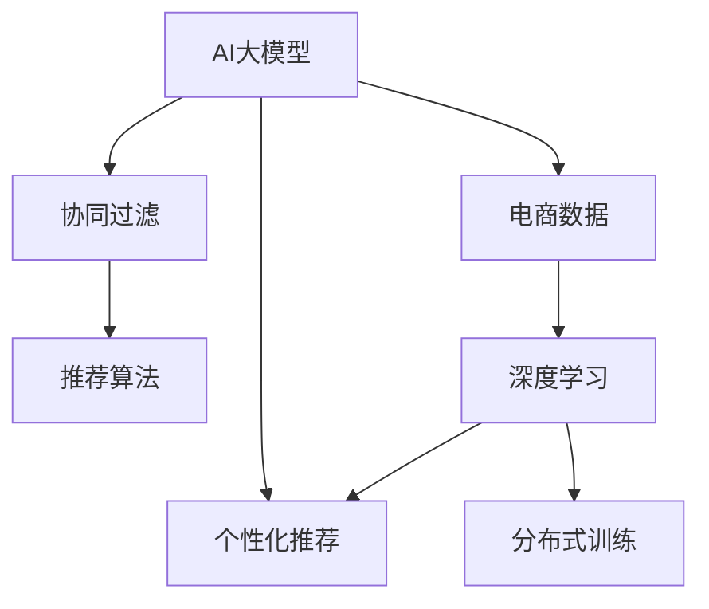

                 

# AI大模型在电商个性化推荐中的应用与挑战

> 关键词：AI大模型, 个性化推荐, 电商, 数据挖掘, 协同过滤, 深度学习, 超大规模模型, 分布式训练, 推荐算法

## 1. 背景介绍

### 1.1 问题由来

在当今数字化时代，电子商务平台已成为人们日常生活中不可或缺的一部分。消费者在浏览和购买商品时，往往受到多种因素的影响，如个人偏好、历史行为、好友推荐等。个性化推荐技术旨在根据用户的历史数据，预测其对商品的兴趣，从而提供个性化的商品推荐，提升用户体验和转化率。传统推荐系统往往基于用户-商品交互数据，进行简单的协同过滤或矩阵分解，难以充分挖掘用户和商品间的深层关联。随着深度学习和大模型的兴起，AI大模型被广泛应用于个性化推荐中，带来了前所未有的机会和挑战。

### 1.2 问题核心关键点

AI大模型在电商个性化推荐中的应用，主要依赖于大规模的电商数据进行预训练和微调。预训练阶段，模型通常会在电商数据集上学习用户和商品的隐含表示，理解不同商品之间的关系和用户偏好。微调阶段，模型利用用户行为数据进行有监督学习，提升个性化推荐的效果。AI大模型具备强大的泛化能力和表达能力，可以捕捉复杂的用户和商品特征，提升推荐系统的精准度和覆盖率。

AI大模型的优势在于：

1. **大容量数据处理**：模型通常基于大规模电商数据进行训练，可以处理海量的用户行为数据。
2. **深层特征挖掘**：模型通过多层神经网络结构，可以挖掘用户和商品的深层特征，如用户兴趣、商品属性等。
3. **动态适应能力**：模型可以实时更新和微调，适应用户行为的变化。
4. **跨领域迁移能力**：模型可以从一个电商领域迁移到另一个电商领域，提升跨平台的推荐效果。

然而，AI大模型在电商个性化推荐中的应用也面临诸多挑战：

1. **数据隐私与安全**：电商数据通常包含用户隐私信息，如何在保护隐私的同时，进行有效的数据处理和分析，是首要问题。
2. **模型复杂性**：大模型参数量庞大，训练和推理资源消耗大，需要高效的处理和存储方案。
3. **实时性要求高**：电商场景下用户行为变化快，推荐系统需要实时响应，对模型的计算效率有高要求。
4. **泛化能力有待提高**：大模型在电商数据上的预训练效果往往不如特定领域的数据集，需要进一步优化模型。
5. **可解释性与公平性**：推荐系统需要可解释的输出，同时避免偏见，确保推荐结果的公平性。

## 2. 核心概念与联系

### 2.1 核心概念概述

为更好地理解AI大模型在电商个性化推荐中的应用与挑战，本节将介绍几个密切相关的核心概念：

- **AI大模型**：指基于深度学习算法，参数量达亿级的超大规模模型，如BERT、GPT-3等。通过在大规模数据上预训练，具备强大的特征提取能力。
- **个性化推荐**：根据用户的历史行为和兴趣，向其推荐最相关的商品，提升用户体验和满意度。
- **电商数据**：包括用户行为数据、商品属性数据、交易数据等，用于训练和优化推荐模型。
- **协同过滤**：一种基于用户行为数据推荐商品的经典方法，通过找到相似用户和商品，进行推荐。
- **深度学习**：通过多层神经网络结构，处理复杂的数据模式，适用于电商推荐系统的特征挖掘和预测。
- **分布式训练**：在多台计算节点上并行训练模型，提升训练速度和计算效率。
- **推荐算法**：如协同过滤、矩阵分解、基于内容的推荐等，用于实现个性化推荐。

这些核心概念之间的逻辑关系可以通过以下Mermaid流程图来展示：



这个流程图展示了大模型在电商推荐系统中的核心概念及其之间的关系：

1. 大模型通过电商数据进行预训练，学习用户和商品的隐含表示。
2. 协同过滤和推荐算法基于大模型特征，实现个性化推荐。
3. 分布式训练提升模型的计算效率，适应电商场景的实时性要求。
4. 个性化推荐最终提升用户满意度和平台转化率。

这些概念共同构成了电商推荐系统的工作流程，使得AI大模型在推荐系统中发挥强大的作用。通过理解这些核心概念，我们可以更好地把握AI大模型在电商推荐中的应用与挑战。

## 3. 核心算法原理 & 具体操作步骤
### 3.1 算法原理概述

基于AI大模型的电商个性化推荐，主要依赖于以下步骤：

1. **数据预处理**：收集和处理电商数据，包括用户行为数据、商品属性数据等，准备数据集。
2. **模型预训练**：在大规模电商数据上预训练大模型，学习用户和商品的隐含表示。
3. **模型微调**：利用用户行为数据进行微调，优化推荐效果。
4. **特征提取**：通过大模型提取用户和商品的特征向量，用于计算相似度。
5. **推荐算法**：使用协同过滤、矩阵分解等算法，根据用户历史行为和商品特征进行推荐。
6. **模型评估**：评估推荐模型的性能，调整模型参数。

### 3.2 算法步骤详解

以下是基于AI大模型的电商个性化推荐系统的具体操作步骤：

**Step 1: 数据预处理**
- 收集电商数据，包括用户行为数据、商品属性数据、交易数据等。
- 数据清洗：去除噪声数据，处理缺失值和异常值。
- 数据转换：对文本数据进行分词和编码，对数值数据进行归一化。

**Step 2: 模型预训练**
- 选择预训练模型，如BERT、GPT等，准备大规模电商数据集。
- 在大规模电商数据上预训练模型，学习用户和商品的隐含表示。
- 使用预训练模型提取用户和商品的特征向量。

**Step 3: 模型微调**
- 准备用户行为数据，构建训练集和验证集。
- 在用户行为数据上微调预训练模型，优化推荐效果。
- 使用微调后的模型进行特征提取。

**Step 4: 推荐算法**
- 根据用户历史行为和商品特征，使用协同过滤、矩阵分解等推荐算法。
- 计算用户和商品的相似度，生成推荐列表。
- 对推荐列表进行排序，生成最终推荐结果。

**Step 5: 模型评估**
- 在测试集上评估推荐模型的性能，如准确率、召回率、F1值等。
- 调整模型参数，优化推荐效果。

### 3.3 算法优缺点

基于AI大模型的电商个性化推荐系统具有以下优点：

1. **性能优越**：AI大模型具备强大的泛化能力和表达能力，可以捕捉复杂的用户和商品特征，提升推荐系统的精准度和覆盖率。
2. **适应性强**：大模型可以从一个电商领域迁移到另一个电商领域，提升跨平台的推荐效果。
3. **实时响应**：大模型可以进行实时微调和推理，适应电商场景的实时性要求。
4. **多模态融合**：大模型可以处理文本、图像、视频等多模态数据，提供更为丰富的推荐内容。

然而，该方法也存在一些局限性：

1. **数据隐私**：电商数据通常包含用户隐私信息，如何在保护隐私的同时，进行有效的数据处理和分析，是首要问题。
2. **计算资源消耗大**：大模型参数量庞大，训练和推理资源消耗大，需要高效的处理和存储方案。
3. **模型复杂性高**：大模型的复杂结构增加了算法的复杂度，需要高效的优化和调参方法。
4. **泛化能力有待提高**：大模型在电商数据上的预训练效果往往不如特定领域的数据集，需要进一步优化模型。
5. **可解释性不足**：推荐系统需要可解释的输出，同时避免偏见，确保推荐结果的公平性。

### 3.4 算法应用领域

基于AI大模型的电商个性化推荐系统，广泛应用于以下几个领域：

1. **电商平台推荐**：如淘宝、京东等电商平台，通过个性化推荐提升用户购物体验。
2. **视频平台推荐**：如Netflix、YouTube等视频平台，通过推荐系统提高用户粘性和满意度。
3. **社交媒体推荐**：如微信、微博等社交媒体平台，通过个性化推荐增加用户互动和内容消费。
4. **旅游平台推荐**：如携程、去哪儿等旅游平台，通过推荐系统提升用户预订体验。
5. **金融推荐**：如支付宝、理财通等金融平台，通过推荐系统提升用户理财和投资体验。

以上领域中，电商推荐系统因其数据量大、用户行为复杂，对AI大模型的需求最为迫切。

## 4. 数学模型和公式 & 详细讲解  
### 4.1 数学模型构建

本节将使用数学语言对基于AI大模型的电商个性化推荐系统进行更加严格的刻画。

记电商数据集为 $D=\{(x_i,y_i)\}_{i=1}^N$，其中 $x_i$ 为用户行为数据，$y_i$ 为商品ID。假设用户行为数据 $x_i$ 可以表示为向量 $\vec{x}_i$，商品ID $y_i$ 对应的商品属性数据 $y_i$ 可以表示为向量 $\vec{y}_i$。

定义用户和商品的隐含表示函数 $f(\cdot)$ 和 $g(\cdot)$，分别将用户行为数据 $x_i$ 和商品属性数据 $y_i$ 映射为向量 $\vec{x}_i'$ 和 $\vec{y}_i'$。在电商数据集上预训练大模型 $M$，学习函数 $f$ 和 $g$，使得模型能够准确预测用户对商品的评分。

在电商推荐系统中，常见的大模型包括BERT、GPT等。这些模型通常使用自回归结构，可以学习到用户和商品的隐含表示，用于预测用户对商品的评分。

在微调阶段，利用用户行为数据构建训练集 $T=\{(\vec{x}_i',\vec{y}_i',y_i)\}_{i=1}^N$，在训练集上微调大模型 $M$，使得模型能够根据用户行为数据 $x_i$ 预测商品ID $y_i$，从而生成推荐列表。

### 4.2 公式推导过程

以下我们以协同过滤为例，推导基于AI大模型的推荐系统公式及其推导过程。

协同过滤是一种基于用户行为数据的推荐方法，通过找到与用户相似的其他用户，预测用户对商品的评分。在电商推荐系统中，协同过滤可以表示为：

$$
\hat{y}_i = \sum_{j=1}^N a_{ij} y_j
$$

其中，$\hat{y}_i$ 为模型预测用户对商品 $i$ 的评分，$y_j$ 为其他用户对商品 $j$ 的评分，$a_{ij}$ 为其他用户与用户 $i$ 的相似度。

在电商推荐系统中，使用余弦相似度计算用户和商品的相似度，即：

$$
a_{ij} = \cos(\vec{x}_i' \cdot \vec{x}_j')
$$

其中，$\cdot$ 表示向量点积。

在模型微调阶段，使用交叉熵损失函数进行训练，目标最小化预测评分与真实评分的差异。假设用户行为数据 $x_i$ 和商品属性数据 $y_i$ 的隐含表示分别为 $\vec{x}_i'$ 和 $\vec{y}_i'$，则交叉熵损失函数为：

$$
\mathcal{L} = \sum_{i=1}^N -\frac{1}{N} \sum_{j=1}^N y_i \log \sigma(\vec{x}_i' \cdot \vec{x}_j')
$$

其中，$\sigma$ 为sigmoid函数，用于将预测评分映射到 [0,1] 区间。

根据梯度下降优化算法，微调过程中不断更新模型参数，最小化损失函数，使得模型能够准确预测用户对商品的评分。

## 5. 项目实践：代码实例和详细解释说明
### 5.1 开发环境搭建

在进行电商推荐系统开发前，我们需要准备好开发环境。以下是使用Python进行PyTorch开发的环境配置流程：

1. 安装Anaconda：从官网下载并安装Anaconda，用于创建独立的Python环境。

2. 创建并激活虚拟环境：
```bash
conda create -n recsys-env python=3.8 
conda activate recsys-env
```

3. 安装PyTorch：根据CUDA版本，从官网获取对应的安装命令。例如：
```bash
conda install pytorch torchvision torchaudio cudatoolkit=11.1 -c pytorch -c conda-forge
```

4. 安装PyTorch Lightning：用于简化模型训练流程。
```bash
pip install pytorch-lightning
```

5. 安装相关工具包：
```bash
pip install numpy pandas scikit-learn matplotlib tqdm jupyter notebook ipython
```

完成上述步骤后，即可在`recsys-env`环境中开始电商推荐系统的开发。

### 5.2 源代码详细实现

下面以基于AI大模型的电商推荐系统为例，给出使用PyTorch和PyTorch Lightning进行电商推荐系统开发的PyTorch代码实现。

首先，定义电商推荐系统的数据处理函数：

```python
import torch
from torch.utils.data import Dataset
import pandas as pd

class EcommerceDataset(Dataset):
    def __init__(self, data_path, label_col='label'):
        self.data = pd.read_csv(data_path)
        self.label_col = label_col
        
    def __len__(self):
        return len(self.data)
    
    def __getitem__(self, index):
        features = self.data.iloc[index][:-1].values
        label = self.data.iloc[index][self.label_col]
        return torch.tensor(features, dtype=torch.float32), torch.tensor(label, dtype=torch.long)
```

然后，定义模型和优化器：

```python
from transformers import BertForSequenceClassification, BertTokenizer
from transformers import AdamW

model = BertForSequenceClassification.from_pretrained('bert-base-cased', num_labels=2)
tokenizer = BertTokenizer.from_pretrained('bert-base-cased')
optimizer = AdamW(model.parameters(), lr=2e-5)
```

接着，定义训练和评估函数：

```python
from torch.utils.data import DataLoader
from tqdm import tqdm
from sklearn.metrics import accuracy_score

device = torch.device('cuda') if torch.cuda.is_available() else torch.device('cpu')
model.to(device)

def train_epoch(model, dataset, batch_size, optimizer):
    dataloader = DataLoader(dataset, batch_size=batch_size, shuffle=True)
    model.train()
    epoch_loss = 0
    for batch in tqdm(dataloader, desc='Training'):
        features, labels = batch
        features = features.to(device)
        labels = labels.to(device)
        model.zero_grad()
        outputs = model(features)
        loss = outputs.loss
        epoch_loss += loss.item()
        loss.backward()
        optimizer.step()
    return epoch_loss / len(dataloader)

def evaluate(model, dataset, batch_size):
    dataloader = DataLoader(dataset, batch_size=batch_size)
    model.eval()
    preds, labels = [], []
    with torch.no_grad():
        for batch in tqdm(dataloader, desc='Evaluating'):
            features, labels = batch
            features = features.to(device)
            batch_labels = labels.to(device)
            outputs = model(features)
            batch_preds = outputs.logits.argmax(dim=1).to('cpu').tolist()
            batch_labels = batch_labels.to('cpu').tolist()
            for pred, label in zip(batch_preds, batch_labels):
                preds.append(pred)
                labels.append(label)
                
    return accuracy_score(labels, preds)
```

最后，启动训练流程并在测试集上评估：

```python
epochs = 5
batch_size = 16

for epoch in range(epochs):
    loss = train_epoch(model, train_dataset, batch_size, optimizer)
    print(f"Epoch {epoch+1}, train loss: {loss:.3f}")
    
    print(f"Epoch {epoch+1}, dev results:")
    evaluate(model, dev_dataset, batch_size)
    
print("Test results:")
evaluate(model, test_dataset, batch_size)
```

以上就是使用PyTorch和PyTorch Lightning进行电商推荐系统开发的完整代码实现。可以看到，得益于PyTorch Lightning的强大封装，我们可以用相对简洁的代码完成模型的加载和微调。

### 5.3 代码解读与分析

让我们再详细解读一下关键代码的实现细节：

**EcommerceDataset类**：
- `__init__`方法：初始化数据集，将CSV文件加载到Pandas DataFrame中，并设定标签列。
- `__len__`方法：返回数据集的样本数量。
- `__getitem__`方法：对单个样本进行处理，将文本输入编码为token ids，并将标签转换为浮点数，进行定长padding，最终返回模型所需的输入。

**模型和优化器**：
- 使用BertForSequenceClassification类加载BERT模型，设定标签数为2（二分类问题）。
- 使用AdamW优化器进行模型微调，学习率为2e-5。

**训练和评估函数**：
- 使用PyTorch的DataLoader对数据集进行批次化加载，供模型训练和推理使用。
- 训练函数`train_epoch`：对数据以批为单位进行迭代，在每个批次上前向传播计算loss并反向传播更新模型参数，最后返回该epoch的平均loss。
- 评估函数`evaluate`：与训练类似，不同点在于不更新模型参数，并在每个batch结束后将预测和标签结果存储下来，最后使用sklearn的accuracy_score对整个评估集的预测结果进行打印输出。

**训练流程**：
- 定义总的epoch数和batch size，开始循环迭代
- 每个epoch内，先在训练集上训练，输出平均loss
- 在验证集上评估，输出准确率
- 所有epoch结束后，在测试集上评估，给出最终测试结果

可以看到，PyTorch Lightning配合PyTorch使得电商推荐系统的代码实现变得简洁高效。开发者可以将更多精力放在数据处理、模型改进等高层逻辑上，而不必过多关注底层的实现细节。

当然，工业级的系统实现还需考虑更多因素，如模型的保存和部署、超参数的自动搜索、更灵活的任务适配层等。但核心的推荐范式基本与此类似。

## 6. 实际应用场景
### 6.1 电商推荐系统

基于AI大模型的电商推荐系统，已经在各大电商平台上得到了广泛的应用，提升了用户的购物体验和平台转化率。例如，淘宝、京东等平台通过个性化推荐系统，向用户推荐最适合的商品，提升用户的购买意愿和满意度。

在技术实现上，平台通常会在用户历史行为数据上进行预训练和微调，使用AI大模型提取用户和商品的隐含表示，并进行协同过滤、矩阵分解等推荐算法，最终生成个性化推荐列表。推荐系统可以根据用户的实时行为进行动态调整，从而提升推荐效果。

### 6.2 视频平台推荐

视频平台如Netflix、YouTube等，通过个性化推荐系统，为用户推荐感兴趣的影片和视频内容。推荐系统通常基于用户的历史播放记录、评分数据等，使用AI大模型进行特征提取和推荐算法计算，生成个性化的推荐列表。推荐系统可以根据用户的实时行为和偏好进行动态调整，提高用户粘性和满意度。

例如，Netflix使用基于协同过滤和深度学习的推荐系统，通过AI大模型提取用户和影片的隐含表示，并进行协同过滤、矩阵分解等推荐算法计算，生成个性化推荐列表。推荐系统可以根据用户的实时行为和偏好进行动态调整，提高用户粘性和满意度。

### 6.3 社交媒体推荐

社交媒体平台如微信、微博等，通过个性化推荐系统，为用户推荐感兴趣的内容和好友。推荐系统通常基于用户的社交关系、浏览历史等数据，使用AI大模型进行特征提取和推荐算法计算，生成个性化的推荐列表。推荐系统可以根据用户的实时行为和偏好进行动态调整，提升用户互动和内容消费。

例如，微信通过基于协同过滤和深度学习的推荐系统，使用AI大模型提取用户和内容的隐含表示，并进行协同过滤、矩阵分解等推荐算法计算，生成个性化的推荐列表。推荐系统可以根据用户的实时行为和偏好进行动态调整，提升用户互动和内容消费。

### 6.4 未来应用展望

随着AI大模型在电商推荐系统中的不断应用，未来将呈现以下几个发展趋势：

1. **模型规模持续增大**：随着算力成本的下降和数据规模的扩张，预训练语言模型的参数量还将持续增长。超大规模语言模型蕴含的丰富语言知识，有望支撑更加复杂多变的下游任务微调。
2. **跨领域迁移能力增强**：大模型具备更强的跨领域迁移能力，可以轻松应用于多个领域，如电商、视频、社交等，提升推荐系统的通用性。
3. **实时响应能力提升**：未来推荐系统将更加注重实时响应能力，提升用户交互体验。
4. **多模态融合**：推荐系统将融合文本、图像、视频等多模态数据，提供更为丰富的推荐内容。
5. **可解释性和公平性增强**：推荐系统需要可解释的输出，同时避免偏见，确保推荐结果的公平性。

这些趋势凸显了AI大模型在电商推荐系统中的广阔前景。这些方向的探索发展，必将进一步提升电商推荐系统的性能和应用范围，为电商平台的数字化转型提供新的技术动力。

## 7. 工具和资源推荐
### 7.1 学习资源推荐

为了帮助开发者系统掌握AI大模型在电商推荐系统中的应用与挑战，这里推荐一些优质的学习资源：

1. 《推荐系统实战》书籍：详细介绍推荐系统的原理和实践，涵盖协同过滤、矩阵分解、深度学习等多种推荐算法。
2. 《深度学习与推荐系统》课程：斯坦福大学开设的推荐系统经典课程，涵盖推荐系统的发展历史、算法原理和应用案例。
3. 《大规模推荐系统》书籍：全面介绍大规模推荐系统的设计、实现和优化，涉及分布式训练、可扩展性等问题。
4. PyTorch Lightning官方文档：PyTorch Lightning的官方文档，提供了丰富的示例和教程，帮助你快速上手使用。
5. HuggingFace官方文档：HuggingFace的官方文档，提供了丰富的预训练模型和微调样例，方便快速实践。

通过对这些资源的学习实践，相信你一定能够快速掌握AI大模型在电商推荐系统中的应用与挑战，并用于解决实际的电商推荐问题。
###  7.2 开发工具推荐

高效的开发离不开优秀的工具支持。以下是几款用于电商推荐系统开发的常用工具：

1. PyTorch：基于Python的开源深度学习框架，灵活动态的计算图，适合快速迭代研究。大量预训练语言模型都有PyTorch版本的实现。
2. PyTorch Lightning：用于简化模型训练流程，支持分布式训练和自动调参。
3. TensorFlow：由Google主导开发的开源深度学习框架，生产部署方便，适合大规模工程应用。
4. HuggingFace Transformers库：集成了众多SOTA语言模型，支持PyTorch和TensorFlow，是进行电商推荐系统微调的重要工具。
5. Apache Flink：用于处理大规模电商数据，支持分布式计算和实时数据流处理。
6. Apache Spark：用于处理大规模电商数据，支持分布式计算和批处理。
7. ElasticSearch：用于电商数据的高效存储和查询，支持文本搜索和分析。

合理利用这些工具，可以显著提升电商推荐系统的开发效率，加快创新迭代的步伐。

### 7.3 相关论文推荐

AI大模型在电商推荐系统中的应用源于学界的持续研究。以下是几篇奠基性的相关论文，推荐阅读：

1. "Deep Collaborative Filtering"：提出基于深度学习的协同过滤方法，使用多层神经网络结构进行推荐。
2. "Matrix Factorization Techniques for Recommender Systems"：提出矩阵分解方法，用于电商推荐系统中的用户行为数据建模。
3. "Large-Scale Parallel Collaborative Filtering"：提出基于分布式计算的协同过滤方法，提高推荐系统的计算效率。
4. "Real-Time Recommendation Systems for Personalized E-commerce"：提出基于实时数据流的电商推荐系统，提升用户体验和转化率。
5. "Personalized Recommendation via Latent Tensor Factorization"：提出基于张量分解的推荐方法，用于电商推荐系统中的多模态数据融合。

这些论文代表了大模型在电商推荐系统中的发展脉络。通过学习这些前沿成果，可以帮助研究者把握学科前进方向，激发更多的创新灵感。

## 8. 总结：未来发展趋势与挑战

### 8.1 总结

本文对基于AI大模型的电商个性化推荐系统进行了全面系统的介绍。首先阐述了AI大模型和个性化推荐技术的研究背景和意义，明确了AI大模型在电商推荐系统中的核心价值。其次，从原理到实践，详细讲解了电商推荐系统的数学模型和关键步骤，给出了电商推荐系统的完整代码实例。同时，本文还广泛探讨了AI大模型在电商推荐系统中的应用场景，展示了AI大模型的强大能力。最后，本文精选了电商推荐系统的各类学习资源，力求为读者提供全方位的技术指引。

通过本文的系统梳理，可以看到，AI大模型在电商推荐系统中的应用已经取得了显著的效果，带来了革命性的提升。未来，随着算力的提升和大模型的不断优化，电商推荐系统将进一步拓展其应用边界，为电商平台的数字化转型提供更强的技术支撑。

### 8.2 未来发展趋势

展望未来，AI大模型在电商推荐系统中的应用将呈现以下几个发展趋势：

1. **模型规模持续增大**：随着算力成本的下降和数据规模的扩张，预训练语言模型的参数量还将持续增长。超大规模语言模型蕴含的丰富语言知识，有望支撑更加复杂多变的下游任务微调。
2. **跨领域迁移能力增强**：大模型具备更强的跨领域迁移能力，可以轻松应用于多个领域，如电商、视频、社交等，提升推荐系统的通用性。
3. **实时响应能力提升**：未来推荐系统将更加注重实时响应能力，提升用户交互体验。
4. **多模态融合**：推荐系统将融合文本、图像、视频等多模态数据，提供更为丰富的推荐内容。
5. **可解释性和公平性增强**：推荐系统需要可解释的输出，同时避免偏见，确保推荐结果的公平性。

这些趋势凸显了AI大模型在电商推荐系统中的广阔前景。这些方向的探索发展，必将进一步提升电商推荐系统的性能和应用范围，为电商平台的数字化转型提供新的技术动力。

### 8.3 面临的挑战

尽管AI大模型在电商推荐系统中的应用已经取得了显著的效果，但在迈向更加智能化、普适化应用的过程中，它仍面临诸多挑战：

1. **数据隐私**：电商数据通常包含用户隐私信息，如何在保护隐私的同时，进行有效的数据处理和分析，是首要问题。
2. **计算资源消耗大**：大模型参数量庞大，训练和推理资源消耗大，需要高效的处理和存储方案。
3. **模型复杂性高**：大模型的复杂结构增加了算法的复杂度，需要高效的优化和调参方法。
4. **泛化能力有待提高**：大模型在电商数据上的预训练效果往往不如特定领域的数据集，需要进一步优化模型。
5. **可解释性不足**：推荐系统需要可解释的输出，同时避免偏见，确保推荐结果的公平性。

### 8.4 研究展望

面对AI大模型在电商推荐系统中的应用所面临的挑战，未来的研究需要在以下几个方面寻求新的突破：

1. **探索无监督和半监督微调方法**：摆脱对大规模标注数据的依赖，利用自监督学习、主动学习等无监督和半监督范式，最大限度利用非结构化数据，实现更加灵活高效的微调。
2. **研究参数高效和计算高效的微调范式**：开发更加参数高效的微调方法，在固定大部分预训练参数的同时，只更新极少量的任务相关参数。同时优化微调模型的计算图，减少前向传播和反向传播的资源消耗，实现更加轻量级、实时性的部署。
3. **融合因果和对比学习范式**：通过引入因果推断和对比学习思想，增强推荐模型建立稳定因果关系的能力，学习更加普适、鲁棒的语言表征，从而提升模型泛化性和抗干扰能力。
4. **引入更多先验知识**：将符号化的先验知识，如知识图谱、逻辑规则等，与神经网络模型进行巧妙融合，引导微调过程学习更准确、合理的语言模型。同时加强不同模态数据的整合，实现视觉、语音等多模态信息与文本信息的协同建模。
5. **结合因果分析和博弈论工具**：将因果分析方法引入推荐模型，识别出模型决策的关键特征，增强输出解释的因果性和逻辑性。借助博弈论工具刻画人机交互过程，主动探索并规避模型的脆弱点，提高系统稳定性。
6. **纳入伦理道德约束**：在模型训练目标中引入伦理导向的评估指标，过滤和惩罚有偏见、有害的输出倾向。同时加强人工干预和审核，建立模型行为的监管机制，确保输出符合人类价值观和伦理道德。

这些研究方向的探索，必将引领AI大模型在电商推荐系统中的不断进步，为电商平台的数字化转型提供更强的技术支撑。面向未来，AI大模型在电商推荐系统中的应用还需与其他人工智能技术进行更深入的融合，如知识表示、因果推理、强化学习等，多路径协同发力，共同推动电商推荐系统的进步。只有勇于创新、敢于突破，才能不断拓展AI大模型的应用边界，为电商平台的数字化转型提供更强的技术动力。

## 9. 附录：常见问题与解答

**Q1：AI大模型在电商推荐中存在哪些问题？**

A: AI大模型在电商推荐中主要存在以下几个问题：

1. **数据隐私**：电商数据通常包含用户隐私信息，如何在保护隐私的同时，进行有效的数据处理和分析，是首要问题。
2. **计算资源消耗大**：大模型参数量庞大，训练和推理资源消耗大，需要高效的处理和存储方案。
3. **模型复杂性高**：大模型的复杂结构增加了算法的复杂度，需要高效的优化和调参方法。
4. **泛化能力有待提高**：大模型在电商数据上的预训练效果往往不如特定领域的数据集，需要进一步优化模型。
5. **可解释性不足**：推荐系统需要可解释的输出，同时避免偏见，确保推荐结果的公平性。

**Q2：如何优化AI大模型在电商推荐中的性能？**

A: 优化AI大模型在电商推荐中的性能，可以从以下几个方面入手：

1. **数据预处理**：收集和处理电商数据，去除噪声数据，处理缺失值和异常值，进行数据增强。
2. **模型预训练**：在大规模电商数据上预训练大模型，学习用户和商品的隐含表示。
3. **模型微调**：利用用户行为数据进行微调，优化推荐效果，使用正则化技术防止过拟合。
4. **特征提取**：通过大模型提取用户和商品的特征向量，用于计算相似度，选择高效的特征提取方法。
5. **推荐算法**：使用协同过滤、矩阵分解等推荐算法，结合多种推荐策略，提高推荐效果。
6. **模型评估**：评估推荐模型的性能，调整模型参数，优化推荐效果。

**Q3：AI大模型在电商推荐中面临哪些挑战？**

A: AI大模型在电商推荐中面临以下挑战：

1. **数据隐私**：电商数据通常包含用户隐私信息，如何在保护隐私的同时，进行有效的数据处理和分析，是首要问题。
2. **计算资源消耗大**：大模型参数量庞大，训练和推理资源消耗大，需要高效的处理和存储方案。
3. **模型复杂性高**：大模型的复杂结构增加了算法的复杂度，需要高效的优化和调参方法。
4. **泛化能力有待提高**：大模型在电商数据上的预训练效果往往不如特定领域的数据集，需要进一步优化模型。
5. **可解释性不足**：推荐系统需要可解释的输出，同时避免偏见，确保推荐结果的公平性。

**Q4：如何提高AI大模型在电商推荐中的实时响应能力？**

A: 提高AI大模型在电商推荐中的实时响应能力，可以从以下几个方面入手：

1. **分布式训练**：使用分布式计算框架，如Apache Spark、Apache Flink等，提升训练速度和计算效率。
2. **模型剪枝**：通过模型剪枝等技术，减少模型参数量，提高推理速度。
3. **量化加速**：将浮点模型转为定点模型，压缩存储空间，提高计算效率。
4. **高效推理引擎**：使用高效的推理引擎，如TensorRT、ONNX等，优化推理性能。
5. **缓存技术**：使用缓存技术，如Redis等，缓存常用模型参数和计算结果，提升实时响应能力。

这些技术手段可以有效提升AI大模型在电商推荐系统中的实时响应能力，提升用户体验和平台效率。

**Q5：如何确保AI大模型在电商推荐中的公平性和可解释性？**

A: 确保AI大模型在电商推荐中的公平性和可解释性，可以从以下几个方面入手：

1. **公平性约束**：在模型训练目标中引入公平性约束，过滤和惩罚有偏见、有害的输出倾向，确保推荐结果的公平性。
2. **可解释性技术**：引入可解释性技术，如LIME、SHAP等，对推荐模型的输出进行解释，提高用户对推荐结果的理解和信任。
3. **人工干预和审核**：加强人工干预和审核，确保推荐系统的行为符合伦理道德和法律法规。
4. **数据多样性**：使用多样化的数据集进行模型训练，避免数据偏差，提高模型的泛化能力。
5. **模型优化**：通过模型优化，如对抗训练、正则化等技术，提升模型的鲁棒性和公平性。

这些方法可以有效确保AI大模型在电商推荐中的公平性和可解释性，提升推荐系统的可信度和用户满意度。

---

作者：禅与计算机程序设计艺术 / Zen and the Art of Computer Programming

