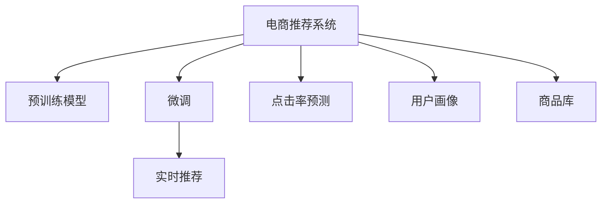

                 

# AI大模型在电商实时个性化推荐中的应用

> 关键词：AI大模型,电商推荐系统,实时个性化推荐,预训练模型,Transformer,BERT,微调,Fine-tuning

## 1. 背景介绍

### 1.1 问题由来
随着电商行业的蓬勃发展，个性化推荐系统的构建成为提升用户体验、提升转化率、增加收益的关键。传统的基于规则、基于内容的推荐算法逐渐显现出局限性，难以应对复杂多变的用户需求和海量商品数据。

与此同时，AI大模型在自然语言处理（NLP）领域的突破，带来了新的技术可能。预训练大模型如BERT、GPT-3等，通过在大规模语料上进行自监督预训练，学习到了丰富的语言知识和常识，具有强大的语言理解和生成能力。通过在电商推荐场景中进行微调（Fine-tuning），这些大模型能够显著提升推荐系统的个性化能力，更准确地预测用户对商品的需求，进而实现更有效的推荐。

### 1.2 问题核心关键点
AI大模型在电商推荐中的应用，核心在于利用预训练模型的强大表示能力，对电商场景中的用户行为和商品属性进行建模，从而进行实时个性化推荐。其关键技术包括：

- 预训练模型：如BERT、GPT等，通过在大规模语料上进行自监督预训练，学习到通用的语言表示。
- 微调：利用电商数据对预训练模型进行有监督的微调，使其学习到电商场景的特定知识。
- 实时推荐：结合用户行为数据、商品信息等实时输入，动态生成个性化推荐。

### 1.3 问题研究意义
在电商推荐场景中应用AI大模型，对于提升推荐系统的准确性和个性化程度，具有重要意义：

1. 提升用户体验：通过理解用户的自然语言描述和行为，推荐系统能够提供更贴近用户兴趣的商品，提高用户的购物体验。
2. 增加收益：个性化的推荐能够提高用户转化率和复购率，从而增加电商平台的收益。
3. 促进数据利用：大模型可以充分利用电商平台海量用户数据和商品信息，进行高效的二次开发和利用。
4. 降低开发成本：相比于从头开发推荐算法，使用大模型的微调技术，可以显著降低开发成本和时间投入。
5. 推动技术进步：电商推荐场景的复杂性和多样性，为AI大模型的优化和应用提供了广阔的空间，推动了技术的发展和应用。

## 2. 核心概念与联系

### 2.1 核心概念概述

为更好地理解AI大模型在电商推荐中的应用，本节将介绍几个密切相关的核心概念：

- 电商推荐系统：通过用户行为数据、商品信息等数据，预测用户对商品的需求，生成个性化推荐结果的系统。
- 预训练模型：如BERT、GPT等，通过在大规模语料上进行自监督预训练，学习通用的语言表示。
- 微调：利用电商数据对预训练模型进行有监督的微调，使其学习到电商场景的特定知识。
- 实时推荐：结合用户行为数据、商品信息等实时输入，动态生成个性化推荐。
- 点击率预测：通过模型预测用户点击某个商品的概率，从而进行排序和推荐。
- 用户画像：对用户兴趣、行为、属性等信息的综合描述，用于指导推荐模型的训练和优化。
- 商品库：包含商品的描述、属性、类别等信息，是推荐模型输入的基础。

这些核心概念之间的逻辑关系可以通过以下Mermaid流程图来展示：



这个流程图展示了大模型在电商推荐中的应用流程：

1. 电商推荐系统通过预训练模型学习通用语言表示。
2. 在电商数据上对预训练模型进行微调，学习电商场景的特定知识。
3. 结合用户行为数据、商品信息等实时输入，进行动态的个性化推荐。
4. 通过点击率预测模型，评估推荐效果，进一步优化推荐策略。
5. 利用用户画像和商品库，为推荐模型提供上下文信息，增强推荐效果。

## 3. 核心算法原理 & 具体操作步骤
### 3.1 算法原理概述

AI大模型在电商推荐中的应用，本质上是一个有监督的迁移学习过程。其核心思想是：利用预训练模型学习通用的语言表示，通过电商数据对其进行微调，使其学习到电商场景的特定知识，从而进行实时个性化推荐。

形式化地，假设预训练模型为 $M_{\theta}$，其中 $\theta$ 为预训练得到的模型参数。给定电商推荐任务的训练集 $D=\{(x_i, y_i)\}_{i=1}^N$，微调的目标是找到新的模型参数 $\hat{\theta}$，使得模型在电商场景中表现最佳。即：

$$
\hat{\theta}=\mathop{\arg\min}_{\theta} \mathcal{L}(M_{\theta},D)
$$

其中 $\mathcal{L}$ 为电商推荐任务的损失函数，用于衡量模型在电商场景中的预测性能。常见的电商推荐损失函数包括交叉熵损失、均方误差损失等。

通过梯度下降等优化算法，微调过程不断更新模型参数 $\theta$，最小化损失函数 $\mathcal{L}$，使得模型输出逼近真实标签。由于 $\theta$ 已经通过预训练获得了较好的初始化，因此即便在小规模电商数据集 $D$ 上进行微调，也能较快收敛到理想的模型参数 $\hat{\theta}$。

### 3.2 算法步骤详解

AI大模型在电商推荐中的微调一般包括以下几个关键步骤：

**Step 1: 准备预训练模型和数据集**
- 选择合适的预训练语言模型 $M_{\theta}$ 作为初始化参数，如 BERT、GPT等。
- 准备电商推荐任务的标注数据集 $D$，划分为训练集、验证集和测试集。一般要求标注数据与预训练数据的分布不要差异过大。

**Step 2: 添加任务适配层**
- 根据电商推荐任务的特征，在预训练模型顶层设计合适的输出层和损失函数。
- 对于点击率预测任务，通常在顶层添加线性分类器和交叉熵损失函数。
- 对于推荐排序任务，通常使用余弦相似度作为损失函数。

**Step 3: 设置微调超参数**
- 选择合适的优化算法及其参数，如 AdamW、SGD 等，设置学习率、批大小、迭代轮数等。
- 设置正则化技术及强度，包括权重衰减、Dropout、Early Stopping等。
- 确定冻结预训练参数的策略，如仅微调顶层，或全部参数都参与微调。

**Step 4: 执行梯度训练**
- 将训练集数据分批次输入模型，前向传播计算损失函数。
- 反向传播计算参数梯度，根据设定的优化算法和学习率更新模型参数。
- 周期性在验证集上评估模型性能，根据性能指标决定是否触发 Early Stopping。
- 重复上述步骤直到满足预设的迭代轮数或 Early Stopping 条件。

**Step 5: 测试和部署**
- 在测试集上评估微调后模型 $M_{\hat{\theta}}$ 的性能，对比微调前后的精度提升。
- 使用微调后的模型对新商品进行推荐预测，集成到实际的应用系统中。
- 持续收集新的用户行为数据，定期重新微调模型，以适应数据分布的变化。

以上是AI大模型在电商推荐场景中的微调流程。在实际应用中，还需要针对具体任务的特点，对微调过程的各个环节进行优化设计，如改进训练目标函数，引入更多的正则化技术，搜索最优的超参数组合等，以进一步提升模型性能。

### 3.3 算法优缺点

AI大模型在电商推荐中的微调方法具有以下优点：
1. 简单高效。只需准备少量标注数据，即可对预训练模型进行快速适配，获得较大的性能提升。
2. 通用适用。适用于各种电商推荐任务，包括点击率预测、推荐排序等，设计简单的任务适配层即可实现微调。
3. 参数高效。利用参数高效微调技术，在固定大部分预训练权重不变的情况下，仍可取得不错的提升。
4. 效果显著。在学术界和工业界的电商推荐任务上，基于微调的方法已经刷新了多项最先进的性能指标。

同时，该方法也存在一定的局限性：
1. 依赖标注数据。微调的效果很大程度上取决于标注数据的质量和数量，获取高质量标注数据的成本较高。
2. 迁移能力有限。当目标任务与预训练数据的分布差异较大时，微调的性能提升有限。
3. 负面效果传递。预训练模型的固有偏见、有害信息等，可能通过微调传递到下游任务，造成负面影响。
4. 可解释性不足。微调模型的决策过程通常缺乏可解释性，难以对其推理逻辑进行分析和调试。

尽管存在这些局限性，但就目前而言，基于监督学习的微调方法仍是大模型在电商推荐场景中的主流范式。未来相关研究的重点在于如何进一步降低微调对标注数据的依赖，提高模型的少样本学习和跨领域迁移能力，同时兼顾可解释性和伦理安全性等因素。

### 3.4 算法应用领域

AI大模型在电商推荐中的应用，已经在大规模电商公司中得到广泛应用，覆盖了从商品推荐、搜索排序、广告投放等多个电商场景中。例如：

- 商品推荐：根据用户历史行为数据，推荐用户可能感兴趣的商品。通过微调，模型能够更好地理解用户的兴趣和需求，提升推荐相关性和多样性。
- 搜索排序：在用户输入搜索关键词后，动态调整搜索结果的排序。通过微调，模型能够更准确地预测用户的点击行为，优化搜索结果展示。
- 广告投放：根据用户画像和行为数据，推荐最合适的广告。通过微调，模型能够提升广告的转化率和点击率，降低广告成本。

除了上述这些经典场景外，AI大模型在电商推荐中的应用还包括内容生成、智能客服、客户留存等多个方向，为电商公司提供了强大的技术支持。

## 4. 数学模型和公式 & 详细讲解  
### 4.1 数学模型构建

本节将使用数学语言对AI大模型在电商推荐中的应用进行更加严格的刻画。

记预训练语言模型为 $M_{\theta}$，其中 $\theta$ 为预训练得到的模型参数。假设电商推荐任务的训练集为 $D=\{(x_i, y_i)\}_{i=1}^N$，其中 $x_i$ 为电商数据，如用户行为记录、商品属性等，$y_i$ 为推荐结果，如点击率、推荐排名等。

定义模型 $M_{\theta}$ 在数据样本 $(x,y)$ 上的损失函数为 $\ell(M_{\theta}(x),y)$，则在数据集 $D$ 上的经验风险为：

$$
\mathcal{L}(\theta) = \frac{1}{N} \sum_{i=1}^N \ell(M_{\theta}(x_i),y_i)
$$

微调的优化目标是最小化经验风险，即找到最优参数：

$$
\theta^* = \mathop{\arg\min}_{\theta} \mathcal{L}(\theta)
$$

在实践中，我们通常使用基于梯度的优化算法（如SGD、Adam等）来近似求解上述最优化问题。设 $\eta$ 为学习率，$\lambda$ 为正则化系数，则参数的更新公式为：

$$
\theta \leftarrow \theta - \eta \nabla_{\theta}\mathcal{L}(\theta) - \eta\lambda\theta
$$

其中 $\nabla_{\theta}\mathcal{L}(\theta)$ 为损失函数对参数 $\theta$ 的梯度，可通过反向传播算法高效计算。

### 4.2 公式推导过程

以下我们以点击率预测任务为例，推导交叉熵损失函数及其梯度的计算公式。

假设模型 $M_{\theta}$ 在输入 $x$ 上的输出为 $\hat{y}=M_{\theta}(x) \in [0,1]$，表示用户点击某个商品的预测概率。真实标签 $y \in \{0,1\}$。则二分类交叉熵损失函数定义为：

$$
\ell(M_{\theta}(x),y) = -[y\log \hat{y} + (1-y)\log (1-\hat{y})]
$$

将其代入经验风险公式，得：

$$
\mathcal{L}(\theta) = -\frac{1}{N}\sum_{i=1}^N [y_i\log M_{\theta}(x_i)+(1-y_i)\log(1-M_{\theta}(x_i))]
$$

根据链式法则，损失函数对参数 $\theta_k$ 的梯度为：

$$
\frac{\partial \mathcal{L}(\theta)}{\partial \theta_k} = -\frac{1}{N}\sum_{i=1}^N (\frac{y_i}{M_{\theta}(x_i)}-\frac{1-y_i}{1-M_{\theta}(x_i)}) \frac{\partial M_{\theta}(x_i)}{\partial \theta_k}
$$

其中 $\frac{\partial M_{\theta}(x_i)}{\partial \theta_k}$ 可进一步递归展开，利用自动微分技术完成计算。

在得到损失函数的梯度后，即可带入参数更新公式，完成模型的迭代优化。重复上述过程直至收敛，最终得到适应电商推荐任务的最优模型参数 $\theta^*$。

## 5. 项目实践：代码实例和详细解释说明
### 5.1 开发环境搭建

在进行电商推荐微调实践前，我们需要准备好开发环境。以下是使用Python进行PyTorch开发的环境配置流程：

1. 安装Anaconda：从官网下载并安装Anaconda，用于创建独立的Python环境。

2. 创建并激活虚拟环境：
```bash
conda create -n pytorch-env python=3.8 
conda activate pytorch-env
```

3. 安装PyTorch：根据CUDA版本，从官网获取对应的安装命令。例如：
```bash
conda install pytorch torchvision torchaudio cudatoolkit=11.1 -c pytorch -c conda-forge
```

4. 安装Transformers库：
```bash
pip install transformers
```

5. 安装各类工具包：
```bash
pip install numpy pandas scikit-learn matplotlib tqdm jupyter notebook ipython
```

完成上述步骤后，即可在`pytorch-env`环境中开始电商推荐微调实践。

### 5.2 源代码详细实现

这里我们以点击率预测任务为例，给出使用Transformers库对BERT模型进行电商推荐微调的PyTorch代码实现。

首先，定义点击率预测任务的数据处理函数：

```python
from transformers import BertTokenizer
from torch.utils.data import Dataset
import torch

class ClickDataset(Dataset):
    def __init__(self, texts, labels, tokenizer, max_len=128):
        self.texts = texts
        self.labels = labels
        self.tokenizer = tokenizer
        self.max_len = max_len
        
    def __len__(self):
        return len(self.texts)
    
    def __getitem__(self, item):
        text = self.texts[item]
        label = self.labels[item]
        
        encoding = self.tokenizer(text, return_tensors='pt', max_length=self.max_len, padding='max_length', truncation=True)
        input_ids = encoding['input_ids'][0]
        attention_mask = encoding['attention_mask'][0]
        
        # 将标签转换为二元表示
        label = [1] if label == 'click' else [0]
        
        return {'input_ids': input_ids, 
                'attention_mask': attention_mask,
                'labels': torch.tensor(label, dtype=torch.long)}
```

然后，定义模型和优化器：

```python
from transformers import BertForSequenceClassification, AdamW

model = BertForSequenceClassification.from_pretrained('bert-base-cased', num_labels=2)

optimizer = AdamW(model.parameters(), lr=2e-5)
```

接着，定义训练和评估函数：

```python
from torch.utils.data import DataLoader
from tqdm import tqdm
from sklearn.metrics import roc_auc_score

device = torch.device('cuda') if torch.cuda.is_available() else torch.device('cpu')
model.to(device)

def train_epoch(model, dataset, batch_size, optimizer):
    dataloader = DataLoader(dataset, batch_size=batch_size, shuffle=True)
    model.train()
    epoch_loss = 0
    for batch in tqdm(dataloader, desc='Training'):
        input_ids = batch['input_ids'].to(device)
        attention_mask = batch['attention_mask'].to(device)
        labels = batch['labels'].to(device)
        model.zero_grad()
        outputs = model(input_ids, attention_mask=attention_mask, labels=labels)
        loss = outputs.loss
        epoch_loss += loss.item()
        loss.backward()
        optimizer.step()
    return epoch_loss / len(dataloader)

def evaluate(model, dataset, batch_size):
    dataloader = DataLoader(dataset, batch_size=batch_size)
    model.eval()
    preds, labels = [], []
    with torch.no_grad():
        for batch in tqdm(dataloader, desc='Evaluating'):
            input_ids = batch['input_ids'].to(device)
            attention_mask = batch['attention_mask'].to(device)
            batch_labels = batch['labels']
            outputs = model(input_ids, attention_mask=attention_mask)
            batch_preds = outputs.logits.argmax(dim=1).to('cpu').tolist()
            batch_labels = batch_labels.to('cpu').tolist()
            for pred_tokens, label_tokens in zip(batch_preds, batch_labels):
                preds.append(pred_tokens)
                labels.append(label_tokens)
                
    print('AUC: {:.4f}'.format(roc_auc_score(labels, preds)))
```

最后，启动训练流程并在测试集上评估：

```python
epochs = 5
batch_size = 16

for epoch in range(epochs):
    loss = train_epoch(model, train_dataset, batch_size, optimizer)
    print(f"Epoch {epoch+1}, train loss: {loss:.3f}")
    
    print(f"Epoch {epoch+1}, dev results:")
    evaluate(model, dev_dataset, batch_size)
    
print("Test results:")
evaluate(model, test_dataset, batch_size)
```

以上就是使用PyTorch对BERT进行电商推荐微调的完整代码实现。可以看到，得益于Transformers库的强大封装，我们可以用相对简洁的代码完成BERT模型的加载和微调。

### 5.3 代码解读与分析

让我们再详细解读一下关键代码的实现细节：

**ClickDataset类**：
- `__init__`方法：初始化文本、标签、分词器等关键组件。
- `__len__`方法：返回数据集的样本数量。
- `__getitem__`方法：对单个样本进行处理，将文本输入编码为token ids，将标签转换为二元表示，并对其进行定长padding，最终返回模型所需的输入。

**训练和评估函数**：
- 使用PyTorch的DataLoader对数据集进行批次化加载，供模型训练和推理使用。
- 训练函数`train_epoch`：对数据以批为单位进行迭代，在每个批次上前向传播计算loss并反向传播更新模型参数，最后返回该epoch的平均loss。
- 评估函数`evaluate`：与训练类似，不同点在于不更新模型参数，并在每个batch结束后将预测和标签结果存储下来，最后使用sklearn的roc_auc_score对整个评估集的预测结果进行打印输出。

**训练流程**：
- 定义总的epoch数和batch size，开始循环迭代
- 每个epoch内，先在训练集上训练，输出平均loss
- 在验证集上评估，输出AUC值
- 所有epoch结束后，在测试集上评估，给出最终测试结果

可以看到，PyTorch配合Transformers库使得BERT微调的代码实现变得简洁高效。开发者可以将更多精力放在数据处理、模型改进等高层逻辑上，而不必过多关注底层的实现细节。

当然，工业级的系统实现还需考虑更多因素，如模型的保存和部署、超参数的自动搜索、更灵活的任务适配层等。但核心的微调范式基本与此类似。

## 6. 实际应用场景
### 6.1 智能客服系统

基于大模型微调的电商推荐技术，可以广泛应用于智能客服系统的构建。传统客服往往需要配备大量人力，高峰期响应缓慢，且一致性和专业性难以保证。而使用微调后的推荐系统，可以7x24小时不间断服务，快速响应客户查询，用推荐结果指导客户选购。

在技术实现上，可以收集用户的历史查询记录和点击行为数据，将查询意图和推荐商品作为微调数据，训练模型学习匹配推荐。在客户查询时，实时调用推荐模型生成商品列表，辅助客服进行解答。对于客户提出的新问题，还可以接入检索系统实时搜索相关商品，动态生成推荐列表。如此构建的智能客服系统，能大幅提升客户查询体验和问题解决效率。

### 6.2 个性化推荐系统

当前的推荐系统往往只依赖用户的历史行为数据进行物品推荐，无法深入理解用户的真实兴趣偏好。基于大模型微调的推荐系统可以更好地挖掘用户行为背后的语义信息，从而提供更精准、多样的推荐内容。

在实践中，可以收集用户浏览、点击、评论、分享等行为数据，提取和用户交互的物品标题、描述、标签等文本内容。将文本内容作为模型输入，用户的后续行为（如是否点击、购买等）作为监督信号，在此基础上微调预训练语言模型。微调后的模型能够从文本内容中准确把握用户的兴趣点。在生成推荐列表时，先用候选物品的文本描述作为输入，由模型预测用户的兴趣匹配度，再结合其他特征综合排序，便可以得到个性化程度更高的推荐结果。

### 6.3 商品搜索排序

在用户输入搜索关键词后，电商推荐系统需要对搜索结果进行排序。传统的方法通常只依赖物品的相似度进行排序，难以捕捉到用户的意图和兴趣。基于大模型微调的推荐系统，可以通过用户查询记录、点击行为等数据，动态生成更符合用户兴趣的推荐列表。

具体而言，可以将用户的历史查询记录、搜索关键词作为模型输入，使用微调后的推荐模型预测点击率。根据预测结果对商品进行排序，并动态调整搜索结果展示。通过不断的微调和优化，推荐系统能够更加精准地捕捉用户需求，提升用户体验。

### 6.4 未来应用展望

随着大模型和微调方法的不断发展，电商推荐系统将在更多领域得到应用，为电商公司带来更大的价值。

在智慧零售领域，通过电商推荐系统可以实现个性化营销、库存管理、供应链优化等功能，提升零售商的整体运营效率。

在智能家居领域，基于推荐模型的智能音箱、智能电视等设备，可以提供个性化内容推荐、语音控制等智能服务，提升用户的生活体验。

在社交电商领域，推荐系统可以结合社交网络的数据，为用户提供更加个性化和精准的推荐，促进社区交流和商品分享。

此外，在健康医疗、金融理财、教育培训等多个领域，电商推荐技术都将发挥重要作用，推动数字化转型和智能化升级。相信随着技术的日益成熟，电商推荐系统必将成为电商公司的重要技术支撑，带来更大的商业价值。

## 7. 工具和资源推荐
### 7.1 学习资源推荐

为了帮助开发者系统掌握大模型在电商推荐中的应用，这里推荐一些优质的学习资源：

1. 《深度学习理论与实践》系列博文：由深度学习领域专家撰写，深入浅出地介绍了深度学习的基本原理和前沿技术，涵盖了预训练模型和微调等关键内容。

2. CS231n《深度学习计算机视觉》课程：斯坦福大学开设的计算机视觉明星课程，涵盖大规模图像数据的预训练模型，为电商推荐系统的视觉推荐提供理论基础。

3. 《Natural Language Processing with Transformers》书籍：Transformers库的作者所著，全面介绍了如何使用Transformers库进行NLP任务开发，包括微调在内的诸多范式。

4. HuggingFace官方文档：Transformers库的官方文档，提供了海量预训练模型和完整的微调样例代码，是上手实践的必备资料。

5. 《深度学习框架PyTorch》书籍：全面介绍了PyTorch框架的使用和深度学习模型的开发，适合电商推荐系统的项目实践。

通过对这些资源的学习实践，相信你一定能够快速掌握大模型在电商推荐中的应用精髓，并用于解决实际的电商推荐问题。
###  7.2 开发工具推荐

高效的开发离不开优秀的工具支持。以下是几款用于电商推荐微调开发的常用工具：

1. PyTorch：基于Python的开源深度学习框架，灵活动态的计算图，适合快速迭代研究。大部分预训练语言模型都有PyTorch版本的实现。

2. TensorFlow：由Google主导开发的开源深度学习框架，生产部署方便，适合大规模工程应用。同样有丰富的预训练语言模型资源。

3. Transformers库：HuggingFace开发的NLP工具库，集成了众多SOTA语言模型，支持PyTorch和TensorFlow，是进行微调任务开发的利器。

4. Weights & Biases：模型训练的实验跟踪工具，可以记录和可视化模型训练过程中的各项指标，方便对比和调优。与主流深度学习框架无缝集成。

5. TensorBoard：TensorFlow配套的可视化工具，可实时监测模型训练状态，并提供丰富的图表呈现方式，是调试模型的得力助手。

6. Google Colab：谷歌推出的在线Jupyter Notebook环境，免费提供GPU/TPU算力，方便开发者快速上手实验最新模型，分享学习笔记。

合理利用这些工具，可以显著提升电商推荐微调任务的开发效率，加快创新迭代的步伐。

### 7.3 相关论文推荐

大模型在电商推荐中的应用源于学界的持续研究。以下是几篇奠基性的相关论文，推荐阅读：

1. Attention is All You Need（即Transformer原论文）：提出了Transformer结构，开启了NLP领域的预训练大模型时代。

2. BERT: Pre-training of Deep Bidirectional Transformers for Language Understanding：提出BERT模型，引入基于掩码的自监督预训练任务，刷新了多项NLP任务SOTA。

3. Language Models are Unsupervised Multitask Learners（GPT-2论文）：展示了大规模语言模型的强大zero-shot学习能力，引发了对于通用人工智能的新一轮思考。

4. Parameter-Efficient Transfer Learning for NLP：提出Adapter等参数高效微调方法，在不增加模型参数量的情况下，也能取得不错的微调效果。

5. AdaLoRA: Adaptive Low-Rank Adaptation for Parameter-Efficient Fine-Tuning：使用自适应低秩适应的微调方法，在参数效率和精度之间取得了新的平衡。

这些论文代表了大模型在电商推荐中的应用的发展脉络。通过学习这些前沿成果，可以帮助研究者把握学科前进方向，激发更多的创新灵感。

## 8. 总结：未来发展趋势与挑战

### 8.1 总结

本文对基于监督学习的大模型在电商推荐中的应用进行了全面系统的介绍。首先阐述了电商推荐系统的背景和意义，明确了大模型微调在提升推荐系统性能方面的独特价值。其次，从原理到实践，详细讲解了电商推荐任务的数学模型和关键步骤，给出了电商推荐微调的完整代码实例。同时，本文还广泛探讨了电商推荐系统在多个领域的应用前景，展示了大模型微调技术的巨大潜力。

通过本文的系统梳理，可以看到，基于大模型的电商推荐系统在提升用户体验、增加收益、降低开发成本等方面具有重要意义。未来，伴随大模型和微调方法的持续演进，电商推荐系统必将在更广阔的电商领域得到广泛应用，带来新的商业价值和创新可能。

### 8.2 未来发展趋势

展望未来，大模型在电商推荐中的应用将呈现以下几个发展趋势：

1. 模型规模持续增大。随着算力成本的下降和数据规模的扩张，电商推荐系统的预训练语言模型参数量还将持续增长。超大规模语言模型蕴含的丰富语言知识，有望支撑更加复杂多变的电商推荐任务。

2. 微调方法日趋多样。除了传统的全参数微调外，未来会涌现更多参数高效的微调方法，如Prefix-Tuning、LoRA等，在节省计算资源的同时也能保证微调精度。

3. 持续学习成为常态。随着电商数据分布的变化，电商推荐系统也需要持续学习新知识以保持性能。如何在不遗忘原有知识的同时，高效吸收新样本信息，将成为重要的研究课题。

4. 标注样本需求降低。受启发于提示学习(Prompt-based Learning)的思路，未来的电商推荐系统将更好地利用大模型的语言理解能力，通过更加巧妙的任务描述，在更少的标注样本上也能实现理想的推荐效果。

5. 跨模态融合技术崛起。当前的电商推荐系统主要聚焦于文本数据，未来会进一步拓展到图像、视频、语音等多模态数据微调。多模态信息的融合，将显著提升推荐系统对现实世界的理解和建模能力。

6. 模型通用性增强。经过海量电商数据的预训练和多领域任务的微调，电商推荐模型将具备更强大的常识推理和跨领域迁移能力，逐步迈向通用人工智能(AGI)的目标。

以上趋势凸显了大模型在电商推荐中的应用前景。这些方向的探索发展，必将进一步提升电商推荐系统的性能和应用范围，为电商公司带来更大的商业价值。

### 8.3 面临的挑战

尽管大模型在电商推荐中的应用已经取得了瞩目成就，但在迈向更加智能化、普适化应用的过程中，它仍面临着诸多挑战：

1. 标注成本瓶颈。尽管微调可以显著降低标注数据的需求，但对于长尾应用场景，难以获得充足的高质量标注数据，成为制约微调性能的瓶颈。如何进一步降低微调对标注样本的依赖，将是一大难题。

2. 模型鲁棒性不足。当前电商推荐模型面对域外数据时，泛化性能往往大打折扣。对于测试样本的微小扰动，推荐模型的预测也容易发生波动。如何提高电商推荐模型的鲁棒性，避免灾难性遗忘，还需要更多理论和实践的积累。

3. 推理效率有待提高。大规模语言模型虽然精度高，但在实际部署时往往面临推理速度慢、内存占用大等效率问题。如何在保证性能的同时，简化模型结构，提升推理速度，优化资源占用，将是重要的优化方向。

4. 可解释性亟需加强。当前电商推荐模型通常缺乏可解释性，难以解释其内部工作机制和决策逻辑。对于医疗、金融等高风险应用，算法的可解释性和可审计性尤为重要。如何赋予电商推荐模型更强的可解释性，将是亟待攻克的难题。

5. 安全性有待保障。预训练语言模型难免会学习到有偏见、有害的信息，通过微调传递到下游任务，产生误导性、歧视性的输出，给实际应用带来安全隐患。如何从数据和算法层面消除模型偏见，避免恶意用途，确保输出的安全性，也将是重要的研究课题。

6. 知识整合能力不足。现有的电商推荐模型往往局限于电商数据，难以灵活吸收和运用更广泛的先验知识。如何让电商推荐过程更好地与外部知识库、规则库等专家知识结合，形成更加全面、准确的信息整合能力，还有很大的想象空间。

正视电商推荐系统面临的这些挑战，积极应对并寻求突破，将是大模型在电商推荐中走向成熟的必由之路。相信随着学界和产业界的共同努力，这些挑战终将一一被克服，大模型在电商推荐中的应用必将在构建人机协同的智能电商时代中扮演越来越重要的角色。

### 8.4 研究展望

面对电商推荐系统面临的挑战，未来的研究需要在以下几个方面寻求新的突破：

1. 探索无监督和半监督电商推荐方法。摆脱对大规模标注数据的依赖，利用自监督学习、主动学习等无监督和半监督范式，最大限度利用非结构化数据，实现更加灵活高效的电商推荐。

2. 研究参数高效和计算高效的电商推荐范式。开发更加参数高效的电商推荐方法，在固定大部分预训练参数的同时，只更新极少量的任务相关参数。同时优化电商推荐模型的计算图，减少前向传播和反向传播的资源消耗，实现更加轻量级、实时性的部署。

3. 融合因果和对比学习范式。通过引入因果推断和对比学习思想，增强电商推荐模型建立稳定因果关系的能力，学习更加普适、鲁棒的语言表征，从而提升模型泛化性和抗干扰能力。

4. 引入更多先验知识。将符号化的先验知识，如知识图谱、逻辑规则等，与神经网络模型进行巧妙融合，引导电商推荐过程学习更准确、合理的语言模型。同时加强不同模态数据的整合，实现视觉、语音等多模态信息与文本信息的协同建模。

5. 结合因果分析和博弈论工具。将因果分析方法引入电商推荐模型，识别出模型决策的关键特征，增强输出解释的因果性和逻辑性。借助博弈论工具刻画人机交互过程，主动探索并规避模型的脆弱点，提高系统稳定性。

6. 纳入伦理道德约束。在电商推荐模型训练目标中引入伦理导向的评估指标，过滤和惩罚有偏见、有害的输出倾向。同时加强人工干预和审核，建立电商推荐系统的监管机制，确保推荐结果符合人类价值观和伦理道德。

这些研究方向的探索，必将引领大模型在电商推荐中的应用走向更高的台阶，为电商公司提供更智能、更可靠、更安全的推荐服务。面向未来，大模型在电商推荐系统中的研究还需要与其他人工智能技术进行更深入的融合，如知识表示、因果推理、强化学习等，多路径协同发力，共同推动电商推荐系统的进步。只有勇于创新、敢于突破，才能不断拓展电商推荐系统的边界，让智能技术更好地服务电商行业。

## 9. 附录：常见问题与解答

**Q1：电商推荐系统是否适用于所有电商公司？**

A: 电商推荐系统适用于绝大多数电商公司，特别是那些拥有丰富用户数据和商品信息的平台。但对于一些规模较小、数据量有限的电商公司，可能需要根据具体情况进行调整和优化。

**Q2：电商推荐系统对数据质量要求高吗？**

A: 电商推荐系统对数据质量要求较高，因为模型的训练和预测效果很大程度上依赖于数据的质量和丰富程度。高质量的数据可以提高推荐系统的准确性和鲁棒性，降低过拟合风险。

**Q3：电商推荐系统在用户隐私保护方面需要注意哪些问题？**

A: 电商推荐系统需要处理大量用户数据，因此用户隐私保护是一个重要问题。在系统设计和开发中，需要采取数据脱敏、差分隐私等技术手段，确保用户数据的安全和匿名性。

**Q4：电商推荐系统如何应对数据分布变化？**

A: 电商推荐系统需要定期重新训练模型，以适应数据分布的变化。对于数据量的变化、新商品的出现等，可以通过小批量微调或增量学习等方法，快速更新模型，保持其性能。

**Q5：电商推荐系统是否需要实时更新？**

A: 电商推荐系统需要实时更新，以捕捉最新的用户行为和市场变化。实时更新可以基于流式数据进行处理，从而实现快速响应和推荐。

通过本文的系统梳理，可以看到，基于大模型的电商推荐系统在提升用户体验、增加收益、降低开发成本等方面具有重要意义。未来，伴随大模型和微调方法的持续演进，电商推荐系统必将在更广阔的电商领域得到广泛应用，带来新的商业价值和创新可能。

