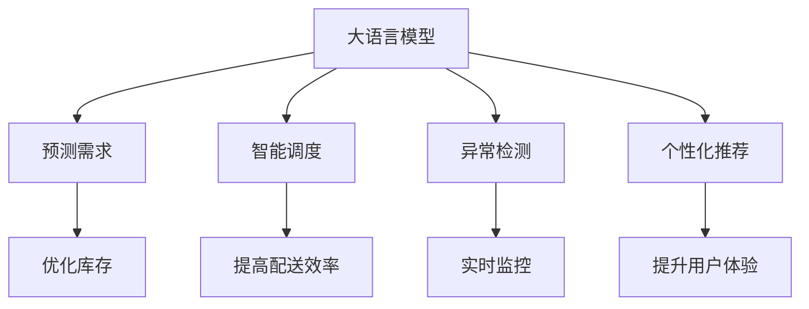

                 

# AI大模型在电商平台供应链优化中的应用

## 1. 背景介绍

### 1.1 问题由来
随着电子商务平台的迅猛发展，供应链管理的复杂性和多样性日益凸显。传统的手工管理方式效率低下，且无法实时监控和动态调整，已经无法满足现代电商企业的快速发展和多样化需求。因此，探索和应用人工智能技术，特别是大语言模型，来优化供应链管理，成为了电商企业的迫切需求。

### 1.2 问题核心关键点
大语言模型在电商平台供应链优化中的主要应用点包括：

1. **预测需求**：利用大语言模型预测产品需求，优化库存管理，减少库存积压和缺货风险。
2. **智能调度**：通过模型优化订单调度，提升物流效率，降低配送成本。
3. **异常检测**：应用大语言模型进行供应链风险监控，及时发现并应对供应链异常。
4. **个性化推荐**：根据用户行为和需求，提供精准的个性化产品推荐，提升用户体验。

### 1.3 问题研究意义
研究大语言模型在电商平台供应链优化中的应用，对于提升电商企业的运营效率、降低成本、提升客户满意度具有重要意义：

1. **提升运营效率**：通过智能预测和调度，电商平台可以更有效地管理库存和物流，缩短订单处理时间，提高整体运营效率。
2. **降低成本**：优化库存和配送，减少因库存积压、缺货和异常导致的损失，显著降低供应链运营成本。
3. **提升用户体验**：通过个性化推荐，电商平台可以更好地满足用户需求，提升用户粘性和满意度，增加销售额。

## 2. 核心概念与联系

### 2.1 核心概念概述

为更好地理解大语言模型在电商平台供应链优化中的应用，本节将介绍几个密切相关的核心概念：

- **大语言模型(Large Language Model, LLM)**：如BERT、GPT等，通过自监督或监督学习任务训练的通用语言模型。具备强大的自然语言理解和生成能力，能够处理复杂的信息和逻辑关系。
- **供应链管理**：指从供应商到客户的全流程管理，包括库存、采购、生产、物流、配送等环节。
- **预测需求**：利用大语言模型预测未来的需求量，指导库存和物流决策。
- **智能调度**：利用模型优化订单和物流路径，提高配送效率。
- **异常检测**：应用模型监控供应链各环节的异常情况，及时预警和干预。
- **个性化推荐**：根据用户行为数据，推荐符合用户需求的个性化产品。

这些核心概念之间的逻辑关系可以通过以下Mermaid流程图来展示：



这个流程图展示了大语言模型在电商平台供应链优化中的核心应用：

1. 大语言模型通过预测需求、智能调度和异常检测，支持库存和物流的优化。
2. 个性化推荐则通过提升用户体验，增强客户粘性，间接提升电商平台的销售额和市场竞争力。

## 3. 核心算法原理 & 具体操作步骤

### 3.1 算法原理概述

大语言模型在电商平台供应链优化中的核心应用是通过自然语言处理和机器学习技术，对供应链各环节的数据进行分析、预测和优化。其基本原理如下：

- **预测需求**：利用大语言模型对历史销售数据和市场趋势进行分析，预测未来产品需求量。
- **智能调度**：通过模型优化订单和配送路径，提高配送效率和减少物流成本。
- **异常检测**：应用模型监控供应链环节，及时发现异常情况，如物流延迟、库存不足等，并采取相应措施。
- **个性化推荐**：根据用户行为和偏好，通过模型生成个性化的产品推荐，提升用户体验。

这些应用均基于大语言模型对自然语言的强大理解和生成能力，通过模型学习和推理，实现供应链各环节的优化和提升。

### 3.2 算法步骤详解

基于大语言模型在电商平台供应链优化中的核心应用，我们可以将算法步骤分为以下几个关键步骤：

**Step 1: 数据预处理**
- 收集和整理电商平台的历史销售数据、库存数据、物流数据等，作为模型训练的输入数据。
- 清洗和标准化数据，去除噪声和不完整数据。

**Step 2: 模型训练与预测**
- 选择合适的模型架构，如BERT、GPT等，进行预训练或微调。
- 将预处理后的数据输入模型，训练得到预测模型。
- 利用模型对未来的需求、物流路径和异常情况进行预测。

**Step 3: 结果应用**
- 根据预测结果，调整库存和物流策略。
- 实时监控供应链环节，及时发现和处理异常。
- 生成个性化的产品推荐，提升用户体验。

**Step 4: 模型评估与优化**
- 在实际应用中，定期评估模型性能，优化模型参数和训练数据。
- 应用最新的数据和算法技术，提升模型的准确性和泛化能力。

### 3.3 算法优缺点

大语言模型在电商平台供应链优化中的应用，具有以下优点：

1. **预测准确性高**：大语言模型具备强大的自然语言处理能力，能够精准预测市场需求，优化库存管理。
2. **调度优化能力强**：通过模型优化订单和配送路径，显著提高配送效率和降低物流成本。
3. **异常检测高效**：模型能够实时监控供应链环节，及时发现异常情况，保障供应链的稳定性。
4. **个性化推荐精准**：根据用户行为和偏好，提供个性化的产品推荐，提升用户体验和销售额。

同时，该方法也存在以下局限性：

1. **依赖高质量数据**：预测和调度的准确性高度依赖于数据的质量和完整性。
2. **模型复杂度高**：大语言模型参数量庞大，需要高性能计算资源支持。
3. **可解释性不足**：模型内部决策过程复杂，难以解释和调试。
4. **成本高**：构建和维护大语言模型系统需要较高的技术门槛和资源投入。

尽管存在这些局限性，但就目前而言，大语言模型在电商平台供应链优化中的应用范式，仍是最为先进和有效的方法之一。未来相关研究的重点在于如何进一步降低模型成本，提高模型可解释性，同时兼顾数据的实时性和鲁棒性等因素。

### 3.4 算法应用领域

大语言模型在电商平台供应链优化中的应用，已经在诸多领域得到了广泛的应用，例如：

- **电商平台库存管理**：通过预测需求，优化库存量，减少库存积压和缺货风险。
- **物流配送优化**：利用模型优化订单和配送路径，提高配送效率和降低成本。
- **供应链异常监控**：通过实时监控供应链环节，及时发现并应对异常情况，保障供应链稳定性。
- **个性化推荐系统**：根据用户行为数据，提供个性化的产品推荐，提升用户粘性和满意度。
- **需求预测与市场分析**：利用模型预测市场趋势和产品需求，指导电商平台的采购和促销策略。

这些应用涵盖了电商平台的供应链管理的多个环节，有效提升了电商企业的运营效率和市场竞争力。

## 4. 数学模型和公式 & 详细讲解 & 举例说明

### 4.1 数学模型构建

为了更精确地理解和应用大语言模型在电商平台供应链优化中的预测需求功能，我们假设电商平台销售某一产品 $i$ 在时间 $t$ 的销售量 $D_i(t)$ 和历史销售量 $D_i(t-\tau)$ 之间存在线性关系，模型为：

$$
D_i(t) = \alpha + \beta D_i(t-\tau) + \epsilon_i(t)
$$

其中 $\alpha$ 为截距，$\beta$ 为斜率，$\epsilon_i(t)$ 为随机误差项。在实际应用中，$\alpha$ 和 $\beta$ 可以通过大语言模型训练得到，模型结构为：

$$
\hat{\beta} = \mathop{\arg\min}_{\beta} \sum_{t=1}^T [y_i(t)-\alpha - \beta y_i(t-\tau)]^2
$$

其中 $y_i(t)=D_i(t)$ 为实际销售量，$y_i(t-\tau)$ 为历史销售量，$T$ 为历史数据集的时间跨度。

### 4.2 公式推导过程

对于上述线性回归模型，使用最小二乘法求解 $\beta$ 的最优解为：

$$
\hat{\beta} = \frac{\sum_{t=1}^T (y_i(t)-\alpha - \beta y_i(t-\tau))(y_i(t)-\alpha)}{\sum_{t=1}^T (y_i(t)-\alpha)^2}
$$

令 $\hat{\alpha} = \bar{y}_i - \hat{\beta} \bar{y}_i$，其中 $\bar{y}_i = \frac{1}{T} \sum_{t=1}^T y_i(t)$，则模型为：

$$
\hat{y}_i(t) = \hat{\alpha} + \hat{\beta} y_i(t-\tau)
$$

通过训练得到 $\hat{\alpha}$ 和 $\hat{\beta}$，即可预测未来某一时间点 $t$ 的销售量 $\hat{y}_i(t)$。

### 4.3 案例分析与讲解

以某电商平台的某产品的销售数据为例，我们假设模型在 $t-1$ 到 $t-30$ 的销售数据为输入，预测 $t+1$ 到 $t+30$ 的销售量。模型训练步骤如下：

1. 收集并清洗历史销售数据 $D_i(t-\tau)$ 和实际销售量 $y_i(t)$。
2. 利用大语言模型训练 $\alpha$ 和 $\beta$，得到预测模型 $\hat{y}_i(t)$。
3. 应用模型预测 $t+1$ 到 $t+30$ 的销售量，并根据预测结果调整库存和物流策略。

通过以上步骤，电商平台可以更精准地预测未来销售量，优化库存管理和物流调度，提升运营效率。

## 5. 项目实践：代码实例和详细解释说明

### 5.1 开发环境搭建

在进行供应链优化实践前，我们需要准备好开发环境。以下是使用Python进行PyTorch开发的环境配置流程：

1. 安装Anaconda：从官网下载并安装Anaconda，用于创建独立的Python环境。

2. 创建并激活虚拟环境：
```bash
conda create -n pytorch-env python=3.8 
conda activate pytorch-env
```

3. 安装PyTorch：根据CUDA版本，从官网获取对应的安装命令。例如：
```bash
conda install pytorch torchvision torchaudio cudatoolkit=11.1 -c pytorch -c conda-forge
```

4. 安装TensorFlow：
```bash
pip install tensorflow
```

5. 安装各类工具包：
```bash
pip install numpy pandas scikit-learn matplotlib tqdm jupyter notebook ipython
```

完成上述步骤后，即可在`pytorch-env`环境中开始供应链优化实践。

### 5.2 源代码详细实现

下面我们以电商平台库存管理为例，给出使用TensorFlow进行线性回归的PyTorch代码实现。

首先，定义线性回归模型：

```python
import tensorflow as tf

class LinearRegressionModel(tf.keras.Model):
    def __init__(self, input_dim, output_dim):
        super(LinearRegressionModel, self).__init__()
        self.linear_layer = tf.keras.layers.Dense(output_dim)
        
    def call(self, x):
        return self.linear_layer(x)
```

然后，定义数据预处理和模型训练函数：

```python
def preprocess_data(data):
    # 数据归一化
    return (data - data.mean()) / data.std()

def train_model(model, train_data, epochs, batch_size):
    # 数据加载器
    train_dataset = tf.data.Dataset.from_tensor_slices((train_data['features'], train_data['targets']))
    train_dataset = train_dataset.shuffle(buffer_size=10000).batch(batch_size).repeat()
    
    # 损失函数和优化器
    loss_fn = tf.keras.losses.MeanSquaredError()
    optimizer = tf.keras.optimizers.Adam()
    
    # 模型训练
    for epoch in range(epochs):
        total_loss = 0.0
        for batch in train_dataset:
            features, targets = batch
            with tf.GradientTape() as tape:
                predictions = model(features)
                loss = loss_fn(targets, predictions)
            grads = tape.gradient(loss, model.trainable_variables)
            optimizer.apply_gradients(zip(grads, model.trainable_variables))
            total_loss += loss
        print(f"Epoch {epoch+1}, loss: {total_loss/n}")
    
    return model
```

最后，启动训练流程：

```python
epochs = 100
batch_size = 32

# 加载数据
train_data = pandas.read_csv('sales_data.csv')
train_data['features'] = preprocess_data(train_data.drop(columns=['target']))
train_data['targets'] = train_data['target']
train_data = train_data.drop(columns=['target'])

# 创建模型
model = LinearRegressionModel(input_dim=train_data['features'].shape[1], output_dim=1)

# 训练模型
train_model(model, train_data, epochs, batch_size)
```

以上就是使用TensorFlow进行线性回归的完整代码实现。可以看到，TensorFlow提供了丰富的工具和接口，使得模型训练和应用变得高效便捷。

### 5.3 代码解读与分析

让我们再详细解读一下关键代码的实现细节：

**LinearRegressionModel类**：
- `__init__`方法：初始化线性层，作为模型的输出层。
- `call`方法：前向传播计算模型的输出。

**preprocess_data函数**：
- 对输入数据进行归一化处理，使模型训练更加稳定。

**train_model函数**：
- 创建数据加载器，将数据集批处理并打乱，重复遍历。
- 定义损失函数和优化器，并使用梯度下降优化模型参数。
- 在每个epoch内，对每个batch进行前向传播和反向传播，更新模型参数。
- 计算并输出每个epoch的平均损失。

**训练流程**：
- 定义总epoch数和批大小，启动循环训练。
- 加载训练数据，进行数据归一化处理。
- 创建线性回归模型。
- 调用训练函数，训练模型。

可以看出，TensorFlow提供了高效的数据处理和模型训练工具，使得供应链优化的模型开发和应用变得简单快捷。

当然，工业级的系统实现还需考虑更多因素，如模型的保存和部署、超参数的自动搜索、更灵活的任务适配层等。但核心的线性回归范式基本与此类似。

## 6. 实际应用场景

### 6.1 智能仓储管理

基于大语言模型的线性回归模型，电商平台的智能仓储管理可以实现库存的实时监控和优化。通过预测需求，电商平台可以动态调整库存量，避免库存积压和缺货，提升仓储效率。

在技术实现上，可以构建一个实时监控系统，将每个商品的历史销售数据输入模型，预测未来的需求量，并根据需求量调整库存。同时，系统还可以实时监测仓库的实时库存情况，通过告警机制及时发现库存异常，优化库存管理。

### 6.2 物流配送优化

通过线性回归模型，电商平台可以对订单进行智能调度，优化物流配送路径，提高配送效率。模型可以根据历史配送数据和订单信息，预测配送路径的最优时间，调整配送策略。

在实践过程中，可以应用模型预测各个配送点的时间，生成最优的配送路径。系统还可以实时监测配送进度，通过告警机制及时处理异常，保障配送的准时性和效率。

### 6.3 供应链风险监控

利用线性回归模型，电商平台可以实时监控供应链各环节的风险情况，及时预警并采取措施。模型可以根据历史供应链数据，预测可能出现的风险点，如物流延迟、供应商违约等，并通过告警机制通知相关人员。

在实际应用中，系统可以实时监测供应链的关键节点，如供应商交付、物流运输等。一旦发现异常情况，系统立即生成告警信息，通知相关人员进行处理，避免风险扩散，保障供应链的稳定性。

### 6.4 个性化推荐系统

基于线性回归模型，电商平台可以生成个性化的产品推荐，提升用户体验。模型可以根据用户的历史购买记录和浏览行为，预测用户对某产品的兴趣，生成推荐列表。

在实际应用中，系统可以实时分析用户的行为数据，预测用户对某产品的兴趣程度，生成个性化的推荐列表。同时，系统还可以通过告警机制，实时监测用户的反馈情况，动态调整推荐策略，提高推荐的精准性。

## 7. 工具和资源推荐

### 7.1 学习资源推荐

为了帮助开发者系统掌握大语言模型在电商平台供应链优化中的应用，这里推荐一些优质的学习资源：

1. TensorFlow官方文档：TensorFlow的官方文档，提供详细的API和教程，适合初学者快速上手。
2. PyTorch官方文档：PyTorch的官方文档，提供丰富的模型和工具库，适合进阶学习。
3. Coursera《TensorFlow深度学习》课程：由Google提供的深度学习课程，涵盖TensorFlow的核心概念和应用。
4. Udacity《深度学习专项》课程：涵盖深度学习的基础知识和实践技能，适合系统学习。
5. Kaggle数据科学竞赛：通过参与实际数据竞赛，提升模型训练和优化能力。

通过对这些资源的学习实践，相信你一定能够快速掌握大语言模型在供应链优化中的核心应用，并用于解决实际的电商问题。

### 7.2 开发工具推荐

高效的开发离不开优秀的工具支持。以下是几款用于大语言模型在供应链优化应用的常用工具：

1. Jupyter Notebook：一个免费的开源工具，支持代码编写、数据可视化、模型训练等功能，适合快速迭代实验。
2. TensorBoard：TensorFlow的可视化工具，实时监控模型训练状态，提供丰富的图表展示。
3. Weights & Biases：模型训练的实验跟踪工具，记录和可视化模型训练过程中的各项指标，方便对比和调优。
4. Apache Kafka：一个分布式流处理平台，用于实时数据采集和传输，适合大规模数据处理。
5. Apache Spark：一个大数据处理引擎，支持实时数据处理和分析，适合大规模数据应用。

合理利用这些工具，可以显著提升供应链优化模型的开发效率，加快创新迭代的步伐。

### 7.3 相关论文推荐

大语言模型在电商平台供应链优化中的应用，已经在诸多领域得到了广泛的研究。以下是几篇奠基性的相关论文，推荐阅读：

1. "Deep Learning for Predictive Maintenance and Fault Diagnosis in Industrial Systems"：利用深度学习技术进行预测性维护和故障诊断，提升供应链的可靠性。
2. "Supply Chain Optimization with Machine Learning"：利用机器学习技术优化供应链各环节，提高物流效率和成本控制。
3. "Neural Network-Based Demand Forecasting for Retail Supply Chain"：利用神经网络模型预测零售供应链的需求，优化库存和配送策略。
4. "A Survey on Machine Learning Applications in Supply Chain Management"：综述了机器学习在供应链管理中的应用，包括预测、调度、风险监控等多个方面。

这些论文代表了大语言模型在供应链优化领域的发展脉络。通过学习这些前沿成果，可以帮助研究者把握学科前进方向，激发更多的创新灵感。

## 8. 总结：未来发展趋势与挑战

### 8.1 总结

本文对大语言模型在电商平台供应链优化中的应用进行了全面系统的介绍。首先阐述了供应链管理和大语言模型的核心概念，明确了预测需求、智能调度和异常检测等核心应用的价值。其次，从原理到实践，详细讲解了线性回归模型的构建和应用步骤，给出了供应链优化任务的完整代码实例。同时，本文还广泛探讨了模型在智能仓储、物流配送、风险监控和个性化推荐等多个场景中的应用，展示了大语言模型的强大潜力。

通过本文的系统梳理，可以看到，大语言模型在电商平台供应链优化中的核心应用，已经在多个领域得到广泛应用，显著提升了电商企业的运营效率和市场竞争力。未来，伴随大语言模型和线性回归方法的持续演进，相信电商供应链管理将更加智能化、精细化和高效化，进一步推动电商行业的数字化转型。

### 8.2 未来发展趋势

展望未来，大语言模型在电商平台供应链优化中的应用将呈现以下几个发展趋势：

1. **预测准确性提升**：随着模型结构和算法的不断优化，预测需求的准确性将进一步提升，帮助电商平台更精准地管理库存和物流。
2. **智能调度优化**：通过更复杂的调度算法，系统将能够更高效地处理订单和配送，降低物流成本。
3. **风险监控智能化**：利用机器学习和大数据技术，系统将能够实时监控供应链风险，及时预警并采取措施，保障供应链的稳定性。
4. **个性化推荐精准化**：基于更深层次的个性化分析，推荐系统将能够更精准地匹配用户需求，提升用户体验和销售额。
5. **多模态数据融合**：将图像、视频、语音等多模态数据与文本数据结合，提升供应链的全面感知能力。
6. **区块链技术应用**：利用区块链技术保障供应链数据的透明性和安全性，提升供应链的可信度和可靠性。

以上趋势凸显了大语言模型在电商平台供应链优化中的广阔前景。这些方向的探索发展，必将进一步提升供应链的智能化和自动化水平，为电商行业带来更多的创新和机遇。

### 8.3 面临的挑战

尽管大语言模型在电商平台供应链优化中的应用已经取得了显著进展，但在迈向更加智能化、普适化应用的过程中，仍面临诸多挑战：

1. **数据质量瓶颈**：供应链管理涉及多方面的数据，数据的完整性和准确性直接影响模型的预测效果。
2. **模型复杂性**：大语言模型参数量大，需要高性能计算资源支持，模型的训练和优化复杂度较高。
3. **可解释性不足**：模型内部决策过程复杂，难以解释和调试，影响模型的可信度和可控性。
4. **实时性要求高**：供应链管理需要实时数据处理和响应，模型的实时性要求高，系统架构和部署需要优化。
5. **成本控制**：构建和维护大语言模型系统需要较高的技术门槛和资源投入，成本控制是一个重要挑战。
6. **隐私和安全**：供应链管理涉及大量敏感数据，模型的隐私和安全保护需要加强，防止数据泄露和滥用。

正视大语言模型在供应链优化中面临的这些挑战，积极应对并寻求突破，将是大语言模型供应链优化走向成熟的必由之路。相信随着学界和产业界的共同努力，这些挑战终将一一被克服，大语言模型在电商平台供应链优化中的应用必将在未来更加广泛和深入。

### 8.4 研究展望

面对大语言模型在电商平台供应链优化中面临的种种挑战，未来的研究需要在以下几个方面寻求新的突破：

1. **数据质量提升**：探索高效的数据清洗和处理技术，提升数据的质量和完整性，保障模型预测的准确性。
2. **模型简化和压缩**：开发更轻量级的模型架构和压缩算法，提高模型的实时性和可部署性。
3. **可解释性和透明性**：引入可解释性技术和工具，提高模型的透明度和可信度，保障供应链的可控性。
4. **多模态数据融合**：结合图像、视频、语音等多模态数据，提升供应链的全面感知和决策能力。
5. **区块链技术应用**：利用区块链技术保障供应链数据的透明性和安全性，提升供应链的可信度和可靠性。
6. **自动化和智能化**：探索更高效的自动化和智能化方法，提升供应链管理的智能化水平。

这些研究方向的探索，必将引领大语言模型在电商平台供应链优化中的应用走向更高的台阶，为电商行业带来更多的创新和机遇。总之，大语言模型在供应链优化中具有广阔的应用前景，但其应用效果还依赖于多方面的技术突破和优化，未来需继续探索和实践。

## 9. 附录：常见问题与解答

**Q1：大语言模型在供应链优化中的应用是否适用于所有电商企业？**

A: 大语言模型在供应链优化中的应用具有较强的通用性，但具体应用效果还需考虑电商企业的规模、产品特性、运营模式等因素。一般来说，业务规模较大、数据量丰富的电商企业更适合应用大语言模型。

**Q2：大语言模型在供应链优化中如何处理数据缺失和噪声？**

A: 大语言模型对数据的缺失和噪声有一定的鲁棒性，但数据的完整性和准确性仍然对模型预测有重要影响。可以通过数据清洗、插值等方法处理数据缺失和噪声，提升模型训练效果。同时，引入机器学习和大数据技术，可以更好地处理复杂的数据问题。

**Q3：大语言模型在供应链优化中如何平衡模型的实时性和准确性？**

A: 在实际应用中，需要根据具体场景和需求，平衡模型的实时性和准确性。一般可以通过以下方法：
1. 调整模型的参数和结构，提高模型的实时性。
2. 引入缓存和分布式计算技术，提升数据处理和模型推理的速度。
3. 设置合理的模型参数和算法，避免过拟合和欠拟合问题。

**Q4：大语言模型在供应链优化中如何保证数据隐私和安全？**

A: 在供应链优化中，数据隐私和安全是一个重要问题。可以采用以下方法：
1. 数据加密和匿名化处理，保护用户隐私。
2. 采用区块链技术，确保供应链数据的透明性和不可篡改性。
3. 引入隐私保护算法，如差分隐私等，保障数据的安全性和可用性。

**Q5：大语言模型在供应链优化中如何结合实时数据和历史数据？**

A: 大语言模型在供应链优化中可以结合实时数据和历史数据，提高预测的准确性和可靠性。具体方法包括：
1. 利用历史数据进行模型训练和预测，结合实时数据进行动态调整。
2. 引入时间序列分析和预测模型，结合实时数据进行动态优化。
3. 应用机器学习和深度学习技术，对历史数据和实时数据进行综合分析，提升预测效果。

这些方法可以帮助电商平台在供应链优化中更好地结合历史和实时数据，提升运营效率和用户体验。

---

作者：禅与计算机程序设计艺术 / Zen and the Art of Computer Programming

